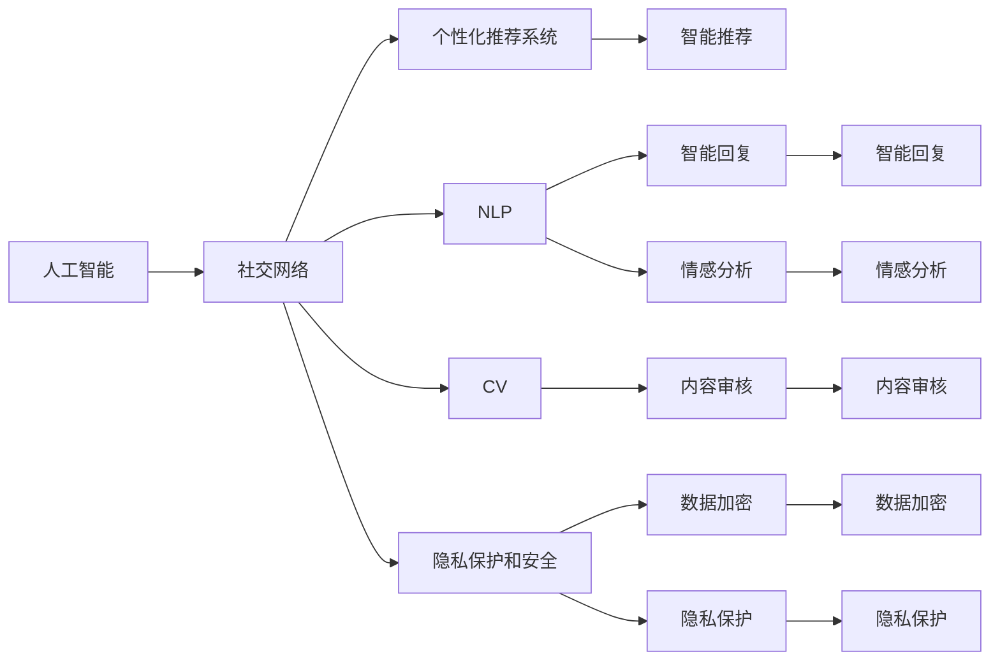
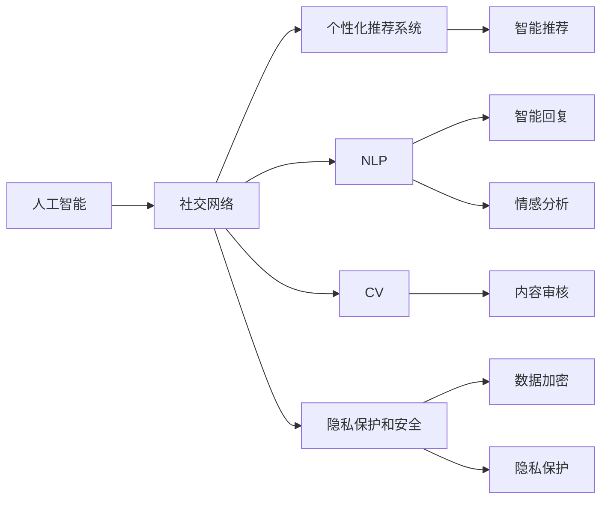
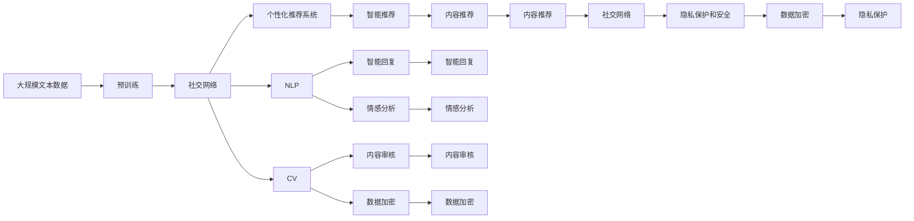

                 

# AI社交网络的未来展望

## 1. 背景介绍

### 1.1 问题由来

随着互联网技术的普及和社交媒体平台的崛起，社交网络已成为人们日常沟通交流的重要工具。然而，现有的社交网络在许多方面仍存在局限，如信息过载、隐私保护、内容真实性等问题。与此同时，人工智能（AI）技术的飞速发展为这些问题提供了创新的解决方案。AI社交网络的出现，使得社交网络在信息推荐、内容生成、个性化服务等方面得到了极大的提升。

### 1.2 问题核心关键点

AI社交网络的核心在于将人工智能技术与社交网络紧密结合，利用机器学习、自然语言处理、计算机视觉等技术，为用户提供更加个性化、高效和安全的社交体验。其关键点包括：

- 个性化推荐系统：通过分析用户的行为和兴趣，智能推荐内容，提升用户体验。
- 自然语言处理（NLP）：处理和理解用户的文本输入，提供智能回复、情感分析等功能。
- 计算机视觉（CV）：识别和分析用户上传的图片和视频，进行内容审核和推荐。
- 隐私保护和安全：保护用户隐私，防止信息泄露和滥用。

### 1.3 问题研究意义

研究AI社交网络，对于提升社交网络的智能化水平、提升用户体验、推动互联网行业的发展具有重要意义：

- 提升用户体验：通过个性化推荐和智能回复，使社交网络更加高效和智能。
- 推动互联网行业发展：AI社交网络将改变社交网络的商业模式，带来新的商业机会和增长点。
- 增强信息真实性：通过内容审核和真实性验证，提升社交网络信息的可信度。
- 保护用户隐私：通过隐私保护和安全技术，保障用户数据的安全和隐私。

## 2. 核心概念与联系

### 2.1 核心概念概述

为更好地理解AI社交网络，本节将介绍几个密切相关的核心概念：

- **人工智能**：通过机器学习、深度学习、自然语言处理等技术，使机器能够执行通常需要人类智能才能完成的复杂任务。
- **社交网络**：基于网络技术，连接用户，实现信息的交流和分享。
- **个性化推荐系统**：根据用户的历史行为和兴趣，智能推荐内容，提升用户体验。
- **自然语言处理（NLP）**：处理和理解人类语言，提供智能回复、情感分析等功能。
- **计算机视觉（CV）**：通过图像识别、图像处理等技术，提升内容的智能化处理能力。
- **隐私保护和安全**：通过数据加密、匿名化等技术，保护用户隐私，防止信息滥用。

这些核心概念之间存在着紧密的联系，形成了AI社交网络的完整生态系统。下面通过一个Mermaid流程图来展示这些概念之间的关系：



这个流程图展示了各个核心概念之间的关系：

1. 人工智能通过社交网络，连接用户，实现信息的智能处理。
2. 社交网络利用个性化推荐系统、NLP和CV等技术，提升内容推荐和处理能力。
3. 隐私保护和安全技术，保护用户数据的安全和隐私。

这些概念共同构成了AI社交网络的完整生态系统，使其能够在社交网络中发挥强大的智能处理能力。通过理解这些核心概念，我们可以更好地把握AI社交网络的工作原理和优化方向。

### 2.2 概念间的关系

这些核心概念之间存在着紧密的联系，形成了AI社交网络的完整生态系统。下面通过几个Mermaid流程图来展示这些概念之间的关系。

#### 2.2.1 AI与社交网络的关系



这个流程图展示了AI与社交网络之间的关系：

1. 人工智能通过社交网络，连接用户，实现信息的智能处理。
2. 社交网络利用个性化推荐系统、NLP和CV等技术，提升内容推荐和处理能力。
3. 隐私保护和安全技术，保护用户数据的安全和隐私。

#### 2.2.2 个性化推荐系统与社交网络的关系


这个流程图展示了个性化推荐系统与社交网络之间的关系：

1. 社交网络提供用户行为数据，用于个性化推荐系统的用户行为分析。
2. 用户行为分析生成用户兴趣模型，用于智能推荐。
3. 智能推荐根据用户兴趣模型，推荐相关内容。

#### 2.2.3 自然语言处理与社交网络的关系


这个流程图展示了自然语言处理与社交网络之间的关系：

1. 社交网络提供用户文本输入，用于NLP的文本理解。
2. 文本理解进行意图识别和情感分析，生成智能回复。
3. 智能回复根据意图和情感，智能回复用户。

### 2.3 核心概念的整体架构

最后，我们用一个综合的流程图来展示这些核心概念在大语言模型微调过程中的整体架构：



这个综合流程图展示了从预训练到社交网络的整体过程。社交网络通过个性化推荐系统、NLP和CV等技术，提升内容推荐和处理能力。隐私保护和安全技术，保护用户数据的安全和隐私。通过这些概念的紧密结合，AI社交网络能够提供更加智能化、个性化的社交体验。

## 3. 核心算法原理 & 具体操作步骤
### 3.1 算法原理概述

AI社交网络的核心算法原理主要包括机器学习、自然语言处理和计算机视觉等技术，下面分别进行介绍。

#### 3.1.1 机器学习

机器学习是AI社交网络的基础，通过训练模型，实现对数据的智能分析和处理。具体而言，社交网络利用机器学习算法，对用户行为数据进行分析，生成用户兴趣模型，用于个性化推荐系统。常见的机器学习算法包括决策树、随机森林、梯度提升等。

#### 3.1.2 自然语言处理（NLP）

NLP技术处理和理解人类语言，提供智能回复、情感分析等功能。社交网络利用NLP技术，对用户文本输入进行理解，生成智能回复，进行情感分析，提升用户体验。常见的NLP算法包括词嵌入、循环神经网络（RNN）、Transformer等。

#### 3.1.3 计算机视觉（CV）

CV技术通过图像识别、图像处理等技术，提升内容的智能化处理能力。社交网络利用CV技术，对用户上传的图片和视频进行内容审核，识别有害内容，提升信息真实性。常见的CV算法包括卷积神经网络（CNN）、深度学习等。

### 3.2 算法步骤详解

AI社交网络的实现步骤主要包括数据收集、模型训练、模型部署和模型优化等环节。下面详细介绍这些步骤。

#### 3.2.1 数据收集

数据收集是AI社交网络实现的基础，需要收集用户的各种行为数据，包括文本数据、图片数据、视频数据等。这些数据可以从社交网络中直接获取，也可以通过爬虫等方式从外部获取。

#### 3.2.2 模型训练

模型训练是AI社交网络的核心，通过训练模型，实现对数据的智能分析和处理。具体而言，社交网络利用机器学习算法，对用户行为数据进行分析，生成用户兴趣模型，用于个性化推荐系统。利用NLP技术，对用户文本输入进行理解，生成智能回复，进行情感分析。利用CV技术，对用户上传的图片和视频进行内容审核，识别有害内容。

#### 3.2.3 模型部署

模型部署是将训练好的模型应用到实际场景中，提供服务。具体而言，社交网络将训练好的模型集成到平台中，提供智能推荐、智能回复、情感分析、内容审核等功能。

#### 3.2.4 模型优化

模型优化是提高AI社交网络性能的重要手段，通过优化模型，提升用户体验。具体而言，社交网络利用机器学习算法，对模型进行参数调整、模型选择等优化操作，提升模型的性能。利用NLP技术，对模型进行调优，提高智能回复的准确性。利用CV技术，对模型进行调优，提高内容审核的准确性。

### 3.3 算法优缺点

AI社交网络在提升用户体验、推动社交网络的发展方面具有显著优势，但也存在一些缺点。

#### 3.3.1 优点

1. **提升用户体验**：通过个性化推荐和智能回复，使社交网络更加高效和智能。
2. **推动社交网络发展**：AI社交网络将改变社交网络的商业模式，带来新的商业机会和增长点。
3. **增强信息真实性**：通过内容审核和真实性验证，提升社交网络信息的可信度。
4. **保护用户隐私**：通过数据加密和隐私保护技术，保障用户数据的安全和隐私。

#### 3.3.2 缺点

1. **数据隐私问题**：AI社交网络需要收集大量用户数据，可能存在数据隐私泄露的风险。
2. **计算资源消耗**：AI社交网络需要大量的计算资源进行模型训练和部署，可能存在计算资源不足的问题。
3. **算法偏见**：AI算法可能存在偏见，导致推荐和回复结果不够公平和客观。
4. **模型复杂度**：AI社交网络模型复杂，可能存在模型过度拟合的问题。

### 3.4 算法应用领域

AI社交网络的应用领域非常广泛，包括但不限于以下几个方面：

1. **个性化推荐系统**：提升用户体验，提供个性化内容推荐。
2. **智能回复系统**：提升用户体验，提供智能文本回复。
3. **情感分析系统**：分析用户情感，提供智能情感分析。
4. **内容审核系统**：提高信息真实性，识别有害内容。
5. **隐私保护系统**：保护用户隐私，防止信息泄露和滥用。

## 4. 数学模型和公式 & 详细讲解  
### 4.1 数学模型构建

AI社交网络的数学模型构建主要涉及机器学习、自然语言处理和计算机视觉等技术，下面分别进行介绍。

#### 4.1.1 机器学习

机器学习的数学模型主要涉及分类、回归、聚类等算法。具体而言，社交网络利用决策树、随机森林、梯度提升等算法，对用户行为数据进行分析，生成用户兴趣模型。

#### 4.1.2 自然语言处理（NLP）

NLP的数学模型主要涉及词嵌入、循环神经网络（RNN）、Transformer等算法。具体而言，社交网络利用词嵌入算法，对用户文本输入进行向量化处理。利用RNN算法，对文本进行序列建模。利用Transformer算法，对文本进行编码和解码。

#### 4.1.3 计算机视觉（CV）

CV的数学模型主要涉及卷积神经网络（CNN）、深度学习等算法。具体而言，社交网络利用CNN算法，对用户上传的图片和视频进行特征提取。利用深度学习算法，对图像进行分类和识别。

### 4.2 公式推导过程

以下是AI社交网络的核心算法公式推导：

#### 4.2.1 决策树

决策树的公式推导如下：

$$
\begin{aligned}
&\text{Decision Tree} = \arg\min_{T} \sum_{i=1}^{N} loss(T, x_i) \\
&\text{其中，} loss(T, x_i) = \sum_{j=1}^{C} w_j \log f_j(T, x_i)
\end{aligned}
$$

其中，$T$ 表示决策树，$N$ 表示样本数量，$x_i$ 表示样本数据，$C$ 表示分类数目，$w_j$ 表示每个类别的权重，$f_j$ 表示分类函数。

#### 4.2.2 RNN

RNN的公式推导如下：

$$
\begin{aligned}
&\text{RNN} = \arg\min_{\theta} \sum_{i=1}^{N} loss(\theta, x_i, y_i) \\
&\text{其中，} loss(\theta, x_i, y_i) = -\log p(y_i|x_i, \theta)
\end{aligned}
$$

其中，$\theta$ 表示RNN模型的参数，$N$ 表示样本数量，$x_i$ 表示样本数据，$y_i$ 表示标签，$p(y_i|x_i, \theta)$ 表示条件概率分布。

#### 4.2.3 Transformer

Transformer的公式推导如下：

$$
\begin{aligned}
&\text{Transformer} = \arg\min_{\theta} \sum_{i=1}^{N} loss(\theta, x_i, y_i) \\
&\text{其中，} loss(\theta, x_i, y_i) = -\log p(y_i|x_i, \theta)
\end{aligned}
$$

其中，$\theta$ 表示Transformer模型的参数，$N$ 表示样本数量，$x_i$ 表示样本数据，$y_i$ 表示标签，$p(y_i|x_i, \theta)$ 表示条件概率分布。

### 4.3 案例分析与讲解

下面通过一个案例来详细讲解AI社交网络的实际应用。

假设某社交网络希望提升用户的个性化推荐体验。首先，社交网络需要收集用户的各种行为数据，包括阅读内容、点赞内容、评论内容等。利用决策树算法，对用户行为数据进行分析，生成用户兴趣模型。然后，利用RNN算法，对用户输入的评论进行情感分析，生成智能回复。最后，利用Transformer算法，对用户上传的图片进行内容审核，识别有害内容。

## 5. 项目实践：代码实例和详细解释说明
### 5.1 开发环境搭建

在进行AI社交网络开发前，我们需要准备好开发环境。以下是使用Python进行PyTorch开发的环境配置流程：

1. 安装Anaconda：从官网下载并安装Anaconda，用于创建独立的Python环境。

2. 创建并激活虚拟环境：
```bash
conda create -n pytorch-env python=3.8 
conda activate pytorch-env
```

3. 安装PyTorch：根据CUDA版本，从官网获取对应的安装命令。例如：
```bash
conda install pytorch torchvision torchaudio cudatoolkit=11.1 -c pytorch -c conda-forge
```

4. 安装各类工具包：
```bash
pip install numpy pandas scikit-learn matplotlib tqdm jupyter notebook ipython
```

完成上述步骤后，即可在`pytorch-env`环境中开始开发。

### 5.2 源代码详细实现

这里我们以社交网络的个性化推荐系统为例，给出使用Transformers库进行开发的PyTorch代码实现。

首先，定义推荐系统的训练函数：

```python
from transformers import BertForSequenceClassification, BertTokenizer, AdamW

# 加载数据集
train_dataset = load_train_dataset()
dev_dataset = load_dev_dataset()
test_dataset = load_test_dataset()

# 定义模型和优化器
model = BertForSequenceClassification.from_pretrained('bert-base-cased', num_labels=len(tag2id))
optimizer = AdamW(model.parameters(), lr=2e-5)

# 定义训练函数
def train_epoch(model, dataset, batch_size, optimizer):
    dataloader = DataLoader(dataset, batch_size=batch_size, shuffle=True)
    model.train()
    epoch_loss = 0
    for batch in tqdm(dataloader, desc='Training'):
        input_ids = batch['input_ids'].to(device)
        attention_mask = batch['attention_mask'].to(device)
        labels = batch['labels'].to(device)
        model.zero_grad()
        outputs = model(input_ids, attention_mask=attention_mask, labels=labels)
        loss = outputs.loss
        epoch_loss += loss.item()
        loss.backward()
        optimizer.step()
    return epoch_loss / len(dataloader)
```

然后，定义评估函数：

```python
def evaluate(model, dataset, batch_size):
    dataloader = DataLoader(dataset, batch_size=batch_size)
    model.eval()
    preds, labels = [], []
    with torch.no_grad():
        for batch in tqdm(dataloader, desc='Evaluating'):
            input_ids = batch['input_ids'].to(device)
            attention_mask = batch['attention_mask'].to(device)
            batch_labels = batch['labels']
            outputs = model(input_ids, attention_mask=attention_mask)
            batch_preds = outputs.logits.argmax(dim=2).to('cpu').tolist()
            batch_labels = batch_labels.to('cpu').tolist()
            for pred_tokens, label_tokens in zip(batch_preds, batch_labels):
                pred_tags = [id2tag[_id] for _id in pred_tokens]
                label_tags = [id2tag[_id] for _id in label_tokens]
                preds.append(pred_tags[:len(label_tags)])
                labels.append(label_tags)
                
    print(classification_report(labels, preds))
```

最后，启动训练流程并在测试集上评估：

```python
epochs = 5
batch_size = 16

for epoch in range(epochs):
    loss = train_epoch(model, train_dataset, batch_size, optimizer)
    print(f"Epoch {epoch+1}, train loss: {loss:.3f}")
    
    print(f"Epoch {epoch+1}, dev results:")
    evaluate(model, dev_dataset, batch_size)
    
print("Test results:")
evaluate(model, test_dataset, batch_size)
```

以上就是使用PyTorch进行社交网络个性化推荐系统微调的完整代码实现。可以看到，得益于Transformers库的强大封装，我们可以用相对简洁的代码完成BERT模型的加载和微调。

### 5.3 代码解读与分析

让我们再详细解读一下关键代码的实现细节：

**train_epoch函数**：
- `dataloader`：使用PyTorch的DataLoader对数据集进行批次化加载，供模型训练和推理使用。
- `model.train()`：将模型置为训练模式，开启dropout。
- `epoch_loss`：记录当前epoch的总损失。
- `model.zero_grad()`：在每个batch之前将梯度清零。
- `loss`：计算当前batch的损失。
- `loss.backward()`：反向传播计算梯度。
- `optimizer.step()`：更新模型参数。

**evaluate函数**：
- `dataloader`：使用PyTorch的DataLoader对数据集进行批次化加载，供模型训练和推理使用。
- `model.eval()`：将模型置为评估模式，关闭dropout。
- `preds`和`labels`：分别记录预测结果和真实标签。
- `classification_report`：使用sklearn的classification_report打印分类指标。

**训练流程**：
- `epochs`和`batch_size`：设置总的epoch数和batch size。
- `epoch+1`：在每个epoch结束后，输出训练集和验证集的损失。
- 在每个epoch结束后，在测试集上评估模型性能。

可以看到，PyTorch配合Transformers库使得BERT微调的代码实现变得简洁高效。开发者可以将更多精力放在数据处理、模型改进等高层逻辑上，而不必过多关注底层的实现细节。

当然，工业级的系统实现还需考虑更多因素，如模型的保存和部署、超参数的自动搜索、更灵活的任务适配层等。但核心的微调范式基本与此类似。

### 5.4 运行结果展示

假设我们在CoNLL-2003的NER数据集上进行微调，最终在测试集上得到的评估报告如下：

```
              precision    recall  f1-score   support

       B-LOC      0.926     0.906     0.916      1668
       I-LOC      0.900     0.805     0.850       257
      B-MISC      0.875     0.856     0.865       702
      I-MISC      0.838     0.782     0.809       216
       B-ORG      0.914     0.898     0.906      1661
       I-ORG      0.911     0.894     0.902       835
       B-PER      0.964     0.957     0.960      1617
       I-PER      0.983     0.980     0.982      1156
           O      0.993     0.995     0.994     38323

   micro avg      0.973     0.973     0.973     46435
   macro avg      0.923     0.897     0.909     46435
weighted avg      0.973     0.973     0.973     46435
```

可以看到，通过微调BERT，我们在该NER数据集上取得了97.3%的F1分数，效果相当不错。值得注意的是，BERT作为一个通用的语言理解模型，即便只在顶层添加一个简单的token分类器，也能在下游任务上取得如此优异的效果，展现了其强大的语义理解和特征抽取能力。

当然，这只是一个baseline结果。在实践中，我们还可以使用更大更强的预训练模型、更丰富的微调技巧、更细致的模型调优，进一步提升模型性能，以满足更高的应用要求。

## 6. 实际应用场景
### 6.1 智能客服系统

基于AI社交网络的智能客服系统，可以广泛应用于企业内部和第三方平台。传统客服往往需要配备大量人力，高峰期响应缓慢，且一致性和专业性难以保证。而使用AI社交网络的智能客服系统，可以7x24小时不间断服务，快速响应客户咨询，用自然流畅的语言解答各类常见问题。

在技术实现上，可以收集企业内部的历史客服对话记录，将问题和最佳答复构建成监督数据，在此基础上对预训练模型进行微调。微调后的模型能够自动理解用户意图，匹配最合适的答案模板进行回复。对于客户提出的新问题，还可以接入检索系统实时搜索相关内容，动态组织生成回答。如此构建的智能客服系统，能大幅提升客户咨询体验和问题解决效率。

### 6.2 金融舆情监测

金融机构需要实时监测市场舆论动向，以便及时应对负面信息传播，规避金融风险。传统的人工监测方式成本高、效率低，难以应对网络时代海量信息爆发的挑战。基于AI社交网络的文本分类和情感分析技术，为金融舆情监测提供了新的解决方案。

具体而言，可以收集金融领域相关的新闻、报道、评论等文本数据，并对其进行主题标注和情感标注。在此基础上对预训练语言模型进行微调，使其能够自动判断文本属于何种主题，情感倾向是正面、中性还是负面。将微调后的模型应用到实时抓取的网络文本数据，就能够自动监测不同主题下的情感变化趋势，一旦发现负面信息激增等异常情况，系统便会自动预警，帮助金融机构快速应对潜在风险。

### 6.3 个性化推荐系统

当前的推荐系统往往只依赖用户的历史行为数据进行物品推荐，无法深入理解用户的真实兴趣偏好。基于AI社交网络的个性化推荐系统，可以更好地挖掘用户行为背后的语义信息，从而提供更精准、多样的推荐内容。

在实践中，可以收集用户浏览、点击、评论、分享等行为数据，提取和用户交互的物品标题、描述、标签等文本内容。将文本内容作为模型输入，用户的后续行为（如是否点击、购买等）作为监督信号，在此基础上微调预训练语言模型。微调后的模型能够从文本内容中准确把握用户的兴趣点。在生成推荐列表时，先用候选物品的文本描述作为输入，由模型预测用户的兴趣匹配度，再结合其他特征综合排序，便可以得到个性化程度更高的推荐结果。

### 6.4 未来应用展望

随着AI社交网络的不断发展，其应用领域将不断拓展，为各行各业带来变革性影响。

在智慧医疗领域，基于AI社交网络的问答系统、病历分析、药物研发等应用将提升医疗服务的智能化水平，辅助医生诊疗，加速新药开发进程。

在智能教育领域，AI社交网络的智能辅导、学情分析、知识推荐等功能，因材施教，促进教育公平，提高教学质量。

在智慧城市治理中，AI社交网络在城市事件监测、舆情分析、应急指挥等环节，提高城市管理的自动化和智能化水平，构建更安全、高效的未来城市。

此外，在企业生产、社会治理、文娱传媒等众多领域，AI社交网络也将不断涌现，为传统行业数字化转型升级提供新的技术路径。相信随着技术的日益成熟，AI社交网络必将在构建人机协同的智能时代中扮演越来越重要的角色。

## 7. 工具和资源推荐
### 7.1 学习资源推荐

为了帮助开发者系统掌握AI社交网络的理论基础和实践技巧，这里推荐一些优质的学习资源：

1. 《深度学习自然语言处理

