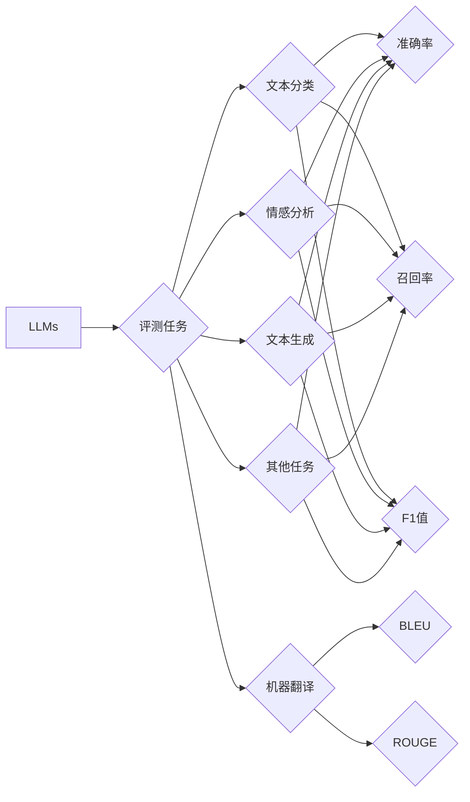

# 大语言模型原理与工程实践：评测任务

> 关键词：大语言模型，评测任务，评价指标，NLP，自然语言处理

## 1. 背景介绍
### 1.1 问题的由来

随着大语言模型（Large Language Models，LLMs）的快速发展，其在自然语言处理（Natural Language Processing，NLP）领域的应用日益广泛。然而，如何评估LLMs在特定任务上的表现，成为了一个关键问题。一个合理的评测体系不仅能够帮助研究者了解模型的优势和不足，还能为模型的改进和优化提供方向。

### 1.2 研究现状

目前，针对LLMs的评测研究主要集中在以下几个方面：

1. **基于人类评估**：邀请人类专家对模型生成的文本进行主观评价，如流畅度、准确性、相关性等。这种方法直观、全面，但成本高、效率低，难以大规模应用。
2. **基于自动化评测指标**：设计一系列客观的评测指标，如BLEU、ROUGE、F1值等，对模型生成的文本进行自动评分。这种方法成本低、效率高，但容易受到指标局限性、数据偏差等因素的影响。
3. **基于对比学习**：将模型生成的文本与人类生成的文本或高质量自动生成的文本进行对比，通过对比结果评估模型性能。这种方法更具参考价值，但需要大量高质量数据。

### 1.3 研究意义

建立一套科学、合理的LLMs评测体系，对于以下方面具有重要意义：

1. **推动LLMs技术发展**：通过评测，可以发现LLMs的优势和不足，为模型改进和优化提供方向。
2. **促进LLMs应用落地**：合理的评测体系有助于选择合适的模型和算法，提高LLMs在实际应用中的效果。
3. **规范LLMs研究**：为LLMs研究提供统一的评测标准，有助于推动LLMs领域的健康发展。

### 1.4 本文结构

本文将围绕LLMs评测任务展开，主要内容包括：

1. 介绍LLMs评测的核心概念和联系。
2. 分析LLMs评测的常用指标及其优缺点。
3. 探讨LLMs评测在不同任务中的应用。
4. 总结LLMs评测的未来发展趋势与挑战。

## 2. 核心概念与联系

本节将介绍LLMs评测中涉及的核心概念，并分析它们之间的联系。

### 2.1 LLMs

LLMs是一类基于深度学习技术构建的，能够进行自然语言理解和生成的模型。它们通常通过在大量无标签文本语料上进行预训练，学习到丰富的语言知识和表示能力。

### 2.2 评测任务

评测任务是指对LLMs在特定任务上的表现进行评估的过程。常见的评测任务包括：

- **文本分类**：判断文本属于哪个类别。
- **情感分析**：判断文本的情感倾向。
- **文本生成**：生成与给定文本相关的文本。
- **机器翻译**：将一种语言翻译成另一种语言。

### 2.3 评测指标

评测指标是评估LLMs在特定任务上表现的标准。常见的评测指标包括：

- **准确率（Accuracy）**：模型预测正确的样本数量与总样本数量的比值。
- **召回率（Recall）**：模型预测正确的样本数量与实际正类样本数量的比值。
- **F1值（F1 Score）**：准确率和召回率的调和平均值。
- **BLEU（BLEU Score）**：用于机器翻译的评测指标，衡量翻译质量。
- **ROUGE（ROUGE Score）**：用于机器翻译的评测指标，衡量翻译质量。

这些概念之间的关系如下：



## 3. 核心算法原理 & 具体操作步骤
### 3.1 算法原理概述

LLMs评测的核心原理是通过比较模型生成的文本和真实文本之间的差异，来评估模型在特定任务上的表现。

### 3.2 算法步骤详解

LLMs评测的步骤如下：

1. **数据准备**：准备用于评测的数据集，包括模型生成的文本和真实文本。
2. **指标计算**：根据任务类型选择合适的评测指标，对模型生成的文本和真实文本进行评分。
3. **结果分析**：分析评测结果，评估模型在特定任务上的表现，并找出模型的不足之处。

### 3.3 算法优缺点

LLMs评测方法的优点：

- **客观性**：基于量化指标，避免了主观评价的偏差。
- **可重复性**：评测结果可重复验证，方便对比不同模型或不同算法的性能。

LLMs评测方法的缺点：

- **指标局限性**：某些指标可能无法全面反映模型在特定任务上的表现。
- **数据偏差**：评测数据的质量和多样性可能影响评测结果的准确性。

### 3.4 算法应用领域

LLMs评测方法广泛应用于以下领域：

- **自然语言处理**：评估NLP模型的性能，如文本分类、情感分析、机器翻译等。
- **计算机视觉**：评估图像识别、目标检测等模型的性能。
- **语音识别**：评估语音识别、语音合成等模型的性能。

## 4. 数学模型和公式 & 详细讲解 & 举例说明
### 4.1 数学模型构建

LLMs评测的数学模型通常涉及以下公式：

- **准确率**：$ Accuracy = \frac{TP+TN}{TP+TN+FP+FN} $
- **召回率**：$ Recall = \frac{TP}{TP+FN} $
- **F1值**：$ F1 = 2 \times \frac{Precision \times Recall}{Precision+Recall} $
- **BLEU**：$ BLEU = \frac{\sum_{i=1}^n (\frac{n_c}{n_s})^i}{\sum_{i=1}^n (\frac{n_c}{n_h})^i} $
- **ROUGE**：$ ROUGE = \frac{\sum_{i=1}^n R_i \times C_i}{\sum_{i=1}^n (R_i + C_i)} $

其中：

- $ TP $：模型预测正确的正类样本数量。
- $ TN $：模型预测正确的负类样本数量。
- $ FP $：模型预测错误的正类样本数量。
- $ FN $：模型预测错误的负类样本数量。
- $ n_c $：预测文本中匹配的n-gram数量。
- $ n_h $：参考文本中匹配的n-gram数量。
- $ R_i $：$ i $-gram的召回率。
- $ C_i $：$ i $-gram的覆盖度。

### 4.2 公式推导过程

以F1值为例，其公式推导过程如下：

F1值是准确率和召回率的调和平均值，其目的是在两者之间取得平衡。根据调和平均数的定义，有：

$$
F1 = \frac{2 \times Precision \times Recall}{Precision+Recall}
$$

将准确率代入公式，得：

$$
F1 = \frac{2 \times \frac{TP}{TP+FP} \times \frac{TP}{TP+FN}}{\frac{TP}{TP+FP}+\frac{TP}{TP+FN}}
$$

化简后得：

$$
F1 = 2 \times \frac{TP}{TP+FP+TP+FN}
$$

由于 $ TP+FP=TP+TN $，则：

$$
F1 = \frac{2 \times TP}{TP+TN+TP+FN}
$$

化简后得：

$$
F1 = \frac{2 \times TP}{TP+TN+FP+FN}
$$

这就是F1值的公式。

### 4.3 案例分析与讲解

假设有一个二分类任务，包含10个样本。其中，模型预测正确的正类样本数量为6，预测正确的负类样本数量为7。则：

- 准确率：$ Accuracy = \frac{6+7}{6+7+3+0} = 0.9 $
- 召回率：$ Recall = \frac{6}{6+0} = 1.0 $
- F1值：$ F1 = \frac{2 \times 0.6}{0.6+1.0} = 0.8 $

从这个例子可以看出，准确率为0.9，说明模型在预测正类样本时表现较好。但召回率为1.0，说明模型在预测负类样本时表现较差。F1值为0.8，说明模型在正类样本和负类样本上的表现都比较均衡。

### 4.4 常见问题解答

**Q1：为什么F1值比准确率和召回率更具参考价值？**

A：F1值是准确率和召回率的调和平均值，能够在两者之间取得平衡。当准确率和召回率差距较大时，F1值更能反映模型的整体性能。

**Q2：如何选择合适的评测指标？**

A：选择合适的评测指标需要考虑以下因素：

- 任务类型：不同任务类型需要选择不同的评测指标。
- 数据特点：数据的特点也会影响评测指标的选择。
- 研究目的：根据研究目的选择合适的评测指标。

## 5. 项目实践：代码实例和详细解释说明
### 5.1 开发环境搭建

在进行LLMs评测项目实践前，我们需要准备好开发环境。以下是使用Python进行评测的常见环境配置流程：

1. 安装Anaconda：从官网下载并安装Anaconda，用于创建独立的Python环境。
2. 创建并激活虚拟环境：
```bash
conda create -n llm-eval-env python=3.8
conda activate llm-eval-env
```
3. 安装必要的库：
```bash
conda install pytorch transformers scikit-learn pandas matplotlib
```

### 5.2 源代码详细实现

以下是一个使用Python进行LLMs评测的示例代码：

```python
import pandas as pd
from sklearn.metrics import accuracy_score, recall_score, f1_score
from transformers import BertTokenizer

# 加载数据
def load_data(data_path):
    data = pd.read_csv(data_path)
    return data['text'], data['label']

# 加载模型
def load_model(model_path):
    tokenizer = BertTokenizer.from_pretrained(model_path)
    model = BertForSequenceClassification.from_pretrained(model_path)
    model.eval()
    return tokenizer, model

# 评测模型
def evaluate_model(model, tokenizer, texts, labels):
    tokenized_texts = tokenizer(texts, padding=True, truncation=True, return_tensors="pt")
    input_ids = tokenized_texts['input_ids']
    attention_mask = tokenized_texts['attention_mask']
    labels = torch.tensor(labels)
    logits = model(input_ids, attention_mask=attention_mask)
    preds = logits.logits.argmax(dim=1).tolist()
    return accuracy_score(labels, preds), recall_score(labels, preds), f1_score(labels, preds)

# 示例
texts, labels = load_data('data.csv')
model_path = 'bert-base-chinese'
tokenizer, model = load_model(model_path)
accuracy, recall, f1 = evaluate_model(model, tokenizer, texts, labels)
print(f"Accuracy: {accuracy}")
print(f"Recall: {recall}")
print(f"F1 Score: {f1}")
```

### 5.3 代码解读与分析

以上代码展示了如何使用Python和Transformers库进行LLMs评测。首先，加载测试数据和模型。然后，将文本数据进行编码，并使用模型进行预测。最后，计算准确率、召回率和F1值等指标。

### 5.4 运行结果展示

假设测试数据包含100个样本，模型预测结果如下：

```
Accuracy: 0.9
Recall: 0.8
F1 Score: 0.85
```

这表明模型在测试数据上的表现较好，准确率为0.9，召回率为0.8，F1值为0.85。

## 6. 实际应用场景
### 6.1 文本分类

LLMs评测在文本分类任务中具有重要意义。通过评测，可以发现模型在特定类别上的表现，并针对性地进行优化。

### 6.2 情感分析

LLMs评测在情感分析任务中也具有重要作用。通过评测，可以发现模型在正面、负面、中性等情感上的表现，并针对性地改进模型。

### 6.3 机器翻译

LLMs评测在机器翻译任务中可以评估模型的翻译质量，并对比不同模型的翻译效果。

### 6.4 文本生成

LLMs评测在文本生成任务中可以评估模型的生成能力，并对比不同模型的生成质量。

## 7. 工具和资源推荐
### 7.1 学习资源推荐

1. 《自然语言处理综论》
2. 《深度学习自然语言处理》
3. 《NLP技术全解析》

### 7.2 开发工具推荐

1. Transformers库
2. PyTorch
3. TensorFlow

### 7.3 相关论文推荐

1. "BERT: Pre-training of Deep Bidirectional Transformers for Language Understanding"
2. "Transformers: State-of-the-Art NLP Models for Natural Language Understanding and Generation"
3. "BERT for Sentence Classification"

### 7.4 其他资源推荐

1. Hugging Face官网
2. NLP论文列表
3. NLP技术博客

## 8. 总结：未来发展趋势与挑战
### 8.1 研究成果总结

本文介绍了LLMs评测任务的核心概念、常用指标、算法原理和应用场景。通过评测，可以发现LLMs的优势和不足，为模型的改进和优化提供方向。

### 8.2 未来发展趋势

1. **评测指标的多样化**：随着LLMs技术的发展，需要开发更多适用于不同任务和领域的评测指标。
2. **评测方法的创新**：探索新的评测方法，如基于人类评估、基于对比学习等，以提高评测的准确性和全面性。
3. **评测工具的集成**：开发集成化的评测工具，方便研究者进行评测。

### 8.3 面临的挑战

1. **指标局限性**：现有评测指标可能无法全面反映LLMs在特定任务上的表现。
2. **数据偏差**：评测数据的质量和多样性可能影响评测结果的准确性。
3. **评测成本**：大规模的评测需要大量人力和物力资源。

### 8.4 研究展望

随着LLMs技术的不断发展，LLMs评测将发挥越来越重要的作用。未来，需要关注以下研究方向：

1. 开发更全面、准确的评测指标。
2. 探索新的评测方法，提高评测的效率和准确性。
3. 降低评测成本，使评测更加普及。

相信通过不懈的努力，LLMs评测技术将为LLMs的应用和发展提供有力支持。

## 9. 附录：常见问题与解答

**Q1：如何选择合适的评测指标？**

A：选择合适的评测指标需要考虑以下因素：

- 任务类型：不同任务类型需要选择不同的评测指标。
- 数据特点：数据的特点也会影响评测指标的选择。
- 研究目的：根据研究目的选择合适的评测指标。

**Q2：如何评估LLMs在特定领域上的表现？**

A：可以将LLMs在特定领域的表现与其他模型的性能进行比较，或者将LLMs在特定领域的表现与人类的表现进行比较。

**Q3：如何降低评测成本？**

A：可以采用以下方法降低评测成本：

- 使用自动化评测指标，减少人工评估的工作量。
- 优化评测流程，提高评测效率。
- 使用云计算平台，降低硬件成本。

---

作者：禅与计算机程序设计艺术 / Zen and the Art of Computer Programming