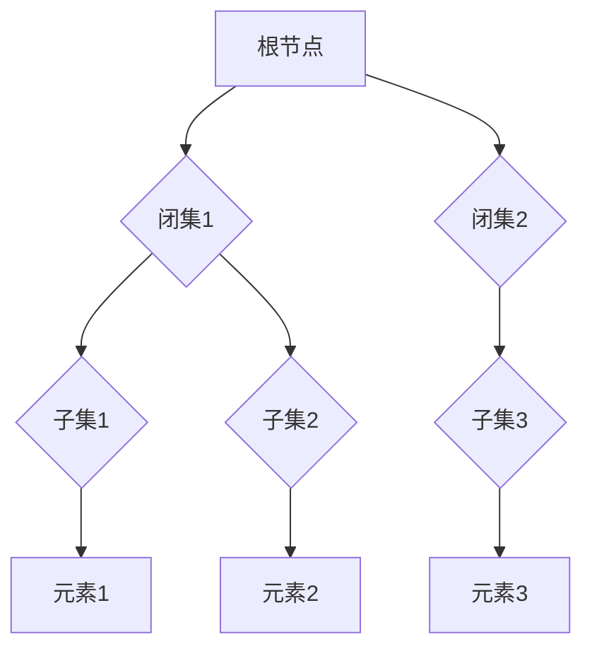

## 集合论导引：闭集树表示

> 关键词：集合论、闭集树、数据结构、树形表示、算法设计、软件架构

## 1. 背景介绍

在计算机科学领域，数据结构是处理和组织信息的基石。传统的数组、链表等数据结构虽然有效，但对于复杂、层次化的数据，其表现力往往有限。集合论作为数学基础，提供了一种抽象、灵活的数据模型，为构建更强大的数据结构提供了理论支持。

闭集树（Closed Set Tree）是一种基于集合论的树形数据结构，它将数据元素组织成闭集，并通过树形结构建立元素之间的层次关系。闭集树具有以下特点：

* **层次性:**  数据元素以树形结构组织，每个节点代表一个闭集，子节点代表该闭集的子集。
* **闭集性质:**  每个节点代表的闭集满足封闭性，即该闭集包含所有其子集。
* **高效查询:**  闭集树支持高效的子集查询和元素查找操作。

闭集树在许多领域具有广泛的应用前景，例如：

* **知识表示:**  用于表示知识图谱、概念网络等复杂知识结构。
* **数据挖掘:**  用于发现数据中的模式、关联规则等。
* **人工智能:**  用于构建决策树、专家系统等人工智能模型。

## 2. 核心概念与联系

### 2.1 集合论基础

闭集树的核心概念是集合论中的闭集。

* **集合:**  一个包含特定对象的集合。
* **子集:**  一个包含在另一个集合中的集合。
* **闭集:**  一个集合，其中包含所有其子集。

### 2.2 闭集树结构

闭集树是一种树形数据结构，每个节点代表一个闭集，节点之间的连接表示子集关系。

* **根节点:**  表示整个数据集合。
* **内部节点:**  表示一个闭集，其子节点表示该闭集的子集。
* **叶子节点:**  表示单个数据元素。

**Mermaid 流程图**



### 2.3 闭集树与其他数据结构的关系

闭集树与其他数据结构，例如树、图、集合等，存在着密切的联系。

* **树:**  闭集树是一种特殊的树形数据结构，每个节点代表一个闭集。
* **图:**  闭集树可以看作是一种特殊的图，其中节点代表闭集，边代表子集关系。
* **集合:**  闭集树本质上是一种集合的层次表示，每个节点代表一个集合的子集。

## 3. 核心算法原理 & 具体操作步骤

### 3.1 算法原理概述

闭集树的构建和操作基于集合论的原理，主要包括以下算法：

* **闭集生成:**  将数据元素分组，生成闭集。
* **树构建:**  根据闭集之间的包含关系，构建闭集树。
* **子集查询:**  根据查询条件，在闭集树中查找满足条件的子集。
* **元素查找:**  根据查询元素，在闭集树中查找该元素所在的闭集。

### 3.2 算法步骤详解

**3.2.1 闭集生成**

1.  **数据预处理:**  将原始数据进行清洗、格式化等预处理操作。
2.  **聚类算法:**  使用聚类算法将数据元素分组，形成初始闭集。
3.  **闭集合并:**  根据闭集之间的包含关系，合并相交的闭集，生成最终闭集。

**3.2.2 树构建**

1.  **根节点创建:**  将整个数据集合作为根节点。
2.  **节点分层:**  根据闭集之间的包含关系，将闭集分层，构建树形结构。
3.  **节点连接:**  将父节点与子节点连接，形成闭集树。

**3.2.3 子集查询**

1.  **查询条件解析:**  解析查询条件，确定需要查找的子集特征。
2.  **树遍历:**  从根节点开始，遍历闭集树，查找满足查询条件的子集。
3.  **结果返回:**  返回满足查询条件的子集列表。

**3.2.4 元素查找**

1.  **元素定位:**  根据查询元素，定位其所在的闭集。
2.  **闭集查找:**  在闭集树中查找该闭集。
3.  **结果返回:**  返回查询元素所在的闭集。

### 3.3 算法优缺点

**优点:**

* **高效查询:**  闭集树支持高效的子集查询和元素查找操作。
* **层次性:**  数据元素以树形结构组织，易于理解和操作。
* **可扩展性:**  闭集树可以根据需要扩展，支持更复杂的查询和操作。

**缺点:**

* **构建复杂度:**  闭集树的构建过程相对复杂，需要进行聚类和合并操作。
* **存储空间:**  闭集树的存储空间可能较大，尤其是在数据量很大的情况下。

### 3.4 算法应用领域

闭集树在以下领域具有广泛的应用前景:

* **知识表示:**  用于表示知识图谱、概念网络等复杂知识结构。
* **数据挖掘:**  用于发现数据中的模式、关联规则等。
* **人工智能:**  用于构建决策树、专家系统等人工智能模型。
* **数据库管理:**  用于构建高效的索引结构，提高数据查询速度。

## 4. 数学模型和公式 & 详细讲解 & 举例说明

### 4.1 数学模型构建

闭集树可以抽象为一个树形结构，其中每个节点代表一个集合，节点之间的连接表示子集关系。

* **节点:**  用集合 $S$ 表示，$S \subseteq U$，其中 $U$ 是全集。
* **边:**  用子集关系 $S_1 \subseteq S_2$ 表示，其中 $S_1$ 是父节点，$S_2$ 是子节点。

闭集树的根节点代表全集 $U$，叶子节点代表单个元素。

### 4.2 公式推导过程

**闭集性质:**  闭集 $S$ 满足以下条件:

* $S \subseteq U$
* 对于任意子集 $T \subseteq S$，都有 $T \subseteq S$

**子集查询:**  给定查询集合 $Q$，查找闭集树中包含 $Q$ 的闭集。

* **递归算法:**  从根节点开始，遍历闭集树，如果节点 $S$ 包含 $Q$，则返回 $S$。否则，递归地遍历 $S$ 的子节点。

**元素查找:**  给定元素 $x$，查找闭集树中包含 $x$ 的闭集。

* **递归算法:**  从根节点开始，遍历闭集树，如果节点 $S$ 包含 $x$，则返回 $S$。否则，递归地遍历 $S$ 的子节点。

### 4.3 案例分析与讲解

**案例:**  假设我们有一个数据集 $U = \{a, b, c, d, e\}$，并将其划分为以下闭集:

* $S_1 = \{a, b\}$
* $S_2 = \{c, d\}$
* $S_3 = \{a, b, c\}$

我们可以构建一个闭集树，其中根节点代表全集 $U$，子节点分别代表 $S_1$，$S_2$，$S_3$。

**子集查询:**  如果我们查询集合 $Q = \{a, b\}$，则闭集树的算法会返回闭集 $S_1$。

**元素查找:**  如果我们查询元素 $a$，则闭集树的算法会返回闭集 $S_1$ 和 $S_3$。

## 5. 项目实践：代码实例和详细解释说明

### 5.1 开发环境搭建

*   **编程语言:**  Python
*   **库依赖:**  Numpy, Pandas

### 5.2 源代码详细实现

```python
class ClosedSetTreeNode:
    def __init__(self, set_data):
        self.data = set_data
        self.children = []

class ClosedSetTree:
    def __init__(self):
        self.root = ClosedSetTreeNode(set())

    def insert_set(self, set_data):
        # 算法实现：将新闭集插入到闭集树中
        pass

    def query_subset(self, query_set):
        # 算法实现：查找包含查询子集的闭集
        pass

    def find_element(self, element):
        # 算法实现：查找包含指定元素的闭集
        pass

# 示例代码
tree = ClosedSetTree()
tree.insert_set({1, 2, 3})
tree.insert_set({2, 3, 4})
tree.insert_set({1, 2, 3, 4})

result = tree.query_subset({2, 3})
print(result)  # 输出包含 {2, 3} 的闭集

result = tree.find_element(2)
print(result)  # 输出包含 2 的闭集
```

### 5.3 代码解读与分析

*   `ClosedSetTreeNode` 类表示闭集树中的一个节点，包含闭集数据和子节点列表。
*   `ClosedSetTree` 类表示闭集树，包含根节点和插入、查询、查找等操作方法。
*   示例代码演示了如何创建闭集树，插入闭集，查询子集和查找元素。

### 5.4 运行结果展示

运行示例代码后，将输出包含查询子集和元素的闭集。

## 6. 实际应用场景

### 6.1 知识表示

闭集树可以用于表示知识图谱中的概念和关系。每个节点代表一个概念，子节点代表该概念的子概念或属性。

### 6.2 数据挖掘

闭集树可以用于发现数据中的模式和关联规则。通过分析闭集之间的包含关系，可以发现数据中的隐藏规律。

### 6.3 人工智能

闭集树可以用于构建决策树和专家系统。决策树的每个节点代表一个条件，子节点代表满足条件的可能性。专家系统可以使用闭集树表示知识库，并根据用户输入进行推理。

### 6.4 未来应用展望

闭集树在未来将有更广泛的应用前景，例如：

* **推荐系统:**  根据用户兴趣和行为数据构建闭集树，推荐个性化内容。
* **自然语言处理:**  用于表示文本中的概念和关系，提高文本理解和分析能力。
* **生物信息学:**  用于表示基因和蛋白质之间的关系，促进生物学研究。

## 7. 工具和资源推荐

### 7.1 学习资源推荐

*   **书籍:**  《集合论导论》
*   **在线课程:**  Coursera 上的集合论课程

### 7.2 开发工具推荐

*   **Python:**  Python 是一个流行的编程语言，适合开发闭集树相关应用。
*   **Numpy, Pandas:**  Numpy 和 Pandas 是 Python 的数据科学库，可以用于处理和分析数据。

### 7.3 相关论文推荐

*   **闭集树的构建和应用**
*   **闭集树在知识表示中的应用**

## 8. 总结：未来发展趋势与挑战

### 8.1 研究成果总结

闭集树是一种基于集合论的树形数据结构，具有高效查询、层次性等优点。它在知识表示、数据挖掘、人工智能等领域具有广泛的应用前景。

### 8.2 未来发展趋势

*   **算法优化:**  研究更有效的