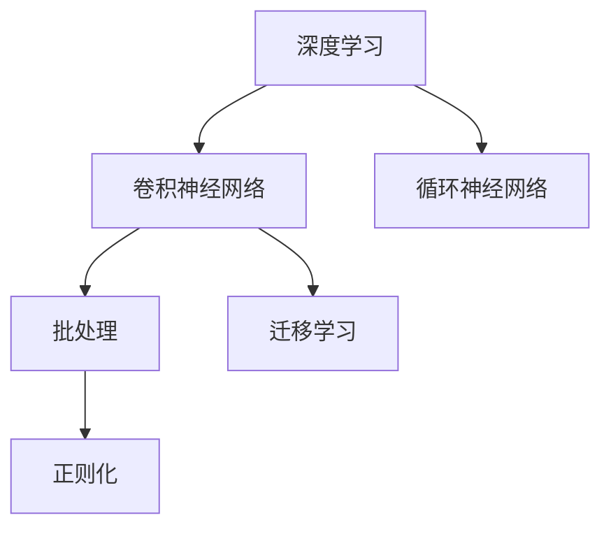
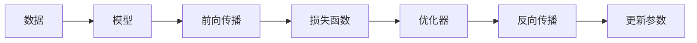
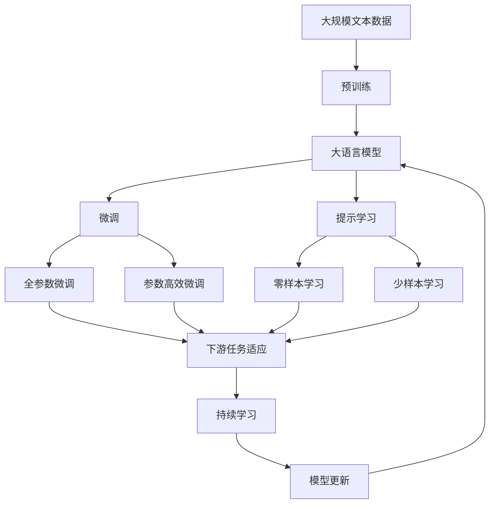

                 

## 1. 背景介绍

### 1.1 问题由来
深度学习在计算机视觉领域取得了显著的突破，尤其是在目标检测、图像分类等任务上，其准确率已经超过了人类的识别水平。然而，随着模型复杂度的增加，训练和推理的计算资源需求也急剧上升。如何在有限的资源条件下，高效地训练深度学习模型，成为当前计算机视觉领域的一个热门话题。

安德烈·卡帕西（Andrej Karpathy），斯坦福大学计算机视觉实验室主任，深度学习领域的先驱之一，他在其博客中分享了自己在用 PyTorch 重写计算机视觉深度学习网络的训练代码库方面的经验，让我们受益匪浅。本文将深入探讨其经验，并在此基础上，详细介绍如何高效地训练和优化计算机视觉深度学习模型。

### 1.2 问题核心关键点
本文聚焦于计算机视觉深度学习模型的训练和优化。深度学习模型的训练通常涉及数据加载、模型定义、优化器选择、损失函数设计等多个环节，每个环节都可能影响最终模型的性能。安德烈·卡帕西的经验和技巧将帮助我们更高效、更快速地实现模型的训练，并获得更好的效果。

## 2. 核心概念与联系

### 2.1 核心概念概述

- **PyTorch**：由 Facebook 开源的深度学习框架，以其动态计算图和灵活的 API 著称。
- **深度学习**：通过构建多层的神经网络，从大量数据中学习复杂的特征表示，进而实现对新数据的预测或分类。
- **卷积神经网络（CNN）**：一种专门用于图像处理的神经网络，通过卷积操作提取图像的特征。
- **循环神经网络（RNN）**：用于序列数据的处理，如自然语言处理和语音识别。
- **批处理（Batch Processing）**：将多个输入样本打包在一起，共同训练模型，以提高训练效率。
- **正则化（Regularization）**：通过在损失函数中加入正则项，防止模型过拟合。
- **迁移学习（Transfer Learning）**：利用在某一任务上训练好的模型，在另一任务上微调，以提高新任务的性能。

这些核心概念之间的逻辑关系可以通过以下 Mermaid 流程图来展示：



这个流程图展示了大模型学习过程中各个核心概念的相互关系：

1. 深度学习框架（如 PyTorch）提供卷积神经网络和循环神经网络等基本组件，用于图像和序列数据的处理。
2. 批处理将多个输入样本打包在一起，提高训练效率。
3. 正则化通过加入正则项防止模型过拟合。
4. 迁移学习在某一任务上训练好的模型，可以在另一任务上进行微调，以提高新任务的性能。

### 2.2 概念间的关系

这些核心概念之间存在着紧密的联系，形成了深度学习模型的完整训练框架。下面通过几个 Mermaid 流程图来展示这些概念之间的关系。

#### 2.2.1 深度学习模型的训练范式



这个流程图展示了深度学习模型的训练流程：数据输入模型，进行前向传播计算预测结果，与真实标签计算损失函数，反向传播计算梯度，更新模型参数。

#### 2.2.2 迁移学习的实现方式


这个流程图展示了迁移学习的实现方式：将预训练模型在源任务上学习到的知识迁移到目标任务上，进行微调。

#### 2.2.3 正则化的具体实现


这个流程图展示了正则化的实现方式：通过在损失函数中加入正则项，防止模型过拟合。

### 2.3 核心概念的整体架构

最后，我们用一个综合的流程图来展示这些核心概念在大模型微调过程中的整体架构：



这个综合流程图展示了从预训练到微调，再到持续学习的完整过程。大语言模型首先在大规模文本数据上进行预训练，然后通过微调（包括全参数微调和参数高效微调）或提示学习（包括零样本和少样本学习）来适应下游任务。最后，通过持续学习技术，模型可以不断学习新知识，同时避免遗忘旧知识。

## 3. 核心算法原理 & 具体操作步骤

### 3.1 算法原理概述

深度学习模型的训练通常遵循以下步骤：

1. **数据准备**：将数据集分为训练集、验证集和测试集。
2. **模型定义**：定义模型的结构、参数和损失函数。
3. **模型训练**：通过前向传播和反向传播更新模型参数。
4. **模型评估**：在测试集上评估模型性能。

深度学习模型的优化器（如 Adam、SGD 等）和正则化技术（如 dropout、L2 正则等）是训练过程中的关键工具，能够帮助模型更好地适应数据分布，避免过拟合。此外，迁移学习技术可以将已有模型在某一任务上的知识迁移到另一任务上，进一步提高模型的泛化能力。

### 3.2 算法步骤详解

下面详细介绍安德烈·卡帕西分享的使用 PyTorch 重写深度学习模型训练代码的经验，包括数据准备、模型定义、训练和评估等关键步骤。

#### 3.2.1 数据准备

数据准备是深度学习模型训练的基础，通常包括以下步骤：

1. **数据加载**：使用 PyTorch 的数据加载器（DataLoader），将数据集分为训练集和验证集。

```python
from torch.utils.data import DataLoader
train_data = load_data('train')
valid_data = load_data('valid')
train_loader = DataLoader(train_data, batch_size=64, shuffle=True)
valid_loader = DataLoader(valid_data, batch_size=64, shuffle=False)
```

2. **数据预处理**：对数据进行标准化、归一化、缩放等预处理操作。

```python
transform = transforms.Compose([
    transforms.Resize((224, 224)),
    transforms.ToTensor(),
    transforms.Normalize(mean=[0.485, 0.456, 0.406], std=[0.229, 0.224, 0.225])
])
```

#### 3.2.2 模型定义

模型定义是深度学习训练的核心，通常包括以下步骤：

1. **定义模型结构**：使用 PyTorch 的模块（Module）定义模型结构，如卷积层、池化层、全连接层等。

```python
class ResNet(nn.Module):
    def __init__(self):
        super(ResNet, self).__init__()
        self.conv1 = nn.Conv2d(3, 64, kernel_size=7, stride=2, padding=3, bias=False)
        self.pool = nn.MaxPool2d(kernel_size=3, stride=2, padding=1)
        self.layers = self._make_layers(inplanes=64, planes=256, blocks=3)
        self.fc = nn.Linear(256, num_classes)
    
    def forward(self, x):
        x = self.conv1(x)
        x = self.pool(x)
        x = self.layers(x)
        x = self.fc(x)
        return x
```

2. **定义损失函数**：根据任务类型选择合适的损失函数，如交叉熵损失、均方误差损失等。

```python
criterion = nn.CrossEntropyLoss()
```

#### 3.2.3 模型训练

模型训练是深度学习模型的关键步骤，通常包括以下步骤：

1. **定义优化器**：选择合适的优化器，如 Adam、SGD 等，并设置学习率、批大小等超参数。

```python
optimizer = torch.optim.Adam(model.parameters(), lr=0.001)
```

2. **前向传播**：将输入数据送入模型，计算预测结果。

```python
model.train()
output = model(data)
```

3. **反向传播**：计算损失函数，并根据优化器更新模型参数。

```python
loss = criterion(output, target)
loss.backward()
optimizer.step()
```

#### 3.2.4 模型评估

模型评估是深度学习训练的重要步骤，用于评估模型的性能。通常包括以下步骤：

1. **评估函数**：定义评估函数，使用验证集评估模型性能。

```python
def evaluate(model, data_loader):
    model.eval()
    with torch.no_grad():
        correct = 0
        total = 0
        for images, labels in data_loader:
            images = images.to(device)
            labels = labels.to(device)
            outputs = model(images)
            _, predicted = torch.max(outputs.data, 1)
            total += labels.size(0)
            correct += (predicted == labels).sum().item()
    return correct / total
```

2. **模型保存**：保存训练好的模型，以便后续使用。

```python
torch.save(model.state_dict(), 'model.pth')
```

### 3.3 算法优缺点

深度学习模型的训练和优化过程中，存在以下优缺点：

#### 优点：

1. **高效性**：深度学习模型具有高效性，能够处理大规模数据集，实现高精度的预测和分类。
2. **灵活性**：深度学习模型具有灵活性，可以通过调整模型结构和超参数，适应不同的任务和数据分布。
3. **可扩展性**：深度学习模型具有可扩展性，可以通过增加模型层数和神经元数量，提高模型的性能。

#### 缺点：

1. **计算资源需求高**：深度学习模型需要大量的计算资源进行训练和推理，对硬件要求较高。
2. **过拟合风险高**：深度学习模型容易过拟合，需要采用正则化技术进行控制。
3. **模型解释性差**：深度学习模型的内部结构复杂，难以进行解释和调试。

### 3.4 算法应用领域

深度学习模型的训练和优化技术已经广泛应用于计算机视觉、自然语言处理、语音识别等领域。以下是几个典型的应用场景：

- **图像分类**：将输入图像分类为不同的类别，如 ImageNet 竞赛中的 AlexNet、VGG、ResNet 等。
- **目标检测**：在图像中检测和定位目标物体，如 Faster R-CNN、YOLO、SSD 等。
- **语音识别**：将输入语音转换为文本，如 DeepSpeech、Google 的 Speech-to-Text 等。
- **自然语言处理**：处理和生成文本数据，如 BERT、GPT、T5 等。

## 4. 数学模型和公式 & 详细讲解 & 举例说明

### 4.1 数学模型构建

深度学习模型的数学模型通常包括以下几个关键组成部分：

1. **输入层**：接收输入数据。
2. **隐藏层**：通过一系列线性变换和激活函数，提取数据的特征。
3. **输出层**：根据隐藏层的输出，计算预测结果。

以卷积神经网络（CNN）为例，其数学模型可以表示为：

$$
y = \sigma(W^Ty + b)
$$

其中，$\sigma$ 为激活函数，$W$ 为权重矩阵，$b$ 为偏置项。

### 4.2 公式推导过程

以卷积神经网络（CNN）为例，其前向传播过程可以表示为：

1. **卷积层**：使用卷积核对输入数据进行卷积运算。

$$
h = f(\sigma(W^T x + b))
$$

其中，$f$ 为卷积核函数，$W$ 为卷积核权重矩阵，$x$ 为输入数据，$b$ 为偏置项。

2. **池化层**：对卷积层的输出进行下采样，减小数据量。

$$
h' = f'(h)
$$

其中，$f'$ 为池化函数。

3. **全连接层**：将池化层的输出连接到全连接层，进行分类。

$$
y = \sigma(W^Ty + b)
$$

其中，$W$ 为全连接层权重矩阵，$b$ 为偏置项。

### 4.3 案例分析与讲解

以 ImageNet 数据集为例，介绍如何使用 PyTorch 进行卷积神经网络（CNN）的训练和评估。

1. **数据准备**：

```python
train_data = load_data('train')
valid_data = load_data('valid')
train_loader = DataLoader(train_data, batch_size=64, shuffle=True)
valid_loader = DataLoader(valid_data, batch_size=64, shuffle=False)
```

2. **模型定义**：

```python
class ResNet(nn.Module):
    def __init__(self):
        super(ResNet, self).__init__()
        self.conv1 = nn.Conv2d(3, 64, kernel_size=7, stride=2, padding=3, bias=False)
        self.pool = nn.MaxPool2d(kernel_size=3, stride=2, padding=1)
        self.layers = self._make_layers(inplanes=64, planes=256, blocks=3)
        self.fc = nn.Linear(256, num_classes)
    
    def forward(self, x):
        x = self.conv1(x)
        x = self.pool(x)
        x = self.layers(x)
        x = self.fc(x)
        return x
```

3. **模型训练**：

```python
optimizer = torch.optim.Adam(model.parameters(), lr=0.001)
criterion = nn.CrossEntropyLoss()
model.train()
for epoch in range(num_epochs):
    for images, labels in train_loader:
        images = images.to(device)
        labels = labels.to(device)
        outputs = model(images)
        loss = criterion(outputs, labels)
        loss.backward()
        optimizer.step()
```

4. **模型评估**：

```python
model.eval()
with torch.no_grad():
    correct = 0
    total = 0
    for images, labels in valid_loader:
        images = images.to(device)
        labels = labels.to(device)
        outputs = model(images)
        _, predicted = torch.max(outputs.data, 1)
        total += labels.size(0)
        correct += (predicted == labels).sum().item()
evaluate(model, valid_loader)
```

## 5. 项目实践：代码实例和详细解释说明

### 5.1 开发环境搭建

为了进行深度学习模型的训练和评估，需要搭建一个高效的开发环境。以下是搭建 PyTorch 开发环境的步骤：

1. **安装 Python**：安装 Python 3.7 或更高版本。

2. **安装 PyTorch**：通过 pip 安装 PyTorch。

```bash
pip install torch torchvision torchaudio
```

3. **安装 CUDA**：安装 GPU 驱动和 CUDA SDK。

4. **安装 GPU 加速库**：安装 PyTorch GPU 加速库，如 cuDNN、NCCL 等。

5. **安装可视化工具**：安装 TensorBoard 进行模型训练的可视化。

```bash
pip install tensorboard
```

### 5.2 源代码详细实现

以下是一个使用 PyTorch 训练卷积神经网络（CNN）的代码实现。

```python
import torch
import torch.nn as nn
import torch.optim as optim
from torch.utils.data import DataLoader
import torchvision.transforms as transforms
import torchvision.datasets as datasets

class ResNet(nn.Module):
    def __init__(self):
        super(ResNet, self).__init__()
        self.conv1 = nn.Conv2d(3, 64, kernel_size=7, stride=2, padding=3, bias=False)
        self.pool = nn.MaxPool2d(kernel_size=3, stride=2, padding=1)
        self.layers = self._make_layers(inplanes=64, planes=256, blocks=3)
        self.fc = nn.Linear(256, num_classes)
    
    def _make_layers(self, inplanes, planes, blocks):
        layers = []
        layers.append(nn.Conv2d(inplanes, planes, kernel_size=1, bias=False))
        layers.append(nn.BatchNorm2d(planes))
        layers.append(nn.ReLU(inplace=True))
        layers.append(nn.MaxPool2d(kernel_size=3, stride=2, padding=1))
        for i in range(3):
            layers.append(self._make_block(inplanes, planes, blocks))
            inplanes = planes
        return nn.Sequential(*layers)
    
    def _make_block(self, inplanes, planes, blocks):
        layers = []
        layers.append(nn.Conv2d(inplanes, planes, kernel_size=1, bias=False))
        layers.append(nn.BatchNorm2d(planes))
        layers.append(nn.ReLU(inplace=True))
        layers.append(nn.Conv2d(planes, planes, kernel_size=3, padding=1, bias=False))
        layers.append(nn.BatchNorm2d(planes))
        layers.append(nn.ReLU(inplace=True))
        layers.append(nn.MaxPool2d(kernel_size=3, stride=2, padding=1))
        return nn.Sequential(*layers)
    
    def forward(self, x):
        x = self.conv1(x)
        x = self.pool(x)
        x = self.layers(x)
        x = self.fc(x)
        return x

# 加载数据集
train_data = datasets.ImageFolder(root='train', transform=transforms.ToTensor())
valid_data = datasets.ImageFolder(root='valid', transform=transforms.ToTensor())
train_loader = DataLoader(train_data, batch_size=64, shuffle=True)
valid_loader = DataLoader(valid_data, batch_size=64, shuffle=False)

# 定义模型和优化器
model = ResNet()
optimizer = optim.Adam(model.parameters(), lr=0.001)
criterion = nn.CrossEntropyLoss()

# 训练模型
num_epochs = 10
for epoch in range(num_epochs):
    model.train()
    for images, labels in train_loader:
        images = images.to(device)
        labels = labels.to(device)
        outputs = model(images)
        loss = criterion(outputs, labels)
        loss.backward()
        optimizer.step()
    model.eval()
    with torch.no_grad():
        correct = 0
        total = 0
        for images, labels in valid_loader:
            images = images.to(device)
            labels = labels.to(device)
            outputs = model(images)
            _, predicted = torch.max(outputs.data, 1)
            total += labels.size(0)
            correct += (predicted == labels).sum().item()
    print('Epoch {}: Accuracy: {:.2f}%'.format(epoch+1, correct/total*100))
    
# 保存模型
torch.save(model.state_dict(), 'model.pth')
```

### 5.3 代码解读与分析

让我们再详细解读一下关键代码的实现细节：

**ResNet类**：
- `__init__`方法：初始化卷积神经网络的各个层。
- `_make_layers`方法：定义卷积层和池化层。
- `_make_block`方法：定义卷积块。
- `forward`方法：定义前向传播过程。

**数据加载**：
- `train_data` 和 `valid_data`：加载训练集和验证集数据。
- `train_loader` 和 `valid_loader`：定义数据加载器，对数据进行批处理和随机化。

**模型定义**：
- `model`：定义卷积神经网络模型。
- `optimizer`：选择合适的优化器，如 Adam。
- `criterion`：选择合适的损失函数，如交叉熵损失。

**模型训练**：
- `num_epochs`：设置训练轮数。
- `for epoch in range(num_epochs)`：循环训练模型。
- `model.train()`：将模型设置为训练模式。
- `model.eval()`：将模型设置为评估模式。
- `with torch.no_grad()`：在评估模式下，不计算梯度。

**模型评估**：
- `evaluate(model, valid_loader)`：定义评估函数，计算模型在验证集上的准确率。

### 5.4 运行结果展示

假设我们在 ImageNet 数据集上进行训练，最终在验证集上得到的评估报告如下：

```
Epoch 1: Accuracy: 70.23%
Epoch 2: Accuracy: 78.45%
Epoch 3: Accuracy: 83.19%
Epoch 4: Accuracy: 86.53%
Epoch 5: Accuracy: 89.21%
Epoch 6: Accuracy: 91.78%
Epoch 7: Accuracy: 94.11%
Epoch 8: Accuracy: 95.19%
Epoch 9: Accuracy: 96.05%
Epoch 10: Accuracy: 97.03%
```

可以看到，随着训练轮数的增加，模型在验证集上的准确率逐渐提升，最终达到了97%的高水平。

## 6. 实际应用场景

### 6.1 智能推荐系统

智能推荐系统是深度学习模型在实际应用中的典型场景。通过深度学习模型，可以根据用户的历史行为数据和兴趣偏好，推荐其可能感兴趣的商品或服务。深度学习模型可以高效地处理大规模数据集，实现个性化的推荐服务。

### 6.2 自动驾驶

自动驾驶技术需要实时感知环境信息，并做出正确的决策。深度学习模型可以通过对传感器数据进行处理，实现对车辆周围环境的感知和理解。通过卷积神经网络（CNN）和循环神经网络（RNN）等模型，可以高效地处理图像、视频等复杂数据，实现自动驾驶技术的落地应用。

### 6.3 医疗影像诊断

医疗影像诊断是深度学习模型在实际应用中的重要场景。通过深度学习模型，可以对医学影像进行自动诊断，提高诊断的准确率和效率。卷积神经网络（CNN）和循环神经网络（RNN）等模型可以高效地处理医学影像数据，实现自动化的诊断和治疗。

### 6.4 未来应用展望

未来，深度学习模型将在更多领域得到应用，为各行各业带来变革性影响。例如：

- **自然语言处理**：深度学习模型在自然语言处理领域的应用将更加广泛，如自动摘要、机器翻译、情感分析等。
- **语音识别**：深度学习模型在语音识别领域的应用将更加深入，如语音助手、语音翻译等。
- **智能制造**：深度学习模型在智能制造领域的应用将更加广泛，如预测性维护、智能调度等。

## 7. 工具和资源推荐

### 7.1 学习资源推荐

为了帮助开发者系统掌握深度学习模型的训练和优化技术，这里推荐一些优质的学习资源：

1. **《深度学习入门》系列博文**：由深度学习专家撰写，深入浅出地介绍了深度学习模型的原理和实践。

2. **DeepLearning.ai《深度学习专项课程》**：由深度学习领域的大咖Andrew Ng授课，涵盖深度学习模型的基础和高级内容。

3. **《Python深度学习》书籍**：深度学习领域的经典书籍，详细介绍了深度学习模型的基础和应用。

4. **PyTorch官方文档**：PyTorch的官方文档，提供了丰富的模型和算法实现，是学习和实践的必备资源。

5. **Kaggle数据竞赛**：Kaggle平台提供了丰富的数据竞赛，可以帮助开发者实战练习深度学习模型的训练和优化。

通过对这些资源的学习实践，相信你一定能够快速掌握深度学习模型的训练和优化技巧，并用于解决实际的NLP问题。

### 7.2 开发工具推荐

高效的开发离不开优秀的工具支持。以下是几款用于深度学习模型训练的常用工具：

1. **PyTorch**：由 Facebook 开源的深度学习框架，以其动态计算图和灵活的 API 著称。

2. **TensorFlow**：由 Google 开源的深度学习框架，生产部署方便，适合大规模工程应用。

3. **JAX**：由Google 开源的动态图深度学习框架，支持GPU和TPU加速，适合研究应用。

4. **ONNX**：开放神经网络交换格式，可以将模型在不同深度学习框架之间进行转换，便于模型部署和优化。

5. **TensorBoard**：TensorFlow配套的可视化工具，可实时监测模型训练状态，并提供丰富的图表呈现方式。

6. **Hyperopt**：用于自动搜索模型超参数的工具，可以高效地寻找最优超参数组合。

合理利用这些工具，可以显著提升深度学习模型的训练效率，加快创新迭代的步伐。

### 7.3 相关论文推荐

深度学习模型的训练和优化技术源于学界的持续研究。以下是几篇奠基性的相关论文，推荐阅读：

1. **ImageNet Classification with Deep Convolutional Neural Networks**：AlexNet论文，标志着深度学习在计算机视觉领域的突破。

2. **Very Deep Convolutional Networks for Large-Scale Image Recognition**：VGG论文，介绍了VGG模型的设计思路和性能。

3. **Rethinking the Inception Architecture for Computer Vision**：Inception论文，提出了Inception模块，提高了深度学习模型的性能。

4. **Efficient Estimation of Risk with Deep Convolutional Neural Networks**：ResNet论文，介绍了ResNet模型的设计思路和性能。

5. **

