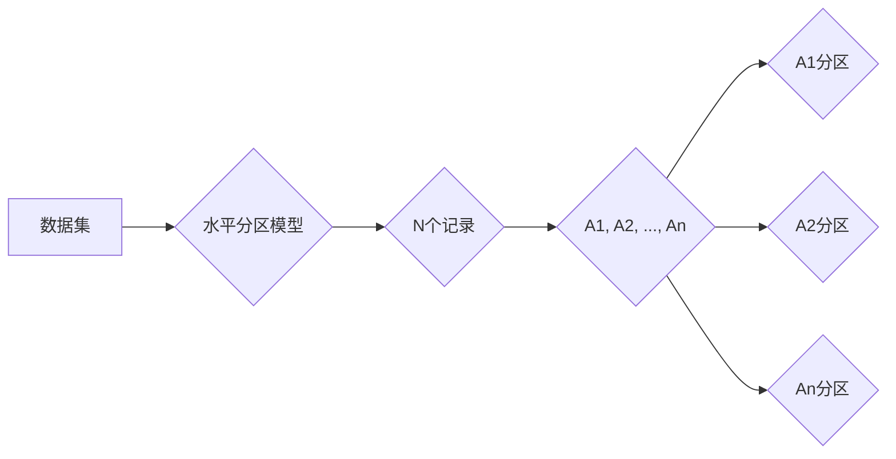
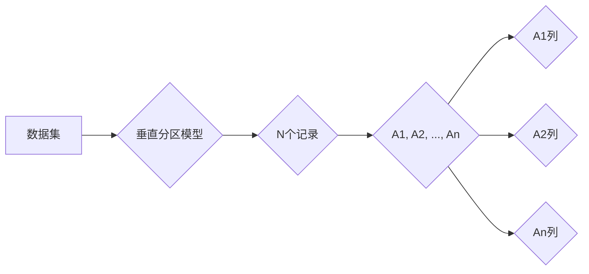

# 分区：原理与代码实例讲解

作者：禅与计算机程序设计艺术 / Zen and the Art of Computer Programming

## 1. 背景介绍

### 1.1 问题的由来

在计算机系统中，分区（Partitioning）是一种常用的数据处理技术。它将数据集划分为多个子集，每个子集包含数据集中的一部分数据。分区技术广泛应用于数据库、数据仓库、分布式系统等领域。通过分区，可以提高数据处理效率，优化资源利用，增强系统可扩展性。

### 1.2 研究现状

随着数据量的爆炸式增长，分区技术的研究和应用越来越受到关注。目前，分区技术主要分为两大类：水平分区和垂直分区。

- 水平分区：将数据集根据某一或多个键值进行划分，每个分区包含数据集中具有相同键值的记录。例如，根据用户ID对用户数据进行分区。
- 垂直分区：将数据集根据某一或多个列进行划分，每个分区包含数据集中具有相同列值的记录。例如，根据日期对日志数据进行分区。

### 1.3 研究意义

分区技术的研究意义主要体现在以下几个方面：

- 提高查询效率：通过将数据分散到多个分区，可以减少查询过程中需要扫描的数据量，从而提高查询效率。
- 优化资源利用：通过分区，可以根据不同分区的数据特点，对存储和计算资源进行差异化配置，提高资源利用率。
- 增强系统可扩展性：通过分区，可以将数据分散到多个节点上，从而提高系统的可扩展性和容错性。

### 1.4 本文结构

本文将分为以下几个部分：

- 2. 核心概念与联系：介绍分区相关的核心概念和联系。
- 3. 核心算法原理 & 具体操作步骤：阐述分区算法的原理和具体操作步骤。
- 4. 数学模型和公式 & 详细讲解 & 举例说明：介绍分区算法的数学模型、公式推导和案例分析。
- 5. 项目实践：代码实例和详细解释说明：给出分区算法的代码实例，并进行详细解释和分析。
- 6. 实际应用场景：探讨分区技术在实际应用场景中的应用。
- 7. 工具和资源推荐：推荐相关学习资源、开发工具和论文。
- 8. 总结：对未来发展趋势和挑战进行总结。
- 9. 附录：常见问题与解答。

## 2. 核心概念与联系

### 2.1 水平分区与垂直分区

- 水平分区：将数据集根据某一或多个键值进行划分，每个分区包含数据集中具有相同键值的记录。例如，根据用户ID对用户数据进行分区。
- 垂直分区：将数据集根据某一或多个列进行划分，每个分区包含数据集中具有相同列值的记录。例如，根据日期对日志数据进行分区。

### 2.2 分区键与分区策略

- 分区键：用于划分数据集的键值，可以是单个列或多个列的组合。
- 分区策略：根据分区键将数据集划分成多个分区的具体方法。

### 2.3 分区算法

- 分区算法：实现分区操作的具体算法，包括水平分区算法和垂直分区算法。

## 3. 核心算法原理 & 具体操作步骤

### 3.1 水平分区算法原理

水平分区算法的核心思想是，根据分区键将数据集划分为多个子集。每个子集包含数据集中具有相同键值的记录。

#### 3.1.1 算法步骤

1. 确定分区键和分区策略。
2. 遍历数据集，根据分区键将记录划分到对应的分区。
3. 对每个分区进行存储或处理。

#### 3.1.2 算法示例

假设有一个用户数据集，包含用户ID、姓名、年龄、地址等字段。我们可以根据用户ID进行水平分区。

```sql
CREATE TABLE users (
    id INT,
    name VARCHAR(50),
    age INT,
    address VARCHAR(100)
) PARTITION BY RANGE (id) (
    PARTITION p1 VALUES LESS THAN (1000),
    PARTITION p2 VALUES LESS THAN (2000),
    PARTITION p3 VALUES LESS THAN (3000)
);
```

### 3.2 垂直分区算法原理

垂直分区算法的核心思想是，根据分区键将数据集的列进行划分。每个分区包含数据集中具有相同列值的记录。

#### 3.2.1 算法步骤

1. 确定分区键和分区策略。
2. 遍历数据集，根据分区键将列划分到对应的分区。
3. 对每个分区进行存储或处理。

#### 3.2.2 算法示例

假设有一个用户数据集，包含用户ID、姓名、年龄、地址等字段。我们可以根据年龄进行垂直分区。

```sql
CREATE TABLE users (
    id INT,
    name VARCHAR(50),
    age INT,
    address VARCHAR(100)
) PARTITION BY LIST (age) (
    PARTITION p1 VALUES IN (18, 19, 20, 21, 22),
    PARTITION p2 VALUES IN (23, 24, 25, 26, 27),
    PARTITION p3 VALUES IN (28, 29, 30, 31, 32)
);
```

### 3.3 分区算法优缺点

#### 3.3.1 水平分区算法优缺点

**优点**：

- 简单易懂，易于实现。
- 查询效率高，可以快速定位到特定分区。

**缺点**：

- 当数据量非常大时，分区键的选择可能不唯一。
- 分区键的选择可能影响查询性能。

#### 3.3.2 垂直分区算法优缺点

**优点**：

- 可以提高数据压缩率。
- 可以提高查询性能，因为只扫描了需要的列。

**缺点**：

- 实现复杂，需要额外的存储和管理。
- 可能会影响数据的完整性。

### 3.4 分区算法应用领域

- 数据库：水平分区和垂直分区在数据库中应用广泛，如MySQL、PostgreSQL等。
- 数据仓库：数据仓库中的数据通常采用分区策略进行管理，如Hadoop、Spark等。
- 分布式系统：分布式系统中的数据可以采用分区策略进行存储和计算，如Kafka、Cassandra等。

## 4. 数学模型和公式 & 详细讲解 & 举例说明

### 4.1 数学模型构建

#### 4.1.1 水平分区模型

假设数据集包含N个记录，分区键的取值范围为A1, A2, ..., An，每个分区包含数据集中具有相同键值的记录。



#### 4.1.2 垂直分区模型

假设数据集包含N个记录，分区键的取值范围为A1, A2, ..., An，每个分区包含数据集中具有相同列值的记录。



### 4.2 公式推导过程

#### 4.2.1 水平分区公式

假设数据集包含N个记录，分区键的取值范围为A1, A2, ..., An，每个分区包含数据集中具有相同键值的记录。

$$
P_i = \sum_{x \in A_i} |x|
$$

其中，$P_i$ 表示第i个分区中记录的数量，$x$ 表示记录，$|x|$ 表示记录的数量。

#### 4.2.2 垂直分区公式

假设数据集包含N个记录，分区键的取值范围为A1, A2, ..., An，每个分区包含数据集中具有相同列值的记录。

$$
P_i = \sum_{x \in A_i} |x|
$$

其中，$P_i$ 表示第i个分区中记录的数量，$x$ 表示记录，$|x|$ 表示记录的数量。

### 4.3 案例分析与讲解

假设有一个包含用户信息的数据库表，包含用户ID、姓名、年龄、性别等字段。我们可以根据用户ID进行水平分区，也可以根据年龄进行垂直分区。

#### 4.3.1 水平分区案例分析

根据用户ID进行水平分区，可以方便地查询特定用户的信息。

```sql
SELECT * FROM users WHERE id = 1001;
```

#### 4.3.2 垂直分区案例分析

根据年龄进行垂直分区，可以方便地查询特定年龄段用户的信息。

```sql
SELECT * FROM users WHERE age BETWEEN 20 AND 30;
```

### 4.4 常见问题解答

**Q1：如何选择合适的分区键？**

A：选择合适的分区键需要考虑以下因素：

- 查询频率：根据查询频率选择最常用于查询的列作为分区键。
- 数据分布：选择数据分布均匀的列作为分区键，可以提高查询性能。
- 数据量：选择数据量较大的列作为分区键，可以更好地利用分区优势。

**Q2：分区会影响数据的完整性吗？**

A：分区本身不会影响数据的完整性。但是，在分区过程中，需要注意数据的完整性和一致性。

**Q3：分区会影响数据的备份和恢复吗？**

A：分区会影响数据的备份和恢复。在备份和恢复过程中，需要针对每个分区进行操作。

## 5. 项目实践：代码实例和详细解释说明

### 5.1 开发环境搭建

- 安装MySQL数据库。
- 创建数据库和表，并插入数据。

### 5.2 源代码详细实现

#### 5.2.1 水平分区

```sql
CREATE TABLE users (
    id INT,
    name VARCHAR(50),
    age INT,
    address VARCHAR(100)
) PARTITION BY RANGE (id) (
    PARTITION p1 VALUES LESS THAN (1000),
    PARTITION p2 VALUES LESS THAN (2000),
    PARTITION p3 VALUES LESS THAN (3000)
);
```

#### 5.2.2 垂直分区

```sql
CREATE TABLE users (
    id INT,
    name VARCHAR(50),
    age INT,
    address VARCHAR(100)
) PARTITION BY LIST (age) (
    PARTITION p1 VALUES IN (18, 19, 20, 21, 22),
    PARTITION p2 VALUES IN (23, 24, 25, 26, 27),
    PARTITION p3 VALUES IN (28, 29, 30, 31, 32)
);
```

### 5.3 代码解读与分析

以上代码分别展示了水平分区和垂直分区的SQL语句。通过这些代码，可以创建一个包含用户信息的数据库表，并根据用户ID和年龄进行分区。

### 5.4 运行结果展示

在MySQL数据库中运行以上代码，可以创建一个包含用户信息的数据库表，并根据用户ID和年龄进行分区。

## 6. 实际应用场景

### 6.1 数据库

在数据库中，分区技术可以用于以下场景：

- 用户数据管理：根据用户ID进行水平分区，方便查询和管理用户信息。
- 日志数据管理：根据日期或时间戳进行水平分区，方便查询和分析日志数据。
- 时间序列数据管理：根据时间范围进行垂直分区，方便查询和分析时间序列数据。

### 6.2 数据仓库

在数据仓库中，分区技术可以用于以下场景：

- 多维数据分析：根据维度信息进行水平分区，方便查询和分析多维数据。
- 事实表管理：根据事实表中的数据特点进行垂直分区，提高查询性能。

### 6.3 分布式系统

在分布式系统中，分区技术可以用于以下场景：

- 数据存储：根据数据特点进行水平分区，提高数据存储效率。
- 数据计算：根据数据特点进行水平或垂直分区，提高数据计算效率。

## 7. 工具和资源推荐

### 7.1 学习资源推荐

- 《数据库系统概念》
- 《数据仓库技术精粹》
- 《分布式系统原理与范型》

### 7.2 开发工具推荐

- MySQL数据库
- PostgreSQL数据库
- Hadoop数据仓库
- Spark数据仓库

### 7.3 相关论文推荐

- 《Partitioning by Range in Relational Databases》
- 《Partitioning by List in Relational Databases》
- 《A Survey of Partitioning Techniques in Data Management Systems》

### 7.4 其他资源推荐

- MySQL官方文档
- PostgreSQL官方文档
- Hadoop官方文档
- Spark官方文档

## 8. 总结：未来发展趋势与挑战

### 8.1 研究成果总结

本文对分区技术进行了系统介绍，包括背景、核心概念、算法原理、应用场景等。通过对分区技术的深入分析，可以看出分区技术在数据库、数据仓库、分布式系统等领域具有广泛的应用价值。

### 8.2 未来发展趋势

随着数据量的不断增长和分布式系统的普及，分区技术将呈现以下发展趋势：

- 更多的分区策略：随着研究的发展，将出现更多适合不同场景的分区策略。
- 自动分区：随着自动化技术的进步，将出现自动分区工具，简化分区操作。
- 集成化分区：分区技术将与其他数据管理技术（如数据仓库、大数据平台）进行集成。

### 8.3 面临的挑战

分区技术在应用过程中也面临以下挑战：

- 分区键选择：选择合适的分区键对分区效果至关重要，但选择合适的分区键仍然具有一定的挑战性。
- 分区粒度：分区粒度过大会降低查询性能，分区粒度过小会增加管理难度。
- 数据迁移：当数据规模发生变化时，需要迁移数据到新的分区。

### 8.4 研究展望

为了应对分区技术面临的挑战，未来的研究方向包括：

- 研究新的分区策略，提高分区效果。
- 开发自动分区工具，简化分区操作。
- 研究数据迁移技术，提高分区系统的可扩展性。

通过不断的研究和探索，相信分区技术将在未来发挥更大的作用，为数据管理和计算提供更高效、更便捷的解决方案。

## 9. 附录：常见问题与解答

**Q1：什么是分区？**

A：分区是指将数据集划分为多个子集，每个子集包含数据集中的一部分数据。

**Q2：什么是水平分区？**

A：水平分区是指将数据集根据某一或多个键值进行划分，每个分区包含数据集中具有相同键值的记录。

**Q3：什么是垂直分区？**

A：垂直分区是指将数据集根据某一或多个列进行划分，每个分区包含数据集中具有相同列值的记录。

**Q4：分区技术有哪些优点？**

A：分区技术可以提高查询效率，优化资源利用，增强系统可扩展性。

**Q5：分区技术有哪些缺点？**

A：分区技术会增加管理难度，降低数据完整性，增加数据迁移成本。

**Q6：如何选择合适的分区键？**

A：选择合适的分区键需要考虑查询频率、数据分布、数据量等因素。

**Q7：分区会影响数据的完整性吗？**

A：分区本身不会影响数据的完整性，但需要注意数据的一致性和一致性。

**Q8：分区会影响数据的备份和恢复吗？**

A：分区会影响数据的备份和恢复，需要针对每个分区进行操作。

**Q9：分区技术有哪些应用场景？**

A：分区技术在数据库、数据仓库、分布式系统等领域具有广泛的应用场景。

**Q10：如何实现分区？**

A：实现分区可以通过数据库管理系统、数据仓库、分布式系统等工具进行。

---

作者：禅与计算机程序设计艺术 / Zen and the Art of Computer Programming