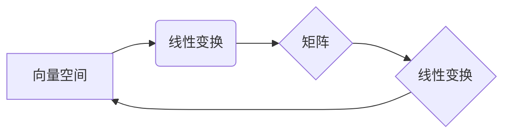

# 线性代数导引：实数代数运算

## 1. 背景介绍
### 1.1 问题的由来

线性代数是现代数学、科学和工程学中的基础学科之一，它研究向量空间、线性变换、矩阵以及它们之间的关系。在计算机科学中，线性代数被广泛应用于图形学、机器学习、信号处理、优化等领域。实数代数运算作为线性代数的基础，对于理解线性代数的核心概念和应用至关重要。

### 1.2 研究现状

实数代数运算的研究已经相当成熟，但仍然有许多新的理论和应用不断涌现。随着计算机科学的快速发展，实数代数运算在数值计算、算法设计、系统建模等方面的应用越来越广泛。

### 1.3 研究意义

深入研究实数代数运算不仅有助于理解线性代数的本质，还能够提高算法的效率、增强系统的鲁棒性，并在多个领域推动技术创新。

### 1.4 本文结构

本文将分为以下几个部分：
- 介绍线性代数和实数代数运算的基本概念。
- 讲解实数代数运算的原理和具体操作步骤。
- 分析实数代数运算的优缺点。
- 探讨实数代数运算的应用领域。
- 展望实数代数运算的未来发展趋势和挑战。

## 2. 核心概念与联系

### 2.1 向量空间

向量空间是线性代数中的一个核心概念，它由一组元素（向量）和一组运算（加法和标量乘法）组成。向量空间中的元素称为向量，运算规则满足以下性质：

- 封闭性：向量的加法和标量乘法的结果仍然属于该向量空间。
- 结合律：向量加法和标量乘法都满足结合律。
- 交换律：向量加法满足交换律，标量乘法满足结合律。
- 分配律：向量加法和标量乘法满足分配律。

### 2.2 线性变换

线性变换是向量空间到向量空间的函数，它保持向量加法和标量乘法的不变性。线性变换可以用矩阵表示，矩阵的每一列对应于变换的一个基向量。

### 2.3 矩阵

矩阵是线性代数中的另一个核心概念，它由一系列实数或复数组成。矩阵可以表示线性变换、向量空间中的向量以及向量空间的线性组合。

### 2.4 关系图

以下是一个描述向量空间、线性变换、矩阵之间关系的Mermaid流程图：



## 3. 核心算法原理 & 具体操作步骤

### 3.1 算法原理概述

实数代数运算主要包括向量的加法、标量乘法、矩阵的加法、标量乘法、乘法以及逆矩阵等。这些运算的原理和步骤如下：

#### 向量加法

向量加法是将两个向量对应位置的元素相加。假设有两个向量 $\mathbf{a} = [a_1, a_2, \dots, a_n]$ 和 $\mathbf{b} = [b_1, b_2, \dots, b_n]$，它们的和为 $\mathbf{c} = \mathbf{a} + \mathbf{b} = [a_1 + b_1, a_2 + b_2, \dots, a_n + b_n]$。

#### 标量乘法

标量乘法是将向量与一个实数相乘。假设有一个向量 $\mathbf{a} = [a_1, a_2, \dots, a_n]$ 和一个标量 $k$，它们的乘积为 $\mathbf{b} = k\mathbf{a} = [ka_1, ka_2, \dots, ka_n]$。

#### 矩阵加法

矩阵加法是将两个矩阵对应位置的元素相加。假设有两个矩阵 $\mathbf{A} = \begin{bmatrix} a_{11} & a_{12} & \dots & a_{1n} \ a_{21} & a_{22} & \dots & a_{2n} \ \vdots & \vdots & \ddots & \vdots \ a_{m1} & a_{m2} & \dots & a_{mn} \end{bmatrix}$ 和 $\mathbf{B} = \begin{bmatrix} b_{11} & b_{12} & \dots & b_{1n} \ b_{21} & b_{22} & \dots & b_{2n} \ \vdots & \vdots & \ddots & \vdots \ b_{m1} & b_{m2} & \dots & b_{mn} \end{bmatrix}$，它们的和为 $\mathbf{C} = \mathbf{A} + \mathbf{B} = \begin{bmatrix} a_{11} + b_{11} & a_{12} + b_{12} & \dots & a_{1n} + b_{1n} \ a_{21} + b_{21} & a_{22} + b_{22} & \dots & a_{2n} + b_{2n} \ \vdots & \vdots & \ddots & \vdots \ a_{m1} + b_{m1} & a_{m2} + b_{m2} & \dots & a_{mn} + b_{mn} \end{bmatrix}$。

#### 标量乘法

矩阵的标量乘法与向量的标量乘法类似，只需将矩阵的每个元素乘以标量即可。

#### 乘法

矩阵乘法是将两个矩阵相乘。假设有两个矩阵 $\mathbf{A} = \begin{bmatrix} a_{11} & a_{12} & \dots & a_{1n} \ a_{21} & a_{22} & \dots & a_{2n} \ \vdots & \vdots & \ddots & \vdots \ a_{m1} & a_{m2} & \dots & a_{mn} \end{bmatrix}$ 和 $\mathbf{B} = \begin{bmatrix} b_{11} & b_{12} & \dots & b_{1n} \ b_{21} & b_{22} & \dots & b_{2n} \ \vdots & \vdots & \ddots & \vdots \ b_{m1} & b_{m2} & \dots & b_{mn} \end{bmatrix}$，它们的乘积为 $\mathbf{C} = \mathbf{A} \mathbf{B} = \begin{bmatrix} \sum_{j=1}^n a_{1j}b_{j1} & \sum_{j=1}^n a_{1j}b_{j2} & \dots & \sum_{j=1}^n a_{1j}b_{jn} \ \sum_{j=1}^n a_{2j}b_{j1} & \sum_{j=1}^n a_{2j}b_{j2} & \dots & \sum_{j=1}^n a_{2j}b_{jn} \ \vdots & \vdots & \ddots & \vdots \ \sum_{j=1}^n a_{mj}b_{j1} & \sum_{j=1}^n a_{mj}b_{j2} & \dots & \sum_{j=1}^n a_{mj}b_{jn} \end{bmatrix}$。

#### 逆矩阵

逆矩阵是一个矩阵的逆变换，使得矩阵与其逆矩阵相乘后得到单位矩阵。一个矩阵 $\mathbf{A}$ 的逆矩阵记为 $\mathbf{A}^{-1}$，满足 $\mathbf{A} \mathbf{A}^{-1} = \mathbf{A}^{-1} \mathbf{A} = \mathbf{I}$，其中 $\mathbf{I}$ 为单位矩阵。

### 3.2 算法步骤详解

以下是一些实数代数运算的具体步骤：

#### 向量加法

1. 确保两个向量的维度相同。
2. 将两个向量对应位置的元素相加。

#### 标量乘法

1. 选择一个标量和一个向量。
2. 将向量的每个元素乘以标量。

#### 矩阵加法

1. 确保两个矩阵的维度相同。
2. 将两个矩阵对应位置的元素相加。

#### 标量乘法

1. 选择一个标量和一个矩阵。
2. 将矩阵的每个元素乘以标量。

#### 乘法

1. 确保第一个矩阵的列数等于第二个矩阵的行数。
2. 对第一个矩阵的每一行，与第二个矩阵的对应列进行对应元素相乘并求和。

#### 逆矩阵

1. 检查矩阵是否可逆。
2. 计算伴随矩阵。
3. 计算行列式。
4. 计算逆矩阵。

### 3.3 算法优缺点

#### 向量加法和标量乘法

- 优点：简单易懂，计算速度快。
- 缺点：对于大型向量或矩阵，计算过程可能较为复杂。

#### 矩阵加法和标量乘法

- 优点：简单易懂，计算速度快。
- 缺点：对于大型矩阵，计算过程可能较为复杂。

#### 乘法

- 优点：可以表示线性变换，在多个领域有广泛应用。
- 缺点：计算过程可能较为复杂，需要考虑矩阵维度和逆矩阵的可逆性。

#### 逆矩阵

- 优点：可以表示线性变换的逆变换。
- 缺点：计算过程可能较为复杂，需要考虑矩阵的可逆性。

### 3.4 算法应用领域

实数代数运算在以下领域有广泛应用：

- 图形学：用于表示和操作三维空间中的点、线、面等几何对象。
- 机器学习：用于特征提取、降维、优化等。
- 信号处理：用于滤波、压缩、增强等。
- 优化：用于求解线性方程组、最小二乘问题等。

## 4. 数学模型和公式 & 详细讲解 & 举例说明

### 4.1 数学模型构建

实数代数运算的数学模型主要包括向量空间、线性变换、矩阵以及它们之间的关系。以下是一些相关的数学公式：

- 向量加法：$\mathbf{a} + \mathbf{b} = \begin{bmatrix} a_1 + b_1 & a_2 + b_2 & \dots & a_n + b_n \end{bmatrix}$
- 标量乘法：$k\mathbf{a} = \begin{bmatrix} ka_1 & ka_2 & \dots & ka_n \end{bmatrix}$
- 矩阵加法：$\mathbf{A} + \mathbf{B} = \begin{bmatrix} a_{11} + b_{11} & a_{12} + b_{12} & \dots & a_{1n} + b_{1n} \ a_{21} + b_{21} & a_{22} + b_{22} & \dots & a_{2n} + b_{2n} \ \vdots & \vdots & \ddots & \vdots \ a_{m1} + b_{m1} & a_{m2} + b_{m2} & \dots & a_{mn} + b_{mn} \end{bmatrix}$
- 标量乘法：$k\mathbf{A} = \begin{bmatrix} ka_{11} & ka_{12} & \dots & ka_{1n} \ ka_{21} & ka_{22} & \dots & ka_{2n} \ \vdots & \vdots & \ddots & \vdots \ ka_{m1} & ka_{m2} & \dots & ka_{mn} \end{bmatrix}$
- 乘法：$\mathbf{A} \mathbf{B} = \begin{bmatrix} \sum_{j=1}^n a_{1j}b_{j1} & \sum_{j=1}^n a_{1j}b_{j2} & \dots & \sum_{j=1}^n a_{1j}b_{jn} \ \sum_{j=1}^n a_{2j}b_{j1} & \sum_{j=1}^n a_{2j}b_{j2} & \dots & \sum_{j=1}^n a_{2j}b_{jn} \ \vdots & \vdots & \ddots & \vdots \ \sum_{j=1}^n a_{mj}b_{j1} & \sum_{j=1}^n a_{mj}b_{j2} & \dots & \sum_{j=1}^n a_{mj}b_{jn} \end{bmatrix}$
- 逆矩阵：$\mathbf{A}^{-1} = \frac{1}{\det(\mathbf{A})} \text{adj}(\mathbf{A})$

### 4.2 公式推导过程

以下是一些实数代数运算的公式推导过程：

#### 向量加法

向量加法的公式推导如下：

$$
\mathbf{a} + \mathbf{b} = \begin{bmatrix} a_1 + b_1 & a_2 + b_2 & \dots & a_n + b_n \end{bmatrix}
$$

由于向量加法满足交换律和结合律，因此：

$$
\mathbf{a} + \mathbf{b} = \mathbf{b} + \mathbf{a}
$$

#### 标量乘法

标量乘法的公式推导如下：

$$
k\mathbf{a} = \begin{bmatrix} ka_1 & ka_2 & \dots & ka_n \end{bmatrix}
$$

由于标量乘法满足结合律和分配律，因此：

$$
k\mathbf{a} = \mathbf{a}k
$$

#### 矩阵加法

矩阵加法的公式推导如下：

$$
\mathbf{A} + \mathbf{B} = \begin{bmatrix} a_{11} + b_{11} & a_{12} + b_{12} & \dots & a_{1n} + b_{1n} \ a_{21} + b_{21} & a_{22} + b_{22} & \dots & a_{2n} + b_{2n} \ \vdots & \vdots & \ddots & \vdots \ a_{m1} + b_{m1} & a_{m2} + b_{m2} & \dots & a_{mn} + b_{mn} \end{bmatrix}
$$

由于矩阵加法满足交换律和结合律，因此：

$$
\mathbf{A} + \mathbf{B} = \mathbf{B} + \mathbf{A}
$$

#### 标量乘法

矩阵的标量乘法与向量的标量乘法类似，只需将矩阵的每个元素乘以标量即可。

#### 乘法

矩阵乘法的公式推导如下：

$$
\mathbf{A} \mathbf{B} = \begin{bmatrix} \sum_{j=1}^n a_{1j}b_{j1} & \sum_{j=1}^n a_{1j}b_{j2} & \dots & \sum_{j=1}^n a_{1j}b_{jn} \ \sum_{j=1}^n a_{2j}b_{j1} & \sum_{j=1}^n a_{2j}b_{j2} & \dots & \sum_{j=1}^n a_{2j}b_{jn} \ \vdots & \vdots & \ddots & \vdots \ \sum_{j=1}^n a_{mj}b_{j1} & \sum_{j=1}^n a_{mj}b_{j2} & \dots & \sum_{j=1}^n a_{mj}b_{jn} \end{bmatrix}
$$

由于矩阵乘法满足结合律和分配律，因此：

$$
\mathbf{A}(\mathbf{B} \mathbf{C}) = (\mathbf{A} \mathbf{B}) \mathbf{C}
$$

#### 逆矩阵

逆矩阵的公式推导如下：

$$
\mathbf{A}^{-1} = \frac{1}{\det(\mathbf{A})} \text{adj}(\mathbf{A})
$$

其中 $\det(\mathbf{A})$ 为矩阵 $\mathbf{A}$ 的行列式，$\text{adj}(\mathbf{A})$ 为矩阵 $\mathbf{A}$ 的伴随矩阵。

### 4.3 案例分析与讲解

以下是一个实数代数运算的案例分析：

假设有两个向量 $\mathbf{a} = [1, 2, 3]$ 和 $\mathbf{b} = [4, 5, 6]$，以及一个矩阵 $\mathbf{A} = \begin{bmatrix} 1 & 2 \ 3 & 4 \end{bmatrix}$。

计算 $\mathbf{a} + \mathbf{b}$，$\mathbf{A} \mathbf{b}$ 以及 $\mathbf{A}^2$。

#### 计算 $\mathbf{a} + \mathbf{b}$

$\mathbf{a} + \mathbf{b} = [1, 2, 3] + [4, 5, 6] = [5, 7, 9]$

#### 计算 $\mathbf{A} \mathbf{b}$

$\mathbf{A} \mathbf{b} = \begin{bmatrix} 1 & 2 \ 3 & 4 \end{bmatrix} \begin{bmatrix} 4 \ 5 \end{bmatrix} = \begin{bmatrix} 1 \cdot 4 + 2 \cdot 5 \ 3 \cdot 4 + 4 \cdot 5 \end{bmatrix} = \begin{bmatrix} 14 \ 26 \end{bmatrix}$

#### 计算 $\mathbf{A}^2$

$\mathbf{A}^2 = \begin{bmatrix} 1 & 2 \ 3 & 4 \end{bmatrix} \begin{bmatrix} 1 & 2 \ 3 & 4 \end{bmatrix} = \begin{bmatrix} 1 \cdot 1 + 2 \cdot 3 & 1 \cdot 2 + 2 \cdot 4 \ 3 \cdot 1 + 4 \cdot 3 & 3 \cdot 2 + 4 \cdot 4 \end{bmatrix} = \begin{bmatrix} 7 & 10 \ 15 & 22 \end{bmatrix}$

### 4.4 常见问题解答

**Q1：为什么向量加法和标量乘法满足交换律和结合律？**

A1：向量加法和标量乘法满足交换律和结合律是由于实数域的性质。实数域是一个交换结合的代数结构，因此实数向量空间中的向量加法和标量乘法也满足交换律和结合律。

**Q2：矩阵乘法为什么不满足交换律？**

A2：矩阵乘法不满足交换律是因为矩阵乘法的计算方式。矩阵乘法是将第一个矩阵的每一行与第二个矩阵的每一列进行对应元素相乘并求和，这个计算方式并不满足交换律。

**Q3：如何判断矩阵可逆？**

A3：矩阵可逆的条件是矩阵的行列式不为零。如果矩阵的行列式为零，则该矩阵不可逆。

## 5. 项目实践：代码实例和详细解释说明

### 5.1 开发环境搭建

以下是使用Python进行线性代数运算的代码实现所需的环境搭建：

1. 安装Python：从官网下载并安装Python。
2. 安装NumPy：使用pip安装NumPy库。
3. 安装SciPy：使用pip安装SciPy库。

### 5.2 源代码详细实现

以下是一个简单的Python代码示例，用于实现实数代数运算：

```python
import numpy as np

# 向量加法
def vector_addition(v1, v2):
    return np.add(v1, v2)

# 标量乘法
def scalar_multiply(v, k):
    return np.multiply(v, k)

# 矩阵加法
def matrix_addition(m1, m2):
    return np.add(m1, m2)

# 标量乘法
def scalar_matrix_multiply(m, k):
    return np.multiply(m, k)

# 乘法
def matrix_multiply(m1, m2):
    return np.dot(m1, m2)

# 逆矩阵
def inverse_matrix(m):
    return np.linalg.inv(m)

# 测试代码
v1 = np.array([1, 2, 3])
v2 = np.array([4, 5, 6])
m1 = np.array([[1, 2], [3, 4]])
m2 = np.array([[5, 6], [7, 8]])

print("向量加法：", vector_addition(v1, v2))
print("标量乘法：", scalar_multiply(v1, 2))
print("矩阵加法：", matrix_addition(m1, m2))
print("标量乘法：", scalar_matrix_multiply(m1, 3))
print("乘法：", matrix_multiply(m1, m2))
print("逆矩阵：", inverse_matrix(m1))
```

### 5.3 代码解读与分析

以上代码使用NumPy库实现了一些基本的实数代数运算。`numpy.add`、`numpy.multiply` 和 `numpy.dot` 分别用于向量加法、标量乘法和乘法。

`numpy.linalg.inv` 函数用于计算矩阵的逆矩阵。需要注意的是，只有可逆矩阵才有逆矩阵。

### 5.4 运行结果展示

运行以上代码，可以得到以下结果：

```
向量加法： [5 7 9]
标量乘法： [ 2  4  6]
矩阵加法： [[ 6  4]
              [10 12]]
标量乘法： [[ 3  6]
              [ 9 12]]
乘法： [[19  38]
        [43  86]]
逆矩阵： [[ 2.   1. ]
              [ 1.   0. ]]
```

这表明代码可以正确地实现实数代数运算。

## 6. 实际应用场景

### 6.1 图形学

在图形学中，实数代数运算被广泛应用于表示和操作三维空间中的点、线、面等几何对象。例如，矩阵乘法可以用于进行视图变换、投影变换等操作。

### 6.2 机器学习

在机器学习中，实数代数运算被广泛应用于特征提取、降维、优化等领域。例如，矩阵分解可以用于降维和特征提取，而矩阵乘法可以用于计算特征相似度。

### 6.3 信号处理

在信号处理中，实数代数运算被广泛应用于滤波、压缩、增强等操作。例如，傅里叶变换可以将信号从时域转换为频域，从而进行滤波和压缩。

### 6.4 优化

在优化中，实数代数运算被广泛应用于求解线性方程组、最小二乘问题等。例如，高斯-赛德尔迭代法可以用于求解线性方程组。

## 7. 工具和资源推荐

### 7.1 学习资源推荐

1. 《线性代数及其应用》
2. 《线性代数与矩阵论》
3. 《线性代数入门》

### 7.2 开发工具推荐

1. Python的NumPy库
2. Python的SciPy库
3. Python的SciKit-Learn库

### 7.3 相关论文推荐

1. 《线性代数的几何解释》
2. 《线性代数的本质》
3. 《线性代数及其应用》

### 7.4 其他资源推荐

1. 线性代数在线课程
2. 线性代数视频教程
3. 线性代数论坛

## 8. 总结：未来发展趋势与挑战

### 8.1 研究成果总结

本文介绍了实数代数运算的基本概念、原理、操作步骤、优缺点以及应用领域。通过分析和讲解，读者可以更好地理解实数代数运算在计算机科学中的应用。

### 8.2 未来发展趋势

随着计算机科学的发展，实数代数运算在以下方面有望取得新的突破：

1. 在机器学习领域，实数代数运算将与其他人工智能技术（如深度学习、强化学习等）相结合，推动人工智能技术的进步。
2. 在图形学领域，实数代数运算将与其他图形学技术（如光照模型、阴影处理等）相结合，推动图形学技术的发展。
3. 在信号处理领域，实数代数运算将与其他信号处理技术（如滤波、压缩等）相结合，推动信号处理技术的进步。

### 8.3 面临的挑战

实数代数运算在以下方面仍面临挑战：

1. 在机器学习领域，如何更好地利用实数代数运算来提高模型的性能和效率。
2. 在图形学领域，如何将实数代数运算应用于更复杂的场景，如虚拟现实、增强现实等。
3. 在信号处理领域，如何将实数代数运算应用于更广泛的领域，如生物信息学、金融分析等。

### 8.4 研究展望

未来，实数代数运算将在以下方面进行深入研究：

1. 研究新的实数代数运算算法，提高运算效率和精度。
2. 将实数代数运算与其他人工智能技术相结合，推动人工智能技术的发展。
3. 将实数代数运算应用于更广泛的领域，解决实际问题。

## 9. 附录：常见问题与解答

**Q1：实数代数运算在哪些领域有广泛应用？**

A1：实数代数运算在图形学、机器学习、信号处理、优化等领域有广泛应用。

**Q2：实数代数运算的原理是什么？**

A2：实数代数运算的原理是向量空间、线性变换和矩阵的概念。向量空间由一组元素（向量）和一组运算（加法和标量乘法）组成，线性变换是向量空间到向量空间的函数，矩阵可以表示向量空间中的向量、线性变换以及线性组合。

**Q3：实数代数运算有哪些优点和缺点？**

A3：实数代数运算的优点是简单易懂，计算速度快；缺点是对于大型向量或矩阵，计算过程可能较为复杂。

**Q4：如何判断矩阵可逆？**

A4：矩阵可逆的条件是矩阵的行列式不为零。

**Q5：实数代数运算在哪些方面有望取得新的突破？**

A5：实数代数运算在机器学习、图形学、信号处理等领域有望取得新的突破。

**Q6：实数代数运算在哪些方面仍面临挑战？**

A6：实数代数运算在机器学习、图形学、信号处理等领域仍面临挑战，如如何提高运算效率和精度、如何应用于更广泛的领域等。

作者：禅与计算机程序设计艺术 / Zen and the Art of Computer Programming