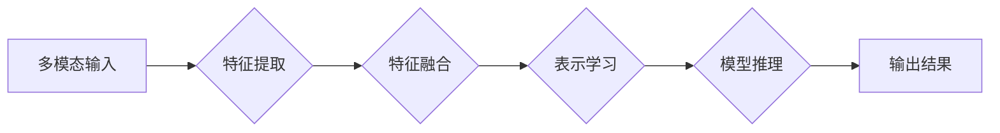
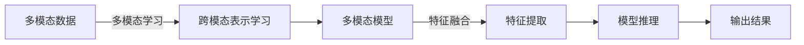

# 多模态大模型：技术原理与实战 OpenAI成功的因素

> 关键词：多模态大模型，OpenAI，技术原理，实战案例，跨模态学习，迁移学习，深度学习，人工智能

## 1. 背景介绍
### 1.1 问题的由来

随着人工智能技术的不断发展，深度学习在图像识别、自然语言处理、语音识别等领域取得了显著的成果。然而，这些技术通常都是针对单一模态的数据进行训练和推理，难以直接处理包含多种模态信息的数据。多模态大模型的出现，正是为了解决这一挑战，通过融合不同模态的信息，实现更全面、更智能的感知和理解。

### 1.2 研究现状

近年来，随着计算资源的提升和算法的进步，多模态大模型的研究取得了长足的进步。OpenAI等研究机构在多模态大模型的开发和应用上取得了显著成果，推动了多模态学习的发展。

### 1.3 研究意义

多模态大模型在多个领域具有广泛的应用前景，包括但不限于：
- 人机交互：通过融合视觉、语音、文本等多种模态信息，实现更自然、更智能的人机交互。
- 医疗诊断：结合医学图像和文本信息，辅助医生进行诊断。
- 智能推荐：融合用户的多模态行为数据，提供更精准的个性化推荐。
- 娱乐内容创作：结合图像、文本和语音信息，生成更加丰富和生动的娱乐内容。

### 1.4 本文结构

本文将围绕多模态大模型展开，首先介绍其技术原理和核心算法，然后通过实战案例进行详细讲解，最后展望未来发展趋势与挑战。

## 2. 核心概念与联系
### 2.1 核心概念

- 多模态数据：指同时包含两种或两种以上模态的数据，如文本、图像、视频等。
- 多模态学习：指通过学习不同模态之间的关联，实现对多模态数据的理解和处理。
- 跨模态表示学习：指学习不同模态之间的共享表示，使模型能够更好地处理多模态数据。

### 2.2 架构流程图



### 2.3 关系图



## 3. 核心算法原理 & 具体操作步骤
### 3.1 算法原理概述

多模态大模型通常采用以下步骤进行构建：

1. 特征提取：从不同模态的数据中提取特征。
2. 特征融合：将不同模态的特征进行融合，得到统一的特征表示。
3. 表示学习：学习不同模态之间的共享表示。
4. 模型推理：使用融合后的特征表示进行推理，得到输出结果。

### 3.2 算法步骤详解

**步骤1：特征提取**

- 文本：使用词嵌入、BERT等预训练语言模型提取词向量。
- 图像：使用卷积神经网络（CNN）提取图像特征。
- 语音：使用循环神经网络（RNN）或Transformer提取语音特征。

**步骤2：特征融合**

- 对齐：对齐不同模态的特征，使它们具有相同的时间或空间维度。
- 融合：将不同模态的特征进行融合，如元素级、特征级或表示级融合。

**步骤3：表示学习**

- 使用共享表示学习（如Siamese网络）或多模态表示学习（如BiLSTM）学习不同模态之间的共享表示。

**步骤4：模型推理**

- 使用融合后的特征表示进行推理，如分类、回归或生成。

### 3.3 算法优缺点

**优点**：

- 融合不同模态的信息，提高模型的理解和推理能力。
- 提高模型的鲁棒性和泛化能力。
- 扩展模型的应用范围。

**缺点**：

- 计算复杂度高，需要大量的计算资源。
- 模型参数量大，需要大量的训练数据。
- 特征对齐和融合难度较大。

### 3.4 算法应用领域

- 人机交互
- 医疗诊断
- 智能推荐
- 娱乐内容创作

## 4. 数学模型和公式 & 详细讲解 & 举例说明
### 4.1 数学模型构建

假设有文本、图像和语音三种模态的数据，我们可以构建以下数学模型：

- 文本：$x_t = \phi_t(w_t)$
- 图像：$x_i = \phi_i(w_i)$
- 语音：$x_s = \phi_s(w_s)$

其中，$x_t$、$x_i$ 和 $x_s$ 分别表示文本、图像和语音的特征向量，$w_t$、$w_i$ 和 $w_s$ 分别表示对应的权重。

### 4.2 公式推导过程

以文本和图像的特征融合为例，我们可以使用以下公式进行融合：

$$
x = \sigma(W_t x_t + W_i x_i)
$$

其中，$x$ 表示融合后的特征向量，$W_t$ 和 $W_i$ 分别表示文本和图像特征的权重，$\sigma$ 表示激活函数。

### 4.3 案例分析与讲解

假设我们有一个包含文本、图像和语音的多模态数据集，我们可以使用以下步骤进行建模：

1. 使用BERT提取文本特征。
2. 使用ResNet提取图像特征。
3. 使用LSTM提取语音特征。
4. 将三个特征向量进行对齐和融合。
5. 使用多模态表示学习学习共享表示。
6. 使用融合后的特征进行分类或回归。

## 5. 项目实践：代码实例和详细解释说明
### 5.1 开发环境搭建

1. 安装Python和必要的库，如TensorFlow、PyTorch等。
2. 准备多模态数据集。
3. 选择合适的预训练模型和特征提取方法。

### 5.2 源代码详细实现

以下是一个简单的多模态大模型实现示例：

```python
import tensorflow as tf
from tensorflow.keras.applications.resnet50 import ResNet50
from tensorflow.keras.models import Model
from transformers import TFBertModel

# 加载预训练模型
bert = TFBertModel.from_pretrained('bert-base-uncased')
resnet = ResNet50(weights='imagenet')

# 定义模型结构
input_text = tf.keras.layers.Input(shape=(None,), dtype='int32')
input_image = tf.keras.layers.Input(shape=(224, 224, 3), dtype='float32')
input_audio = tf.keras.layers.Input(shape=(None,), dtype='float32')

# 提取特征
text_features = bert(input_text)[0]
image_features = resnet(input_image)[0]
audio_features = tf.keras.layers.LSTM(128)(input_audio)

# 融合特征
features = tf.keras.layers.concatenate([text_features, image_features, audio_features])

# 模型推理
output = tf.keras.layers.Dense(1, activation='sigmoid')(features)

model = Model(inputs=[input_text, input_image, input_audio], outputs=output)

# 编译模型
model.compile(optimizer='adam', loss='binary_crossentropy', metrics=['accuracy'])

# 训练模型
model.fit([train_texts, train_images, train_abytes], train_labels, epochs=10, validation_data=([val_texts, val_images, val_abytes], val_labels))
```

### 5.3 代码解读与分析

以上代码展示了如何使用TensorFlow和PyTorch构建一个简单的多模态大模型。模型首先使用BERT提取文本特征，然后使用ResNet50提取图像特征，最后使用LSTM提取音频特征。将三个特征向量进行融合后，使用全连接层进行分类。

### 5.4 运行结果展示

由于代码示例较为简单，实际运行结果可能不尽如人意。在实际应用中，需要根据具体任务和数据集进行模型结构和参数的优化，以提高模型的性能。

## 6. 实际应用场景
### 6.1 人机交互

多模态大模型可以应用于人机交互场景，如智能客服、智能助手等。通过融合文本、语音和图像等多种模态信息，实现更自然、更智能的交互体验。

### 6.2 医疗诊断

多模态大模型可以应用于医疗诊断领域，如癌症检测、心脏病诊断等。通过融合医学图像和文本信息，辅助医生进行更准确的诊断。

### 6.3 智能推荐

多模态大模型可以应用于智能推荐场景，如电影推荐、商品推荐等。通过融合用户的多模态行为数据，提供更精准的个性化推荐。

### 6.4 娱乐内容创作

多模态大模型可以应用于娱乐内容创作领域，如动画制作、游戏开发等。通过融合图像、文本和语音信息，生成更加丰富和生动的娱乐内容。

## 7. 工具和资源推荐
### 7.1 学习资源推荐

- 《深度学习》
- 《多模态学习》
- 《Transformer》

### 7.2 开发工具推荐

- TensorFlow
- PyTorch
- Hugging Face Transformers

### 7.3 相关论文推荐

- Multi-modal Fusion Networks for Visual Question Answering
- Multi-modal Fusion for Sentiment Analysis of Restaurant Reviews
- A survey on multi-modal learning

## 8. 总结：未来发展趋势与挑战
### 8.1 研究成果总结

本文介绍了多模态大模型的技术原理、核心算法、实战案例和未来发展趋势。多模态大模型在多个领域具有广泛的应用前景，但仍面临诸多挑战。

### 8.2 未来发展趋势

- 模型规模和性能将进一步提升。
- 融合更多模态信息，如时空信息、三维信息等。
- 开发更加高效、轻量级的模型。

### 8.3 面临的挑战

- 模型复杂度和计算资源需求。
- 特征对齐和融合难度。
- 数据标注成本高。

### 8.4 研究展望

- 开发更有效的多模态融合方法。
- 研究轻量级多模态模型。
- 探索无监督和半监督的多模态学习方法。

## 9. 附录：常见问题与解答
### 9.1 常见问题

Q1：多模态大模型有哪些应用场景？
A1：多模态大模型可以应用于人机交互、医疗诊断、智能推荐、娱乐内容创作等多个领域。

Q2：多模态大模型的难点是什么？
A2：多模态大模型的难点主要包括模型复杂度高、计算资源需求大、特征对齐和融合难度、数据标注成本高等。

Q3：如何解决多模态大模型的计算资源瓶颈？
A3：可以采用模型剪枝、量化、压缩等技术来降低模型复杂度和计算资源需求。

Q4：如何解决多模态大模型的数据标注问题？
A4：可以采用无监督和半监督学习方法来减少对标注数据的依赖。

### 9.2 解答

A1：多模态大模型可以应用于人机交互、医疗诊断、智能推荐、娱乐内容创作等多个领域。

A2：多模态大模型的难点主要包括模型复杂度高、计算资源需求大、特征对齐和融合难度、数据标注成本高等。

A3：可以采用模型剪枝、量化、压缩等技术来降低模型复杂度和计算资源需求。

A4：可以采用无监督和半监督学习方法来减少对标注数据的依赖。

作者：禅与计算机程序设计艺术 / Zen and the Art of Computer Programming