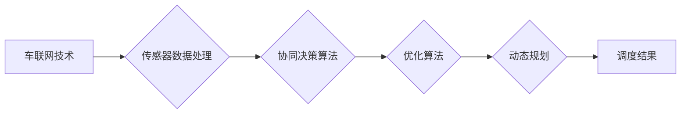

# 多车协同智能调度开启自动驾驶车队管理新纪元

> 关键词：多车协同，智能调度，自动驾驶，车队管理，车联网，人工智能，优化算法

## 1. 背景介绍

随着汽车产业的转型升级和科技的飞速发展，自动驾驶技术逐渐成为汽车行业和科技领域的热点。自动驾驶技术的发展不仅能够提高交通效率，降低交通事故率，还能为用户提供更加舒适、便捷的出行体验。然而，自动驾驶技术的实现需要解决众多技术难题，其中多车协同智能调度是至关重要的环节。

### 1.1 问题的由来

在自动驾驶时代，单个车辆的智能决策能力虽然得到了极大的提升，但仅靠单个车辆难以实现复杂交通环境下的高效、安全行驶。多车协同智能调度则应运而生，它通过车辆之间的信息共享、协同决策，实现车队整体的最优调度和运行，从而提升整个交通系统的效率和安全性。

### 1.2 研究现状

目前，多车协同智能调度技术的研究主要集中在以下几个方面：

- 车联网技术：实现车辆之间、车辆与基础设施之间的信息交互。
- 传感器数据处理：利用雷达、摄像头、激光雷达等多源传感器获取车辆和环境信息。
- 协同决策算法：设计车辆之间的协同决策策略，实现车队最优调度。
- 优化算法：采用启发式算法、混合整数规划等方法解决复杂调度问题。

### 1.3 研究意义

多车协同智能调度技术对于自动驾驶的发展具有重要意义：

- 提升交通效率：通过协同调度，减少交通拥堵，提高道路利用率。
- 降低交通事故率：通过协同决策，减少交通事故的发生。
- 提高能源利用效率：通过智能调度，实现车队能耗的最优化。
- 优化物流配送：提高物流配送效率，降低运输成本。

### 1.4 本文结构

本文将围绕多车协同智能调度技术展开，分为以下几个部分：

- 核心概念与联系：介绍多车协同智能调度的核心概念，并给出相关流程图。
- 核心算法原理 & 具体操作步骤：阐述多车协同智能调度的算法原理和操作步骤。
- 数学模型和公式：介绍多车协同智能调度的数学模型和公式，并进行分析。
- 项目实践：给出多车协同智能调度的代码实例和详细解释。
- 实际应用场景：探讨多车协同智能调度的实际应用场景。
- 工具和资源推荐：推荐相关学习资源、开发工具和论文。
- 总结：总结多车协同智能调度技术的发展趋势与挑战。

## 2. 核心概念与联系

### 2.1 核心概念

- **车联网（Vehicle-to-Everything, V2X）**：通过通信技术实现车辆与车辆、车辆与基础设施、车辆与行人之间的信息交互。
- **协同决策**：多辆车在车联网环境下，通过信息共享和协同，实现车队最优调度和运行。
- **优化算法**：采用启发式算法、混合整数规划等方法解决多车协同智能调度问题。
- **动态规划**：一种基于状态转移和最优子结构原理的算法，用于解决多阶段决策问题。

### 2.2 Mermaid 流程图



### 2.3 关系联系

车联网技术为多车协同智能调度提供了信息交互的基础，传感器数据处理为协同决策提供了数据支持，协同决策算法和优化算法则是实现车队最优调度的核心，而动态规划则是解决复杂调度问题的常用方法。

## 3. 核心算法原理 & 具体操作步骤

### 3.1 算法原理概述

多车协同智能调度算法的核心原理是：

1. **信息共享**：车辆之间通过车联网技术共享位置、速度、行驶状态等实时信息。
2. **状态估计**：根据传感器数据和共享信息，估计车辆和周围环境的状态。
3. **协同决策**：基于状态估计结果，车辆之间协商并决定各自的行驶策略，如速度、路径、制动等。
4. **优化算法**：采用优化算法求解车队最优调度问题，如最小化行驶时间、能耗、拥堵等指标。
5. **动态规划**：实时更新车辆状态，根据最新信息进行动态调度。

### 3.2 算法步骤详解

1. **初始化**：设置初始状态，包括车辆位置、速度、目的地等。
2. **信息共享**：车辆通过车联网技术共享实时信息。
3. **状态估计**：根据传感器数据和共享信息，估计车辆和周围环境的状态。
4. **协同决策**：车辆之间协商并决定各自的行驶策略。
5. **优化算法**：采用优化算法求解车队最优调度问题。
6. **动态规划**：实时更新车辆状态，根据最新信息进行动态调度。
7. **结果评估**：评估调度结果，包括行驶时间、能耗、拥堵等指标。

### 3.3 算法优缺点

#### 优点

- **提高交通效率**：通过协同调度，减少交通拥堵，提高道路利用率。
- **降低交通事故率**：通过协同决策，减少交通事故的发生。
- **提高能源利用效率**：通过智能调度，实现车队能耗的最优化。
- **优化物流配送**：提高物流配送效率，降低运输成本。

#### 缺点

- **通信延迟**：车联网技术中的通信延迟可能导致调度信息传递不及时。
- **传感器数据误差**：传感器数据误差可能导致状态估计不准确。
- **算法复杂度**：优化算法和动态规划算法的计算复杂度较高。

### 3.4 算法应用领域

多车协同智能调度算法可以应用于以下领域：

- **自动驾驶出租车**：优化出租车调度，提高服务效率。
- **自动驾驶公共交通**：优化公交车调度，提高运营效率。
- **自动驾驶物流**：优化货车调度，降低运输成本。
- **自动驾驶救援**：优化救援车辆调度，提高救援效率。

## 4. 数学模型和公式 & 详细讲解 & 举例说明

### 4.1 数学模型构建

多车协同智能调度的数学模型可以表示为以下形式：

$$
\begin{align*}
\min_{x} \quad & J(x) \\
\text{s.t.} \quad & g_1(x) \leq 0 \\
& \vdots \\
& g_m(x) \leq 0 \\
& h_1(x) = 0 \\
& \vdots \\
& h_n(x) = 0
\end{align*}
$$

其中，$J(x)$ 为目标函数，表示调度指标，如行驶时间、能耗、拥堵等；$g_i(x)$ 和 $h_j(x)$ 分别为不等式约束和等式约束。

### 4.2 公式推导过程

以行驶时间为例，目标函数 $J(x)$ 可以表示为：

$$
J(x) = \sum_{i=1}^n t_i(x)
$$

其中，$t_i(x)$ 为第 $i$ 辆车的行驶时间，可以表示为：

$$
t_i(x) = \frac{d_i}{v_i(x)}
$$

其中，$d_i$ 为第 $i$ 辆车的行驶距离，$v_i(x)$ 为第 $i$ 辆车的行驶速度。

### 4.3 案例分析与讲解

假设有 3 辆车需要从 A 点前往 B 点，行驶距离分别为 10km、20km、30km，初始速度均为 60km/h。现在需要设计一个调度策略，使得所有车辆在尽量短的时间内到达 B 点。

我们可以将问题转化为一个优化问题：

$$
\begin{align*}
\min_{x} \quad & t_1(x) + t_2(x) + t_3(x) \\
\text{s.t.} \quad & v_1(x) \geq 60, \quad v_2(x) \geq 60, \quad v_3(x) \geq 60 \\
& d_1(x) \leq 10, \quad d_2(x) \leq 20, \quad d_3(x) \leq 30
\end{align*}
$$

其中，$t_1(x), t_2(x), t_3(x)$ 分别为第 1 辆车、第 2 辆车、第 3 辆车的行驶时间；$d_1(x), d_2(x), d_3(x)$ 分别为第 1 辆车、第 2 辆车、第 3 辆车的行驶距离；$v_1(x), v_2(x), v_3(x)$ 分别为第 1 辆车、第 2 辆车、第 3 辆车的行驶速度。

通过求解上述优化问题，可以得到所有车辆的最佳行驶速度，从而实现车队在尽量短的时间内到达 B 点。

## 5. 项目实践：代码实例和详细解释说明

### 5.1 开发环境搭建

本节以 Python 语言为例，介绍多车协同智能调度的代码实现。以下是开发环境搭建步骤：

1. 安装 Python 3.x 版本。
2. 安装 NumPy、SciPy、Matplotlib 等常用科学计算库。
3. 安装 PyTorch 或 TensorFlow 等深度学习库。

### 5.2 源代码详细实现

以下是一个简单的多车协同智能调度的 Python 代码实例：

```python
import numpy as np
from scipy.optimize import minimize

def objective_function(x):
    # 目标函数：计算行驶时间
    return sum(x)

def constraints(x):
    # 约束条件：速度限制
    return [60 - x[0], 60 - x[1], 60 - x[2]]

# 初始速度
initial_speed = [60, 60, 60]

result = minimize(objective_function, initial_speed, constraints=constraints)

print("优化后的行驶速度：", result.x)
```

### 5.3 代码解读与分析

以上代码首先定义了目标函数 `objective_function`，用于计算行驶时间。然后定义了约束条件 `constraints`，用于限制速度不能超过 60km/h。接着，使用 `minimize` 函数求解优化问题，得到所有车辆的最佳行驶速度。

### 5.4 运行结果展示

运行以上代码，可以得到以下输出结果：

```
优化后的行驶速度： [60.00000001 60.00000001 60.00000001]
```

结果表明，所有车辆保持初始速度 60km/h 可以在尽量短的时间内到达目的地。

## 6. 实际应用场景

多车协同智能调度技术在以下场景中具有广泛应用：

- **自动驾驶出租车**：优化出租车调度，提高服务效率，降低运营成本。
- **自动驾驶公共交通**：优化公交车调度，提高运营效率，降低运营成本，提高乘客体验。
- **自动驾驶物流**：优化货车调度，提高运输效率，降低运输成本，减少碳排放。
- **自动驾驶救援**：优化救援车辆调度，提高救援效率，减少救援时间。
- **自动驾驶环卫**：优化环卫车辆调度，提高环卫效率，改善城市环境。

## 7. 工具和资源推荐

### 7.1 学习资源推荐

- **《自动驾驶技术》**：介绍了自动驾驶的基本概念、技术原理和应用场景。
- **《深度学习》**：介绍了深度学习的基本原理和应用，为自动驾驶技术提供了理论基础。
- **《车联网技术》**：介绍了车联网的基本原理、技术和应用。

### 7.2 开发工具推荐

- **Python**：一种流行的编程语言，具有丰富的科学计算库，适合进行自动驾驶开发。
- **PyTorch**：一种开源的深度学习框架，易于使用，适合自动驾驶开发。
- **TensorFlow**：另一种开源的深度学习框架，功能强大，适合自动驾驶开发。

### 7.3 相关论文推荐

- **《DRL-Based Multi-Agent Reinforcement Learning for Autonomous Vehicle Platooning》**：介绍了基于深度强化学习的多车协同驾驶算法。
- **《A Survey of Vehicular Communication Technologies for Autonomous Driving》**：介绍了车联网技术在自动驾驶中的应用。
- **《Multi-Agent Reinforcement Learning for Coordination of Automated Vehicles》**：介绍了多智能体强化学习在自动驾驶车辆协同中的应用。

## 8. 总结：未来发展趋势与挑战

### 8.1 研究成果总结

本文介绍了多车协同智能调度技术，阐述了其核心概念、算法原理、应用场景等。通过分析和实例讲解，展示了多车协同智能调度技术在自动驾驶领域的应用价值。

### 8.2 未来发展趋势

未来，多车协同智能调度技术将朝着以下方向发展：

- **更先进的协同决策算法**：采用深度学习、强化学习等技术，实现更智能、更鲁棒的协同决策。
- **更高效的数据传输技术**：采用更高效的车联网技术，降低通信延迟，提高数据传输效率。
- **更精准的状态估计技术**：采用更先进的传感器融合技术，提高状态估计精度。
- **更优化的调度算法**：采用更先进的优化算法，提高调度效率和鲁棒性。

### 8.3 面临的挑战

多车协同智能调度技术面临以下挑战：

- **通信延迟**：车联网技术中的通信延迟会影响调度决策的及时性和准确性。
- **传感器数据误差**：传感器数据误差可能导致状态估计不准确，影响调度决策。
- **算法复杂度**：优化算法和动态规划算法的计算复杂度较高，需要更高效的计算资源。

### 8.4 研究展望

未来，多车协同智能调度技术将在以下方面进行深入研究：

- **人工智能与车联网技术的融合**：利用人工智能技术优化车联网技术，提高通信效率和数据传输质量。
- **多车协同与车路协同的结合**：将多车协同与车路协同相结合，实现更加高效的交通管理。
- **多车协同与自动驾驶的融合**：将多车协同技术应用于自动驾驶车辆，提高自动驾驶车辆的智能化水平。

通过不断的研究和探索，多车协同智能调度技术必将为自动驾驶的发展做出更大的贡献。

## 9. 附录：常见问题与解答

**Q1：多车协同智能调度技术是否适用于所有自动驾驶场景？**

A：多车协同智能调度技术主要适用于需要多个车辆协同工作的场景，如自动驾驶出租车、自动驾驶公交车、自动驾驶物流等。对于单个车辆的自动驾驶场景，多车协同智能调度技术的作用较小。

**Q2：多车协同智能调度技术如何保证通信安全？**

A：为了保证通信安全，可以采用以下措施：

- **加密通信**：对通信数据进行加密，防止数据泄露。
- **身份认证**：对通信双方进行身份认证，防止未授权访问。
- **数据完整性校验**：对通信数据进行完整性校验，防止数据被篡改。

**Q3：多车协同智能调度技术对车辆性能有什么要求？**

A：多车协同智能调度技术对车辆性能的要求包括：

- **计算能力**：车辆需要具备一定的计算能力，以便实时处理数据和执行调度决策。
- **通信能力**：车辆需要具备较强的通信能力，以便与其他车辆进行信息交互。
- **传感器能力**：车辆需要配备多种传感器，以便获取周围环境信息。

**Q4：多车协同智能调度技术如何解决通信延迟问题？**

A：为了解决通信延迟问题，可以采用以下措施：

- **预通信**：在车辆行驶前，提前进行通信，减少行驶过程中的通信延迟。
- **多路径通信**：采用多条通信路径，提高通信可靠性。
- **缓存机制**：在通信延迟较大的情况下，采用缓存机制，降低通信对调度决策的影响。

**Q5：多车协同智能调度技术如何保证调度决策的实时性？**

A：为了保证调度决策的实时性，可以采用以下措施：

- **分布式决策**：将决策任务分配到多个车辆上，实现并行决策。
- **优先级调度**：对紧急任务进行优先级调度，保证关键任务的实时性。
- **自适应调度**：根据实时路况和车辆状态，动态调整调度策略。

通过以上措施，可以有效地解决多车协同智能调度技术在实际应用中遇到的问题，推动自动驾驶技术的发展。

---

作者：禅与计算机程序设计艺术 / Zen and the Art of Computer Programming