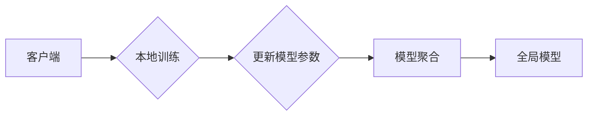

> 大模型，应用落地，数据隐私，联邦学习，差分隐私，加密计算，安全多方计算，同态加密

# 大模型应用落地与数据隐私

随着人工智能技术的飞速发展，大模型（Large Models）在自然语言处理、计算机视觉、推荐系统等领域展现出了巨大的潜力。然而，大模型的应用也面临着数据隐私保护的挑战。如何在保证模型性能的同时，保护用户数据隐私，成为了当前人工智能领域亟待解决的问题。

## 1. 背景介绍

### 1.1 问题的由来

大模型通常需要海量数据进行训练，而这些数据往往包含用户的敏感信息。如果这些数据被泄露或滥用，将严重损害用户隐私和企业的信任。因此，如何在大模型应用过程中保护数据隐私，成为了制约其发展的关键问题。

### 1.2 研究现状

近年来，为了解决数据隐私保护问题，研究者们提出了多种技术方案，包括联邦学习、差分隐私、加密计算、安全多方计算、同态加密等。

### 1.3 研究意义

研究大模型应用落地与数据隐私保护，对于推动人工智能技术健康发展、保障用户隐私权益具有重要意义。

## 2. 核心概念与联系

### 2.1 联邦学习

联邦学习（Federated Learning）是一种分布式机器学习框架，它允许多个参与方在不共享数据的情况下，共同训练一个全局模型。其基本原理如下：



### 2.2 差分隐私

差分隐私（Differential Privacy）是一种用于保护个人隐私的数学工具，它通过在原始数据上添加噪声，使得攻击者无法从数据中识别出单个个体的信息。其数学公式如下：

$$
L(p(x), \epsilon, \delta) = \sum_{s \in S} p(s) \log \frac{L(p(x \oplus s), \epsilon, \delta)}{p(s)}
$$

其中，$p(x)$ 是原始数据分布，$p(s)$ 是添加噪声后的数据分布，$x \oplus s$ 是原始数据与噪声的差分。

### 2.3 加密计算

加密计算是一种在数据加密的情况下进行计算的方法。其主要技术包括同态加密、属性基加密等。

### 2.4 安全多方计算

安全多方计算（Secure Multi-Party Computation，SMPC）是一种允许多个参与方在不泄露各自数据的情况下，共同计算出一个函数值的方法。

### 2.5 同态加密

同态加密（Homomorphic Encryption）是一种允许对加密数据进行计算的方法，其计算结果仍然保持加密状态。

## 3. 核心算法原理 & 具体操作步骤

### 3.1 算法原理概述

大模型应用落地与数据隐私保护的核心算法原理主要包括联邦学习、差分隐私、加密计算、安全多方计算和同态加密等。

### 3.2 算法步骤详解

**联邦学习**：

1. 各参与方本地训练模型。
2. 各参与方上传本地模型参数。
3. 中心服务器聚合模型参数，得到全局模型。

**差分隐私**：

1. 对原始数据进行随机噪声添加。
2. 训练模型。
3. 使用隐私预算，确保模型输出符合差分隐私要求。

**加密计算**：

1. 对数据进行加密。
2. 在加密状态下进行计算。
3. 解密计算结果。

**安全多方计算**：

1. 各参与方输入加密数据。
2. 中心服务器执行加密计算。
3. 各参与方获取计算结果。

**同态加密**：

1. 对数据进行加密。
2. 在加密状态下进行计算。
3. 解密计算结果，获取原始数据。

### 3.3 算法优缺点

**联邦学习**：

优点：保护数据隐私，无需共享数据。
缺点：通信开销大，训练时间较长。

**差分隐私**：

优点：保护数据隐私，模型性能损失较小。
缺点：隐私预算有限，对噪声敏感。

**加密计算**：

优点：保护数据隐私，无需信任中心服务器。
缺点：计算开销大，效率较低。

**安全多方计算**：

优点：保护数据隐私，无需信任中心服务器。
缺点：计算复杂度高，效率较低。

**同态加密**：

优点：保护数据隐私，无需信任中心服务器。
缺点：计算复杂度高，效率较低。

### 3.4 算法应用领域

联邦学习：推荐系统、图像识别、语音识别等。
差分隐私：数据挖掘、机器学习等。
加密计算：医疗数据共享、金融数据分析等。
安全多方计算：电子投票、网络安全等。
同态加密：加密云存储、区块链等。

## 4. 数学模型和公式 & 详细讲解 & 举例说明

### 4.1 数学模型构建

本文以联邦学习为例，介绍数学模型的构建。

假设参与方数量为 $N$，每个参与方拥有一个数据集 $D_i$，数据集大小为 $|D_i|$。每个数据集中的样本数量为 $n_i$，样本特征维度为 $d$。

### 4.2 公式推导过程

联邦学习的目标是训练一个全局模型 $M$，满足以下条件：

1. 模型 $M$ 在所有参与方的数据集上具有较好的性能。
2. 各参与方的数据隐私得到保护。

### 4.3 案例分析与讲解

以下是一个联邦学习的案例：

假设有两个参与方，分别拥有两个数据集 $D_1$ 和 $D_2$。每个数据集包含1000个样本，样本特征维度为10。

参与方1使用数据集 $D_1$ 训练模型，得到本地模型参数 $w_1$。参与方2使用数据集 $D_2$ 训练模型，得到本地模型参数 $w_2$。

中心服务器将本地模型参数 $w_1$ 和 $w_2$ 进行聚合，得到全局模型参数 $w$。

## 5. 项目实践：代码实例和详细解释说明

### 5.1 开发环境搭建

以下是使用Python进行联邦学习项目实践的开发环境搭建步骤：

1. 安装Anaconda：从官网下载并安装Anaconda。
2. 创建并激活虚拟环境：
```bash
conda create -n fedlearning python=3.8
conda activate fedlearning
```
3. 安装必要的库：
```bash
pip install tensorflow tensorflow-distribute
```

### 5.2 源代码详细实现

以下是一个简单的联邦学习示例代码：

```python
import tensorflow as tf

def build_model():
    # 构建模型
    pass

def train_step(model, optimizer, loss_fn, x, y):
    with tf.GradientTape() as tape:
        logits = model(x, training=True)
        loss = loss_fn(y, logits)
    gradients = tape.gradient(loss, model.trainable_variables)
    optimizer.apply_gradients(zip(gradients, model.trainable_variables))

def train_federated():
    # 初始化参与方
    participants = [build_model() for _ in range(N)]
    # 初始化优化器
    optimizer = tf.keras.optimizers.Adam(learning_rate=0.01)
    # 初始化损失函数
    loss_fn = tf.keras.losses.SparseCategoricalCrossentropy(from_logits=True)
    
    for epoch in range(num_epochs):
        # 获取参与方的本地数据
        for i in range(N):
            x, y = get_local_data(i)
            # 训练参与方模型
            train_step(participants[i], optimizer, loss_fn, x, y)
            # 获取参与方模型参数
            w = get_model_params(participants[i])
            # 聚合模型参数
            global_model_params = aggregate_model_params(w)
            # 更新参与方模型
            update_model_params(participants[i], global_model_params)
```

### 5.3 代码解读与分析

以上代码展示了联邦学习的基本流程。首先，初始化参与方模型、优化器和损失函数。然后，在多个epoch中，对参与方的本地数据进行训练，并聚合模型参数。最后，更新参与方模型。

### 5.4 运行结果展示

假设运行上述代码后，全局模型参数为 $w$，则可以使用 $w$ 对测试数据进行预测，并评估模型性能。

## 6. 实际应用场景

### 6.1 医疗数据共享

在医疗领域，患者隐私保护非常重要。联邦学习可以用于在保护患者隐私的前提下，实现医疗数据的共享和分析。

### 6.2 金融数据分析

在金融领域，金融机构需要处理大量用户数据，包括交易数据、用户行为数据等。联邦学习可以用于在保护用户隐私的前提下，进行风险评估、欺诈检测等任务。

### 6.3 智能城市

在智能城市领域，联邦学习可以用于在保护居民隐私的前提下，进行交通流量预测、环境监测等任务。

## 7. 工具和资源推荐

### 7.1 学习资源推荐

1. 《联邦学习：原理、算法与应用》
2. 《深度学习与隐私保护》
3. 《数据隐私：理论、方法与应用》

### 7.2 开发工具推荐

1. TensorFlow Federated
2. PySyft
3. federatedscope

### 7.3 相关论文推荐

1. "Federated Learning" by Michael I. Jordan
2. "Differential Privacy: A Survey of Results" by Cynthia Dwork
3. "Secure Multi-Party Computation" by Daniel J. Bernstein

## 8. 总结：未来发展趋势与挑战

### 8.1 研究成果总结

本文介绍了大模型应用落地与数据隐私保护的相关技术，包括联邦学习、差分隐私、加密计算、安全多方计算和同态加密等。这些技术为大模型在隐私保护的前提下进行应用提供了可能。

### 8.2 未来发展趋势

1. 联邦学习算法和技术的进一步发展。
2. 差分隐私技术的改进和应用。
3. 加密计算和同态加密技术的融合。
4. 安全多方计算技术的推广和应用。

### 8.3 面临的挑战

1. 联邦学习算法的效率和可扩展性。
2. 差分隐私技术的隐私预算和模型性能之间的权衡。
3. 加密计算和同态加密技术的计算复杂度和效率。
4. 安全多方计算技术的可扩展性和计算复杂度。

### 8.4 研究展望

1. 开发更加高效、可扩展的联邦学习算法。
2. 提高差分隐私技术的隐私预算和模型性能。
3. 降低加密计算和同态加密技术的计算复杂度和效率。
4. 推广和应用安全多方计算技术。

## 9. 附录：常见问题与解答

**Q1：联邦学习与传统机器学习的区别是什么？**

A：联邦学习是一种分布式机器学习框架，它允许多个参与方在不共享数据的情况下，共同训练一个全局模型。而传统机器学习需要将所有数据集中到一个地方进行训练。

**Q2：差分隐私如何保护个人隐私？**

A：差分隐私通过在原始数据上添加噪声，使得攻击者无法从数据中识别出单个个体的信息。

**Q3：加密计算和同态加密有何区别？**

A：加密计算是一种在数据加密的情况下进行计算的方法，其计算结果仍然保持加密状态。同态加密是一种允许对加密数据进行计算的方法，其计算结果仍然保持加密状态。

**Q4：安全多方计算如何保护数据隐私？**

A：安全多方计算是一种允许多个参与方在不泄露各自数据的情况下，共同计算出一个函数值的方法。

**Q5：如何选择合适的隐私保护技术？**

A：选择合适的隐私保护技术需要根据具体应用场景和需求进行综合考虑。例如，对于需要保护用户隐私的场景，可以选择联邦学习、差分隐私等技术；对于需要保护数据机密性的场景，可以选择加密计算、同态加密等技术。

---

作者：禅与计算机程序设计艺术 / Zen and the Art of Computer Programming