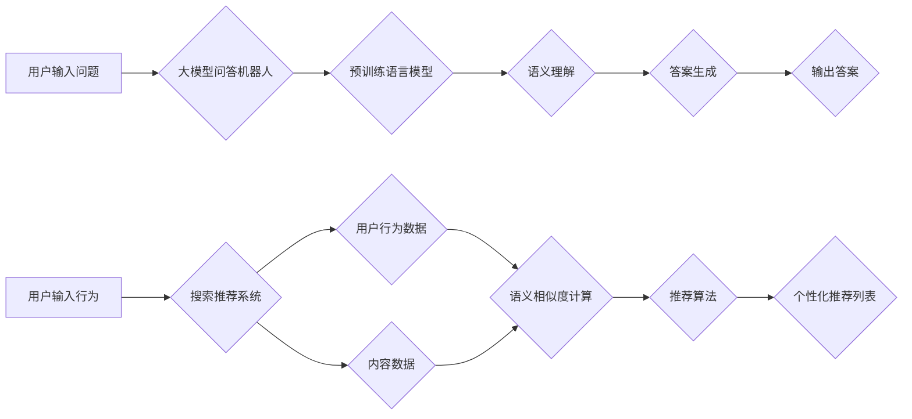

# 大模型问答机器人与搜索推荐的对比

> 关键词：大模型问答，搜索推荐，自然语言处理，语义理解，信息检索，机器学习，人工智能

## 1. 背景介绍

随着人工智能技术的飞速发展，自然语言处理（NLP）技术已经取得了显著的进步。其中，大模型问答机器人和搜索推荐系统作为NLP领域的重要应用，广泛应用于信息检索、智能客服、在线教育、内容推荐等领域。两者虽然都属于NLP范畴，但工作原理、技术架构和应用场景存在显著差异。本文将对比分析大模型问答机器人和搜索推荐系统的异同，探讨其发展现状和未来趋势。

### 1.1 大模型问答机器人的兴起

大模型问答机器人是指基于大规模预训练语言模型（如BERT、GPT等）的问答系统。这类系统通过学习海量文本数据，具备较强的语义理解和生成能力，能够对用户提出的问题给出准确、流畅的回答。大模型问答机器人的兴起，标志着NLP技术从传统的基于规则和模板的方法，迈向了基于深度学习的智能化时代。

### 1.2 搜索推荐系统的演进

搜索推荐系统旨在为用户提供个性化的信息推荐，帮助用户发现感兴趣的内容。早期的推荐系统主要基于内容推荐，即根据用户的历史行为和内容属性进行推荐。随着NLP技术的进步，推荐系统开始引入语义信息，实现基于语义的推荐，提高了推荐的准确性和个性化程度。

### 1.3 对比分析的意义

本文对比分析大模型问答机器人和搜索推荐系统的异同，有助于：

1. 深入理解两种系统的技术原理和应用场景。
2. 发现两种系统在性能、效率和用户体验等方面的优缺点。
3. 为NLP技术的进一步研究和应用提供参考。

## 2. 核心概念与联系

为了更好地理解大模型问答机器人和搜索推荐系统，以下将介绍它们的核心概念和联系，并使用Mermaid流程图展示两者的技术架构。

### 2.1 核心概念

#### 大模型问答机器人

- **预训练语言模型**：基于大规模无标签语料进行预训练的语言模型，如BERT、GPT等。
- **问答对**：包含问题和答案的文本对，用于训练问答系统。
- **语义理解**：理解用户问题的语义内容，包括问题类型、实体识别、关系抽取等。
- **答案生成**：根据问题语义生成准确的答案。

#### 搜索推荐系统

- **用户行为数据**：用户的搜索历史、浏览记录、购买记录等。
- **内容数据**：待推荐的内容信息，包括文本、图片、视频等。
- **语义相似度**：衡量用户行为和内容之间语义相似程度的指标。
- **推荐算法**：根据用户行为和内容数据，生成个性化的推荐列表。

### 2.2 技术架构流程图



图中展示了大模型问答机器人和搜索推荐系统的技术架构流程。用户输入问题或行为后，分别进入对应的系统进行处理，最终得到答案或个性化推荐列表。

## 3. 核心算法原理 & 具体操作步骤

### 3.1 算法原理概述

#### 大模型问答机器人

1. **预训练**：在大量无标签文本语料上进行预训练，学习语言模型参数。
2. **语义理解**：将用户问题输入预训练模型，进行语义分析，识别问题类型、实体、关系等。
3. **答案生成**：根据问题语义，从知识库或预训练模型中检索答案，或生成新的答案。

#### 搜索推荐系统

1. **用户行为数据收集**：收集用户的搜索历史、浏览记录、购买记录等。
2. **内容数据收集**：收集待推荐的内容信息，包括文本、图片、视频等。
3. **语义相似度计算**：计算用户行为和内容之间的语义相似度。
4. **推荐算法**：根据语义相似度和用户偏好，生成个性化的推荐列表。

### 3.2 算法步骤详解

#### 大模型问答机器人

1. **文本预处理**：对用户问题进行分词、词性标注、实体识别等预处理操作。
2. **输入编码**：将预处理后的文本输入预训练模型，进行编码得到向量表示。
3. **语义理解**：根据编码结果，识别问题类型、实体、关系等。
4. **答案检索**：从知识库中检索与问题语义相关的答案，或生成新的答案。
5. **答案生成**：将检索到的答案或生成的答案进行格式化处理，输出最终结果。

#### 搜索推荐系统

1. **用户行为数据预处理**：对用户行为数据进行分词、词性标注、实体识别等预处理操作。
2. **内容数据预处理**：对内容数据进行分词、词性标注、实体识别等预处理操作。
3. **语义向量计算**：计算用户行为和内容数据的语义向量。
4. **语义相似度计算**：计算用户行为和内容数据之间的语义相似度。
5. **推荐算法**：根据语义相似度和用户偏好，生成个性化的推荐列表。

### 3.3 算法优缺点

#### 大模型问答机器人

**优点**：

- **语义理解能力强**：能够理解用户问题的语义内容，生成准确、流畅的答案。
- **泛化能力强**：能够处理各种类型的问答任务。

**缺点**：

- **训练成本高**：需要大量标注数据和高性能计算资源。
- **答案质量受限于知识库和预训练模型**。

#### 搜索推荐系统

**优点**：

- **个性化程度高**：能够根据用户行为和偏好生成个性化的推荐列表。
- **可扩展性强**：能够处理各种类型的内容数据。

**缺点**：

- **语义理解能力相对较弱**：难以理解用户复杂的需求。
- **推荐质量受限于用户行为和内容数据**。

### 3.4 算法应用领域

#### 大模型问答机器人

- **智能客服**
- **智能助手**
- **问答系统**
- **知识图谱问答**

#### 搜索推荐系统

- **内容推荐**
- **商品推荐**
- **广告推荐**
- **推荐新闻**

## 4. 数学模型和公式 & 详细讲解 & 举例说明

### 4.1 数学模型构建

#### 大模型问答机器人

假设用户问题为 $q$，答案为 $a$，预训练语言模型参数为 $\theta$，则大模型问答机器人的数学模型可以表示为：

$$
P(a|q;\theta) = \text{softmax}(\theta W_q q + b_a)
$$

其中，$W_q$ 是问题编码矩阵，$b_a$ 是答案偏置。

#### 搜索推荐系统

假设用户行为数据为 $u$，内容数据为 $v$，用户偏好向量为 $p$，内容向量表示为 $q$，则搜索推荐系统的数学模型可以表示为：

$$
r(u,v) = \theta u^T v + b
$$

其中，$\theta$ 是推荐系数，$b$ 是偏置。

### 4.2 公式推导过程

#### 大模型问答机器人

1. **问题编码**：将用户问题 $q$ 编码为向量 $q$，其中 $q$ 由预训练语言模型参数 $\theta$ 确定。
2. **答案编码**：将答案 $a$ 编码为向量 $a$，其中 $a$ 也由预训练语言模型参数 $\theta$ 确定。
3. **计算概率**：计算答案 $a$ 在问题 $q$ 下的概率 $P(a|q;\theta)$。

#### 搜索推荐系统

1. **用户行为编码**：将用户行为数据 $u$ 编码为向量 $u$。
2. **内容编码**：将内容数据 $v$ 编码为向量 $v$。
3. **计算相似度**：计算用户行为和内容数据之间的相似度 $r(u,v)$。
4. **推荐系数**：根据相似度计算推荐系数 $\theta$。

### 4.3 案例分析与讲解

#### 大模型问答机器人

假设用户问题为“今天天气怎么样？”，预训练语言模型为BERT，则：

1. **问题编码**：将“今天天气怎么样？”编码为向量 $q$。
2. **答案编码**：从知识库中检索与“今天天气”相关的答案，如“今天天气晴朗”。
3. **计算概率**：计算“今天天气晴朗”在问题“今天天气怎么样？”下的概率 $P(a|q;\theta)$。
4. **输出答案**：输出概率最大的答案，即“今天天气晴朗”。

#### 搜索推荐系统

假设用户历史行为数据为“搜索过天气预报”、“浏览过晴天旅游攻略”，待推荐内容为“雨天旅游攻略”，则：

1. **用户行为编码**：将用户历史行为数据编码为向量 $u$。
2. **内容编码**：将待推荐内容编码为向量 $v$。
3. **计算相似度**：计算用户行为和内容数据之间的相似度 $r(u,v)$。
4. **推荐系数**：根据相似度计算推荐系数 $\theta$。
5. **生成推荐列表**：根据推荐系数，生成包含“雨天旅游攻略”的个性化推荐列表。

## 5. 项目实践：代码实例和详细解释说明

### 5.1 开发环境搭建

为了实现大模型问答机器人和搜索推荐系统，我们需要搭建以下开发环境：

1. 操作系统：Windows、Linux、macOS
2. 编程语言：Python
3. 框架：PyTorch、TensorFlow
4. 工具：Jupyter Notebook、Docker

### 5.2 源代码详细实现

以下是一个简单的基于BERT的大模型问答机器人的PyTorch代码实例：

```python
import torch
from transformers import BertForQuestionAnswering, BertTokenizer

# 加载预训练模型和分词器
model = BertForQuestionAnswering.from_pretrained('bert-base-uncased')
tokenizer = BertTokenizer.from_pretrained('bert-base-uncased')

# 用户输入问题
question = "今天天气怎么样？"

# 编码问题
input_ids = tokenizer(question, return_tensors='pt', padding=True, truncation=True)

# 模型推理
outputs = model(input_ids)

# 获取答案
start_idx = torch.argmax(outputs.start_logits)
end_idx = torch.argmax(outputs.end_logits)
answer = tokenizer.decode(input_ids[0][start_idx:end_idx+1])

# 输出答案
print(answer)
```

以下是一个简单的基于协同过滤的搜索推荐系统Python代码实例：

```python
import numpy as np

# 用户历史行为数据
user_history = np.array([0, 1, 2, 3, 4])

# 待推荐内容数据
content_data = np.array([1, 2, 3, 4, 5])

# 计算用户与内容的相似度
similarity = np.dot(user_history, content_data)

# 生成推荐列表
recommendation = np.argsort(-similarity)

# 输出推荐列表
print(recommendation)
```

### 5.3 代码解读与分析

以上代码展示了如何使用PyTorch和NumPy实现大模型问答机器人和搜索推荐系统。通过加载预训练模型和分词器，我们可以将用户问题和待推荐内容进行编码，然后利用模型进行推理和推荐。

## 6. 实际应用场景

### 6.1 智能客服

大模型问答机器人可以应用于智能客服领域，为用户提供24小时在线问答服务。用户只需输入问题，系统即可自动识别问题类型、实体和关系，并给出准确的答案，提高客服效率和服务质量。

### 6.2 内容推荐

搜索推荐系统可以应用于内容推荐领域，如新闻推荐、音乐推荐、视频推荐等。系统可以根据用户的历史行为和偏好，生成个性化的推荐列表，提高用户满意度。

### 6.3 搜索引擎

大模型问答机器人和搜索推荐系统可以结合应用于搜索引擎，提供更加智能化的搜索结果。系统可以理解用户的查询意图，并给出更加精准的答案和推荐。

## 7. 工具和资源推荐

### 7.1 学习资源推荐

1. 《深度学习自然语言处理》
2. 《自然语言处理实践》
3. 《大语言模型原理与应用》
4. HuggingFace官网：https://huggingface.co/

### 7.2 开发工具推荐

1. PyTorch：https://pytorch.org/
2. TensorFlow：https://www.tensorflow.org/
3. Jupyter Notebook：https://jupyter.org/
4. Docker：https://www.docker.com/

### 7.3 相关论文推荐

1. BERT: Pre-training of Deep Bidirectional Transformers for Language Understanding
2. Neural Information Retrieval with BERT
3. Deep Learning for Recommender Systems
4. A Survey of Deep Learning for Natural Language Processing

## 8. 总结：未来发展趋势与挑战

### 8.1 研究成果总结

本文对比分析了大模型问答机器人和搜索推荐系统的异同，探讨了其技术原理、应用场景和发展趋势。两种系统在NLP领域具有广泛的应用前景，但仍面临着一些挑战。

### 8.2 未来发展趋势

1. **大模型问答机器人**：结合知识图谱、多模态信息、知识增强等技术，提高问答系统的准确性和鲁棒性。
2. **搜索推荐系统**：引入语义信息，实现更加精准和个性化的推荐。
3. **跨领域融合**：将大模型问答和搜索推荐技术进行融合，构建更加智能化的信息检索和推荐系统。

### 8.3 面临的挑战

1. **数据标注**：高质量标注数据获取困难，需要探索无监督和半监督学习方法。
2. **模型可解释性**：提升模型可解释性，增强用户对模型的信任度。
3. **计算效率**：优化模型结构和算法，提高计算效率，降低资源消耗。

### 8.4 研究展望

随着NLP技术的不断进步，大模型问答机器人和搜索推荐系统将在更多领域发挥重要作用。未来，我们需要关注以下研究方向：

1. 开发更加高效、可解释的微调模型。
2. 探索无监督和半监督学习方法，降低对标注数据的依赖。
3. 结合多模态信息，实现跨领域融合的智能化信息检索和推荐系统。
4. 关注模型的伦理和安全问题，确保人工智能技术的可持续发展。

## 9. 附录：常见问题与解答

**Q1：大模型问答机器人和搜索推荐系统有哪些区别？**

A：大模型问答机器人和搜索推荐系统的主要区别在于任务目标不同。问答机器人旨在回答用户的问题，而推荐系统旨在为用户推荐感兴趣的内容。

**Q2：如何评估大模型问答机器人的性能？**

A：评估大模型问答机器人的性能可以从准确率、召回率、F1值等多个指标进行评估。

**Q3：如何提高搜索推荐系统的推荐质量？**

A：提高搜索推荐系统的推荐质量可以从以下方面入手：
1. 提高用户行为数据的准确性。
2. 优化推荐算法，提高推荐的个性化程度。
3. 结合多模态信息，实现更加精准的推荐。

**Q4：大模型问答机器人和搜索推荐系统在工业界的应用有哪些？**

A：大模型问答机器人和搜索推荐系统在工业界的应用非常广泛，例如：
1. 智能客服
2. 内容推荐
3. 搜索引擎
4. 聊天机器人

**Q5：如何解决大模型问答机器人和搜索推荐系统中的数据偏差问题？**

A：解决数据偏差问题可以从以下方面入手：
1. 采集更加多样、均衡的数据。
2. 使用数据增强技术，增加数据多样性。
3. 优化模型结构，降低模型对数据的依赖。

作者：禅与计算机程序设计艺术 / Zen and the Art of Computer Programming