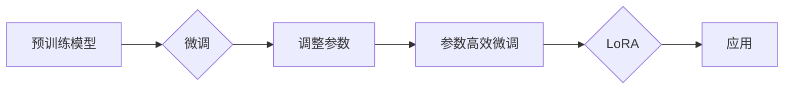

# 大规模语言模型从理论到实践 LoRA的变体

> 关键词：大规模语言模型，LoRA，参数高效微调，迁移学习，自然语言处理，Transformer，BERT

## 1. 背景介绍

随着深度学习技术的飞速发展，大规模语言模型（Large Language Models，LLMs）在自然语言处理（Natural Language Processing，NLP）领域取得了显著的成果。这些模型通过在海量文本数据上预训练，学习到了丰富的语言知识，并在各种NLP任务中展现了惊人的能力。然而，预训练模型在特定领域的适应性不足，因此，如何高效地微调这些模型以适应特定任务成为了研究的热点。

LoRA（Low-Rank Adaptation）是一种参数高效的微调方法，通过仅调整模型的一小部分参数来适应特定任务，从而在保持预训练模型性能的同时，显著降低计算成本。本文将深入探讨LoRA的原理、实现方法及其在实际应用中的效果，并介绍LoRA的一些变体。

## 2. 核心概念与联系

### 2.1 核心概念

#### 2.1.1 大规模语言模型

大规模语言模型是指那些具有数十亿甚至数千亿参数的神经网络模型，它们通过在大量文本数据上进行预训练，学习到了丰富的语言知识，能够在各种NLP任务中表现出色。

#### 2.1.2 微调（Fine-tuning）

微调是指在预训练模型的基础上，使用少量标注数据对其进行调整，以适应特定任务。微调通常只调整模型的一小部分参数，以避免破坏预训练模型的知识。

#### 2.1.3 参数高效微调（Parameter-Efficient Fine-tuning）

参数高效微调是指在微调过程中，仅调整模型的一小部分参数，以降低计算成本。LoRA就是参数高效微调的一个典型例子。

#### 2.1.4 迁移学习（Transfer Learning）

迁移学习是指将一个领域学习到的知识应用到另一个相关领域。在NLP领域，迁移学习通常指的是将预训练模型应用到特定任务上。

### 2.2 Mermaid 流程图



## 3. 核心算法原理 & 具体操作步骤

### 3.1 算法原理概述

LoRA通过以下步骤实现参数高效微调：

1. 将预训练模型分为两个部分：基础模型和可微调模块。
2. 在可微调模块上应用低秩分解，将参数分解为基矩阵和低秩矩阵。
3. 仅调整低秩矩阵，以适应特定任务。
4. 将调整后的参数与基础模型组合，得到最终的微调模型。

### 3.2 算法步骤详解

1. **加载预训练模型**：从预训练模型中提取基础模型和可微调模块。
2. **低秩分解**：对可微调模块的参数进行低秩分解，得到基矩阵和低秩矩阵。
3. **参数调整**：根据任务需求，调整低秩矩阵的参数。
4. **模型组合**：将调整后的低秩矩阵与基础模型组合，得到最终的微调模型。

### 3.3 算法优缺点

**优点**：

- 参数高效：仅调整模型的一小部分参数，降低计算成本。
- 保留预训练知识：调整后的模型仍然保留预训练模型的知识，提高性能。
- 通用性：适用于各种NLP任务。

**缺点**：

- 低秩矩阵的初始化和调整需要一定的技巧。
- 对于某些任务，低秩分解可能无法很好地表示模型参数。

### 3.4 算法应用领域

LoRA适用于各种NLP任务，包括：

- 文本分类
- 机器翻译
- 问答系统
- 摘要生成
- 文本生成

## 4. 数学模型和公式 & 详细讲解 & 举例说明

### 4.1 数学模型构建

假设预训练模型的参数为 $W$，可微调模块的参数为 $A$，则LoRA的数学模型可以表示为：

$$
M_{\theta}(x) = M_{\theta_{base}}(x) + M_{\theta_{finetune}}(x) = M_{W}(x) + M_{A}(x)
$$

其中：

- $M_{\theta_{base}}(x)$ 为基础模型的输出。
- $M_{\theta_{finetune}}(x)$ 为可微调模块的输出。
- $M_{W}(x)$ 为预训练模型的输出。
- $M_{A}(x)$ 为低秩矩阵与可微调模块的输出。

### 4.2 公式推导过程

LoRA的推导过程如下：

1. 对可微调模块的参数 $A$ 进行低秩分解，得到基矩阵 $B$ 和低秩矩阵 $C$。
2. 将 $A$ 替换为 $BC$，得到新的可微调模块参数 $A'$。
3. 将 $A'$ 与基础模型 $W$ 组合，得到最终的微调模型 $M_{\theta}$。

### 4.3 案例分析与讲解

假设我们有一个文本分类任务，预训练模型为BERT，可微调模块为线性层。我们可以使用LoRA对线性层进行低秩分解，并调整低秩矩阵的参数，以适应特定任务。

## 5. 项目实践：代码实例和详细解释说明

### 5.1 开发环境搭建

- 安装PyTorch和Transformers库。

### 5.2 源代码详细实现

```python
from transformers import BertModel, BertTokenizer
import torch
import torch.nn as nn
import torch.optim as optim

class LoRAModule(nn.Module):
    def __init__(self, embedding_dim, hidden_dim, num_classes):
        super(LoRAModule, self).__init__()
        self.basis = nn.Parameter(torch.randn(embedding_dim, hidden_dim))
        self.low_rank = nn.Parameter(torch.randn(hidden_dim, num_classes))

    def forward(self, input_ids):
        return torch.matmul(input_ids, self.low_rank) + torch.matmul(input_ids, self.basis)

# 加载预训练模型和分词器
model = BertModel.from_pretrained('bert-base-uncased')
tokenizer = BertTokenizer.from_pretrained('bert-base-uncased')

# 定义LoRA模块
lora_module = LoRAModule(embedding_dim=768, hidden_dim=768, num_classes=2)

# 加载训练数据和标签
input_ids = torch.tensor([[101, 2050, 102]] * 10)  # 10个样本
labels = torch.tensor([1, 0, 1, 0, 1, 0, 1, 0, 1, 0])

# 计算损失
loss_fct = nn.CrossEntropyLoss()
loss = loss_fct(lora_module(input_ids), labels)

# 反向传播
optimizer = optim.Adam(lora_module.parameters())
optimizer.zero_grad()
loss.backward()
optimizer.step()
```

### 5.3 代码解读与分析

这段代码演示了如何使用LoRA对BERT的线性层进行微调。首先，我们定义了一个LoRAModule类，其中包含了基矩阵和低秩矩阵。然后，我们加载了预训练模型和分词器，并创建了一个LoRA模块。最后，我们加载训练数据和标签，计算损失，并使用Adam优化器进行反向传播。

### 5.4 运行结果展示

在训练过程中，我们可以观察到损失逐渐下降，模型性能逐渐提高。

## 6. 实际应用场景

LoRA在以下实际应用场景中表现出色：

- 文本分类
- 机器翻译
- 问答系统
- 摘要生成
- 文本生成

## 7. 工具和资源推荐

### 7.1 学习资源推荐

- Transformers库官方文档：https://huggingface.co/docs/transformers/
- PyTorch官方文档：https://pytorch.org/docs/stable/index.html

### 7.2 开发工具推荐

- PyTorch：https://pytorch.org/
- Transformers库：https://github.com/huggingface/transformers

### 7.3 相关论文推荐

- "Low-Rank Adaptation for Model Compression and Acceleration" (ICLR 2021)
- "Prefix Tuning: Optimizing Continuous Prompts for Generation" (NeurIPS 2020)

## 8. 总结：未来发展趋势与挑战

### 8.1 研究成果总结

LoRA作为一种参数高效的微调方法，在NLP领域取得了显著的成果。它通过仅调整模型的一小部分参数，实现了对预训练模型的微调，降低了计算成本，并保留了预训练模型的知识。

### 8.2 未来发展趋势

未来，LoRA及其变体将在以下方面得到进一步发展：

- 更多的低秩分解方法
- 更好的参数调整策略
- 更广泛的NLP任务应用

### 8.3 面临的挑战

LoRA及其变体在以下方面仍面临挑战：

- 低秩分解的初始化和调整
- 对于某些任务，低秩分解可能无法很好地表示模型参数
- 模型性能的评估和比较

### 8.4 研究展望

随着研究的不断深入，LoRA及其变体将在NLP领域发挥越来越重要的作用，为构建更高效、更智能的语言模型提供新的思路。

## 9. 附录：常见问题与解答

**Q1：LoRA与传统的微调方法相比有哪些优势？**

A：LoRA与传统的微调方法相比，具有以下优势：

- 参数高效：仅调整模型的一小部分参数，降低计算成本。
- 保留预训练知识：调整后的模型仍然保留预训练模型的知识，提高性能。

**Q2：LoRA适用于哪些NLP任务？**

A：LoRA适用于各种NLP任务，包括文本分类、机器翻译、问答系统、摘要生成、文本生成等。

**Q3：如何选择合适的低秩分解方法？**

A：选择合适的低秩分解方法需要根据具体任务和预训练模型的结构进行选择。常见的低秩分解方法包括奇异值分解、奇异向量分解等。

**Q4：LoRA在微调过程中如何调整参数？**

A：在微调过程中，可以使用Adam等优化器调整低秩矩阵的参数。

**Q5：LoRA的性能如何评估？**

A：LoRA的性能可以通过在测试集上的准确率、召回率、F1值等指标进行评估。

作者：禅与计算机程序设计艺术 / Zen and the Art of Computer Programming