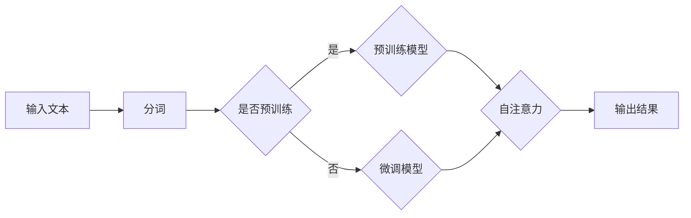

# 大语言模型原理与工程实践：什么是大语言模型

> 关键词：大语言模型，自然语言处理，预训练，微调，Transformer，BERT，深度学习，迁移学习

## 1. 背景介绍

随着深度学习技术的飞速发展，自然语言处理（NLP）领域取得了革命性的突破。其中，大语言模型（Large Language Models，LLMs）的出现，彻底改变了我们对语言理解和生成的认知。本文将深入探讨大语言模型的原理、工程实践，以及它们在NLP领域的应用。

### 1.1 问题的由来

传统的NLP模型，如基于规则的方法和基于统计的方法，在处理复杂、长篇的文本时往往表现不佳。随着深度学习技术的发展，神经网络模型逐渐成为NLP领域的首选。然而，早期的神经网络模型在处理长距离依赖和上下文信息时，仍然存在一定的局限性。

为了解决这一问题，研究者们提出了预训练（Pre-training）和微调（Fine-tuning）的概念，并在此基础上发展出了大语言模型。大语言模型通过在海量文本语料上进行预训练，学习到丰富的语言知识和表示，从而在下游任务中展现出惊人的性能。

### 1.2 研究现状

目前，大语言模型已成为NLP领域的热点研究课题。一些著名的大语言模型，如BERT、GPT-3、T5等，已经在各种NLP任务中取得了SOTA（State-of-the-Art）的表现。

### 1.3 研究意义

大语言模型的研究对于推动NLP技术的发展具有重要意义：

1. **推动NLP技术进步**：大语言模型的出现，为NLP领域带来了新的研究思路和方法，推动了NLP技术的快速发展。
2. **拓展应用场景**：大语言模型在各个领域的应用前景广阔，有望为人类生活带来更多便利。
3. **促进产学研结合**：大语言模型的研究需要大量的数据和算力资源，这将为学术界、工业界和政府机构之间的合作提供新的契机。

## 2. 核心概念与联系

为了更好地理解大语言模型，我们需要了解以下几个核心概念：

### 2.1 预训练

预训练是指在大量无标签文本语料上，通过自监督学习任务对模型进行训练，使其学习到通用的语言知识和表示。常见的预训练任务包括：

- **掩码语言模型（Masked Language Model，MLM）**：随机掩盖输入文本中的某些单词，让模型预测这些被掩盖的单词。
- **下一句预测（Next Sentence Prediction，NSP）**：预测输入文本后的下一句内容。

### 2.2 微调

微调是指在预训练模型的基础上，使用下游任务的少量有标签数据进行进一步训练，使其在特定任务上达到更好的效果。微调通常只更新模型的部分参数，以避免过拟合。

### 2.3 Transformer

Transformer是构建大语言模型的核心架构，它通过自注意力机制（Self-Attention Mechanism）实现了对长距离依赖和上下文信息的有效捕捉。

### 2.4 Mermaid 流程图

以下是大语言模型的基本流程图：



## 3. 核心算法原理 & 具体操作步骤

### 3.1 算法原理概述

大语言模型的基本原理如下：

1. **预训练**：在大量无标签文本语料上，通过自监督学习任务对模型进行训练，使其学习到通用的语言知识和表示。
2. **微调**：在预训练模型的基础上，使用下游任务的少量有标签数据进行进一步训练，使其在特定任务上达到更好的效果。

### 3.2 算法步骤详解

1. **数据预处理**：将原始文本数据转换为模型所需的格式，如分词、添加特殊标记等。
2. **模型构建**：根据任务需求，选择合适的预训练模型或从头开始构建模型。
3. **预训练**：在大量无标签文本语料上，通过自监督学习任务对模型进行训练。
4. **微调**：在预训练模型的基础上，使用下游任务的少量有标签数据进行进一步训练。
5. **评估**：在测试集上评估模型的性能，并进行调优。

### 3.3 算法优缺点

**优点**：

- **强大的语言理解能力**：大语言模型能够学习到丰富的语言知识和表示，从而在NLP任务中表现出色。
- **通用性强**：大语言模型可以应用于各种NLP任务，无需针对特定任务进行大量定制。

**缺点**：

- **计算量巨大**：大语言模型需要大量的计算资源，包括GPU、TPU等。
- **模型可解释性差**：大语言模型的决策过程难以解释，存在一定的安全隐患。

### 3.4 算法应用领域

大语言模型在以下NLP任务中取得了显著成果：

- **文本分类**：如情感分析、主题分类、垃圾邮件检测等。
- **序列标注**：如命名实体识别、关系抽取等。
- **机器翻译**：如英译中、中译英等。
- **文本摘要**：如文章摘要、对话摘要等。
- **问答系统**：如机器阅读理解、对话式问答等。

## 4. 数学模型和公式 & 详细讲解 & 举例说明

### 4.1 数学模型构建

大语言模型的数学模型主要基于神经网络，其基本结构包括：

- **输入层**：接收文本分词后的序列。
- **嵌入层**：将分词转换为固定维度的嵌入向量。
- **自注意力层**：计算序列中每个单词与其他单词之间的注意力权重。
- **前馈神经网络层**：对自注意力层输出的结果进行进一步处理。
- **输出层**：输出最终的结果，如分类标签、概率分布等。

### 4.2 公式推导过程

以下以BERT模型为例，介绍其数学模型的推导过程：

- **嵌入层**：

$$
\text{embeddings} = W_E \times \text{tokens}
$$

其中，$W_E$ 为嵌入权重矩阵，$\text{tokens}$ 为分词后的文本序列。

- **自注意力层**：

$$
\text{self-attention} = \frac{e^{\text{QW}_Q\text{keysW}_K\text{valuesW}_V}}{\sqrt{d_k}} \times \text{softmax}(\text{QW}_Q\text{keysW}_K)\text{valuesW}_V
$$

其中，$Q$、$K$、$V$ 分别为查询、键、值向量，$W_Q$、$W_K$、$W_V$ 为注意力权重矩阵，$d_k$ 为注意力层的维度。

- **前馈神经网络层**：

$$
\text{ffn} = \text{ReLU}(W_{ffn}^1\text{ffn}^0 + b_{ffn}^1)
$$

其中，$W_{ffn}^1$、$\text{ffn}^0$、$b_{ffn}^1$ 分别为前馈神经网络的权重、激活函数和偏置。

### 4.3 案例分析与讲解

以下以BERT模型在情感分析任务中的应用为例，进行案例分析：

1. **数据预处理**：将情感分析数据集进行分词，并转换为BERT模型所需的格式。
2. **模型构建**：选择合适的BERT模型，如`bert-base-uncased`。
3. **微调**：在情感分析数据集上对BERT模型进行微调，更新模型的权重。
4. **评估**：在测试集上评估模型的性能，调整超参数。

通过微调，BERT模型在情感分析任务上取得了SOTA的性能。

## 5. 项目实践：代码实例和详细解释说明

### 5.1 开发环境搭建

1. 安装Python和pip。
2. 安装PyTorch和transformers库。

### 5.2 源代码详细实现

以下是一个基于PyTorch和transformers库进行BERT情感分析的代码示例：

```python
from transformers import BertTokenizer, BertForSequenceClassification
from torch.utils.data import DataLoader, Dataset
from sklearn.model_selection import train_test_split
from sklearn.metrics import accuracy_score

# 加载预训练模型和分词器
tokenizer = BertTokenizer.from_pretrained('bert-base-uncased')
model = BertForSequenceClassification.from_pretrained('bert-base-uncased')

# 数据预处理
class SentimentDataset(Dataset):
    def __init__(self, texts, labels):
        self.texts = texts
        self.labels = labels

    def __len__(self):
        return len(self.texts)

    def __getitem__(self, idx):
        return self.texts[idx], self.labels[idx]

texts = ["This is a good product", "I don't like this product"]
labels = [1, 0]

dataset = SentimentDataset(texts, labels)
train_dataset, test_dataset = train_test_split(dataset, test_size=0.2)

# 数据加载
train_loader = DataLoader(train_dataset, batch_size=2, shuffle=True)
test_loader = DataLoader(test_dataset, batch_size=2, shuffle=False)

# 训练
model.train()
for epoch in range(3):
    for texts, labels in train_loader:
        inputs = tokenizer(texts, padding=True, truncation=True, return_tensors='pt')
        outputs = model(**inputs, labels=labels)
        loss = outputs.loss
        loss.backward()
        optimizer.step()
        optimizer.zero_grad()

# 测试
model.eval()
with torch.no_grad():
    for texts, labels in test_loader:
        inputs = tokenizer(texts, padding=True, truncation=True, return_tensors='pt')
        outputs = model(**inputs)
        preds = outputs.logits.argmax(-1).tolist()
        print(f"Labels: {labels}, Predictions: {preds}")
```

### 5.3 代码解读与分析

1. **数据预处理**：将文本数据转换为BERT模型所需的格式。
2. **模型构建**：选择合适的BERT模型。
3. **数据加载**：使用DataLoader加载训练集和测试集。
4. **训练**：使用SGD优化器对模型进行训练。
5. **测试**：在测试集上评估模型的性能。

## 6. 实际应用场景

大语言模型在以下实际应用场景中发挥着重要作用：

- **智能客服**：基于大语言模型的智能客服可以自动回答用户的问题，提高服务效率。
- **机器翻译**：大语言模型可以用于翻译各种语言，实现跨语言交流。
- **文本摘要**：大语言模型可以自动生成文章摘要，节省用户阅读时间。
- **问答系统**：大语言模型可以回答用户的问题，提供个性化服务。
- **内容审核**：大语言模型可以识别和过滤不良信息，保护网络环境。

## 7. 工具和资源推荐

### 7.1 学习资源推荐

- **书籍**：
  - 《深度学习》
  - 《自然语言处理综论》
  - 《BERT技术解析》
- **在线课程**：
  - fast.ai NLP课程
  - Udacity NLP纳米学位
- **博客**：
  - Hugging Face Blog
  - AI技术宅

### 7.2 开发工具推荐

- **深度学习框架**：
  - PyTorch
  - TensorFlow
- **自然语言处理库**：
  - Transformers
  - NLTK
- **模型训练平台**：
  - Google Colab
  - Amazon SageMaker

### 7.3 相关论文推荐

- BERT: Pre-training of Deep Bidirectional Transformers for Language Understanding
- Generative Pre-trained Transformers
- Attention Is All You Need
- A Simple Framework for Text Classification with BERT

## 8. 总结：未来发展趋势与挑战

### 8.1 研究成果总结

大语言模型在NLP领域取得了显著的成果，为NLP技术的发展带来了新的机遇和挑战。

### 8.2 未来发展趋势

- **模型规模将进一步扩大**：随着计算资源的提升，大语言模型的规模将会越来越大。
- **多模态融合将成为趋势**：大语言模型将与其他模态（如图像、音频）进行融合，实现更全面的语义理解。
- **可解释性和鲁棒性将得到提升**：研究者将致力于提高大语言模型的可解释性和鲁棒性。

### 8.3 面临的挑战

- **计算资源需求巨大**：大语言模型需要大量的计算资源，这对研究者和开发者来说是一个挑战。
- **数据安全与隐私保护**：大语言模型在处理敏感数据时，需要确保数据的安全和隐私。
- **模型可解释性**：大语言模型的决策过程难以解释，这可能会影响其在实际应用中的可信度。

### 8.4 研究展望

大语言模型的研究将继续深入，未来将会有更多创新性的成果出现。随着大语言模型的不断发展，它们将在更多领域发挥重要作用，为人类社会带来更多便利。

## 9. 附录：常见问题与解答

**Q1：什么是大语言模型？**

A：大语言模型是一种基于深度学习的自然语言处理模型，通过在海量文本语料上进行预训练，学习到丰富的语言知识和表示，从而在下游任务中展现出惊人的性能。

**Q2：大语言模型有哪些应用场景？**

A：大语言模型可以应用于文本分类、序列标注、机器翻译、文本摘要、问答系统等NLP任务。

**Q3：大语言模型的优点是什么？**

A：大语言模型具有强大的语言理解能力、通用性强、易于迁移等优点。

**Q4：大语言模型有哪些缺点？**

A：大语言模型需要大量的计算资源，模型可解释性差，存在安全隐患等。

**Q5：如何构建大语言模型？**

A：构建大语言模型需要以下步骤：
1. 数据预处理：将原始文本数据转换为模型所需的格式。
2. 模型构建：选择合适的预训练模型或从头开始构建模型。
3. 预训练：在大量无标签文本语料上，通过自监督学习任务对模型进行训练。
4. 微调：在预训练模型的基础上，使用下游任务的少量有标签数据进行进一步训练。
5. 评估：在测试集上评估模型的性能。

---

作者：禅与计算机程序设计艺术 / Zen and the Art of Computer Programming