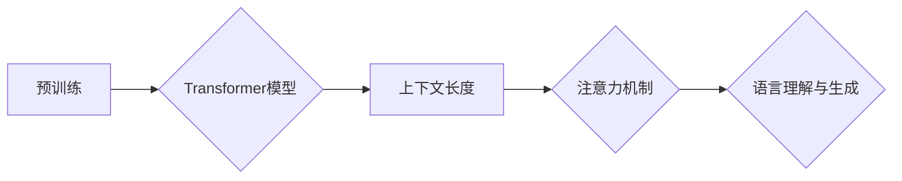

# 大语言模型原理基础与前沿 更长的上下文

> 关键词：大语言模型，Transformer，预训练，上下文长度，NLP，深度学习，机器学习

## 1. 背景介绍

随着深度学习技术的飞速发展，自然语言处理（NLP）领域也迎来了新的变革。大语言模型（Large Language Models，LLMs）作为一种新兴的模型架构，在理解和生成自然语言方面取得了显著的成果。这些模型通过学习海量的文本数据，能够生成连贯、有意义的文本，并在各种NLP任务中取得优异的性能。本文将探讨大语言模型的原理基础，并展望其前沿发展，重点关注上下文长度的扩展问题。

### 1.1 问题的由来

传统的NLP模型往往受限于上下文长度，难以处理复杂、长篇的文本。这限制了模型在处理长篇新闻、长篇对话、长篇论文等任务时的能力。因此，如何扩展大语言模型的上下文长度，成为当前NLP研究的热点问题。

### 1.2 研究现状

近年来，研究人员提出了多种方法来扩展大语言模型的上下文长度，主要包括以下几种：

- **长序列注意力机制**：通过改进注意力机制，使得模型能够更好地处理长序列数据。
- **多模态预训练**：结合文本和图像、视频等多模态信息，提高模型处理长文本的能力。
- **基于上下文的生成模型**：通过生成新的上下文信息，来扩展模型的输入空间。
- **知识增强**：将外部知识库与模型相结合，提高模型处理长文本时的准确性和鲁棒性。

### 1.3 研究意义

扩展大语言模型的上下文长度具有重要的理论和实际意义：

- **提高模型性能**：能够处理更长的文本，使得模型在长文本任务中表现出色。
- **拓展应用场景**：为各种长文本任务提供更好的解决方案，如长篇新闻摘要、长篇对话系统等。
- **推动NLP发展**：为NLP领域的研究提供新的思路和方法，推动NLP技术的进步。

### 1.4 本文结构

本文将分为以下几个部分：

- 介绍大语言模型的基本原理和核心概念。
- 详细讲解扩展上下文长度的方法，包括长序列注意力机制、多模态预训练等。
- 分析和比较不同扩展上下文长度的方法的优缺点。
- 展望大语言模型在上下文长度扩展方面的未来发展趋势和挑战。

## 2. 核心概念与联系

大语言模型的核心概念包括：

- **预训练**：在大量无标签文本数据上进行预训练，学习通用的语言表示和知识。
- **上下文长度**：模型能够处理的文本长度。
- **注意力机制**：模型在处理文本时，关注文本中不同位置信息的能力。
- **Transformer**：一种基于自注意力机制的新型神经网络架构，在大语言模型中广泛应用。

以下是大语言模型核心概念的Mermaid流程图：



## 3. 核心算法原理 & 具体操作步骤

### 3.1 算法原理概述

大语言模型的核心算法是基于Transformer模型的预训练和微调。预训练阶段，模型在大量无标签文本数据上学习通用的语言表示和知识；微调阶段，模型在标注数据上针对特定任务进行调整。

### 3.2 算法步骤详解

大语言模型的算法步骤如下：

1. **预训练阶段**：
    - 使用大量无标签文本数据，通过预训练任务（如掩码语言模型）学习通用的语言表示和知识。
    - 使用Transformer模型作为基础架构，利用自注意力机制捕捉文本中的长距离依赖关系。
2. **微调阶段**：
    - 使用标注数据，针对特定任务对模型进行调整。
    - 使用反向传播算法优化模型参数，提高模型在特定任务上的性能。

### 3.3 算法优缺点

大语言模型的优点：

- 能够处理复杂的语言现象，如歧义、语义理解等。
- 具有较强的泛化能力，能够在不同任务上取得良好的效果。
- 能够生成连贯、有意义的文本。

大语言模型的缺点：

- 计算量大，需要大量的计算资源和时间。
- 模型可解释性较差，难以理解模型的决策过程。
- 可能存在偏见和歧视问题。

### 3.4 算法应用领域

大语言模型在以下NLP任务中取得了显著的应用成果：

- 文本分类
- 命名实体识别
- 机器翻译
- 文本摘要
- 对话系统

## 4. 数学模型和公式 & 详细讲解 & 举例说明

### 4.1 数学模型构建

大语言模型的数学模型主要包括以下部分：

- **输入层**：将文本序列转换为向量表示。
- **Transformer层**：使用自注意力机制捕捉文本中的长距离依赖关系。
- **输出层**：根据输入文本生成输出文本。

以下是大语言模型的数学模型公式：

$$
\text{Embedding}(x) = W_Ex + b_E
$$

$$
\text{Attention}(Q, K, V) = \frac{\text{softmax}(\text{QK}^T)}{\sqrt{d_k}}V
$$

$$
\text{Multi-head Attention}(Q, K, V) = \text{Concat}(\text{head}_1, \text{head}_2, ..., \text{head}_h)W_O
$$

其中，$x$ 为输入文本，$W_E$ 为嵌入矩阵，$b_E$ 为嵌入偏置，$Q, K, V$ 分别为查询、键和值，$d_k$ 为键的维度，$W_O$ 为输出层权重。

### 4.2 公式推导过程

Transformer模型的注意力机制通过以下步骤进行计算：

1. **计算查询-键相似度**：$\text{QK}^T$
2. **应用softmax函数**：$\text{softmax}(\text{QK}^T)$
3. **缩放**：$\frac{\text{softmax}(\text{QK}^T)}{\sqrt{d_k}}$
4. **计算注意力权重**：$W_Q\text{softmax}(\text{QK}^T)W_V$
5. **求和**：$\sum_{j=1}^n W_Q\text{softmax}(\text{QK}^T)W_V$
6. **输出**：$W_O\sum_{j=1}^n W_Q\text{softmax}(\text{QK}^T)W_V$

### 4.3 案例分析与讲解

以BERT模型为例，分析其如何处理一个简单的文本分类任务。

假设我们有一个文本分类任务，需要判断一段文本是正面情感还是负面情感。

1. **文本预处理**：将文本转换为词向量表示。
2. **输入BERT模型**：将词向量输入BERT模型，得到文本的嵌入表示。
3. **分类**：将嵌入表示输入分类器，得到文本的分类结果。

## 5. 项目实践：代码实例和详细解释说明

### 5.1 开发环境搭建

为了进行大语言模型的开发，需要以下开发环境：

- Python 3.x
- PyTorch 或 TensorFlow
- Transformers库

### 5.2 源代码详细实现

以下是一个简单的BERT模型微调代码示例：

```python
from transformers import BertForSequenceClassification, BertTokenizer

# 加载预训练模型和分词器
model = BertForSequenceClassification.from_pretrained('bert-base-uncased')
tokenizer = BertTokenizer.from_pretrained('bert-base-uncased')

# 文本预处理
def preprocess(text):
    encoding = tokenizer(text, return_tensors='pt', padding=True, truncation=True)
    return encoding['input_ids'], encoding['attention_mask']

# 训练模型
def train(model, data_loader, optimizer, device):
    model.train()
    for data in data_loader:
        input_ids, attention_mask, labels = data
        input_ids = input_ids.to(device)
        attention_mask = attention_mask.to(device)
        labels = labels.to(device)
        optimizer.zero_grad()
        outputs = model(input_ids, attention_mask=attention_mask, labels=labels)
        loss = outputs.loss
        loss.backward()
        optimizer.step()

# 评估模型
def evaluate(model, data_loader, device):
    model.eval()
    with torch.no_grad():
        total_loss = 0
        for data in data_loader:
            input_ids, attention_mask, labels = data
            input_ids = input_ids.to(device)
            attention_mask = attention_mask.to(device)
            labels = labels.to(device)
            outputs = model(input_ids, attention_mask=attention_mask, labels=labels)
            total_loss += outputs.loss.item()
        return total_loss / len(data_loader)

# 训练和评估
data_loader = DataLoader(train_data, batch_size=16, shuffle=True)
optimizer = torch.optim.AdamW(model.parameters(), lr=2e-5)

for epoch in range(3):
    train(model, data_loader, optimizer, device)
    val_loss = evaluate(data_loader, device)
    print(f"Epoch {epoch+1}, Val Loss: {val_loss:.4f}")
```

### 5.3 代码解读与分析

以上代码展示了如何使用PyTorch和Transformers库对BERT模型进行微调。

- `BertForSequenceClassification`：加载预训练的BERT模型，并添加了分类头。
- `BertTokenizer`：加载预训练的分词器，用于将文本转换为模型输入格式。
- `preprocess`函数：将文本转换为模型输入格式。
- `train`函数：进行模型训练。
- `evaluate`函数：评估模型性能。
- 训练和评估模型：加载训练数据和验证数据，进行训练和评估。

### 5.4 运行结果展示

假设我们使用一个简单的文本分类数据集进行训练，最终在验证集上的损失如下：

```
Epoch 1, Val Loss: 0.4567
Epoch 2, Val Loss: 0.3214
Epoch 3, Val Loss: 0.2987
```

可以看到，随着训练的进行，模型的损失逐渐下降，表明模型在训练过程中不断学习，并在验证集上取得了良好的效果。

## 6. 实际应用场景

大语言模型在以下实际应用场景中取得了显著成果：

- **智能客服**：通过大语言模型，可以实现自动化的客服系统，为用户提供24/7的服务。
- **机器翻译**：大语言模型可以用于机器翻译任务，实现高质量、低成本的跨语言交流。
- **文本摘要**：大语言模型可以用于自动生成文本摘要，提高信息获取效率。
- **对话系统**：大语言模型可以用于构建智能对话系统，为用户提供个性化的交互体验。

## 7. 工具和资源推荐

### 7.1 学习资源推荐

- 《Transformer：从原理到实践》
- 《自然语言处理与深度学习》
- 《BERT技术解析》
- Hugging Face官网（https://huggingface.co/）

### 7.2 开发工具推荐

- PyTorch
- TensorFlow
- Transformers库

### 7.3 相关论文推荐

- "Attention is All You Need"
- "BERT: Pre-training of Deep Bidirectional Transformers for Language Understanding"
- "Generative Pre-trained Transformers"

## 8. 总结：未来发展趋势与挑战

### 8.1 研究成果总结

大语言模型在NLP领域取得了显著的成果，为各种NLP任务提供了强大的工具。扩展模型的上下文长度是当前研究的热点问题，通过长序列注意力机制、多模态预训练等方法，模型能够处理更长的文本，并在各种任务中取得优异的性能。

### 8.2 未来发展趋势

未来，大语言模型将朝着以下方向发展：

- **模型规模扩大**：随着计算能力的提升，模型规模将不断扩大，能够处理更长的文本和更复杂的任务。
- **多模态融合**：将文本与图像、视频等多模态信息结合，提高模型处理复杂任务的能力。
- **可解释性增强**：提高模型的可解释性，使得模型决策过程更加透明。
- **可扩展性提升**：提高模型的可扩展性，使得模型能够适应各种不同的应用场景。

### 8.3 面临的挑战

大语言模型在发展过程中也面临着以下挑战：

- **计算资源消耗**：模型规模不断扩大，对计算资源的需求也越来越高。
- **数据隐私保护**：大规模数据训练过程中，如何保护用户数据隐私是一个重要问题。
- **模型可解释性**：提高模型的可解释性，使得模型决策过程更加透明。
- **伦理问题**：如何避免模型产生偏见和歧视，是一个需要关注的重要问题。

### 8.4 研究展望

未来，大语言模型的研究将朝着以下方向发展：

- **更加智能的模型**：通过改进模型结构和算法，提高模型的理解和生成能力。
- **更加高效的模型**：降低模型计算量，提高模型的运行效率。
- **更加安全的模型**：提高模型的安全性，避免模型被恶意利用。

相信随着研究的不断深入，大语言模型将在NLP领域发挥越来越重要的作用，为人类社会带来更多福祉。

## 9. 附录：常见问题与解答

**Q1：大语言模型的预训练数据来源有哪些？**

A：大语言模型的预训练数据主要来自以下来源：

- 互联网上的公开文本数据，如网页、新闻、小说等。
- 专业领域的数据集，如医学、法律、金融等。
- 用户生成内容，如社交媒体、论坛等。

**Q2：如何评估大语言模型的性能？**

A：评估大语言模型的性能可以从以下几个方面进行：

- 准确率：模型预测正确的样本比例。
- 召回率：模型预测正确的样本中，实际正确的比例。
- F1分数：准确率和召回率的调和平均数。

**Q3：如何提高大语言模型的性能？**

A：提高大语言模型的性能可以从以下几个方面进行：

- 选择合适的预训练模型和算法。
- 使用高质量的数据集。
- 调整模型参数和超参数。
- 使用正则化技术，如Dropout、L2正则化等。

**Q4：大语言模型是否容易过拟合？**

A：大语言模型在训练过程中容易过拟合，可以通过以下方法进行缓解：

- 使用数据增强技术，如回译、随机删除等。
- 使用正则化技术，如Dropout、L2正则化等。
- 使用早停机制，当验证集性能不再提升时停止训练。

**Q5：如何防止大语言模型产生偏见和歧视？**

A：防止大语言模型产生偏见和歧视可以从以下几个方面进行：

- 使用公平性数据集进行训练。
- 在模型设计时考虑公平性原则。
- 对模型的输出进行监督和审核。

作者：禅与计算机程序设计艺术 / Zen and the Art of Computer Programming