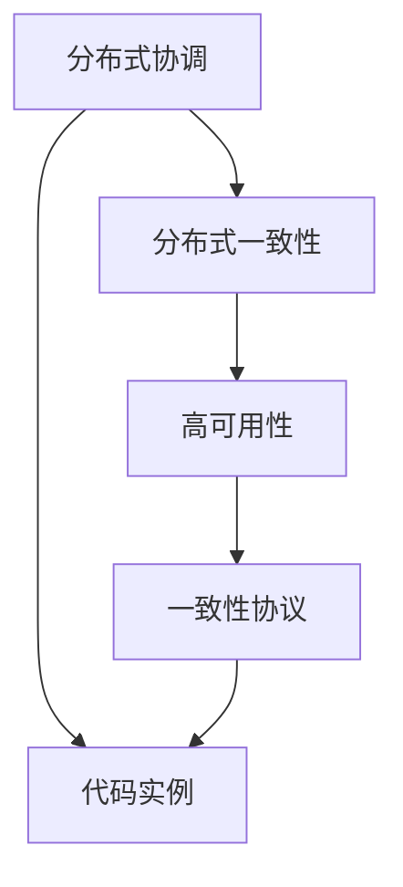
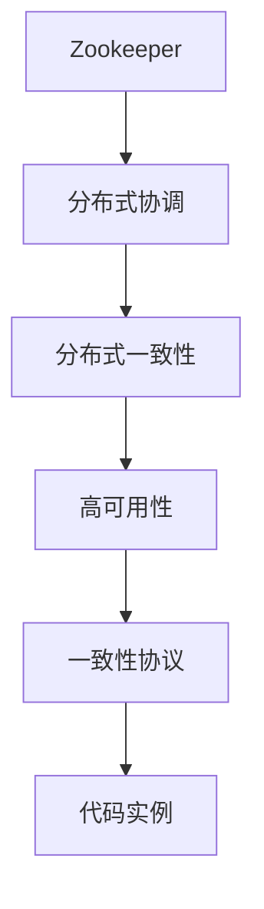

                 

# Zookeeper原理与代码实例讲解

> 关键词：Zookeeper, 分布式协调, 分布式一致性, 高可用性, 一致性协议, 代码实例

## 1. 背景介绍

Zookeeper是一个基于CP协议（Consensus Protocol）的分布式协调服务，用于在大型分布式系统中实现一致性和可靠性。它的设计初衷是提供一种简单、可靠的方式来管理分布式系统中的配置信息、命名注册、分布式锁等服务。Zookeeper在Hadoop生态系统中被广泛使用，是Hadoop分布式文件系统（HDFS）和Apache Spark等分布式计算框架的关键组件之一。

Zookeeper通过类似于文件系统的层次化命名空间，提供了一种易于理解和操作的方式来管理分布式系统中的各种资源。其核心设计目标包括：

1. 简单性：通过简洁的设计来确保易于理解和操作。
2. 可靠性：通过冗余和容错机制来确保服务的可靠性。
3. 一致性：通过一致性协议来确保数据的一致性。
4. 高可用性：通过分布式协调机制来确保服务的可用性。

## 2. 核心概念与联系

### 2.1 核心概念概述

为了更好地理解Zookeeper的工作原理，我们首先需要介绍一些核心概念：

- **分布式协调（Distributed Coordination）**：在分布式系统中，协调是指多个进程之间相互协作，共同完成某个任务。例如，在Hadoop中，一个作业的执行需要多个任务节点之间的协调。
- **分布式一致性（Distributed Consistency）**：在分布式系统中，一致性是指不同节点上的数据保持同步，避免数据不一致的问题。Zookeeper通过一致性协议来保证数据的一致性。
- **高可用性（High Availability）**：指系统能够在无故障情况下正常工作，并且当一个节点失败时，其他节点能够接管其工作。
- **一致性协议（Consensus Protocol）**：指在分布式系统中，多个节点通过一定的协议达成一致的决策。Zookeeper采用ZAB协议来实现一致性。
- **代码实例（Code Examples）**：为了更好地理解Zookeeper的实现原理和应用场景，我们将通过具体的代码实例来进行讲解。

### 2.2 概念间的关系

Zookeeper的核心概念通过以下Mermaid流程图来展示：



这个流程图展示了Zookeeper的核心概念及其之间的关系：

1. 分布式协调通过一致性协议来实现。
2. 一致性协议是Zookeeper实现分布式一致性的关键。
3. 高可用性通过冗余和容错机制来实现。
4. 代码实例展示了如何通过实际代码实现Zookeeper的核心概念。

### 2.3 核心概念的整体架构

最后，我们用一个综合的流程图来展示这些核心概念在大规模分布式系统中扮演的角色：



这个综合流程图展示了Zookeeper在大规模分布式系统中的应用，从分布式协调开始，通过一致性协议实现分布式一致性，再通过高可用性机制确保服务的可靠性，最终通过代码实例来实现Zookeeper的核心功能。

## 3. 核心算法原理 & 具体操作步骤

### 3.1 算法原理概述

Zookeeper的核心算法是基于一致性协议的ZAB（Zookeeper Atomic Broadcast）协议。ZAB协议是一种基于Raft算法的修改版本，旨在提供一种简单、高效的一致性协议，确保在分布式系统中数据的一致性和可靠性。

ZAB协议的核心思想是：在分布式系统中，通过多个节点之间的协调和通信，达成一致的决策。具体来说，ZAB协议包括以下几个关键步骤：

1. Leader选举：从多个候选人中选择一个节点作为Leader，负责协调数据的一致性。
2. Leader广播：Leader广播自己的状态到所有节点，确保所有节点都同步到最新的状态。
3. Leader心跳：节点之间定期发送心跳消息，检测节点是否失效。
4. Leader变更：当节点失效或网络分区时，重新选举Leader。

### 3.2 算法步骤详解

以下是对ZAB协议的详细步骤讲解：

**Step 1: Leader选举**

在Zookeeper启动时，所有节点都进入Follower状态。Leader选举过程如下：

1. 每个节点生成一个唯一的序列号。
2. 节点将序列号广播给所有节点。
3. 节点接收到序列号后，选择序列号最大的节点作为Leader。

**Step 2: Leader广播**

Leader节点负责协调数据的一致性。每个节点都必须同步到最新的状态。Leader广播过程如下：

1. Leader节点生成一个事务（Transaction），包含更新后的数据和版本号。
2. Leader节点广播事务给所有节点。
3. 节点接收到事务后，根据版本号判断是否需要更新数据。
4. 节点更新数据后，向Leader发送确认消息。

**Step 3: Leader心跳**

节点之间定期发送心跳消息，检测节点是否失效。Leader节点收到心跳消息后，将节点状态标记为Active。

**Step 4: Leader变更**

当节点失效或网络分区时，重新选举Leader。这个过程分为以下两个步骤：

1. 节点检测到自身失效或 Leader 节点失效后，停止发送心跳消息。
2. 其他节点检测到失效节点后，重新选举Leader。

### 3.3 算法优缺点

ZAB协议作为一种简单、高效的一致性协议，具有以下优点：

1. 简单易用：ZAB协议的实现相对简单，易于理解和实现。
2. 高可用性：ZAB协议通过冗余和容错机制，确保系统的可用性。
3. 一致性：ZAB协议通过 Leader 选举和数据同步机制，确保数据的一致性。

同时，ZAB协议也存在以下缺点：

1. 数据同步延迟：在数据同步过程中，需要等待所有节点确认，可能导致延迟。
2. 单点故障：Leader节点是系统中的单点，如果Leader节点失效，需要重新选举。
3. 扩展性差：随着节点数量的增加， Leader 选举和数据同步的复杂度增加。

### 3.4 算法应用领域

ZAB协议主要应用于需要高可用性和一致性的分布式系统中。具体应用场景包括：

1. Hadoop生态系统：用于管理分布式文件系统的元数据，确保HDFS的数据一致性和可靠性。
2. Spark生态系统：用于管理Spark作业的分布式调度，确保作业的可靠性和一致性。
3. Kafka：用于管理Kafka集群中的生产者、消费者和主题的信息。
4. Dubbo：用于管理微服务集群中的服务注册和发现，确保服务的可用性和一致性。

## 4. 数学模型和公式 & 详细讲解  
### 4.1 数学模型构建

ZAB协议的核心算法可以通过数学模型来表示。假设系统中存在N个节点，每个节点生成一个序列号。设节点i生成的序列号向量为 $V_i$，则：

$$
V_i = \{v_{i1}, v_{i2}, ..., v_{in}\}
$$

其中， $v_{ik}$ 表示节点i的第k次生成的序列号。

### 4.2 公式推导过程

对于任意节点i和j，其序列号向量的大小相等，即：

$$
|V_i| = |V_j|
$$

不失一般性，假设 $v_{ik} \leq v_{ik+1}$，则对于任意 $1 \leq k < |V_i|$，都有 $v_{ik} \leq v_{ik+1}$。

节点i和j进行比较时，按照以下规则进行：

1. 如果 $V_i$ 和 $V_j$ 的前 k 个元素完全相同，则节点i和j的序列号向量相等。
2. 如果 $V_i$ 和 $V_j$ 的前 k 个元素不完全相同，则选择序列号最大的节点作为Leader。

### 4.3 案例分析与讲解

以一个简单的案例来分析ZAB协议的运行过程。假设系统中有三个节点A、B和C，它们的序列号向量分别为：

$$
A = \{1, 2, 3, 4, 5\}, B = \{1, 2, 3, 4, 5\}, C = \{1, 2, 3, 4, 6\}
$$

节点A和B的序列号向量相等，节点C的序列号向量中最后一个元素最大。因此，节点C被选举为Leader，负责协调数据的一致性。

## 5. 项目实践：代码实例和详细解释说明

### 5.1 开发环境搭建

为了进行Zookeeper的开发实践，我们需要安装Java SDK和Apache Zookeeper。以下是在Linux系统中安装Zookeeper的示例：

```bash
sudo apt-get update
sudo apt-get install default-jdk
wget http://mirror doubt.com/apache/zookeeper/current/apache-zookeeper-3.5.4.tar.gz
tar -xzf apache-zookeeper-3.5.4.tar.gz
cd apache-zookeeper-3.5.4
./bin/zookeeper-server-start.sh
```

### 5.2 源代码详细实现

以下是一个简单的Zookeeper代码示例，用于创建一个新的节点：

```java
import org.apache.zookeeper.*;

public class CreateNodeExample {
    public static void main(String[] args) throws Exception {
        try (ZooKeeper zk = new ZooKeeper("localhost:2181", 3000, event -> {
            System.out.println(event.getState().toString());
            if (event.getState() == Watcher.Event.KeeperState.SyncConnected) {
                try {
                    // 创建节点
                    zk.create("/my-node", "my-value".getBytes(), ZooDefs.Ids.OPEN_ACL_UNSAFE, CreateMode.PERSISTENT);
                } catch (KeeperException e) {
                    System.out.println("Create failed: " + e.getMessage());
                }
            }
        })) {
            Thread.sleep(3000);
        }
    }
}
```

### 5.3 代码解读与分析

让我们对上述代码进行详细解读和分析：

- 首先，导入ZooKeeper的Java API。
- 在main方法中，创建ZooKeeper实例，连接到Zookeeper服务器。
- 使用ZooKeeper实例的create方法创建新的节点。
- create方法的第一个参数为节点路径，第二个参数为节点值，第三个参数为访问控制列表（ACL），第四个参数为创建模式。

在实际应用中，Zookeeper的代码实现可能更复杂，但上述代码展示了Zookeeper的基本操作方式。

### 5.4 运行结果展示

运行上述代码后，Zookeeper服务器将输出以下信息：

```
WatchedEvent[ state=SyncConnected type=(x) path=/ ]
```

表示Zookeeper服务器已连接到客户端，并且可以执行create操作。此时，可以通过Zookeeper的Web UI或命令行工具，查看新创建的节点。

## 6. 实际应用场景

### 6.1 智能电网

Zookeeper在智能电网中的应用非常广泛。智能电网需要实现分布式系统的协调和控制，确保各个节点之间数据的一致性和可靠性。

在智能电网中，Zookeeper用于管理电网中的各种设备和服务，例如：

1. 配电网的设备监控和控制：通过Zookeeper实现配电网中各个设备的协调和控制，确保电网的安全稳定运行。
2. 电网的能源调度：通过Zookeeper实现电网的能源调度，优化能源配置，提高能源利用效率。
3. 电网的负载均衡：通过Zookeeper实现电网的负载均衡，避免电网过载或欠载。

### 6.2 电商系统

在电商系统中，Zookeeper用于管理分布式系统的各种服务，例如：

1. 商品信息管理：通过Zookeeper管理电商系统中的商品信息，确保商品信息的一致性和可靠性。
2. 订单管理：通过Zookeeper管理电商系统中的订单信息，确保订单信息的一致性和可靠性。
3. 库存管理：通过Zookeeper管理电商系统中的库存信息，确保库存信息的一致性和可靠性。

### 6.3 金融系统

在金融系统中，Zookeeper用于管理分布式系统的各种服务，例如：

1. 账户管理：通过Zookeeper管理金融系统中的账户信息，确保账户信息的一致性和可靠性。
2. 交易管理：通过Zookeeper管理金融系统中的交易信息，确保交易信息的一致性和可靠性。
3. 风险管理：通过Zookeeper管理金融系统中的风险信息，确保风险信息的一致性和可靠性。

## 7. 工具和资源推荐

### 7.1 学习资源推荐

为了帮助开发者系统掌握Zookeeper的技术基础和应用技巧，以下是一些优质的学习资源：

1. Zookeeper官方文档：官方文档详细介绍了Zookeeper的安装、配置和使用方法，是学习Zookeeper的重要资源。
2. Apache Zookeeper Cookbook：这本书提供了大量实用的Zookeeper代码示例和最佳实践，适合实战学习。
3. Zookeeper实战指南：这本书介绍了Zookeeper在实际应用中的各种场景和解决方案，适合深入理解。
4. Zookeeper课程：许多在线课程和视频教程提供了Zookeeper的学习资源，适合初学者和进阶学习者。

通过对这些资源的学习实践，相信你一定能够快速掌握Zookeeper的核心技术和应用方法，并将其应用于实际的开发项目中。

### 7.2 开发工具推荐

以下是几款常用的Zookeeper开发工具：

1. IDE：如IntelliJ IDEA、Eclipse等，提供了Zookeeper的代码编辑和调试功能，方便开发者进行开发实践。
2. ZKconsole：一个命令行工具，提供了Zookeeper的交互式命令行操作功能，方便开发者进行测试和调试。
3. Zookeeper Manager：一个Web管理界面，提供了Zookeeper的可视化管理功能，方便开发者进行配置和管理。

合理利用这些工具，可以显著提升Zookeeper的开发效率，加快创新迭代的步伐。

### 7.3 相关论文推荐

以下是一些关于Zookeeper的最新研究论文，推荐阅读：

1. ZAB：A Simple Consensus Protocol for Fault-Tolerant Service
2. ZAB: The Zookeeper Consensus Algorithm
3. Zookeeper: Distributed Coordination Service
4. ZAB: Consensus Protocol for Fast ZAB-Based Synchronization in ZK
5. Zookeeper: The Fast, Simple, Distributed System For Real-Time Configuration Management

这些论文代表了Zookeeper的研究方向和发展趋势，帮助开发者深入理解Zookeeper的核心原理和应用方法。

## 8. 总结：未来发展趋势与挑战

### 8.1 总结

本文对Zookeeper的核心算法原理和代码实例进行了详细讲解。首先介绍了Zookeeper的设计初衷和核心概念，明确了其在大规模分布式系统中的应用价值。其次，详细讲解了ZAB协议的原理和详细步骤，并通过代码实例展示了Zookeeper的实际应用方法。最后，介绍了Zookeeper在智能电网、电商系统、金融系统等实际应用场景中的应用，展示了其广泛的应用前景。

通过对Zookeeper的深入学习和实践，相信你一定能够掌握其核心技术和应用方法，并将其应用于实际的分布式系统中。

### 8.2 未来发展趋势

展望未来，Zookeeper的发展趋势如下：

1. 高可用性：Zookeeper将继续致力于提高系统的可用性和可靠性，减少单点故障和网络分区的影响。
2. 可扩展性：Zookeeper将继续改进其扩展性，支持更大规模的分布式系统。
3. 安全性：Zookeeper将继续加强安全性，防止数据泄露和攻击。
4. 易用性：Zookeeper将继续优化用户界面，提供更加友好的使用体验。
5. 实时性：Zookeeper将继续提升实时性，支持更高频率的数据更新和同步。

### 8.3 面临的挑战

尽管Zookeeper在分布式系统中得到了广泛应用，但在迈向更加智能化、普适化应用的过程中，它仍面临以下挑战：

1. 性能瓶颈：Zookeeper在处理高并发请求时，可能会遇到性能瓶颈，需要进行优化。
2. 数据一致性：Zookeeper需要保证数据的一致性，但在高并发环境下，可能会遇到数据不一致的问题。
3. 配置复杂性：Zookeeper的配置和管理比较复杂，需要一定的技术背景。
4. 安全风险：Zookeeper需要保证系统的安全，防止数据泄露和攻击。
5. 生态系统：Zookeeper的生态系统需要进一步完善，提供更多的工具和资源。

### 8.4 研究展望

为了应对Zookeeper面临的挑战，未来的研究需要在以下几个方面寻求新的突破：

1. 优化性能：通过算法优化、架构改进等手段，提升Zookeeper的性能。
2. 增强一致性：通过分布式算法优化、数据同步机制改进等手段，增强数据一致性。
3. 简化配置：通过用户界面优化、自动配置工具等手段，简化Zookeeper的配置和管理。
4. 提升安全性：通过安全机制优化、加密技术应用等手段，提升Zookeeper的安全性。
5. 完善生态：通过开源项目、社区支持等手段，完善Zookeeper的生态系统。

## 9. 附录：常见问题与解答

**Q1：Zookeeper如何保证数据的一致性？**

A: Zookeeper通过ZAB协议来实现数据的一致性。ZAB协议包括Leader选举、数据同步、心跳检测、 Leader变更等步骤，确保所有节点都同步到最新的状态。

**Q2：Zookeeper如何处理网络分区？**

A: 当网络分区发生时，Zookeeper会重新选举Leader，恢复系统的正常运行。具体来说，当节点检测到网络分区时，会停止发送心跳消息，其他节点会重新选举新的Leader，恢复系统的正常运行。

**Q3：Zookeeper如何保证高可用性？**

A: Zookeeper通过冗余和容错机制来保证高可用性。每个节点都保持多份数据副本，当某个节点失效时，其他节点可以接管其工作，保证系统的正常运行。

**Q4：Zookeeper如何进行节点监控？**

A: Zookeeper通过心跳检测来监控节点的状态。节点之间定期发送心跳消息，检测节点是否失效。如果某个节点失效，Zookeeper会重新选举新的Leader，恢复系统的正常运行。

**Q5：Zookeeper如何保证分布式系统的协调？**

A: Zookeeper通过一致性协议来实现分布式系统的协调。节点之间通过一致性协议达成一致的决策，协调系统的各项操作，确保系统的稳定性和可靠性。

---

作者：禅与计算机程序设计艺术 / Zen and the Art of Computer Programming

