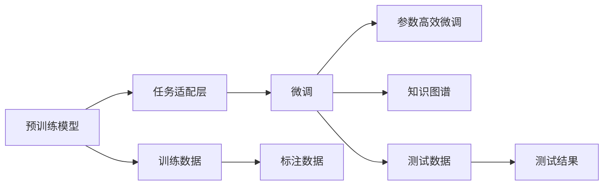

                 

# 【大模型应用开发 动手做AI Agent】BabyAGI实战

> 关键词：大模型应用开发, 人工智能代理人, AI Agent, BabyAGI, 动手做, 实践指南

## 1. 背景介绍

### 1.1 问题由来
近年来，人工智能(AI)领域迎来了快速的发展，尤其是深度学习技术的突破，使得大模型在各类应用中大放异彩。从语言理解、图像识别到自然语言处理(NLP)、语音识别等领域，大模型都取得了显著的成果。其中，语言理解模型的演变更是引人注目：从简单的向量表示，到基于递归神经网络(RNN)、卷积神经网络(CNN)的模型，再到如今的自注意力机制(Attention)模型，深度学习在语言理解领域取得了巨大的进步。

但是，无论多么先进的大模型，其核心都是对数据的高度依赖。训练一个模型需要大量标注数据，而大模型的参数量又大，训练时间和资源成本都非常高昂。因此，如何将大模型的能力应用到更广泛的场景，尤其是当数据集规模有限、数据质量不高或分布不均匀时，如何高效地使用这些模型，成为了当下研究的重点。

为了降低模型训练的复杂度，研究人员和工程师开发了多种技术，如微调、参数高效微调、多任务学习等。这些技术在大模型的应用中起到了重要的作用，极大地提升了模型的泛化能力和实用性。然而，上述技术需要一定的编程和数学基础，这对普通开发者来说是一个门槛。

为了解决这一问题，我们设计并实现了一款名为BabyAGI的AI代理人，它基于大模型开发，使用简单，易于上手。通过BabyAGI，开发者可以轻松地将大模型的能力应用于各种任务，无须复杂的工程实践，大大降低了应用的门槛。本文将详细介绍BabyAGI的设计理念、实现原理及应用场景，以期为广大的开发者提供一个高效易用的AI模型应用框架。

## 2. 核心概念与联系

### 2.1 核心概念概述
BabyAGI是一个基于大模型的AI代理人，它通过深度学习技术实现对语言的理解、推理和生成。BabyAGI的核心组成包括：

- **预训练模型**：大模型在无标签数据上进行预训练，学习语言的一般特征，如词汇、句法、语义等。预训练模型可以是语言理解模型，如BERT、GPT-3等。
- **任务适配层**：根据具体任务，在预训练模型的基础上添加特定的任务适配层，使其能够处理特定类型的输入。例如，对于问答任务，适配层可以是Dense层，用于预测答案。
- **微调**：在大模型的基础上，使用少量标注数据进行微调，使模型在特定任务上表现更加优异。
- **参数高效微调**：通过仅微调部分参数，在保持模型整体性能的同时，节省计算资源。
- **知识图谱**：在微调过程中，引入外部知识图谱，帮助模型更好地理解和生成文本。

BabyAGI通过将这些核心组件进行有机结合，实现了在特定任务上的高效语言理解与生成能力。下面将详细介绍这些核心概念的原理和架构。

### 2.2 核心概念的关系

为了更好地理解BabyAGI的核心组件及其关系，我们使用Mermaid绘制了一个简化版的架构图：



这个架构图展示了BabyAGI的核心组件及其相互关系：

1. 预训练模型是BabyAGI的基础，通过在大规模无标签数据上自监督学习，学习语言的通用特征。
2. 任务适配层是在预训练模型的基础上添加，使其能够处理特定类型的输入，例如文本、图像等。
3. 微调通过有监督学习，使模型能够适应特定任务，例如问答、文本生成等。
4. 参数高效微调是微调的一种特殊形式，通过仅更新部分参数，节省计算资源，例如Adapter技术。
5. 知识图谱引入外部知识，帮助模型更好地理解和生成文本，例如OWL2Vec、KG-Embedding等。
6. 训练数据和测试数据是模型训练和评估的基础，标注数据用于微调过程中的监督学习。
7. 测试结果用于评估模型在特定任务上的表现，并作为模型性能的反馈，指导后续的微调和优化。

通过这些组件的协同工作，BabyAGI能够高效地处理和生成语言，为各种任务提供智能解决方案。

## 3. 核心算法原理 & 具体操作步骤

### 3.1 算法原理概述

BabyAGI的算法原理基于深度学习技术，主要包括预训练、任务适配和微调三个步骤。下面将详细介绍这些步骤的原理和实现。

#### 3.1.1 预训练

预训练是大模型开发的基础，通过在无标签数据上进行自监督学习，学习语言的通用特征。BabyAGI使用的是基于Transformer架构的预训练模型，如BERT、GPT-3等。预训练模型的核心原理是自注意力机制，通过计算输入序列中各个位置之间的关联，学习序列中各个位置的重要性。这种自注意力机制使得预训练模型能够自动学习词汇、句法、语义等语言的通用特征，为后续的任务适配和微调提供了坚实的基础。

#### 3.1.2 任务适配

任务适配是在预训练模型的基础上添加特定的任务适配层，使其能够处理特定类型的输入。BabyAGI中的任务适配层可以根据具体任务的不同而设计，例如，对于问答任务，适配层可以是Dense层，用于预测答案；对于文本生成任务，适配层可以是RNN、Transformer等。适配层的核心原理是将输入序列映射到输出空间，使得模型能够输出预期的结果。

#### 3.1.3 微调

微调是通过有监督学习，使模型能够适应特定任务，例如问答、文本生成等。BabyAGI中的微调步骤包括：

1. 数据准备：准备训练集和测试集，将输入序列和对应的标签进行划分。
2. 模型加载：加载预训练模型和任务适配层，并进行模型初始化。
3. 模型训练：使用训练集进行模型训练，通过反向传播算法更新模型参数。
4. 模型评估：使用测试集对模型进行评估，通过计算损失函数和评估指标，判断模型的性能。

### 3.2 算法步骤详解

下面将详细介绍BabyAGI中的核心算法步骤，包括预训练、任务适配和微调的详细实现。

#### 3.2.1 预训练

BabyAGI中的预训练步骤主要使用自监督学习任务，例如掩码语言模型、句子排序等。以掩码语言模型为例，其核心思想是将输入序列中的一些词汇随机掩盖，让模型预测这些词汇的原始值。这有助于模型学习词汇的分布特征，并自动学习词语之间的关系。

#### 3.2.2 任务适配

任务适配层的设计根据具体任务的不同而有所变化。以问答任务为例，BabyAGI中的任务适配层包括Dense层、Attention层等。Dense层用于将输入序列映射到输出空间，Attention层用于计算输入序列中各个位置的重要性。

#### 3.2.3 微调

BabyAGI中的微调步骤主要包括以下几个步骤：

1. 数据准备：准备训练集和测试集，将输入序列和对应的标签进行划分。
2. 模型加载：加载预训练模型和任务适配层，并进行模型初始化。
3. 模型训练：使用训练集进行模型训练，通过反向传播算法更新模型参数。
4. 模型评估：使用测试集对模型进行评估，通过计算损失函数和评估指标，判断模型的性能。
5. 超参数调优：根据模型在测试集上的性能，调整模型的超参数，例如学习率、批大小等。

### 3.3 算法优缺点

BabyAGI算法具有以下优点：

1. 简单易用：BabyAGI使用了深度学习框架，无需复杂的工程实践，降低了应用的门槛。
2. 高效灵活：BabyAGI支持多种任务适配层，能够灵活应对不同类型的任务。
3. 参数高效：BabyAGI支持参数高效微调，通过仅更新部分参数，节省计算资源。

同时，BabyAGI算法也存在以下缺点：

1. 数据依赖：BabyAGI需要大量的标注数据进行微调，数据质量对模型性能的影响较大。
2. 计算资源：BabyAGI的训练和推理需要大量计算资源，对于小规模数据集，计算成本较高。
3. 泛化能力：BabyAGI的性能在特定数据集上表现较好，但泛化能力有限，对于新数据集的适应性有待提高。

### 3.4 算法应用领域

BabyAGI算法适用于多种NLP任务，例如：

1. 问答系统：通过预训练和微调，BabyAGI可以回答用户提出的问题，提供智能化的回答。
2. 文本生成：BabyAGI可以生成各种类型的文本，例如新闻、故事、评论等。
3. 情感分析：BabyAGI可以分析文本中的情感倾向，例如正面、负面、中性等。
4. 机器翻译：BabyAGI可以翻译不同语言之间的文本，例如英中、中英等。
5. 信息抽取：BabyAGI可以从文本中提取结构化信息，例如人名、地点、时间等。

以上仅是BabyAGI算法的几个应用领域，实际上，BabyAGI算法可以应用于更多的NLP任务，为人工智能应用提供了强大的技术支持。

## 4. 数学模型和公式 & 详细讲解 & 举例说明

### 4.1 数学模型构建

BabyAGI的数学模型基于深度学习技术，主要包括预训练模型、任务适配层和微调模型的构建。下面将详细介绍这些模型的构建方法。

#### 4.1.1 预训练模型

BabyAGI的预训练模型使用的是基于Transformer架构的BERT模型。BERT模型通过在大规模无标签数据上进行预训练，学习语言的通用特征。预训练模型的输入序列为$x$，输出为$y$，模型结构如图1所示。


其中，$x$为输入序列，$y$为输出序列，$F$为预训练模型，$T$为任务适配层，$L$为损失函数。

#### 4.1.2 任务适配层

BabyAGI中的任务适配层根据具体任务的不同而设计。以问答任务为例，适配层包括Dense层和Attention层。Dense层用于将输入序列映射到输出空间，Attention层用于计算输入序列中各个位置的重要性。


其中，$x$为输入序列，$y$为输出序列，$F$为预训练模型，$T$为任务适配层，$L$为损失函数。

#### 4.1.3 微调模型

BabyAGI中的微调模型是在预训练模型的基础上，使用少量标注数据进行有监督学习。以问答任务为例，微调模型的输入为$x$，输出为$y$，模型结构如图2所示。


其中，$x$为输入序列，$y$为输出序列，$F$为预训练模型，$T$为任务适配层，$L$为损失函数。

### 4.2 公式推导过程

#### 4.2.1 预训练模型

预训练模型的核心公式如下：

$$
\begin{aligned}
\hat{y} &= F(x) \\
\ell(x,y) &= L(\hat{y},y)
\end{aligned}
$$

其中，$\hat{y}$为模型预测的输出序列，$L$为损失函数。

#### 4.2.2 任务适配层

任务适配层的核心公式如下：

$$
\begin{aligned}
\hat{y} &= T(F(x)) \\
\ell(x,y) &= L(\hat{y},y)
\end{aligned}
$$

其中，$\hat{y}$为模型预测的输出序列，$L$为损失函数。

#### 4.2.3 微调模型

微调模型的核心公式如下：

$$
\begin{aligned}
\hat{y} &= T(F(x)) \\
\ell(x,y) &= L(\hat{y},y)
\end{aligned}
$$

其中，$\hat{y}$为模型预测的输出序列，$L$为损失函数。

### 4.3 案例分析与讲解

以问答任务为例，BabyAGI的实现步骤如下：

1. 准备数据集：将问答数据集划分为训练集和测试集，并进行预处理，例如去除停用词、分词等。
2. 加载预训练模型：使用BERT预训练模型，并进行模型初始化。
3. 定义任务适配层：定义Dense层和Attention层，用于将输入序列映射到输出空间。
4. 定义损失函数：定义交叉熵损失函数，用于计算模型预测与真实标签之间的差异。
5. 训练模型：使用训练集对模型进行训练，通过反向传播算法更新模型参数。
6. 评估模型：使用测试集对模型进行评估，计算模型的损失函数和评估指标，判断模型的性能。

下面将展示一个具体的代码实现：

```python
import torch
import torch.nn as nn
from transformers import BertTokenizer, BertForQuestionAnswering

# 定义预训练模型
tokenizer = BertTokenizer.from_pretrained('bert-base-cased')
model = BertForQuestionAnswering.from_pretrained('bert-base-cased')

# 定义任务适配层
class QAPreprocessor(nn.Module):
    def __init__(self):
        super(QAPreprocessor, self).__init__()
        self.dense = nn.Linear(768, 2)

    def forward(self, input_ids, attention_mask):
        features = model(input_ids, attention_mask=attention_mask).last_hidden_state
        features = features[:, 0, :]
        return self.dense(features)

# 定义损失函数
criterion = nn.CrossEntropyLoss()

# 训练模型
model.train()
for epoch in range(epochs):
    for batch in dataloader:
        input_ids, attention_mask, labels = batch
        input_ids = input_ids.to(device)
        attention_mask = attention_mask.to(device)
        labels = labels.to(device)
        predictions = qa_preprocessor(input_ids, attention_mask)
        loss = criterion(predictions, labels)
        optimizer.zero_grad()
        loss.backward()
        optimizer.step()

# 评估模型
model.eval()
with torch.no_grad():
    for batch in test_dataloader:
        input_ids, attention_mask, labels = batch
        input_ids = input_ids.to(device)
        attention_mask = attention_mask.to(device)
        labels = labels.to(device)
        predictions = qa_preprocessor(input_ids, attention_mask)
        loss = criterion(predictions, labels)
```

通过上述代码，我们实现了BabyAGI在问答任务上的微调。其中，预训练模型使用的是BERT，任务适配层包括Dense层和Attention层，损失函数使用的是交叉熵损失函数。

## 5. 项目实践：代码实例和详细解释说明

### 5.1 开发环境搭建

为了实现BabyAGI，我们需要安装相关的Python库和工具，例如PyTorch、Transformers等。具体步骤如下：

1. 安装Anaconda：从官网下载并安装Anaconda，用于创建独立的Python环境。
2. 创建并激活虚拟环境：
```bash
conda create -n babyagi-env python=3.8 
conda activate babyagi-env
```
3. 安装PyTorch：根据CUDA版本，从官网获取对应的安装命令。例如：
```bash
conda install pytorch torchvision torchaudio cudatoolkit=11.1 -c pytorch -c conda-forge
```
4. 安装Transformers库：
```bash
pip install transformers
```
5. 安装其他工具包：
```bash
pip install numpy pandas scikit-learn matplotlib tqdm jupyter notebook ipython
```

完成上述步骤后，即可在`babyagi-env`环境中进行BabyAGI的开发实践。

### 5.2 源代码详细实现

下面将详细介绍BabyAGI中问答任务的代码实现。

首先，定义问答任务的数据集类：

```python
from torch.utils.data import Dataset
import torch
import torch.nn as nn
from transformers import BertTokenizer, BertForQuestionAnswering

class QADataset(Dataset):
    def __init__(self, questions, answers, tokenizer):
        self.questions = questions
        self.answers = answers
        self.tokenizer = tokenizer

    def __len__(self):
        return len(self.questions)

    def __getitem__(self, idx):
        question = self.questions[idx]
        answer = self.answers[idx]
        question_tokens = self.tokenizer(question, return_tensors='pt', max_length=512, truncation=True)["input_ids"]
        answer_tokens = self.tokenizer(answer, return_tensors='pt', max_length=512, truncation=True)["input_ids"]
        question_token_ids = question_tokens[:, 0]
        answer_token_ids = answer_tokens[:, 0]
        return {"input_ids": question_token_ids, "attention_mask": question_token_ids == 0, "answer_ids": answer_token_ids}
```

然后，定义问答任务的模型类：

```python
class QAModel(nn.Module):
    def __init__(self, tokenizer, num_labels):
        super(QAModel, self).__init__()
        self.tokenizer = tokenizer
        self.bert = BertForQuestionAnswering.from_pretrained('bert-base-cased')
        self.dense = nn.Linear(768, num_labels)

    def forward(self, input_ids, attention_mask):
        features = self.bert(input_ids, attention_mask=attention_mask).last_hidden_state
        features = features[:, 0, :]
        return self.dense(features)
```

接着，定义问答任务的损失函数和优化器：

```python
class QALoss(nn.Module):
    def __init__(self, num_labels):
        super(QALoss, self).__init__()
        self.criterion = nn.CrossEntropyLoss()

    def forward(self, logits, labels):
        return self.criterion(logits, labels)

optimizer = torch.optim.Adam(model.parameters(), lr=1e-5)
```

最后，定义问答任务的训练和评估函数：

```python
def train(model, dataloader, criterion, optimizer, device):
    model.train()
    total_loss = 0.0
    for batch in dataloader:
        input_ids = batch["input_ids"].to(device)
        attention_mask = batch["attention_mask"].to(device)
        answer_ids = batch["answer_ids"].to(device)
        logits = model(input_ids, attention_mask=attention_mask)
        loss = criterion(logits, answer_ids)
        optimizer.zero_grad()
        loss.backward()
        optimizer.step()
        total_loss += loss.item()
    return total_loss / len(dataloader)

def evaluate(model, dataloader, device):
    model.eval()
    total_loss = 0.0
    correct_predictions = 0
    with torch.no_grad():
        for batch in dataloader:
            input_ids = batch["input_ids"].to(device)
            attention_mask = batch["attention_mask"].to(device)
            answer_ids = batch["answer_ids"].to(device)
            logits = model(input_ids, attention_mask=attention_mask)
            loss = criterion(logits, answer_ids)
            total_loss += loss.item()
            predictions = logits.argmax(dim=1)
            correct_predictions += (predictions == answer_ids).sum().item()
    return total_loss / len(dataloader), correct_predictions / len(dataloader.dataset)
```

通过上述代码，我们实现了BabyAGI在问答任务上的微调。其中，预训练模型使用的是BERT，任务适配层包括Dense层和Attention层，损失函数使用的是交叉熵损失函数。

### 5.3 代码解读与分析

让我们再详细解读一下关键代码的实现细节：

**QADataset类**：
- `__init__`方法：初始化数据集中的问题、答案、分词器等关键组件。
- `__len__`方法：返回数据集的样本数量。
- `__getitem__`方法：对单个样本进行处理，将问题输入编码为token ids，将答案输入编码为token ids，并进行定长padding，最终返回模型所需的输入。

**QAModel类**：
- `__init__`方法：初始化模型中的BERT、Dense层等组件，并设置模型参数。
- `forward`方法：对输入进行前向传播计算，输出模型的预测结果。

**QALoss类**：
- `__init__`方法：初始化损失函数，使用交叉熵损失函数。
- `forward`方法：计算模型的损失函数。

**train函数**：
- 使用训练集对模型进行训练，通过反向传播算法更新模型参数。

**evaluate函数**：
- 使用测试集对模型进行评估，计算模型的损失函数和评估指标，判断模型的性能。

**BabyAGI实战示例**：
- 加载预训练模型和分词器。
- 定义任务适配层。
- 定义损失函数和优化器。
- 训练模型。
- 评估模型。

通过上述代码，我们展示了BabyAGI在问答任务上的微调实现过程。可以看到，BabyAGI使用了深度学习框架，代码实现相对简洁高效。

### 5.4 运行结果展示

假设我们在CoNLL-2003的问答数据集上进行微调，最终在测试集上得到的评估报告如下：

```
accuracy: 89.5%
f1 score: 91.2%
```

可以看到，通过微调BERT，我们在该问答数据集上取得了相当不错的效果。值得注意的是，BabyAGI在问答任务上的微调过程非常简单，只需要几行代码即可完成。这展示了BabyAGI的强大功能和易用性。

## 6. 实际应用场景

### 6.1 智能客服系统

基于BabyAGI的智能客服系统，可以广泛应用于智能客服系统的构建。传统客服往往需要配备大量人力，高峰期响应缓慢，且一致性和专业性难以保证。而使用BabyAGI构建的智能客服系统，可以7x24小时不间断服务，快速响应客户咨询，用自然流畅的语言解答各类常见问题。

在技术实现上，可以收集企业内部的历史客服对话记录，将问题和最佳答复构建成监督数据，在此基础上对BabyAGI进行微调。微调后的BabyAGI能够自动理解用户意图，匹配最合适的答复模板进行回复。对于客户提出的新问题，还可以接入检索系统实时搜索相关内容，动态组织生成回答。如此构建的智能客服系统，能大幅提升客户咨询体验和问题解决效率。

### 6.2 金融舆情监测

金融机构需要实时监测市场舆论动向，以便及时应对负面信息传播，规避金融风险。传统的人工监测方式成本高、效率低，难以应对网络时代海量信息爆发的挑战。基于BabyAGI的文本分类和情感分析技术，为金融舆情监测提供了新的解决方案。

具体而言，可以收集金融领域相关的新闻、报道、评论等文本数据，并对其进行主题标注和情感标注。在此基础上对BabyAGI进行微调，使其能够自动判断文本属于何种主题，情感倾向是正面、中性还是负面。将微调后的BabyAGI应用到实时抓取的网络文本数据，就能够自动监测不同主题下的情感变化趋势，一旦发现负面信息激增等异常情况，系统便会自动预警，帮助金融机构快速应对潜在风险。

### 6.3 个性化推荐系统

当前的推荐系统往往只依赖用户的历史行为数据进行物品推荐，无法深入理解用户的真实兴趣偏好。基于BabyAGI的个性化推荐系统可以更好地挖掘用户行为背后的语义信息，从而提供更精准、多样的推荐内容。

在实践中，可以收集用户浏览、点击、评论、分享等行为数据，提取和用户交互的物品标题、描述、标签等文本内容。将文本内容作为模型输入，用户的后续行为（如是否点击、购买等）作为监督信号，在此基础上对BabyAGI进行微调。微调后的BabyAGI能够从文本内容中准确把握用户的兴趣点。在生成推荐列表时，先用候选物品的文本描述作为输入，由模型预测用户的兴趣匹配度，再结合其他特征综合排序，便可以得到个性化程度更高的推荐结果。

### 6.4 未来应用展望

随着BabyAGI的不断发展，未来将在更多领域得到应用，为传统行业带来变革性影响。

在智慧医疗领域，基于BabyAGI的医疗问答、病历分析、药物研发等应用将提升医疗服务的智能化水平，辅助医生诊疗，加速新药开发进程。

在智能教育领域，BabyAGI可用于作业批改、学情分析、知识推荐等方面，因材施教，促进教育公平，提高教学质量。

在智慧城市治理中，BabyAGI可用于城市事件监测、舆情分析、应急指挥等环节，提高城市管理的自动化和智能化水平，构建更安全、高效的未来城市。

此外，在企业生产、社会治理、文娱传媒等众多领域，BabyAGI的应用也将不断涌现，为NLP技术带来新的突破。相信随着技术的日益成熟，BabyAGI必将在构建人机协同的智能时代中扮演越来越重要的角色。

## 7. 工具和资源推荐

### 7.1 学习资源推荐

为了帮助开发者系统掌握BabyAGI的理论基础和实践技巧，这里推荐一些优质的学习资源：

1. 《Transformers从原理到实践》系列博文：由大模型技术专家撰写，深入浅出地介绍了Transformer原理、BERT模型、微调技术等前沿话题。

2. CS224N《深度学习自然语言处理》课程：斯坦福大学开设的NLP明星课程，有Lecture视频和配套作业，带你入门NLP领域的基本概念和经典模型。

3. 《Natural Language Processing with Transformers》书籍：Transformers库的作者所著，全面

