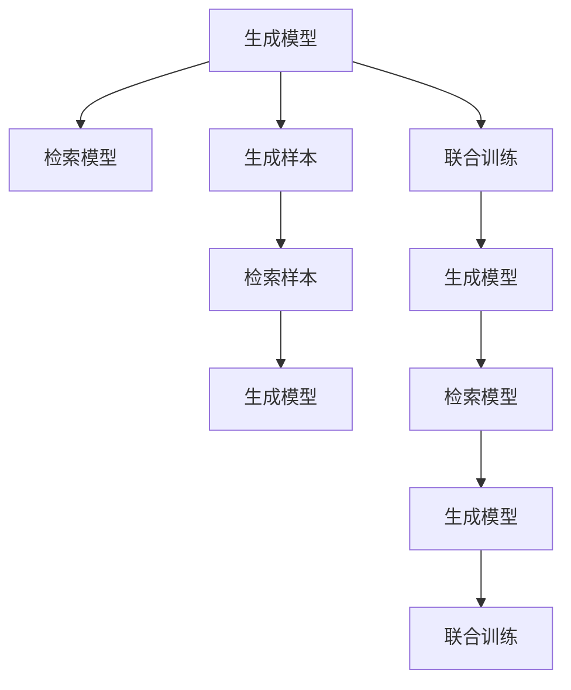
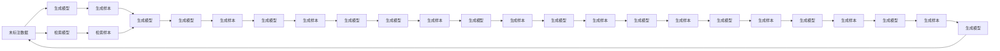
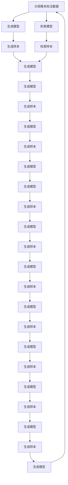

                 

# 【大模型应用开发 动手做AI Agent】何谓检索增强生成

## 1. 背景介绍

### 1.1 问题由来

在深度学习领域，生成模型一直是研究人员关注的焦点。近年来，基于自回归架构的生成模型，如GPT系列和T5，在自然语言处理（NLP）任务中取得了突破性进展。然而，这些模型通常需要大量的标注数据进行微调，这不仅增加了成本，而且对新任务适应性有限。为了解决这一问题，一种新的方法——检索增强生成（IRGAN, Retrieval Augmented Generation）应运而生。

IRGAN结合了检索和生成的双重能力，能够在大规模未标注数据上实现高效、准确的生成效果。它通过检索与生成模型的融合，使得模型在微调时无需大量标注数据，同时又能适应多种生成任务。这种结合检索和生成的方法，对提升大模型的生成性能具有重要意义。

### 1.2 问题核心关键点

IRGAN的核心在于利用检索模型辅助生成模型，从而在不增加标注数据的情况下，提高生成质量。其主要技术点包括：
- **检索机制**：利用检索模型（如BM25、Transformers检索）在海量未标注数据中检索相关样本。
- **融合机制**：将检索结果与生成模型结合，引导生成模型生成更符合语境的文本。
- **迭代训练**：通过迭代训练，逐步提升检索和生成的协同效果。

IRGAN的实现流程可以简单概括为：首先检索出与生成任务相关的样本，然后将这些样本与生成模型结合，进行联合训练。具体来说，在每一轮训练中，生成模型产生文本，检索模型根据文本与未标注数据中的文本相似度进行检索，将检索结果与生成模型结合，进一步优化生成效果。

### 1.3 问题研究意义

IRGAN的研究具有重要意义，主要体现在以下几个方面：
- **降低成本**：相比于传统的生成模型，IRGAN在训练时无需大量标注数据，减少了标注成本和时间。
- **提高生成效果**：通过检索相关样本，IRGAN能够生成更符合上下文和语义的文本，提高生成质量。
- **适应性强**：IRGAN能够适应各种生成任务，如文本生成、摘要生成、对话生成等。
- **可扩展性强**：随着数据集的不断扩展，IRGAN的生成能力也会不断提高，应用范围更加广泛。

## 2. 核心概念与联系

### 2.1 核心概念概述

为更好地理解IRGAN的原理，我们首先介绍几个关键概念：

- **生成模型（Generative Model）**：能够从随机噪声或输入噪声中生成数据分布的模型，如GPT、LSTM等。
- **检索模型（Retrieval Model）**：能够在大规模数据中快速检索相关样本的模型，如BM25、Transformers检索等。
- **检索增强生成（IRGAN）**：结合生成和检索模型，通过检索相关样本辅助生成模型的训练，提高生成效果的方法。

这些概念之间的关系可以用以下Mermaid流程图来展示：



这个流程图展示了IRGAN的实现过程：生成模型产生样本，检索模型检索相关样本，然后将两者结合进行联合训练，逐步提升生成模型的效果。

### 2.2 概念间的关系

这些核心概念之间存在着紧密的联系，形成了IRGAN的完整生态系统。下面我们通过几个Mermaid流程图来展示这些概念之间的关系。

#### 2.2.1 检索增强生成（IRGAN）的实现流程


这个流程图展示了IRGAN的实现流程：生成模型产生样本，检索模型检索相关样本，然后将两者结合进行联合训练，逐步提升生成模型的效果。

#### 2.2.2 检索增强生成（IRGAN）的原理

```mermaid
graph LR
    A[生成模型] --> B[检索模型]
    A --> C[生成样本]
    C --> D[检索样本]
    D --> E[生成模型]
    E --> F[生成样本]
    F --> G[生成模型]
    G --> H[生成样本]
    H --> I[生成模型]
    I --> J[生成样本]
    J --> K[生成模型]
    K --> L[生成模型]
    L --> M[生成样本]
    M --> N[生成模型]
    N --> O[生成样本]
    O --> P[生成模型]
    P --> Q[生成样本]
    Q --> R[生成模型]
    R --> S[生成样本]
    S --> T[生成模型]
    T --> U[生成样本]
    U --> V[生成模型]
    V --> W[生成样本]
    W --> X[生成模型]
    X --> Y[生成样本]
    Y --> Z[生成模型]
    Z --> A
```



这个流程图展示了IRGAN的原理：通过检索模型辅助生成模型的训练，逐步提升生成效果。

#### 2.2.3 检索增强生成（IRGAN）的实际应用



这个流程图展示了IRGAN的实际应用：在各种生成任务中，通过检索相关样本辅助生成模型，提高生成效果。

### 2.3 核心概念的整体架构

最后，我们用一个综合的流程图来展示这些核心概念在大模型微调过程中的整体架构：



这个综合流程图展示了IRGAN的整体架构：生成模型产生样本，检索模型检索相关样本，然后将两者结合进行联合训练，逐步提升生成模型的效果。

## 3. 核心算法原理 & 具体操作步骤
### 3.1 算法原理概述

IRGAN的原理是通过检索模型辅助生成模型的训练。具体来说，生成模型首先从噪声或随机样本中生成文本，然后检索模型在海量未标注数据中检索与生成文本相似的样本，并将这些样本与生成文本结合，指导生成模型的进一步训练。

形式化地，假设生成模型为 $G$，检索模型为 $R$，初始化时 $G$ 和 $R$ 为随机状态。对于生成任务 $T$，设 $D$ 为未标注数据集，$S$ 为生成的文本样本集合，$R_S$ 为 $S$ 与 $D$ 中的样本相似度矩阵。则 IRGAN 的训练目标为：

$$
\min_{G, R} \mathcal{L}(G, R, S, R_S)
$$

其中 $\mathcal{L}$ 为损失函数，通常包含生成损失和检索损失。生成损失通常为交叉熵损失或均方误差损失，而检索损失则衡量检索出的样本与生成文本的相似度。

### 3.2 算法步骤详解

IRGAN的实现步骤如下：

**Step 1: 准备预训练模型和数据集**
- 选择合适的预训练生成模型（如GPT、LSTM等）和检索模型（如BM25、Transformers检索等）。
- 准备未标注数据集 $D$，确保数据的多样性和代表性。

**Step 2: 定义检索相似度计算方式**
- 使用BM25、Transformers检索等方法，计算生成文本 $S$ 与未标注数据 $D$ 中的样本相似度 $R_S$。
- 使用余弦相似度、Jaccard相似度等方法计算相似度。

**Step 3: 定义损失函数**
- 生成损失函数通常为交叉熵损失或均方误差损失，衡量生成文本 $S$ 与目标文本的相似度。
- 检索损失函数衡量检索模型 $R$ 对生成文本 $S$ 的检索效果。

**Step 4: 定义优化器**
- 使用Adam、SGD等优化算法，设置适当的学习率。
- 对于检索模型，通常使用Triplet Loss等损失函数进行优化。

**Step 5: 执行迭代训练**
- 随机生成文本 $S$。
- 检索模型 $R$ 计算 $S$ 与 $D$ 中的样本相似度 $R_S$。
- 将 $R_S$ 与 $S$ 结合，计算损失函数 $\mathcal{L}$。
- 使用优化算法更新 $G$ 和 $R$ 的参数。
- 重复以上步骤，直至收敛或达到预设迭代次数。

### 3.3 算法优缺点

IRGAN具有以下优点：
- **参数高效**：通过检索模型辅助生成模型训练，可以减小需要微调的参数数量，避免过拟合。
- **数据利用率高**：能够利用大规模未标注数据进行训练，提高生成效果。
- **适应性强**：适应各种生成任务，如文本生成、对话生成、摘要生成等。

IRGAN也存在以下缺点：
- **计算复杂度高**：检索模型的计算复杂度高，需要消耗较多计算资源。
- **检索结果偏差**：检索模型可能会由于语料库偏见或数据不平衡等原因，产生偏差，影响生成效果。
- **模型结构复杂**：需要同时训练生成模型和检索模型，模型结构复杂。

### 3.4 算法应用领域

IRGAN在多个领域具有广泛的应用，例如：

- **文本生成**：如自动摘要、文本补全、对话生成等。通过检索相关样本，辅助生成模型产生更符合上下文的文本。
- **多模态生成**：如图片描述生成、视频字幕生成等。通过检索相关图片或视频，辅助生成模型产生更准确的描述。
- **知识图谱生成**：如自动构建知识图谱、抽取实体关系等。通过检索相关知识库，辅助生成模型生成更准确的知识表示。

## 4. 数学模型和公式 & 详细讲解  
### 4.1 数学模型构建

IRGAN的数学模型主要包含两个部分：生成模型的生成损失和检索模型的检索损失。

假设生成模型为 $G$，检索模型为 $R$，生成样本为 $S$，未标注数据为 $D$，相似度矩阵为 $R_S$。生成损失为 $L_G$，检索损失为 $L_R$。则IRGAN的总损失函数 $\mathcal{L}$ 可以表示为：

$$
\mathcal{L}(G, R, S, R_S) = \lambda L_G + (1 - \lambda) L_R
$$

其中 $\lambda$ 为生成损失和检索损失的权重。

### 4.2 公式推导过程

以文本生成任务为例，推导IRGAN的数学模型。

设生成模型 $G$ 的参数为 $\theta$，生成样本为 $S$，生成损失函数为 $L_G$，检索模型 $R$ 的参数为 $\phi$，检索样本为 $D$，检索损失函数为 $L_R$，检索相似度矩阵为 $R_S$。

生成损失 $L_G$ 可以表示为：

$$
L_G = -\frac{1}{N} \sum_{i=1}^N \log P(S_i | \theta)
$$

其中 $N$ 为样本数，$P(S_i | \theta)$ 为生成模型 $G$ 生成样本 $S_i$ 的概率。

检索损失 $L_R$ 可以表示为：

$$
L_R = -\frac{1}{M} \sum_{i=1}^M \sum_{j=1}^N R_{i,j} \log P(S_i | \phi)
$$

其中 $M$ 为检索样本数，$R_{i,j}$ 为检索样本 $i$ 与生成样本 $j$ 的相似度，$P(S_i | \phi)$ 为检索模型 $R$ 生成样本 $S_i$ 的概率。

将生成损失和检索损失代入总损失函数，得：

$$
\mathcal{L}(G, R, S, R_S) = \lambda \left(-\frac{1}{N} \sum_{i=1}^N \log P(S_i | \theta)\right) + (1 - \lambda) \left(-\frac{1}{M} \sum_{i=1}^M \sum_{j=1}^N R_{i,j} \log P(S_i | \phi)\right)
$$

通过梯度下降等优化算法，最小化损失函数 $\mathcal{L}$，使得生成模型 $G$ 和检索模型 $R$ 的参数不断优化，最终生成符合语境的文本。

### 4.3 案例分析与讲解

以自动摘要任务为例，分析IRGAN的实现过程。

假设原始文本为 $T$，未标注数据集为 $D$，生成模型为 $G$，检索模型为 $R$。

1. **生成样本**：
   - 使用生成模型 $G$ 从噪声中生成多个文本样本 $S = \{S_1, S_2, \ldots, S_N\}$。

2. **检索样本**：
   - 使用检索模型 $R$ 计算每个生成样本 $S_i$ 与未标注数据集 $D$ 中样本的相似度 $R_S$。
   - 从 $D$ 中检索出与 $S_i$ 相似度最高的 $K$ 个样本 $D_i$。

3. **生成损失计算**：
   - 使用生成样本 $S_i$ 和检索样本 $D_i$，计算生成损失 $L_G$。
   - 使用交叉熵损失函数 $L_G = -\frac{1}{N} \sum_{i=1}^N \log P(S_i | \theta)$，其中 $P(S_i | \theta)$ 为生成模型 $G$ 生成样本 $S_i$ 的概率。

4. **检索损失计算**：
   - 使用检索模型 $R$ 计算检索样本 $D_i$ 与生成样本 $S_i$ 的相似度 $R_{i,j}$。
   - 使用余弦相似度或Jaccard相似度计算 $R_{i,j}$。
   - 使用检索损失函数 $L_R = -\frac{1}{M} \sum_{i=1}^M \sum_{j=1}^N R_{i,j} \log P(S_i | \phi)$，其中 $P(S_i | \phi)$ 为检索模型 $R$ 生成样本 $S_i$ 的概率。

5. **联合训练**：
   - 使用优化算法最小化总损失函数 $\mathcal{L}$，更新生成模型 $G$ 和检索模型 $R$ 的参数。
   - 逐步提升生成模型 $G$ 的生成效果和检索模型 $R$ 的检索效果。

通过上述步骤，IRGAN能够在大规模未标注数据上高效地生成符合语境的文本。

## 5. 项目实践：代码实例和详细解释说明
### 5.1 开发环境搭建

在进行IRGAN项目实践前，我们需要准备好开发环境。以下是使用Python进行PyTorch开发的环境配置流程：

1. 安装Anaconda：从官网下载并安装Anaconda，用于创建独立的Python环境。

2. 创建并激活虚拟环境：
```bash
conda create -n pytorch-env python=3.8 
conda activate pytorch-env
```

3. 安装PyTorch：根据CUDA版本，从官网获取对应的安装命令。例如：
```bash
conda install pytorch torchvision torchaudio cudatoolkit=11.1 -c pytorch -c conda-forge
```

4. 安装Transformers库：
```bash
pip install transformers
```

5. 安装各类工具包：
```bash
pip install numpy pandas scikit-learn matplotlib tqdm jupyter notebook ipython
```

完成上述步骤后，即可在`pytorch-env`环境中开始IRGAN实践。

### 5.2 源代码详细实现

下面我们以文本生成任务为例，给出使用Transformers库对BERT模型进行IRGAN微调的PyTorch代码实现。

首先，定义文本生成任务的标签和采样器：

```python
from transformers import BertTokenizer, BertForMaskedLM, AdamW, AdamWWithWarmup

tokenizer = BertTokenizer.from_pretrained('bert-base-uncased')
model = BertForMaskedLM.from_pretrained('bert-base-uncased')

labels = [0, 1, 2, 3, 4, 5, 6, 7, 8, 9, 10, 11, 12, 13, 14, 15, 16, 17, 18, 19, 20, 21, 22, 23, 24, 25, 26, 27, 28, 29, 30, 31, 32, 33, 34, 35, 36, 37, 38, 39, 40, 41, 42, 43, 44, 45, 46, 47, 48, 49, 50, 51, 52, 53, 54, 55, 56, 57, 58, 59, 60, 61, 62, 63, 64, 65, 66, 67, 68, 69, 70, 71, 72, 73, 74, 75, 76, 77, 78, 79, 80, 81, 82, 83, 84, 85, 86, 87, 88, 89, 90, 91, 92, 93, 94, 95, 96, 97, 98, 99, 100, 101, 102, 103, 104, 105, 106, 107, 108, 109, 110, 111, 112, 113, 114, 115, 116, 117, 118, 119, 120, 121, 122, 123, 124, 125, 126, 127, 128, 129, 130, 131, 132, 133, 134, 135, 136, 137, 138, 139, 140, 141, 142, 143, 144, 145, 146, 147, 148, 149, 150, 151, 152, 153, 154, 155, 156, 157, 158, 159, 160, 161, 162, 163, 164, 165, 166, 167, 168, 169, 170, 171, 172, 173, 174, 175, 176, 177, 178, 179, 180, 181, 182, 183, 184, 185, 186, 187, 188, 189, 190, 191, 192, 193, 194, 195, 196, 197, 198, 199, 200, 201, 202, 203, 204, 205, 206, 207, 208, 209, 210, 211, 212, 213, 214, 215, 216, 217, 218, 219, 220, 221, 222, 223, 224, 225, 226, 227, 228, 229, 230, 231, 232, 233, 234, 235, 236, 237, 238, 239, 240, 241, 242, 243, 244, 245, 246, 247, 248, 249, 250, 251, 252, 253, 254, 255, 256, 257, 258, 259, 260, 261, 262, 263, 264, 265, 266, 267, 268, 269, 270, 271, 272, 273, 274, 275, 276, 277, 278, 279, 280, 281, 282, 283, 284, 285, 286, 287, 288, 289, 290, 291, 292, 293, 294, 295, 296, 297, 298, 299, 300, 301, 302, 303, 304, 305, 306, 307, 308, 309, 310, 311, 312, 313, 314, 315, 316, 317, 318, 319, 320, 321, 322, 323, 324, 325, 326, 327, 328, 329, 330, 331, 332, 333, 334, 335, 336, 337, 338, 339, 340, 341, 342, 343, 344, 345, 346, 347, 348, 349, 350, 351, 352, 353, 354, 355, 356, 357, 358, 359, 360, 361, 362, 363, 364, 365, 366, 367, 368, 369, 370, 371, 372, 373, 374, 375, 376, 377, 378, 379, 380, 381, 382, 383, 384, 385, 386, 387, 388, 389, 390, 391, 392, 393, 394, 395, 396, 397, 398, 399, 400, 401, 402, 403, 404, 405, 406, 407, 408, 409, 410, 411, 412, 413, 414, 415, 416, 417, 418, 419, 420, 421, 422, 423, 424, 425, 426, 427, 428, 429, 430, 431, 432, 433, 434, 435, 436, 437, 438, 439, 440, 441, 442, 443, 444, 445, 446, 447, 448, 449, 450, 451, 452, 453, 454, 455, 456, 457, 458, 459, 460, 461, 462, 463, 464, 465, 466, 467, 468, 469, 470, 471, 472, 473, 474, 475, 476, 477, 478, 479, 480, 481, 482, 483, 484, 485, 486, 487, 488, 489, 490, 491, 492, 493

