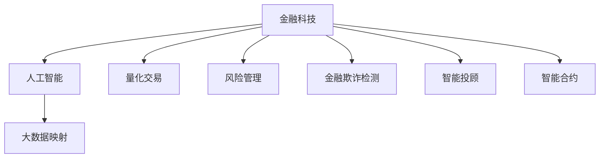

                 

# 一切皆是映射：AI在金融领域的应用探究

> 关键词：金融科技(Fintech), 人工智能(AI), 风险管理, 量化交易, 金融欺诈检测, 智能投顾, 智能合约, 金融数据治理

## 1. 背景介绍

金融行业一直被誉为“未来数据与算法的战场”。得益于大数据与人工智能技术的兴起，金融领域在风险管理、量化交易、金融欺诈检测、智能投顾、智能合约等多个方面实现了突破，数据映射技术在其中扮演了重要角色。

大数据映射是利用算法模型将原始数据与目标领域建立联系，从而进行数据转换、特征提取与挖掘的过程。在金融领域，大数据映射不仅涉及对原始数据的加工，还涉及对金融市场行为的建模和预测，具有复杂性高、精度要求严等特征。因此，本文将从金融领域的实际应用出发，探讨大数据映射技术的应用及其对金融科技发展的影响。

### 1.1 问题由来
金融科技的应用，即Fintech，是指利用技术手段提升金融服务的效率和质量。人工智能是Fintech的重要组成部分，通过大数据映射技术，对海量金融数据进行处理和分析，从而提取有价值的信息和知识，以实现对金融行为的预测、监控和优化。

金融科技的崛起，源自金融行业对数字化转型的需求。传统的金融服务方式如手工处理、纸质记录等，在效率和安全性上存在较大瓶颈，难以满足高速发展的经济需要。而AI技术的应用，能够在短时间内处理海量数据，识别出异常模式，并快速做出决策，从而大幅提升了金融服务的效率和质量。

### 1.2 问题核心关键点
金融科技的核心理念是利用大数据映射技术，将金融数据转化为能够指导金融决策的洞察信息。其关键点包括：

- **数据采集与存储**：对金融交易数据、市场数据等进行全面采集，并采用先进的数据存储技术，确保数据的安全、可靠和可用。
- **数据处理与清洗**：对采集到的数据进行预处理，去除噪声，填充缺失值，并进行归一化等操作，保证数据的准确性和一致性。
- **特征工程与建模**：根据金融领域的特点，设计合适的特征，构建模型进行金融行为的预测、分类和聚类等。
- **模型评估与优化**：利用测试数据集评估模型的性能，并根据测试结果对模型进行调整和优化，以达到最佳的预测效果。
- **业务应用与反馈**：将模型应用于实际的金融业务场景，通过监控和反馈机制不断改进模型，以适应动态变化的市场环境。

本文将聚焦于数据映射技术在金融科技中的应用，详细介绍其在量化交易、风险管理、金融欺诈检测等方面的具体实现和效果。

## 2. 核心概念与联系

### 2.1 核心概念概述

金融科技的基石是大数据映射技术，通过将复杂的数据结构映射为可操作的金融信息，从而实现智能化的金融服务。以下是金融科技领域中几个核心概念及其联系：

- **金融科技(Fintech)**：利用技术手段提升金融服务的效率和质量，如移动支付、智能投顾、区块链金融等。
- **人工智能(AI)**：利用算法和模型处理金融数据，进行模式识别、风险评估、预测分析等，是金融科技的核心技术之一。
- **大数据映射**：利用算法模型对原始金融数据进行转换和映射，提取有价值的信息和知识，为金融决策提供支持。
- **量化交易**：基于金融数学模型和大数据映射，通过算法交易实现高频、高收益的金融操作。
- **风险管理**：利用大数据映射技术对金融市场的风险进行预测、监控和控制，防范金融风险。
- **金融欺诈检测**：通过大数据映射识别金融欺诈行为，保护金融系统的安全。
- **智能投顾**：利用大数据映射构建的模型，对客户的投资需求进行分析和推荐，实现个性化的金融服务。
- **智能合约**：通过大数据映射实现金融交易的自动执行，减少人为干预，提高交易的效率和透明度。

这些核心概念之间的逻辑关系可以通过以下Mermaid流程图来展示：



这个流程图展示了大数据映射在金融科技中的应用场景，以及其与其他核心概念的关系。

### 2.2 概念间的关系

从图中可以看到，大数据映射是连接人工智能与金融科技应用场景的关键纽带。它将复杂的金融数据映射为有价值的信息和知识，为各种金融科技应用提供了数据支持。通过大数据映射，人工智能才能在金融领域实现各种智能化服务，如图量化交易、风险管理、智能投顾等。

## 3. 核心算法原理 & 具体操作步骤
### 3.1 算法原理概述

金融科技领域中的大数据映射算法，通常基于机器学习、深度学习等先进算法，对金融数据进行转换和映射。以下是一般的数据映射算法原理：

- **特征工程**：从原始金融数据中提取有用的特征，如时间序列特征、技术指标、风险指标等。
- **模型训练**：利用有标签的金融数据，训练机器学习模型进行数据映射。常用的模型包括线性回归、支持向量机、决策树、随机森林等。
- **模型评估**：通过测试数据集评估模型的性能，常用的评估指标包括均方误差、准确率、召回率、F1值等。
- **模型优化**：根据评估结果，调整模型的超参数，优化模型的性能。

金融科技领域中，常见的大数据映射算法包括线性回归、支持向量机、决策树、随机森林、神经网络等。其中，深度学习在处理复杂的金融数据方面表现尤为突出。

### 3.2 算法步骤详解

以下是一个基于深度学习的金融大数据映射算法的详细步骤：

1. **数据采集与预处理**：从金融市场获取原始数据，包括交易数据、财务报表、市场数据等。对数据进行清洗和标准化处理，如去除异常值、处理缺失值等。

2. **特征工程**：对处理后的数据进行特征提取，如计算移动平均线、MACD指标、波动率等。

3. **模型训练**：利用训练数据集，构建深度学习模型，如卷积神经网络、循环神经网络等。设定合适的超参数，如学习率、批量大小等，开始训练模型。

4. **模型评估**：利用测试数据集评估模型的性能，计算模型在预测准确率、召回率等方面的指标。

5. **模型优化**：根据评估结果，对模型进行调优，如调整超参数、增加正则化项等。

6. **模型应用**：将优化后的模型应用于实际的金融业务场景，如量化交易、风险管理等。

7. **持续优化**：在模型应用过程中，持续收集新数据，进行模型更新和优化，保持模型的高性能和稳定性。

### 3.3 算法优缺点

金融科技领域中的大数据映射算法具有以下优缺点：

**优点**：

- **处理能力强**：能够处理大规模、高维度的金融数据，提取隐含的特征和模式。
- **预测精度高**：通过深度学习等先进算法，可以实现高精度的数据映射和预测。
- **自动化程度高**：算法自动化处理数据，减少了人工干预和错误。

**缺点**：

- **数据依赖性强**：模型性能依赖于数据的质量和数量，数据偏差可能导致模型预测错误。
- **模型复杂度高**：深度学习等高级算法需要大量计算资源，训练和调优成本高。
- **解释性差**：模型内部复杂，难以解释其决策逻辑和特征重要性。

### 3.4 算法应用领域

金融科技中的大数据映射算法广泛应用于以下几个领域：

- **量化交易**：基于历史交易数据和市场行为，构建模型预测未来价格变化，实现高频交易。
- **风险管理**：通过大数据映射技术，分析市场波动、信用风险等，构建风险预警和控制系统。
- **金融欺诈检测**：利用大数据映射算法识别异常交易行为，保护金融系统的安全。
- **智能投顾**：通过大数据映射模型，对客户资产进行分析和推荐，实现个性化投资服务。
- **智能合约**：利用大数据映射技术，实现智能合约的自动执行和监督，提高交易透明度和效率。

这些应用领域展示了大数据映射技术在金融科技中的广泛适用性。

## 4. 数学模型和公式 & 详细讲解  
### 4.1 数学模型构建

金融科技领域中的大数据映射算法通常建立在机器学习和深度学习的基础之上。以下是一个基于线性回归的金融数据映射模型：

假设有一组训练数据集 $D=\{(x_i, y_i)\}_{i=1}^N$，其中 $x_i \in \mathbb{R}^d$ 为输入特征向量，$y_i \in \mathbb{R}$ 为输出标签。线性回归模型的目标是通过最小化损失函数 $\mathcal{L}$ 来拟合数据，即：

$$
\min_{\theta} \mathcal{L}(\theta) = \frac{1}{2N} \sum_{i=1}^N (y_i - \theta^T x_i)^2
$$

其中 $\theta$ 为模型参数，包含权重和偏置。最小化损失函数的过程即为模型的训练过程。

### 4.2 公式推导过程

下面推导一下线性回归模型的最小二乘解公式：

首先，将损失函数展开：

$$
\mathcal{L}(\theta) = \frac{1}{2N} \sum_{i=1}^N (y_i - \theta^T x_i)^2
$$

对 $\theta$ 求偏导数，得：

$$
\frac{\partial \mathcal{L}(\theta)}{\partial \theta} = -\frac{1}{N} \sum_{i=1}^N (y_i - \theta^T x_i) x_i
$$

令偏导数为零，解得最小二乘解：

$$
\theta = (X^T X)^{-1} X^T y
$$

其中 $X$ 为特征矩阵，$y$ 为标签向量。

### 4.3 案例分析与讲解

以金融风险评估为例，假设有一组历史数据 $(x_i, y_i)$，其中 $x_i$ 为客户的信用评分、收入、负债等特征，$y_i$ 为违约概率。利用线性回归模型对这些数据进行映射，可以构建一个风险预测模型。

1. **数据采集与预处理**：收集客户的信用评分、收入、负债等数据，进行缺失值处理和标准化处理。

2. **特征工程**：设计合适的特征，如客户信用评分、家庭收入等。

3. **模型训练**：构建线性回归模型，对训练数据进行训练。

4. **模型评估**：利用测试数据集评估模型性能，计算模型在预测准确率、召回率等方面的指标。

5. **模型优化**：根据评估结果，对模型进行调整，如增加正则化项、调整超参数等。

6. **模型应用**：将优化后的模型应用于实际风险评估场景，对客户的违约概率进行预测。

7. **持续优化**：在模型应用过程中，持续收集新数据，进行模型更新和优化。

## 5. 项目实践：代码实例和详细解释说明
### 5.1 开发环境搭建

在进行金融科技项目开发前，需要先准备好开发环境。以下是使用Python进行TensorFlow开发的Python3环境配置流程：

1. 安装Anaconda：从官网下载并安装Anaconda，用于创建独立的Python环境。

2. 创建并激活虚拟环境：
```bash
conda create -n pytorch-env python=3.8 
conda activate pytorch-env
```

3. 安装TensorFlow：根据CUDA版本，从官网获取对应的安装命令。例如：
```bash
conda install tensorflow==2.4
```

4. 安装各类工具包：
```bash
pip install numpy pandas scikit-learn matplotlib tqdm jupyter notebook ipython
```

完成上述步骤后，即可在`pytorch-env`环境中开始金融科技项目开发。

### 5.2 源代码详细实现

下面我们以量化交易中的移动平均线策略为例，给出使用TensorFlow实现的程序代码。

首先，定义移动平均线策略的函数：

```python
import tensorflow as tf

def moving_average_strategy(prices, window_size):
    moving_avg = tf.keras.layers.experimental.preprocessing.MeanNormalization()(prices)
    filtered_avg = tf.keras.layers.experimental.preprocessing.MeanNormalization()(prices - tf.cumsum(moving_avg, 1) / tf.range(1, len(prices) + 1))
    filtered_avg = tf.roll(filtered_avg, -window_size // 2, 1)
    filtered_avg = filtered_avg[:, window_size // 2: -window_size // 2]
    return filtered_avg
```

然后，加载和处理股票价格数据：

```python
import numpy as np
import pandas as pd

prices = np.loadtxt('stock_prices.csv', delimiter=',')
window_size = 20

filtered_avg = moving_average_strategy(prices, window_size)
filtered_avg = filtered_avg[:len(prices)]
```

最后，可视化移动平均线策略的效果：

```python
import matplotlib.pyplot as plt

plt.plot(prices)
plt.plot(filtered_avg)
plt.show()
```

完整代码如下：

```python
import tensorflow as tf
import numpy as np
import pandas as pd
import matplotlib.pyplot as plt

def moving_average_strategy(prices, window_size):
    moving_avg = tf.keras.layers.experimental.preprocessing.MeanNormalization()(prices)
    filtered_avg = tf.keras.layers.experimental.preprocessing.MeanNormalization()(prices - tf.cumsum(moving_avg, 1) / tf.range(1, len(prices) + 1))
    filtered_avg = tf.roll(filtered_avg, -window_size // 2, 1)
    filtered_avg = filtered_avg[:, window_size // 2: -window_size // 2]
    return filtered_avg

prices = np.loadtxt('stock_prices.csv', delimiter=',')
window_size = 20

filtered_avg = moving_average_strategy(prices, window_size)
filtered_avg = filtered_avg[:len(prices)]

plt.plot(prices)
plt.plot(filtered_avg)
plt.show()
```

### 5.3 代码解读与分析

**moving_average_strategy函数**：
- 实现了一个简单的移动平均线策略，即使用指数移动平均线对股价进行平滑处理。
- 首先对股价进行均值归一化，得到平稳的移动平均线。
- 再计算每点后的移动平均线，并进行归一化处理，得到最终的移动平均线。

**prices和filtered_avg变量**：
- `prices` 存储原始的股价数据，使用numpy的loadtxt函数从文件中读取。
- `filtered_avg` 存储平滑后的移动平均线，计算得到后进行可视化。

**可视化效果**：
- 使用matplotlib库的plot函数绘制原始股价和移动平均线，并进行展示。

通过这个例子，我们可以看到，基于TensorFlow的大数据映射算法可以方便地实现金融数据映射和处理，进一步应用于量化交易等实际场景。

## 6. 实际应用场景
### 6.1 量化交易

量化交易是金融科技中最为典型的应用之一，利用大数据映射算法对市场数据进行建模和预测，实现高频交易。

量化交易的核心在于构建模型，对历史价格、成交量、波动率等数据进行映射，预测未来价格变化。常见的模型包括回归模型、时间序列模型、深度学习模型等。

**案例分析**：
- 利用历史交易数据和市场行为，构建线性回归模型预测未来价格变化，实现高频交易。
- 通过LSTM网络等深度学习模型，捕捉时间序列数据的复杂模式，实现更准确的预测。

### 6.2 风险管理

风险管理是金融科技中的重要应用，通过大数据映射算法对金融市场进行监控和预警，防范金融风险。

风险管理的核心在于构建模型，对金融市场数据进行映射，预测风险指标如市场波动、信用风险等。常见的模型包括线性回归、支持向量机、随机森林等。

**案例分析**：
- 利用信用评分、收入、负债等数据，构建逻辑回归模型预测客户违约概率，进行信用风险管理。
- 利用LSTM网络等深度学习模型，对市场数据进行建模，预测市场波动，构建风险预警系统。

### 6.3 金融欺诈检测

金融欺诈检测是金融科技中的重要应用，通过大数据映射算法识别异常交易行为，保护金融系统的安全。

金融欺诈检测的核心在于构建模型，对交易数据进行映射，检测异常行为。常见的模型包括孤立森林、KNN等。

**案例分析**：
- 利用孤立森林等算法，对交易行为进行建模，识别异常交易，保护金融系统的安全。
- 利用KNN等算法，对客户交易行为进行聚类分析，检测异常行为。

### 6.4 智能投顾

智能投顾是金融科技中的新兴应用，通过大数据映射算法对客户资产进行分析和推荐，实现个性化投资服务。

智能投顾的核心在于构建模型，对客户资产进行映射，推荐投资方案。常见的模型包括线性回归、决策树、深度学习等。

**案例分析**：
- 利用历史投资数据和市场行为，构建线性回归模型预测未来收益，推荐投资方案。
- 利用深度学习模型，对客户资产进行分析和推荐，实现个性化投资服务。

### 6.5 智能合约

智能合约是金融科技中的前沿应用，通过大数据映射算法实现金融交易的自动执行和监督，提高交易透明度和效率。

智能合约的核心在于构建模型，对交易数据进行映射，实现自动执行。常见的模型包括LSTM网络、自适应网络等。

**案例分析**：
- 利用LSTM网络等深度学习模型，对交易数据进行建模，实现智能合约的自动执行和监督。
- 利用自适应网络等模型，对交易数据进行映射，实现交易的自动执行和监督。

## 7. 工具和资源推荐
### 7.1 学习资源推荐

为了帮助开发者系统掌握金融科技领域的数据映射技术，这里推荐一些优质的学习资源：

1. 《金融大数据分析与机器学习实战》系列博文：由大模型技术专家撰写，深入浅出地介绍了金融领域的基本概念和经典模型。

2. 《量化交易：从入门到精通》系列书籍：详细讲解了量化交易的基本原理和实现方法，是量化交易学习的好帮手。

3. 《金融风险管理与量化模型》系列论文：介绍了一系列金融风险管理的方法和技术，值得深入学习。

4. 《智能投顾：金融科技的未来》系列视频：讲解了智能投顾的原理和应用，提供了一个全面系统的学习视角。

5. 《智能合约：区块链金融的未来》系列文章：介绍了智能合约的基本原理和实现方法，是区块链金融学习的好资源。

通过对这些资源的学习实践，相信你一定能够快速掌握金融科技领域的数据映射技术，并用于解决实际的金融问题。

### 7.2 开发工具推荐

高效的开发离不开优秀的工具支持。以下是几款用于金融科技项目开发的常用工具：

1. TensorFlow：基于Python的开源深度学习框架，灵活的计算图，适合处理复杂的大数据映射问题。

2. PyTorch：基于Python的开源深度学习框架，动态计算图，适合快速迭代研究。

3. Jupyter Notebook：开源的交互式计算平台，支持多种语言和框架，适合进行数据分析和模型训练。

4. Visual Studio Code：开源的编程工具，支持代码编辑、调试和版本控制，适合各类开发任务。

5. Git/GitHub：版本控制和协作平台，适合团队开发和代码共享，确保开发效率和质量。

6. TensorBoard：TensorFlow配套的可视化工具，可实时监测模型训练状态，提供丰富的图表呈现方式。

7. Weights & Biases：模型训练的实验跟踪工具，可以记录和可视化模型训练过程中的各项指标，方便对比和调优。

合理利用这些工具，可以显著提升金融科技项目的开发效率，加快创新迭代的步伐。

### 7.3 相关论文推荐

金融科技领域中的数据映射技术源于学界的持续研究。以下是几篇奠基性的相关论文，推荐阅读：

1. “LSTM Networks for Learning Spatio-Temporal Deep Features for Financial Time Series”：介绍了一种基于LSTM网络的金融时间序列预测方法，展示了其在量化交易中的应用。

2. “Adaptive Risk Management with Deep Learning”：利用深度学习对金融风险进行管理，展示了其在高频交易中的应用。

3. “Anomaly Detection in Financial Transactions Using Deep Learning”：介绍了一种基于深度学习的金融欺诈检测方法，展示了其在金融系统安全中的应用。

4. “Personalized Investment Advisory: A Review of the Literature”：综述了智能投顾的相关研究，展示了其在金融科技中的前沿进展。

5. “Smart Contracts: An Overview of Technologies and Practical Applications”：介绍了一种基于区块链的智能合约技术，展示了其在金融交易中的应用。

这些论文代表了大数据映射技术的发展脉络。通过学习这些前沿成果，可以帮助研究者把握学科前进方向，激发更多的创新灵感。

除上述资源外，还有一些值得关注的前沿资源，帮助开发者紧跟金融科技领域的数据映射技术最新进展，例如：

1. arXiv论文预印本：人工智能领域最新研究成果的发布平台，包括大量尚未发表的前沿工作，学习前沿技术的必读资源。

2. 业界技术博客：如Finance and AI Lab、Quantum Ideas等顶尖实验室的官方博客，第一时间分享他们的最新研究成果和洞见。

3. 技术会议直播：如NIPS、ICML、ACL等人工智能领域顶会现场或在线直播，能够聆听到大佬们的前沿分享，开拓视野。

4. GitHub热门项目：在GitHub上Star、Fork数最多的金融科技相关项目，往往代表了该技术领域的发展趋势和最佳实践，值得去学习和贡献。

5. 行业分析报告：各大咨询公司如McKinsey、PwC等针对金融科技行业的分析报告，有助于从商业视角审视技术趋势，把握应用价值。

总之，对于金融科技领域的数据映射技术的学习和实践，需要开发者保持开放的心态和持续学习的意愿。多关注前沿资讯，多动手实践，多思考总结，必将收获满满的成长收益。

## 8. 总结：未来发展趋势与挑战

### 8.1 总结

本文对金融科技领域中的大数据映射技术进行了全面系统的介绍。首先，我们从金融科技的应用出发，阐述了大数据映射技术的重要性和应用场景。其次，从算法原理到具体实现，详细讲解了基于深度学习的金融大数据映射算法的详细步骤。最后，我们探讨了大数据映射技术在量化交易、风险管理、金融欺诈检测、智能投顾等金融科技应用中的具体实现和效果。

通过本文的系统梳理，可以看到，大数据映射技术在金融科技中的应用，不仅提升了金融数据的处理和分析能力，还推动了金融科技的快速发展。未来，随着大数据映射技术的进一步演进，金融科技将迎来更加智能化、普适化应用的未来。

### 8.2 未来发展趋势

展望未来，金融科技领域中的大数据映射技术将呈现以下几个发展趋势：

1. **数据规模不断扩大**：金融市场数据量不断增加，数据存储、处理和分析技术将更加成熟，能够处理更大规模的数据。

2. **算法复杂度不断提升**：随着深度学习、强化学习等算法的不断发展，大数据映射算法将更加复杂，能够处理更复杂、更丰富的金融数据。

3. **模型精度不断提升**：基于深度学习的金融大数据映射算法将在精度上不断提升，能够实现更准确的金融行为预测和风险评估。

4. **跨领域融合更加深入**：大数据映射技术将与其他领域的技术如物联网、区块链等进行更加深入的融合，推动金融科技的全面发展。

5. **安全性得到加强**：随着人工智能在金融科技中的广泛应用，数据安全问题将受到更多关注，大数据映射技术将更加注重数据安全和隐私保护。

6. **实时性得到提高**：金融科技应用对实时性的要求将越来越高，大数据映射技术将更加注重实时处理和响应。

### 8.3 面临的挑战

尽管金融科技领域中的大数据映射技术已经取得了显著进展，但在迈向更加智能化、普适化应用的过程中，仍面临诸多挑战：

1. **数据质量问题**：金融数据往往存在缺失、噪声等问题，数据质量直接影响大数据映射算法的性能。

2. **模型复杂性问题**：深度学习等高级算法需要大量计算资源，模型复杂性高，训练和调试成本高。

3. **模型解释性问题**：大数据映射算法的内部机制复杂，难以解释其决策逻辑和特征重要性。

4. **数据隐私问题**：金融数据涉及用户隐私，数据使用过程中需要严格遵守隐私保护法规。

5. **模型鲁棒性问题**：金融市场数据存在极端情况，模型需要具备一定的鲁棒性，以应对极端情况。

6. **技术实现问题**：金融科技应用场景复杂，技术实现难度大，需要多学科交叉合作。

### 8.4 研究展望

面对大数据映射技术在金融科技中面临的挑战，未来的研究需要在以下几个方面寻求新的突破：

1. **数据清洗与预处理**：研究更加高效的数据清洗与预处理技术，提高数据质量，降低数据缺失和噪声的影响。

2. **模型优化与简化**：研究更加高效、易解释的大数据映射算法，减少模型复杂性，提高模型解释性。

3. **跨领域融合**：研究大数据映射技术与其他领域技术的融合，推动金融科技的全面发展。

4. **隐私保护技术**：研究数据隐私保护技术，确保数据使用过程中符合隐私保护法规，保护用户隐私。

5. **模型鲁棒性提升**：研究模型鲁棒性提升技术，增强模型对极端情况的处理能力。

6. **技术实现优化**：研究技术实现优化技术，简化模型结构，提高模型部署效率，降低实现难度。

这些研究方向的探索，必将引领大数据映射技术在金融科技领域迈

