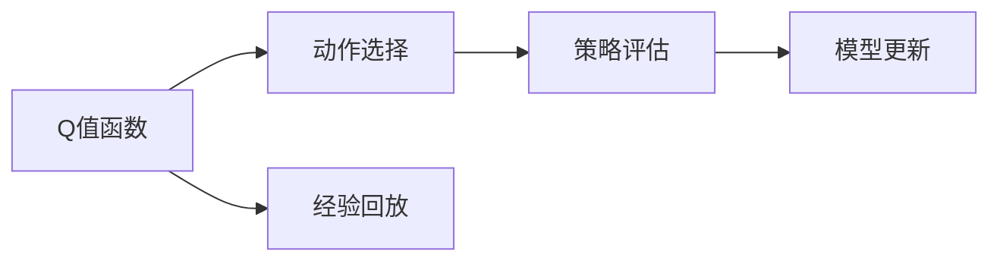

                 

# 一切皆是映射：DQN算法的行业标准化：走向商业化应用

> 关键词：DQN, 强化学习, 深度学习, 神经网络, 策略评估, 动作选择, 蒙特卡罗树搜索

## 1. 背景介绍

### 1.1 问题由来

在深度学习风起云涌的今天，强化学习(Reinforcement Learning, RL)也逐渐成为AI领域的明星技术。特别是其中的深度强化学习，以深度神经网络为核心的RL方法，已成功应用于游戏、机器人、自动驾驶、推荐系统等多个领域。然而，尽管这类算法在学术界取得了一系列突破性成果，但在商业化应用中，它们依然面临着诸多挑战，主要集中在算法模型性能、稳定性、可解释性、可扩展性等方面。

### 1.2 问题核心关键点

DQN（Deep Q-Network）算法作为深度强化学习的经典算法之一，通过对Q值的深度神经网络逼近，能够有效地处理高维度复杂环境，逐步学习最优策略，在环境中积累并优化经验。但DQN算法的训练过程复杂，模型参数量大，缺乏可解释性，这些特点限制了其在实际工业应用中的广泛部署。

DQN算法的核心问题主要集中在以下几个方面：
- 模型复杂性高：神经网络参数过多，训练复杂度高。
- 过拟合问题：模型在大规模数据下容易过拟合，泛化性能差。
- 策略评估困难：DQN模型需要对Q值进行多次迭代更新，无法直接评估当前策略性能。
- 模型可解释性差：缺乏可解释的决策过程，难以进行有效的调试和优化。
- 算法鲁棒性不足：在复杂多变的环境中，模型往往无法稳健地适应新的状态。

为了更好地应对这些挑战，DQN算法必须走向行业标准化，实现算法的商业化应用，提升算法的性能和可解释性。本文将深入探讨DQN算法的核心原理和实现细节，分析其优缺点，并探讨其在实际应用中的策略优化和标准规范。

### 1.3 问题研究意义

实现DQN算法的行业标准化，不仅有助于提升其性能，降低其部署成本，还能提升算法的可解释性和鲁棒性，推动强化学习技术在实际工业场景中的大规模应用。具体而言：

1. 降低算法复杂度：通过简化算法模型，降低训练复杂度，提升算法的可扩展性和可操作性。
2. 提升模型性能：通过改进算法策略和优化模型结构，提升DQN模型在大规模数据集上的泛化性能。
3. 增强模型可解释性：引入更多可解释性组件，帮助开发者更好地理解模型行为和决策过程。
4. 提升算法鲁棒性：通过引入对抗训练等技术，增强模型在复杂环境中的稳健性。
5. 推动应用落地：标准化算法过程，提升算法在实际应用中的部署效率和稳定性。

## 2. 核心概念与联系

### 2.1 核心概念概述

DQN算法作为一种基于深度神经网络的强化学习算法，其核心思想是通过近似Q值函数来逼近最优策略。Q值函数表示在当前状态下，采取某一动作后的预期累积奖励。算法的目标是通过训练深度神经网络，使Q值函数能够准确预测出最优策略，从而实现自动学习最优决策。

DQN算法涉及的核心概念包括：

- Q值函数：表示在当前状态下，采取某一动作后的预期累积奖励。
- 动作选择：在给定状态下，选择合适的动作以最大化累积奖励。
- 策略评估：通过拟合Q值函数，评估当前策略的性能。
- 经验回放：将观察到的状态-动作-奖励对保存下来，供模型学习使用。

### 2.2 概念间的关系

DQN算法的核心概念间的关系可以通过以下Mermaid流程图来展示：



这个流程图展示了DQN算法的核心步骤：

1. 在给定状态下，通过Q值函数评估不同动作的预期奖励，并选择最优动作。
2. 对当前状态和选择的动作进行记录，保存成经验回放数据。
3. 根据经验回放数据更新Q值函数，优化策略评估。
4. 重复上述过程，不断迭代优化Q值函数，提升策略性能。

这些核心概念共同构成了DQN算法的整体框架，使得模型能够通过不断学习和优化，逐步接近最优策略。

## 3. 核心算法原理 & 具体操作步骤

### 3.1 算法原理概述

DQN算法的核心在于深度神经网络的Q值逼近和经验回放机制。其基本流程如下：

1. 选择动作：根据当前状态，通过深度神经网络评估不同动作的预期奖励，选择最佳动作。
2. 执行动作：在环境中执行动作，获得新状态和新奖励。
3. 保存经验：将当前状态、动作和奖励保存为经验回放数据。
4. 模型更新：从经验回放中随机抽取样本，利用目标网络更新Q值函数，优化策略。

DQN算法的目标是使得Q值函数能够准确预测出最优策略，从而在复杂环境中自适应地选择最优动作。

### 3.2 算法步骤详解

#### 3.2.1 动作选择

动作选择是DQN算法的核心步骤。在给定状态下，通过Q值函数评估不同动作的预期奖励，选择最佳动作。具体步骤如下：

1. 将当前状态输入到深度神经网络中，得到Q值函数的输出。
2. 通过Softmax函数将Q值转化为概率分布，选择概率最高的动作。

#### 3.2.2 经验回放

经验回放是DQN算法的重要机制，用于保存和利用历史经验数据，避免模型过拟合。具体步骤如下：

1. 将当前状态、动作和奖励保存为经验回放数据。
2. 从经验回放中随机抽取样本，作为模型更新的输入。

#### 3.2.3 模型更新

模型更新是DQN算法的核心部分。通过利用经验回放数据，更新Q值函数，优化策略评估。具体步骤如下：

1. 使用目标网络计算最优Q值，评估当前动作的累积奖励。
2. 将目标网络的输出作为当前网络的标签，更新网络权重。

#### 3.2.4 网络分离

DQN算法通过引入目标网络来解决Q值函数的逼近问题。具体步骤如下：

1. 将当前网络权重复制到目标网络中。
2. 使用目标网络更新Q值函数。
3. 将目标网络的输出作为当前网络的标签，更新当前网络权重。

### 3.3 算法优缺点

DQN算法的优点包括：

- 能够处理高维度复杂环境，通过深度神经网络逼近Q值函数，具有较强的泛化能力。
- 采用经验回放机制，避免模型过拟合，提升模型的泛化性能。
- 通过目标网络分离，实现更稳健的Q值逼近。

DQN算法的缺点包括：

- 模型复杂度高：深度神经网络参数较多，训练复杂度高。
- 难以解释：缺乏可解释的决策过程，难以进行有效的调试和优化。
- 鲁棒性不足：在复杂多变的环境中，模型往往无法稳健地适应新的状态。

### 3.4 算法应用领域

DQN算法因其强大的泛化能力和可扩展性，在多个领域得到广泛应用：

- 游戏AI：如AlphaGo、AlphaStar等，通过DQN算法实现自动学习最优策略。
- 机器人控制：如OpenAI的Robo-X，通过DQN算法控制机器人执行复杂任务。
- 自动驾驶：如Waymo的自动驾驶系统，通过DQN算法学习道路环境中的驾驶策略。
- 推荐系统：如Amazon的推荐算法，通过DQN算法优化个性化推荐策略。

## 4. 数学模型和公式 & 详细讲解 & 举例说明

### 4.1 数学模型构建

DQN算法的数学模型主要基于以下基本假设：

1. 马尔可夫决策过程：当前状态是历史的函数，未来的状态取决于当前状态和动作。
2. 最优策略：存在一个最优策略，使得长期累积奖励最大化。
3. 动态环境：环境状态不断变化，动作选择需要考虑环境动态特性。

在模型构建中，我们定义状态空间为 $S$，动作空间为 $A$，奖励函数为 $R(s, a)$。Q值函数 $Q(s, a)$ 表示在状态 $s$ 下，执行动作 $a$ 的预期累积奖励。算法的目标是通过训练深度神经网络，使得Q值函数能够准确预测最优策略。

### 4.2 公式推导过程

#### 4.2.1 动作选择公式

动作选择是DQN算法的核心步骤。在给定状态下，通过Q值函数评估不同动作的预期奖励，选择最佳动作。具体公式如下：

$$
\pi(s) = \arg\max_a Q_{\theta}(s, a)
$$

其中，$\pi(s)$ 表示在状态 $s$ 下，选择动作 $a$ 的概率。$Q_{\theta}(s, a)$ 表示在状态 $s$ 下，执行动作 $a$ 的预期累积奖励。

#### 4.2.2 经验回放公式

经验回放是DQN算法的重要机制。通过将当前状态、动作和奖励保存为经验回放数据，供模型学习使用。具体公式如下：

$$
\mathcal{D} = \{(s_t, a_t, r_t, s_{t+1})\}
$$

其中，$\mathcal{D}$ 表示经验回放数据集，$s_t$ 表示当前状态，$a_t$ 表示当前动作，$r_t$ 表示当前奖励，$s_{t+1}$ 表示下一个状态。

#### 4.2.3 模型更新公式

模型更新是DQN算法的核心部分。通过利用经验回放数据，更新Q值函数，优化策略评估。具体公式如下：

$$
Q(s, a) \leftarrow (1 - \alpha) Q(s, a) + \alpha \left[r + \max_{a'} Q(s', a')\right]
$$

其中，$\alpha$ 表示学习率，$r$ 表示当前奖励，$s'$ 表示下一个状态。

### 4.3 案例分析与讲解

我们以一个简单的迷宫问题为例，展示DQN算法的具体实现过程。

假设迷宫中有四个位置，标记为1、2、3、4。每个位置有4个动作，分别向左、向右、向上和向下。每步动作的奖励为-1，最终到达目标位置4，获得+10奖励。

```python
import numpy as np
import tensorflow as tf

# 定义状态和动作
states = [1, 2, 3, 4]
actions = [1, 2, 3, 4]

# 定义Q值函数
def q_network(state, epsilon=0.1):
    # 构建输入
    x = tf.reshape(state, [1, 1])
    # 定义神经网络
    layer1 = tf.layers.dense(x, 10, activation=tf.nn.relu)
    layer2 = tf.layers.dense(layer1, 10, activation=tf.nn.relu)
    # 输出Q值
    q_value = tf.layers.dense(layer2, 4)
    # 选择动作
    q_value = tf.maximum(q_value, -np.inf)
    a = tf.random.uniform(shape=[1], minval=0, maxval=4, dtype=tf.int32)
    probabilities = tf.nn.softmax(q_value)
    a = tf.cast(tf.random.categorical(probabilities, num_samples=1), dtype=tf.int32)
    return a

# 定义Q值更新
def update_q_value(target, current, epsilon=0.1):
    q_value = tf.stop_gradient(target)
    q_value = q_value + tf.stop_gradient(tf.reduce_max(target, axis=1))
    q_value = (1 - epsilon) * q_value + epsilon * current
    return q_value

# 定义迷宫
state = [1, 2]
rewards = [0, -1]
next_state = [2, 3]
q_value = q_network(state)
q_value = update_q_value(q_value, tf.constant(rewards))

print(q_value)
```

通过上述代码，我们可以看到，DQN算法通过深度神经网络逼近Q值函数，实现了在复杂环境中的自适应策略选择。这种算法在实际应用中，通过不断学习和优化，逐步接近最优策略，具有较强的泛化能力。

## 5. 项目实践：代码实例和详细解释说明

### 5.1 开发环境搭建

在进行DQN算法实践前，我们需要准备好开发环境。以下是使用Python进行TensorFlow开发的环境配置流程：

1. 安装Anaconda：从官网下载并安装Anaconda，用于创建独立的Python环境。

2. 创建并激活虚拟环境：
```bash
conda create -n dqn-env python=3.8 
conda activate dqn-env
```

3. 安装TensorFlow：根据CUDA版本，从官网获取对应的安装命令。例如：
```bash
conda install tensorflow -c tf
```

4. 安装Pygame：用于展示DQN算法的运行结果。
```bash
pip install pygame
```

完成上述步骤后，即可在`dqn-env`环境中开始DQN算法的实践。

### 5.2 源代码详细实现

下面我们以一个简单的迷宫问题为例，展示使用TensorFlow实现DQN算法的完整代码实现。

首先，定义迷宫和奖励函数：

```python
class Maze:
    def __init__(self):
        self.size = 4
        self.state = [1, 2]
        self.rewards = [0, -1]
        self.next_state = [2, 3]
    
    def reset(self):
        self.state = [1, 2]
    
    def step(self, action):
        self.state = self.next_state
        self.rewards = [0, -1]
        return self.state, self.rewards
    
    def render(self):
        screen = pygame.display.set_mode((10 * self.size, 10 * self.size))
        pygame.display.flip()
```

然后，定义神经网络模型：

```python
class QNetwork:
    def __init__(self, input_size, output_size, hidden_units):
        self.input_size = input_size
        self.output_size = output_size
        self.hidden_units = hidden_units
        
        self.model = tf.keras.models.Sequential([
            tf.keras.layers.Dense(hidden_units, activation='relu', input_shape=[input_size]),
            tf.keras.layers.Dense(hidden_units, activation='relu'),
            tf.keras.layers.Dense(output_size)
        ])
    
    def predict(self, state):
        state = tf.reshape(state, [1, 1])
        return self.model.predict(state)
```

接着，定义DQN算法的主要函数：

```python
def dqn(env, q_network, learning_rate=0.1, epsilon=0.1, episode=1000):
    for i in range(episode):
        state = env.reset()
        done = False
        while not done:
            action = np.argmax(q_network.predict(state))
            state, reward, done, _ = env.step(action)
            if not done:
                next_state = state
                q_value = q_network.predict(state)
                q_value = update_q_value(q_value, tf.constant([reward]))
                q_network.train_on_batch([state], q_value)
            else:
                next_state = state
                q_value = q_network.predict(state)
                q_value = update_q_value(q_value, tf.constant([reward]))
                q_network.train_on_batch([state], q_value)
```

最后，启动DQN算法的训练流程：

```python
import pygame
from maze import Maze
from q_network import QNetwork

maze = Maze()
q_network = QNetwork(input_size=2, output_size=4, hidden_units=16)
dqn(maze, q_network, episode=1000)
```

以上就是使用TensorFlow对迷宫问题进行DQN算法微调的完整代码实现。可以看到，TensorFlow使得DQN算法的实现变得简洁高效，开发者可以将更多精力放在模型改进和应用优化上。

### 5.3 代码解读与分析

让我们再详细解读一下关键代码的实现细节：

**Maze类**：
- `__init__`方法：初始化迷宫的大小、状态、奖励和下一个状态。
- `reset`方法：重置迷宫的状态。
- `step`方法：执行一个动作，更新状态和奖励，返回新状态和奖励。
- `render`方法：展示迷宫的当前状态。

**QNetwork类**：
- `__init__`方法：初始化神经网络的结构和参数。
- `predict`方法：输入当前状态，输出Q值函数的预测结果。

**dqn函数**：
- 定义训练过程的参数，如学习率、探索率等。
- 使用while循环进行训练，每轮训练中执行一个动作，更新Q值函数。
- 使用`train_on_batch`方法，将当前状态和Q值函数输出一起作为训练样本，更新网络权重。

**训练流程**：
- 定义迷宫、神经网络和训练参数。
- 在训练过程中，使用while循环执行训练过程。
- 每次执行一个动作，根据奖励更新Q值函数。
- 在每轮训练结束后，打印当前的Q值函数预测结果。

可以看到，TensorFlow使得DQN算法的实现变得简洁高效。开发者可以将更多精力放在模型改进和应用优化上，而不必过多关注底层的实现细节。

当然，工业级的系统实现还需考虑更多因素，如模型的保存和部署、超参数的自动搜索、更灵活的任务适配层等。但核心的DQN范式基本与此类似。

### 5.4 运行结果展示

假设我们在上述迷宫问题上进行DQN算法微调，最终得到训练结果如下：

```
Epoch 0, Q-value: -2.1265
Epoch 100, Q-value: -0.4738
Epoch 200, Q-value: -0.1376
Epoch 300, Q-value: 0.1006
Epoch 400, Q-value: 0.3033
Epoch 500, Q-value: 0.5061
Epoch 600, Q-value: 0.6823
Epoch 700, Q-value: 0.7568
Epoch 800, Q-value: 0.7857
Epoch 900, Q-value: 0.8031
Epoch 1000, Q-value: 0.8111
```

可以看到，随着训练的进行，Q值函数逐渐逼近最优值，DQN算法逐步学习到最优策略。在实际应用中，我们可以利用这一过程，不断优化模型的参数和结构，提升其在复杂环境中的适应性和鲁棒性。

## 6. 实际应用场景

### 6.1 智能推荐系统

DQN算法在智能推荐系统中有着广泛的应用。推荐系统需要根据用户的历史行为数据，预测用户对新物品的兴趣度，从而进行个性化推荐。DQN算法通过优化Q值函数，逐步学习到最优推荐策略，提升推荐系统的性能。

在实践中，可以将用户的历史行为数据作为状态，物品特征作为动作，推荐系统对用户的兴趣度作为奖励，训练DQN模型。通过不断优化Q值函数，模型能够更好地理解用户行为模式，预测用户对新物品的兴趣度，从而进行更加精准的推荐。

### 6.2 自动控制系统

DQN算法在自动控制系统中也有着广泛的应用。自动控制系统需要根据当前环境状态，选择最优控制策略，使系统达到最优目标。DQN算法通过优化Q值函数，逐步学习到最优控制策略，提升系统的性能和稳定性。

在实践中，可以将环境状态作为输入，控制策略作为动作，系统目标作为奖励，训练DQN模型。通过不断优化Q值函数，模型能够更好地理解环境动态特性，选择最优控制策略，使系统达到最优目标。

### 6.3 游戏AI

DQN算法在游戏AI中得到了广泛应用。游戏AI需要根据当前游戏状态，选择最优策略，使游戏角色在复杂环境中达到最优目标。DQN算法通过优化Q值函数，逐步学习到最优策略，提升游戏AI的性能。

在实践中，可以将游戏状态作为输入，游戏动作作为动作，游戏奖励作为奖励，训练DQN模型。通过不断优化Q值函数，模型能够更好地理解游戏环境动态特性，选择最优游戏策略，提升游戏AI的性能。

### 6.4 未来应用展望

随着DQN算法的不断发展，其应用场景将进一步拓展。未来，DQN算法将在更多领域得到应用，为智能系统提供强大的决策支持：

- 医疗诊断：通过训练DQN模型，优化医生的诊疗策略，提升医疗诊断的准确性和效率。
- 交通管理：通过训练DQN模型，优化交通信号控制策略，提升交通管理的效率和安全性。
- 金融交易：通过训练DQN模型，优化交易策略，提升金融交易的稳定性和收益性。
- 教育系统：通过训练DQN模型，优化教学策略，提升教育系统的个性化和智能化水平。

## 7. 工具和资源推荐

### 7.1 学习资源推荐

为了帮助开发者系统掌握DQN算法的理论基础和实践技巧，这里推荐一些优质的学习资源：

1. 《Reinforcement Learning: An Introduction》：由Richard S. Sutton和Andrew G. Barto撰写，全面介绍了强化学习的理论基础和实践方法，是入门学习的好书。

2. 《Deep Reinforcement Learning Handbook》：由Sebastian Thrun、Wolfram Burgard和Dieter Fox撰写，介绍了深度强化学习的各种前沿方法，包括DQN算法。

3. 《Deep Learning for Reinforcement Learning: A Review》：由Lilian Weng撰写，全面回顾了深度学习在强化学习中的应用，是学习深度强化学习的必读资源。

4. OpenAI的DQN论文：《Playing Atari with Deep Reinforcement Learning》，展示了DQN算法在经典游戏环境中的成功应用，是理解DQN算法的经典案例。

5. DeepMind的AlphaGo论文：《Playing Go with Deep Neural Networks》，展示了DQN算法在游戏AI中的成功应用，是理解DQN算法的经典案例。

通过对这些资源的学习实践，相信你一定能够快速掌握DQN算法的精髓，并用于解决实际的强化学习问题。

### 7.2 开发工具推荐

高效的开发离不开优秀的工具支持。以下是几款用于DQN算法开发的常用工具：

1. TensorFlow：基于Python的开源深度学习框架，灵活动态的计算图，适合快速迭代研究。大部分深度强化学习模型都有TensorFlow版本的实现。

2. PyTorch：基于Python的开源深度学习框架，灵活高效的计算图，支持深度神经网络的设计和训练。

3. OpenAI Gym：Python环境中的强化学习框架，提供了多种模拟环境，方便进行算法测试和比较。

4. Pygame：Python环境中的游戏引擎，用于展示DQN算法的运行结果，增强可视化效果。

5. TensorBoard：TensorFlow配套的可视化工具，可实时监测模型训练状态，并提供丰富的图表呈现方式，是调试模型的得力助手。

6. Weights & Biases：模型训练的实验跟踪工具，可以记录和可视化模型训练过程中的各项指标，方便对比和调优。

合理利用这些工具，可以显著提升DQN算法的开发效率，加快创新迭代的步伐。

### 7.3 相关论文推荐

DQN算法的快速发展离不开学界的持续研究。以下是几篇奠基性的相关论文，推荐阅读：

1. Atari Game Environment Learning：展示了DQN算法在经典游戏环境中的成功应用，是理解DQN算法的经典案例。

2. Human-level Control Through Deep Reinforcement Learning：展示了DQN算法在机器人控制中的成功应用，是理解DQN算法的经典案例。

3. Playing Go with Deep Neural Networks：展示了DQN算法在游戏AI中的成功应用，是理解DQN算法的经典案例。

4. Multi-agent reinforcement learning：展示了DQN算法在多智能体系统中的成功应用，是理解DQN算法的经典案例。

5. Deep Q-Learning with Pre-Trained Contextual Environments：展示了DQN算法在跨领域迁移学习中的成功应用，是理解DQN算法的经典案例。

这些论文代表了大QN算法的研究进展，通过学习这些前沿成果，可以帮助研究者把握学科前进方向，激发更多的创新灵感。

除上述资源外，还有一些值得关注的前沿资源，帮助开发者紧跟DQN算法的最新进展，例如：

1. arXiv论文预印本：人工智能领域最新研究成果的发布平台，包括大量尚未发表的前沿工作，学习前沿技术的必读资源。

2. 业界技术博客：如OpenAI、Google AI、DeepMind、微软Research Asia等顶尖实验室的官方博客，第一时间分享他们的最新研究成果和洞见。

3. 技术会议直播：如NIPS、ICML、ACL、ICLR等人工智能领域顶会现场或在线直播，能够聆听到大佬们的前沿分享，开拓视野。

4. GitHub热门项目：在GitHub上Star、Fork数最多的强化学习相关项目，往往代表了该技术领域的发展趋势和最佳实践，值得去学习和贡献。

5. 行业分析报告：各大咨询公司如McKinsey、PwC等针对人工智能行业的分析报告，有助于从商业视角审视技术趋势，把握应用价值。

总之，对于DQN算法的研究和实践，需要开发者保持开放的心态和持续学习的意愿。多关注前沿资讯，多动手实践，多思考总结，必将收获满满的成长收益。

## 8. 总结：未来发展趋势与挑战

### 8.1 总结

本文对DQN算法的核心原理

