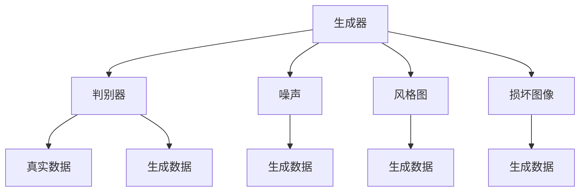
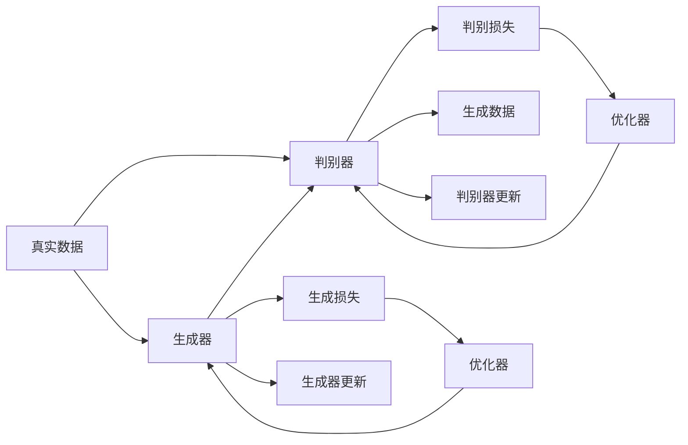
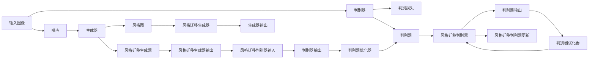
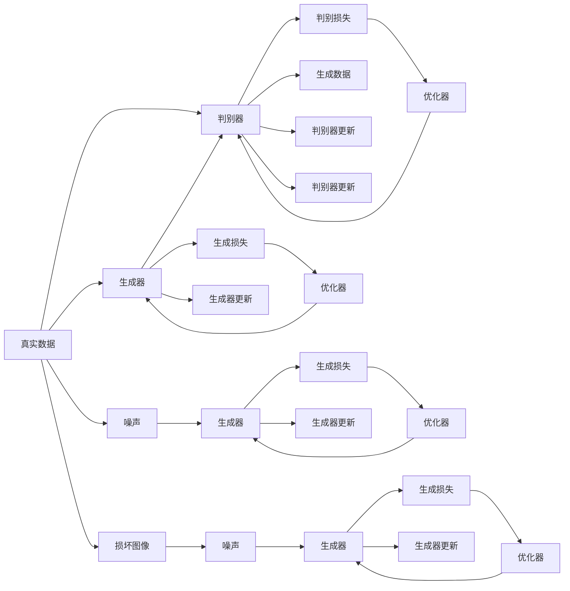

                 

# 一切皆是映射：GANs生成对抗网络的原理和应用

> 关键词：生成对抗网络(GANs)，对抗损失，风格迁移，图像生成，图像修复

## 1. 背景介绍

### 1.1 问题由来

生成对抗网络（GANs）作为深度学习领域的里程碑性工作，自2014年被提出以来，就以其独特的架构和强大的生成能力，引起了广泛的研究和应用关注。GANs的核心思想是利用两个深度神经网络（生成器和判别器）之间的对抗训练，学习数据分布，并产生高质量的生成样本。这一技术不仅在图像生成、视频生成等领域取得了巨大成功，还逐渐扩展到音乐、自然语言处理等各个领域。

尽管GANs在学术界和工业界都得到了广泛的应用，但其复杂性和技术门槛仍然较高。如何从零开始实现一个有效的GANs模型，以及如何利用其强大的生成能力进行具体应用，是很多开发者和研究者面临的挑战。本博客将深入浅出地介绍GANs的基本原理和应用方法，帮助读者系统理解这一深度学习的重要分支。

### 1.2 问题核心关键点

GANs的核心理论在于其独特的生成对抗机制，即两个深度神经网络——生成器和判别器——之间的零和游戏。生成器网络的目的是生成尽可能逼真的数据样本，而判别器网络的目的是区分生成的样本和真实样本。通过不断训练，两个网络相互博弈，生成器逐渐能够生成更加逼真的数据，判别器逐渐能够更准确地识别生成的样本。

GANs的应用领域非常广泛，包括但不限于：

- 图像生成：从噪声中生成高质量图像，如人脸、动物、风景等。
- 视频生成：从单个或多个图像序列生成连贯的视频帧。
- 风格迁移：将一张图像的风格应用到另一张图像上。
- 图像修复：从损坏或不完整的图像中恢复原始内容。
- 自然语言处理：生成文本、对话、机器翻译等。

本文将详细探讨GANs的原理、应用方法以及实际开发中的技巧，帮助读者从基础到应用全面掌握GANs技术。

### 1.3 问题研究意义

研究GANs技术，对于拓展深度学习的应用范围，推动生成模型的创新，具有重要意义：

1. 提升数据生成质量。GANs能够生成高质量、多样化的数据，弥补真实数据的不足，支持更加复杂的应用场景。
2. 促进跨领域融合。通过GANs，不同领域之间的数据可以更加无缝地进行融合和生成，如将图像风格应用于视频生成。
3. 加速应用开发。GANs使得生成数据的成本大幅降低，加速了应用模型的训练和优化。
4. 提供创新思路。GANs作为一种强大的生成技术，为许多创新应用提供了新的思路和方法，如实时视频生成。
5. 推动学术研究。GANs引发了对生成模型、对抗训练、跨领域数据融合等前沿问题的深入研究，推动了深度学习领域的发展。

## 2. 核心概念与联系

### 2.1 核心概念概述

为更好地理解GANs的核心原理，本节将介绍几个密切相关的核心概念：

- 生成对抗网络（GANs）：由生成器和判别器两个网络组成，通过对抗训练生成逼真的数据样本。
- 生成器（Generator）：目标是从随机噪声中生成高质量的数据样本，是一个从噪声到真实数据的映射过程。
- 判别器（Discriminator）：目标是将生成的数据样本和真实数据样本区分开来，是一个从数据到概率的映射过程。
- 对抗损失（Adversarial Loss）：是生成器和判别器之间的对抗训练目标，通过最小化判别器的损失，最大化生成器的损失，使得生成器能够生成更逼真的数据样本。
- 风格迁移（Style Transfer）：将一张图像的风格应用到另一张图像上，通过将生成器的输入图像和目标风格图拼接，训练生成器生成具有目标风格的新图像。
- 图像生成（Image Generation）：从随机噪声中生成逼真的图像，常用于合成数据、生成艺术作品等。
- 图像修复（Image Restoration）：从损坏或不完整的图像中恢复原始内容，常用于图像去噪、图像补全等。

这些核心概念之间的逻辑关系可以通过以下Mermaid流程图来展示：



这个流程图展示了大规模语言模型微调过程中各个核心概念之间的关系：

1. 生成器和判别器通过对抗训练提升生成质量。
2. 生成器从噪声或目标风格中生成数据。
3. 判别器区分真实和生成的数据。
4. 风格迁移通过将风格图与生成器的输入图像拼接实现。
5. 图像生成从噪声中生成高质量图像。
6. 图像修复从损坏图像中恢复原始内容。

### 2.2 概念间的关系

这些核心概念之间存在着紧密的联系，形成了GANs的核心框架。下面我们通过几个Mermaid流程图来展示这些概念之间的关系。

#### 2.2.1 生成对抗网络基本架构



这个流程图展示了GANs的基本架构和训练过程：

1. 真实数据输入判别器，计算判别损失。
2. 生成器从噪声中生成数据，输入判别器，计算判别损失。
3. 判别器优化器根据判别损失更新判别器。
4. 生成器优化器根据生成损失更新生成器。
5. 生成器和判别器不断博弈，生成质量逐步提升。

#### 2.2.2 风格迁移的具体实现



这个流程图展示了风格迁移的具体实现步骤：

1. 输入图像和风格图分别输入判别器，计算判别损失。
2. 生成器从噪声中生成数据，输入判别器，计算判别损失。
3. 判别器优化器根据判别损失更新判别器。
4. 风格迁移生成器通过将输入图像和风格图拼接，输出具有风格迁移效果的新图像。
5. 风格迁移判别器区分真实图像和风格迁移图像，计算判别损失。
6. 风格迁移判别器优化器根据判别损失更新判别器。
7. 风格迁移生成器不断优化，生成逼真的风格迁移图像。

### 2.3 核心概念的整体架构

最后，我们用一个综合的流程图来展示这些核心概念在大规模语言模型微调过程中的整体架构：



这个综合流程图展示了从真实数据到风格迁移生成器、从噪声到图像生成的完整过程。判别器和生成器不断博弈，生成器和噪声不断交互，最终生成高质量的逼真数据。

## 3. 核心算法原理 & 具体操作步骤
### 3.1 算法原理概述

GANs的核心思想是通过两个深度神经网络——生成器和判别器——之间的对抗训练，生成高质量的逼真数据。生成器的目标是生成尽可能逼真的数据，而判别器的目标是区分生成的数据和真实数据。

算法的基本流程如下：

1. 初始化生成器和判别器，将真实数据和噪声作为输入，计算判别器的损失。
2. 根据判别器的损失，更新判别器的权重。
3. 将真实数据和噪声作为输入，计算生成器的损失。
4. 根据生成器的损失，更新生成器的权重。
5. 重复步骤2和3，直到判别器和生成器达到收敛状态。

这种生成器和判别器的对抗训练，使得生成器不断生成更加逼真的数据，而判别器不断提升其区分能力，从而实现高质量的数据生成。

### 3.2 算法步骤详解

以下是对GANs算法步骤的详细讲解：

**Step 1: 准备数据集**

GANs的应用需要大量的数据集，包括真实数据和噪声数据。真实数据集可以是各种图像、视频、音频等，噪声数据一般由随机噪声生成器生成，如高斯噪声、均匀噪声等。

**Step 2: 设计生成器和判别器**

生成器和判别器是GANs的核心组件，需要根据具体应用场景设计。

生成器的输入通常是随机噪声，输出是逼真的数据样本。判别器的输入可以是真实数据或生成数据，输出是数据样本的概率分布，表示其真实性。

**Step 3: 定义损失函数**

GANs的损失函数包括判别器的损失和生成器的损失。

判别器的损失函数为：

$$
\mathcal{L}_D = -\mathbb{E}_{x \sim \mathcal{X}}[\log D(x)] - \mathbb{E}_{z \sim \mathcal{Z}}[\log(1 - D(G(z)))]
$$

其中，$x$为真实数据，$z$为噪声数据，$G$为生成器，$D$为判别器，$\mathcal{X}$为真实数据集，$\mathcal{Z}$为噪声数据集，$\mathbb{E}[\cdot]$表示期望值。

生成器的损失函数为：

$$
\mathcal{L}_G = -\mathbb{E}_{z \sim \mathcal{Z}}[\log D(G(z))]
$$

其中，$G$为生成器，$z$为噪声数据，$\mathcal{Z}$为噪声数据集，$\mathbb{E}[\cdot]$表示期望值。

**Step 4: 初始化模型参数**

初始化生成器和判别器的权重，并设置学习率、批大小等超参数。

**Step 5: 迭代训练**

在每个迭代周期中，先生成一批真实数据和噪声数据，然后计算判别器和生成器的损失，并更新其权重。具体步骤如下：

1. 固定判别器，优化生成器：先生成一批噪声数据，输入生成器，得到生成数据，输入判别器，计算判别器的损失，并更新判别器的权重。
2. 固定生成器，优化判别器：随机生成一批真实数据和噪声数据，输入判别器，计算判别器的损失，并更新判别器的权重。

重复上述步骤，直到达到预设的迭代次数或满足收敛条件。

### 3.3 算法优缺点

GANs算法具有以下优点：

1. 生成高质量的数据样本。通过对抗训练，生成器可以生成逼真的高质量数据。
2. 适用于多种数据类型。GANs可以用于图像、视频、音频等多种数据类型的生成。
3. 可解释性强。判别器的决策过程可以用于解释生成数据的质量。

同时，GANs算法也存在一些缺点：

1. 训练不稳定。GANs训练过程中容易发生模式崩溃、梯度消失等问题，导致训练不稳定。
2. 模型复杂度高。生成器和判别器的网络结构复杂，训练和推理速度较慢。
3. 数据需求大。需要大量的真实数据和噪声数据，数据生成和采集成本较高。
4. 生成器难以控制。生成器可能会生成不符合期望的数据，需要手动调整生成器的网络结构。

### 3.4 算法应用领域

GANs的应用领域非常广泛，以下是几个典型的应用场景：

- 图像生成：如从噪声中生成逼真的图片，生成各种风格的图片。
- 视频生成：如从单一图像生成连贯的视频帧，实现视频编辑和合成。
- 风格迁移：如将一张图像的风格应用到另一张图像上，实现艺术创作和图像编辑。
- 图像修复：如从损坏的图像中恢复原始内容，实现图像去噪和图像补全。
- 自然语言生成：如生成文本对话、自然语言摘要等。

GANs算法在游戏、影视、艺术创作、广告等行业中也有广泛应用，展示了其强大的生成能力。

## 4. 数学模型和公式 & 详细讲解  
### 4.1 数学模型构建

GANs的核心数学模型包括生成器和判别器的网络结构、损失函数和优化算法。

生成器的网络结构一般是一个多层感知器（MLP）或卷积神经网络（CNN），其输入为噪声数据，输出为逼真的数据样本。

判别器的网络结构也是一个多层感知器或卷积神经网络，其输入为真实数据或生成数据，输出为一个概率值，表示数据是真实数据的可能性。

生成器和判别器的损失函数如前所述，分别表示为：

$$
\mathcal{L}_D = -\mathbb{E}_{x \sim \mathcal{X}}[\log D(x)] - \mathbb{E}_{z \sim \mathcal{Z}}[\log(1 - D(G(z)))]
$$

$$
\mathcal{L}_G = -\mathbb{E}_{z \sim \mathcal{Z}}[\log D(G(z))]
$$

优化算法一般采用Adam或SGD等基于梯度的优化算法。

### 4.2 公式推导过程

以下是对GANs算法中损失函数和优化算法的详细推导：

**判别器损失函数推导**

判别器的目标是最小化判别真实数据和生成数据的能力，即最大化判别真实数据的概率，最小化判别生成数据的概率。

$$
\mathcal{L}_D = -\mathbb{E}_{x \sim \mathcal{X}}[\log D(x)] - \mathbb{E}_{z \sim \mathcal{Z}}[\log(1 - D(G(z)))]
$$

其中，$\mathbb{E}[\cdot]$表示期望值。

**生成器损失函数推导**

生成器的目标是最小化判别器错误识别生成的数据的能力，即最大化生成数据被误判为真实数据的概率。

$$
\mathcal{L}_G = -\mathbb{E}_{z \sim \mathcal{Z}}[\log D(G(z))]
$$

其中，$\mathbb{E}[\cdot]$表示期望值。

**优化算法推导**

优化算法一般采用Adam或SGD等基于梯度的优化算法。以Adam算法为例，其优化公式为：

$$
w_{t+1} = w_t - \alpha \frac{m_t}{\sqrt{v_t}+\epsilon}
$$

其中，$w$表示模型参数，$\alpha$表示学习率，$m$表示梯度的一阶动量，$v$表示梯度的二阶动量，$\epsilon$表示动量修正项。

### 4.3 案例分析与讲解

**图像生成案例**

假设我们要从噪声中生成逼真的图片，可以采用一个卷积神经网络作为生成器，其结构如下：

```
Dense(128) --> Conv2D(64, 3, stride=1) --> LeakyReLU
Conv2D(64, 3, stride=2) --> BatchNorm
Conv2D(128, 3, stride=1) --> LeakyReLU
Conv2D(256, 3, stride=2) --> BatchNorm
Conv2D(512, 3, stride=2) --> BatchNorm
Conv2D(256, 3, stride=1) --> LeakyReLU
Conv2D(128, 3, stride=1) --> LeakyReLU
```

其中，LeakyReLU和BatchNorm层用于激活和规范化，可以加速训练和提高生成质量。

判别器的结构可以采用一个多层感知器或卷积神经网络，其结构如下：

```
Dense(128) --> LeakyReLU
Conv2D(64, 3, stride=1) --> LeakyReLU
Conv2D(128, 3, stride=2) --> BatchNorm
Conv2D(256, 3, stride=2) --> BatchNorm
Conv2D(512, 3, stride=2) --> BatchNorm
Conv2D(256, 3, stride=1) --> LeakyReLU
Dense(1) --> Sigmoid
```

其中，Sigmoid层用于输出判别结果。

在训练过程中，先固定判别器，优化生成器，然后固定生成器，优化判别器，交替进行。最终得到的生成器可以生成高质量的逼真图片。

**风格迁移案例**

风格迁移是GANs的典型应用之一。假设有两张图片，一张为真实图片，一张为风格图片，我们的目标是将风格图片的风格应用到真实图片上。

可以采用以下步骤实现：

1. 将真实图片和风格图片拼接在一起，作为判别器的输入。
2. 使用一个卷积神经网络作为生成器，其结构如下：

```
Dense(128) --> Conv2D(64, 3, stride=1) --> LeakyReLU
Conv2D(64, 3, stride=2) --> BatchNorm
Conv2D(128, 3, stride=1) --> LeakyReLU
Conv2D(256, 3, stride=2) --> BatchNorm
Conv2D(512, 3, stride=2) --> BatchNorm
Conv2D(256, 3, stride=1) --> LeakyReLU
Conv2D(128, 3, stride=1) --> LeakyReLU
```

其中，LeakyReLU和BatchNorm层用于激活和规范化，可以加速训练和提高生成质量。

3. 使用一个卷积神经网络作为判别器，其结构如下：

```
Dense(128) --> LeakyReLU
Conv2D(64, 3, stride=1) --> LeakyReLU
Conv2D(128, 3, stride=2) --> BatchNorm
Conv2D(256, 3, stride=2) --> BatchNorm
Conv2D(512, 3, stride=2) --> BatchNorm
Conv2D(256, 3, stride=1) --> LeakyReLU
Dense(1) --> Sigmoid
```

其中，Sigmoid层用于输出判别结果。

4. 在训练过程中，先固定判别器，优化生成器，然后固定生成器，优化判别器，交替进行。最终得到的生成器可以生成具有目标风格的新图片。

## 5. 项目实践：代码实例和详细解释说明
### 5.1 开发环境搭建

在进行GANs项目实践前，我们需要准备好开发环境。以下是使用Python进行TensorFlow或PyTorch开发的环境配置流程：

1. 安装Anaconda：从官网下载并安装Anaconda，用于创建独立的Python环境。

2. 创建并激活虚拟环境：
```bash
conda create -n pytorch-env python=3.8 
conda activate pytorch-env
```

3. 安装TensorFlow或PyTorch：根据CUDA版本，从官网获取对应的安装命令。例如：
```bash
conda install tensorflow==2.5
```

4. 安装其他必要的库：
```bash
pip install numpy pandas matplotlib scikit-learn
```

完成上述步骤后，即可在`pytorch-env`环境中开始GANs的实践。

### 5.2 源代码详细实现

下面我们以图像生成为例，给出使用TensorFlow或PyTorch实现GANs的代码实现。

#### 使用TensorFlow实现

```python
import tensorflow as tf
from tensorflow.keras import layers

# 定义生成器网络
def make_generator_model():
    model = tf.keras.Sequential()
    model.add(layers.Dense(7*7*256, use_bias=False, input_shape=(100,)))
    model.add(layers.BatchNormalization())
    model.add(layers.LeakyReLU())
    model.add(layers.Reshape((7, 7, 256)))
    assert model.output_shape == (None, 7, 7, 256)  # Note: None is the batch dimension
    
    model.add(layers.Conv2DTranspose(128, (5, 5), strides=(1, 1), padding='same', use_bias=False))
    assert model.output_shape == (None, 7, 7, 128)
    model.add(layers.BatchNormalization())
    model.add(layers.LeakyReLU())
    
    model.add(layers.Conv2DTranspose(64, (5, 5), strides=(2, 2), padding='same', use_bias=False))
    assert model.output_shape == (None, 14, 14, 64)
    model.add(layers.BatchNormalization())
    model.add(layers.LeakyReLU())
    
    model.add(layers.Conv2DTranspose(1, (5, 5), strides=(2, 2), padding='same', use_bias=False, activation='tanh'))
    assert model.output_shape == (None, 28, 28, 1)
    
    return model

# 定义判别器网络
def make_discriminator_model():
    model = tf.keras.Sequential()
    model.add(layers.Conv2D(64, (5, 5), strides=(2, 2), padding='same', input_shape=[28, 28, 1]))
    model.add(layers.LeakyReLU())
    model.add(layers.Dropout(0.3))
    
    model.add(layers.Conv2D(128, (5, 5), strides=(2, 2), padding='same'))
    model.add(layers.LeakyReLU())
    model.add(layers.Dropout(0.3))
    
    model.add(layers.Flatten())
    model.add(layers.Dense(1))
    
    return model

# 定义GANs模型
def make_gan_model():
    generator = make_generator_model()
    discriminator = make_discriminator_model()
    
    discriminator.trainable = False
    
    model = tf.keras.Sequential()
    model.add(generator)
    model.add(discriminator)
    
    return model
```

#### 使用PyTorch实现

```python
import torch.nn as nn
import torch.nn.functional as F

# 定义生成器网络
class Generator(nn.Module):
    def __init__(self):
        super(Generator, self).__init__()
        self.main = nn.Sequential(
            nn.Linear(100, 256),
            nn.LeakyReLU(0.2, inplace=True),
            nn.BatchNorm1d(256),
            nn.Linear(256, 512),
            nn.LeakyReLU(0.2, inplace=True),
            nn.BatchNorm1d(512),
            nn.Linear(512, 1024),
            nn.LeakyReLU(0.2, inplace=True),
            nn.BatchNorm1d(1024),
            nn.Linear(1024, 784),
            nn.Tanh()
        )
    
    def forward(self, input):
        return self.main(input)

# 定义判别器网络
class Discriminator(nn.Module):
    def __init__(self):
        super(Discriminator, self).__init__()
        self.main = nn.Sequential(
            nn.Linear(784, 1024),
            nn.LeakyReLU(0.2, inplace=True),
            nn.Linear(1024, 512),
            nn.LeakyReLU(0.2, inplace=True),
            nn.Linear(512, 256),
            nn.LeakyReLU(0.2, inplace=True),
            nn.Linear(256, 1),
            nn.Sigmoid()
        )
    
    def forward(self, input):
        return self.main(input)

# 定义GANs模型
class GAN(nn.Module):
    def __init__(self, generator, discriminator):
        super(GAN, self).__init__()
        self.generator = generator
        self.discriminator = discriminator
        
    def forward(self, input):
        fake = self.generator(input)
        real = self.discriminator(fake)
        return real
```

### 5.3 代码解读与分析

让我们再详细解读一下关键代码的实现细节：

**TensorFlow实现**

1. `make_generator_model`函数定义了生成器的网络结构，包括输入、隐藏层和输出层，并返回一个`tf.keras.Sequential`模型。

