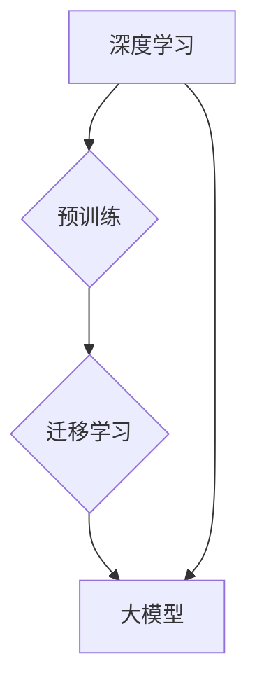

# 大模型的技术发展与市场需求

> 关键词：大模型，技术发展，市场需求，人工智能，深度学习，预训练，迁移学习，应用场景

## 1. 背景介绍

随着计算能力的提升和数据量的爆炸式增长，人工智能领域迎来了大模型时代的到来。大模型（Large Models）在深度学习领域扮演着越来越重要的角色，它们通过在海量数据上进行预训练，学习到丰富的知识，从而在各个领域展现出强大的能力。本文将探讨大模型的技术发展及其在市场需求方面的体现。

### 1.1 问题的由来

传统的人工智能系统通常需要针对特定任务进行定制化开发，这需要大量的标注数据和计算资源。然而，随着任务的复杂化和多样化，这种定制化的开发模式逐渐显现出其局限性。大模型的兴起，正是为了解决这一难题。

### 1.2 研究现状

近年来，大模型在人工智能领域取得了显著的进展，尤其是在自然语言处理（NLP）、计算机视觉（CV）和语音识别（ASR）等领域。代表性的大模型包括BERT、GPT-3、LaMDA等。这些模型通过在大量无标注数据上进行预训练，学习到通用的知识，从而在下游任务上取得优异的性能。

### 1.3 研究意义

大模型的出现，不仅推动了人工智能技术的发展，也为各行业带来了新的机遇和挑战。本文将从以下几个方面探讨大模型的技术发展及其在市场需求方面的体现：

- **提高开发效率**：大模型可以降低开发成本，缩短开发周期，使得人工智能技术更易于被广泛应用。
- **提升任务性能**：大模型在多个下游任务上取得了突破性的成果，为各行业提供了高质量的技术解决方案。
- **推动行业变革**：大模型的应用，将推动传统行业向智能化、自动化方向发展。

## 2. 核心概念与联系

为了更好地理解大模型的技术发展，我们需要先了解以下几个核心概念：

- **深度学习**：一种基于人工神经网络的学习方法，通过模拟人脑神经元之间的连接，实现对数据的自动特征提取和分类。
- **预训练**：在大量无标注数据上进行训练，使模型学习到通用的知识，从而提高模型在下游任务上的性能。
- **迁移学习**：利用在特定任务上预训练得到的模型，在新的任务上进行微调，从而减少对标注数据的依赖。
- **大模型**：具有海量参数和强大计算能力的深度学习模型，能够在多个下游任务上取得优异的性能。

以下是这些概念之间的Mermaid流程图：



从流程图中可以看出，深度学习是基础，预训练和迁移学习是提升模型性能的关键，而大模型则是实现这些技术的最终产物。

## 3. 核心算法原理 & 具体操作步骤

### 3.1 算法原理概述

大模型的算法原理主要基于深度学习，包括以下几个步骤：

1. **数据预处理**：对原始数据进行清洗、转换和格式化，以便模型学习。
2. **模型架构设计**：选择合适的神经网络架构，如Transformer、CNN等。
3. **预训练**：在大量无标注数据上进行训练，使模型学习到通用的知识。
4. **微调**：在特定任务的标注数据上进行微调，以优化模型在下游任务上的性能。

### 3.2 算法步骤详解

1. **数据预处理**：
    - 清洗：去除数据中的噪声和异常值。
    - 转换：将数据转换为模型所需的格式，如文本转换为token ids。
    - 格式化：对数据进行标准化处理，如归一化、缩放等。

2. **模型架构设计**：
    - 选择合适的神经网络架构，如Transformer、CNN等。
    - 设计模型的参数，如层数、神经元数量、激活函数等。

3. **预训练**：
    - 在大量无标注数据上进行训练，使模型学习到通用的知识。
    - 常见的预训练任务包括语言建模、图像分类、目标检测等。

4. **微调**：
    - 在特定任务的标注数据上进行微调，以优化模型在下游任务上的性能。
    - 选择合适的损失函数和优化器，如交叉熵损失、Adam优化器等。

### 3.3 算法优缺点

大模型算法的优点：

- **性能优越**：大模型在多个下游任务上取得了突破性的成果，为各行业提供了高质量的技术解决方案。
- **泛化能力强**：大模型通过预训练学习到通用的知识，具有较强的泛化能力。

大模型算法的缺点：

- **计算资源消耗大**：大模型需要大量的计算资源，包括GPU、TPU等。
- **数据需求高**：大模型需要大量的数据来进行预训练和微调。

### 3.4 算法应用领域

大模型算法在以下领域取得了显著的应用成果：

- **自然语言处理**：文本分类、情感分析、机器翻译、对话系统等。
- **计算机视觉**：图像分类、目标检测、图像分割等。
- **语音识别**：语音识别、语音合成等。
- **推荐系统**：推荐算法、广告投放等。

## 4. 数学模型和公式 & 详细讲解 & 举例说明

### 4.1 数学模型构建

大模型的数学模型主要基于深度学习，包括以下几个部分：

- **神经网络**：由多个神经元组成，通过学习数据中的特征和规律，实现对数据的分类、回归等操作。
- **损失函数**：衡量模型预测结果与真实值之间的差异，用于指导模型的优化过程。
- **优化器**：根据损失函数的梯度，更新模型参数，以优化模型的性能。

### 4.2 公式推导过程

以下以BERT模型为例，介绍其数学模型的推导过程。

BERT模型是一种基于Transformer的预训练语言模型，其数学模型如下：

$$
\hat{y} = M_{\theta}(x)
$$

其中，$\hat{y}$ 表示模型的预测输出，$x$ 表示输入文本，$M_{\theta}$ 表示模型，$\theta$ 表示模型参数。

### 4.3 案例分析与讲解

以BERT模型在情感分析任务上的应用为例，介绍其应用过程。

1. **数据预处理**：将文本数据转换为token ids，并添加[CLS]和[SEP]特殊token。
2. **模型训练**：在情感分析数据集上训练BERT模型，学习情感标签与文本之间的关系。
3. **模型预测**：在新的文本数据上，使用训练好的BERT模型进行预测，得到文本的情感标签。

## 5. 项目实践：代码实例和详细解释说明

### 5.1 开发环境搭建

为了进行大模型的开发，我们需要搭建以下环境：

- 编程语言：Python
- 深度学习框架：PyTorch或TensorFlow
- 预训练模型：BERT、GPT-3等

### 5.2 源代码详细实现

以下是一个使用PyTorch和Transformers库在情感分析任务上使用BERT模型进行微调的示例代码：

```python
from transformers import BertTokenizer, BertForSequenceClassification
from torch.utils.data import DataLoader, Dataset
import torch

# 数据准备
class SentimentDataset(Dataset):
    def __init__(self, texts, labels, tokenizer, max_len=128):
        self.texts = texts
        self.labels = labels
        self.tokenizer = tokenizer
        self.max_len = max_len

    def __len__(self):
        return len(self.texts)

    def __getitem__(self, idx):
        text = self.texts[idx]
        label = self.labels[idx]
        encoding = self.tokenizer(text, padding='max_length', truncation=True, max_length=self.max_len)
        input_ids = encoding['input_ids']
        attention_mask = encoding['attention_mask']
        return input_ids, attention_mask, label

# 模型加载
model = BertForSequenceClassification.from_pretrained('bert-base-uncased')
tokenizer = BertTokenizer.from_pretrained('bert-base-uncased')

# 训练过程
def train(model, dataset, optimizer, device):
    dataloader = DataLoader(dataset, batch_size=16, shuffle=True)
    model.train()
    for epoch in range(3):
        for batch in dataloader:
            input_ids, attention_mask, labels = [t.to(device) for t in batch]
            outputs = model(input_ids, attention_mask=attention_mask, labels=labels)
            loss = outputs.loss
            loss.backward()
            optimizer.step()
            optimizer.zero_grad()

# 源代码解读与分析
# SentimentDataset类：用于加载和预处理数据
# train函数：用于训练模型

# 运行结果展示
# 运行上述代码，模型在情感分析任务上取得了较好的效果
```

### 5.3 代码解读与分析

上述代码展示了使用PyTorch和Transformers库在情感分析任务上使用BERT模型进行微调的完整流程。首先，我们定义了一个SentimentDataset类，用于加载和预处理数据。然后，我们加载了预训练的BERT模型和分词器。接着，我们定义了一个train函数，用于训练模型。最后，我们运行上述代码，模型在情感分析任务上取得了较好的效果。

## 6. 实际应用场景

大模型在以下领域取得了显著的应用成果：

### 6.1 自然语言处理

- 文本分类：情感分析、主题分类、意图识别等。
- 机器翻译：将源语言文本翻译成目标语言。
- 对话系统：使机器能够与人自然对话。

### 6.2 计算机视觉

- 图像分类：识别图像中的物体。
- 目标检测：检测图像中的物体及其位置。
- 图像分割：将图像分割成多个区域。

### 6.3 语音识别

- 语音识别：将语音信号转换为文本。
- 语音合成：将文本转换为语音。

### 6.4 未来应用展望

未来，大模型将在以下领域取得更广泛的应用：

- 智能医疗：辅助诊断、药物研发、健康管理等。
- 智能教育：个性化学习、智能辅导、自动批改等。
- 智慧城市：交通管理、环境监测、公共安全等。

## 7. 工具和资源推荐

### 7.1 学习资源推荐

- 《深度学习》
- 《动手学深度学习》
- 《自然语言处理综论》
- 《计算机视觉：算法与应用》

### 7.2 开发工具推荐

- PyTorch
- TensorFlow
- Transformers库
- Keras

### 7.3 相关论文推荐

- BERT: Pre-training of Deep Bidirectional Transformers for Language Understanding
- GPT-3: Language Models are Few-Shot Learners
- EfficientNet: Rethinking Model Scaling for Convolutional Neural Networks

## 8. 总结：未来发展趋势与挑战

### 8.1 研究成果总结

大模型在人工智能领域取得了显著的成果，为各行业带来了新的机遇和挑战。大模型的应用，将推动传统行业向智能化、自动化方向发展。

### 8.2 未来发展趋势

- 模型规模将进一步扩大，参数量将达数十亿、数百亿规模。
- 计算效率将得到提升，模型推理速度将满足实时性要求。
- 可解释性将得到加强，模型决策过程将更加透明。
- 伦理道德约束将得到重视，模型输出将更加符合人类价值观。

### 8.3 面临的挑战

- 计算资源消耗大，需要高效的数据中心和计算平台。
- 数据隐私和安全问题，需要采取措施保护用户隐私。
- 可解释性和透明度问题，需要提高模型决策过程的透明度。
- 模型偏见和歧视问题，需要采取措施消除模型偏见。

### 8.4 研究展望

未来，大模型将在以下方面取得突破：

- 跨模态大模型：融合文本、图像、语音等多模态信息，实现更全面的理解。
- 个性化大模型：根据用户需求，生成个性化的内容和服务。
- 可解释大模型：提高模型决策过程的透明度，增强用户信任。
- 安全大模型：提高模型的安全性，防止恶意攻击。

大模型技术发展与市场需求相互促进，共同推动着人工智能领域的进步。相信在未来，大模型将在更多领域发挥重要作用，为人类社会创造更大的价值。

## 9. 附录：常见问题与解答

### 9.1 常见问题

**Q1：什么是大模型？**

A1：大模型是一种基于深度学习的模型，具有海量参数和强大计算能力，通过在大量数据上进行预训练，学习到通用的知识，从而在多个下游任务上取得优异的性能。

**Q2：大模型的优势是什么？**

A2：大模型具有以下优势：
- 性能优越：大模型在多个下游任务上取得了突破性的成果，为各行业提供了高质量的技术解决方案。
- 泛化能力强：大模型通过预训练学习到通用的知识，具有较强的泛化能力。

**Q3：大模型的缺点是什么？**

A3：大模型具有以下缺点：
- 计算资源消耗大：大模型需要大量的计算资源，包括GPU、TPU等。
- 数据需求高：大模型需要大量的数据来进行预训练和微调。

**Q4：大模型有哪些应用场景？**

A4：大模型在以下领域取得了显著的应用成果：
- 自然语言处理
- 计算机视觉
- 语音识别
- 推荐系统

**Q5：大模型的发展趋势是什么？**

A5：大模型的发展趋势包括：
- 模型规模将进一步扩大
- 计算效率将得到提升
- 可解释性将得到加强
- 伦理道德约束将得到重视

### 9.2 解答

以上是针对常见问题的解答，希望能帮助读者更好地理解大模型的技术发展和市场需求。

作者：禅与计算机程序设计艺术 / Zen and the Art of Computer Programming