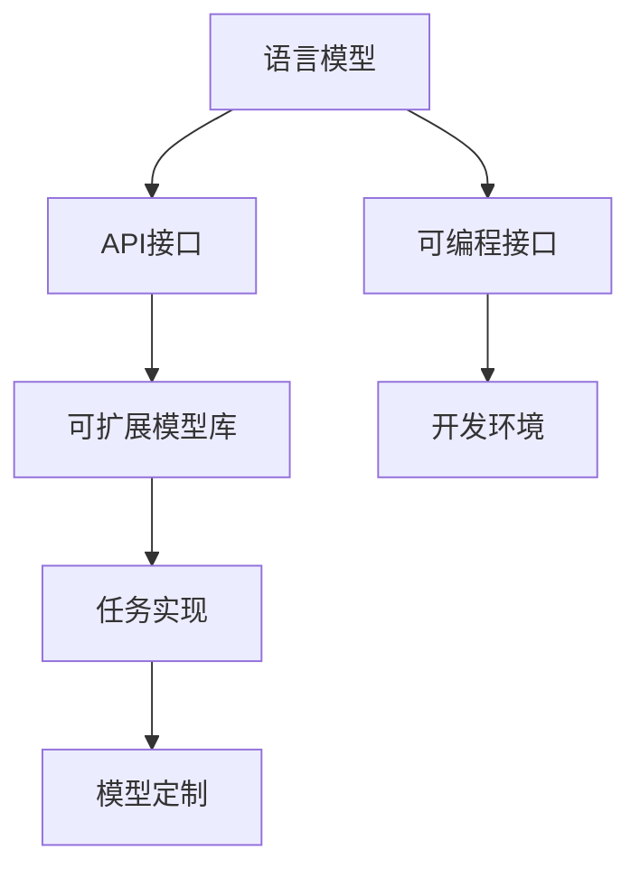

                 

# 【LangChain编程：从入门到实践】应用部署

## 1. 背景介绍

### 1.1 问题由来
近年来，随着人工智能技术的快速发展和深度学习的广泛应用，自然语言处理(NLP)领域的任务，如问答、对话生成、文本摘要等，得到了长足的进步。其中，基于语言模型的技术，如基于Transformer的BERT、GPT系列等，已经成为NLP任务的强大工具。然而，这些模型通常需要在大规模语料上进行预训练，并且部署和使用需要一定的技术和资源门槛。因此，如何更简单高效地部署和使用这些模型，是广大开发者和用户共同关心的问题。

### 1.2 问题核心关键点
为了更好地部署和使用这些语言模型，提出了LangChain编程的概念。LangChain是一种基于语言的编程方式，旨在通过语言模型来自动化、可编程的实现NLP任务，减少对编程语言和复杂算法的依赖，使NLP任务的开发更加简单、高效。

LangChain编程的核心关键点包括：
1. **可编程语言模型的接口**：定义了一套通用的API，使得开发者可以通过语言模型来编程实现各种NLP任务。
2. **可扩展的模型库**：集成了多种流行的语言模型，支持不同的任务类型。
3. **易于使用的开发环境**：提供了集成的开发环境，方便开发者进行任务开发和调试。

### 1.3 问题研究意义
LangChain编程对于加速NLP技术的落地应用具有重要意义：
1. **降低开发门槛**：通过简化编程接口，使NLP任务开发更加容易上手，降低对编程语言的依赖。
2. **提高任务开发效率**：利用语言模型的自动化能力，快速实现复杂的NLP任务，减少手工编写代码的时间。
3. **支持模型定制**：开发者可以根据具体需求，使用语言模型进行定制，满足不同场景的需求。
4. **促进社区发展**：通过统一API标准，促进开源社区的活跃，加速技术进步和应用推广。

## 2. 核心概念与联系

### 2.1 核心概念概述

LangChain编程的核心概念包括：
1. **语言模型**：预训练好的大模型，如BERT、GPT-3等，用于进行NLP任务的计算和推理。
2. **API接口**：定义了一套标准化的API，用于与语言模型交互，实现各种NLP任务。
3. **可编程接口**：利用API接口，通过编程语言实现NLP任务，支持自定义逻辑和模型。
4. **模型库**：集成了多种流行的语言模型，支持不同的NLP任务。
5. **开发环境**：提供集成的开发环境，方便开发者进行任务开发和调试。

这些概念之间的联系可以通过以下Mermaid流程图来展示：



这个流程图展示了LangChain编程的主要组成部分和它们之间的联系：
1. 语言模型作为基础计算工具。
2. API接口用于与模型交互，实现任务。
3. 可编程接口提供编程语言的支持，支持自定义逻辑。
4. 模型库提供多样化的模型选择，满足不同任务需求。
5. 开发环境提供集成的开发工具，方便开发者使用。

### 2.2 概念间的关系

这些核心概念之间存在紧密的联系，构成了LangChain编程的基础架构。下面是几个重要的关系：
1. **语言模型与API接口**：API接口是语言模型的编程接口，使得开发者可以通过编程语言与模型交互，实现NLP任务。
2. **API接口与可编程接口**：可编程接口提供编程语言的支持，通过API接口实现各种NLP任务。
3. **可编程接口与模型库**：模型库提供多样化的模型选择，支持可编程接口中的自定义逻辑。
4. **模型库与开发环境**：开发环境提供集成的工具，方便开发者使用模型库中的模型，实现NLP任务。

## 3. 核心算法原理 & 具体操作步骤
### 3.1 算法原理概述

LangChain编程的算法原理基于语言模型的预训练和微调，通过API接口与模型交互，实现NLP任务的自动化和编程化。其核心思想是通过语言模型的自动推理，完成各种NLP任务的计算和推理，减少手工编程的工作量。

具体来说，LangChain编程的过程如下：
1. **预训练语言模型的选择**：根据任务的性质和数据特点，选择合适的语言模型。
2. **API接口的定义**：定义一套标准化的API，用于与语言模型交互，实现各种NLP任务。
3. **可编程接口的实现**：利用API接口，通过编程语言实现NLP任务，支持自定义逻辑和模型。
4. **模型库的选择和使用**：从模型库中选择合适的模型，进行任务的实现和调试。
5. **开发环境的配置**：配置开发环境，提供集成的工具，方便开发者进行任务开发和调试。

### 3.2 算法步骤详解

LangChain编程的步骤如下：
1. **环境搭建**：搭建开发环境，安装必要的工具和库，如Python、Pip、Jupyter Notebook等。
2. **模型选择**：根据任务需求选择合适的语言模型，如BERT、GPT-3等。
3. **API接口定义**：定义一套标准化的API接口，用于与语言模型交互，实现NLP任务。
4. **编程实现**：利用API接口，通过编程语言实现NLP任务，支持自定义逻辑和模型。
5. **模型调试和优化**：使用开发环境提供的工具，调试和优化模型，提高模型的性能和鲁棒性。
6. **模型部署**：将优化后的模型部署到生产环境，实现NLP任务的应用。

### 3.3 算法优缺点

LangChain编程的优点包括：
1. **降低开发门槛**：通过简化编程接口，使NLP任务开发更加容易上手，降低对编程语言的依赖。
2. **提高任务开发效率**：利用语言模型的自动化能力，快速实现复杂的NLP任务，减少手工编写代码的时间。
3. **支持模型定制**：开发者可以根据具体需求，使用语言模型进行定制，满足不同场景的需求。
4. **易于使用和调试**：开发环境提供集成的工具，方便开发者进行任务开发和调试。

其缺点包括：
1. **对模型依赖较大**：模型的性能和鲁棒性直接影响任务的实现效果。
2. **API接口设计复杂**：需要定义一套标准化的API接口，设计复杂。
3. **编程语言限制**：目前仅支持Python编程语言，限制了编程方式的多样性。

### 3.4 算法应用领域

LangChain编程主要应用于以下几个领域：
1. **问答系统**：利用语言模型实现问答系统，支持自动回答用户问题。
2. **对话系统**：利用语言模型实现对话系统，支持自动对话生成和回复。
3. **文本摘要**：利用语言模型实现文本摘要，自动提取文本的关键信息。
4. **情感分析**：利用语言模型实现情感分析，自动判断文本的情感倾向。
5. **机器翻译**：利用语言模型实现机器翻译，支持不同语言之间的自动翻译。

## 4. 数学模型和公式 & 详细讲解 & 举例说明

### 4.1 数学模型构建

LangChain编程的数学模型构建基于语言模型的预训练和微调，通过API接口与模型交互，实现NLP任务的计算和推理。其核心思想是通过语言模型的自动推理，完成各种NLP任务的计算和推理，减少手工编程的工作量。

设预训练语言模型为 $M_{\theta}$，其中 $\theta$ 为预训练得到的模型参数。设任务数据集为 $D=\{(x_i,y_i)\}_{i=1}^N$，其中 $x_i$ 为输入文本，$y_i$ 为任务标签。微调的目标是找到最优参数 $\hat{\theta}$，使得模型在任务数据集上的损失函数最小化：

$$
\hat{\theta}=\mathop{\arg\min}_{\theta} \mathcal{L}(M_{\theta},D)
$$

其中 $\mathcal{L}$ 为任务相关的损失函数，用于衡量模型输出与真实标签之间的差异。

### 4.2 公式推导过程

以问答系统为例，假设预训练语言模型为 $M_{\theta}$，任务为根据问题 $q$ 回答 $n$ 个候选答案 $a_1,a_2,\cdots,a_n$ 中的一个是 $a$。通过API接口将问题 $q$ 输入模型，得到模型输出 $o$，然后计算候选答案的概率分布 $p(a|o)$，选取概率最大的答案作为模型的回答：

$$
\hat{a}=\mathop{\arg\max}_{a} p(a|o)
$$

其中 $p(a|o)$ 为模型输出 $o$ 在候选答案 $a$ 上的概率分布，可以通过softmax函数计算：

$$
p(a|o)=\frac{\exp(o^\top w_a)}{\sum_{j=1}^n \exp(o^\top w_j)}
$$

其中 $w_a$ 为候选答案 $a$ 对应的向量表示，可以通过预训练语言模型得到。

### 4.3 案例分析与讲解

以下是一个简单的例子，展示如何使用LangChain编程实现情感分析任务：

```python
import langchain as lc

# 定义情感分析模型
model = lc.TextModel.from_pretrained('clue-sentiment')

# 输入文本
text = '这是一篇非常棒的文章，我喜欢它。'

# 进行情感分析
result = model(text)

# 输出情感倾向
print(result)
```

在这个例子中，我们首先定义了一个情感分析模型，然后输入一段文本，模型会自动进行情感分析，并输出情感倾向（如正面、负面、中性等）。

## 5. 项目实践：代码实例和详细解释说明

### 5.1 开发环境搭建

搭建LangChain编程的开发环境，需要以下步骤：
1. **安装Python**：在开发机上安装Python 3.x版本，确保版本稳定。
2. **安装Pip**：安装Pip工具，用于安装和管理第三方库。
3. **安装LangChain**：使用Pip安装LangChain库，如 `pip install langchain`。
4. **配置开发环境**：配置Jupyter Notebook等开发工具，方便开发者进行任务开发和调试。

### 5.2 源代码详细实现

以下是一个简单的例子，展示如何使用LangChain编程实现对话系统：

```python
import langchain as lc

# 定义对话模型
model = lc.DialoGPT.from_pretrained('microsoft/DialoGPT-medium')

# 输入对话历史
input_text = '你好，能帮我查一下天气吗？'

# 进行对话生成
response = model(input_text)

# 输出回复
print(response)
```

在这个例子中，我们首先定义了一个对话模型，然后输入一段对话历史，模型会自动生成一个回复。

### 5.3 代码解读与分析

 LangChain编程的代码实现相对简单，主要通过API接口与语言模型交互，实现各种NLP任务。具体来说，LangChain编程的代码实现包括以下几个关键步骤：
1. **环境搭建**：安装Python、Pip、LangChain等必要的工具和库。
2. **模型选择**：根据任务需求选择合适的语言模型，如BERT、GPT-3等。
3. **API接口定义**：定义一套标准化的API接口，用于与语言模型交互，实现NLP任务。
4. **编程实现**：利用API接口，通过编程语言实现NLP任务，支持自定义逻辑和模型。
5. **模型调试和优化**：使用开发环境提供的工具，调试和优化模型，提高模型的性能和鲁棒性。
6. **模型部署**：将优化后的模型部署到生产环境，实现NLP任务的应用。

## 6. 实际应用场景

### 6.1 智能客服系统

基于LangChain编程的智能客服系统可以通过语言模型实现自动回答用户问题，提高客服效率和质量。具体来说，智能客服系统可以集成多个人工智能助手，通过API接口与语言模型交互，实现自动回答和任务分配。

### 6.2 金融舆情监测

金融舆情监测可以通过LangChain编程的情感分析模型，自动监测市场舆情，及时发现异常情况，提供决策支持。具体来说，舆情监测系统可以集成情感分析模型，对金融新闻、评论等文本进行情感分析，实时监测市场情绪变化。

### 6.3 个性化推荐系统

基于LangChain编程的个性化推荐系统可以通过语言模型实现用户兴趣分析，提供个性化推荐。具体来说，推荐系统可以集成语言模型，对用户浏览、点击、评论等行为数据进行分析和建模，提供个性化的推荐内容。

### 6.4 未来应用展望

随着LangChain编程的不断发展和完善，其应用场景将更加广泛，带来更多的变革性影响：
1. **智能交互**：通过语言模型实现自动回答和任务分配，提高人机交互的效率和质量。
2. **情感分析**：通过情感分析模型自动监测市场舆情，提供决策支持。
3. **个性化推荐**：通过语言模型实现用户兴趣分析，提供个性化的推荐内容。
4. **知识图谱构建**：通过语言模型实现知识图谱构建，提供知识检索和推荐服务。
5. **自动摘要**：通过语言模型实现文本摘要，自动提取文本的关键信息。

## 7. 工具和资源推荐

### 7.1 学习资源推荐

为了帮助开发者系统掌握LangChain编程的技术基础和实践技巧，这里推荐一些优质的学习资源：
1. **LangChain官方文档**：提供了完整的API接口和示例代码，是上手实践的必备资料。
2. **NLP领域的学术论文**：阅读最新的NLP领域的学术论文，了解前沿技术和研究方向。
3. **在线课程和讲座**：参加NLP领域的在线课程和讲座，系统学习NLP技术和工具。
4. **开源社区**：参与开源社区的讨论和开发，学习他人的经验和实践。

### 7.2 开发工具推荐

高效的工具支持是LangChain编程成功的关键。以下是几款用于LangChain编程开发的常用工具：
1. **Python**：作为主流的编程语言，Python提供了丰富的开发环境和库，如Jupyter Notebook、Pip、Vim等。
2. **Jupyter Notebook**：集成了代码、数据、文档等多种资源，方便开发者进行任务开发和调试。
3. **TensorBoard**：用于可视化模型的训练过程和结果，方便调试和优化模型。
4. **GitHub**：提供代码托管和版本控制服务，方便开发者进行协作开发和版本管理。

### 7.3 相关论文推荐

LangChain编程的发展得益于学术界的持续研究。以下是几篇奠基性的相关论文，推荐阅读：
1. **Transformer架构**：提出的Transformer结构，开启了NLP领域的预训练大模型时代。
2. **BERT模型**：提出BERT模型，引入基于掩码的自监督预训练任务，刷新了多项NLP任务SOTA。
3. **DialoGPT模型**：提出DialoGPT模型，用于对话生成任务，具有较强的回复生成能力。
4. **Prompt Engineering**：研究提示学习的方法，通过精巧的输入格式设计，提高模型的少样本学习和自监督学习效果。

这些论文代表了大语言模型微调技术的发展脉络。通过学习这些前沿成果，可以帮助研究者把握学科前进方向，激发更多的创新灵感。

## 8. 总结：未来发展趋势与挑战

### 8.1 研究成果总结

LangChain编程通过简化编程接口和利用语言模型的自动化能力，使得NLP任务的开发更加简单、高效。目前已经在大规模的实际应用中取得了显著的效果，如智能客服、金融舆情监测、个性化推荐等。

### 8.2 未来发展趋势

未来，LangChain编程将继续发展，呈现以下几个趋势：
1. **多模态融合**：将视觉、语音等多模态信息与文本信息结合，实现更全面的智能交互。
2. **零样本学习**：利用语言模型的零样本学习能力，在不提供标注样本的情况下，实现快速的NLP任务开发。
3. **持续学习**：通过持续学习，使语言模型能够适应新数据和新任务，保持模型的时效性和适应性。
4. **可解释性**：提高模型的可解释性，帮助用户理解模型的决策过程，提升模型的信任度和可靠性。

### 8.3 面临的挑战

尽管LangChain编程已经取得了一定的进展，但在其应用过程中也面临一些挑战：
1. **模型鲁棒性**：在实际应用中，模型的鲁棒性是一个重要问题，需要进一步提高模型的泛化能力和鲁棒性。
2. **数据隐私**：在应用过程中，如何保护用户隐私，避免数据泄露和滥用，是一个亟待解决的问题。
3. **可扩展性**：随着应用场景的不断扩展，如何设计可扩展的API接口和模型库，满足不同的需求，是一个重要的研究方向。

### 8.4 研究展望

针对上述挑战，未来的研究需要从以下几个方面进行突破：
1. **鲁棒性提升**：通过引入更多的正则化技术和对抗训练方法，提高模型的泛化能力和鲁棒性。
2. **隐私保护**：通过数据加密和匿名化等方法，保护用户隐私，避免数据泄露和滥用。
3. **API设计**：设计更加灵活、可扩展的API接口，满足不同场景和任务的需求。

总之，LangChain编程技术在NLP领域具有广阔的应用前景，未来将随着研究的不断深入和技术的不断进步，进一步推动NLP技术的落地应用。

## 9. 附录：常见问题与解答

**Q1：LangChain编程是否适用于所有NLP任务？**

A: LangChain编程适用于大多数NLP任务，特别是对于数据量较小的任务。但对于一些特定领域的任务，如医学、法律等，仅仅依靠通用语料预训练的模型可能难以很好地适应。此时需要在特定领域语料上进一步预训练，再进行微调，才能获得理想效果。

**Q2：如何选择合适的语言模型？**

A: 选择合适的语言模型需要考虑任务性质和数据特点。一般而言，对于一般的NLP任务，如问答、对话生成、文本分类等，可以选择BERT、GPT-3等常用的模型。对于特定的任务，如机器翻译、摘要、情感分析等，可以选择相应的专用模型。

**Q3：在使用LangChain编程时，如何处理低资源环境？**

A: 在低资源环境下，可以使用轻量级的语言模型，如DistilBERT等。同时，可以通过微调、知识蒸馏等方法，将大模型压缩成轻量级模型，提高计算效率和资源利用率。

**Q4：在开发过程中，如何评估模型的性能？**

A: 评估模型的性能需要选择合适的指标，如准确率、F1分数、BLEU分数等。在实际应用中，可以通过A/B测试、用户反馈等方法，评估模型的实际效果。

**Q5：在开发过程中，如何提高模型的可解释性？**

A: 提高模型的可解释性可以通过可视化工具，如TensorBoard、Visdom等，展示模型的推理过程和关键特征。同时，可以使用可解释性模型，如LIME、SHAP等，解释模型的决策过程。

---

作者：禅与计算机程序设计艺术 / Zen and the Art of Computer Programming

