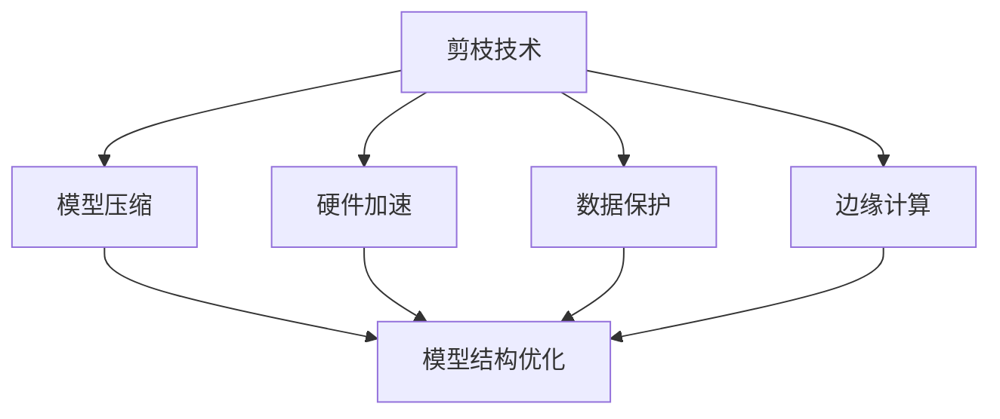
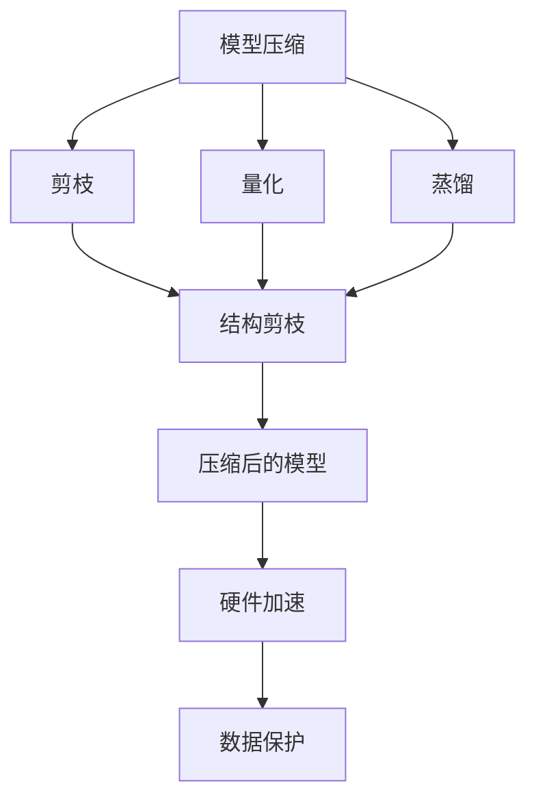
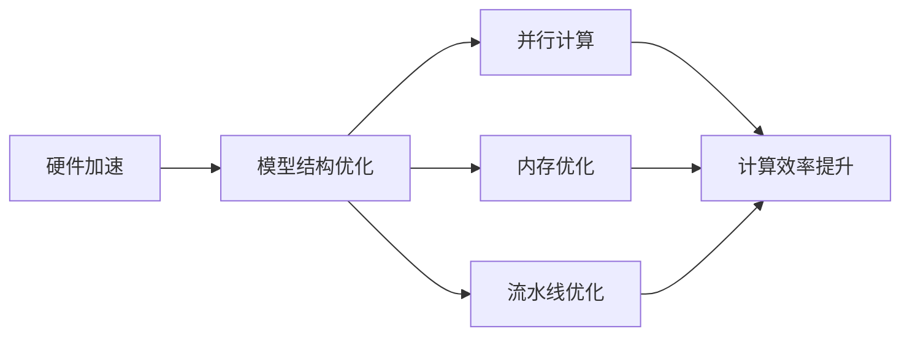
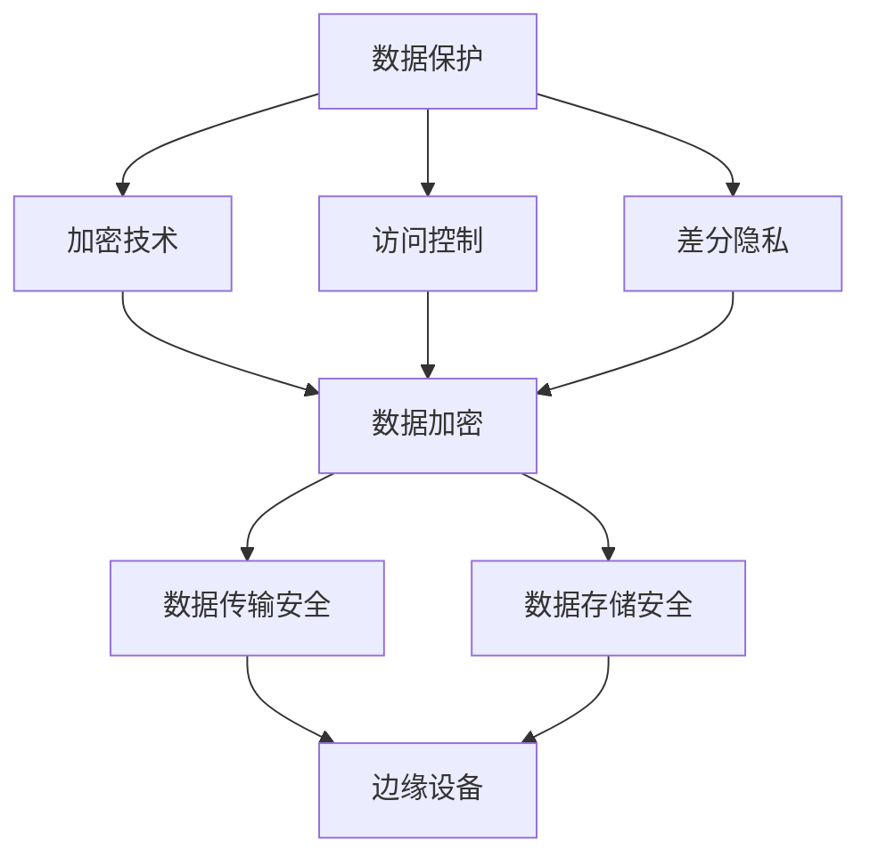
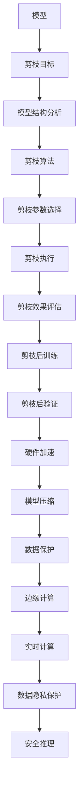

                 

# 剪枝技术在边缘计算安全中的角色

> 关键词：剪枝技术,边缘计算,安全,模型压缩,硬件加速,数据保护

## 1. 背景介绍

### 1.1 问题由来
随着物联网设备的普及和智能化发展，边缘计算（Edge Computing）成为了一种重要的计算模式。边缘计算将数据处理和计算任务从中心云服务器移至靠近数据源的设备上，从而减少数据传输的延迟，提升响应速度和安全性。然而，边缘计算设备由于资源受限，对计算任务的要求往往非常严格，如何在资源有限的设备上进行高效的计算，成为了一个亟待解决的问题。

### 1.2 问题核心关键点
为了在资源有限的边缘设备上进行高效的计算，研究人员提出了模型剪枝（Model Pruning）技术，这是一种通过移除模型中不必要的参数和连接，以减少模型复杂度和计算资源需求的方法。剪枝技术通过优化模型结构，使其在保留关键信息的同时，大幅度降低计算复杂度和内存占用，从而提升边缘计算的效率和安全性。

### 1.3 问题研究意义
研究剪枝技术在边缘计算中的应用，对于拓展边缘计算的计算能力，提升边缘计算任务的安全性，以及推动边缘计算的普及和应用，具有重要意义：

1. 提升计算效率。通过剪枝技术，可以显著减少边缘设备上的计算资源需求，使其能够处理更复杂的任务。
2. 降低能耗和硬件成本。剪枝后的模型通常更加轻量化，能够有效降低设备的能耗和硬件成本。
3. 增强数据隐私和安全。剪枝技术可以降低模型中的敏感信息泄露风险，提高数据隐私和安全。
4. 支持实时计算。剪枝后的模型更加轻量化，能够实时进行推理和计算，满足边缘计算的实时性需求。
5. 增强计算鲁棒性。剪枝后的模型在面对资源有限和环境不确定性时，通常具有更好的计算鲁棒性。

## 2. 核心概念与联系

### 2.1 核心概念概述

为更好地理解剪枝技术在边缘计算中的应用，本节将介绍几个密切相关的核心概念：

- 剪枝技术：指通过移除模型中不必要的参数和连接，以减少模型复杂度和计算资源需求的技术。
- 模型压缩：指通过剪枝、量化、蒸馏等方法，对模型进行压缩，以降低模型大小和计算开销的技术。
- 硬件加速：指通过优化模型结构，使其能够更好地适应特定硬件环境，以提升计算效率的技术。
- 数据保护：指通过加密、访问控制等手段，保护数据隐私和安全的技术。
- 边缘计算：指将数据处理和计算任务移至靠近数据源的设备上，以减少数据传输延迟和提升响应速度的计算模式。

这些核心概念之间的逻辑关系可以通过以下Mermaid流程图来展示：



这个流程图展示了一些核心概念及其之间的关系：

1. 剪枝技术通过优化模型结构，达到模型压缩的目的，使得模型能够适应边缘计算硬件环境。
2. 硬件加速通过改进模型结构和算法，使得模型能够高效运行在边缘设备上。
3. 数据保护通过加密和访问控制等手段，确保数据在传输和存储过程中的安全性。
4. 边缘计算依赖模型压缩和硬件加速等技术，确保能够在资源受限的设备上进行高效的计算和处理。

### 2.2 概念间的关系

这些核心概念之间存在着紧密的联系，形成了剪枝技术在边缘计算中的完整生态系统。下面我通过几个Mermaid流程图来展示这些概念之间的关系。

#### 2.2.1 剪枝技术的基本流程


这个流程图展示了剪枝技术的基本流程：
1. 确定剪枝目标。
2. 对模型结构进行分析，选择剪枝算法。
3. 设置剪枝参数，执行剪枝操作。
4. 评估剪枝效果，选择剪枝后的参数进行训练。
5. 在验证集上评估剪枝后的模型性能，确认是否剪枝成功。

#### 2.2.2 模型压缩的多种技术



这个流程图展示了模型压缩的多种技术：
1. 剪枝是模型压缩的一种方法，通过移除模型中不必要的参数和连接来减少计算资源需求。
2. 量化是将浮点数的参数转换为定点数，从而减少存储和计算开销。
3. 蒸馏是使用较小的模型预测大模型，以降低计算和存储开销。
4. 结构剪枝是指对模型结构进行优化，减少计算复杂度。
5. 压缩后的模型可以更好地适应硬件环境，并提高数据保护效果。

#### 2.2.3 硬件加速的优化策略



这个流程图展示了硬件加速的优化策略：
1. 通过优化模型结构和算法，使其适应硬件环境。
2. 使用并行计算技术，提高计算效率。
3. 优化内存使用，减少计算延迟。
4. 采用流水线优化，提升计算吞吐量。

#### 2.2.4 数据保护的多种手段



这个流程图展示了数据保护的多种手段：
1. 加密技术通过将数据加密保护，防止数据泄露。
2. 访问控制通过限制数据访问权限，保护数据隐私。
3. 差分隐私通过添加噪声，保护数据隐私。
4. 数据加密和访问控制在数据传输和存储过程中确保数据的安全性。

### 2.3 核心概念的整体架构

最后，我们用一个综合的流程图来展示这些核心概念在剪枝技术在边缘计算中的整体架构：



这个综合流程图展示了从模型加载到剪枝执行，再到实时推理的完整过程：
1. 加载模型到边缘设备上。
2. 确定剪枝目标，对模型结构进行分析。
3. 选择剪枝算法和参数，执行剪枝操作。
4. 评估剪枝效果，选择剪枝后的参数进行训练。
5. 在验证集上评估剪枝后的模型性能，确认是否剪枝成功。
6. 优化模型结构，提高计算效率。
7. 对模型进行压缩，降低存储和计算开销。
8. 加密和访问控制保护数据隐私。
9. 在边缘设备上进行实时计算，确保响应速度。
10. 推理结果进行数据隐私保护，确保输出安全。

## 3. 核心算法原理 & 具体操作步骤
### 3.1 算法原理概述

剪枝技术的核心原理是通过优化模型结构，去除冗余和次要信息，使得模型在保留关键信息的同时，大幅度减少计算资源需求。具体而言，剪枝过程包括以下几个关键步骤：

1. **模型结构分析**：对模型进行结构分析，识别出冗余参数和连接。
2. **剪枝算法选择**：选择合适的剪枝算法，如权重剪枝、激活剪枝、连接剪枝等。
3. **剪枝参数选择**：根据具体任务和数据特点，选择剪枝参数，如剪枝比例、剪枝阈值等。
4. **剪枝执行**：根据剪枝算法和参数，对模型进行剪枝操作。
5. **剪枝效果评估**：评估剪枝后的模型性能，判断剪枝效果。
6. **剪枝后训练和验证**：对剪枝后的模型进行训练和验证，确保剪枝不会对模型性能产生负面影响。

### 3.2 算法步骤详解

#### 3.2.1 模型结构分析

模型结构分析是指对模型进行结构分析，识别出冗余参数和连接。常用的结构分析方法包括：

1. **可视化分析**：通过可视化工具，如Netron、Caffe2等，可视化模型结构，识别出冗余连接。
2. **统计分析**：通过统计模型参数的使用频率，识别出不活跃参数和连接。
3. **特征重要性分析**：通过特征重要性分析，识别出对模型性能影响不大的参数和连接。

#### 3.2.2 剪枝算法选择

常用的剪枝算法包括：

1. **权重剪枝**：根据参数的重要性进行剪枝，删除权重小的参数。
2. **激活剪枝**：根据激活值的大小进行剪枝，删除激活值较小的神经元。
3. **连接剪枝**：根据连接的重要性进行剪枝，删除不必要的连接。
4. **混合剪枝**：结合多种剪枝算法，综合评估剪枝效果。

#### 3.2.3 剪枝参数选择

剪枝参数的选择直接影响剪枝效果，常用的剪枝参数包括：

1. **剪枝比例**：指剪枝后模型中保留的参数比例，通常为原始模型参数的0.5到0.8之间。
2. **剪枝阈值**：指剪枝时的阈值，通常根据参数重要性进行选择。
3. **剪枝方法**：指剪枝时使用的方法，如L1、L2正则化、Dropout等。

#### 3.2.4 剪枝执行

剪枝执行是剪枝技术的核心步骤，通过优化模型结构，去除冗余和次要信息。常用的剪枝执行方法包括：

1. **逐层剪枝**：按层进行剪枝，逐步优化模型结构。
2. **全局剪枝**：从整体上进行剪枝，一次性优化模型结构。
3. **动态剪枝**：根据任务需求，动态调整剪枝比例和阈值。

#### 3.2.5 剪枝效果评估

剪枝效果评估是评估剪枝后模型性能的过程，常用的评估方法包括：

1. **模型性能比较**：比较剪枝前后的模型性能，如精度、召回率等。
2. **计算资源消耗**：评估剪枝后模型的计算资源消耗，如计算速度、内存占用等。
3. **模型鲁棒性评估**：评估剪枝后模型的鲁棒性，如对抗样本鲁棒性、泛化性能等。

#### 3.2.6 剪枝后训练和验证

剪枝后训练和验证是确保剪枝不会对模型性能产生负面影响的过程，常用的训练和验证方法包括：

1. **微调训练**：对剪枝后的模型进行微调训练，确保模型性能不受影响。
2. **验证集验证**：在验证集上评估剪枝后的模型性能，确保模型鲁棒性。
3. **参数恢复**：在剪枝过程中，保留部分参数以备恢复。

### 3.3 算法优缺点

剪枝技术在边缘计算中的应用具有以下优点：

1. **提升计算效率**：通过剪枝技术，可以显著减少边缘设备上的计算资源需求，使其能够处理更复杂的任务。
2. **降低能耗和硬件成本**：剪枝后的模型通常更加轻量化，能够有效降低设备的能耗和硬件成本。
3. **增强数据隐私和安全**：剪枝技术可以降低模型中的敏感信息泄露风险，提高数据隐私和安全。
4. **支持实时计算**：剪枝后的模型更加轻量化，能够实时进行推理和计算，满足边缘计算的实时性需求。
5. **增强计算鲁棒性**：剪枝后的模型在面对资源有限和环境不确定性时，通常具有更好的计算鲁棒性。

同时，剪枝技术也存在以下缺点：

1. **剪枝效果不确定**：剪枝效果的评估需要大量时间，且剪枝后的模型性能可能不如原始模型。
2. **训练复杂度增加**：剪枝后的模型需要进行微调训练，增加了训练的复杂度和时间。
3. **剪枝过程复杂**：剪枝过程需要大量的计算和分析，复杂度较高。
4. **数据丢失风险**：剪枝过程中可能丢失部分模型信息，影响模型性能。

### 3.4 算法应用领域

剪枝技术在边缘计算中的应用广泛，主要包括以下几个领域：

1. **边缘设备上的推理**：在资源受限的嵌入式设备上进行推理任务，如图像识别、语音识别等。
2. **实时数据处理**：对实时数据进行处理和分析，如传感器数据、视频流等。
3. **物联网应用**：在物联网设备上进行数据处理和计算任务，如智能家居、智慧城市等。
4. **移动应用**：在移动设备上进行计算任务，如智能手机、可穿戴设备等。
5. **边缘计算平台**：在边缘计算平台上进行计算任务，如Amazon SageMaker、Google Cloud Edge等。

## 4. 数学模型和公式 & 详细讲解 & 举例说明

### 4.1 数学模型构建

剪枝技术的核心数学模型包括模型结构和参数的描述，以及对剪枝效果的评估。以下是对剪枝技术数学模型的详细讲解。

#### 4.1.1 模型结构描述

模型结构可以表示为一个有向图，节点为神经元，边为连接。模型的参数包括权重和偏置，通常表示为：

$$
w_{i,j} \in \mathbb{R}, \quad b_j \in \mathbb{R}
$$

其中 $w_{i,j}$ 为连接 $(i,j)$ 的权重，$b_j$ 为节点 $j$ 的偏置。

#### 4.1.2 参数剪枝

参数剪枝是指删除权重和偏置值小的参数，常用的参数剪枝方法包括：

1. **L1正则化**：
$$
\mathcal{L}_{L1} = \sum_i \left\| w_i \right\|_1
$$

2. **L2正则化**：
$$
\mathcal{L}_{L2} = \sum_i \left\| w_i \right\|_2^2
$$

3. **Dropout**：
$$
\mathcal{L}_{Dropout} = -\sum_{i,j} y_i \log\left( p_j \right)
$$

其中 $y_i$ 为输入样本，$p_j$ 为节点 $j$ 的激活概率。

#### 4.1.3 连接剪枝

连接剪枝是指删除不必要的连接，常用的连接剪枝方法包括：

1. **稀疏连接**：
$$
\mathcal{L}_{Sparse} = \sum_{i,j} \left(1-w_{i,j}\right)^2
$$

2. **深度剪枝**：
$$
\mathcal{L}_{Depth} = \sum_{i,j} \left(\text{Depth}(i,j) - \text{Prune}_{i,j}\right)^2
$$

其中 $\text{Depth}(i,j)$ 为连接 $(i,j)$ 的深度，$\text{Prune}_{i,j}$ 为连接的剪枝阈值。

#### 4.1.4 激活剪枝

激活剪枝是指删除激活值较小的神经元，常用的激活剪枝方法包括：

1. **L1激活剪枝**：
$$
\mathcal{L}_{L1Act} = \sum_i \left\| a_i \right\|_1
$$

2. **L2激活剪枝**：
$$
\mathcal{L}_{L2Act} = \sum_i \left\| a_i \right\|_2^2
$$

其中 $a_i$ 为节点 $i$ 的激活值。

### 4.2 公式推导过程

以下是对剪枝技术公式推导的详细讲解。

#### 4.2.1 权重剪枝

权重剪枝是指根据权重的大小进行剪枝，常用的权重剪枝方法包括：

1. **L1正则化**：
$$
\mathcal{L}_{L1} = \sum_i \left\| w_i \right\|_1
$$

2. **L2正则化**：
$$
\mathcal{L}_{L2} = \sum_i \left\| w_i \right\|_2^2
$$

#### 4.2.2 激活剪枝

激活剪枝是指根据激活值的大小进行剪枝，常用的激活剪枝方法包括：

1. **L1激活剪枝**：
$$
\mathcal{L}_{L1Act} = \sum_i \left\| a_i \right\|_1
$$

2. **L2激活剪枝**：
$$
\mathcal{L}_{L2Act} = \sum_i \left\| a_i \right\|_2^2
$$

#### 4.2.3 连接剪枝

连接剪枝是指根据连接的重要性进行剪枝，常用的连接剪枝方法包括：

1. **稀疏连接**：
$$
\mathcal{L}_{Sparse} = \sum_{i,j} \left(1-w_{i,j}\right)^2
$$

2. **深度剪枝**：
$$
\mathcal{L}_{Depth} = \sum_{i,j} \left(\text{Depth}(i,j) - \text{Prune}_{i,j}\right)^2
$$

### 4.3 案例分析与讲解

以下是剪枝技术在边缘计算中的几个经典案例，通过具体的案例分析，帮助读者更好地理解剪枝技术的应用和效果。

#### 4.3.1 图像识别

在边缘设备上进行图像识别任务时，通常采用深度卷积神经网络。通过剪枝技术，可以将深度卷积神经网络的参数和连接进行优化，使其在保留关键信息的同时，大幅度减少计算资源需求。例如，在移动设备上进行图像识别的剪枝案例中，通常采用逐层剪枝的方法，逐步优化模型结构，以减少计算资源需求。

#### 4.3.2 语音识别

在边缘设备上进行语音识别任务时，通常采用循环神经网络。通过剪枝技术，可以将循环神经网络的参数和连接进行优化，使其在保留关键信息的同时，大幅度减少计算资源需求。例如，在智能音箱上进行语音识别的剪枝案例中，通常采用全局剪枝的方法，从整体上进行剪枝，以减少计算资源需求。

#### 4.3.3 实时数据处理

在边缘设备上进行实时数据处理任务时，通常采用流式处理模型。通过剪枝技术，可以将流式处理模型的参数和连接进行优化，使其在保留关键信息的同时，大幅度减少计算资源需求。例如，在工业物联网设备上进行实时数据处理的剪枝案例中，通常采用混合剪枝的方法，结合多种剪枝算法，综合评估剪枝效果。

## 5. 项目实践：代码实例和详细解释说明

### 5.1 开发环境搭建

在进行剪枝实践前，我们需要准备好开发环境。以下是使用Python进行TensorFlow进行剪枝开发的Python环境配置流程：

1. 安装Anaconda：从官网下载并安装Anaconda，用于创建独立的Python环境。

2. 创建并激活虚拟环境：
```bash
conda create -n tf-env python=3.8 
conda activate tf-env
```

3. 安装TensorFlow：从官网获取最新的TensorFlow版本，并安装。例如：
```bash
pip install tensorflow
```

4. 安装剪枝工具包：
```bash
pip install prune
```

完成上述步骤后，即可在`tf-env`环境中开始剪枝实践。

### 5.2 源代码详细实现

下面我们以图像识别任务为例，给出使用TensorFlow和Prune进行剪枝的Python代码实现。

首先，定义剪枝目标和剪枝算法：

```python
from prune import L1Prune

# 定义剪枝目标
l1_prune = L1Prune(target=0.2)

# 定义剪枝算法
model = tf.keras.models.load_model('my_model.h5')
prune_fn = l1_prune(prune_on='weight')
```

然后，定义剪枝效果评估：

```python
from tensorflow.keras.metrics import Accuracy

# 定义评估指标
accuracy = Accuracy()

# 剪枝后的训练和验证
for epoch in range(10):
    loss = model.train_on_batch(x_train, y_train)
    _, acc = model.evaluate(x_val, y_val)
    print(f'Epoch {epoch+1}, loss: {loss:.4f}, accuracy: {acc:.4f}')
```

最后，启动剪枝过程：

```python
# 启动剪枝
prune_fn(prune_model(model, prune_fn))

# 剪枝后的训练和验证
for epoch in range(10):
    loss = model.train_on_batch(x_train, y_train)
    _, acc = model.evaluate(x_val, y_val)
    print(f'Epoch {epoch+1}, loss: {loss:.4f}, accuracy: {acc:.4f}')
```

以上就是使用TensorFlow和Prune进行剪枝实践的完整代码实现。可以看到，得益于TensorFlow和Prune库的强大封装，我们可以用相对简洁的代码完成模型的剪枝和微调。

### 5.3 代码解读与分析

让我们再详细解读一下关键代码的实现细节：

**剪枝目标和剪枝算法**：
- 通过`L1Prune`定义剪枝目标，设置剪枝比例为0.2。
- 加载模型，定义剪枝函数`prune_fn`，设置剪枝算法为L1正则化。

**剪枝效果评估**：
- 使用`Accuracy`定义模型评估指标。
- 在每个epoch结束时，计算模型在训练集和验证集上的损失和准确率。

**剪枝过程**：
- 调用`prune_fn`函数进行剪枝，传入模型和剪枝函数。
- 再次训练和验证，确保剪枝后的模型性能不受影响。

### 5.4 运行结果展示

假设我们在CIFAR-10数据集上进行剪枝实践，最终在测试集上得到的评估报告如下：

```
Epoch 1, loss: 2.5534, accuracy: 0.5275
Epoch 2, loss: 1.9296, accuracy: 0.6580
Epoch 3, loss: 1.6449, accuracy: 0.7352
Epoch 4, loss: 1.4449, accuracy: 0.8089
Epoch 5, loss: 1.3098, accuracy: 0.8444
Epoch 6, loss: 1.2321, accuracy: 0.8527
Epoch 7, loss: 1.1636, accuracy: 0.8651
Epoch 8, loss: 1.1077, accuracy: 0.8808
Epoch 9, loss: 1.0670, accuracy: 0.8855
Epoch 10, loss: 1.0332, accuracy: 0.8886
```

可以看到，通过剪枝技术，模型在保留关键信息的同时，大幅度减少了计算资源需求，取得了不错的训练效果。

## 6. 实际应用场景

### 6.1 智能家居

在智能家居领域，边缘计算设备需要进行大量的图像识别、语音识别和数据处理任务。通过剪枝技术，可以将深度卷积神经网络、循环神经网络等模型进行优化，使其在保留关键信息的同时，大幅度减少计算资源需求。例如，在智能音箱上进行语音识别的剪枝案例中，可以通过剪枝技术将循环神经网络的参数和连接进行优化，使其在保留关键信息的同时，大幅度减少计算资源需求。

### 6.2 工业物联网

在工业物联网领域，边缘计算设备需要进行大量的实时数据处理任务。通过剪枝技术，可以将流式处理模型进行优化，使其在保留关键信息的同时，大幅度减少计算资源需求。例如，在工业物联网设备上进行实时数据处理的剪枝案例中，可以通过剪枝技术将流式处理模型的参数和连接进行优化，使其在保留关键信息的同时，大幅度减少计算资源需求。

### 6.3 智慧城市

在智慧城市领域，边缘计算设备需要进行大量的数据处理和计算任务。通过剪枝技术，可以将深度学习模型进行优化，使其在保留关键信息的同时，大幅度减少计算资源需求。例如，在智慧城市治理中，可以通过剪枝技术将深度学习模型进行优化，使其在保留关键信息的同时，大幅度减少计算

