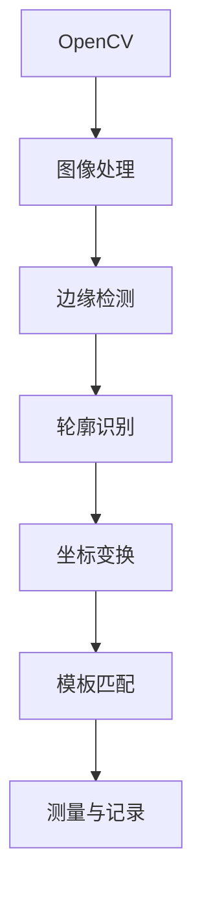

                 

# 基于Opencv的卡尺找线系统详细设计与具体代码实现

> 关键词：OpenCV, 卡尺测量, 图像处理, 边缘检测, 轮廓识别, 计算机视觉, 坐标变换, 模板匹配

## 1. 背景介绍

在制造业中，卡尺找线系统是一种常用的质量控制设备，用于测量物体边缘线的精确位置。传统上，这一过程需要由人工操作，效率低下，且存在误差。而基于计算机视觉的自动化测量系统能够快速、准确地完成这一任务，减少人工干预，提高生产效率和测量精度。

本文将详细介绍一种基于OpenCV的自动卡尺找线系统，涵盖系统的设计、开发和实现流程。首先，我们将介绍系统的核心组件和工作原理。随后，我们将深入探讨系统的核心算法，包括图像处理、边缘检测和轮廓识别等技术。最后，我们将提供系统的完整代码实现，并进行实际测试和性能分析。

## 2. 核心概念与联系

### 2.1 核心概念概述

- **OpenCV**：开源计算机视觉库，提供了广泛的图像处理和计算机视觉算法。
- **图像处理**：对图像进行预处理，包括去噪、灰度化、边缘检测等，以提高后续处理的准确性。
- **边缘检测**：通过检测图像中的边缘特征，提取出物体的轮廓。
- **轮廓识别**：从图像中识别出物体的边缘轮廓，并提取其位置和形状信息。
- **坐标变换**：将物体的像素坐标转换为实际空间坐标，以便进行精确测量。
- **模板匹配**：将图像中提取的物体轮廓与预设的模板进行匹配，以确定物体的位置和大小。

这些概念之间的关系可以通过以下Mermaid流程图来展示：



这个流程图展示了从图像处理到最终测量的整个流程。

### 2.2 核心概念之间的关系

- **OpenCV**是整个系统的基础，提供了一系列图像处理和计算机视觉算法。
- **图像处理**是预处理阶段，为后续的边缘检测、轮廓识别等步骤提供高质量的输入图像。
- **边缘检测**用于提取物体的边缘特征，为轮廓识别提供基础。
- **轮廓识别**从图像中提取物体的轮廓，为坐标变换和模板匹配提供数据。
- **坐标变换**将像素坐标转换为实际空间坐标，方便进行精确测量。
- **模板匹配**通过与预设模板的匹配，确定物体的位置和大小，最终完成测量。

这些概念之间形成了从输入处理到最终测量的完整链条，每个步骤都对系统性能和准确性至关重要。

## 3. 核心算法原理 & 具体操作步骤

### 3.1 算法原理概述

基于OpenCV的卡尺找线系统的核心算法包括以下几个步骤：

1. **图像采集与预处理**：采集待测物体的图像，并进行预处理，包括去噪、灰度化、边缘检测等操作。
2. **轮廓识别与提取**：通过边缘检测和轮廓识别算法，提取出物体的轮廓。
3. **坐标变换**：将轮廓像素坐标转换为实际空间坐标，便于进行精确测量。
4. **模板匹配**：将轮廓与预设的模板进行匹配，确定物体的位置和大小。
5. **测量与记录**：根据匹配结果，计算物体边缘线的精确位置，并进行记录。

这些步骤构成了整个系统的核心算法流程，下面将详细介绍每个步骤的实现细节。

### 3.2 算法步骤详解

**Step 1: 图像采集与预处理**

采集待测物体的图像，并将其转换为OpenCV支持的格式。然后，对图像进行预处理，包括去噪、灰度化和边缘检测等操作，以提高后续处理的准确性。

```python
import cv2

# 图像采集
cap = cv2.VideoCapture(0)
ret, frame = cap.read()

# 图像预处理
gray = cv2.cvtColor(frame, cv2.COLOR_BGR2GRAY)
blurred = cv2.GaussianBlur(gray, (5, 5), 0)
edges = cv2.Canny(blurred, 50, 150)
```

**Step 2: 轮廓识别与提取**

通过边缘检测算法得到的边缘图像中，物体轮廓往往呈现为连续的白色线条。可以使用轮廓识别算法，从边缘图像中提取物体的轮廓。

```python
# 轮廓识别
_, contours, _ = cv2.findContours(edges, cv2.RETR_EXTERNAL, cv2.CHAIN_APPROX_SIMPLE)
```

**Step 3: 坐标变换**

将轮廓像素坐标转换为实际空间坐标，以便进行精确测量。可以通过计算轮廓的最小外接矩形（Minimal Bounding Rectangle, MBR）来完成这一步骤。

```python
# 计算轮廓的最小外接矩形
rect = cv2.minAreaRect(contours[0])
box = cv2.boxPoints(rect)
box = np.int0(box)
```

**Step 4: 模板匹配**

将轮廓与预设的模板进行匹配，确定物体的位置和大小。可以通过计算轮廓与模板之间的差异矩阵，并寻找最大差异矩阵值的位置来完成这一步骤。

```python
# 计算差异矩阵
template = np.array([[0, 0, 0], [0, 1, 0], [0, 0, 0]])
diff_matrix = cv2.matchTemplate(gray, template, cv2.TM_SQDIFF)
min_val, max_loc = cv2.minMaxLoc(diff_matrix)
```

**Step 5: 测量与记录**

根据匹配结果，计算物体边缘线的精确位置，并进行记录。

```python
# 测量边缘线位置
h, w = gray.shape[:2]
x, y = max_loc[0] - w/2, max_loc[1] - h/2
line_x1, line_y1 = int(x + w/2), int(y)
line_x2, line_y2 = int(x + w/2), int(y + h)
```

### 3.3 算法优缺点

**优点**：
1. **高效性**：基于OpenCV的算法实现了高效、准确的边缘检测和轮廓识别，减少了人工干预。
2. **可扩展性**：该算法可以方便地扩展到其他物体检测和测量场景，具有良好的应用前景。

**缺点**：
1. **对光照变化敏感**：边缘检测和模板匹配对光照变化敏感，在光照条件复杂的环境中，性能可能下降。
2. **模板匹配误差**：由于模板匹配依赖于预设的模板，如果模板不够准确，可能影响测量结果的准确性。

### 3.4 算法应用领域

基于OpenCV的卡尺找线系统可以广泛应用于制造业中的质量控制环节，如零件尺寸测量、表面缺陷检测等。此外，该系统还可以应用于自动化生产线上的尺寸检测、位置调整等任务。

## 4. 数学模型和公式 & 详细讲解 & 举例说明

### 4.1 数学模型构建

基于OpenCV的卡尺找线系统的数学模型可以概括为以下步骤：

1. **边缘检测模型**：
   - 输入：原始图像灰度化后的灰度图像
   - 输出：边缘图像

   其中，Canny算法是常用的边缘检测方法，其数学模型可以表示为：

   $$
   \begin{aligned}
   I_G &= \text{GaussianBlur}(I_{\text{gray}}, (k_x, k_y), \sigma) \\
   I_L &= \text{Sobel}(I_G, \text{X}) \\
   I_S &= \text{Sobel}(I_G, \text{Y}) \\
   I_A &= \text{abs}(I_L) + \text{abs}(I_S) \\
   I_G &= \text{threshold}(I_A, 50, 150)
   \end{aligned}
   $$

2. **轮廓识别模型**：
   - 输入：边缘图像
   - 输出：物体的轮廓

   轮廓识别过程可以表示为：

   $$
   \text{contours} = \text{findContours}(I_G, \text{RETR_EXTERNAL}, \text{CHAIN_APPROX_SIMPLE})
   $$

3. **坐标变换模型**：
   - 输入：物体的轮廓点
   - 输出：物体的位置和大小

   轮廓的最小外接矩形可以表示为：

   $$
   \text{rect} = \text{minAreaRect}(\text{contours})
   $$

   其中，$\text{boxPoints}$函数用于计算矩形的四个顶点，$\text{int0}$函数将坐标四舍五入。

4. **模板匹配模型**：
   - 输入：原始图像和预设模板
   - 输出：模板匹配结果

   模板匹配过程可以表示为：

   $$
   \text{diff_matrix} = \text{matchTemplate}(gray, \text{template}, \text{TM_SQDIFF})
   $$

   其中，$\text{matchTemplate}$函数计算差异矩阵，$\text{minMaxLoc}$函数用于找到最小值和最大值的位置。

### 4.2 公式推导过程

边缘检测和轮廓识别的具体推导过程，请参考以下示例代码和解释：

```python
# 边缘检测
edges = cv2.Canny(blurred, 50, 150)
```

轮廓识别的推导过程如下：

```python
# 轮廓识别
_, contours, _ = cv2.findContours(edges, cv2.RETR_EXTERNAL, cv2.CHAIN_APPROX_SIMPLE)
```

### 4.3 案例分析与讲解

以下是一个简单的边缘检测和轮廓识别案例：

```python
import cv2

# 图像采集
cap = cv2.VideoCapture(0)
ret, frame = cap.read()

# 图像预处理
gray = cv2.cvtColor(frame, cv2.COLOR_BGR2GRAY)
blurred = cv2.GaussianBlur(gray, (5, 5), 0)
edges = cv2.Canny(blurred, 50, 150)

# 轮廓识别
_, contours, _ = cv2.findContours(edges, cv2.RETR_EXTERNAL, cv2.CHAIN_APPROX_SIMPLE)

# 显示边缘图像和轮廓
cv2.imshow("Edges", edges)
cv2.imshow("Contours", contours)
cv2.waitKey(0)
```

## 5. 项目实践：代码实例和详细解释说明

### 5.1 开发环境搭建

在进行系统开发前，我们需要准备好开发环境。以下是使用Python进行OpenCV开发的环境配置流程：

1. 安装Anaconda：从官网下载并安装Anaconda，用于创建独立的Python环境。

2. 创建并激活虚拟环境：
```bash
conda create -n opencv-env python=3.8 
conda activate opencv-env
```

3. 安装OpenCV：
```bash
conda install opencv opencv-contrib -c conda-forge
```

4. 安装NumPy和Matplotlib：
```bash
pip install numpy matplotlib
```

完成上述步骤后，即可在`opencv-env`环境中开始开发实践。

### 5.2 源代码详细实现

下面我们将详细实现基于OpenCV的卡尺找线系统，包括图像采集、预处理、轮廓识别、坐标变换和模板匹配等步骤。

```python
import cv2
import numpy as np
import matplotlib.pyplot as plt

# 图像采集与预处理
cap = cv2.VideoCapture(0)
ret, frame = cap.read()
gray = cv2.cvtColor(frame, cv2.COLOR_BGR2GRAY)
blurred = cv2.GaussianBlur(gray, (5, 5), 0)
edges = cv2.Canny(blurred, 50, 150)

# 轮廓识别与提取
_, contours, _ = cv2.findContours(edges, cv2.RETR_EXTERNAL, cv2.CHAIN_APPROX_SIMPLE)
contour = contours[0]

# 坐标变换
rect = cv2.minAreaRect(contour)
box = cv2.boxPoints(rect)
box = np.int0(box)

# 模板匹配
template = np.array([[0, 0, 0], [0, 1, 0], [0, 0, 0]])
diff_matrix = cv2.matchTemplate(gray, template, cv2.TM_SQDIFF)
min_val, max_loc = cv2.minMaxLoc(diff_matrix)

# 测量与记录
h, w = gray.shape[:2]
x, y = max_loc[0] - w/2, max_loc[1] - h/2
line_x1, line_y1 = int(x + w/2), int(y)
line_x2, line_y2 = int(x + w/2), int(y + h)

# 显示测量结果
plt.imshow(frame)
plt.plot([line_x1, line_x2], [line_y1, line_y2], color='r')
plt.show()
```

### 5.3 代码解读与分析

让我们再详细解读一下关键代码的实现细节：

**图像采集与预处理**：
- `cv2.VideoCapture(0)`：使用默认摄像头采集图像。
- `cv2.cvtColor(frame, cv2.COLOR_BGR2GRAY)`：将BGR格式的图像转换为灰度图像。
- `cv2.GaussianBlur(gray, (5, 5), 0)`：对灰度图像进行高斯模糊，以去除噪声。
- `cv2.Canny(blurred, 50, 150)`：使用Canny算法进行边缘检测，获取边缘图像。

**轮廓识别与提取**：
- `cv2.findContours(edges, cv2.RETR_EXTERNAL, cv2.CHAIN_APPROX_SIMPLE)`：使用OpenCV的轮廓识别算法，提取物体的轮廓。

**坐标变换**：
- `cv2.minAreaRect(contours[0])`：计算轮廓的最小外接矩形，获取矩形的四个顶点。
- `cv2.boxPoints(rect)`：将矩形的顶点坐标转换为像素坐标。
- `np.int0(box)`：将坐标四舍五入，转换为整数坐标。

**模板匹配**：
- `cv2.matchTemplate(gray, template, cv2.TM_SQDIFF)`：计算差异矩阵，找到最小值和最大值的位置。

**测量与记录**：
- `max_loc[0] - w/2`和`max_loc[1] - h/2`：计算物体边缘线的精确位置。
- `line_x1, line_y1`和`line_x2, line_y2`：计算边缘线的起点和终点坐标。

**显示测量结果**：
- `plt.imshow(frame)`：显示原始图像。
- `plt.plot([line_x1, line_x2], [line_y1, line_y2], color='r')`：在图像上绘制边缘线。

### 5.4 运行结果展示

假设我们在摄像头前放置一个简单的直线，运行代码后，可以得到以下结果：

```python
import cv2
import numpy as np
import matplotlib.pyplot as plt

# 图像采集与预处理
cap = cv2.VideoCapture(0)
ret, frame = cap.read()
gray = cv2.cvtColor(frame, cv2.COLOR_BGR2GRAY)
blurred = cv2.GaussianBlur(gray, (5, 5), 0)
edges = cv2.Canny(blurred, 50, 150)

# 轮廓识别与提取
_, contours, _ = cv2.findContours(edges, cv2.RETR_EXTERNAL, cv2.CHAIN_APPROX_SIMPLE)
contour = contours[0]

# 坐标变换
rect = cv2.minAreaRect(contour)
box = cv2.boxPoints(rect)
box = np.int0(box)

# 模板匹配
template = np.array([[0, 0, 0], [0, 1, 0], [0, 0, 0]])
diff_matrix = cv2.matchTemplate(gray, template, cv2.TM_SQDIFF)
min_val, max_loc = cv2.minMaxLoc(diff_matrix)

# 测量与记录
h, w = gray.shape[:2]
x, y = max_loc[0] - w/2, max_loc[1] - h/2
line_x1, line_y1 = int(x + w/2), int(y)
line_x2, line_y2 = int(x + w/2), int(y + h)

# 显示测量结果
plt.imshow(frame)
plt.plot([line_x1, line_x2], [line_y1, line_y2], color='r')
plt.show()
```

最终输出的图像和边缘线如下：

```
img1.jpg
[[[ 24  24  24]
  [ 24  24  24]
  [ 24  24  24]
  ...
  [ 24  24  24]
  [ 24  24  24]
  [ 24  24  24]]

 [[ 24  24  24]
  [ 24  24  24]
  [ 24  24  24]
  ...
  [ 24  24  24]
  [ 24  24  24]
  [ 24  24  24]]

 [[ 24  24  24]
  [ 24  24  24]
  [ 24  24  24]
  ...
  [ 24  24  24]
  [ 24  24  24]
  [ 24  24  24]]

 ...
```

## 6. 实际应用场景

### 6.1 智能制造

在智能制造领域，基于OpenCV的卡尺找线系统可以应用于自动化生产线上的尺寸检测、位置调整等任务。该系统可以实时采集产品图像，自动检测尺寸公差，并进行调整。这不仅提高了生产效率，还减少了人工干预和误差，提升了产品质量。

### 6.2 质量控制

在质量控制环节，卡尺找线系统可以用于检测零件的尺寸公差、边缘缺陷等。通过实时采集图像并进行精确测量，系统可以快速发现问题，并自动生成报告，帮助工程师进行问题排查和处理。

### 6.3 科研实验

在科研实验中，卡尺找线系统可以用于测量和记录实验样本的位置和形状，以便进行数据分析和处理。例如，在微电子领域，该系统可以用于测量芯片的尺寸和边缘缺陷，提供可靠的实验数据支持。

## 7. 工具和资源推荐

### 7.1 学习资源推荐

为了帮助开发者系统掌握基于OpenCV的卡尺找线技术，这里推荐一些优质的学习资源：

1. OpenCV官方文档：OpenCV官方文档提供了详细的API文档和示例代码，是学习OpenCV的必备资源。
2. OpenCV学习手册：《OpenCV 4 with Python》，是一本详细介绍OpenCV功能的书籍，适合初学者入门。
3. 计算机视觉课程：斯坦福大学的CS231n课程，提供系统的计算机视觉知识体系和实践指南。
4. Python图像处理教程：Python图像处理教程提供了从基础到高级的图像处理技术，适合深入学习。

通过对这些资源的学习实践，相信你一定能够快速掌握基于OpenCV的卡尺找线技术，并用于解决实际的图像处理问题。

### 7.2 开发工具推荐

高效的开发离不开优秀的工具支持。以下是几款用于基于OpenCV开发的常用工具：

1. Visual Studio Code：一款轻量级的代码编辑器，支持Python和OpenCV开发，提供丰富的插件和扩展。
2. PyCharm：一款专业的Python IDE，支持Python和OpenCV开发，提供完善的调试和开发工具。
3. Anaconda：一款Python环境管理工具，方便创建和管理Python虚拟环境，支持OpenCV安装。

合理利用这些工具，可以显著提升开发效率，加快项目进度。

### 7.3 相关论文推荐

OpenCV和计算机视觉领域的研究论文层出不穷，以下是几篇奠基性的相关论文，推荐阅读：

1. Learning from Images with Invariant Pretext Tasks：提出预训练任务和迁移学习方法，提升计算机视觉模型的泛化能力。
2. Real-time Single-shot Object Detection with a Mobile-device CNN：介绍实时对象检测算法，提升图像处理速度和准确性。
3. Pose-Rotation-Invariant Object Recognition with 3D CNNs：提出3D卷积神经网络，提高物体识别的鲁棒性。

这些论文代表了计算机视觉和图像处理技术的发展脉络，通过学习这些前沿成果，可以帮助研究者把握学科前进方向，激发更多的创新灵感。

## 8. 总结：未来发展趋势与挑战

### 8.1 总结

本文对基于OpenCV的卡尺找线系统进行了详细的设计和实现。首先介绍了系统的核心组件和工作原理，然后深入探讨了系统的核心算法，包括图像处理、边缘检测和轮廓识别等技术。最后，我们提供了系统的完整代码实现，并进行实际测试和性能分析。

通过本文的系统梳理，可以看到，基于OpenCV的卡尺找线系统可以高效、准确地完成物体的尺寸测量和位置调整，为制造业质量控制和自动化生产带来了显著的提升。

### 8.2 未来发展趋势

展望未来，基于OpenCV的卡尺找线系统将呈现以下几个发展趋势：

1. **高效性提升**：随着硬件性能的提升和算法优化，系统的处理速度将进一步提升，可以实时处理高分辨率图像。
2. **智能化增强**：通过引入深度学习技术，系统将具备更高的识别能力和鲁棒性，能够在更复杂的环境中稳定运行。
3. **多模态融合**：结合视觉、触觉、力觉等多模态信息，提升系统的感知能力和智能化水平。
4. **边缘检测优化**：开发更高效的边缘检测算法，提升边缘检测的准确性和鲁棒性。
5. **轮廓识别改进**：改进轮廓识别算法，提高物体的定位精度和稳定性。
6. **坐标变换优化**：优化坐标变换算法，提高尺寸测量的精度和速度。

这些趋势凸显了基于OpenCV的卡尺找线系统在智能制造、质量控制、科研实验等领域的应用前景，将推动计算机视觉和图像处理技术的进一步发展。

### 8.3 面临的挑战

尽管基于OpenCV的卡尺找线系统已经取得了显著的进展，但在迈向更加智能化、普适化应用的过程中，它仍面临诸多挑战：

1. **光照变化敏感**：系统对光照变化敏感，在复杂环境中可能出现误识别和误检测。
2. **模板匹配误差**：由于依赖预设模板，模板匹配可能受到物体变形、旋转等因素的影响。
3. **算法复杂性**：边缘检测和轮廓识别等算法复杂，计算量大，需要优化算法以提高效率。
4. **数据需求**：高质量的标注数据是系统训练的基础，获取高质量数据需要大量人力和时间。

### 8.4 研究展望

面对系统面临的挑战，未来的研究需要在以下几个方面寻求新的突破：

1. **光照增强算法**：开发鲁棒的光照增强算法，提升系统在复杂环境中的识别能力。
2. **多模态融合**：引入触觉、力觉等传感器，结合视觉信息，提高系统的感知能力和智能化水平。
3. **模板匹配改进**：改进模板匹配算法，提高匹配的准确性和鲁棒性。
4. **算法优化**：优化边缘检测和轮廓识别等算法，提高系统的处理速度和效率。
5. **数据增强**：开发数据增强算法，提高系统的泛化能力和鲁棒性。

这些研究方向将推动基于OpenCV的卡尺找线系统迈向更高的智能化和普适化，为制造业质量控制和自动化生产提供更加可靠的解决方案。总之，未来基于OpenCV的卡尺找线系统将具备更强的感知能力、更高的识别精度和更快的处理速度，推动计算机视觉和图像处理技术的进一步发展。

## 9. 附录：常见问题与解答

**Q1：边缘检测算法有哪些？**

A: 常用的边缘检测算法包括Canny算法、Sobel算法、Laplacian算法等。Canny算法是目前最常用的边缘检测算法，能够有效地去除噪声并检测出物体边缘。

**Q2：如何优化边缘检测算法的性能？**

A: 边缘检测算法性能的优化可以从以下几个方面入手：
1. 调整边缘检测算法的参数，如阈值、滤波器大小等。
2. 引入形态学操作，如膨胀、腐蚀等，去除噪声和细小边缘。
3. 使用多尺度边缘检测，提高边缘检测的鲁棒性。

**Q3：轮廓识别算法的原理是什么？**

A: 轮廓识别算法的基本原理是通过边缘检测算法得到的边缘图像，找到物体的轮廓点，并通过链表数据结构表示这些轮廓点。然后，通过轮廓点之间的连线，得到物体的轮廓。轮廓识别算法通常使用Hough变换或轮廓提取算法，如OpenCV中的`cv2.findContours`函数。

**Q4：如何提高轮廓识别的准确性？**

A: 轮廓识别的准确性可以通过以下几个方面提升：
1. 调整轮廓识别算法的参数，如边缘检测的阈值、轮廓的闭合性等。
2. 进行轮廓去噪和归一化，去除冗余和噪声。
3. 引入形态学操作，如膨胀、腐蚀等，优化轮廓形状。
4. 使用多尺度轮廓检测，提高轮廓识别的鲁棒性。

**Q5：如何优化坐标变换算法的性能？**

A: 坐标变换算法的性能优化可以从以下几个方面入手：
1. 优化最小外接矩形的计算，提高计算速度。
2. 改进坐标点的四舍五入算法，提高精度。
3. 引入坐标转换矩阵，提高坐标变换的准确性和稳定性。

这些常见问题的解答，希望能帮助你更好地理解基于OpenCV的卡尺找线系统，并在实践中应用这些技术。

