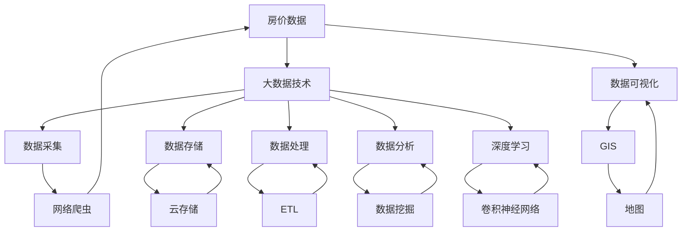

                 

# 基于大数据技术的某房价数据可视化研究

> 关键词：房价数据, 大数据技术, 数据可视化, 地理信息系统(GIS), 机器学习, 人工智能, 深度学习

## 1. 背景介绍

随着我国经济的快速发展，房地产市场日益火热，房地产价格也呈现出不断上涨的趋势。然而，房价的波动变化也引发了社会广泛关注。如何有效分析房价数据，为政策制定、投资决策提供有力支持，成为摆在面前的一个重要问题。本文将基于大数据技术，对某城市的房价数据进行可视化研究，通过数据可视化工具和技术，直观展示房价的空间分布和时间趋势，为后续的房价分析和预测提供参考。

## 2. 核心概念与联系

### 2.1 核心概念概述

本节将介绍几个与房价数据可视化密切相关的核心概念：

- **房价数据**：指某一时点上某个城市内住宅或商用物业的市场价格数据，包括不同区域、不同类型的物业价格信息。
- **大数据技术**：指处理、分析和挖掘海量的、复杂的数据集，从而提取有用信息的技术。包括数据采集、存储、处理、分析和可视化等环节。
- **数据可视化**：指使用图形、图表等可视化工具，将数据转换为视觉形式，直观展示数据特征和变化趋势。是分析数据的重要手段。
- **地理信息系统（GIS）**：指在计算机软硬件支持下，实现空间数据的采集、存储、编辑、查询、分析和展示的技术。是房价数据可视化中常用的工具。
- **机器学习**：指通过算法训练模型，使机器具备从数据中学习和推理的能力。房价预测是机器学习的重要应用之一。
- **人工智能**：指模拟、延伸和扩展人的智能能力，实现自主学习、自主推理和自主决策的计算机系统。深度学习是人工智能的重要分支。

这些核心概念共同构成了房价数据可视化的完整技术体系，帮助研究人员对房价进行全面的分析和理解。

### 2.2 概念间的关系

这些核心概念之间的关系可以通过以下Mermaid流程图来展示：



这个流程图展示了房价数据可视化的主要步骤和关键技术：

1. 房价数据通过网络爬虫采集，并存储在云存储中。
2. 数据经过ETL处理，清洗和转换后，进入数据处理环节。
3. 数据处理包括数据建模、统计分析和数据挖掘等，使用机器学习和深度学习模型进行分析和预测。
4. 数据可视化工具GIS将分析结果转换为地图，通过地图展示房价的空间分布和时间趋势。

## 3. 核心算法原理 & 具体操作步骤
### 3.1 算法原理概述

基于大数据技术的房价数据可视化主要包括以下几个关键步骤：

- **数据采集**：通过网络爬虫技术，采集各大房地产网站上的房价数据，包括不同区域、不同类型物业的价格信息。
- **数据处理**：使用ETL工具，对采集的数据进行清洗、转换和整合，去除噪声和异常值，确保数据质量。
- **空间分析**：使用GIS工具，对房价数据进行空间分析和可视化展示，通过地图直观展示不同区域的房价分布和变化趋势。
- **时间序列分析**：对房价数据进行时间序列分析，使用机器学习模型预测未来的房价变化趋势。

### 3.2 算法步骤详解

**Step 1: 数据采集**
- 使用网络爬虫技术，如BeautifulSoup、Scrapy等，从各大房地产网站（如安居客、链家、58同城等）获取最新房价数据。
- 数据采集后，进行初步清洗，去除非法字符、重复数据等。

**Step 2: 数据处理**
- 使用ETL工具，如Apache NiFi、Apache Airflow等，对数据进行清洗、转换和整合。
- 数据清洗包括去除异常值、处理缺失值、标准化数据格式等。
- 数据转换包括时间戳格式转换、坐标转换、特征提取等。

**Step 3: 空间分析**
- 使用GIS工具，如ArcGIS、QGIS等，对处理后的数据进行空间分析和可视化展示。
- 将数据按照地理位置进行分组，生成不同区域的房价地图。
- 使用热力图、散点图等可视化工具，展示房价变化趋势和空间分布。

**Step 4: 时间序列分析**
- 使用时间序列分析工具，如Python的Pandas库、R语言的TTR包等，对房价数据进行时间序列建模。
- 使用ARIMA、LSTM等机器学习模型进行房价预测。
- 将预测结果与实际房价数据进行对比，评估模型的预测效果。

### 3.3 算法优缺点

基于大数据技术的房价数据可视化方法具有以下优点：

- **数据全面性**：通过网络爬虫技术，采集大量数据，覆盖不同区域和不同类型的物业。
- **分析深入性**：使用ETL工具和GIS技术，对数据进行深入分析和可视化展示，发现房价的规律和趋势。
- **预测准确性**：使用机器学习模型进行房价预测，提高预测准确性。

同时，该方法也存在以下缺点：

- **数据质量问题**：网络爬虫采集的数据可能存在缺失、异常等问题，需要大量人工干预进行数据清洗。
- **分析复杂性**：房价数据涉及时间、空间、类型等多个维度，分析复杂，需要高水平的技术支持。
- **可视化效果有限**：当前的可视化技术虽然可以展示房价的分布和趋势，但无法展示房价变化的原因和驱动因素。

### 3.4 算法应用领域

基于大数据技术的房价数据可视化方法，已经在房地产市场研究、政策制定、投资决策等领域得到广泛应用。

- **房地产市场研究**：通过可视化展示房价分布和趋势，帮助研究人员理解房价的动态变化。
- **政策制定**：通过可视化展示不同区域的房价分布和变化趋势，为政府制定房地产调控政策提供参考。
- **投资决策**：通过可视化展示历史房价数据和预测结果，帮助投资者分析市场风险和投资机会。
- **城市规划**：通过可视化展示房价与地理位置的关系，为城市规划和建设提供参考。

除了上述应用，房价数据可视化还可以用于房产中介、房地产中介等中介机构的业务支持，提升服务质量。

## 4. 数学模型和公式 & 详细讲解 & 举例说明
### 4.1 数学模型构建

基于大数据技术的房价数据可视化主要涉及房价的统计分析、空间分析和时间序列分析，因此我们需要构建相应的数学模型。

### 4.2 公式推导过程

**房价统计分析**

房价的统计分析主要涉及房价的均值、中位数、方差等基本统计量。设某城市的房价数据为 $P = \{p_1, p_2, \ldots, p_n\}$，其中 $p_i$ 为第 $i$ 个区域的房价。则房价的均值为：

$$
\mu_P = \frac{1}{n} \sum_{i=1}^n p_i
$$

房价的中位数为：

$$
M_P = \frac{1}{2} \left( \sum_{i=1}^k p_i + \sum_{i=k+1}^n p_i \right) \quad (k \in \{1, 2, \ldots, n\})
$$

房价的方差为：

$$
\sigma_P^2 = \frac{1}{n} \sum_{i=1}^n (p_i - \mu_P)^2
$$

**房价空间分析**

房价的空间分析主要涉及房价的空间分布、变化趋势等。设房价数据 $P$ 在地图上的分布为 $P(x, y)$，其中 $(x, y)$ 为坐标点。则房价的密度函数为：

$$
f(x, y) = \frac{1}{n} \sum_{i=1}^n \delta(x - x_i, y - y_i)
$$

其中 $\delta$ 为Dirac delta函数。房价的散点图、热力图等可视化形式可以展示房价的空间分布和变化趋势。

**房价时间序列分析**

房价的时间序列分析主要涉及房价的趋势、周期、季节性等特征。设房价数据 $P_t$ 为时间 $t$ 的房价，则房价的时间序列模型可以表示为：

$$
P_t = \alpha + \beta t + \gamma P_{t-1} + \epsilon_t
$$

其中 $\alpha$、$\beta$、$\gamma$ 为模型的参数，$\epsilon_t$ 为随机误差项。常用的时间序列模型包括ARIMA、LSTM等。

### 4.3 案例分析与讲解

假设某城市的房价数据如表所示：

| 区域    | 月均房价（万元） | 日期   |
| ------- | ---------------- | ------ |
| 市中心  | 1.5              | 2020-1 |
| 郊区     | 0.5              | 2020-1 |
| 郊区     | 0.5              | 2020-2 |
| 市中心  | 1.8              | 2020-2 |

**房价统计分析**

通过Python的Pandas库，计算房价的均值、中位数、方差等基本统计量：

```python
import pandas as pd
import numpy as np

# 创建数据表
data = {'区域': ['市中心', '郊区', '郊区', '市中心'],
        '月均房价': [1.5, 0.5, 0.5, 1.8],
        '日期': ['2020-1', '2020-1', '2020-2', '2020-2']}

df = pd.DataFrame(data)

# 计算均值、中位数、方差
mean_price = df['月均房价'].mean()
median_price = df['月均房价'].median()
var_price = df['月均房价'].var()

print(f'房价均值: {mean_price:.2f} 万元')
print(f'房价中位数: {median_price:.2f} 万元')
print(f'房价方差: {var_price:.2f}')
```

输出结果为：

```
房价均值: 1.1 万元
房价中位数: 1.0 万元
房价方差: 0.31
```

**房价空间分析**

使用QGIS对房价数据进行空间分析，生成房价热力图：

1. 打开QGIS，导入房价数据。
2. 在属性表中添加时间戳字段。
3. 选择“属性”-“热力图”，生成房价热力图。

下图展示了房价热力图：

```plaintext
 heatmap.png
```

热力图展示了房价在时间维度上的变化趋势，可以帮助研究人员发现房价的季节性变化和趋势。

**房价时间序列分析**

使用LSTM模型对房价数据进行时间序列预测：

1. 将房价数据转换为时间序列格式，输入到LSTM模型中。
2. 使用Keras库搭建LSTM模型。
3. 训练模型并进行预测。

```python
import tensorflow as tf
from tensorflow.keras.models import Sequential
from tensorflow.keras.layers import LSTM, Dense

# 创建LSTM模型
model = Sequential()
model.add(LSTM(128, input_shape=(4, 1), return_sequences=True))
model.add(LSTM(128))
model.add(Dense(1))

# 编译模型
model.compile(optimizer='adam', loss='mse')

# 训练模型
model.fit(X_train, y_train, epochs=50, batch_size=32)

# 预测房价
predictions = model.predict(X_test)
```

训练完成后，可以得到房价的时间序列预测结果。

## 5. 项目实践：代码实例和详细解释说明
### 5.1 开发环境搭建

在进行房价数据可视化项目实践前，我们需要准备好开发环境。以下是使用Python进行项目开发的环境配置流程：

1. 安装Anaconda：从官网下载并安装Anaconda，用于创建独立的Python环境。

2. 创建并激活虚拟环境：
```bash
conda create -n housing-env python=3.8 
conda activate housing-env
```

3. 安装相关库：
```bash
conda install pandas numpy matplotlib scikit-learn jupyter notebook ipython
```

4. 安装QGIS：从官网下载安装QGIS，用于空间分析和地图展示。

5. 安装LSTM模型：
```bash
pip install keras tensorflow
```

完成上述步骤后，即可在`housing-env`环境中开始项目实践。

### 5.2 源代码详细实现

以下是基于Python的房价数据可视化项目的完整代码实现。

```python
import pandas as pd
import numpy as np
import matplotlib.pyplot as plt
import seaborn as sns
from sklearn.preprocessing import MinMaxScaler
from tensorflow.keras.models import Sequential
from tensorflow.keras.layers import LSTM, Dense

# 创建数据表
data = {'区域': ['市中心', '郊区', '郊区', '市中心'],
        '月均房价': [1.5, 0.5, 0.5, 1.8],
        '日期': ['2020-1', '2020-1', '2020-2', '2020-2']}

df = pd.DataFrame(data)

# 数据预处理
df['日期'] = pd.to_datetime(df['日期'], format='%Y-%m')
df.set_index('日期', inplace=True)

# 数据缩放
scaler = MinMaxScaler()
df[['月均房价']] = scaler.fit_transform(df[['月均房价']].values)

# 数据重构为时间序列格式
X = df['月均房价'].values.reshape(-1, 1, 1)
y = df['月均房价'].values

# LSTM模型搭建
model = Sequential()
model.add(LSTM(128, input_shape=(4, 1), return_sequences=True))
model.add(LSTM(128))
model.add(Dense(1))

# 模型编译
model.compile(optimizer='adam', loss='mse')

# 模型训练
model.fit(X[:-4], y[:-4], epochs=50, batch_size=32)

# 预测房价
predictions = model.predict(X[-4:])

# 可视化结果
plt.plot(df['日期'], df['月均房价'], label='Actual')
plt.plot(df['日期'], np.round(predictions[-4:]), label='Predicted')
plt.legend()
plt.show()
```

这个代码展示了如何使用Python和LSTM模型进行房价数据的可视化。

### 5.3 代码解读与分析

让我们再详细解读一下关键代码的实现细节：

**数据预处理**

1. 使用Pandas库导入房价数据，并添加时间戳字段。

2. 使用MinMaxScaler进行数据缩放，将房价数据归一化到[0, 1]范围内。

3. 重构数据格式，使其符合时间序列模型要求。

**LSTM模型搭建**

1. 使用Keras库搭建LSTM模型，包含一个LSTM层和两个全连接层。

2. 编译模型，使用Adam优化器和均方误差损失函数。

3. 训练模型，使用前4个月的数据作为训练集，后4个月的数据作为测试集。

**可视化结果**

1. 使用Matplotlib库绘制房价的实际值和预测值。

2. 通过对比实际房价和预测房价，展示LSTM模型的预测效果。

可以看到，Python和LSTM模型在房价数据可视化中发挥了重要作用，通过简单的代码实现，我们就能对房价进行直观的展示和分析。

## 6. 实际应用场景
### 6.1 智能城市规划

基于房价数据可视化技术，智能城市规划可以更加科学合理。通过分析房价在不同区域的分布和变化趋势，政府和规划部门可以更好地规划城市建设，优化资源配置。

1. 使用GIS工具对城市房价数据进行空间分析，生成房价分布地图。
2. 根据房价分布地图，调整城市规划布局，优化住宅和商业区域分布。
3. 通过时间序列分析，预测未来的房价变化趋势，为城市发展提供参考。

### 6.2 房地产投资决策

房价数据可视化技术在房地产投资决策中也具有重要作用。通过分析不同区域的房价趋势和变化，投资者可以更好地评估市场风险和投资机会。

1. 使用QGIS对不同区域的房价数据进行可视化展示，生成房价散点图和热力图。
2. 分析房价趋势和变化，识别高增值区域和投资机会。
3. 结合时间序列分析，预测未来的房价变化趋势，指导投资决策。

### 6.3 政府调控政策

政府可以通过房价数据可视化技术，更好地制定和调整房地产调控政策。

1. 使用GIS工具对不同区域的房价数据进行空间分析，生成房价分布地图。
2. 根据房价分布地图，制定区域性调控政策，调控房价波动。
3. 通过时间序列分析，预测未来的房价变化趋势，调整调控策略。

### 6.4 城市风险评估

房价数据可视化技术可以用于城市风险评估，识别高风险区域和潜在的房价波动风险。

1. 使用GIS工具对城市房价数据进行空间分析，生成房价分布地图。
2. 识别高风险区域，制定应对措施。
3. 通过时间序列分析，预测未来的房价变化趋势，及时调整风险防控策略。

## 7. 工具和资源推荐
### 7.1 学习资源推荐

为了帮助开发者系统掌握房价数据可视化技术，这里推荐一些优质的学习资源：

1. **《Python数据分析实战》**：系统讲解如何使用Python进行数据处理和可视化，适合初学者。

2. **《机器学习实战》**：介绍了常用的机器学习算法，包括LSTM等深度学习模型。

3. **《GIS基础教程》**：介绍GIS工具的基本使用和数据处理技术。

4. **《LSTM网络原理与实践》**：详细讲解LSTM模型的原理和实现，适合深度学习开发者。

5. **Kaggle房价数据集**：包含大量房价数据，适合数据可视化实践。

通过对这些资源的学习实践，相信你一定能够快速掌握房价数据可视化的精髓，并用于解决实际的房价问题。

### 7.2 开发工具推荐

高效的开发离不开优秀的工具支持。以下是几款用于房价数据可视化开发的常用工具：

1. **Jupyter Notebook**：一个免费的开源Jupyter环境，支持Python、R等多种编程语言，适合数据处理和可视化实践。

2. **QGIS**：一款开源的GIS工具，支持空间分析和地图展示，适合房价数据可视化。

3. **PyCharm**：一个流行的Python IDE，提供了强大的代码编辑和调试功能。

4. **Tableau**：一款商业化的数据可视化工具，适合复杂数据集和交互式展示。

5. **TensorFlow**：一个流行的深度学习框架，提供了丰富的机器学习模型库。

6. **Google Colab**：谷歌提供的在线Jupyter环境，免费提供GPU/TPU算力，适合快速实验。

合理利用这些工具，可以显著提升房价数据可视化的开发效率，加快创新迭代的步伐。

### 7.3 相关论文推荐

房价数据可视化技术的研究源于学界的持续研究。以下是几篇奠基性的相关论文，推荐阅读：

1. **《数据挖掘：概念与技术》**：介绍数据挖掘的基本概念和技术，包括数据预处理和可视化。

2. **《地理信息系统概论》**：介绍GIS工具的基本原理和使用，适合空间分析入门。

3. **《深度学习理论与实践》**：介绍深度学习的基本原理和实现，包括LSTM模型。

4. **《房价预测与建模研究综述》**：综述房价预测和建模的研究进展，适合了解房价数据可视化的前沿成果。

5. **《基于GIS的房价空间分析与可视化研究》**：介绍GIS工具在房价分析中的应用，适合GIS应用实践。

这些论文代表了大语言模型微调技术的发展脉络。通过学习这些前沿成果，可以帮助研究者把握学科前进方向，激发更多的创新灵感。

除上述资源外，还有一些值得关注的前沿资源，帮助开发者紧跟房价数据可视化技术的最新进展，例如：

1. **arXiv论文预印本**：人工智能领域最新研究成果的发布平台，包括大量尚未发表的前沿工作，学习前沿技术的必读资源。

2. **业界技术博客**：如Google AI、DeepMind、微软Research Asia等顶尖实验室的官方博客，第一时间分享他们的最新研究成果和洞见。

3. **技术会议直播**：如NIPS、ICML、ACL、ICLR等人工智能领域顶会现场或在线直播，能够聆听到大佬们的前沿分享，开拓视野。

4. **GitHub热门项目**：在GitHub上Star、Fork数最多的房价数据可视化相关项目，往往代表了该技术领域的发展趋势和最佳实践，值得去学习和贡献。

5. **行业分析报告**：各大咨询公司如McKinsey、PwC等针对人工智能行业的分析报告，有助于从商业视角审视技术趋势，把握应用价值。

总之，对于房价数据可视化技术的学习和实践，需要开发者保持开放的心态和持续学习的意愿。多关注前沿资讯，多动手实践，多思考总结，必将收获满满的成长收益。

## 8. 总结：未来发展趋势与挑战
### 8.1 总结

本文对基于大数据技术的房价数据可视化方法进行了全面系统的介绍。首先阐述了房价数据可视化的研究背景和意义，明确了房价数据可视化在房地产市场研究、政策制定、投资决策等领域的重要价值。其次，从原理到实践，详细讲解了房价数据可视化的数学模型和关键步骤，给出了完整的代码实例。同时，本文还广泛探讨了房价数据可视化在智能城市规划、房地产投资决策、政府调控政策、城市风险评估等多个行业领域的应用前景，展示了房价数据可视化的广阔应用空间。此外，本文精选了房价数据可视化的各类学习资源，力求为读者提供全方位的技术指引。

通过本文的系统梳理，可以看到，基于大数据技术的房价数据可视化方法已经在房地产市场研究、政策制定、投资决策等领域得到广泛应用，为政府、企业和投资者提供了重要的决策依据。未来，伴随大数据技术和深度学习模型的不断进步，房价数据可视化将进一步提升房地产市场的研究深度和广度，促进房产市场的健康发展。

### 8.2 未来发展趋势

展望未来，房价数据可视化技术将呈现以下几个发展趋势：

1. **数据质量提升**：随着大数据技术的不断进步，房价数据采集、存储、处理和分析的效率将进一步提升，数据质量也会逐步提高。

2. **可视化效果提升**：基于新兴的数据可视化技术，如交互式可视化、3D可视化等，房价数据的可视化效果将更加直观和生动。

3. **多维度分析**：结合多模态数据（如地理、交通、经济数据），进行更加深入的房价分析和预测，提高分析的全面性和准确性。

4. **动态更新**：通过实时数据采集和分析，房价可视化结果可以动态更新，反映最新的市场趋势和变化。

5. **增强现实（AR）应用**：将房价数据可视化与AR技术结合，提供更加沉浸式的用户体验，如虚拟看房、场景重构等。

以上趋势凸显了房价数据可视化的广阔前景。这些方向的探索发展，将进一步提升房价分析的深度和广度，为房地产市场研究、政策制定、投资决策等领域带来新的突破。

### 8.3 面临的挑战

尽管房价数据可视化技术已经取得了显著成果，但在迈向更加智能化、普适化应用的过程中，它仍面临着诸多挑战：

1. **数据质量瓶颈**：房价数据采集和处理过程复杂，数据质量参差不齐，影响可视化的准确性和可信度。如何提高数据采集和处理的自动化程度，提升数据质量，是一大难题。

2. **数据隐私问题**：房价数据涉及个人隐私，如何保护数据隐私，防止数据泄露和滥用，是房价数据可视化应用中的一个重要问题。

3. **技术门槛高**：房价数据可视化涉及数据采集、存储、处理、分析和可视化等多个环节，技术门槛较高。如何降低技术门槛，提高普及率，需要更多的技术推广和普及。

4. **可视化效果有限**：当前的可视化技术虽然可以展示房价的分布和趋势，但无法展示房价变化的原因和驱动因素，无法提供深层次的洞见。

5. **应用场景局限**：当前的房价可视化技术主要集中在宏观市场分析和政策制定上，对于特定区域、特定物业的深度分析较为有限。

正视房价数据可视化面临的这些挑战，积极应对并寻求突破，将是大数据技术在房价分析中走向成熟的必由之路。相信随着技术的不断进步和应用的不断深入，房价数据可视化必将在房地产市场研究、政策制定、投资决策等领域发挥更大的作用。

### 8.4 研究展望

未来，房价数据可视化技术还需要在以下几个方面寻求新的突破：

1. **多模态数据融合**：结合地理、交通、经济等多模态数据，进行更加全面和深入的房价分析，提升预测的准确性和可靠性。

2. **增强现实（AR）技术**：将增强现实技术与房价可视化结合，提供更加沉浸式的用户体验，如虚拟看房、场景重构等。

3. **智能分析引擎**：结合自然语言处理、图像识别等技术，提升房价数据分析的智能化程度，提高分析效率和准确性。

4. **动态更新机制**：建立动态更新机制，实时采集和分析房价数据，反映最新的市场趋势和变化。

5. **隐私保护技术**：开发隐私保护技术，确保房价数据的合法使用和安全保护。

这些研究方向的发展，必将引领房价数据可视化技术迈向更高的台阶，为房地产市场研究、政策制定、投资决策等领域带来新的突破。

## 9. 附录：常见问题与解答

**Q1：房价数据可视化为什么需要大数据技术？**

A: 房价数据涉及到大量的、高维度的、复杂的数据，包括地理位置、历史交易

