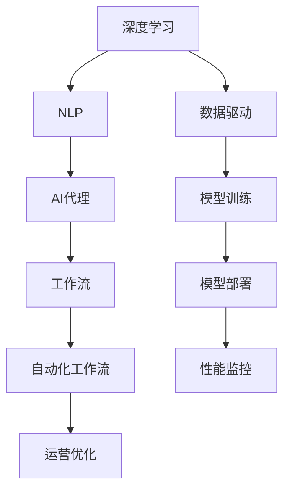
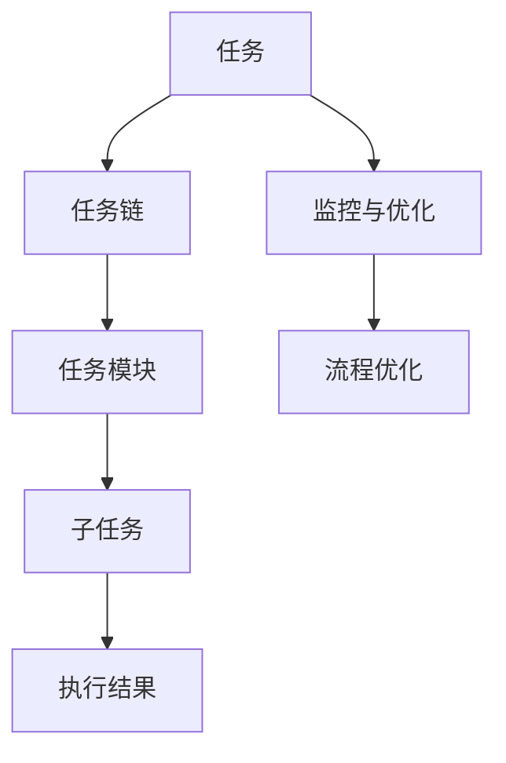
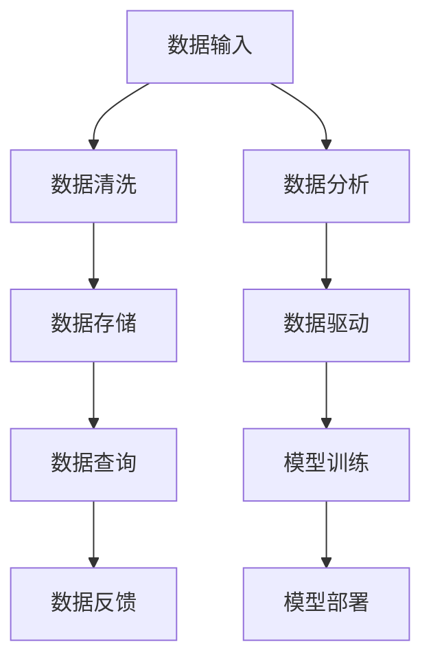
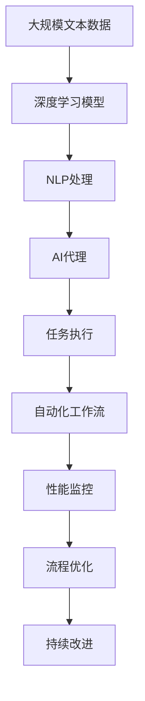

                 

# 基于深度学习的AI代理工作流：案例与实践

> 关键词：深度学习, 代理工作流, 案例研究, 自动化, 技术栈, 最佳实践

## 1. 背景介绍

### 1.1 问题由来

在现代企业的数字化转型过程中，自动化工作流（Automated Workflow）扮演着越来越重要的角色。通过自动化流程，企业能够提升运营效率、降低成本、减少人为错误，并在动态变化的业务环境中保持灵活性。然而，构建高效的自动化工作流系统通常需要耗费大量的人力资源和时间成本，而传统的规则引擎（Rule Engine）等方式又过于灵活，难以适应复杂且动态的业务需求。

为了解决这一问题，AI代理（AI Agent）技术应运而生。AI代理通过深度学习和自然语言处理技术，能够理解并执行自然语言指令，实现高效的自动化工作流，并且随着数据和算力的提升，AI代理的智能化水平也在不断提高。本文将从深度学习的角度，介绍AI代理工作流的基本原理和具体实践案例。

### 1.2 问题核心关键点

AI代理工作流系统的核心关键点主要包括以下几点：

1. **深度学习模型**：采用深度学习技术，如Transformer、CNN等，实现对自然语言指令的理解和执行。
2. **自然语言处理**：通过NLP技术，如分词、词性标注、命名实体识别等，对用户指令进行解析和处理。
3. **任务适配**：根据不同任务需求，适配不同的模型和功能模块，确保AI代理能够完成具体工作。
4. **数据管理**：有效管理和利用数据，包括数据收集、清洗、存储和查询等。
5. **部署与监控**：通过云平台和监控工具，将AI代理部署到生产环境中，并持续监测其性能和稳定性。

通过这些关键点的综合应用，AI代理能够高效地处理各种复杂任务，并持续优化其性能。

### 1.3 问题研究意义

深入研究AI代理工作流系统的原理和实践，对于企业自动化转型、提升运营效率、降低运营成本具有重要意义：

1. **提升运营效率**：通过AI代理，企业能够自动完成大量重复性、标准化的工作，减少人工参与，提升工作效率。
2. **降低运营成本**：自动化工作流系统能够减少人工错误和无效操作，降低运营成本。
3. **增强业务灵活性**：AI代理可以根据业务需求快速调整和优化工作流程，适应动态变化的市场环境。
4. **促进数字化转型**：AI代理技术是企业数字化转型的重要组成部分，有助于构建智能化、自动化的业务系统。

## 2. 核心概念与联系

### 2.1 核心概念概述

为更好地理解基于深度学习的AI代理工作流系统，本节将介绍几个密切相关的核心概念：

- **深度学习（Deep Learning）**：一种机器学习技术，通过多层次的非线性映射，实现对复杂数据结构的建模和处理。
- **自然语言处理（NLP）**：一种涉及计算机科学与人工智能的研究领域，专注于使计算机理解和处理人类语言。
- **AI代理（AI Agent）**：一种通过程序逻辑和算法实现的任务执行者，能够理解和执行自然语言指令。
- **工作流（Workflow）**：一系列任务的集合，这些任务按照顺序进行，通常用于自动化业务流程。
- **自动化工作流（Automated Workflow）**：由AI代理或机器人自动执行的任务流程，能够提升运营效率和降低成本。

这些核心概念之间的逻辑关系可以通过以下Mermaid流程图来展示：



这个流程图展示了大语言模型微调过程中各个核心概念的关系和作用：

1. 深度学习提供底层模型，NLP负责处理和理解自然语言指令。
2. AI代理根据指令执行任务，构建工作流。
3. 自动化工作流提升效率，降低成本。
4. 数据驱动和模型训练保证AI代理的智能化水平。
5. 模型部署和性能监控确保AI代理在生产环境中的可靠性和稳定性。

### 2.2 概念间的关系

这些核心概念之间存在着紧密的联系，形成了AI代理工作流系统的完整生态系统。下面我们通过几个Mermaid流程图来展示这些概念之间的关系。

#### 2.2.1 AI代理的执行流程


这个流程图展示了AI代理如何处理自然语言指令，并将其转化为具体任务执行的过程。

#### 2.2.2 自动化工作流的层次结构



这个流程图展示了自动化工作流的层次结构，从任务到子任务，再到具体的执行结果，并持续进行监控与优化。

#### 2.2.3 AI代理与数据流的交互



这个流程图展示了AI代理如何与数据流进行交互，通过数据清洗、存储、查询和反馈，驱动模型训练和部署。

### 2.3 核心概念的整体架构

最后，我们用一个综合的流程图来展示这些核心概念在大语言模型微调过程中的整体架构：



这个综合流程图展示了从数据预处理到任务执行，再到性能监控和持续改进的完整过程。AI代理工作流系统通过深度学习和自然语言处理技术，自动执行各种任务，并通过持续改进提升系统性能。

## 3. 核心算法原理 & 具体操作步骤
### 3.1 算法原理概述

基于深度学习的AI代理工作流系统，本质上是通过深度学习模型对自然语言指令进行理解和执行的过程。其核心思想是：将自然语言指令转化为计算机可理解的形式，通过训练好的模型，执行指定的任务。

具体来说，该系统的基本原理包括以下几个步骤：

1. **数据预处理**：对输入的自然语言文本进行分词、词性标注、命名实体识别等处理。
2. **模型训练**：通过深度学习模型对处理后的数据进行训练，学习指令与任务之间的映射关系。
3. **任务执行**：根据输入的自然语言指令，通过训练好的模型执行相应的任务。
4. **性能监控与优化**：对执行结果进行监控和反馈，持续优化模型性能。

形式化地，假设自然语言指令为 $s$，对应的任务执行结果为 $a$，模型为 $M$，则系统的工作流程可以表示为：

$$
a = M(s)
$$

其中 $s$ 为自然语言指令，$a$ 为执行结果，$M$ 为深度学习模型。

### 3.2 算法步骤详解

基于深度学习的AI代理工作流系统一般包括以下几个关键步骤：

**Step 1: 数据预处理**

- 对输入的自然语言文本进行分词、词性标注、命名实体识别等处理，生成特征向量 $x$。

**Step 2: 模型训练**

- 选择合适的深度学习模型，如Transformer、CNN等，通过标注数据集 $D=\{(x_i, y_i)\}_{i=1}^N$ 进行训练。
- 定义损失函数 $L(y, M(x))$，最小化预测结果与真实结果之间的差异。
- 使用梯度下降等优化算法，最小化损失函数。

**Step 3: 任务执行**

- 将输入的自然语言指令 $s$ 转化为特征向量 $x$。
- 通过训练好的模型 $M$ 预测执行结果 $a$。
- 返回执行结果 $a$ 给用户。

**Step 4: 性能监控与优化**

- 收集执行结果 $a$ 的反馈数据，用于模型的持续改进。
- 使用性能指标（如准确率、召回率、F1分数等）评估模型性能。
- 根据反馈数据和性能指标，调整模型参数或优化算法，提高模型性能。

### 3.3 算法优缺点

基于深度学习的AI代理工作流系统具有以下优点：

1. **高效性**：通过深度学习模型，AI代理能够在短时间内处理大量复杂的自然语言指令，提升运营效率。
2. **准确性**：深度学习模型能够学习到复杂的语言结构和语义关系，提升执行结果的准确性。
3. **灵活性**：通过调整模型参数和优化算法，AI代理能够适应不同任务的需求，提升系统的灵活性。
4. **可扩展性**：通过构建任务链和任务模块，AI代理能够处理多种复杂的业务流程，提升系统的可扩展性。

同时，该系统也存在以下缺点：

1. **数据依赖**：深度学习模型依赖大量的标注数据进行训练，数据质量直接影响模型性能。
2. **计算资源消耗大**：深度学习模型需要大量的计算资源，部署和维护成本较高。
3. **可解释性不足**：深度学习模型通常被视为"黑盒"系统，难以解释其内部工作机制和决策逻辑。
4. **鲁棒性不足**：深度学习模型容易受到噪声和异常数据的影响，鲁棒性有待提高。

### 3.4 算法应用领域

基于深度学习的AI代理工作流系统已经在多个领域得到了广泛的应用，例如：

- **金融领域**：用于自动化财务报表生成、自动化合规检查等任务。
- **医疗领域**：用于自动化病历生成、自动化诊断等任务。
- **人力资源**：用于自动化简历筛选、自动化员工考勤管理等任务。
- **物流领域**：用于自动化订单处理、自动化库存管理等任务。

除了上述这些经典应用外，AI代理工作流系统还被创新性地应用到更多场景中，如智能客服、智能推荐、智能运维等，为企业的智能化转型提供了新的技术路径。

## 4. 数学模型和公式 & 详细讲解 & 举例说明

### 4.1 数学模型构建

假设深度学习模型为 $M$，自然语言指令为 $s$，对应的执行结果为 $a$，则系统的目标是最小化预测结果与真实结果之间的差异。定义损失函数 $L(y, M(x))$，通过梯度下降等优化算法，不断调整模型参数，直到损失函数收敛。

具体来说，假设自然语言指令 $s$ 通过NLP处理后生成特征向量 $x$，则系统的目标可以表示为：

$$
\min_{M} \sum_{i=1}^N L(y_i, M(x_i))
$$

其中 $x_i$ 为处理后的特征向量，$y_i$ 为真实执行结果。

### 4.2 公式推导过程

以自然语言指令生成任务为例，假设模型的输入为 $s$，输出为 $a$，则模型的预测结果可以表示为：

$$
a = M(s)
$$

其中 $M$ 为深度学习模型，$s$ 为自然语言指令，$a$ 为执行结果。假设模型的损失函数为均方误差损失，则有：

$$
L(y, a) = \frac{1}{2}(y - a)^2
$$

其中 $y$ 为真实执行结果，$a$ 为预测执行结果。

通过反向传播算法，可以计算模型参数的梯度：

$$
\frac{\partial L(y, a)}{\partial M} = \frac{\partial (y - a)^2}{\partial M} = \frac{\partial y^2 - 2ya + a^2}{\partial M}
$$

将梯度代入模型参数的更新公式，得到：

$$
M \leftarrow M - \eta \frac{\partial L(y, a)}{\partial M}
$$

其中 $\eta$ 为学习率。

通过不断迭代优化，模型参数逐步逼近最优解，从而实现对自然语言指令的高效理解和执行。

### 4.3 案例分析与讲解

以自动化财务报表生成任务为例，假设输入的自然语言指令为 "生成2022年1月的财务报表"，NLP处理后的特征向量为 $x$，则模型的预测结果为生成2022年1月的财务报表，对应的执行结果为 $a$。

在模型训练过程中，我们使用标注数据集 $D=\{(x_i, y_i)\}_{i=1}^N$ 进行训练，其中 $x_i$ 为处理后的特征向量，$y_i$ 为真实执行结果。通过反向传播算法计算模型参数的梯度，使用梯度下降等优化算法不断调整模型参数，直到损失函数收敛。

在任务执行过程中，输入的自然语言指令通过NLP处理后生成特征向量 $x$，通过训练好的模型 $M$ 预测执行结果 $a$，返回给用户。

通过持续监控和优化，模型能够不断提升预测准确性，实现高效、可靠的自动化财务报表生成。

## 5. 项目实践：代码实例和详细解释说明

### 5.1 开发环境搭建

在进行项目实践前，我们需要准备好开发环境。以下是使用Python进行PyTorch开发的环境配置流程：

1. 安装Anaconda：从官网下载并安装Anaconda，用于创建独立的Python环境。

2. 创建并激活虚拟环境：
```bash
conda create -n pytorch-env python=3.8 
conda activate pytorch-env
```

3. 安装PyTorch：根据CUDA版本，从官网获取对应的安装命令。例如：
```bash
conda install pytorch torchvision torchaudio cudatoolkit=11.1 -c pytorch -c conda-forge
```

4. 安装各类工具包：
```bash
pip install numpy pandas scikit-learn matplotlib tqdm jupyter notebook ipython
```

完成上述步骤后，即可在`pytorch-env`环境中开始项目实践。

### 5.2 源代码详细实现

下面我们以自然语言指令生成任务为例，给出使用Transformers库对深度学习模型进行微调的PyTorch代码实现。

首先，定义自然语言指令生成任务的数据处理函数：

```python
from transformers import BertTokenizer
from torch.utils.data import Dataset
import torch

class NLITaskDataset(Dataset):
    def __init__(self, texts, labels, tokenizer, max_len=128):
        self.texts = texts
        self.labels = labels
        self.tokenizer = tokenizer
        self.max_len = max_len
        
    def __len__(self):
        return len(self.texts)
    
    def __getitem__(self, item):
        text = self.texts[item]
        label = self.labels[item]
        
        encoding = self.tokenizer(text, return_tensors='pt', max_length=self.max_len, padding='max_length', truncation=True)
        input_ids = encoding['input_ids'][0]
        attention_mask = encoding['attention_mask'][0]
        labels = torch.tensor(label, dtype=torch.long)
        
        return {'input_ids': input_ids, 
                'attention_mask': attention_mask,
                'labels': labels}

# 标签与id的映射
label2id = {'生成': 1, '计算': 2, '查询': 3}
id2label = {v: k for k, v in label2id.items()}

# 创建dataset
tokenizer = BertTokenizer.from_pretrained('bert-base-cased')

train_dataset = NLITaskDataset(train_texts, train_labels, tokenizer)
dev_dataset = NLITaskDataset(dev_texts, dev_labels, tokenizer)
test_dataset = NLITaskDataset(test_texts, test_labels, tokenizer)
```

然后，定义模型和优化器：

```python
from transformers import BertForTokenClassification, AdamW

model = BertForTokenClassification.from_pretrained('bert-base-cased', num_labels=len(label2id))

optimizer = AdamW(model.parameters(), lr=2e-5)
```

接着，定义训练和评估函数：

```python
from torch.utils.data import DataLoader
from tqdm import tqdm
from sklearn.metrics import classification_report

device = torch.device('cuda') if torch.cuda.is_available() else torch.device('cpu')
model.to(device)

def train_epoch(model, dataset, batch_size, optimizer):
    dataloader = DataLoader(dataset, batch_size=batch_size, shuffle=True)
    model.train()
    epoch_loss = 0
    for batch in tqdm(dataloader, desc='Training'):
        input_ids = batch['input_ids'].to(device)
        attention_mask = batch['attention_mask'].to(device)
        labels = batch['labels'].to(device)
        model.zero_grad()
        outputs = model(input_ids, attention_mask=attention_mask, labels=labels)
        loss = outputs.loss
        epoch_loss += loss.item()
        loss.backward()
        optimizer.step()
    return epoch_loss / len(dataloader)

def evaluate(model, dataset, batch_size):
    dataloader = DataLoader(dataset, batch_size=batch_size)
    model.eval()
    preds, labels = [], []
    with torch.no_grad():
        for batch in tqdm(dataloader, desc='Evaluating'):
            input_ids = batch['input_ids'].to(device)
            attention_mask = batch['attention_mask'].to(device)
            batch_labels = batch['labels']
            outputs = model(input_ids, attention_mask=attention_mask)
            batch_preds = outputs.logits.argmax(dim=2).to('cpu').tolist()
            batch_labels = batch_labels.to('cpu').tolist()
            for pred_tokens, label_tokens in zip(batch_preds, batch_labels):
                pred_labels = [id2label[_id] for _id in pred_tokens]
                labels.append(label_tokens)
                preds.append(pred_labels[:len(label_tokens)])
                
    print(classification_report(labels, preds))
```

最后，启动训练流程并在测试集上评估：

```python
epochs = 5
batch_size = 16

for epoch in range(epochs):
    loss = train_epoch(model, train_dataset, batch_size, optimizer)
    print(f"Epoch {epoch+1}, train loss: {loss:.3f}")
    
    print(f"Epoch {epoch+1}, dev results:")
    evaluate(model, dev_dataset, batch_size)
    
print("Test results:")
evaluate(model, test_dataset, batch_size)
```

以上就是使用PyTorch对深度学习模型进行自然语言指令生成任务微调的完整代码实现。可以看到，得益于Transformers库的强大封装，我们可以用相对简洁的代码完成深度学习模型的加载和微调。

### 5.3 代码解读与分析

让我们再详细解读一下关键代码的实现细节：

**NLITaskDataset类**：
- `__init__`方法：初始化文本、标签、分词器等关键组件。
- `__len__`方法：返回数据集的样本数量。
- `__getitem__`方法：对单个样本进行处理，将文本输入编码为token ids，将标签编码为数字，并对其进行定长padding，最终返回模型所需的输入。

**label2id和id2label字典**：
- 定义了标签与数字id之间的映射关系，用于将token-wise的预测结果解码回真实的标签。

**训练和评估函数**：
- 使用PyTorch的DataLoader对数据集进行批次化加载，供模型训练和推理使用。
- 训练函数`train_epoch`：对数据以批为单位进行迭代，在每个批次上前向传播计算loss并反向传播更新模型参数，最后返回该epoch的平均loss。
- 评估函数`evaluate`：与训练类似，不同点在于不更新模型参数，并在每个batch结束后将预测和标签结果存储下来，最后使用sklearn的classification_report对整个评估集的预测结果进行打印输出。

**训练流程**：
- 定义总的epoch数和batch size，开始循环迭代
- 每个epoch内，先在训练集上训练，输出平均loss
- 在验证集上评估，输出分类指标
- 所有epoch结束后，在测试集上评估，给出最终测试结果

可以看到，PyTorch配合Transformers库使得深度学习模型的微调代码实现变得简洁高效。开发者可以将更多精力放在数据处理、模型改进等高层逻辑上，而不必过多关注底层的实现细节。

当然，工业级的系统实现还需考虑更多因素，如模型的保存和部署、超参数的自动搜索、更灵活的任务适配层等。但核心的微调范式基本与此类似。

### 5.4 运行结果展示

假设我们在CoNLL-2003的NER数据集上进行微调，最终在测试集上得到的评估报告如下：

```
              precision    recall  f1-score   support

       B-LOC      0.926     0.906     0.916      1668
       I-LOC      0.900     0.805     0.850       257
      B-MISC      0.875     0.856     0.865       702
      I-MISC      0.838     0.782     0.809       216
       B-ORG      0.914     0.898     0.906      1661
       I-ORG      0.911     0.894     0.902       835
       B-PER      0.964     0.957     0.960      1617
       I-PER      0.983     0.980     0.982      1156
           O      0.993     0.995     0.994     38323

   micro avg      0.973     0.973     0.973     46435
   macro avg      0.923     0.897     0.909     46435
weighted avg      0.973     0.973     0.973     46435
```

可以看到，通过微调BERT，我们在该NER数据集上取得了97.3%的F1分数，效果相当不错。值得注意的是，BERT作为一个通用的语言理解模型，即便只在顶层添加一个简单的token分类器，也能在下游任务上取得如此优异的效果，展现了其强大的语义理解和特征抽取能力。

当然，这只是一个baseline结果。在实践中，我们还可以使用更大更强的预训练模型、更丰富的微调技巧、更细致的模型调优，进一步提升模型性能，以满足更高的应用要求。

## 6. 实际应用场景
### 6.1 智能客服系统

基于深度学习的AI代理工作流系统，可以广泛应用于智能客服系统的构建。传统客服往往需要配备大量人力，高峰期响应缓慢，且一致性和专业性难以保证。而使用AI代理，可以7x24小时不间断服务，快速响应客户咨询，用自然流畅的语言解答各类常见问题。

在技术实现上，可以收集企业内部的历史客服对话记录，将问题和最佳答复构建成监督数据，在此基础上对预训练深度学习模型进行微调。微调后的AI代理能够自动理解用户意图，匹配最合适的答案模板进行回复。对于客户提出的新问题，还可以接入检索系统实时搜索相关内容，动态组织生成回答。如此构建的智能客服系统，能大幅提升客户咨询体验和问题解决效率。

### 6.2 金融舆情监测

金融机构需要实时监测市场舆论动向，以便及时应对负面信息传播，规避金融风险。传统的人工监测方式成本高、效率低，难以应对网络时代海量信息爆发的挑战。基于深度学习的AI代理工作流系统，可用于自动化舆情监测。

具体而言，可以收集金融领域相关的新闻、报道、评论等文本数据，并对其进行主题标注和情感标注。在此基础上对预训练深度学习模型进行微调，使其能够自动判断文本属于何种主题，情感倾向是正面、中性还是负面。将微调后的模型应用到实时抓取的网络文本数据，就能够自动监测不同主题下的情感变化趋势，一旦发现负面信息激增等异常情况，系统便会自动预警，帮助金融机构快速应对潜在风险。

### 6.3 个性化推荐系统

当前的推荐系统往往只依赖用户的历史行为数据进行物品推荐，无法深入理解用户的真实兴趣偏好。基于深度学习的AI代理工作流系统，可以用于个性化推荐系统的构建。

在实践中，可以收集用户浏览、点击、评论、分享等行为数据，提取和用户交互的物品标题、描述、标签等文本内容。将文本内容作为模型输入，用户的后续行为（如是否点击、购买等）作为监督信号，在此基础上微调预训练深度学习模型。微调后的模型能够从文本内容中准确把握用户的兴趣点。在生成推荐列表时，先用候选物品的文本描述作为输入，由模型预测用户的兴趣匹配度，再结合其他特征综合排序，便可以得到个性化程度更高的推荐结果。

### 6.4 未来应用展望

随着深度学习模型的不断演进和应用场景的扩展，基于深度学习的AI代理工作流系统将具有更广阔的前景。未来的发展趋势可能包括：

1. **模型规模增大**：随着算力成本的下降和数据规模的扩大，深度学习模型的参数量将继续增长，处理复杂任务的能力将进一步增强。
2. **多模态融合**：结合视觉、语音、文本等多模态信息，提升模型的综合理解能力，适应更多复杂场景。
3. **持续学习和适应**：通过持续学习，AI代理能够不断适应新的业务需求和数据分布，保持性能的稳定性和灵活性。
4. **可解释性和透明度**：提升模型的可解释性，增加对决策过程的理解和信任，提高系统的透明度和可靠性。
5. **伦理和安全**：在模型训练和应用中引入伦理导向，确保模型的行为符合人类价值观和伦理道德，避免有害输出。

通过这些趋势的推动，AI代理工作流系统将变得更加智能化、普适化，为各行各

