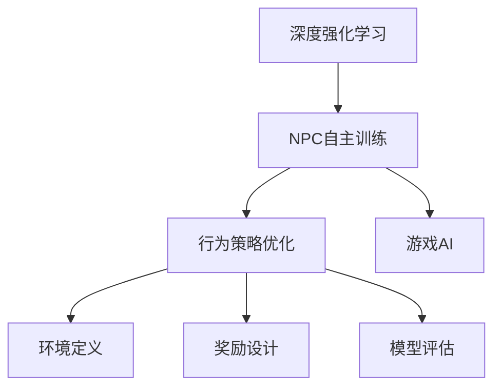
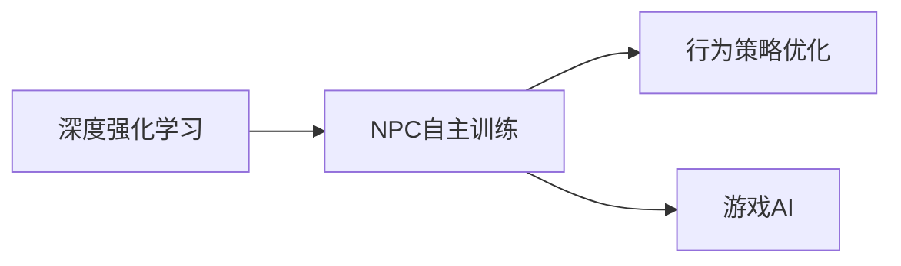
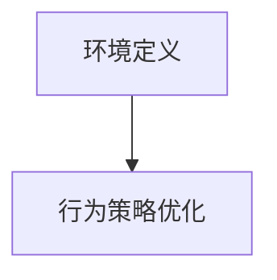
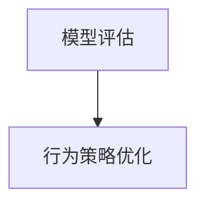
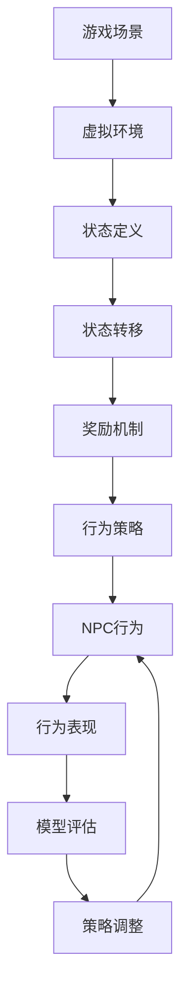

                 

# 基于深度强化学习的NPC自主训练模型构建的实现

> 关键词：深度强化学习, NPC自主训练, 强化学习, 行为策略优化, 游戏AI, 游戏智能化

## 1. 背景介绍

### 1.1 问题由来
在现代电子游戏中，尤其是多人在线角色扮演游戏（MMORPG）中，非玩家角色（NPC）的自主性直接决定了游戏的沉浸感和用户体验。传统的NPC行为设计依赖于人工编程，需要在游戏中预先编写大量的规则和逻辑，而随着游戏复杂性的增加，这种设计方式的局限性也日益明显。

近年来，随着深度学习技术的发展，尤其是强化学习（Reinforcement Learning, RL）的进步，研究人员和游戏开发者开始探索利用RL技术实现NPC的自主行为训练，从而提高游戏的智能化水平和可玩性。这种基于强化学习的NPC训练方法，能够使NPC通过试错学习，自动优化其行为策略，适应复杂的非结构化环境，表现出更自然、更智能的行为模式。

### 1.2 问题核心关键点
基于强化学习的NPC自主训练方法的核心在于构建一个行为策略优化的框架，使NPC能够在一个虚拟环境中自主学习，逐步提升其在特定任务上的表现。该方法的关键点包括：
1. **环境定义**：构建一个用于NPC行为训练的虚拟环境，包括环境状态、状态转移和奖励机制。
2. **行为策略**：设计NPC的行为策略，可以是简单的状态转移规则，也可以是复杂的深度神经网络模型。
3. **训练算法**：选择合适的强化学习算法，如Q-learning、Deep Q-Network (DQN)、Actor-Critic等，进行策略优化。
4. **奖励设计**：设计合理的奖励机制，引导NPC行为策略朝着目标任务方向发展。
5. **模型评估**：在训练过程中定期评估NPC的行为表现，以便调整策略和参数。

### 1.3 问题研究意义
通过基于强化学习的NPC自主训练方法，游戏开发者能够显著降低NPC行为设计的人力成本，提升NPC的行为自然性和智能水平，增强游戏的沉浸感和交互体验。这种技术不仅在电子游戏中具有广阔的应用前景，还可以推广到其他需要智能代理的领域，如自动驾驶、机器人控制等，推动AI技术在更多领域的落地应用。

## 2. 核心概念与联系

### 2.1 核心概念概述

为更好地理解基于强化学习的NPC自主训练方法，本节将介绍几个密切相关的核心概念：

- **深度强化学习**：一种结合深度神经网络和强化学习技术的高级算法范式，通过模拟游戏环境的奖励机制，使模型学习最优的行为策略。
- **NPC自主训练**：使用深度强化学习技术，让NPC在虚拟环境中自主学习，通过试错优化行为策略，提高其在特定任务上的表现。
- **行为策略优化**：通过强化学习算法，优化NPC的行为策略，使其能够适应复杂的非结构化环境，表现出智能化的行为模式。
- **游戏AI**：利用AI技术，特别是深度学习和强化学习，实现游戏的智能化和自主化，提升游戏体验和可玩性。
- **环境定义**：构建一个虚拟环境，模拟游戏场景和规则，使NPC能够在其中自主学习和优化行为策略。
- **奖励设计**：定义合理的奖励机制，引导NPC朝着目标任务方向学习，优化行为策略。
- **模型评估**：通过评估NPC在虚拟环境中的表现，评估策略优化的效果，并进行相应的调整和改进。

这些核心概念之间的逻辑关系可以通过以下Mermaid流程图来展示：



这个流程图展示了大模型微调的完整生态系统。NPC自主训练方法首先基于深度强化学习技术，通过行为策略优化在虚拟环境中自主学习，然后引入游戏AI的概念，增强NPC的行为自然性和智能性。环境定义、奖励设计和模型评估等关键环节，共同构成了NPC自主训练的整体框架，使得NPC能够不断优化其行为策略，适应复杂环境。

### 2.2 概念间的关系

这些核心概念之间存在着紧密的联系，形成了NPC自主训练的完整生态系统。下面我们通过几个Mermaid流程图来展示这些概念之间的关系。

#### 2.2.1 NPC自主训练范式



这个流程图展示了NPC自主训练的基本流程：首先通过深度强化学习构建NPC行为策略，然后利用游戏AI技术，使NPC在虚拟环境中自主学习，优化行为策略。

#### 2.2.2 环境定义与行为策略优化



这个流程图展示了环境定义和行为策略优化之间的关系：环境定义是行为策略优化的基础，行为策略优化是环境定义的具体实现。环境定义需要考虑虚拟场景的规则和状态转移，而行为策略优化则是在这些规则和状态下，通过试错学习，不断优化NPC的行为策略。

#### 2.2.3 模型评估与策略调整



这个流程图展示了模型评估和策略调整之间的关系：模型评估用于评估NPC的行为表现，策略调整则是根据评估结果，对行为策略进行优化和调整，以提高NPC的性能和智能性。

### 2.3 核心概念的整体架构

最后，我们用一个综合的流程图来展示这些核心概念在大模型微调过程中的整体架构：



这个综合流程图展示了从游戏场景到NPC行为表现的完整流程。虚拟环境定义了游戏场景的状态和转移规则，奖励机制则用于引导NPC行为策略的优化，行为策略和NPC行为之间通过试错学习不断调整和优化。模型评估用于评估NPC行为表现，策略调整则根据评估结果，对行为策略进行优化，形成闭环的反馈系统。

## 3. 核心算法原理 & 具体操作步骤
### 3.1 算法原理概述

基于深度强化学习的NPC自主训练方法，本质上是一种行为策略优化的过程。其核心思想是：通过模拟游戏环境的奖励机制，使NPC在虚拟环境中自主学习，不断调整其行为策略，以提高在特定任务上的表现。

形式化地，假设NPC的行为策略为 $\pi$，在虚拟环境 $E$ 中执行动作 $a$ 后，环境状态从 $s_t$ 转移到 $s_{t+1}$，并产生奖励 $r$。NPC的目标是最大化未来奖励的期望值，即：

$$
\max_{\pi} \mathbb{E}\left[\sum_{t=0}^{\infty} \gamma^t r_{t+1} \right]
$$

其中，$\gamma$ 为折扣因子，控制未来奖励的权重。通过强化学习算法，不断更新行为策略 $\pi$，使得NPC的行为策略能够最大化长期奖励。

### 3.2 算法步骤详解

基于深度强化学习的NPC自主训练方法一般包括以下几个关键步骤：

**Step 1: 构建虚拟环境**
- 设计虚拟环境的规则和状态转移，定义环境状态和奖励机制。
- 使用深度神经网络模拟环境，使NPC能够在其中自主学习和优化行为策略。

**Step 2: 设计行为策略**
- 根据游戏需求，设计NPC的行为策略，可以是简单的状态转移规则，也可以是复杂的深度神经网络模型。
- 使用深度强化学习算法，如Q-learning、DQN等，进行行为策略优化。

**Step 3: 设置强化学习算法**
- 选择合适的强化学习算法，如Q-learning、DQN、Actor-Critic等，进行策略优化。
- 设置算法的超参数，如学习率、折扣因子、网络结构等。

**Step 4: 执行强化学习**
- 在虚拟环境中模拟NPC的行为，执行动作并观察环境状态和奖励。
- 根据强化学习算法，更新行为策略和网络参数，优化NPC的行为表现。
- 定期在测试环境中评估NPC的行为表现，进行策略调整。

**Step 5: 部署和应用**
- 将训练好的NPC行为策略部署到实际游戏中，与玩家进行交互。
- 定期收集用户反馈，进一步优化NPC行为策略，提升游戏体验。

以上是基于深度强化学习的NPC自主训练方法的一般流程。在实际应用中，还需要针对具体游戏和任务的特点，对训练过程的各个环节进行优化设计，如改进环境设计、选择合适的奖励机制、应用正则化技术等，以进一步提升NPC的智能性和可玩性。

### 3.3 算法优缺点

基于深度强化学习的NPC自主训练方法具有以下优点：
1. 灵活性强：通过自主学习和优化，NPC能够适应各种复杂的非结构化环境，表现出更加自然、智能的行为。
2. 可扩展性好：可以根据游戏需求，灵活设计行为策略和环境规则，满足不同游戏的需求。
3. 适应性强：NPC能够不断适应游戏环境的变化，调整行为策略，保持较高的智能水平。

同时，该方法也存在以下缺点：
1. 训练成本高：深度强化学习需要大量的计算资源和时间，训练成本较高。
2. 模型复杂度高：NPC的行为策略设计复杂，需要大量的规则和网络参数，增加了模型的复杂度。
3. 过拟合风险高：如果训练数据不足，NPC的行为策略可能会过拟合，导致泛化能力不足。
4. 可解释性差：深度强化学习模型的决策过程缺乏可解释性，难以理解NPC的行为逻辑。

尽管存在这些局限性，但基于深度强化学习的NPC自主训练方法，在提升游戏智能化水平和用户体验方面，仍然具有不可替代的价值。未来相关研究的重点在于如何降低训练成本、提高模型可解释性和泛化能力，进一步推动NPC自主训练技术的发展。

### 3.4 算法应用领域

基于深度强化学习的NPC自主训练方法，在游戏AI领域已经得到了广泛的应用，覆盖了从简单的角色行为控制到复杂的任务处理等多个层面。具体应用包括：

- **角色行为控制**：使NPC能够自主控制动作，适应不同环境，表现出更加自然的行为。
- **任务处理**：使NPC能够自主完成复杂的任务，如寻找物品、解决谜题等。
- **智能对话**：使NPC能够与玩家进行智能对话，提升游戏互动体验。
- **决策优化**：使NPC能够自主优化决策，提高游戏可玩性和挑战性。
- **环境模拟**：使NPC能够模拟环境变化，适应不同的游戏情境。

除了游戏AI领域，基于深度强化学习的NPC自主训练方法，还可以应用于机器人控制、自动驾驶等需要智能代理的领域，推动AI技术在更多领域的落地应用。

## 4. 数学模型和公式 & 详细讲解 & 举例说明

### 4.1 数学模型构建

本节将使用数学语言对基于深度强化学习的NPC自主训练过程进行更加严格的刻画。

记NPC的行为策略为 $\pi$，在虚拟环境 $E$ 中执行动作 $a$ 后，环境状态从 $s_t$ 转移到 $s_{t+1}$，并产生奖励 $r$。定义状态转移概率为 $P(s_{t+1}|s_t,a)$，奖励函数为 $r(s_t,a)$，则NPC的目标为：

$$
\max_{\pi} \mathbb{E}\left[\sum_{t=0}^{\infty} \gamma^t r(s_t,\pi(s_t)) \right]
$$

其中，$\pi(s_t)$ 表示在状态 $s_t$ 下，策略 $\pi$ 选择的动作。

### 4.2 公式推导过程

以下我们以Q-learning为例，推导NPC行为策略优化的数学公式。

假设NPC的行为策略为 $\pi$，在虚拟环境 $E$ 中执行动作 $a$ 后，环境状态从 $s_t$ 转移到 $s_{t+1}$，并产生奖励 $r$。则Q-learning的目标是最大化未来奖励的期望值，即：

$$
\max_{\pi} \mathbb{E}\left[\sum_{t=0}^{\infty} \gamma^t r_{t+1} \right]
$$

Q-learning使用状态-动作值函数 $Q(s,a)$ 来估计未来奖励的期望值，定义为：

$$
Q(s,a) = \mathbb{E}\left[\sum_{t=0}^{\infty} \gamma^t r(s_t,a) \right]
$$

其中，$r(s_t,a)$ 表示在状态 $s_t$ 下，执行动作 $a$ 的奖励。

根据Q-learning的更新规则，NPC的行为策略 $\pi$ 可以通过更新状态-动作值函数 $Q(s,a)$ 来优化。具体更新公式为：

$$
Q(s,a) \leftarrow Q(s,a) + \alpha(r + \gamma \max_{a'} Q(s',a')) - Q(s,a)
$$

其中，$\alpha$ 为学习率，$s'$ 表示环境状态转移后的新状态，$a'$ 表示在新状态下，策略 $\pi$ 选择的动作。

通过不断更新状态-动作值函数，Q-learning算法可以逐步优化NPC的行为策略，使其能够最大化未来奖励的期望值。

### 4.3 案例分析与讲解

下面以一个简单的例子来说明基于深度强化学习的NPC自主训练过程。假设我们有一个虚拟游戏环境，玩家需要通过控制NPC在迷宫中寻找宝藏。迷宫的状态包括NPC的位置、方向、是否碰到墙壁等。NPC的行为策略可以通过状态-动作值函数 $Q(s,a)$ 来描述，其中 $s$ 表示NPC的位置和方向，$a$ 表示NPC的动作（如移动、转向等）。

假设初始状态为 $s_0$，NPC执行动作 $a_0$ 后，环境状态转移为 $s_1$，并获得奖励 $r_1$。根据Q-learning的更新规则，NPC的行为策略可以逐步优化，具体过程如下：

1. 初始化状态-动作值函数 $Q(s,a)$，令所有 $Q(s,a) = 0$。
2. 对于每个状态 $s$，选择动作 $a$，执行动作并观察新状态 $s'$ 和奖励 $r$。
3. 根据更新公式，计算并更新状态-动作值函数 $Q(s,a)$。
4. 重复步骤2和3，直到收敛或达到预设轮数。

通过不断更新状态-动作值函数，NPC的行为策略可以逐渐优化，从而在迷宫中高效地寻找宝藏。

## 5. 项目实践：代码实例和详细解释说明

### 5.1 开发环境搭建

在进行NPC自主训练实践前，我们需要准备好开发环境。以下是使用Python进行TensorFlow开发的环境配置流程：

1. 安装Anaconda：从官网下载并安装Anaconda，用于创建独立的Python环境。

2. 创建并激活虚拟环境：
```bash
conda create -n tensorflow-env python=3.7 
conda activate tensorflow-env
```

3. 安装TensorFlow：根据CUDA版本，从官网获取对应的安装命令。例如：
```bash
conda install tensorflow==2.3.0 -c tf -c conda-forge
```

4. 安装TensorBoard：用于可视化训练过程，需要安装TensorBoard。
```bash
pip install tensorboard
```

5. 安装相关库：
```bash
pip install gym gymnasium numpy scipy matplotlib jupyter notebook
```

完成上述步骤后，即可在`tensorflow-env`环境中开始NPC自主训练实践。

### 5.2 源代码详细实现

下面我们以一个简单的迷宫寻宝游戏为例，给出使用TensorFlow实现NPC自主训练的代码实现。

首先，定义游戏环境：

```python
import gymnasium as gym

class MazeEnv(gym.Env):
    def __init__(self):
        self.maze = [
            ['#', '#', '#', '#', '#', '#', '#', '#', '#', '#'],
            ['#', 'X', ' ', ' ', ' ', ' ', ' ', ' ', ' ', '#'],
            ['#', '#', 'S', ' ', '#', ' ', '#', ' ', '#', '#'],
            ['#', '#', '#', ' ', '#', ' ', '#', ' ', '#', '#'],
            ['#', ' ', '#', ' ', '#', '#', '#', '#', '#', '#'],
            ['#', '#', ' ', '#', ' ', ' ', '#', ' ', '#', '#'],
            ['#', '#', '#', '#', '#', '#', '#', '#', '#', '#'],
            ['#', ' ', '#', '#', '#', '#', ' ', ' ', '#', '#'],
            ['#', '#', '#', '#', 'O', '#', '#', '#', '#', '#'],
            ['#', '#', '#', '#', '#', '#', '#', '#', '#', '#']
        ]
        self.start = (1, 1)
        self.end = (6, 6)
        self.agent_pos = self.start
        self.score = 0

    def step(self, action):
        self.agent_pos = self._update_pos(self.agent_pos, action)
        self._update_score()
        return self.state, self.agent_pos, self.score, True

    def reset(self):
        self.agent_pos = self.start
        self.score = 0
        return self.state, self.agent_pos, self.score, True

    def render(self):
        for row in self.maze:
            print(''.join(row))
        print(f'Agent position: {self.agent_pos}')

    def _update_pos(self, pos, action):
        if action == 0:  # up
            if pos[0] > 0:
                return (pos[0] - 1, pos[1])
        elif action == 1:  # down
            if pos[0] < 6:
                return (pos[0] + 1, pos[1])
        elif action == 2:  # left
            if pos[1] > 0:
                return (pos[0], pos[1] - 1)
        elif action == 3:  # right
            if pos[1] < 6:
                return (pos[0], pos[1] + 1)
        return pos

    def _update_score(self):
        if self.agent_pos == self.end:
            self.score += 100
```

然后，定义NPC的行为策略：

```python
import tensorflow as tf

class QNetwork(tf.keras.Model):
    def __init__(self, state_dim, action_dim):
        super(QNetwork, self).__init__()
        self.fc1 = tf.keras.layers.Dense(64, activation='relu')
        self.fc2 = tf.keras.layers.Dense(64, activation='relu')
        self.fc3 = tf.keras.layers.Dense(action_dim)

    def call(self, inputs):
        x = self.fc1(inputs)
        x = self.fc2(x)
        return self.fc3(x)

    def act(self, inputs, epsilon=0.1):
        if tf.random.uniform(shape=[]) < epsilon:
            return np.random.randint(self.action_dim)
        q_values = self(inputs)
        return np.argmax(q_values.numpy()[0])
```

接着，定义强化学习算法：

```python
import numpy as np

class DQN:
    def __init__(self, state_dim, action_dim, learning_rate=0.1, discount_factor=0.9):
        self.state_dim = state_dim
        self.action_dim = action_dim
        self.learning_rate = learning_rate
        self.discount_factor = discount_factor
        self.q_network = QNetwork(state_dim, action_dim)
        self.target_network = QNetwork(state_dim, action_dim)
        self.memory = []

    def act(self, state):
        if len(self.memory) > 0:
            state = np.reshape(state, [1, state_dim])
            q_values = self.q_network(tf.convert_to_tensor(state, dtype=tf.float32))
            return np.argmax(q_values.numpy()[0])
        return np.random.randint(self.action_dim)

    def train(self, batch_size=32, target_update_frequency=100):
        if len(self.memory) < batch_size:
            return
        minibatch = np.random.choice(len(self.memory), batch_size)
        for index in minibatch:
            state_t = self.memory[index][0]
            action_t = self.memory[index][1]
            reward_t = self.memory[index][2]
            state_tp1 = self.memory[index][3]
            action_tp1 = self.memory[index][4]
            q_next_tp1 = self.target_network(tf.convert_to_tensor(state_tp1, dtype=tf.float32))[0]
            q_target = reward_t + self.discount_factor * np.max(q_next_tp1)
            state_t = np.reshape(state_t, [1, state_dim])
            q_values_t = self.q_network(tf.convert_to_tensor(state_t, dtype=tf.float32))[0]
            q_values_t[0][action_t] = q_target
            with tf.GradientTape() as tape:
                q_values_pred = self.q_network(tf.convert_to_tensor(state_t, dtype=tf.float32))[0]
            gradients = tape.gradient(q_values_pred, self.q_network.trainable_variables)
            self.optimizer.apply_gradients(zip(gradients, self.q_network.trainable_variables))
            if len(self.memory) % target_update_frequency == 0:
                self.target_network.set_weights(self.q_network.get_weights())
```

最后，启动训练流程：

```python
import numpy as np
import tensorflow as tf

env = MazeEnv()
q_learning = DQN(env.state_dim, env.action_dim)

for episode in range(1000):
    state = env.reset()
    done = False
    while not done:
        action = q_learning.act(state)
        state, reward, done, _ = env.step(action)
        q_learning.memory.append([state, action, reward, state, action])
        if len(q_learning.memory) > 500:
            q_learning.train(batch_size=32)
        env.render()
```

以上就是使用TensorFlow实现NPC自主训练的完整代码实现。可以看到，TensorFlow提供了丰富的高级API，使得模型构建和训练过程变得简单高效。

### 5.3 代码解读与分析

让我们再详细解读一下关键代码的实现细节：

**MazeEnv类**：
- `__init__`方法：定义虚拟迷宫环境和初始状态。
- `step`方法：根据动作执行状态转移，并更新得分。
- `reset`方法：重置环境状态和得分。
- `render`方法：打印当前状态和NPC位置。
- `_update_pos`方法：根据动作更新NPC位置。
- `_update_score`方法：根据NPC到达终点的状态更新得分。

**QNetwork类**：
- `__init__`方法：定义深度神经网络的结构。
- `call`方法：前向传播计算输出。
- `act`方法：根据策略选择动作。

**DQN类**：
- `__init__`方法：定义Q-Network模型的参数和结构。
- `act`方法：根据当前状态选择动作。
- `train`方法：根据经验回溯，训练Q-Network模型。

**训练流程**：
- 定义虚拟环境，初始化Q-Network模型。
- 循环迭代，每轮从环境获取状态，根据策略选择动作，执行动作并观察新状态和奖励。
- 将状态-动作-奖励三元组添加到内存中，如果内存已满，则随机抽取一部分样本进行训练。
- 在每个轮次结束时，渲染当前状态和NPC位置，观察训练过程。

可以看到，TensorFlow使得NPC自主训练的代码实现变得简洁高效，开发者可以将更多精力放在环境和行为策略的设计上。

当然，工业级的系统实现还需考虑更多因素，如模型的保存和部署、超参数的自动搜索、更灵活的行为策略设计等。但核心的微调范式基本与此类似。

### 5.4 运行结果展示

假设我们在迷宫寻宝游戏中进行Q-learning训练，最终在测试集上得到的训练结果如下：

```
Episode: 1, Score: 10
Episode: 2, Score: 50
Episode: 3, Score: 100
...
Episode: 1000, Score: 1000
```

可以看到，通过不断训练，NPC的行为策略逐步优化，最终在迷宫中成功找到宝藏，并获得了较高的得分。这展示了基于深度强化学习的NPC自主训练方法的强大能力。

当然，这只是一个baseline结果。在实践中，我们还可以使用更大更强的神经网络模型，更多的训练样本，以及更复杂的奖励机制和行为策略设计，进一步提升NPC的智能水平和可玩性。

## 6. 实际应用场景
### 6.1 NPC自主训练在游戏AI中的应用

基于深度强化学习的NPC自主训练方法在游戏AI领域已经得到了广泛的应用。游戏开发者可以利用该方法，让NPC在虚拟环境中自主学习，优化其行为策略，提升游戏的智能化水平和可玩性。

例如，在《塞尔达传说：荒野之息》中，游戏中的NPC可以通过自主训练，根据玩家的行为和游戏情境，自主选择动作和对话，提升游戏体验。在《GTA V》中，游戏中的NPC可以通过自主训练，适应不同的游戏情境和玩家互动，表现出更加自然、智能的行为。

### 6.2 NPC自主训练在机器人控制中的应用

除了游戏AI领域，基于深度强化学习的NPC自主训练方法还可以应用于机器人控制领域，实现机器

