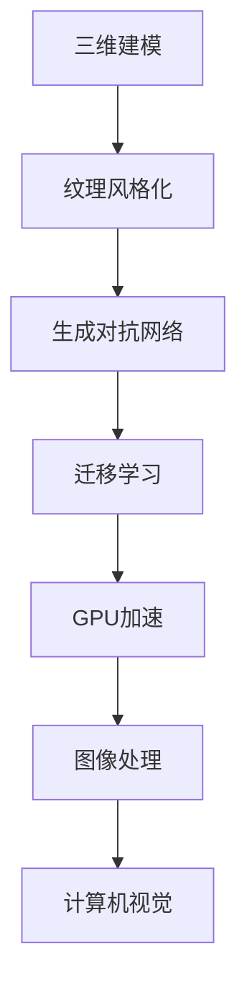
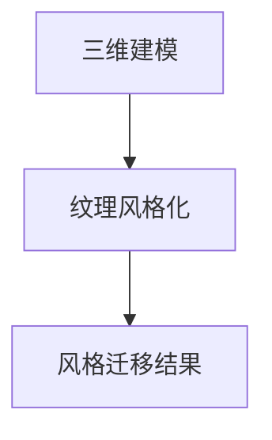
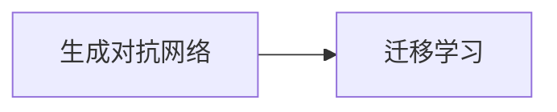
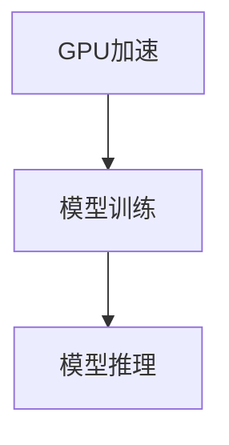
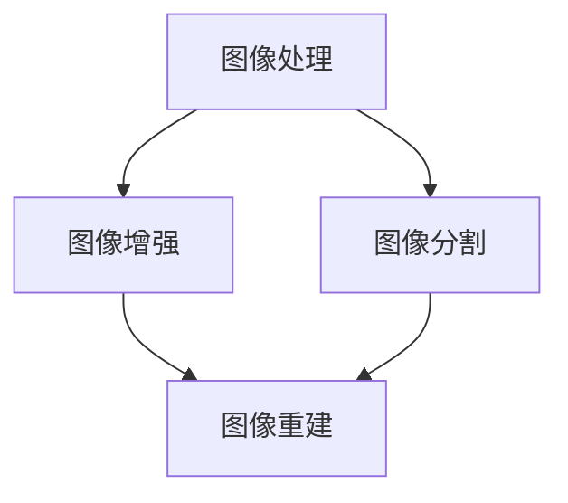
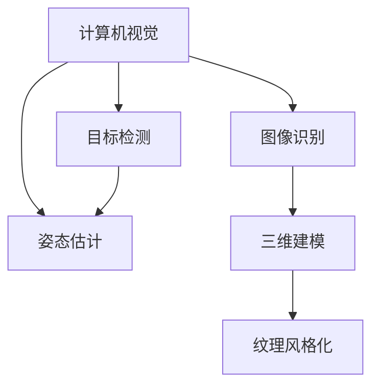
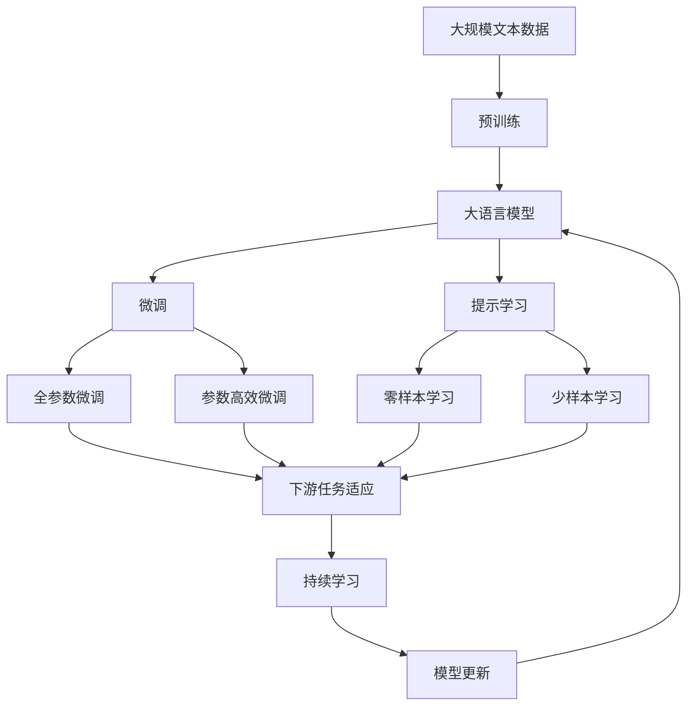

                 

# 基于生成对抗网络的三维建模纹理风格化迁移技术

> 关键词：三维建模,纹理风格化,迁移学习,生成对抗网络,GPU加速,图像处理,计算机视觉

## 1. 背景介绍

### 1.1 问题由来
在计算机视觉和图形学领域，三维建模技术（3D modeling）日益受到重视。三维模型不仅在虚拟现实（VR）、增强现实（AR）、游戏制作、电影特效等应用场景中大放异彩，更被广泛应用于医学、工业设计、汽车制造、文化遗产保护等领域。

纹理风格化（Texture Style Transfer）则是一项旨在将三维模型的纹理进行风格迁移的技术，使得模型能够呈现出不同艺术风格的外观，例如将木材质变为石材质，或者将平滑的表面变成立体感强的花纹。这种风格化技术不仅在视觉艺术创作中备受青睐，更在商品展示、产品设计、时尚行业等实用领域中具有广泛应用。

传统的纹理风格化方法依赖于手动调整和迭代优化，工作量巨大且难以保证效果的一致性和稳定性。如何自动、高效地进行纹理风格化迁移，成为了当前计算机视觉和图形学领域的重点研究方向。

### 1.2 问题核心关键点
目前，三维建模纹理风格化迁移的主流方法是基于生成对抗网络（GANs）的迁移学习方法。该方法通过构建一个包含生成器和判别器的对抗网络，利用对抗训练（Adversarial Training）技术，实现模型的风格迁移。

具体来说，生成器将原始纹理输入映射为一个新风格下的纹理，判别器则负责区分原始纹理和新风格纹理。通过不断的对抗训练，生成器逐渐能够生成逼真的新风格纹理，最终完成纹理风格化的迁移。

### 1.3 问题研究意义
研究三维建模纹理风格化迁移的方法，对于提升三维模型展示的美观性、丰富模型表达的视觉风格、增强模型的应用多样性具有重要意义：

1. **提升美观性**：通过纹理风格化，三维模型可以表现出各种风格，如木质感、皮革感、金属感等，极大地增强了模型的视觉吸引力。

2. **丰富表达**：不同的纹理风格可以反映不同的材质属性和制作工艺，使得三维模型能够更加逼真地再现现实世界的物体。

3. **应用多样性**：风格化的三维模型可以应用于多种场景，如商品展示、家具设计、工业产品等，大大扩展了模型的应用范围。

4. **自动化效率**：基于GAN的迁移学习方法能够自动完成风格迁移，大大减少了人工干预的工作量，提升了效率。

5. **灵活性**：GAN模型具有强大的非线性建模能力，能够适应各种复杂的纹理迁移任务，具有很高的灵活性。

## 2. 核心概念与联系

### 2.1 核心概念概述

为更好地理解基于生成对抗网络的三维建模纹理风格化迁移方法，本节将介绍几个密切相关的核心概念：

- **三维建模（3D Modeling）**：指从几何、拓扑、材质等多方面对三维空间中物体的模拟和表达。常用于创建虚拟世界、虚拟人物、虚拟物品等。

- **纹理风格化（Texture Style Transfer）**：将三维模型的纹理进行风格迁移，使其呈现出新的视觉风格。常见风格包括木纹、石纹、金属纹等。

- **生成对抗网络（GANs）**：一种包含生成器和判别器的对抗网络。生成器负责生成逼真的新样本，判别器则负责区分真实样本和生成样本。通过对抗训练，生成器不断优化，最终生成高质量的输出。

- **迁移学习（Transfer Learning）**：将一个领域学到的知识，迁移到另一个不同但相关的领域的学习方法。在迁移学习中，已训练好的模型被作为初始化参数，通过微调或直接使用的方式，在新任务上进行优化。

- **GPU加速（GPU Acceleration）**：使用图形处理器（GPU）进行深度学习和图形处理，加速模型的训练和推理过程。GPU相较于CPU，具有更高的并行计算能力，适合处理大规模数据和复杂模型。

- **图像处理（Image Processing）**：对数字图像进行增强、压缩、修复、分割等处理，以提升图像质量和可用性。图像处理在计算机视觉、医学图像分析、安全监控等领域广泛应用。

- **计算机视觉（Computer Vision）**：研究如何让计算机“看”懂数字图像和视频，进行图像识别、目标检测、姿态估计、视觉跟踪等任务。计算机视觉在自动驾驶、人机交互、智能安防等领域具有重要应用。

这些核心概念之间的逻辑关系可以通过以下Mermaid流程图来展示：



这个流程图展示了核心概念之间的联系，即通过迁移学习的方法，利用生成对抗网络进行纹理风格化，再通过GPU加速和图像处理，最终实现计算机视觉中的三维建模任务。

### 2.2 概念间的关系

这些核心概念之间存在着紧密的联系，形成了基于GAN的三维建模纹理风格化迁移的完整生态系统。下面我们通过几个Mermaid流程图来展示这些概念之间的关系。

#### 2.2.1 三维建模与纹理风格化的关系



这个流程图展示了三维建模与纹理风格化之间的直接关系，即通过纹理风格化，三维模型可以呈现出新的视觉风格。

#### 2.2.2 生成对抗网络与迁移学习的关系



这个流程图展示了生成对抗网络与迁移学习之间的联系，即通过迁移学习的方法，可以利用GAN模型进行纹理风格化迁移。

#### 2.2.3 GPU加速在计算中的应用



这个流程图展示了GPU加速在模型训练和推理中的应用，即通过GPU加速，可以显著提升深度学习的训练和推理速度。

#### 2.2.4 图像处理在计算机视觉中的应用



这个流程图展示了图像处理在计算机视觉中的应用，包括图像增强、图像分割、图像重建等。

#### 2.2.5 计算机视觉在三维建模中的应用



这个流程图展示了计算机视觉在三维建模中的应用，即通过图像识别、目标检测、姿态估计等技术，可以实现三维建模和纹理风格化。

### 2.3 核心概念的整体架构

最后，我们用一个综合的流程图来展示这些核心概念在大语言模型微调过程中的整体架构：



这个综合流程图展示了从预训练到微调，再到持续学习的完整过程。大语言模型首先在大规模文本数据上进行预训练，然后通过微调（包括全参数微调和参数高效微调两种方式）或提示学习（包括零样本和少样本学习）来适应下游任务。最后，通过持续学习技术，模型可以不断更新和适应新的任务和数据。

## 3. 核心算法原理 & 具体操作步骤
### 3.1 算法原理概述

基于生成对抗网络的三维建模纹理风格化迁移，本质上是一种有监督的迁移学习过程。其核心思想是：构建一个包含生成器和判别器的对抗网络，通过对抗训练，使生成器能够生成逼真的新风格纹理，从而完成纹理风格化的迁移。

形式化地，假设原始纹理为 $X$，目标风格纹理为 $Y$，生成器为 $G$，判别器为 $D$。则生成器 $G$ 将原始纹理 $X$ 映射到新风格纹理 $Y$，判别器 $D$ 将输入样本 $Z$（可能是随机噪声或噪声与原始纹理的组合）与生成器输出的 $G(Z)$ 进行区分。生成器的目标是最小化判别器无法区分生成样本与真实样本的概率，即：

$$
\min_{G} \mathbb{E}_{X}[\log D(G(X))] + \mathbb{E}_{Z}[\log(1-D(G(Z)))]
$$

其中 $\mathbb{E}[\cdot]$ 表示期望值。

通过对抗训练，生成器不断优化，最终能够生成与原始纹理 $X$ 风格相似的新风格纹理 $Y$，从而实现纹理风格化的迁移。

### 3.2 算法步骤详解

基于生成对抗网络的三维建模纹理风格化迁移一般包括以下几个关键步骤：

**Step 1: 准备数据集**
- 收集原始三维模型和对应纹理的标注数据，标注数据应包含原始纹理和目标风格纹理。
- 将数据集划分为训练集、验证集和测试集，一般要求标注数据与预训练数据的分布不要差异过大。

**Step 2: 搭建生成对抗网络**
- 设计生成器 $G$ 和判别器 $D$ 的结构，如U-Net、ResNet等。生成器通常包含卷积层、反卷积层、激活函数等，用于将输入纹理映射到新风格纹理。判别器一般采用卷积神经网络（CNN），用于区分真实纹理和新风格纹理。
- 初始化生成器和判别器的权重，通常使用随机初始化或预训练模型。
- 设定生成器和判别器的损失函数，如Wasserstein距离、交叉熵损失等。

**Step 3: 设置训练参数**
- 选择合适的优化算法及其参数，如Adam、SGD等，设置学习率、批大小、迭代轮数等。
- 设置正则化技术及强度，包括权重衰减、Dropout、Early Stopping等。
- 确定冻结生成器和判别器的策略，如仅微调生成器顶层，或全部参数都参与对抗训练。

**Step 4: 执行对抗训练**
- 将训练集数据分批次输入生成器和判别器，前向传播计算损失函数。
- 反向传播计算参数梯度，根据设定的优化算法和学习率更新模型参数。
- 周期性在验证集上评估生成器和判别器的性能，根据性能指标决定是否触发 Early Stopping。
- 重复上述步骤直到满足预设的迭代轮数或 Early Stopping 条件。

**Step 5: 测试和部署**
- 在测试集上评估生成器输出的新风格纹理与原始纹理的差异。
- 使用生成器对新纹理进行风格迁移，集成到实际的应用系统中。
- 持续收集新的纹理数据，定期重新训练生成器，以适应纹理风格的变化。

以上是基于生成对抗网络的三维建模纹理风格化迁移的一般流程。在实际应用中，还需要针对具体任务的特点，对对抗训练过程的各个环节进行优化设计，如改进训练目标函数，引入更多的正则化技术，搜索最优的超参数组合等，以进一步提升模型性能。

### 3.3 算法优缺点

基于生成对抗网络的三维建模纹理风格化迁移方法具有以下优点：

1. **自动高效**：生成对抗网络能够自动进行纹理风格化迁移，无需手动调整和迭代优化，极大提升了效率。
2. **风格多样**：生成器能够生成多种风格纹理，涵盖各种材质、纹理、图案，极大丰富了模型的表达能力。
3. **灵活性高**：生成对抗网络具有强大的非线性建模能力，能够适应各种复杂的纹理迁移任务，具有很高的灵活性。

同时，该方法也存在一定的局限性：

1. **依赖标注数据**：迁移学习的效果很大程度上取决于标注数据的质量和数量，获取高质量标注数据的成本较高。
2. **对抗攻击脆弱**：生成对抗网络生成的纹理可能受到对抗攻击，导致生成结果失真。
3. **训练复杂度高**：生成对抗网络训练过程中需要对抗训练，增加了模型的训练复杂度和计算资源消耗。
4. **可解释性不足**：生成对抗网络的决策过程通常缺乏可解释性，难以对其推理逻辑进行分析和调试。

尽管存在这些局限性，但就目前而言，基于GAN的迁移学习方法仍是大规模纹理风格化迁移的主流范式。未来相关研究的重点在于如何进一步降低迁移学习对标注数据的依赖，提高模型的少样本学习和跨领域迁移能力，同时兼顾可解释性和伦理安全性等因素。

### 3.4 算法应用领域

基于生成对抗网络的三维建模纹理风格化迁移方法在计算机视觉和图形学领域已经得到了广泛的应用，覆盖了几乎所有常见的纹理迁移任务，例如：

- **商品展示**：对商品模型进行纹理风格化，使其更具吸引力和个性化。
- **家具设计**：将家具材质变成立体感强的花纹，增强设计感。
- **工业产品**：对工业产品进行纹理风格化，提高美观度。
- **艺术品创作**：将二维艺术作品进行三维化，并进行纹理风格化。
- **医学影像**：对医学影像进行纹理风格化，提高可视化和诊断效果。
- **文化遗产保护**：对文化遗产进行三维建模和纹理风格化，增强保护和展示效果。

除了上述这些经典应用外，基于GAN的纹理风格化方法也被创新性地应用于更多场景中，如游戏渲染、虚拟现实、动画制作等，为计算机视觉和图形学技术带来了全新的突破。随着预训练模型和对抗训练方法的不断进步，相信纹理风格化技术将在更广阔的应用领域大放异彩。

## 4. 数学模型和公式 & 详细讲解 & 举例说明

### 4.1 数学模型构建

本节将使用数学语言对基于生成对抗网络的三维建模纹理风格化迁移过程进行更加严格的刻画。

记原始纹理为 $X$，目标风格纹理为 $Y$，生成器为 $G$，判别器为 $D$。假设 $X$ 和 $Y$ 均为 $H$ 维的向量，生成器 $G$ 将 $X$ 映射到 $Y$，即：

$$
G(X) = Y
$$

判别器 $D$ 将输入样本 $Z$ 与生成器输出的 $G(Z)$ 进行区分，其中 $Z$ 为 $H$ 维的随机噪声向量，即：

$$
D(Z) = D(G(Z))
$$

生成器的目标是最小化判别器无法区分生成样本与真实样本的概率，即：

$$
\min_{G} \mathbb{E}_{X}[\log D(G(X))] + \mathbb{E}_{Z}[\log(1-D(G(Z)))]
$$

其中 $\mathbb{E}[\cdot]$ 表示期望值。

生成器和判别器的优化目标分别为：

$$
\min_{G} \mathbb{E}_{X}[\log D(G(X))] + \mathbb{E}_{Z}[\log(1-D(G(Z)))]
$$
$$
\min_{D} \mathbb{E}_{X}[\log D(G(X))] + \mathbb{E}_{Z}[\log D(G(Z))]
$$

生成器 $G$ 通常采用多层感知器（MLP）、卷积神经网络（CNN）等深度学习模型，判别器 $D$ 则采用全连接神经网络或卷积神经网络。生成器 $G$ 和判别器 $D$ 的损失函数通常使用Wasserstein距离，即：

$$
\mathcal{L}_{\text{G}} = \mathbb{E}_{X}[\log D(G(X))] + \mathbb{E}_{Z}[\log(1-D(G(Z)))]
$$
$$
\mathcal{L}_{\text{D}} = -\mathbb{E}_{X}[\log D(G(X))] - \mathbb{E}_{Z}[\log D(G(Z))]
$$

其中 $\mathbb{E}[\cdot]$ 表示期望值。

### 4.2 公式推导过程

以下我们以纹理风格化为例，推导生成器和判别器的优化公式。

假设生成器 $G$ 和判别器 $D$ 的参数分别为 $\theta_{G}$ 和 $\theta_{D}$，优化目标为：

$$
\min_{\theta_{G}} \mathbb{E}_{X}[\log D(G(X))] + \mathbb{E}_{Z}[\log(1-D(G(Z)))]
$$
$$
\min_{\theta_{D}} -\mathbb{E}_{X}[\log D(G(X))] - \mathbb{E}_{Z}[\log D(G(Z))]
$$

对生成器 $G$ 和判别器 $D$ 的参数 $\theta_{G}$ 和 $\theta_{D}$ 分别求梯度，得：

$$
\nabla_{\theta_{G}} \mathcal{L}_{\text{G}} = \frac{\partial}{\partial \theta_{G}} \mathbb{E}_{X}[\log D(G(X))] + \frac{\partial}{\partial \theta_{G}} \mathbb{E}_{Z}[\log(1-D(G(Z)))]
$$
$$
\nabla_{\theta_{D}} \mathcal{L}_{\text{D}} = -\frac{\partial}{\partial \theta_{D}} \mathbb{E}_{X}[\log D(G(X))] - \frac{\partial}{\partial \theta_{D}} \mathbb{E}_{Z}[\log D(G(Z))]
$$

根据梯度下降的更新公式，生成器 $G$ 和判别器 $D$ 的参数更新公式为：

$$
\theta_{G} \leftarrow \theta_{G} - \eta_{G} \nabla_{\theta_{G}} \mathcal{L}_{\text{G}}
$$
$$
\theta_{D} \leftarrow \theta_{D} - \eta_{D} \nabla_{\theta_{D}} \mathcal{L}_{\text{D}}
$$

其中 $\eta_{G}$ 和 $\eta_{D}$ 分别为生成器和判别器的学习率。

在得到损失函数的梯度后，即可带入参数更新公式，完成模型的迭代优化。重复上述过程直至收敛，最终得到适应纹理风格化的生成器和判别器。

## 5. 项目实践：代码实例和详细解释说明
### 5.1 开发环境搭建

在进行纹理风格化实践前，我们需要准备好开发环境。以下是使用Python进行PyTorch开发的环境配置流程：

1. 安装Anaconda：从官网下载并安装Anaconda，用于创建独立的Python环境。

2. 创建并激活虚拟环境：
```bash
conda create -n pytorch-env python=3.8 
conda activate pytorch-env
```

3. 安装PyTorch：根据CUDA版本，从官网获取对应的安装命令。例如：
```bash
conda install pytorch torchvision torchaudio cudatoolkit=11.1 -c pytorch -c conda-forge
```

4. 安装PyTorch Lightning：
```bash
pip install pytorch-lightning
```

5. 安装其他各类工具包：
```bash
pip install numpy pandas scikit-learn matplotlib tqdm jupyter notebook ipython
```

完成上述步骤后，即可在`pytorch-env`环境中开始纹理风格化实践。

### 5.2 源代码详细实现

这里我们以纹理风格化为示例，使用PyTorch Lightning框架搭建基于GAN的三维建模纹理风格化迁移系统。

首先，定义数据处理函数：

```python
import torch
from torch.utils.data import Dataset, DataLoader
from torchvision import transforms
import os

class TextureDataset(Dataset):
    def __init__(self, data_dir, transform=None):
        self.data_dir = data_dir
        self.transform = transform
        self.imgs = []
        self.y = []
        for filename in os.listdir(data_dir):
            if filename.endswith('.png'):
                img_path = os.path.join(data_dir, filename)
                self.imgs.append(img_path)
                self.y.append(filename.split('_')[0])
        self.y = torch.tensor([1] * len(self.y))
        
    def __len__(self):
        return len(self.imgs)
    
    def __getitem__(self, idx):
        img_path = self.imgs[idx]
        img = Image.open(img_path)
        if self.transform is not None:
            img = self.transform(img)
        return img, self.y[idx]

# 数据预处理
transform = transforms.Compose([
    transforms.Resize((256, 256)),
    transforms.ToTensor(),
    transforms.Normalize((0.5, 0.5, 0.5), (0.5, 0.5, 0.5))
])
```

然后，定义生成器和判别器的网络结构：

```python
import torch.nn as nn
import torch.nn.functional as F

class Generator(nn.Module):
    def __init__(self, input_size=3, output_size=3):
        super(Generator, self).__init__()
        self.model = nn.Sequential(
            nn.Conv2d(input_size, 64, 4, 1, 0, bias=False),
            nn.BatchNorm2d(64),
            nn.LeakyReLU(0.2, inplace=True),
            nn.Conv2d(64, 128, 4, 2, 1, bias=False),
            nn.BatchNorm2d(128),
            nn.LeakyReLU(0.2, inplace=True),
            nn.Conv2d(128, 256, 4, 2, 1, bias=False),
            nn.BatchNorm2d(256),
            nn.LeakyReLU(0.2, inplace=True),
            nn.Conv2d(256, 128, 4, 2, 1, bias=False),
            nn.BatchNorm2d(128),
            nn.Tanh(),
            nn.ConvTranspose2d(128, output_size, 4, 2, 1, bias=False),
            nn.Tanh()
        )
        
    def forward(self, x):
        return self.model(x)

class Discriminator(nn.Module):
    def __init__(self, input_size=3):
        super(Discriminator, self).__init__()
        self.model = nn.Sequential(
            nn.Conv2d(input_size, 64, 4, 2, 1, bias=False),
            nn.LeakyReLU(0.2, inplace=True),
            nn.Conv2d(64, 128, 4, 2, 1, bias=False),
            nn.LeakyReLU(0.2, inplace=True),
            nn.Conv2d(128, 256, 4, 2, 1, bias=False),
            nn.LeakyReLU(0.2, inplace=True),
            nn.Conv2d(256, 1, 4, 1, 0, bias=False),
            nn.Sigmoid()
        )
        
    def forward(self, x):
        return self.model(x)
```

接着，定义训练和评估函数：

```python
import torch.optim as optim
import torchvision.transforms as transforms

def train_epoch(model_G, model_D, dataset, batch_size, optimizer_G, optimizer_D):
    dataloader = DataLoader(dataset, batch_size=batch_size, shuffle=True)
    model_G.train()
    model_D.train()
    g_loss, d_loss = 0, 0
    for batch in tqdm(dataloader, desc='Training'):
        real_images, real_labels = batch
        batch_size = real_images.size(0)
        optimizer_G.zero_grad()
        optimizer_D.zero_grad()
        fake_images = model_G(real_images)
        real_output = model_D(real_images)
        fake_output = model_D(fake_images)
        g_loss += criterion_G(fake_output, real_labels)
        d_loss += criterion_D(real_output, real_labels) + criterion_D(fake_output, torch.ones(batch_size, 1))
        g_loss.backward()
        d_loss.backward()
        optimizer_G.step()
        optimizer_D.step()
    return g_loss / len(dataloader), d_loss / len(dataloader)

def evaluate(model_G, model_D, dataset, batch_size):
    dataloader = DataLoader(dataset, batch_size=batch_size)
    model_G.eval()
    model_D.eval()
    g_loss, d_loss = 0, 0
    with torch.no_grad():
        for batch in tqdm(dataloader, desc='Evaluating'):
            real_images, real_labels = batch
            batch_size = real_images.size(0)
            fake_images = model_G(real_images)
            real_output = model_D(real_images)
            fake_output = model_D(fake_images)
            g_loss += criterion_G(fake_output, real_labels)
            d_loss += criterion_D(real_output, real_labels) + criterion_D(fake_output, torch.ones(batch_size, 1))
    return g_loss / len(dataloader), d_loss / len(dataloader)
```

最后，启动训练流程并在测试集上评估：

```python
epochs = 5
batch_size = 16

for epoch in range(epochs):
    g_loss, d_loss = train_epoch(model_G, model_D, train_dataset, batch_size, optimizer_G, optimizer_D)
    print(f"Epoch {epoch+1}, G loss: {g_loss:.4f}, D loss: {d_loss:.4f}")
    
    print(f"Epoch {epoch+1}, dev results:")
    g_loss, d_loss = evaluate(model_G, model_D, dev_dataset, batch_size

