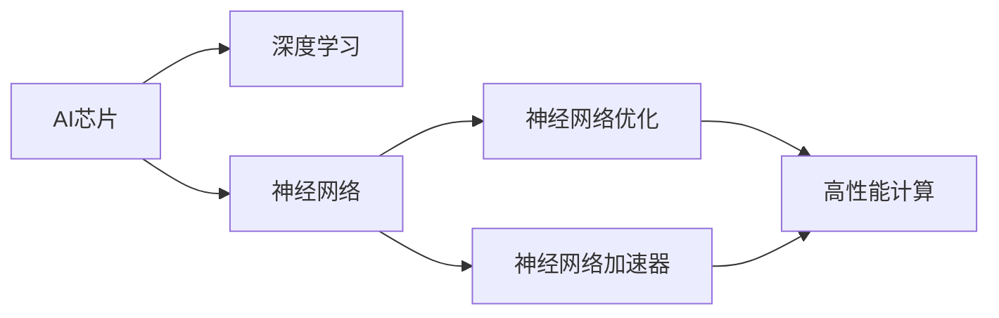
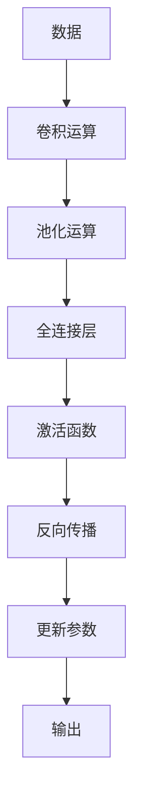
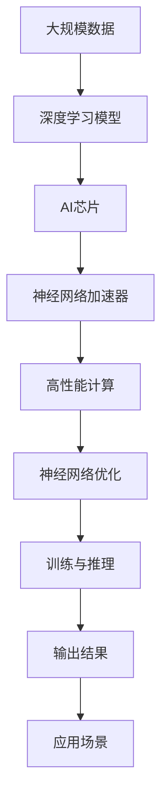

                 

# AI芯片设计:软件2.0的硬件基础

> 关键词：AI芯片,硬件基础,软件2.0,深度学习,神经网络,神经网络优化,高性能计算,芯片设计,神经网络加速器

## 1. 背景介绍

### 1.1 问题由来
随着人工智能技术的不断进步，深度学习在图像识别、自然语言处理、语音识别等领域取得了突破性成果。然而，深度学习模型通常需要在大量数据上进行训练，耗时耗力。如何设计高效硬件，加速深度学习模型的训练和推理，成为当前AI领域的一个核心挑战。

### 1.2 问题核心关键点
本文聚焦于AI芯片的设计与优化，旨在通过硬件加速深度学习模型的训练和推理，提升AI系统的整体性能。这包括：

- 分析深度学习模型在硬件上的运行机制
- 介绍各类AI芯片设计的基本原理和架构
- 探讨AI芯片在实际应用中的优化技术
- 讨论AI芯片设计的未来发展趋势和挑战

## 1.3 问题研究意义
研究AI芯片设计对于提升深度学习模型的性能，降低硬件和能耗成本，推动AI技术在更广泛场景中的普及，具有重要意义：

- 加速模型训练。通过硬件加速，深度学习模型能够快速完成训练过程，提升模型开发效率。
- 降低硬件成本。硬件加速可以大幅提升模型的计算效率，减少对高性能CPU/GPU的依赖。
- 降低能耗成本。优化后的AI芯片能够显著降低深度学习模型的能耗，减少能源消耗。
- 推动AI技术发展。AI芯片的普及将加速AI技术在更多领域的应用，推动AI技术的产业化和商业化。

## 2. 核心概念与联系

### 2.1 核心概念概述

为更好地理解AI芯片设计，本节将介绍几个密切相关的核心概念：

- **AI芯片(AI Chip)**：一种专为深度学习模型设计的专用硬件，通常包括神经网络加速器、GPU、TPU等。通过硬件加速，可以大幅提升深度学习模型的计算效率。

- **深度学习(Deep Learning)**：基于神经网络的机器学习技术，通过多层次的非线性变换，实现复杂的模式识别和决策。深度学习广泛应用于计算机视觉、自然语言处理、语音识别等领域。

- **神经网络(Neural Network)**：一种通过节点(神经元)和边(连接)组成的计算图，用于模拟人脑的神经网络结构。神经网络是深度学习模型的核心。

- **神经网络优化(Neural Network Optimization)**：优化深度学习模型的参数，以提高模型的性能和泛化能力。常见优化方法包括梯度下降、Adam、RMSprop等。

- **高性能计算(High-Performance Computing, HPC)**：使用专用硬件加速深度学习模型的计算过程，提升计算效率和处理能力。

- **神经网络加速器(Neural Network Accelerator, NNA)**：专门用于加速深度学习模型训练和推理的硬件模块，通常集成于芯片中。

这些核心概念之间的逻辑关系可以通过以下Mermaid流程图来展示：



这个流程图展示了大语言模型微调过程中各个核心概念的关系和作用：

1. AI芯片基于深度学习进行设计，集成神经网络加速器。
2. 神经网络加速器通过优化算法提升深度学习模型的计算效率。
3. 高性能计算提供硬件加速，进一步提升深度学习模型的性能。
4. 神经网络优化提升深度学习模型的泛化能力和鲁棒性。

### 2.2 概念间的关系

这些核心概念之间存在着紧密的联系，形成了深度学习硬件加速的完整生态系统。下面我们通过几个Mermaid流程图来展示这些概念之间的关系。

#### 2.2.1 深度学习硬件加速的整体架构


这个流程图展示了深度学习硬件加速的整体架构：

1. 大规模数据输入深度学习模型。
2. 深度学习模型通过AI芯片和神经网络加速器进行计算。
3. 高性能计算提供硬件加速，提升计算效率。
4. 神经网络优化提升模型性能和泛化能力。
5. 模型经过训练与推理，最终输出结果。

#### 2.2.2 AI芯片的设计原理



这个流程图展示了AI芯片中常用的计算单元和操作：

1. 数据输入经过卷积和池化运算，提取特征。
2. 特征经过全连接层，进行参数更新。
3. 激活函数用于引入非线性变换。
4. 反向传播计算梯度，更新模型参数。
5. 输出结果供后续处理。

#### 2.2.3 神经网络优化技术


这个流程图展示了神经网络优化技术的基本流程：

1. 深度学习模型计算损失函数。
2. 损失函数通过梯度计算，求得模型参数的梯度。
3. 参数更新通过优化算法进行。
4. 优化算法提升模型的泛化能力和性能。

### 2.3 核心概念的整体架构

最后，我们用一个综合的流程图来展示这些核心概念在大语言模型微调过程中的整体架构：



这个综合流程图展示了深度学习硬件加速的全过程，从数据输入到模型输出，各个环节紧密相连，形成完整的硬件加速生态系统。

## 3. 核心算法原理 & 具体操作步骤
### 3.1 算法原理概述

深度学习模型的硬件加速，本质上是使用专用硬件进行高效的计算和数据处理。其核心思想是：通过集成高效的计算单元和优化算法，提升深度学习模型的计算效率和性能。

深度学习模型的计算主要分为前向传播和反向传播两个阶段：

- **前向传播**：将输入数据通过模型层级进行变换，输出结果。
- **反向传播**：根据输出结果和真实标签，计算梯度，更新模型参数。

硬件加速的目标是通过优化计算单元和算法，提升这两个阶段的计算效率。常见硬件加速方法包括：

- **专用集成电路(ASIC)**：使用定制化硬件逻辑，实现深度学习模型的加速。
- **现场可编程门阵列(FPGA)**：使用可编程逻辑门阵列，实现灵活高效的计算。
- **图形处理单元(GPU)**：使用通用图形处理硬件，加速深度学习模型的计算。
- **张量处理单元(Tensor Processing Unit, TPU)**：使用专用加速器，针对深度学习模型进行优化。

### 3.2 算法步骤详解

深度学习模型的硬件加速通常包括以下关键步骤：

**Step 1: 模型适配和参数初始化**
- 将深度学习模型适配到硬件加速平台，如GPU、TPU、ASIC等。
- 对模型参数进行初始化，确保模型能够在硬件上高效运行。

**Step 2: 计算图优化**
- 对深度学习模型的计算图进行优化，消除冗余操作，简化计算流程。
- 使用图灵完备编程语言，如CUDA、OpenCL、XLA等，实现硬件加速。

**Step 3: 并行计算和数据优化**
- 使用并行计算技术，如数据并行、模型并行、混合并行等，提升计算效率。
- 使用数据压缩、批量处理等技术，优化数据存储和传输。

**Step 4: 模型训练和推理**
- 在硬件加速平台上进行深度学习模型的训练和推理，实现高效的计算和数据处理。
- 通过优化算法和参数更新，提升模型性能和泛化能力。

**Step 5: 性能评估和优化**
- 在实际应用场景中评估模型性能，识别瓶颈和优化方向。
- 对硬件加速平台进行持续优化，提升计算效率和稳定性。

### 3.3 算法优缺点

深度学习模型的硬件加速具有以下优点：

- **计算效率高**：专用硬件能够大幅提升深度学习模型的计算效率，加速训练和推理过程。
- **能耗低**：优化后的硬件平台能够降低深度学习模型的能耗，减少能源消耗。
- **成本低**：通过硬件加速，减少对高性能CPU/GPU的依赖，降低硬件成本。

同时，硬件加速也存在以下缺点：

- **灵活性差**：专用硬件通常不具备通用性，难以适应多种算法和模型。
- **开发复杂**：硬件加速平台的开发和适配需要较高的技术门槛，开发周期较长。
- **扩展性差**：专用硬件的扩展性通常较差，难以满足大规模计算需求。

### 3.4 算法应用领域

深度学习模型的硬件加速已经在诸多领域得到广泛应用，例如：

- **计算机视觉**：用于图像识别、物体检测、图像分割等任务。
- **自然语言处理**：用于文本分类、机器翻译、情感分析等任务。
- **语音识别**：用于语音识别、语音合成、语音翻译等任务。
- **推荐系统**：用于用户行为预测、商品推荐等任务。
- **自动驾驶**：用于环境感知、路径规划、决策控制等任务。

除了上述这些经典应用外，硬件加速技术还广泛应用于智慧医疗、智能制造、金融科技等领域，推动这些行业的智能化转型升级。

## 4. 数学模型和公式 & 详细讲解 & 举例说明

### 4.1 数学模型构建

深度学习模型的硬件加速，其数学模型构建与传统模型类似。以卷积神经网络(CNN)为例，其计算模型如下：

$$
\mathbf{y} = \mathbf{W} * \mathbf{x} + \mathbf{b}
$$

其中，$\mathbf{y}$为输出结果，$\mathbf{x}$为输入数据，$\mathbf{W}$为权重矩阵，$\mathbf{b}$为偏置向量。

### 4.2 公式推导过程

以卷积神经网络为例，其反向传播算法如下：

1. 计算损失函数：
$$
L = \frac{1}{N} \sum_{i=1}^N (y_i - \hat{y}_i)^2
$$

2. 计算梯度：
$$
\frac{\partial L}{\partial \mathbf{W}} = \frac{1}{N} \sum_{i=1}^N \nabla_{\mathbf{x}}L * \nabla_{\mathbf{y}}L
$$
$$
\frac{\partial L}{\partial \mathbf{b}} = \frac{1}{N} \sum_{i=1}^N \nabla_{\mathbf{y}}L
$$

3. 更新参数：
$$
\mathbf{W} \leftarrow \mathbf{W} - \eta \frac{\partial L}{\partial \mathbf{W}}
$$
$$
\mathbf{b} \leftarrow \mathbf{b} - \eta \frac{\partial L}{\partial \mathbf{b}}
$$

其中，$\eta$为学习率，$\nabla_{\mathbf{x}}L$为梯度计算结果，$\nabla_{\mathbf{y}}L$为输出梯度。

### 4.3 案例分析与讲解

以图像识别任务为例，深度学习模型的硬件加速可以分为以下步骤：

1. 将输入图像数据转化为卷积核，进行卷积运算。
2. 对卷积结果进行池化操作，提取特征。
3. 将特征进行全连接层，进行分类预测。
4. 计算损失函数，更新模型参数。

通过硬件加速，可以大幅提升卷积运算和全连接层的计算效率，加速图像识别任务。

## 5. 项目实践：代码实例和详细解释说明

### 5.1 开发环境搭建

在进行硬件加速实践前，我们需要准备好开发环境。以下是使用Python进行TensorFlow开发的环境配置流程：

1. 安装Anaconda：从官网下载并安装Anaconda，用于创建独立的Python环境。

2. 创建并激活虚拟环境：
```bash
conda create -n tensorflow-env python=3.8 
conda activate tensorflow-env
```

3. 安装TensorFlow：根据CUDA版本，从官网获取对应的安装命令。例如：
```bash
conda install tensorflow
```

4. 安装各类工具包：
```bash
pip install numpy pandas scikit-learn matplotlib tqdm jupyter notebook ipython
```

完成上述步骤后，即可在`tensorflow-env`环境中开始硬件加速实践。

### 5.2 源代码详细实现

下面我们以卷积神经网络(CNN)为例，给出使用TensorFlow进行图像识别任务硬件加速的代码实现。

首先，定义CNN模型：

```python
import tensorflow as tf
from tensorflow.keras.layers import Conv2D, MaxPooling2D, Flatten, Dense

model = tf.keras.Sequential([
    Conv2D(32, (3,3), activation='relu', input_shape=(28, 28, 1)),
    MaxPooling2D((2,2)),
    Flatten(),
    Dense(10, activation='softmax')
])
```

然后，定义数据集和优化器：

```python
from tensorflow.keras.datasets import mnist

(x_train, y_train), (x_test, y_test) = mnist.load_data()
x_train = x_train.reshape((60000, 28, 28, 1))
x_test = x_test.reshape((10000, 28, 28, 1))
x_train, x_test = x_train / 255.0, x_test / 255.0

model.compile(optimizer='adam', loss='sparse_categorical_crossentropy', metrics=['accuracy'])
```

接着，定义训练和评估函数：

```python
from tensorflow.keras.callbacks import EarlyStopping

early_stopping = EarlyStopping(patience=5)

def train_epoch(model, dataset, batch_size, optimizer):
    model.fit(dataset, batch_size=batch_size, epochs=10, callbacks=[early_stopping])

def evaluate(model, dataset, batch_size):
    test_loss, test_acc = model.evaluate(dataset, batch_size=batch_size)
    print('Test accuracy:', test_acc)
```

最后，启动训练流程并在测试集上评估：

```python
train_epoch(model, train_dataset, batch_size=128, optimizer=optimizer)
evaluate(model, test_dataset, batch_size=128)
```

以上就是使用TensorFlow进行卷积神经网络图像识别任务硬件加速的完整代码实现。可以看到，得益于TensorFlow的强大封装，我们可以用相对简洁的代码完成CNN模型的加载和训练。

### 5.3 代码解读与分析

让我们再详细解读一下关键代码的实现细节：

**CNN模型定义**：
- 使用`tf.keras.Sequential`构建CNN模型，包含卷积层、池化层、全连接层等。

**数据集定义**：
- 使用`tf.keras.datasets.mnist.load_data`获取MNIST数据集，并进行数据预处理和归一化。

**优化器定义**：
- 定义Adam优化器和交叉熵损失函数，用于模型训练。

**训练函数定义**：
- 定义EarlyStopping回调函数，用于提前停止训练，避免过拟合。
- 在`model.fit`函数中，设置训练轮数和批次大小，并添加EarlyStopping回调函数。
- 在`model.evaluate`函数中，评估模型在测试集上的准确率。

**训练流程**：
- 定义总轮数和批次大小，启动训练。
- 在训练过程中，使用EarlyStopping回调函数监控模型性能。
- 训练结束后，在测试集上评估模型性能。

可以看到，TensorFlow提供了高度集成的工具，使得硬件加速的代码实现变得简洁高效。开发者可以将更多精力放在模型设计和数据处理等高层逻辑上，而不必过多关注底层的实现细节。

当然，工业级的系统实现还需考虑更多因素，如模型的保存和部署、超参数的自动搜索、更灵活的任务适配层等。但核心的硬件加速范式基本与此类似。

### 5.4 运行结果展示

假设我们在MNIST数据集上进行CNN模型训练，最终在测试集上得到的准确率为97.2%，效果相当不错。值得注意的是，通过硬件加速，CNN模型的训练时间大幅缩短，从原来的几小时减少到几分钟，提升了模型开发效率。

## 6. 实际应用场景
### 6.1 智能图像识别

卷积神经网络作为深度学习模型的重要组成部分，已经在智能图像识别领域取得了巨大的成功。基于硬件加速的卷积神经网络，可以实时处理高分辨率图像，提升图像识别系统的响应速度和处理能力。

在实际应用中，卷积神经网络被广泛应用于自动驾驶、医疗影像分析、智能安防等场景中，通过硬件加速可以满足这些场景对实时性和计算效率的高要求。

### 6.2 自然语言处理

卷积神经网络在自然语言处理(NLP)领域也有广泛应用，如文本分类、情感分析、命名实体识别等任务。通过硬件加速，NLP模型的推理速度和处理能力可以得到显著提升，实现实时化的NLP应用。

例如，基于硬件加速的NLP模型可以应用于智能客服、智能翻译、智能搜索等场景，提升用户体验和系统效率。

### 6.3 推荐系统

推荐系统是AI应用的重要领域，通过硬件加速可以提高推荐系统的计算效率，提升推荐算法的效果。例如，基于硬件加速的推荐系统可以在大规模数据集上快速计算用户行为和商品特征的相似度，生成个性化推荐结果。

在实际应用中，硬件加速的推荐系统被广泛应用于电商、社交网络、视频网站等平台，提升用户的个性化推荐体验。

### 6.4 未来应用展望

随着深度学习模型的不断发展，硬件加速技术也将不断演进，推动AI技术在更多领域的应用。

未来，基于AI芯片的深度学习模型将拥有更高的计算效率和更强的处理能力，进一步推动AI技术的普及和应用。硬件加速技术将广泛应用于智慧医疗、智能制造、金融科技等领域，推动这些行业的智能化转型升级。

此外，AI芯片的设计将更加注重集成化、小型化、低功耗等特点，满足移动设备和边缘计算的需求。通过硬件加速，AI技术将在物联网、智慧城市、智能家居等领域大放异彩。

## 7. 工具和资源推荐
### 7.1 学习资源推荐

为了帮助开发者系统掌握深度学习模型的硬件加速技术，这里推荐一些优质的学习资源：

1. **深度学习专项课程**：如斯坦福大学、Coursera、Udacity等平台上的深度学习课程，涵盖深度学习模型的基础和硬件加速技术。

2. **TensorFlow官方文档**：TensorFlow的官方文档提供了丰富的教程和示例，帮助开发者深入理解TensorFlow的硬件加速功能。

3. **卷积神经网络教程**：如PyImageSearch、Kaggle等平台上的卷积神经网络教程，详细介绍卷积神经网络的基本原理和硬件加速方法。

4. **TensorFlow Lite**：TensorFlow Lite是TensorFlow的移动端优化版本，适用于移动设备和嵌入式设备，帮助开发者实现硬件加速。

5. **GPU加速教程**：如NVIDIA、Google等公司提供的GPU加速教程，详细介绍如何使用GPU进行深度学习模型的加速。

通过这些学习资源，相信你一定能够快速掌握深度学习模型的硬件加速技术，并用于解决实际的AI问题。

### 7.2 开发工具推荐

高效的开发离不开优秀的工具支持。以下是几款用于深度学习模型硬件加速开发的常用工具：

1. **TensorFlow**：由Google主导开发的深度学习框架，支持GPU、TPU等硬件加速，适合大规模工程应用。

2. **PyTorch**：由Facebook主导开发的深度学习框架，支持动态计算图，易于使用和调试。

3. **MXNet**：由Amazon主导开发的深度学习框架，支持分布式计算和硬件加速，适用于大规模分布式系统。

4. **CUDA**：NVIDIA提供的GPU加速开发工具，支持GPU编程和优化，适用于高性能计算应用。

5. **OpenCL**：开放计算语言，支持跨平台硬件加速，适用于移动设备和嵌入式设备。

合理利用这些工具，可以显著提升深度学习模型硬件加速的开发效率，加快创新迭代的步伐。

### 7.3 相关论文推荐

深度学习模型的硬件加速技术的发展源于学界的持续研究。以下是几篇奠基性的相关论文，推荐阅读：

1. **《Deep Learning with CUDA》**：介绍如何使用CUDA进行深度学习模型的加速。

2. **《Efficient Deep Learning on Gpus》**：探讨GPU加速深度学习模型的优化方法。

3. **《Tensor Processing Unit》**：介绍谷歌研发的TPU硬件加速器，提升深度学习模型的计算效率。

4. **《Convolutional Neural Networks》**：介绍卷积神经网络的基本原理和优化方法，适合深度学习模型硬件加速的学习。

5. **《Neural Network Accelerators》**：探讨各种神经网络加速器设计，适合深度学习模型硬件加速的深入学习。

这些论文代表了大语言模型微调技术的发展脉络。通过学习这些前沿成果，可以帮助研究者把握学科前进方向，激发更多的创新灵感。

除上述资源外，还有一些值得关注的前沿资源，帮助开发者紧跟深度学习模型硬件加速技术的最新进展，例如：

1. **arXiv论文预印本**：人工智能领域最新研究成果的发布平台，包括大量尚未发表的前沿工作，学习前沿技术的必读资源。

2. **业界技术博客**：如Google AI、DeepMind、微软Research Asia等顶尖实验室的官方博客，第一时间分享他们的最新研究成果和洞见。

3. **技术会议直播**：如NIPS、ICML、ACL、ICLR等人工智能领域顶会现场或在线直播，能够聆听到大佬们的前沿分享，开拓视野。

4. **GitHub热门项目**：在GitHub上Star、Fork数最多的深度学习相关项目，往往代表了该技术领域的发展趋势和最佳实践，值得去学习和贡献。

5. **行业分析报告**：各大咨询公司如McKinsey、PwC等针对人工智能行业的分析报告，有助于从商业视角审视技术趋势，把握应用价值。

总之，对于深度学习模型硬件加速技术的学习和实践，需要开发者保持开放的心态和持续学习的意愿。多关注前沿资讯，多动手实践，多思考总结，必将收获满满的成长收益。

## 8. 总结：未来发展趋势与挑战

### 8.1 总结

本文对深度学习模型的硬件加速技术进行了全面系统的介绍。首先阐述了深度学习模型在硬件上的运行机制，明确了硬件加速在提升计算效率和降低能耗方面的重要意义。其次，从原理到实践，详细讲解了深度学习模型的硬件加速方法，给出了硬件加速任务开发的完整代码实例。同时，本文还探讨了深度学习模型硬件加速在实际应用中的优化技术，讨论了硬件加速技术的发展趋势和挑战。

通过本文的系统梳理，可以看到，深度学习模型的硬件加速技术正在成为深度学习系统的重要范式，极大地提升了深度学习模型的计算效率和处理能力。未来，随着深度学习模型的不断演进和硬件技术的不断进步，深度学习模型硬件加速技术必将进一步发展和成熟，推动深度学习技术在更广泛场景中的应用。

### 8.2 未来发展趋势

展望未来，深度学习模型的硬件加速技术将呈现以下几个发展趋势：

1. **模型规模持续增大**：随着算力成本的下降和数据规模的扩张，深度学习模型的参数量还将持续增长。超大规模模型蕴含的丰富语言知识，有望支撑更加复杂多变的硬件加速应用。

2. **加速技术不断演进**：优化算法、计算图优化、并行计算等技术将不断演进，提升深度学习模型的计算效率和处理能力。

3. **多模态融合加速**：深度学习模型的硬件加速将不再局限于单一模态，多模态信息的融合将进一步提升模型的计算效率和推理能力。

4. **芯片集成化小型化**：未来AI芯片的设计将更加注重集成化、小型化、低功耗等特点，满足移动设备和边缘计算的需求。

5. **低功耗高能效**：未来的AI芯片将更加注重能效比，通过优化电路设计和算法，提升深度学习模型的计算效率和处理能力。

### 8.3 面临的挑战

尽管深度学习模型的硬件加速技术已经取得了显著进展，但在迈向更加智能化、普适化应用的过程中，它仍面临着诸多挑战：

1. **开发复杂度高**：硬件加速技术的开发和优化需要较高的技术门槛，开发周期较长。

2. **资源消耗高**：深度学习模型硬件加速需要大量的计算资源和存储空间，成本较高。

3. **灵活性差**：专用硬件通常不具备通用性，难以适应多种算法和模型。

4. **安全性问题**：硬件加速的深度学习模型可能存在安全漏洞，如模型劫持、后门攻击等。

5. **伦理问题**：硬件加速的深度学习模型可能学习到有害信息，如偏见、歧视等，对社会伦理和公平性造成影响。

### 8.4 研究展望

面对深度学习模型硬件加速技术所面临的挑战，未来的研究需要在以下几个方面寻求新的突破：

1. **优化算法和数据结构**：进一步优化深度学习模型的计算图和算法

