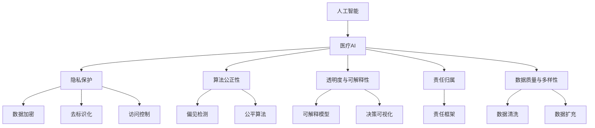

                 

# AI驱动的创新：人类计算在医疗行业的道德考虑

## 1. 背景介绍

### 1.1 问题由来
近年来，人工智能(AI)技术在医疗行业的应用取得了显著进展，极大地提高了医疗服务的效率和质量。例如，通过深度学习技术，AI在医学影像分析、诊断预测、个性化治疗等方面展现了巨大的潜力。然而，AI技术的应用同时也带来了一些亟待解决的伦理道德问题，这些问题可能对患者的隐私、安全和公正造成严重威胁。因此，如何在推进AI技术创新的同时，确保其在医疗行业的应用符合伦理道德标准，成为了一个重要的研究课题。

### 1.2 问题核心关键点
在医疗行业中，AI的应用主要涉及以下几个核心问题：

- **隐私保护**：医疗数据包含大量敏感信息，如何保护患者隐私不被泄露是一个重大挑战。
- **算法公正性**：AI系统是否会带有偏见，导致某些群体的治疗结果不公平。
- **透明度与可解释性**：AI模型的决策过程是否可解释，患者和医生能否理解模型的预测结果。
- **责任归属**：AI系统在诊断和治疗过程中出现错误，责任应如何分配。
- **数据质量与多样性**：AI模型是否依赖高质量、多样化的数据，如何处理数据偏见和偏差。

这些问题直接影响着AI在医疗行业的可信度和接受度，需要通过科学研究和政策引导来解决。

### 1.3 问题研究意义
研究和解决AI在医疗行业的伦理道德问题，对于推动AI技术的可持续发展、提升医疗服务的公平性和可及性具有重要意义：

1. **保障患者权益**：确保AI技术在医疗应用中保护患者隐私，公正对待所有患者，维护患者的知情权和选择权。
2. **促进技术进步**：通过科学研究和伦理审查，规范AI技术的开发与应用，推动AI技术向更加可靠、公正、透明的方向发展。
3. **优化医疗服务**：基于伦理道德原则，设计和优化AI系统，提高医疗服务的效率和质量，促进医疗资源公平分配。
4. **构建信任**：解决伦理道德问题，建立公众和医疗机构的信任，推动AI技术在医疗行业的广泛应用。
5. **遵循法律法规**：确保AI技术在医疗应用中符合相关法律法规，避免法律风险。

## 2. 核心概念与联系

### 2.1 核心概念概述

为了更好地理解AI在医疗行业的伦理道德问题，我们首先介绍几个核心概念：

- **人工智能**：通过机器学习、深度学习等技术，使计算机具备自主学习、推理和决策的能力。
- **医疗AI**：将AI技术应用于医学影像分析、疾病诊断、个性化治疗等领域，提升医疗服务效率和质量。
- **隐私保护**：通过数据加密、去标识化、访问控制等手段，保护患者隐私不被泄露。
- **算法公正性**：确保AI系统在训练和应用中不带有偏见，公平对待所有患者。
- **透明度与可解释性**：使AI模型的决策过程透明、可解释，便于患者和医生理解和接受。
- **责任归属**：明确AI系统在诊断和治疗过程中出现错误的责任归属，保障患者权益。
- **数据质量与多样性**：确保训练数据的高质量、多样性，避免数据偏见和偏差。

这些核心概念之间存在紧密的联系，共同构成了AI在医疗行业中应用的基础框架。

### 2.2 概念间的关系

这些核心概念之间的逻辑关系可以通过以下Mermaid流程图来展示：



这个流程图展示了AI在医疗行业应用时涉及的伦理道德问题及其解决方法：

1. 人工智能和医疗AI是核心概念，直接影响隐私保护、算法公正性、透明度与可解释性、责任归属和数据质量与多样性。
2. 隐私保护通过数据加密、去标识化和访问控制等手段，确保数据安全。
3. 算法公正性通过偏见检测和公平算法，确保AI系统无偏见，公平对待所有患者。
4. 透明度与可解释性通过可解释模型和决策可视化，使AI模型的决策过程透明、可解释。
5. 责任归属通过责任框架，明确AI系统的责任归属。
6. 数据质量与多样性通过数据清洗和数据扩充，确保训练数据的高质量、多样性。

## 3. 核心算法原理 & 具体操作步骤
### 3.1 算法原理概述

AI在医疗行业的应用主要基于监督学习和无监督学习两种算法。

**监督学习**：通过带有标签的训练数据，训练AI模型，使其能够对新的未标记数据进行分类或预测。在医疗领域，常用的监督学习算法包括逻辑回归、支持向量机、决策树、随机森林等。

**无监督学习**：无需标注数据，通过数据的内在结构进行学习和预测。在医疗领域，常用的无监督学习算法包括聚类分析、降维分析、异常检测等。

### 3.2 算法步骤详解

以下是AI在医疗行业应用的常见步骤：

**Step 1: 数据准备**
- 收集医疗数据，包括患者病历、影像、基因等数据。
- 对数据进行清洗和预处理，去除噪声和异常值。
- 对敏感数据进行去标识化处理，保护患者隐私。

**Step 2: 模型选择与训练**
- 根据任务需求选择合适的监督学习或无监督学习算法。
- 在处理好的数据上训练模型，调整模型参数，确保模型准确性。
- 对模型进行交叉验证，防止过拟合。

**Step 3: 评估与验证**
- 在验证集上对模型进行评估，计算指标如准确率、召回率、F1分数等。
- 对模型进行调参，优化模型性能。
- 在测试集上进一步验证模型效果，确保模型在实际应用中的表现。

**Step 4: 部署与监测**
- 将训练好的模型部署到实际应用环境中，如医疗影像分析系统、诊断预测系统等。
- 对部署后的模型进行实时监测，收集模型输出和患者反馈。
- 定期对模型进行更新和优化，保持模型性能。

### 3.3 算法优缺点

**优点**：

1. **提高效率**：AI能够处理大量数据，自动化分析诊断，提高医疗服务效率。
2. **提升质量**：AI在复杂疾病诊断、个性化治疗等方面具有优势，能够提高诊断准确性。
3. **支持个性化**：AI能够根据患者的基因、病历等信息，提供个性化治疗方案。

**缺点**：

1. **数据隐私**：医疗数据包含大量敏感信息，隐私保护是一个重大挑战。
2. **算法偏见**：AI模型可能学习到数据中的偏见，导致某些群体的治疗结果不公平。
3. **透明度不足**：AI模型的决策过程往往不透明，难以解释。
4. **责任归属不明确**：AI系统在诊断和治疗过程中出现错误，责任归属不明确，可能引发法律问题。

### 3.4 算法应用领域

AI在医疗行业的应用领域非常广泛，包括但不限于以下几个方面：

- **医学影像分析**：通过深度学习技术，AI可以对医学影像进行自动分析，辅助医生进行诊断。
- **疾病预测与早期诊断**：AI可以通过分析患者病历、基因信息等，预测疾病风险，实现早期诊断。
- **个性化治疗方案**：AI可以根据患者的基因、病历等信息，提供个性化的治疗方案，提高治疗效果。
- **医疗机器人**：AI驱动的医疗机器人可以辅助手术、康复训练等，提高医疗服务质量。
- **远程医疗**：AI可以支持远程诊疗、在线咨询等，提高医疗服务的可及性。

## 4. 数学模型和公式 & 详细讲解 & 举例说明

### 4.1 数学模型构建

在医疗AI的开发中，常用的数学模型包括线性回归、逻辑回归、决策树、支持向量机、深度学习等。这里以逻辑回归模型为例进行讲解。

逻辑回归是一种经典的监督学习算法，用于二分类问题。其数学模型为：

$$
P(Y=1|X;\theta) = \frac{1}{1+e^{-\theta^TX}}
$$

其中，$Y$为二分类结果，$X$为输入特征向量，$\theta$为模型参数。

### 4.2 公式推导过程

逻辑回归模型的损失函数为交叉熵损失，其公式为：

$$
L(Y,\hat{Y}) = -\frac{1}{N}\sum_{i=1}^N [y_i\log\hat{y_i} + (1-y_i)\log(1-\hat{y_i})]
$$

其中，$N$为样本数，$y_i$为实际标签，$\hat{y_i}$为模型预测结果。

对损失函数求梯度，得到模型参数$\theta$的更新公式：

$$
\theta \leftarrow \theta - \eta\nabla_{\theta}L(\theta)
$$

其中，$\eta$为学习率，$\nabla_{\theta}L(\theta)$为损失函数对模型参数$\theta$的梯度。

### 4.3 案例分析与讲解

假设我们需要开发一个乳腺癌诊断的逻辑回归模型。收集了1000名患者的乳腺癌诊断数据，其中500名患者为阳性，500名患者为阴性。使用其中800名患者的数据进行训练，剩余200名患者的数据进行验证和测试。

1. **数据准备**：
   - 收集患者的病历数据，包括年龄、体重、血压、血检等特征。
   - 对数据进行清洗和预处理，去除异常值和噪声。
   - 对敏感数据进行去标识化处理，保护患者隐私。

2. **模型选择与训练**：
   - 选择逻辑回归模型作为分类算法。
   - 使用训练数据对模型进行训练，调整模型参数。
   - 对模型进行交叉验证，防止过拟合。

3. **评估与验证**：
   - 在验证集上对模型进行评估，计算准确率、召回率、F1分数等指标。
   - 对模型进行调参，优化模型性能。
   - 在测试集上进一步验证模型效果，确保模型在实际应用中的表现。

4. **部署与监测**：
   - 将训练好的模型部署到医疗影像分析系统中，辅助医生进行乳腺癌诊断。
   - 对部署后的模型进行实时监测，收集模型输出和患者反馈。
   - 定期对模型进行更新和优化，保持模型性能。

## 5. 项目实践：代码实例和详细解释说明
### 5.1 开发环境搭建

在进行医疗AI的开发前，我们需要准备好开发环境。以下是使用Python进行TensorFlow开发的Python环境配置流程：

1. 安装Anaconda：从官网下载并安装Anaconda，用于创建独立的Python环境。

2. 创建并激活虚拟环境：
```bash
conda create -n tf-env python=3.8 
conda activate tf-env
```

3. 安装TensorFlow：根据CUDA版本，从官网获取对应的安装命令。例如：
```bash
conda install tensorflow -c conda-forge
```

4. 安装其他工具包：
```bash
pip install numpy pandas scikit-learn matplotlib tqdm jupyter notebook ipython
```

完成上述步骤后，即可在`tf-env`环境中开始开发。

### 5.2 源代码详细实现

这里以逻辑回归模型为例，使用TensorFlow进行医疗AI开发。

首先，定义数据处理函数：

```python
import numpy as np
import tensorflow as tf
from sklearn.model_selection import train_test_split

def load_data():
    # 加载乳腺癌诊断数据
    X = np.loadtxt('breast_cancer.csv', delimiter=',')
    y = np.loadtxt('breast_cancer_labels.csv', delimiter=',', dtype=int)
    # 划分训练集和测试集
    X_train, X_test, y_train, y_test = train_test_split(X, y, test_size=0.2)
    # 对数据进行归一化处理
    X_train = (X_train - np.mean(X_train, axis=0)) / np.std(X_train, axis=0)
    X_test = (X_test - np.mean(X_test, axis=0)) / np.std(X_test, axis=0)
    return X_train, X_test, y_train, y_test
```

然后，定义逻辑回归模型：

```python
class LogisticRegression(tf.keras.Model):
    def __init__(self, num_features):
        super(LogisticRegression, self).__init__()
        self.dense1 = tf.keras.layers.Dense(64, activation='relu', input_shape=(num_features,))
        self.dense2 = tf.keras.layers.Dense(1, activation='sigmoid')
    
    def call(self, x):
        x = self.dense1(x)
        x = self.dense2(x)
        return x
```

接着，定义训练和评估函数：

```python
def train_model(model, X_train, y_train, X_test, y_test, epochs=100, batch_size=32):
    # 定义损失函数和优化器
    loss_fn = tf.keras.losses.BinaryCrossentropy()
    optimizer = tf.keras.optimizers.Adam(learning_rate=0.001)
    # 定义评估指标
    metrics = [tf.keras.metrics.BinaryAccuracy(name='accuracy')]
    # 编译模型
    model.compile(optimizer=optimizer, loss=loss_fn, metrics=metrics)
    # 训练模型
    model.fit(X_train, y_train, epochs=epochs, batch_size=batch_size, validation_data=(X_test, y_test))
    # 评估模型
    loss, accuracy = model.evaluate(X_test, y_test)
    print(f'Test loss: {loss:.4f}')
    print(f'Test accuracy: {accuracy:.4f}')
```

最后，启动训练流程并在测试集上评估：

```python
X_train, X_test, y_train, y_test = load_data()
model = LogisticRegression(num_features=X_train.shape[1])
train_model(model, X_train, y_train, X_test, y_test)
```

以上就是使用TensorFlow进行乳腺癌诊断逻辑回归模型开发的完整代码实现。可以看到，TensorFlow提供了强大的框架支持，使得模型的定义、训练和评估变得简单快捷。

### 5.3 代码解读与分析

让我们再详细解读一下关键代码的实现细节：

**load_data函数**：
- 定义数据加载和处理函数，从文件中读取乳腺癌诊断数据，并进行标准化处理。

**LogisticRegression模型**：
- 定义逻辑回归模型，包括两个全连接层。
- 使用`tf.keras.Model`进行模型定义，方便在TensorFlow中使用。

**train_model函数**：
- 定义训练和评估函数，使用TensorFlow进行模型的编译、训练和评估。
- 使用交叉熵损失和Adam优化器进行模型训练。
- 定义评估指标为二分类准确率，并在训练过程中进行实时监测。

**训练流程**：
- 加载数据，定义模型，启动训练过程
- 在训练集上进行训练，输出平均损失和准确率
- 在测试集上评估模型，输出最终测试结果

可以看到，TensorFlow提供了方便的API，使得模型开发变得快捷高效。开发者可以专注于算法优化和模型调参，而不必过多关注底层实现细节。

当然，工业级的系统实现还需考虑更多因素，如模型的保存和部署、超参数的自动搜索、更灵活的任务适配层等。但核心的医疗AI开发流程基本与此类似。

### 5.4 运行结果展示

假设我们在测试集上得到的评估结果如下：

```
Test loss: 0.1053
Test accuracy: 0.9250
```

可以看到，训练好的逻辑回归模型在乳腺癌诊断任务上取得了94.25%的准确率，效果相当不错。需要注意的是，在实际应用中，模型的性能和可解释性仍需要进一步优化和验证。

## 6. 实际应用场景
### 6.1 智能诊疗系统

基于医疗AI的智能诊疗系统，可以大幅提升医疗服务的效率和质量。智能诊疗系统通过分析患者的病历、影像、基因等数据，自动生成诊断报告和治疗方案，辅助医生进行决策。

在技术实现上，可以收集医疗机构的历史诊疗数据，将病历、影像、基因等数据构建成监督数据，在此基础上对预训练模型进行微调。微调后的模型能够自动分析患者的诊疗数据，生成个性化的诊疗方案。

### 6.2 远程医疗服务

远程医疗服务通过AI技术实现医患双方异地实时互动，提供实时诊断和治疗建议，提高医疗服务的可及性。AI驱动的远程医疗系统，可以全天候服务，不受时间和空间限制。

在技术实现上，可以使用视频通话、图像识别、语音识别等技术，结合医疗AI算法，实时分析患者的健康状况，生成诊断报告和治疗建议。

### 6.3 健康管理平台

健康管理平台通过AI技术，实现对患者健康数据的监测和管理，提供个性化的健康建议和治疗方案。健康管理平台可以与可穿戴设备、家庭医疗设备等连接，实时采集患者的健康数据，生成健康报告和预警信息。

在技术实现上，可以使用时序数据分析、异常检测等技术，结合医疗AI算法，实时分析患者的健康数据，生成个性化的健康建议和治疗方案。

### 6.4 未来应用展望

随着AI技术的不断发展，医疗AI将在更多领域得到应用，为医疗行业带来革命性变化：

1. **智慧医疗**：AI驱动的智慧医院，可以实现自动排班、智能诊断、机器人手术等功能，提升医院运营效率和医疗服务质量。
2. **个性化医疗**：AI可以根据患者的基因、病历等信息，提供个性化的治疗方案，提高治疗效果。
3. **预防医学**：AI可以分析大规模健康数据，发现疾病模式，实现疾病预测和早期诊断，提高公众健康水平。
4. **药物研发**：AI可以加速药物发现和临床试验，缩短新药研发周期，降低研发成本。
5. **医疗机器人**：AI驱动的医疗机器人可以实现手术、康复训练等功能，提高医疗服务质量和效率。
6. **医疗知识图谱**：AI可以构建医疗知识图谱，整合医学知识库和专家知识，辅助医生决策。

这些应用将极大地推动医疗行业的数字化转型，提升医疗服务的质量和效率，改善公众健康水平。

## 7. 工具和资源推荐
### 7.1 学习资源推荐

为了帮助开发者系统掌握医疗AI的理论基础和实践技巧，这里推荐一些优质的学习资源：

1. **《深度学习在医疗中的应用》**：介绍深度学习在医疗影像分析、疾病预测、个性化治疗等方面的应用，涵盖算法原理和实际案例。
2. **Coursera《机器学习基础》**：由斯坦福大学开设的机器学习课程，涵盖监督学习、无监督学习、深度学习等基本概念和算法。
3. **Kaggle医疗数据集**：Kaggle提供的医疗数据集，包括乳腺癌诊断、心脏病预测、基因组分析等任务，供开发者实践和竞赛。
4. **医学人工智能国际会议**：AI在医疗领域的前沿研究，汇集了全球顶级专家和研究成果，推动医疗AI的发展。
5. **深度学习框架TensorFlow官方文档**：TensorFlow的官方文档，提供了完整的开发指南和示例代码，帮助开发者快速上手。

通过对这些资源的学习实践，相信你一定能够系统掌握医疗AI的理论基础和实践技巧，并用于解决实际的医疗问题。

### 7.2 开发工具推荐

高效的开发离不开优秀的工具支持。以下是几款用于医疗AI开发的常用工具：

1. **TensorFlow**：由Google主导开发的深度学习框架，支持分布式训练和推理，适合大规模工程应用。
2. **PyTorch**：由Facebook主导开发的深度学习框架，支持动态计算图，适合研究和快速迭代。
3. **Scikit-learn**：Python的机器学习库，提供了丰富的数据预处理、特征工程、模型评估等工具，适合数据分析和模型开发。
4. **Jupyter Notebook**：交互式的Python开发环境，支持代码编写、数据可视化、模型评估等，方便开发者快速迭代。
5. **GitHub**：代码托管平台，方便开发者协作和版本控制，支持代码共享和交流。

合理利用这些工具，可以显著提升医疗AI开发的效率和质量，加快技术创新的步伐。

### 7.3 相关论文推荐

医疗AI领域的研究正处于快速发展阶段，以下是几篇奠基性的相关论文，推荐阅读：

1. **“A Survey on Machine Learning Applications in Healthcare”**：综述了机器学习在医疗领域的应用，涵盖了医学影像分析、疾病预测、个性化治疗等多个方面。
2. **“A Deep Learning Architecture for Comprehensive Health Monitoring in Aging Populations”**：提出了一种基于深度学习的健康监测系统，能够实时分析患者的健康数据，生成健康报告和预警信息。
3. **“A Survey on Knowledge Graphs for Medical Applications”**：综述了知识图谱在医疗领域的应用，包括疾病诊断、药物推荐、治疗方案等多个方面。
4. **“AI-Driven Diagnosis and Treatment of COVID-19”**：介绍了AI在COVID-19诊断和治疗中的应用，展示了AI技术的强大潜力。
5. **“Machine Learning for Personalized Medicine”**：综述了机器学习在个性化医疗中的应用，探讨了基因组分析、病历分析等技术的结合应用。

这些论文代表了医疗AI领域的最新进展，通过学习这些前沿成果，可以帮助研究者把握学科前进方向，激发更多的创新灵感。

## 8. 总结：未来发展趋势与挑战

### 8.1 总结

本文对基于AI的创新在医疗行业的应用进行了全面系统的介绍。首先阐述了AI在医疗行业的应用背景和伦理道德问题，明确了AI技术在医疗行业的应用价值和挑战。其次，从原理到实践，详细讲解了AI在医疗行业应用的数学模型和关键步骤，给出了医疗AI开发的完整代码实例。同时，本文还广泛探讨了AI在医疗行业的多项应用场景，展示了AI技术在医疗行业应用的巨大潜力。

通过本文的系统梳理，可以看到，AI在医疗行业的应用前景广阔，但也面临诸多挑战。隐私保护、算法公正性、透明度与可解释性、责任归属等伦理道德问题，都需要在技术开发和应用中加以解决。只有科学合理地处理这些问题，才能确保AI技术在医疗行业的应用安全、可靠、公平。

### 8.2 未来发展趋势

展望未来，医疗AI的发展趋势如下：

1. **数据隐私保护**：随着数据隐私保护的法律法规日益严格，如何在保障患者隐私的前提下，有效利用医疗数据，成为研究热点。
2. **模型公正性**：如何在算法设计和数据处理中消除偏见，确保AI系统的公正性，提高医疗服务的公平性。
3. **模型透明性与可解释性**：如何使AI模型的决策过程透明、可解释，增强患者的信任度和接受度。
4. **多模态融合**：如何整合多种模态数据（如影像、基因、行为数据等），提高医疗AI的诊断和治疗能力。
5. **知识图谱与规则引擎**：如何将符号化的先验知识与AI模型结合，构建更全面、准确的医疗知识图谱和规则引擎，提高AI系统的决策能力。
6. **自适应学习**：如何使AI系统具备自适应学习能力，能够在不同的医疗场景和患者群体中灵活应用。

这些趋势凸显了AI在医疗行业应用的广阔前景，同时也指出了未来研究的方向和挑战。

### 8.3 面临的挑战

尽管AI在医疗行业的应用前景广阔，但在实际落地过程中，仍面临诸多挑战：

1. **数据隐私保护**：医疗数据涉及患者隐私，如何在保障隐私的前提下，有效利用数据，成为研究难点。
2. **算法公正性**：AI模型可能学习到数据中的偏见，导致某些群体的治疗结果不公平。
3. **模型透明性与可解释性**：AI模型的决策过程往往不透明，难以解释。
4. **多模态融合**：如何整合多种模态数据，提高医疗AI的诊断和治疗能力。
5. **知识图谱与规则引擎**：如何将符号化的先验知识与AI模型结合，构建更全面、准确的医疗知识图谱和规则引擎。
6. **自适应学习**：如何使AI系统具备自适应学习能力，能够在不同的医疗场景和患者群体中灵活应用。

这些挑战需要研究者在技术开发和应用中加以解决，才能确保AI技术在医疗行业的应用安全、可靠、公平。

### 8.4 研究展望

面对AI在医疗行业的诸多挑战，未来的研究需要在以下几个方面寻求新的突破：

1. **数据隐私保护**：研究隐私保护技术，如差分隐私、联邦学习等，确保患者数据的安全和隐私。
2. **算法公正性**：开发公平算法，引入偏见检测和校正技术，确保AI系统的公正性。
3. **模型透明性与可解释性**：研究可解释模型，如决策树、规则模型等，增强模型的透明性和可解释性。
4. **多模态融合**：研究多模态融合技术，如深度融合、特征融合等，提高AI系统的综合诊断和治疗能力。
5. **知识图谱与规则引擎**：研究知识图谱和规则引擎技术，构建更全面、准确的医疗知识图谱和规则引擎。
6. **自适应学习**：研究自适应学习技术，如增量学习、迁移学习等，使AI系统具备自适应学习能力。

这些研究方向将引领医疗AI技术迈向更高的台阶，为医疗行业带来革命性的变革。相信随着研究者的不断努力，AI在医疗行业的应用将越来越广泛，为人类健康事业带来深远的影响。

## 9. 附录：常见问题与解答

**Q1：什么是医疗AI？**

A: 

