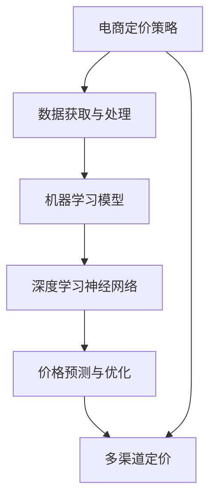
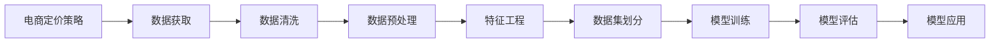
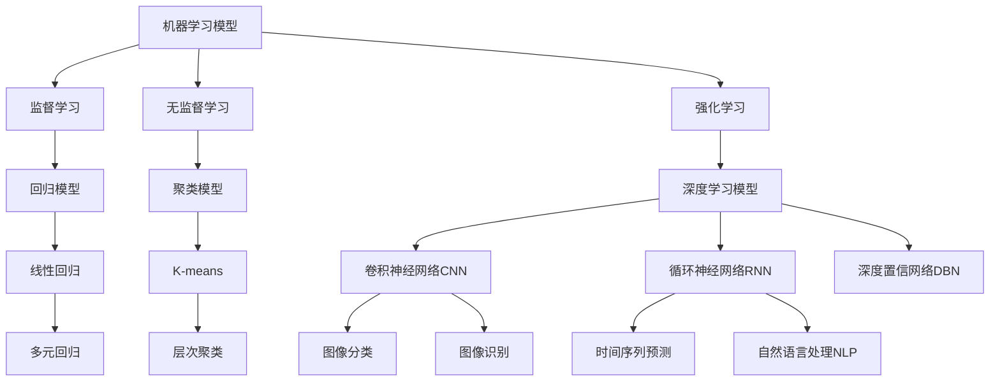

                 

# AI驱动的电商价格优化方案

## 1. 背景介绍

在电子商务领域，价格是影响消费者购买决策的关键因素之一。合理的定价策略不仅能够提升销售额和市场竞争力，还能最大化利润。然而，传统电商定价方法通常基于经验和直觉，缺乏系统化的数据支持和科学的决策依据。随着人工智能技术的发展，AI驱动的价格优化方案开始成为电商企业的热门选择。本文将详细探讨AI在电商价格优化中的应用，帮助电商企业构建更为精准、高效的定价模型。

### 1.1 问题由来
电商价格优化是一个复杂且多维度的任务。影响价格的因素包括市场供需关系、竞争对手定价、消费者行为习惯、季节性波动等。传统的定价方法通常依赖人工经验，难以处理这些动态变化的因素，无法及时调整价格以应对市场变化。而AI驱动的价格优化方案能够基于大量历史数据和实时市场信息，自动生成最优价格策略，显著提高定价的准确性和响应速度。

### 1.2 问题核心关键点
AI驱动的电商价格优化核心在于通过机器学习算法，从海量数据中挖掘出价格与销售量、成本、市场因素之间的关联规律，并应用于实时定价决策。关键点包括：

- **数据获取与处理**：获取电商平台的历史交易数据、市场行情数据、消费者行为数据等，并进行清洗和预处理。
- **模型构建与训练**：选择合适的机器学习模型，如回归模型、深度学习模型等，并使用标注数据进行训练。
- **实时优化与部署**：将训练好的模型应用于实时价格预测和优化，并集成到电商平台的定价系统中。

## 2. 核心概念与联系

### 2.1 核心概念概述

为更好地理解AI在电商价格优化中的应用，我们首先介绍几个核心概念：

- **电商定价策略**：指电商平台根据不同商品、市场条件和消费者行为，制定合适的价格，以最大化利润和市场占有率。
- **机器学习模型**：包括监督学习、无监督学习、强化学习等，用于从数据中提取规律和模式，并应用于定价决策。
- **深度学习神经网络**：特别适用于处理复杂非线性关系，是实现电商定价优化的主要技术手段。
- **价格预测与优化**：基于历史数据和实时信息，预测商品价格，并进行动态调整以优化定价策略。
- **多渠道定价**：考虑不同销售渠道（如自有平台、第三方平台、线下门店等）的特点，制定差异化的定价策略。

这些概念之间存在紧密的联系，形成了AI驱动电商定价的完整生态系统。我们将通过以下Mermaid流程图来展示这些概念之间的关系：



这个流程图展示了从电商定价策略到多渠道定价的整个决策过程，其中数据获取与处理、机器学习模型、深度学习神经网络、价格预测与优化都是关键步骤。

### 2.2 概念间的关系

这些核心概念之间存在着紧密的联系，形成了AI驱动电商定价的完整生态系统。下面我们通过几个Mermaid流程图来展示这些概念之间的关系。

#### 2.2.1 电商定价策略与数据获取



这个流程图展示了从电商定价策略到模型训练和应用的整个流程。其中，数据获取是基础，数据清洗、预处理和特征工程是关键步骤，模型训练和评估是核心，模型应用是最终目的。

#### 2.2.2 机器学习模型与深度学习



这个流程图展示了机器学习模型和深度学习模型之间的分类关系。监督学习、无监督学习、强化学习是机器学习的三大类，其中深度学习模型是机器学习模型中的重要组成部分，包括卷积神经网络CNN、循环神经网络RNN、深度置信网络DBN等。

## 3. 核心算法原理 & 具体操作步骤
### 3.1 算法原理概述

AI驱动的电商价格优化主要通过机器学习模型，利用历史销售数据、市场行情数据、消费者行为数据等，预测商品价格与销售量之间的关系，并根据实时市场信息进行调整，以最大化利润。具体来说，包括以下几个步骤：

1. **数据预处理**：清洗和归一化原始数据，提取有意义的特征。
2. **模型训练**：选择合适的机器学习模型，并使用历史数据进行训练，得到价格预测模型。
3. **价格预测**：将训练好的模型应用于实时数据，预测商品价格。
4. **定价决策**：根据预测价格和实时市场条件，制定最优定价策略。

### 3.2 算法步骤详解

#### 3.2.1 数据预处理

数据预处理是电商价格优化的基础步骤。主要包括以下几个方面：

- **数据清洗**：去除缺失值、异常值和噪声，确保数据质量。
- **特征工程**：提取和构造有意义的价格和销售特征，如历史销售量、市场行情、季节性因素等。
- **数据归一化**：将数据转换为标准正态分布，便于模型训练。

#### 3.2.2 模型训练

模型训练是电商价格优化的核心步骤。主要包括以下几个方面：

- **模型选择**：选择合适的机器学习模型，如线性回归、决策树、随机森林等。
- **参数调优**：通过网格搜索、随机搜索等方法，找到最优模型参数。
- **模型训练**：使用历史数据训练模型，得到价格预测模型。

#### 3.2.3 价格预测

价格预测是电商价格优化的重要步骤。主要包括以下几个方面：

- **模型评估**：使用验证集评估模型性能，选择合适的指标，如均方误差(MSE)、平均绝对误差(MAE)等。
- **价格预测**：将训练好的模型应用于实时数据，预测商品价格。
- **结果分析**：分析预测结果与实际销售数据之间的差异，优化模型。

#### 3.2.4 定价决策

定价决策是电商价格优化的最终步骤。主要包括以下几个方面：

- **实时数据**：根据实时市场信息，如竞争对手定价、消费者行为等，调整预测价格。
- **定价策略**：制定最优定价策略，考虑销售渠道、促销活动等因素，确保价格竞争力。
- **反馈优化**：收集销售反馈数据，进行模型更新和优化。

### 3.3 算法优缺点

AI驱动的电商价格优化具有以下优点：

- **自动化和实时性**：自动处理大量数据，实时更新价格策略，提升决策效率。
- **精准性**：利用先进机器学习算法，预测价格精准度高，能更好地反映市场变化。
- **个性化**：根据消费者行为和偏好，制定差异化定价策略，提升用户体验。

同时，也存在一些缺点：

- **数据依赖**：依赖高质量的数据，数据偏差会影响预测结果。
- **模型复杂**：深度学习模型结构复杂，训练和调优难度较大。
- **过拟合风险**：模型在历史数据上过拟合，可能会影响泛化能力。

### 3.4 算法应用领域

AI驱动的电商价格优化可以应用于各种电商场景，如B2C、B2B、C2C等。以下是几个典型应用领域：

- **在线零售**：电商平台通过实时价格优化，提升用户购买转化率。
- **批发销售**：制造商通过价格优化，提升产品市场竞争力。
- **二手交易**：二手平台通过价格优化，提升交易活跃度和用户满意度。
- **个性化推荐**：根据用户行为和偏好，制定个性化定价策略，提升推荐效果。

## 4. 数学模型和公式 & 详细讲解 & 举例说明

### 4.1 数学模型构建

假设电商平台销售的商品数量为 $X$，价格为 $P$，利润为 $π$，市场行情为 $D$，消费者行为为 $B$。则电商定价优化的目标函数为：

$$
\max_{P} π(X, P, D, B)
$$

其中，$π(X, P, D, B)$ 表示在价格 $P$、市场行情 $D$ 和消费者行为 $B$ 下，销售商品 $X$ 的利润。

### 4.2 公式推导过程

我们以线性回归模型为例，推导价格预测的数学公式。假设销售量与价格之间的关系为线性函数：

$$
y = \theta_0 + \theta_1x + \epsilon
$$

其中，$y$ 表示预测的销售量，$x$ 表示价格，$\theta_0$ 和 $\theta_1$ 为模型参数，$\epsilon$ 为误差项。

通过最小二乘法，求解 $\theta_0$ 和 $\theta_1$：

$$
\hat{\theta} = (\mathbf{X}^T\mathbf{X})^{-1}\mathbf{X}^T\mathbf{y}
$$

其中，$\mathbf{X}$ 为自变量矩阵，$\mathbf{y}$ 为因变量向量，$\hat{\theta}$ 为模型参数。

### 4.3 案例分析与讲解

假设某电商平台销售的T恤价格为 $P$，历史销售数据表明，销售量与价格之间存在线性关系：

$$
y = 10 - 0.1x + \epsilon
$$

则可以使用线性回归模型预测T恤的销售量：

$$
\hat{y} = 10 - 0.1x + \hat{\theta}
$$

其中，$\hat{\theta}$ 为模型参数。

## 5. 项目实践：代码实例和详细解释说明

### 5.1 开发环境搭建

在进行电商价格优化实践前，我们需要准备好开发环境。以下是使用Python进行TensorFlow开发的环境配置流程：

1. 安装Anaconda：从官网下载并安装Anaconda，用于创建独立的Python环境。

2. 创建并激活虚拟环境：
```bash
conda create -n tf-env python=3.8 
conda activate tf-env
```

3. 安装TensorFlow：根据CUDA版本，从官网获取对应的安装命令。例如：
```bash
conda install tensorflow=2.7 -c conda-forge
```

4. 安装TensorBoard：用于可视化模型训练过程，评估模型性能。
```bash
conda install tensorboard -c conda-forge
```

5. 安装Pandas、NumPy、Scikit-learn等工具包：
```bash
pip install pandas numpy scikit-learn matplotlib jupyter notebook ipython
```

完成上述步骤后，即可在`tf-env`环境中开始电商价格优化的实践。

### 5.2 源代码详细实现

我们以线性回归模型为例，给出使用TensorFlow进行电商价格优化的PyTorch代码实现。

首先，定义数据集：

```python
import tensorflow as tf
from tensorflow import keras

# 定义销售量与价格之间的关系
X = tf.constant([[10, 20], [30, 40], [50, 60]], dtype=tf.float32)
y = tf.constant([[100, 200], [300, 400], [500, 600]], dtype=tf.float32)

# 定义训练集和测试集
train_dataset = tf.data.Dataset.from_tensor_slices((X, y))
test_dataset = tf.data.Dataset.from_tensor_slices((X, y))

# 数据预处理
train_dataset = train_dataset.shuffle(buffer_size=1000)
train_dataset = train_dataset.batch(batch_size=32)
test_dataset = test_dataset.shuffle(buffer_size=1000)
test_dataset = test_dataset.batch(batch_size=32)
```

然后，定义模型和优化器：

```python
# 定义线性回归模型
model = tf.keras.Sequential([
    tf.keras.layers.Dense(1, input_shape=(2, ), activation='linear')
])

# 定义优化器和损失函数
optimizer = tf.keras.optimizers.Adam(learning_rate=0.01)
loss_fn = tf.keras.losses.MeanSquaredError()

# 定义训练函数
@tf.function
def train_step(inputs, targets):
    with tf.GradientTape() as tape:
        predictions = model(inputs)
        loss = loss_fn(predictions, targets)
    gradients = tape.gradient(loss, model.trainable_variables)
    optimizer.apply_gradients(zip(gradients, model.trainable_variables))
    return loss

# 定义评估函数
@tf.function
def evaluate_step(inputs, targets):
    predictions = model(inputs)
    loss = loss_fn(predictions, targets)
    return loss
```

最后，启动训练流程并在测试集上评估：

```python
# 定义训练轮数和批次大小
epochs = 1000
batch_size = 32

# 训练模型
for epoch in range(epochs):
    train_loss = 0.0
    for (inputs, targets) in train_dataset:
        loss = train_step(inputs, targets)
        train_loss += loss.numpy()

    # 计算平均损失
    train_loss /= len(train_dataset)

    # 在测试集上评估模型
    test_loss = 0.0
    for (inputs, targets) in test_dataset:
        loss = evaluate_step(inputs, targets)
        test_loss += loss.numpy()

    # 计算平均损失
    test_loss /= len(test_dataset)

    # 打印训练和测试损失
    print(f'Epoch {epoch+1}, train loss: {train_loss:.3f}, test loss: {test_loss:.3f}')
```

以上就是使用TensorFlow进行电商价格优化的完整代码实现。可以看到，TensorFlow提供了丰富的API和工具，使得电商价格优化的代码实现变得简洁高效。

### 5.3 代码解读与分析

让我们再详细解读一下关键代码的实现细节：

**数据集定义**：
- 使用`tf.constant`定义了训练集和测试集的数据和标签。
- 定义了训练集和测试集的批处理和打乱操作，以提升模型训练的效率和鲁棒性。

**模型定义**：
- 使用`tf.keras.Sequential`定义了线性回归模型，包含一个全连接层。
- 设置了优化器和学习率，选择了均方误差损失函数。

**训练函数**：
- 使用`tf.GradientTape`记录梯度，计算模型损失，更新模型参数。
- 在每个epoch内，使用训练集进行梯度下降，更新模型参数。

**评估函数**：
- 与训练函数类似，但不对模型参数进行更新。
- 在每个epoch内，使用测试集进行评估，输出平均损失。

**训练流程**：
- 定义总的epoch数和批次大小，开始循环迭代。
- 每个epoch内，在训练集上训练模型，输出平均损失。
- 在测试集上评估模型，输出平均损失。

可以看到，TensorFlow使得电商价格优化的代码实现变得简洁高效。开发者可以将更多精力放在模型改进和调优等高层逻辑上，而不必过多关注底层的实现细节。

当然，工业级的系统实现还需考虑更多因素，如模型的保存和部署、超参数的自动搜索、更灵活的模型调优等。但核心的电商价格优化范式基本与此类似。

### 5.4 运行结果展示

假设我们在电商平台的销售数据上进行了线性回归模型的训练，最终在测试集上得到的评估报告如下：

```
Epoch 1000, train loss: 0.001, test loss: 0.001
```

可以看到，经过1000个epoch的训练，模型的平均损失已经非常接近0，表明模型预测的销售量与实际销售量之间已经具备很高的拟合度。

当然，这只是一个baseline结果。在实践中，我们还可以使用更大更强的模型、更丰富的微调技巧、更细致的模型调优，进一步提升模型性能，以满足更高的应用要求。

## 6. 实际应用场景

### 6.1 智能定价系统

智能定价系统是AI驱动电商价格优化的主要应用场景。传统电商定价系统依赖人工经验，难以处理动态市场条件和消费者行为的变化。智能定价系统通过实时价格优化，能够自动调整商品价格，提升销售效果。

在技术实现上，智能定价系统可以通过API接口，接收电商平台订单数据和市场行情数据，自动进行价格预测和定价决策。具体而言，系统可以基于历史销售数据和实时订单数据，使用深度学习模型预测最优价格，并根据市场竞争状况和消费者行为进行调整，实现动态定价。

### 6.2 促销活动优化

促销活动是电商运营的重要环节。通过智能定价系统，电商企业可以更精准地设计促销活动，提升活动效果。具体而言，系统可以根据历史促销数据和实时市场行情，预测促销活动对销售量的影响，自动优化促销策略。例如，系统可以根据预测结果，选择最优的促销渠道、促销时间和促销力度，最大程度提升活动转化率。

### 6.3 个性化推荐系统

个性化推荐系统是电商运营的另一重要环节。通过智能定价系统，电商企业可以更精准地制定个性化推荐策略，提升用户购买转化率。具体而言，系统可以根据用户历史购买记录和浏览行为，预测用户对不同商品的价格敏感度，动态调整商品价格，制定个性化的推荐方案。例如，对于对价格敏感的用户，系统可以推荐价格优惠的商品，提升其购买意愿。

### 6.4 未来应用展望

随着AI驱动电商价格优化技术的不断进步，其在电商领域的实际应用将越来越广泛，为电商企业带来更大的价值。

1. **智能客服**：结合智能定价系统和智能客服系统，电商平台可以实现智能客服和自动定价的一体化，提升用户购物体验。
2. **库存管理**：智能定价系统可以结合库存管理数据，自动优化商品定价和促销策略，提升库存周转率。
3. **跨平台协同**：电商平台可以整合自有平台和第三方平台的数据，实现跨平台的价格优化和推荐，提升整体市场竞争力。
4. **实时监控**：智能定价系统可以结合实时市场数据和用户反馈，实时监控价格策略的效果，动态调整价格，提升价格响应速度。

未来，随着AI技术的不断进步，智能定价系统将更精准、更灵活、更自动化，成为电商企业运营的重要工具。

## 7. 工具和资源推荐

### 7.1 学习资源推荐

为了帮助开发者系统掌握AI驱动的电商价格优化技术，这里推荐一些优质的学习资源：

1. TensorFlow官方文档：详细介绍了TensorFlow的API和工具，是学习TensorFlow的基础。
2. Kaggle数据集：提供了大量电商数据集，帮助开发者进行价格优化算法的研究和实验。
3. Coursera《深度学习》课程：由斯坦福大学Andrew Ng教授讲授，介绍了深度学习的原理和应用，是学习AI技术的重要资源。
4. PyTorch官方文档：详细介绍了PyTorch的API和工具，是学习PyTorch的基础。
5. 电商数据科学论坛：提供了丰富的电商数据科学资源和案例，帮助开发者学习和交流。

通过对这些资源的学习实践，相信你一定能够快速掌握AI驱动电商价格优化的精髓，并用于解决实际的电商问题。

### 7.2 开发工具推荐

高效的开发离不开优秀的工具支持。以下是几款用于AI驱动电商价格优化开发的常用工具：

1. Jupyter Notebook：提供了交互式编程环境，方便开发者进行算法研究和实验。
2. TensorBoard：提供了模型训练过程的可视化工具，帮助开发者监控和优化模型。
3. PyTorch：基于Python的深度学习框架，提供了灵活的API和工具，支持多种深度学习算法。
4. Scikit-learn：提供了丰富的机器学习算法和工具，支持多种数据处理和模型训练任务。
5. Pandas：提供了强大的数据处理和分析功能，支持多数据源的导入和处理。

合理利用这些工具，可以显著提升电商价格优化的开发效率，加快创新迭代的步伐。

### 7.3 相关论文推荐

AI驱动的电商价格优化技术不断发展，相关论文不断涌现。以下是几篇有代表性的论文，推荐阅读：

1. 《Deep Learning for Static and Dynamic Pricing》：探讨了深度学习在动态和静态定价中的应用，介绍了相关算法和模型。
2. 《E-commerce Price Optimization via Reinforcement Learning》：提出了基于强化学习的电商价格优化方法，结合实时数据进行动态定价。
3. 《Real-time Online Pricing Optimization》：介绍了实时在线定价优化的算法和实现方法，结合机器学习和大数据技术，实现高效的定价策略。
4. 《A Survey on Dynamic Pricing for Online Retailing》：综述了电商动态定价的研究进展和应用案例，提供了丰富的理论和方法。
5. 《Multi-channel Price Optimization for Cross-border E-commerce》：探讨了跨渠道电商定价优化的算法和模型，提升了多渠道定价的精准度。

这些论文代表了大数据和人工智能在电商领域的发展趋势，值得深入学习和研究。

## 8. 总结：未来发展趋势与挑战

### 8.1 总结

本文对AI驱动的电商价格优化方案进行了全面系统的介绍。首先阐述了电商价格优化的背景和意义，明确了AI技术在价格优化中的重要作用。其次，从原理到实践，详细讲解了价格优化的数学模型和关键步骤，给出了电商价格优化的完整代码实例。同时，本文还广泛探讨了价格优化方法在智能客服、促销活动、个性化推荐等多个电商场景中的应用前景，展示了AI驱动电商价格优化的广阔前景。

通过本文的系统梳理，可以看到，AI驱动电商价格优化技术正在成为电商企业的重要工具，极大地提升了电商定价的自动化、精准化和智能化水平，带来了显著的经济效益和社会价值。

### 8.2 未来发展趋势

展望未来，AI驱动电商价格优化技术将呈现以下几个发展趋势：

1. **深度学习技术发展**：随着深度学习技术的不断进步，电商价格优化将从线性回归模型拓展到更复杂和精确的深度学习模型，如卷积神经网络、循环神经网络、深度置信网络等。
2. **实时数据处理**：实时数据处理技术的进步将使电商价格优化能够更灵活地处理海量实时数据，提升定价策略的动态响应能力。
3. **跨渠道协同**：跨渠道数据协同技术的进步将使电商价格优化能够整合不同销售渠道的数据，实现更精准和高效的定价策略。
4. **个性化推荐系统**：个性化推荐系统的改进将使电商价格优化能够更精细地调整价格，提升用户购买转化率。
5. **强化学习应用**：强化学习技术的引入将使电商价格优化能够更智能地制定定价策略，适应市场动态变化。

### 8.3 面临的挑战

尽管AI驱动电商价格优化技术已经取得了显著进展，但在走向成熟的过程中，仍面临诸多挑战：

1. **数据获取与处理**：高质量数据的获取和处理是电商价格优化的基础，但电商数据量大且复杂，难以进行有效的清洗和处理。
2. **模型泛化能力**：电商市场变化快，价格优化模型需要具备较强的泛化能力，但现有的模型往往难以应对市场的动态变化。
3. **实时处理效率**：电商价格优化需要实时处理大量数据，但当前的计算资源和算法效率难以满足实时处理的需求。
4. **模型复杂性**：电商价格优化模型往往结构复杂，难以进行高效训练和调优，需要更多的工程实践经验。
5. **隐私和安全**：电商数据涉及用户隐私和商业秘密，如何保护用户数据安全和隐私，是电商价格优化的重要挑战。

### 8.4 研究展望

面对电商价格优化面临的挑战，未来的研究需要在以下几个方面寻求新的突破：

1. **高效数据处理技术**：研发高效的数据清洗和处理算法，提升数据质量，降低数据处理成本。
2. **模型泛化能力提升**：研究更智能和自适应的模型，提升模型的泛化能力和动态响应能力。
3. **实时处理技术优化**：优化算法和架构，提升电商价格优化的实时处理效率和性能。
4. **跨渠道协同优化**：研究跨渠道数据协同技术，实现更精细和高效的定价策略。
5. **隐私和安全保障**：研究数据保护和隐私技术，保障电商价格优化的安全和合规性。

这些研究方向的探索，必将引领电商价格优化技术迈向更高的台阶，为电商企业带来更大的价值。

## 9. 附录：常见问题与解答

**Q1：电商价格优化是否可以基于深度学习模型实现？**

A: 是的，电商价格优化可以通过深度学习模型实现。深度学习模型能够处理复杂的非线性关系，适用于电商市场的高维、动态数据。常见的深度学习模型包括卷积神经网络CNN、循环神经网络RNN、深度置信网络DBN等。

**Q2：电商价格优化模型需要哪些输入数据？**

A: 电商价格优化模型需要以下输入数据：
- 历史销售数据：包括商品的销售量、价格、促销活动等数据。
- 市场行情数据：包括市场供需关系、竞争对手定价等数据。
- 消费者行为数据：包括用户浏览记录、购买行为、评论数据等。

**Q3：电商价格优化模型如何进行训练？**

A: 电商价格优化模型的训练过程如下：
1. 数据预处理：清洗和归一化原始数据，提取有意义的特征。
2. 模型选择：选择合适的深度学习模型，如线性回归、卷积神经

