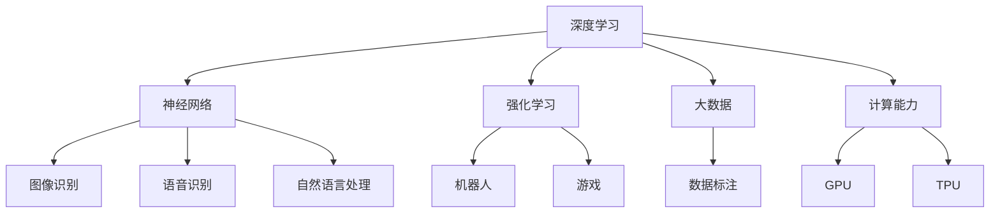
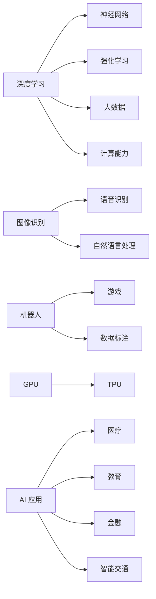
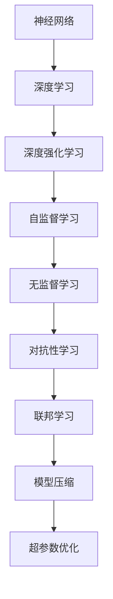
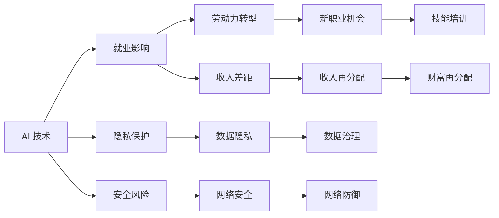

                 

## 1. 背景介绍

### 1.1 问题由来

随着人工智能技术的飞速发展，AI 领域正处于一个全新的历史转折点。无论在学术界还是在产业界，AI 的发展都展现出巨大的潜力和广阔的应用前景。在这样的大背景下，探讨人工智能的未来发展机遇成为了一个极具前瞻性和现实意义的话题。Andrej Karpathy，作为机器学习领域的翘楚，他的观点无疑具有极高的参考价值。

### 1.2 问题核心关键点

探讨人工智能的未来发展机遇，主要围绕以下几个核心关键点展开：

- **技术演进**：深度学习、神经网络、强化学习等技术的进一步突破。
- **应用拓展**：AI 在医疗、教育、金融、智能交通等领域的应用前景。
- **伦理挑战**：AI 技术的普及对就业、隐私、安全等社会伦理问题的挑战。
- **技术普及**：AI 技术的广泛应用对普通用户和开发者所带来的变化。
- **持续创新**：人工智能技术的持续创新和未来研究方向。

本文将通过合理解释以上关键点，以及 Andrej Karpathy 对此的独到见解，深入探讨人工智能的未来发展机遇。

## 2. 核心概念与联系

### 2.1 核心概念概述

为了更好地理解人工智能的未来发展机遇，我们首先需要介绍一些核心概念：

- **深度学习**：一种通过多个层次的神经网络结构来提取数据特征的机器学习技术。深度学习在图像识别、语音识别、自然语言处理等方面有着广泛的应用。
- **神经网络**：深度学习的基础，通过多个层次的节点和连接，模拟人脑的神经网络结构，进行复杂的数据处理。
- **强化学习**：通过奖励机制，让机器在不断试错中学习最优策略的机器学习方法。强化学习在游戏、机器人等领域展现出巨大的潜力。
- **大数据**：AI 发展的推动力之一，通过大量数据训练模型，提升模型的准确性和泛化能力。
- **计算能力**：强大的计算能力是 AI 发展的关键支撑，如GPU、TPU 等专用硬件的普及极大地提升了 AI 的训练速度和性能。

这些概念之间的联系可以用以下 Mermaid 流程图来表示：



这个流程图展示了深度学习、神经网络、强化学习、大数据和计算能力如何支撑和推动AI技术在不同领域的应用。

### 2.2 概念间的关系

这些核心概念之间存在着紧密的联系，形成了人工智能技术的完整生态系统。接下来我们将通过几个Mermaid流程图来展示这些概念之间的关系。

#### 2.2.1 AI 技术发展的流程图



这个流程图展示了深度学习、神经网络、强化学习、大数据和计算能力如何支撑和推动AI技术在各个领域的应用。

#### 2.2.2 AI 技术演进的流程图



这个流程图展示了神经网络、深度学习、深度强化学习、自监督学习、无监督学习、对抗性学习和联邦学习等技术演进的路径。

#### 2.2.3 AI 技术与社会影响的流程图



这个流程图展示了 AI 技术对就业、隐私、安全等社会问题的影响。

### 2.3 核心概念的整体架构

最后，我们用一个综合的流程图来展示这些核心概念在大数据、深度学习和强化学习中的整体架构：


这个综合流程图展示了大数据、深度学习和强化学习技术在大规模数据集上，通过多种学习方法和模型架构进行训练和优化，并最终应用于实际问题的全过程。

## 3. 核心算法原理 & 具体操作步骤

### 3.1 算法原理概述

AI 技术的发展离不开算法原理的不断演进。以下将详细解释深度学习、神经网络和强化学习的算法原理：

- **深度学习**：通过多个层次的神经网络结构，逐层提取数据特征。每个神经元接收上一层神经元的输出，通过激活函数进行非线性变换，输出到下一层。
- **神经网络**：由多个神经元组成的层次结构，通过连接权值和激活函数，实现数据的非线性变换和复杂处理。
- **强化学习**：通过环境反馈奖励信号，让机器在不断试错中学习最优策略。强化学习算法包括 Q-learning、Deep Q-learning 等。

### 3.2 算法步骤详解

深度学习、神经网络和强化学习的具体算法步骤如下：

#### 3.2.1 深度学习算法步骤

1. **数据准备**：收集大量标注数据，分为训练集、验证集和测试集。
2. **模型搭建**：设计神经网络结构，包括输入层、隐藏层和输出层。
3. **参数初始化**：随机初始化神经网络的权重和偏置。
4. **前向传播**：将输入数据送入模型，通过层与层之间的传递，得到输出结果。
5. **损失计算**：计算输出结果与真实标签的差距，得到损失函数。
6. **反向传播**：通过链式法则，计算损失函数对每个参数的梯度。
7. **参数更新**：使用梯度下降等优化算法，更新模型参数。
8. **模型评估**：在测试集上评估模型性能。

#### 3.2.2 神经网络算法步骤

1. **数据准备**：收集大量标注数据，分为训练集、验证集和测试集。
2. **模型搭建**：设计神经网络结构，包括输入层、隐藏层和输出层。
3. **参数初始化**：随机初始化神经网络的权重和偏置。
4. **前向传播**：将输入数据送入模型，通过层与层之间的传递，得到输出结果。
5. **损失计算**：计算输出结果与真实标签的差距，得到损失函数。
6. **反向传播**：通过链式法则，计算损失函数对每个参数的梯度。
7. **参数更新**：使用梯度下降等优化算法，更新模型参数。
8. **模型评估**：在测试集上评估模型性能。

#### 3.2.3 强化学习算法步骤

1. **环境设定**：设计环境状态和奖励函数。
2. **模型选择**：选择合适的强化学习算法，如 Q-learning、Deep Q-learning。
3. **参数初始化**：随机初始化 Q 值和策略参数。
4. **策略学习**：通过不断试错，学习最优策略。
5. **状态更新**：根据环境反馈和策略参数，更新状态。
6. **策略评估**：评估策略的性能，优化参数。
7. **模型评估**：在测试集上评估模型性能。

### 3.3 算法优缺点

#### 3.3.1 深度学习的优缺点

**优点**：
- **处理复杂数据**：深度学习能够处理复杂的非线性关系，适用于图像、语音、自然语言等多种数据类型。
- **自动特征提取**：深度学习能够自动提取数据特征，不需要手动设计特征工程。
- **高性能**：深度学习在大规模数据集上的训练速度和性能表现优异。

**缺点**：
- **数据需求高**：深度学习需要大量标注数据进行训练，数据获取和标注成本较高。
- **模型复杂**：深度学习模型复杂，难以解释，存在过拟合风险。
- **计算资源消耗大**：深度学习模型通常需要大量的计算资源进行训练和推理。

#### 3.3.2 神经网络的优缺点

**优点**：
- **高度抽象**：神经网络能够通过多个层次的抽象处理，提取数据的高级特征。
- **泛化能力强**：神经网络能够适应不同领域和不同数据分布。
- **并行计算**：神经网络可以通过 GPU 等硬件加速计算。

**缺点**：
- **训练时间长**：神经网络训练时间较长，需要大量的计算资源。
- **模型复杂**：神经网络结构复杂，难以调试和优化。
- **依赖数据**：神经网络的性能高度依赖训练数据的质量和数量。

#### 3.3.3 强化学习的优缺点

**优点**：
- **自适应性**：强化学习能够根据环境反馈，动态调整策略。
- **实时优化**：强化学习能够在实际应用中实时优化，适应复杂环境。
- **应用广泛**：强化学习广泛应用于游戏、机器人、自动驾驶等领域。

**缺点**：
- **环境复杂**：强化学习对环境的复杂性要求较高，难以设计和模拟。
- **探索与利用平衡**：强化学习需要平衡探索新策略和利用已有策略，存在策略不稳定的问题。
- **训练难度大**：强化学习的训练难度较大，需要大量计算资源和时间。

### 3.4 算法应用领域

#### 3.4.1 深度学习应用领域

- **计算机视觉**：图像分类、目标检测、图像分割等任务。
- **自然语言处理**：语言模型、机器翻译、文本生成等任务。
- **语音识别**：语音识别、语音合成、语音情感分析等任务。
- **推荐系统**：个性化推荐、广告推荐等任务。

#### 3.4.2 神经网络应用领域

- **自动驾驶**：通过传感器数据进行环境建模和决策优化。
- **机器人控制**：通过传感器数据进行环境感知和行为规划。
- **语音助手**：通过语音信号进行自然语言理解和生成。
- **医疗诊断**：通过医学影像进行疾病诊断和治疗方案推荐。

#### 3.4.3 强化学习应用领域

- **游戏 AI**：通过奖励信号进行游戏策略优化。
- **自动驾驶**：通过环境反馈进行路径规划和决策优化。
- **机器人控制**：通过传感器数据进行行为规划和路径优化。
- **金融交易**：通过市场反馈进行投资策略优化。

## 4. 数学模型和公式 & 详细讲解 & 举例说明

### 4.1 数学模型构建

在深度学习中，常用数学模型包括神经网络模型和深度学习模型。以下是一些常用的数学模型构建方法：

- **神经网络模型**：
  $$
  y = W \cdot x + b
  $$
  其中，$x$ 为输入向量，$y$ 为输出向量，$W$ 为权重矩阵，$b$ 为偏置向量。

- **深度学习模型**：
  $$
  \theta = \arg\min_{\theta} \frac{1}{n} \sum_{i=1}^n (y_i - h_{\theta}(x_i))^2
  $$
  其中，$\theta$ 为模型参数，$n$ 为样本数量，$y_i$ 为真实标签，$h_{\theta}(x_i)$ 为模型输出，$h_{\theta}(x_i)$ 为神经网络模型的非线性变换。

### 4.2 公式推导过程

#### 4.2.1 神经网络模型公式推导

神经网络模型的前向传播过程如下：
$$
y = \sigma(W \cdot x + b)
$$
其中，$\sigma$ 为激活函数，常用的激活函数包括 Sigmoid、ReLU、Tanh 等。

神经网络模型的反向传播过程如下：
$$
\frac{\partial L}{\partial W} = \frac{\partial L}{\partial y} \cdot \frac{\partial y}{\partial W}
$$
$$
\frac{\partial L}{\partial b} = \frac{\partial L}{\partial y} \cdot \frac{\partial y}{\partial b}
$$
$$
\frac{\partial L}{\partial x} = \frac{\partial L}{\partial y} \cdot \frac{\partial y}{\partial x}
$$

#### 4.2.2 深度学习模型公式推导

深度学习模型的前向传播过程如下：
$$
y = \sigma(\sum_{i=1}^n W_i \cdot h_{\theta}(x_i) + b)
$$
其中，$h_{\theta}(x_i)$ 为神经网络模型的非线性变换，$W_i$ 为权重矩阵，$b$ 为偏置向量。

深度学习模型的反向传播过程如下：
$$
\frac{\partial L}{\partial W_i} = \frac{\partial L}{\partial y} \cdot \frac{\partial y}{\partial h_{\theta}(x_i)} \cdot \frac{\partial h_{\theta}(x_i)}{\partial W_i}
$$
$$
\frac{\partial L}{\partial b_i} = \frac{\partial L}{\partial y} \cdot \frac{\partial y}{\partial h_{\theta}(x_i)}
$$
$$
\frac{\partial L}{\partial x_i} = \frac{\partial L}{\partial y} \cdot \frac{\partial y}{\partial h_{\theta}(x_i)} \cdot \frac{\partial h_{\theta}(x_i)}{\partial x_i}
$$

### 4.3 案例分析与讲解

以图像分类任务为例，介绍神经网络模型的实现步骤：

1. **数据准备**：收集大量标注图像数据，分为训练集、验证集和测试集。
2. **模型搭建**：设计卷积神经网络（CNN）结构，包括卷积层、池化层和全连接层。
3. **参数初始化**：随机初始化卷积核和全连接层权重。
4. **前向传播**：将输入图像送入卷积神经网络，通过卷积层、池化层和全连接层的传递，得到输出结果。
5. **损失计算**：计算输出结果与真实标签的差距，得到交叉熵损失函数。
6. **反向传播**：通过链式法则，计算损失函数对每个参数的梯度。
7. **参数更新**：使用梯度下降等优化算法，更新模型参数。
8. **模型评估**：在测试集上评估模型性能。

## 5. 项目实践：代码实例和详细解释说明

### 5.1 开发环境搭建

在实际项目开发中，通常需要使用 Python 和相关的深度学习框架进行模型训练和推理。以下是一个基于 PyTorch 的深度学习项目开发环境搭建流程：

1. **安装 Python**：
  ```
  sudo apt-get update
  sudo apt-get install python3-pip python3-dev python3-virtualenv
  ```

2. **安装 PyTorch**：
  ```
  pip3 install torch torchvision torchaudio
  ```

3. **安装深度学习框架**：
  ```
  pip3 install tensorflow
  ```

4. **安装其他工具**：
  ```
  pip3 install numpy pandas matplotlib
  ```

5. **创建虚拟环境**：
  ```
  python3 -m venv venv
  source venv/bin/activate
  ```

### 5.2 源代码详细实现

以下是一个基于 PyTorch 实现卷积神经网络模型的示例代码：

```python
import torch
import torch.nn as nn
import torch.optim as optim

# 定义神经网络模型
class Net(nn.Module):
    def __init__(self):
        super(Net, self).__init__()
        self.conv1 = nn.Conv2d(3, 6, 5)
        self.pool = nn.MaxPool2d(2, 2)
        self.conv2 = nn.Conv2d(6, 16, 5)
        self.fc1 = nn.Linear(16 * 5 * 5, 120)
        self.fc2 = nn.Linear(120, 84)
        self.fc3 = nn.Linear(84, 10)

    def forward(self, x):
        x = self.pool(torch.relu(self.conv1(x)))
        x = self.pool(torch.relu(self.conv2(x)))
        x = x.view(-1, 16 * 5 * 5)
        x = torch.relu(self.fc1(x))
        x = torch.relu(self.fc2(x))
        x = self.fc3(x)
        return x

# 加载数据集
train_dataset = ...
test_dataset = ...

# 定义模型、优化器和损失函数
model = Net()
optimizer = optim.SGD(model.parameters(), lr=0.001, momentum=0.9)
loss_fn = nn.CrossEntropyLoss()

# 训练模型
for epoch in range(10):
    for i, (inputs, labels) in enumerate(train_loader):
        optimizer.zero_grad()
        outputs = model(inputs)
        loss = loss_fn(outputs, labels)
        loss.backward()
        optimizer.step()

    if (i + 1) % 100 == 0:
        print('Epoch [{}/{}], Step [{}/{}], Loss: {:.4f}'
              .format(epoch + 1, 10, i + 1, len(train_loader), loss.item()))

# 测试模型
correct = 0
total = 0
with torch.no_grad():
    for inputs, labels in test_loader:
        outputs = model(inputs)
        _, predicted = torch.max(outputs.data, 1)
        total += labels.size(0)
        correct += (predicted == labels).sum().item()

print('Test Accuracy of the model on the 10000 test images: {} %'.format(100 * correct / total))
```

### 5.3 代码解读与分析

在上述代码中，我们首先定义了一个简单的卷积神经网络模型。在模型定义过程中，我们使用了 PyTorch 的模块化 API，如 `nn.Conv2d` 和 `nn.Linear`，方便快速搭建网络结构。

在模型训练过程中，我们使用了 SGD 优化器和交叉熵损失函数，对模型参数进行了优化。在每一轮迭代中，我们首先使用 `optimizer.zero_grad()` 方法清空梯度，然后前向传播计算损失函数，使用 `loss.backward()` 方法计算梯度，并使用 `optimizer.step()` 方法更新参数。

在测试过程中，我们使用 `torch.no_grad()` 方法关闭梯度计算，以提高测试速度，并使用 `torch.max()` 方法计算模型预测结果和真实标签的匹配度。

## 6. 实际应用场景

### 6.1 医疗影像诊断

深度学习在医疗影像诊断中有着广泛的应用，如 CT、MRI、X 光等影像数据的分析。通过深度学习模型，可以自动分析影像数据，辅助医生进行诊断和治疗方案推荐。

### 6.2 自动驾驶

自动驾驶系统需要实时分析传感器数据，进行环境建模和路径规划。通过深度学习模型，可以实现高精度的环境感知和决策优化，提高自动驾驶系统的安全性和可靠性。

### 6.3 智能客服

智能客服系统需要处理大量客户咨询，通过深度学习模型，可以实现自动理解客户意图，匹配最合适的答案模板，生成自然流畅的回复。

### 6.4 金融预测

金融预测需要分析大量的市场数据，通过深度学习模型，可以实现高精度的市场分析和投资策略优化。

## 7. 工具和资源推荐

### 7.1 学习资源推荐

- **Coursera**：提供深度学习、计算机视觉、自然语言处理等课程，由斯坦福、MIT、UCLA 等名校教授授课。
- **edX**：提供深度学习、强化学习、机器学习等课程，由 MIT、Harvard、UC Berkeley 等名校教授授课。
- **Udacity**：提供深度学习、计算机视觉、自然语言处理等课程，由 Google、Facebook、Amazon 等企业专家授课。

### 7.2 开发工具推荐

- **PyTorch**：开源深度学习框架，具有灵活的计算图和动态计算图特性，支持多种 GPU 和 TPU 设备。
- **TensorFlow**：Google 开源深度学习框架，支持多种编程语言，具有高效的计算性能。
- **Keras**：高层次深度学习框架，支持多种深度学习模型和预训练模型，易于使用。

### 7.3 相关论文推荐

- **深度学习框架比较研究**：对比 PyTorch、TensorFlow、Keras 等深度学习框架的优缺点和应用场景。
- **深度学习模型设计**：介绍卷积神经网络、循环神经网络、自编码器等深度学习模型的设计思路和实现方法。
- **深度学习应用案例**：展示深度学习在计算机视觉、自然语言处理、语音识别等领域的应用案例。

## 8. 总结：未来发展趋势与挑战

### 8.1 研究成果总结

深度学习、神经网络和强化学习是当前 AI 技术的主要方向，通过这些技术，AI 在各个领域展现了强大的应用潜力。AI 技术在医疗、金融、自动驾驶、智能客服等领域已经取得了显著的成果，未来仍有巨大的发展空间。

### 8.2 未来发展趋势

未来 AI 技术的发展趋势主要包括以下几个方面：

- **深度学习**：深度学习将不断演进，产生更强大的神经网络结构和更高效的训练方法。
- **神经网络**：神经网络将不断优化，提升模型的准确性和泛化能力。
- **强化学习**：强化学习将不断优化，增强模型的自适应性和实时性。
- **大数据**：大数据将持续推动 AI 技术的发展，提供更丰富的训练数据和更高效的数据处理能力。
- **计算能力**：计算能力将不断提升，支持更大规模的深度学习模型和更高效的计算任务。

### 8.3 面临的挑战

尽管 AI 技术在各个领域展现出强大的应用潜力，但在实际应用过程中仍面临诸多挑战：

- **数据隐私**：AI 技术需要大量数据进行训练，如何保护数据隐私和安全，是一个重要问题。
- **算法透明性**：AI 算法的黑盒特性，使得模型难以解释，难以调试和优化。
- **公平性**：AI 算法可能存在歧视性和偏见，如何保证算法的公平性和伦理道德，是一个重要问题。
- **计算资源**：AI 技术的训练和推理需要大量的计算资源，如何降低计算成本，是一个重要问题。

### 8.4 研究展望

未来 AI 技术的研究方向将包括：

- **跨领域融合**：将 AI 技术与大数据、物联网、区块链等技术进行跨领域融合，推动技术的综合应用。
- **多模态学习**：将 AI 技术与视觉、语音、文本等多种模态进行结合，实现多模态信息融合。
- **联邦学习**：通过联邦学习技术，实现分布式数据训练，降低数据隐私风险。
- **自适应学习**：通过自适应学习技术，实现模型的自适应优化，提高模型的泛化能力。
- **元学习**：通过元学习技术，实现模型的快速学习，提高模型的适应性和鲁棒性。

## 9. 附录：常见问题与解答

**Q1：深度学习和神经网络的区别是什么？**

A: 深度学习和神经网络是密切相关的概念，深度学习是基于神经网络的一种机器学习技术。深度学习通过多个层次的神经网络结构，逐层提取数据特征，并进行非线性变换。神经网络则是深度学习的核心组成部分，由多个神经元组成的层次结构，通过连接权值和激活函数，实现数据的非线性变换和复杂处理。

**Q2：深度学习算法的优缺点是什么？**

A: 深度学习的优点包括处理复杂数据、自动特征提取、高性能等。缺点包括数据需求高、模型复杂、计算资源消耗大等。

**Q3：AI 技术的未来发展趋势是什么？**

A: AI 技术的未来发展趋势主要包括深度学习、神经网络、强化学习的持续演进，大数据和计算能力的持续提升，跨领域融合、多模态学习和联邦学习的兴起，自适应学习和元学习的应用等。

**Q4：AI 技术在实际应用中面临哪些挑战？**

A: AI 技术在实际应用中面临数据隐私、算法透明性、公平性和计算资源等挑战。

**Q5：如何克服 AI 技术的挑战？**

A: 克服 AI 技术挑战的方法包括保护数据隐私、提高算法透明性、保证算法公平性、降低计算成本等。同时，跨领域融合、多模态学习、联邦学习和自适应学习等

