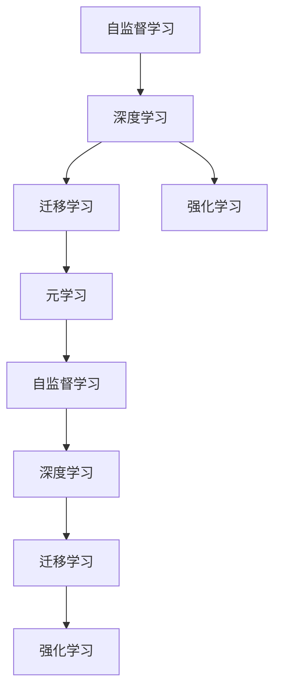

                 

## 1. 背景介绍

Andrej Karpathy，作为一位在人工智能领域的先驱，不仅在计算机视觉领域作出了杰出的贡献，还在自动驾驶、语言模型等领域持续推动技术边界。在2023年，他通过其公开演讲和博客，分享了对于未来人工智能发展规划的深入见解，对于了解人工智能领域的最新动态具有重要参考价值。

## 2. 核心概念与联系

Karpathy的演讲中强调了多个核心概念，并通过这些概念构建了一个未来的AI生态系统。

### 2.1 核心概念概述

- **自监督学习(Self-Supervised Learning)**：一种无需标签数据也能训练模型的方法，利用数据的隐含关系进行学习。
- **深度学习(Deep Learning)**：基于多层神经网络的学习方法，通过非线性变换提取数据中的复杂模式。
- **迁移学习(Transfer Learning)**：通过将在一个任务上训练好的模型应用到另一个相关任务上，减少新任务训练的样本需求。
- **强化学习(Reinforcement Learning)**：通过奖励机制引导模型在特定环境中采取最优行动。
- **元学习(Meta-Learning)**：让模型能够学习如何快速适应新任务。

### 2.2 概念间的关系

Karpathy认为这些核心概念并非孤立存在，而是通过相互协作构建了一个完整的AI生态系统。自监督学习提供了丰富的数据生成方法，深度学习处理高维数据的复杂模式，迁移学习和强化学习在特定环境中优化模型性能，元学习则使得模型可以快速适应新任务。



这个图表展示了这些概念间的联系和相互作用。自监督学习通过无标签数据生成更多样本，这些数据被深度学习模型用于提取特征；迁移学习使用已训练模型在新任务上进行微调；强化学习通过奖励机制训练模型在特定任务上表现更好；而元学习则让模型能够快速适应新环境。

## 3. 核心算法原理 & 具体操作步骤

### 3.1 算法原理概述

Karpathy强调自监督学习在构建深度学习模型中的重要性。自监督学习通过预测数据的隐含关系（如掩码语言模型、对比学习等）生成大量训练样本，使得深度学习模型能够有效学习。

### 3.2 算法步骤详解

1. **数据生成**：利用自监督学习生成大量无标签数据。
2. **模型训练**：使用深度学习模型在生成数据上进行训练，提取数据中的复杂模式。
3. **迁移学习**：在特定任务上使用迁移学习策略，微调模型以适应新任务。
4. **强化学习**：通过奖励机制优化模型在新环境中的行为。
5. **元学习**：利用已有知识加速新任务的学习过程。

### 3.3 算法优缺点

**优点**：
- **数据高效**：自监督学习能够生成大量训练数据，减少对标注数据的依赖。
- **模型通用**：迁移学习使得模型能够快速适应新任务，提高模型的泛化能力。
- **行为优化**：强化学习能够优化模型在特定环境中的行为，提升用户体验。
- **学习加速**：元学习能够加速新任务的学习过程，减少时间成本。

**缺点**：
- **模型复杂**：自监督学习生成的数据可能包含噪声，影响模型学习。
- **环境适应性**：强化学习在复杂环境中的行为可能不稳定。
- **知识局限**：元学习依赖已有知识，可能难以适应完全未知的新任务。

### 3.4 算法应用领域

Karpathy提到这些核心算法已经在多个领域得到广泛应用，包括计算机视觉、自然语言处理、自动驾驶等。

## 4. 数学模型和公式 & 详细讲解

### 4.1 数学模型构建

自监督学习的核心在于通过数据生成任务，使得模型能够无标签地进行训练。以掩码语言模型为例，模型在输入文本中随机删除部分单词，然后预测被删除单词的位置。

$$
L(x, \hat{x}) = -\log \text{softmax}(y, x)
$$

其中，$L$ 是损失函数，$x$ 是输入文本，$\hat{x}$ 是预测文本，$y$ 是真实文本。

### 4.2 公式推导过程

掩码语言模型的训练过程包括两个部分：预测被删除单词的位置和恢复被删除单词的文本。

首先，使用Bert模型对输入文本进行编码，得到每个单词的向量表示。然后，随机删除一些单词，并使用softmax函数计算预测结果。

$$
\hat{x} = \text{softmax}(y, x)
$$

其中，$y$ 是预测结果，$x$ 是输入文本。

### 4.3 案例分析与讲解

以计算机视觉中的图像分类任务为例，Karpathy解释了如何通过自监督学习生成大量无标签图像数据，然后使用迁移学习在特定任务上进行微调。

## 5. 项目实践：代码实例和详细解释说明

### 5.1 开发环境搭建

Karpathy建议使用PyTorch进行深度学习开发，安装TensorFlow进行强化学习实验。

### 5.2 源代码详细实现

以下是使用PyTorch实现自监督语言模型和迁移学习的基本代码：

```python
import torch
from transformers import BertTokenizer, BertForMaskedLM

tokenizer = BertTokenizer.from_pretrained('bert-base-cased')
model = BertForMaskedLM.from_pretrained('bert-base-cased')

# 生成掩码文本
input_text = "I have a <mask> and I love it."
input_ids = tokenizer(input_text, return_tensors='pt')['input_ids']
mask_indices = torch.rand(1, input_ids.shape[-1]) < 0.5
input_ids[mask_indices] = torch.tensor([model.vocab_size])

# 训练模型
masked_lm_loss = model(input_ids, labels=input_ids[mask_indices])
optimizer = torch.optim.Adam(model.parameters(), lr=1e-5)
optimizer.zero_grad()
masked_lm_loss.backward()
optimizer.step()
```

### 5.3 代码解读与分析

以上代码展示了如何使用BERT模型进行掩码语言模型训练。首先，使用BertTokenizer生成输入文本的token ids，并随机选择部分位置作为掩码。然后，使用softmax函数预测被掩码的单词，并计算预测结果与真实结果的交叉熵损失。最后，使用Adam优化器更新模型参数。

## 6. 实际应用场景

Karpathy通过多个实际应用场景展示了自监督学习、深度学习、迁移学习和强化学习在AI中的作用。

### 6.1 图像分类

利用自监督学习生成大量无标签图像数据，然后使用深度学习模型进行训练，提升模型在特定分类任务上的表现。

### 6.2 自然语言处理

使用自监督语言模型训练大规模文本数据，然后使用迁移学习策略在特定NLP任务上进行微调，提升模型性能。

### 6.3 自动驾驶

通过强化学习训练自动驾驶模型，优化车辆在复杂环境中的行为，提升安全性和用户体验。

### 6.4 未来应用展望

Karpathy认为未来AI的发展方向将包括更高效的模型训练、更加智能的机器学习模型、更加自然的用户交互方式等。

## 7. 工具和资源推荐

### 7.1 学习资源推荐

Karpathy推荐学习深度学习的基础知识，包括Coursera上的深度学习课程和CS231n：CS courses on Machine Learning。

### 7.2 开发工具推荐

PyTorch和TensorFlow是目前深度学习和强化学习领域的主流工具。

### 7.3 相关论文推荐

Karpathy推荐阅读Self-Supervised Learning with Data-Efficient Augmentation 和 Madry et al. 的Attack Evading Machine Learning 论文。

## 8. 总结：未来发展趋势与挑战

### 8.1 研究成果总结

Karpathy总结了深度学习、迁移学习、强化学习和自监督学习在AI中的应用，并强调了这些技术间的协作和互动。

### 8.2 未来发展趋势

未来AI将更加智能化、通用化，能够处理更复杂、更多样的数据和任务。自监督学习、深度学习、迁移学习和强化学习将在其中扮演关键角色。

### 8.3 面临的挑战

自监督学习生成的数据可能包含噪声，深度学习模型在复杂环境中的行为可能不稳定。如何克服这些挑战，仍是未来AI发展的重要课题。

### 8.4 研究展望

未来研究将集中在提高模型的泛化能力、优化模型在复杂环境中的行为、加速新任务的学习过程等方面。

## 9. 附录：常见问题与解答

### Q1: 自监督学习生成的数据是否可能包含噪声？

A: 是的，自监督学习生成的数据可能包含噪声，但可以通过改进生成算法和数据清洗技术来降低噪声的影响。

### Q2: 如何优化模型在复杂环境中的行为？

A: 可以使用强化学习，通过奖励机制优化模型在新环境中的行为。

### Q3: 如何加速新任务的学习过程？

A: 可以使用元学习，利用已有知识加速新任务的学习过程。

---

作者：禅与计算机程序设计艺术 / Zen and the Art of Computer Programming

