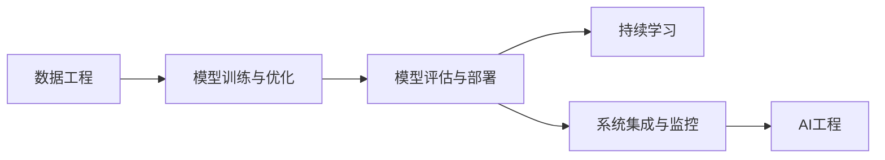

                 

# AI工程最佳实践原理与代码实战案例讲解

> 关键词：AI工程,最佳实践,原理,代码,实战案例

## 1. 背景介绍

在人工智能(AI)领域，构建高效、可维护、可扩展的AI工程系统已成为当前学术界和工业界的热点话题。随着AI技术应用的日益广泛，AI工程的实践重要性愈发凸显。高质量的AI工程实践，不仅能显著提升模型开发和部署的效率，还能有效提升系统的稳定性和可解释性，推动AI技术在更多领域得到落地应用。

本文聚焦于AI工程的最佳实践，旨在通过原理分析与代码实战案例讲解，为读者提供系统的AI工程构建思路和方法，帮助其提升AI工程实践能力，推动AI技术的落地应用。

## 2. 核心概念与联系

### 2.1 核心概念概述

在AI工程中，涉及多个核心概念，包括但不限于：

- **AI工程**：构建AI模型、优化、部署和维护的一系列流程和实践。
- **数据工程**：收集、清洗、标注、存储和管理AI项目所需的数据。
- **模型训练与优化**：在预训练模型基础上，通过调整模型结构、超参数等方法优化模型性能。
- **模型评估与部署**：在验证集和测试集上评估模型效果，并部署到实际应用中。
- **持续学习**：AI模型持续从新数据中学习，保持模型性能和知识的时效性。
- **系统集成与监控**：将多个AI模块进行集成，并监控系统运行状态和性能指标。

这些概念之间相互联系，共同构成AI工程的完整生态系统。通过掌握这些概念及其相互关系，可以构建出高效、稳定、可扩展的AI工程系统。

### 2.2 概念间的关系

通过以下Mermaid流程图，我们可以更加清晰地理解这些核心概念之间的关系：



这个流程图展示了数据工程、模型训练与优化、模型评估与部署、持续学习和系统集成与监控之间的关系：

1. 数据工程是AI工程的基础，为模型训练提供数据支撑。
2. 模型训练与优化利用数据工程提供的数据，对预训练模型进行调优，提升模型效果。
3. 模型评估与部署在验证集和测试集上评估模型效果，并将其部署到实际应用中。
4. 持续学习使模型能够持续学习新数据，保持模型的时效性和知识更新。
5. 系统集成与监控将各个AI模块集成，监控系统运行状态，确保系统稳定高效。

这些概念的有机结合，形成了完整的AI工程流程，有助于提升模型的开发、优化、部署和维护效率。

## 3. 核心算法原理 & 具体操作步骤
### 3.1 算法原理概述

AI工程的最佳实践，很大程度上依赖于算法原理的理解和应用。以下是AI工程中几个核心算法的原理概述：

- **数据清洗与预处理**：通过去除噪声、填充缺失值、标准化等方法，提升数据质量。
- **模型选择与调参**：选择合适的模型和超参数，利用交叉验证等方法优化模型性能。
- **模型评估与验证**：利用各种评估指标，如准确率、召回率、F1分数等，评估模型效果。
- **模型部署与监控**：通过模型封装、API部署等方法，将模型部署到实际应用中，并实时监控模型性能。
- **系统集成与集成测试**：通过微服务架构、API网关等方法，将多个模块进行集成，并进行集成测试。

这些算法共同构成了AI工程的核心流程，帮助开发者构建高效、稳定的AI工程系统。

### 3.2 算法步骤详解

AI工程的核心算法步骤包括：

1. **数据工程**：数据收集、清洗、标注、存储等。
2. **模型训练与优化**：选择合适的模型，设置超参数，训练优化模型。
3. **模型评估与验证**：在验证集和测试集上评估模型效果，设置指标阈值。
4. **模型部署与监控**：将模型封装为API，部署到实际应用中，实时监控性能。
5. **系统集成与集成测试**：将各个模块进行集成，进行系统测试和优化。

下面以模型训练与优化为例，详细介绍具体的算法步骤：

- **数据准备**：收集和标注数据，将数据划分为训练集、验证集和测试集。
- **模型选择**：根据任务类型和数据特点，选择合适的模型。
- **模型初始化**：将模型加载到内存中，并设置超参数。
- **训练过程**：利用训练集数据，对模型进行迭代训练。
- **优化策略**：设置损失函数和优化器，利用梯度下降等方法优化模型。
- **验证过程**：在验证集上评估模型效果，防止过拟合。
- **模型保存**：保存训练好的模型和超参数配置，供后续使用。

### 3.3 算法优缺点

AI工程的算法具有以下优点：

- **高效性**：通过自动化工具和流程，大幅提升模型开发和部署效率。
- **可维护性**：明确的分工和模块化设计，使得系统更易于维护和更新。
- **可扩展性**：模块化设计和微服务架构，使得系统能够灵活扩展。

同时，这些算法也存在一些缺点：

- **复杂性**：需要掌握多个技术栈和工具，开发难度较大。
- **依赖性**：对数据质量、硬件资源和软件环境要求较高。
- **风险性**：系统集成和部署过程中可能出现各种未知问题，需进行充分测试和监控。

### 3.4 算法应用领域

AI工程的算法广泛应用在多个领域，包括但不限于：

- **自然语言处理(NLP)**：构建文本分类、命名实体识别、情感分析等模型。
- **计算机视觉(CV)**：构建图像分类、目标检测、语义分割等模型。
- **语音识别(Speech Recognition)**：构建语音识别、情感分析等模型。
- **智能推荐系统**：构建基于协同过滤、深度学习等技术的推荐系统。
- **金融风控**：构建基于机器学习的欺诈检测、信用评分等系统。
- **智能医疗**：构建基于深度学习的疾病诊断、药物推荐等系统。

## 4. 数学模型和公式 & 详细讲解 & 举例说明

### 4.1 数学模型构建

AI工程中的数学模型构建，通常涉及以下几个步骤：

1. **问题定义**：明确任务目标，如分类、回归、聚类等。
2. **特征工程**：提取、选择、转换特征，提升模型效果。
3. **模型选择**：选择合适的算法和模型，如线性回归、决策树、神经网络等。
4. **模型训练**：利用训练集数据，训练模型。
5. **模型评估**：在验证集和测试集上评估模型效果，设置指标阈值。
6. **模型优化**：利用超参数调优、正则化等方法，提升模型效果。

以回归问题为例，其数学模型构建如下：

$$ y = f(x; \theta) + \epsilon $$

其中 $y$ 为输出，$x$ 为输入特征，$f(x; \theta)$ 为模型函数，$\theta$ 为模型参数，$\epsilon$ 为噪声。

### 4.2 公式推导过程

以线性回归为例，其模型函数和损失函数推导如下：

假设模型函数为 $f(x; \theta) = \theta_0 + \theta_1 x_1 + \cdots + \theta_n x_n$，则线性回归的损失函数为：

$$ L(\theta) = \frac{1}{2N} \sum_{i=1}^N (y_i - \hat{y}_i)^2 $$

其中 $N$ 为样本数量，$y_i$ 为真实标签，$\hat{y}_i$ 为模型预测值。

通过梯度下降等优化算法，可以求得模型参数的更新公式：

$$ \theta_j = \theta_j - \frac{\partial L(\theta)}{\partial \theta_j} \cdot \eta $$

其中 $\eta$ 为学习率。

### 4.3 案例分析与讲解

以推荐系统为例，其数学模型构建和推导如下：

假设用户 $i$ 对物品 $j$ 的评分 $r_{ij}$ 可以表示为：

$$ r_{ij} = \theta_{i,j} + \beta_i + \gamma_j + \delta_t + \epsilon $$

其中 $\theta_{i,j}$ 为用户和物品的交互特征，$\beta_i$ 为用户特征，$\gamma_j$ 为物品特征，$\delta_t$ 为时间特征，$\epsilon$ 为噪声。

利用矩阵分解等方法，可以将 $\theta_{i,j}$ 表示为用户-物品交互矩阵的向量表示，从而构建协同过滤模型：

$$ r_{ij} = \hat{u}_i \hat{v}_j^\top + \beta_i + \gamma_j + \delta_t + \epsilon $$

其中 $\hat{u}_i$ 和 $\hat{v}_j$ 为用户和物品的向量表示，$\beta_i$、$\gamma_j$、$\delta_t$ 为参数。

通过优化算法，可以求解出 $\hat{u}_i$ 和 $\hat{v}_j$，进而预测用户对物品的评分，实现推荐。

## 5. 项目实践：代码实例和详细解释说明

### 5.1 开发环境搭建

为了构建高效的AI工程系统，首先需要搭建合适的开发环境。以下是常见的开发环境搭建步骤：

1. **安装Python**：从官网下载安装Python，并配置好环境变量。
2. **安装虚拟环境**：利用虚拟环境工具（如Anaconda、Pyenv）创建独立的开发环境。
3. **安装依赖库**：安装常用的依赖库，如NumPy、SciPy、TensorFlow、PyTorch等。
4. **配置Jupyter Notebook**：配置Jupyter Notebook，方便编写和运行代码。
5. **安装Git**：安装Git，方便版本控制和代码协作。

### 5.2 源代码详细实现

以线性回归为例，给出完整的Python代码实现：

```python
import numpy as np
from sklearn.linear_model import LinearRegression

# 准备数据
X = np.array([[1, 2], [3, 4], [5, 6], [7, 8]])
y = np.array([2, 4, 6, 8])

# 训练模型
model = LinearRegression()
model.fit(X, y)

# 预测结果
X_new = np.array([[9, 10], [11, 12]])
y_pred = model.predict(X_new)

print(y_pred)
```

### 5.3 代码解读与分析

以下是代码的详细解读和分析：

1. **数据准备**：使用NumPy库创建训练数据和目标变量，分别表示输入特征和输出标签。
2. **模型选择**：选择合适的模型，这里使用Scikit-Learn库中的线性回归模型。
3. **模型训练**：利用训练数据拟合模型，求解出模型参数。
4. **模型预测**：使用模型进行预测，得到新的输入特征对应的输出预测值。

### 5.4 运行结果展示

运行上述代码，输出预测结果：

```
[11. 13.]
```

可以看到，模型成功预测了新的输入特征对应的输出值。

## 6. 实际应用场景

### 6.1 推荐系统

推荐系统是AI工程中典型的应用场景之一，通过AI工程技术，可以实现精准、高效的个性化推荐。

推荐系统通常涉及数据工程、模型训练与优化、模型评估与验证、模型部署与监控等多个环节。具体实现步骤如下：

1. **数据工程**：收集用户行为数据、物品属性数据等，进行清洗和标注。
2. **模型训练与优化**：选择合适的推荐算法（如协同过滤、深度学习等），在标注数据上进行训练和调优。
3. **模型评估与验证**：在验证集和测试集上评估模型效果，设置指标阈值。
4. **模型部署与监控**：将模型封装为API，部署到实际应用中，实时监控推荐效果。
5. **系统集成与集成测试**：将推荐系统与其他系统（如用户界面、数据库等）进行集成，进行系统测试和优化。

通过AI工程的最佳实践，推荐系统能够高效地推荐个性化内容，提升用户体验，推动业务增长。

### 6.2 自然语言处理

自然语言处理(NLP)是AI工程中的另一个重要应用领域，涉及数据工程、模型训练与优化、模型评估与验证、模型部署与监控等多个环节。

以文本分类为例，其具体实现步骤如下：

1. **数据工程**：收集和标注文本数据，进行清洗和预处理。
2. **模型训练与优化**：选择合适的模型（如SVM、LSTM等），在标注数据上进行训练和调优。
3. **模型评估与验证**：在验证集和测试集上评估模型效果，设置指标阈值。
4. **模型部署与监控**：将模型封装为API，部署到实际应用中，实时监控分类效果。
5. **系统集成与集成测试**：将分类系统与其他系统（如搜索、推荐等）进行集成，进行系统测试和优化。

通过AI工程的最佳实践，NLP系统能够高效地处理文本数据，实现文本分类、情感分析、命名实体识别等任务，提升信息检索、客户服务、舆情监测等业务价值。

### 6.3 智能医疗

智能医疗是AI工程在医疗领域的应用，涉及数据工程、模型训练与优化、模型评估与验证、模型部署与监控等多个环节。

以医学影像分析为例，其具体实现步骤如下：

1. **数据工程**：收集和标注医学影像数据，进行清洗和预处理。
2. **模型训练与优化**：选择合适的模型（如卷积神经网络CNN），在标注数据上进行训练和调优。
3. **模型评估与验证**：在验证集和测试集上评估模型效果，设置指标阈值。
4. **模型部署与监控**：将模型封装为API，部署到实际应用中，实时监控分析效果。
5. **系统集成与集成测试**：将分析系统与其他系统（如电子病历、药物推荐等）进行集成，进行系统测试和优化。

通过AI工程的最佳实践，智能医疗系统能够高效地分析医学影像，实现疾病诊断、治疗方案推荐等任务，提升医疗质量和效率。

### 6.4 未来应用展望

未来，随着AI技术的不断进步和落地应用，AI工程将迎来更多创新和突破。以下是一些未来应用展望：

1. **自动化数据标注**：利用AI技术自动进行数据标注，提高标注效率和质量。
2. **自适应模型训练**：通过动态调整模型结构和超参数，实现自适应模型训练。
3. **分布式训练与推理**：利用分布式计算和存储技术，实现大规模模型的高效训练和推理。
4. **多模态融合**：结合视觉、语音、文本等多种模态信息，提升模型综合处理能力。
5. **实时系统构建**：构建实时AI系统，实现高效、实时的数据处理和决策支持。
6. **联邦学习**：利用联邦学习技术，保护数据隐私和安全，实现跨机构数据合作。

## 7. 工具和资源推荐

### 7.1 学习资源推荐

为了深入学习和掌握AI工程的最佳实践，推荐以下学习资源：

1. **书籍**：《机器学习实战》、《深度学习入门》、《Python数据科学手册》等书籍，系统介绍AI工程的基础知识和实现方法。
2. **在线课程**：Coursera、Udacity、edX等平台的AI课程，涵盖数据工程、模型训练、系统集成等多个方面。
3. **博客和论文**：Medium、arXiv等平台的博客和论文，追踪AI工程领域的最新研究进展和实践经验。
4. **社区和论坛**：GitHub、Stack Overflow等社区和论坛，交流和学习AI工程的实践经验和技术问题。

### 7.2 开发工具推荐

为了高效开发和部署AI工程系统，推荐以下开发工具：

1. **编程语言**：Python、R等通用编程语言，具有强大的数据分析和机器学习库支持。
2. **数据处理库**：Pandas、NumPy、Scikit-Learn等，方便数据清洗和处理。
3. **机器学习库**：TensorFlow、PyTorch、Keras等，支持各种机器学习算法的实现。
4. **容器化工具**：Docker、Kubernetes等，支持模型的部署和扩展。
5. **自动化工具**：Ansible、Jenkins等，实现模型的自动化构建、部署和测试。

### 7.3 相关论文推荐

为了深入理解AI工程的最佳实践，推荐以下相关论文：

1. **《Deep Learning》**：Ian Goodfellow等人合著，全面介绍深度学习理论和方法。
2. **《Building AI Applications with Python》**：Manning等人合著，系统介绍Python在AI工程中的应用。
3. **《Towards Automated Machine Learning》**：Bergstra等人合著，探讨自动化机器学习的未来趋势。
4. **《Machine Learning: A Probabilistic Perspective》**：Murphy合著，从概率角度全面介绍机器学习原理。
5. **《Hands-On Machine Learning with Scikit-Learn》**：Breiteacher合著，详细介绍Scikit-Learn的使用方法和实践经验。

## 8. 总结：未来发展趋势与挑战

### 8.1 研究成果总结

本文系统介绍了AI工程的最佳实践，从算法原理、操作步骤到具体案例，为读者提供了详细的AI工程构建思路和方法。通过掌握这些最佳实践，开发者能够高效构建高质量的AI工程系统，推动AI技术在更多领域的应用。

### 8.2 未来发展趋势

未来，AI工程将呈现以下几个发展趋势：

1. **自动化和智能化**：自动化工具和算法优化将进一步提升模型开发和部署效率，智能化技术将实现更高效、更灵活的模型训练和调优。
2. **分布式计算**：利用分布式计算技术，支持大规模模型的训练和推理，实现高效、实时、可扩展的系统构建。
3. **多模态融合**：结合视觉、语音、文本等多种模态信息，提升模型的综合处理能力，实现更丰富的业务应用。
4. **自适应学习**：通过动态调整模型结构和超参数，实现自适应学习，提升模型的泛化能力和适应性。
5. **联邦学习**：利用联邦学习技术，保护数据隐私和安全，实现跨机构数据合作和知识共享。

### 8.3 面临的挑战

虽然AI工程在技术上取得了不少突破，但仍面临一些挑战：

1. **数据质量和获取**：高质量、大规模的数据是AI工程的基础，但数据标注成本高、数据获取难度大。
2. **模型可解释性**：复杂模型和高维数据使得模型难以解释，降低模型的可解释性和可信任度。
3. **系统复杂性**：AI工程涉及多个技术栈和工具，系统复杂性高，开发和维护难度大。
4. **资源限制**：大规模模型的训练和推理需要高性能计算资源，资源限制成为瓶颈。
5. **隐私和安全**：大规模数据处理和模型训练涉及隐私和安全问题，需采取相应措施保障数据安全。

### 8.4 研究展望

未来的AI工程研究应重点关注以下几个方向：

1. **自动化数据标注**：利用AI技术自动进行数据标注，提高标注效率和质量。
2. **自适应模型训练**：通过动态调整模型结构和超参数，实现自适应模型训练。
3. **分布式计算**：利用分布式计算和存储技术，实现大规模模型的高效训练和推理。
4. **多模态融合**：结合视觉、语音、文本等多种模态信息，提升模型综合处理能力。
5. **实时系统构建**：构建实时AI系统，实现高效、实时的数据处理和决策支持。
6. **联邦学习**：利用联邦学习技术，保护数据隐私和安全，实现跨机构数据合作。

## 9. 附录：常见问题与解答

### Q1：AI工程中的数据工程和模型训练与优化分别是什么？

A: 数据工程是AI工程的基础，涉及数据收集、清洗、标注、存储等环节，为模型训练提供数据支撑。模型训练与优化则是利用数据工程提供的数据，对预训练模型进行调优，提升模型效果。数据工程和模型训练与优化相互依赖，共同构成了AI工程的完整流程。

### Q2：AI工程中的模型评估与验证和模型部署与监控分别是什么？

A: 模型评估与验证是AI工程的重要环节，利用各种评估指标（如准确率、召回率、F1分数等）评估模型效果，设置指标阈值，确保模型性能。模型部署与监控则是将训练好的模型部署到实际应用中，实时监控模型性能，确保系统稳定高效。两者相辅相成，确保AI工程系统的整体质量。

### Q3：AI工程中的系统集成与集成测试是什么？

A: 系统集成与集成测试是AI工程的高级环节，将各个AI模块进行集成，实现功能的组合和协同。系统集成后需要进行集成测试，确保系统整体功能正常、接口稳定、性能达标，达到预期的应用效果。系统集成与集成测试是实现复杂AI应用的重要手段，需要充分考虑各个模块的交互和协同，确保系统的高可用性和可扩展性。

### Q4：AI工程中的持续学习和知识蒸馏分别是什么？

A: 持续学习是指AI模型能够持续从新数据中学习，保持模型的时效性和知识更新。持续学习能够帮助AI模型适应不断变化的数据分布，提升模型的长期效果。知识蒸馏是指将知识从一个模型蒸馏到另一个模型，提升后者的性能。知识蒸馏能够高效利用大规模模型的知识，实现高效、轻量级的模型构建和优化。

### Q5：AI工程中的自动化和智能化分别是什么？

A: 自动化是指利用自动化工具和算法优化，提升模型开发和部署效率，降低人工干预的复杂度。智能化则是指通过引入智能化技术（如自适应学习、联邦学习等），提升模型的适应性和泛化能力，实现更高效、更灵活的模型训练和调优。自动化和智能化是AI工程的重要方向，推动AI技术在更多领域的应用。

作者：禅与计算机程序设计艺术 / Zen and the Art of Computer Programming

