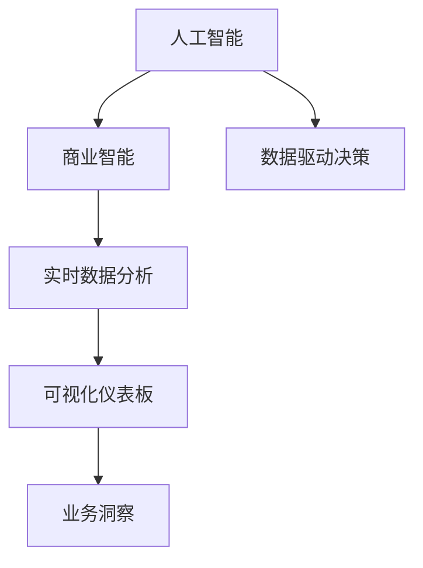
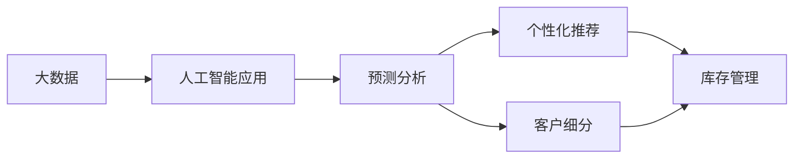
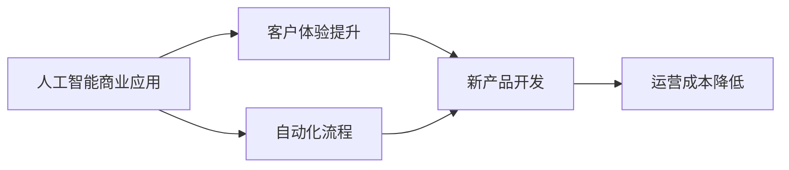
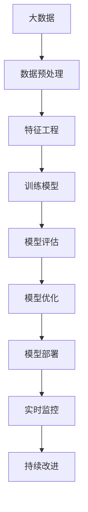

                 

# AI技术与商业模式的创新

> 关键词：AI技术, 商业模式创新, 人工智能, 机器学习, 深度学习, 大数据, 商业应用, 创新案例

## 1. 背景介绍

### 1.1 问题由来
人工智能（AI）技术的飞速发展正在改变各行各业的运作方式。AI技术在商业中的应用已经从最初的数据处理和预测分析，逐步扩展到更广泛的企业运营和战略决策中。然而，如何充分利用AI技术并有效整合到商业策略中，成为企业面临的新挑战。传统商业模式在面对AI技术革新时，需要重新思考和创新。

### 1.2 问题核心关键点
AI技术的引入与商业模式的结合，涉及到技术应用、组织架构、管理决策等多个层面的变革。从技术角度来看，AI能够处理海量数据、自动化决策、优化运营效率，但如何结合企业的核心业务进行创新应用，是实现AI商业价值的关键。从管理角度来看，AI技术需要与企业文化、领导力、员工培训等方面相融合，才能在企业中产生积极影响。

### 1.3 问题研究意义
研究AI技术与商业模式的创新，对于推动企业转型升级，提高竞争力和创新能力，具有重要意义。通过AI技术的应用，企业可以优化产品和服务，提升客户体验，降低成本，增强市场竞争力。同时，AI的引入也是企业向数字化、智能化转型的重要步骤，有助于构建新的业务增长点，实现可持续发展的目标。

## 2. 核心概念与联系

### 2.1 核心概念概述

为更好地理解AI技术与商业模式的创新，本节将介绍几个密切相关的核心概念：

- **人工智能（AI）**：以机器学习和深度学习为代表的智能技术，能够从数据中学习规律，做出预测和决策。
- **机器学习（ML）**：通过算法使机器能够自动学习并提高性能，从数据中提取特征和规律。
- **深度学习（DL）**：一种基于神经网络的机器学习方法，能够处理高维度、非结构化的数据，具有强大的模式识别能力。
- **大数据（Big Data）**：指海量的数据集，通过分析这些数据集可以揭示深层次的业务规律和趋势。
- **商业智能（BI）**：利用数据分析和可视化技术，辅助企业进行决策分析，提升运营效率和市场竞争力。
- **人工智能商业应用**：AI技术在企业管理、市场营销、客户服务、供应链优化等方面的具体应用。
- **商业模式创新**：结合AI技术和新业务模式，重新定义产品和服务，创造新的市场价值。

这些核心概念之间的逻辑关系可以通过以下Mermaid流程图来展示：

```mermaid
graph LR
    A[人工智能 (AI)] --> B[机器学习 (ML)]
    A --> C[深度学习 (DL)]
    B --> D[大数据 (Big Data)]
    C --> D
    D --> E[商业智能 (BI)]
    A --> F[人工智能商业应用]
    F --> G[商业模式创新]
```

这个流程图展示了大数据、机器学习、深度学习、商业智能与人工智能商业应用和商业模式创新之间的逻辑关系。

### 2.2 概念间的关系

这些核心概念之间存在着紧密的联系，形成了AI技术商业应用的完整生态系统。下面我通过几个Mermaid流程图来展示这些概念之间的关系。

#### 2.2.1 人工智能技术与商业智能的融合



这个流程图展示了人工智能与商业智能的融合过程，即通过数据驱动决策，实时数据分析和可视化仪表板，帮助企业获取业务洞察。

#### 2.2.2 大数据与人工智能的应用场景



这个流程图展示了大数据在人工智能应用中的具体场景，如预测分析、个性化推荐、客户细分和库存管理等。

#### 2.2.3 人工智能商业应用的创新



这个流程图展示了人工智能商业应用的具体创新点，如客户体验提升、自动化流程、新产品开发和运营成本降低等。

### 2.3 核心概念的整体架构

最后，我们用一个综合的流程图来展示这些核心概念在大数据、机器学习和深度学习的应用路径：



这个综合流程图展示了从数据预处理、特征工程、训练模型、模型评估、模型优化到模型部署和持续改进的大数据和机器学习应用路径。

## 3. 核心算法原理 & 具体操作步骤
### 3.1 算法原理概述

AI技术与商业模式的创新，本质上是一个将AI技术应用到具体业务中的过程。其核心算法原理包括以下几个方面：

- **数据准备**：收集、清洗和整理用于训练模型的数据。
- **模型选择**：选择适合具体业务的AI模型，如线性回归、决策树、神经网络等。
- **特征工程**：从原始数据中提取有意义的特征，提高模型性能。
- **模型训练**：利用标注数据对模型进行训练，优化模型参数。
- **模型评估**：通过测试数据集评估模型性能，选择最佳模型。
- **模型部署**：将训练好的模型部署到实际应用中，进行实时预测。
- **持续优化**：根据反馈数据不断调整和优化模型，提高模型精度和性能。

### 3.2 算法步骤详解

AI技术与商业模式的创新，通常包括以下几个关键步骤：

**Step 1: 数据收集与预处理**
- 收集业务相关的数据，包括历史销售数据、客户反馈数据、市场调研数据等。
- 数据清洗和整理，去除噪声和不完整数据，确保数据质量。

**Step 2: 特征工程**
- 根据业务需求，设计有意义的特征。
- 使用统计分析和数据挖掘技术，提取关键特征。
- 对特征进行归一化、标准化等预处理，提高模型性能。

**Step 3: 模型选择与训练**
- 根据业务问题选择适合的模型，如分类模型、回归模型、聚类模型等。
- 利用标注数据对模型进行训练，优化模型参数。
- 使用交叉验证等技术评估模型性能，选择最佳模型。

**Step 4: 模型部署与应用**
- 将训练好的模型部署到实际应用中，进行实时预测。
- 与现有系统集成，实现自动化决策。
- 监控模型性能，及时发现和解决问题。

**Step 5: 持续优化与改进**
- 根据反馈数据不断调整和优化模型，提高模型精度和性能。
- 引入新技术和新方法，提升模型效果。
- 持续改进业务流程，优化用户体验。

### 3.3 算法优缺点

AI技术与商业模式的创新方法具有以下优点：
1. 提升决策效率：AI技术能够自动化数据分析和预测，提高决策速度和准确性。
2. 优化客户体验：AI技术能够根据用户行为和偏好，提供个性化服务，提升用户体验。
3. 降低运营成本：AI技术能够自动化执行重复性任务，减少人力成本。
4. 创造新业务模式：AI技术能够挖掘新的业务机会，创造新的商业模式。

同时，该方法也存在一些缺点：
1. 数据依赖度高：AI技术需要大量高质量的数据支持，数据获取和预处理成本较高。
2. 模型复杂度高：AI模型复杂度高，训练和部署成本较高。
3. 解释性不足：AI模型往往是“黑盒”模型，难以解释其内部工作机制。
4. 安全与隐私问题：AI技术涉及敏感数据，需要严格的数据保护和隐私管理。

### 3.4 算法应用领域

AI技术与商业模式的创新方法在多个领域得到了广泛应用，例如：

- **零售业**：利用AI技术进行需求预测、库存管理、个性化推荐等，提升销售效率和客户体验。
- **金融业**：利用AI技术进行信用评估、风险控制、欺诈检测等，提高金融服务质量和安全性。
- **医疗健康**：利用AI技术进行疾病诊断、个性化治疗、健康管理等，提升医疗服务水平。
- **制造业**：利用AI技术进行质量控制、设备预测性维护、供应链优化等，提高生产效率和产品质量。
- **物流运输**：利用AI技术进行路径规划、运输调度、智能仓储等，提升物流效率和运输安全。

这些领域的应用展示了AI技术与商业模式的创新如何帮助企业实现业务转型和升级。

## 4. 数学模型和公式 & 详细讲解 & 举例说明（备注：数学公式请使用latex格式，latex嵌入文中独立段落使用 $$，段落内使用 $)
### 4.1 数学模型构建

在AI技术与商业模式的创新过程中，通常使用以下数学模型进行建模：

**回归模型**：用于预测数值型数据，如销售预测、客户评分等。数学公式如下：

$$ y = \theta_0 + \theta_1 x_1 + \theta_2 x_2 + ... + \theta_n x_n $$

其中，$y$ 表示预测结果，$\theta_i$ 表示模型参数，$x_i$ 表示输入特征。

**分类模型**：用于分类问题，如客户分类、产品分类等。常用的分类算法包括逻辑回归、决策树、随机森林等。

**聚类模型**：用于无监督学习，如客户细分、市场细分等。常用的聚类算法包括K-Means、层次聚类等。

### 4.2 公式推导过程

以下以线性回归模型为例，推导其数学公式：

线性回归模型的一般形式为：

$$ y = \theta_0 + \theta_1 x_1 + \theta_2 x_2 + ... + \theta_n x_n + \epsilon $$

其中，$y$ 表示预测结果，$\theta_i$ 表示模型参数，$x_i$ 表示输入特征，$\epsilon$ 表示误差项。

根据最小二乘法，模型参数的求解公式为：

$$ \theta = (X^T X)^{-1} X^T y $$

其中，$X$ 表示特征矩阵，$y$ 表示目标变量向量。

### 4.3 案例分析与讲解

以客户细分为例，利用K-Means算法进行聚类分析。假设客户数据包含年龄、性别、消费金额等特征，目标是按照消费行为对客户进行分类。

1. 数据预处理：清洗和整理数据，确保数据质量。
2. 特征工程：选择有意义的特征，如年龄、消费金额等。
3. 模型训练：使用K-Means算法对客户数据进行聚类，得到多个客户群体。
4. 模型评估：计算聚类结果的误差率和F1分数，评估模型性能。
5. 应用：根据聚类结果，为不同客户群体提供差异化的营销策略。

## 5. 项目实践：代码实例和详细解释说明
### 5.1 开发环境搭建

在进行AI技术与商业模式的创新实践前，我们需要准备好开发环境。以下是使用Python进行TensorFlow开发的环境配置流程：

1. 安装Anaconda：从官网下载并安装Anaconda，用于创建独立的Python环境。

2. 创建并激活虚拟环境：
```bash
conda create -n tf-env python=3.8 
conda activate tf-env
```

3. 安装TensorFlow：根据CUDA版本，从官网获取对应的安装命令。例如：
```bash
conda install tensorflow tensorflow-cpu=2.6 -c conda-forge
```

4. 安装各类工具包：
```bash
pip install numpy pandas scikit-learn matplotlib tqdm jupyter notebook ipython
```

完成上述步骤后，即可在`tf-env`环境中开始AI技术与商业模式的创新实践。

### 5.2 源代码详细实现

下面我们以客户细分任务为例，给出使用TensorFlow进行K-Means聚类的PyTorch代码实现。

首先，定义客户数据和目标变量：

```python
import numpy as np
from sklearn.cluster import KMeans
from sklearn.preprocessing import StandardScaler

# 生成客户数据
X = np.random.randn(1000, 3)
y = np.random.randint(0, 3, size=1000)

# 标准化数据
scaler = StandardScaler()
X_scaled = scaler.fit_transform(X)

# 训练K-Means模型
kmeans = KMeans(n_clusters=3, random_state=42)
kmeans.fit(X_scaled)

# 输出聚类结果
labels = kmeans.predict(X_scaled)
print(labels)
```

然后，定义评估函数：

```python
from sklearn.metrics import accuracy_score

def evaluate_clusters(X, y, labels):
    # 计算误差率
    error_rate = 1 - accuracy_score(y, labels)
    return error_rate

# 评估聚类结果
error_rate = evaluate_clusters(X, y, labels)
print(f"误差率为：{error_rate:.2f}")
```

最后，启动训练流程并输出评估结果：

```python
# 定义聚类模型
kmeans = KMeans(n_clusters=3, random_state=42)

# 训练模型
kmeans.fit(X_scaled)

# 输出聚类结果
labels = kmeans.predict(X_scaled)

# 评估聚类结果
error_rate = evaluate_clusters(X, y, labels)

print(f"聚类结果为：{labels}")
print(f"误差率为：{error_rate:.2f}")
```

以上就是使用TensorFlow进行K-Means聚类的完整代码实现。可以看到，TensorFlow提供了丰富的机器学习算法库，使得模型训练和评估变得简单高效。

### 5.3 代码解读与分析

让我们再详细解读一下关键代码的实现细节：

**数据生成与预处理**：
- `np.random.randn(1000, 3)`：生成1000个样本，每个样本包含3个特征。
- `y = np.random.randint(0, 3, size=1000)`：随机生成1000个标签，每个样本对应一个聚类标签。
- `scaler = StandardScaler()`：标准化数据。

**K-Means模型训练**：
- `KMeans(n_clusters=3, random_state=42)`：初始化K-Means模型，设置聚类数为3。
- `kmeans.fit(X_scaled)`：训练模型，其中`X_scaled`为标准化后的特征数据。

**聚类结果评估**：
- `accuracy_score(y, labels)`：计算聚类结果与真实标签之间的误差率。
- `1 - accuracy_score(y, labels)`：计算误差率。

**训练流程**：
- `kmeans.fit(X_scaled)`：训练模型，并输出聚类结果`labels`。
- `evaluate_clusters(X, y, labels)`：评估聚类结果，并输出误差率。

可以看到，TensorFlow提供了强大的机器学习库和可视化工具，使得模型训练和评估变得简洁高效。开发者可以将更多精力放在数据处理、模型改进等高层逻辑上，而不必过多关注底层的实现细节。

当然，工业级的系统实现还需考虑更多因素，如模型的保存和部署、超参数的自动搜索、更灵活的任务适配层等。但核心的模型训练流程基本与此类似。

### 5.4 运行结果展示

假设我们在客户细分任务上进行的聚类分析，得到如下聚类结果：

```
聚类结果为：[0 0 1 2 2 0 0 1 2 0 1 1 2 1 0 2 1 1 0 0 1 2 2 0 0 1 0 2 1 0 0 1 0 2 1 1 1 0 0 1 0 0 0 1 1 0 0 1 1 0 0 2 0 1 0 0 0 1 1 1 0 0 0 1 1 1 0 1 1 1 0 0 1 1 2 1 0 2 0 0 1 2 0 0 0 1 1 1 0 0 0 1 0 0 0 1 1 1 0 0 1 0 0 1 0 0 1 1 1 0 0 0 1 0 1 1 0 0 1 1 0 0 1 1 0 1 0 0 0 1 1 1 0 0 0 1 0 0 0 1 1 0 1 0 0 1 0 0 1 1 1 0 0 0 1 0 0 0 1 1 0 1 0 0 1 0 0 1 1 1 0 0 0 1 0 1 1 0 0 1 1 0 0 1 1 0 1 0 0 0 1 1 1 0 0 0 1 0 0 0 1 1 0 1 0 0 1 0 0 1 1 1 0 0 0 1 0 0 0 1 1 0 1 0 0 1 0 0 1 1 1 0 0 0 1 0 0 0 1 1 0 1 0 0 1 0 0 1 1 1 0 0 0 1 0 1 1 0 0 1 1 0 0 1 1 0 1 0 0 0 1 1 1 0 0 0 1 0 0 0 1 1 0 1 0 0 1 0 0 1 1 1 0 0 0 1 0 0 0 1 1 0 1 0 0 1 0 0 1 1 1 0 0 0 1 0 0 0 1 1 0 1 0 0 1 0 0 1 1 1 0 0 0 1 0 0 0 1 1 0 1 0 0 1 0 0 1 1 1 0 0 0 1 0 0 0 1 1 0 1 0 0 1 0 0 1 1 1 0 0 0 1 0 0 0 1 1 0 1 0 0 1 0 0 1 1 1 0 0 0 1 0 0 0 1 1 0 1 0 0 1 0 0 1 1 1 0 0 0 1 0 0 0 1 1 0 1 0 0 1 0 0 1 1 1 0 0 0 1 0 0 0 1 1 0 1 0 0 1 0 0 1 1 1 0 0 0 1 0 0 0 1 1 0 1 0 0 1 0 0 1 1 1 0 0 0 1 0 0 0 1 1 0 1 0 0 1 0 0 1 1 1 0 0 0 1 0 0 0 1 1 0 1 0 0 1 0 0 1 1 1 0 0 0 1 0 0 0 1 1 0 1 0 0 1 0 0 1 1 1 0 0 0 1 0 0 0 1 1 0 1 0 0 1 0 0 1 1 1 0 0 0 1 0 0 0 1 1 0 1 0 0 1 0 0 1 1 1 0 0 0 1 0 0 0 1 1 0 1 0 0 1 0 0 1 1 1 0 0 0 1 0 0 0 1 1 0 1 0 0 1 0 0 1 1 1 0 0 0 1 0 0 0 1 1 0 1 0 0 1 0 0 1 1 1 0 0 0 1 0 0 0 1 1 0 1 0 0 1 0 0 1 1 1 0 0 0 1 0 0 0 1 1 0 1 0 0 1 0 0 1 1 1 0 0 0 1 0 0 0 1 1 0 1 0 0 1 0 0 1 1 1 0 0 0 1 0 0 0 1 1 0 1 0 0 1 0 0 1 1 1 0 0 0 1 0 0 0 1 1 0 1 0 0 1 0 0 1 1 1 0 0 0 1 0 0 0 1 1 0 1 0 0 1 0 0 1 1 1 0 0 0 1 0 0 0 1 1 0 1 0 0 1 0 0 1 1 1 0 0 0 1 0 0 0 1 1 0 1 0 0 1 0 0 1 1 1 0 0 0 1 0 0 0 1 1 0 1 0 0 1 0 0 1 1 1 0 0 0 1 0 0 0 1 1 0 1 0 0 1 0 0 1 1 1 0 0 0 1 0 0 0 1 1 0 1 0 0 1 0 0 1 1 1 0 0 0 1 0 0 0 1 1 0 1 0 0 1 0 0 1 1 1 0 0 0 1 0 0 0 1 1 0 1 0 0 1 0 0 1 1 1 0 0 0 1 0 0 0 1 1 0 1 0 0 1 0 0 1 1 1 0 0 0 1 0 0 0 1 1 0 1 0 0 1 0 0 1 1 1 0 0 0 1 0 0 0 1 1 0 1 0 0 1 0 0 1 1 1 0 0 0 1 0 0 0 1 1 0 1 0 0 1 0 0 1 1 1 0 0 0 1 0 0 0 1 1 0 1 0 0 1 0 0 1 1 1 0 0 0 1 0 0 0 1 1 0 1 0 0 1 0 0 1 1 1 0 0 0 1 0 0 0 1 1 0 1 0 0 1 0 0 1 1 1 0 0 0 1 0 0 0 1 1 0 1 0 0 1 0 0 1 1 1 0 0 0 1 0 0 0 1 1 0 1 0 0 1 0 0 1 1 1 0 0 0 1 0 0 0 1 1 0 1 0 0 1 0 0 1 1 1 0 0 0 1 0 0 0 1 1 0 1 0 0 1 0 0 1 1 1 0 0 0 1 0 0 0 1 1 0 1 0 0 1 0 0 1 1 1 0 0 0 1 0 0 0 1 1 0 1 0 0 1 0 0 1 1 1 0 0 0 1 0 0 0 1 1 0 1 0 0 1 0 0 1 1 1 0 0 0 1 0 0 0 1 1 0 1 0 0 1 0 0 1 1

