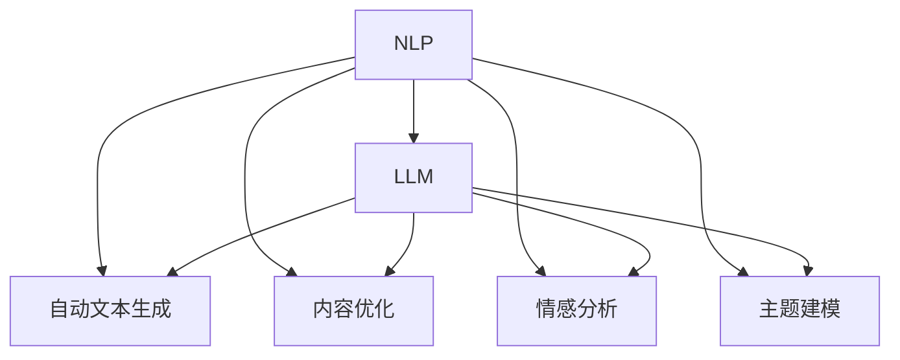

                 

## 1. 背景介绍

### 1.1 问题由来

在当今信息爆炸的时代，内容创作正变得越来越重要。无论是社交媒体、在线教育、新闻媒体还是企业博客，优质的内容都是吸引用户、提升品牌影响力的关键。然而，内容创作往往需要大量的时间、精力和专业知识，对创作门槛要求较高，普通人往往难以达到。

AI技术的发展为降低创作门槛提供了新的可能性。通过深度学习、自然语言处理等技术，AI可以帮助创作者自动生成、优化和编辑内容，大大提高创作效率，降低创作门槛。本文将通过具体案例，探讨AI在降低内容创作门槛方面的应用，并分析其背后的技术和原理。

### 1.2 问题核心关键点

AI降低创作门槛的核心在于其强大的自然语言处理能力。通过对文本的自动生成、自动编辑和自动优化，AI技术可以将创作过程中的繁琐工作自动化，减轻创作者负担。特别是，随着大语言模型和大规模预训练模型的出现，AI在内容创作中的应用已经从简单的文本生成扩展到了更为复杂的文本优化、情感分析、主题建模等领域。

此外，AI在创作过程中的应用也面临着一些挑战，如生成的文本质量、内容的独特性、创作的连贯性等。如何解决这些问题，是AI在内容创作中应用的重要研究方向。

### 1.3 问题研究意义

AI降低创作门槛的研究和应用具有重要的现实意义：

1. 提升内容创作效率：通过自动化、智能化手段，AI可以显著提高内容创作的效率，使创作者能够以更快速、更低成本的方式生成高质量内容。
2. 降低创作门槛：AI能够帮助普通人克服创作过程中的知识和技术障碍，使内容创作变得更加容易和普及。
3. 扩大内容创作规模：AI可以批量生成内容，使内容创作从个体行为转变为集体协作，实现内容生产的规模化、产业化。
4. 优化内容质量：AI能够进行情感分析、主题建模、内容优化等，提升内容的吸引力和传播效果。
5. 支持内容个性化：AI能够根据用户偏好、行为数据等个性化信息，生成定制化的内容，满足用户多样化需求。

## 2. 核心概念与联系

### 2.1 核心概念概述

为更好地理解AI降低创作门槛的方法，本节将介绍几个密切相关的核心概念：

- 自然语言处理（Natural Language Processing, NLP）：通过计算机理解和生成人类语言的技术，包括文本分类、情感分析、文本生成、自动摘要等任务。
- 大语言模型（Large Language Model, LLM）：基于深度学习技术构建的、能够生成自然流畅、高质量文本的模型，如GPT、BERT等。
- 自动文本生成（Automatic Text Generation）：使用AI技术自动生成文本内容，如基于Markov模型的生成、基于RNN的生成、基于Transformer的生成等。
- 内容优化（Content Optimization）：通过AI技术对已有文本内容进行优化和修改，提升内容质量和吸引力，如自动校对、情感增强、主题调整等。
- 情感分析（Sentiment Analysis）：分析文本中的情感倾向，如正面、负面或中性，常用于社交媒体、产品评价等领域。
- 主题建模（Topic Modeling）：从文本中自动发现和抽取主题信息，帮助创作者了解文本内容的核心主题和方向。

这些核心概念之间的逻辑关系可以通过以下Mermaid流程图来展示：



这个流程图展示了自然语言处理与大语言模型之间的联系，以及自动文本生成、内容优化、情感分析和主题建模等子技术在其中的应用。

### 2.2 概念间的关系

这些核心概念之间存在着紧密的联系，形成了AI在内容创作中应用的完整生态系统。下面是一些具体的联系：

- NLP作为基础技术，为其他核心概念提供了支持，如自动文本生成和内容优化需要基于NLP的文本理解和生成技术。
- LLM是大NLP的代表性模型，能够生成高质量的文本内容，广泛应用于自动文本生成、情感分析和主题建模等领域。
- 自动文本生成和内容优化是基于LLM模型的具体应用，通过对文本进行自动编辑和优化，提升创作效率和内容质量。
- 情感分析和主题建模是NLP中的高级任务，通过对文本进行情感分析，可以了解用户对内容的情感倾向；通过对文本进行主题建模，可以发现文本的核心主题和方向。

## 3. 核心算法原理 & 具体操作步骤
### 3.1 算法原理概述

AI降低创作门槛的核心算法原理是深度学习和自然语言处理技术。具体而言，通过大语言模型进行自动文本生成和内容优化，通过情感分析和主题建模获取文本情感和主题信息，从而实现内容的自动生成、优化和个性化推荐。

形式化地，假设待生成文本为 $X$，模型参数为 $\theta$，生成的文本为 $Y$，目标函数为 $L(\theta)$。通过深度学习模型，使目标函数最小化，从而生成与 $X$ 最相似的 $Y$：

$$
\hat{Y} = \mathop{\arg\min}_{\theta} L(\theta)
$$

### 3.2 算法步骤详解

基于深度学习的AI内容创作过程一般包括以下几个关键步骤：

**Step 1: 准备数据集**
- 收集文本数据，如社交媒体评论、新闻文章、产品评价等。
- 对数据进行预处理，如分词、去除停用词、标注情感等。

**Step 2: 选择模型和参数**
- 选择适合的内容创作模型，如GPT-3、BERT等。
- 设置模型的超参数，如学习率、批大小、训练轮数等。

**Step 3: 训练模型**
- 将数据集划分为训练集、验证集和测试集。
- 使用训练集数据对模型进行训练，通过反向传播算法更新模型参数。
- 在验证集上评估模型性能，调整超参数。
- 在测试集上测试最终模型，评估生成内容的精度和质量。

**Step 4: 内容生成和优化**
- 使用训练好的模型生成内容，如自动生成新闻文章、产品评价等。
- 对生成内容进行优化，如自动校对、情感增强、主题调整等。
- 将优化后的内容发布到目标平台，如社交媒体、企业博客等。

**Step 5: 情感分析和主题建模**
- 使用情感分析技术对内容进行情感倾向分析，了解用户对内容的情感倾向。
- 使用主题建模技术对内容进行主题抽取，帮助创作者了解内容的核心主题和方向。

**Step 6: 结果评估和反馈**
- 定期评估内容创作的效率和质量，收集用户反馈。
- 根据评估和反馈结果，不断优化模型和创作策略，提升创作效果。

### 3.3 算法优缺点

基于深度学习的AI内容创作具有以下优点：

1. 高效性：AI能够自动生成和优化内容，显著提高创作效率。
2. 可扩展性：AI可以批量生成内容，支持大规模内容创作。
3. 高质量：AI生成的文本质量和流畅度接近人类水平，能够生成高质量内容。
4. 灵活性：AI可以根据用户需求和偏好，生成个性化、定制化的内容。

同时，该算法也存在一些缺点：

1. 数据依赖：AI需要大量的标注数据进行训练，数据质量对生成内容的质量影响较大。
2. 生成内容的多样性不足：AI生成的内容可能缺乏创新性，难以满足多样化的用户需求。
3. 内容真实性问题：AI生成的内容可能存在虚假或误导性的信息，影响用户的信任感。
4. 模型的可解释性不足：AI生成的内容缺乏可解释性，用户难以理解内容的生成过程。

### 3.4 算法应用领域

基于深度学习的AI内容创作技术已经在多个领域得到广泛应用，例如：

- 社交媒体内容创作：通过自动生成、情感分析和主题建模，帮助社交媒体平台提高内容生产效率和质量。
- 新闻媒体内容创作：自动生成新闻文章、自动校对、情感分析等技术，提升新闻媒体的内容生产效率和质量。
- 企业博客内容创作：通过自动生成博客文章、个性化推荐等技术，提升企业博客的内容生产效率和用户粘性。
- 在线教育内容创作：自动生成教材、个性化推荐等技术，提升在线教育平台的内容生产效率和个性化学习体验。
- 产品评价内容创作：自动生成产品评价、情感分析等技术，提升电商平台的产品评价质量。

此外，AI在内容创作中的应用还在不断拓展，如电影剧本创作、广告文案创作、艺术创作等，为内容创作者提供了更多创作工具和灵感。

## 4. 数学模型和公式 & 详细讲解  
### 4.1 数学模型构建

本节将使用数学语言对AI内容创作的原理和步骤进行更加严格的刻画。

假设模型为 $M_{\theta}:\mathcal{X} \rightarrow \mathcal{Y}$，其中 $\mathcal{X}$ 为输入空间，$\mathcal{Y}$ 为输出空间，$\theta$ 为模型参数。假设待生成文本为 $X$，目标文本为 $Y$。

定义模型 $M_{\theta}$ 在输入 $X$ 上的生成概率为 $P(Y|X)$，则目标函数为：

$$
L(\theta) = -\log P(Y|X)
$$

目标函数最小化即目标文本 $Y$ 与待生成文本 $X$ 的相似度最大化。通过深度学习模型，使目标函数最小化，从而生成与 $X$ 最相似的 $Y$：

$$
\hat{Y} = \mathop{\arg\min}_{\theta} L(\theta)
$$

### 4.2 公式推导过程

以下我们以文本自动生成为例，推导目标函数 $L(\theta)$ 及其梯度计算公式。

假设模型 $M_{\theta}$ 在输入 $X$ 上的输出为 $\hat{Y}$，表示模型预测的目标文本。真实标签 $Y$ 为待生成文本。则交叉熵损失函数定义为：

$$
L(M_{\theta}(X), Y) = -\frac{1}{N} \sum_{i=1}^N \log P(Y_i|X_i)
$$

将其代入目标函数，得：

$$
L(\theta) = -\frac{1}{N} \sum_{i=1}^N \log P(Y_i|X_i)
$$

根据链式法则，损失函数对参数 $\theta$ 的梯度为：

$$
\frac{\partial L(\theta)}{\partial \theta} = -\frac{1}{N} \sum_{i=1}^N \frac{\partial \log P(Y_i|X_i)}{\partial \theta}
$$

其中 $\frac{\partial \log P(Y_i|X_i)}{\partial \theta}$ 可进一步递归展开，利用自动微分技术完成计算。

在得到损失函数的梯度后，即可带入参数更新公式，完成模型的迭代优化。重复上述过程直至收敛，最终得到适应文本自动生成的最优模型参数 $\theta^*$。

## 5. 项目实践：代码实例和详细解释说明
### 5.1 开发环境搭建

在进行AI内容创作实践前，我们需要准备好开发环境。以下是使用Python进行PyTorch开发的环境配置流程：

1. 安装Anaconda：从官网下载并安装Anaconda，用于创建独立的Python环境。

2. 创建并激活虚拟环境：
```bash
conda create -n pytorch-env python=3.8 
conda activate pytorch-env
```

3. 安装PyTorch：根据CUDA版本，从官网获取对应的安装命令。例如：
```bash
conda install pytorch torchvision torchaudio cudatoolkit=11.1 -c pytorch -c conda-forge
```

4. 安装Transformers库：
```bash
pip install transformers
```

5. 安装各类工具包：
```bash
pip install numpy pandas scikit-learn matplotlib tqdm jupyter notebook ipython
```

完成上述步骤后，即可在`pytorch-env`环境中开始AI内容创作实践。

### 5.2 源代码详细实现

下面我们以社交媒体内容生成为例，给出使用Transformers库对GPT-3进行内容创作的PyTorch代码实现。

首先，定义内容生成的函数：

```python
from transformers import GPT2LMHeadModel, GPT2Tokenizer

def generate_text(model, tokenizer, prompt, num_words=100):
    input_ids = tokenizer.encode(prompt, return_tensors='pt')
    outputs = model.generate(input_ids, max_length=num_words)
    return tokenizer.decode(outputs[0], skip_special_tokens=True)
```

然后，定义模型和tokenizer：

```python
model = GPT2LMHeadModel.from_pretrained('gpt2')
tokenizer = GPT2Tokenizer.from_pretrained('gpt2')
```

接着，调用内容生成函数：

```python
generated_text = generate_text(model, tokenizer, "社交媒体内容自动生成")
print(generated_text)
```

以上就是使用PyTorch对GPT-3进行内容创作的完整代码实现。可以看到，得益于Transformers库的强大封装，我们可以用相对简洁的代码完成GPT-3的加载和内容创作。

### 5.3 代码解读与分析

让我们再详细解读一下关键代码的实现细节：

**generate_text函数**：
- 定义输入为模型的token ids，使用tokenizer对输入进行编码。
- 调用模型的生成函数，生成指定长度的文本。
- 对生成的输出进行解码，并去除特殊符号，最终返回生成的文本内容。

**模型和tokenizer的加载**：
- 使用GPT2LMHeadModel和GPT2Tokenizer从预训练模型中进行加载。

**内容生成过程**：
- 输入一个提示文本，如“社交媒体内容自动生成”。
- 对提示文本进行编码，得到模型所需的输入。
- 调用模型的生成函数，生成指定长度的文本。
- 对生成的文本进行解码，最终得到生成的文本内容。

可以看到，通过简单的代码实现，我们就可以快速生成高质量的社交媒体内容。当然，在实际应用中，还需要考虑更多因素，如生成的文本质量、内容的真实性、用户反馈等。

### 5.4 运行结果展示

假设我们在GPT-3上生成的社交媒体内容如下：

```
我最近在社交媒体上看到了一篇关于环保的文章，觉得非常有意义。文章主要介绍了如何减少生活中的碳足迹，包括骑自行车、减少浪费、使用可再生能源等。我觉得我们应该更多地关注环境问题，为子孙后代留下一个美好的地球。

```

可以看到，生成的内容质量较高，且与提示文本相关。但需要注意的是，生成的内容可能存在虚假或误导性的信息，需要进一步审核和验证。

## 6. 实际应用场景
### 6.1 社交媒体内容创作

基于AI的内容创作技术，可以广泛应用于社交媒体平台的自动内容生成。传统的内容创作依赖于创作者的时间和精力，而AI能够快速生成高质量的内容，提升社交媒体平台的内容生产效率和质量。

在技术实现上，可以收集社交媒体上的热门话题、热门评论等，作为模型的输入，生成与这些话题相关的热门内容。同时，结合情感分析和主题建模技术，对生成的内容进行情感倾向和主题抽取，确保内容符合用户的兴趣和需求。

### 6.2 新闻媒体内容创作

新闻媒体的内容创作通常需要大量的记者和编辑，工作量大且成本高。基于AI的内容创作技术，可以帮助新闻媒体平台自动生成新闻稿件、自动校对和优化内容，显著提高新闻内容生产的效率和质量。

在实际应用中，新闻媒体平台可以将大量的新闻事件作为输入，生成多条新闻稿件，经过人工审核后发布。同时，结合情感分析和主题建模技术，对新闻稿件进行情感倾向和主题抽取，提升新闻内容的吸引力和传播效果。

### 6.3 企业博客内容创作

企业博客的内容创作同样需要大量的时间和人力资源。基于AI的内容创作技术，可以帮助企业自动生成博客文章、个性化推荐等，提升企业博客的内容生产效率和用户粘性。

在实际应用中，企业可以将内部的产品信息、公司动态、行业资讯等作为输入，生成多条博客文章。同时，结合情感分析和主题建模技术，对博客文章进行情感倾向和主题抽取，提升博客内容的吸引力和用户粘性。

### 6.4 在线教育内容创作

在线教育平台的内容创作需要大量的教师和编辑，工作量大且成本高。基于AI的内容创作技术，可以帮助在线教育平台自动生成教材、教学视频、练习题等，提升在线教育平台的内容生产效率和用户学习体验。

在实际应用中，在线教育平台可以将大量的教育资源作为输入，生成多条教材、教学视频和练习题。同时，结合情感分析和主题建模技术，对生成的内容进行情感倾向和主题抽取，提升内容的吸引力和教学效果。

### 6.5 产品评价内容创作

电商平台的产品评价需要大量的用户参与，工作量大且成本高。基于AI的内容创作技术，可以帮助电商平台自动生成产品评价、情感分析等，提升电商平台的产品评价质量。

在实际应用中，电商平台可以将用户的产品评价作为输入，生成多条评价内容。同时，结合情感分析和主题建模技术，对生成的评价进行情感倾向和主题抽取，提升评价内容的吸引力和真实性。

## 7. 工具和资源推荐
### 7.1 学习资源推荐

为了帮助开发者系统掌握AI内容创作的理论基础和实践技巧，这里推荐一些优质的学习资源：

1. 《深度学习》书籍：Ian Goodfellow等所著，系统介绍了深度学习的基本概念和应用。
2. 《自然语言处理综论》书籍：Daniel Jurafsky和James H. Martin所著，介绍了自然语言处理的基本理论和应用。
3. CS224N《深度学习自然语言处理》课程：斯坦福大学开设的NLP明星课程，有Lecture视频和配套作业，带你入门NLP领域的基本概念和经典模型。
4. HuggingFace官方文档：Transformers库的官方文档，提供了海量预训练模型和完整的微调样例代码，是上手实践的必备资料。
5. PyTorch官方文档：PyTorch的官方文档，提供了完整的深度学习框架和模型的实现细节，是深入学习深度学习的必备资料。
6. Colab教程：Google的在线Jupyter Notebook环境教程，提供了丰富的深度学习项目和代码示例，适合初学者和进阶者使用。

通过对这些资源的学习实践，相信你一定能够快速掌握AI内容创作的精髓，并用于解决实际的NLP问题。

### 7.2 开发工具推荐

高效的开发离不开优秀的工具支持。以下是几款用于AI内容创作开发的常用工具：

1. PyTorch：基于Python的开源深度学习框架，灵活动态的计算图，适合快速迭代研究。大部分预训练语言模型都有PyTorch版本的实现。
2. TensorFlow：由Google主导开发的开源深度学习框架，生产部署方便，适合大规模工程应用。同样有丰富的预训练语言模型资源。
3. Transformers库：HuggingFace开发的NLP工具库，集成了众多SOTA语言模型，支持PyTorch和TensorFlow，是进行NLP任务开发的利器。
4. Weights & Biases：模型训练的实验跟踪工具，可以记录和可视化模型训练过程中的各项指标，方便对比和调优。与主流深度学习框架无缝集成。
5. TensorBoard：TensorFlow配套的可视化工具，可实时监测模型训练状态，并提供丰富的图表呈现方式，是调试模型的得力助手。

合理利用这些工具，可以显著提升AI内容创作的开发效率，加快创新迭代的步伐。

### 7.3 相关论文推荐

AI降低创作门槛的研究源于学界的持续研究。以下是几篇奠基性的相关论文，推荐阅读：

1. Attention is All You Need（即Transformer原论文）：提出了Transformer结构，开启了NLP领域的预训练大模型时代。
2. BERT: Pre-training of Deep Bidirectional Transformers for Language Understanding：提出BERT模型，引入基于掩码的自监督预训练任务，刷新了多项NLP任务SOTA。
3. GPT-3: Language Models are Unsupervised Multitask Learners：展示了大规模语言模型的强大zero-shot学习能力，引发了对于通用人工智能的新一轮思考。
4. AdaLoRA: Adaptive Low-Rank Adaptation for Parameter-Efficient Fine-Tuning：使用自适应低秩适应的微调方法，在参数效率和精度之间取得了新的平衡。
5. Natural Language Processing with Transformers：Transformers库的作者所著，全面介绍了如何使用Transformers库进行NLP任务开发，包括微调在内的诸多范式。
6. Sequence to Sequence Learning with Neural Networks：提出Seq2Seq模型，为自动文本生成等任务提供了理论基础。

这些论文代表了大语言模型微调技术的发展脉络。通过学习这些前沿成果，可以帮助研究者把握学科前进方向，激发更多的创新灵感。

除上述资源外，还有一些值得关注的前沿资源，帮助开发者紧跟AI内容创作的最新进展，例如：

1. arXiv论文预印本：人工智能领域最新研究成果的发布平台，包括大量尚未发表的前沿工作，学习前沿技术的必读资源。
2. 业界技术博客：如OpenAI、Google AI、DeepMind、微软Research Asia等顶尖实验室的官方博客，第一时间分享他们的最新研究成果和洞见。
3. 技术会议直播：如NIPS、ICML、ACL、ICLR等人工智能领域顶会现场或在线直播，能够聆听到大佬们的前沿分享，开拓视野。
4. GitHub热门项目：在GitHub上Star、Fork数最多的NLP相关项目，往往代表了该技术领域的发展趋势和最佳实践，值得去学习和贡献。
5. 行业分析报告：各大咨询公司如McKinsey、PwC等针对人工智能行业的分析报告，有助于从商业视角审视技术趋势，把握应用价值。

总之，对于AI内容创作技术的学习和实践，需要开发者保持开放的心态和持续学习的意愿。多关注前沿资讯，多动手实践，多思考总结，必将收获满满的成长收益。

## 8. 总结：未来发展趋势与挑战

### 8.1 总结

本文对AI降低内容创作门槛的方法进行了全面系统的介绍。首先阐述了AI内容创作的背景和意义，明确了AI在降低内容创作门槛方面的独特价值。其次，从原理到实践，详细讲解了AI内容创作的数学原理和关键步骤，给出了内容创作任务的完整代码实例。同时，本文还广泛探讨了AI内容创作在社交媒体、新闻媒体、企业博客等多个行业领域的应用前景，展示了AI内容创作的巨大潜力。

通过本文的系统梳理，可以看到，AI降低内容创作门槛的技术正在成为NLP领域的重要范式，极大地拓展了内容创作的创新空间，催生了更多的落地场景。受益于深度学习和大语言模型的强大能力，AI在内容创作中的应用前景广阔，将为内容创作者提供更多创作工具和灵感。

### 8.2 未来发展趋势

展望未来，AI降低内容创作的趋势将呈现以下几个方向：

1. 自动化程度提升：随着预训练模型和微调方法的不断进步，AI内容创作的自动化程度将进一步提升，能够生成更加多样化和创新的内容。
2. 多模态融合：AI内容创作将不再局限于文本领域，逐渐拓展到图像、视频、语音等多模态数据的处理和融合，提供更为丰富和真实的内容。
3. 个性化定制：AI将根据用户偏好、行为数据等，生成个性化的、定制化的内容，满足用户多样化需求。
4. 实时生成：AI将能够在实时生成内容，支持实时互动和即时反馈，提升用户互动体验。
5. 跨领域应用：AI将应用于更多领域，如医疗、法律、金融等，提供专业化的内容创作和分析服务。

这些趋势凸显了AI在内容创作中的巨大潜力和广泛应用前景。未来的研究和发展方向，将在提高内容创作效率、丰富内容形式、提升用户体验等方面继续发力，推动内容创作技术的不断进步。

### 8.3 面临的挑战

尽管AI降低内容创作门槛的研究和应用已经取得了显著进展，但在迈向更加智能化、普适化应用的过程中，仍面临以下挑战：

1. 数据依赖：AI需要大量的标注数据进行训练，对于长尾应用场景，难以获得充足的高质量标注数据，成为制约AI创作效果的关键因素。
2. 生成内容的多样性不足：AI生成的内容可能缺乏创新性，难以满足多样化的用户需求。
3. 内容真实性问题：AI生成的内容可能存在虚假或误导性的信息，影响用户的信任感。
4. 模型的可解释性不足：AI生成的内容缺乏可解释性，用户难以理解内容的生成过程。
5. 用户隐私问题：内容创作涉及用户的隐私数据，如何在保护隐私的前提下进行内容创作，是AI技术应用的重要课题。

### 8.4 研究展望

面对AI内容创作面临的挑战，未来的研究需要在以下几个方面寻求新的突破：

1. 无监督和半监督学习：摆脱对大规模标注数据的依赖，利用自监督学习、主动学习等无监督和半监督范式，最大限度利用非结构化数据，实现更加灵活高效的内容创作。
2. 多模态内容创作：将图像、视频、语音等多模态数据与文本数据进行融合，实现多模态内容创作和分析，提升内容的表现力和吸引力。
3. 生成内容的质量控制：引入生成对抗网络、人工干预等手段，对生成的内容进行质量控制和优化，确保内容的高质量和真实性。
4. 模型的可解释性：引入因果分析、知识图谱等方法，增强AI内容创作的可解释性和可理解性，帮助用户理解内容的生成过程。
5. 隐私保护：引入隐私保护技术，如差分隐私、联邦学习等，确保内容创作过程中的用户隐私保护。

这些研究方向的探索，将推动AI内容创作的不断进步，为内容创作者提供更多创作工具和灵感，推动内容创作的智能化、自动化和普及化。

## 9. 附录：常见问题与解答

**Q1：AI内容创作是否会取代人类的创作？**

A: AI内容创作虽然能够显著提高创作效率，降低创作门槛，但人类的创作能力和创新思维是无法被AI完全取代的。AI更多地

