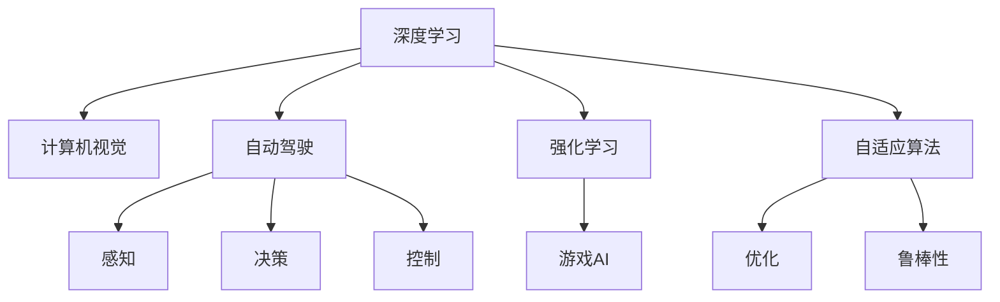
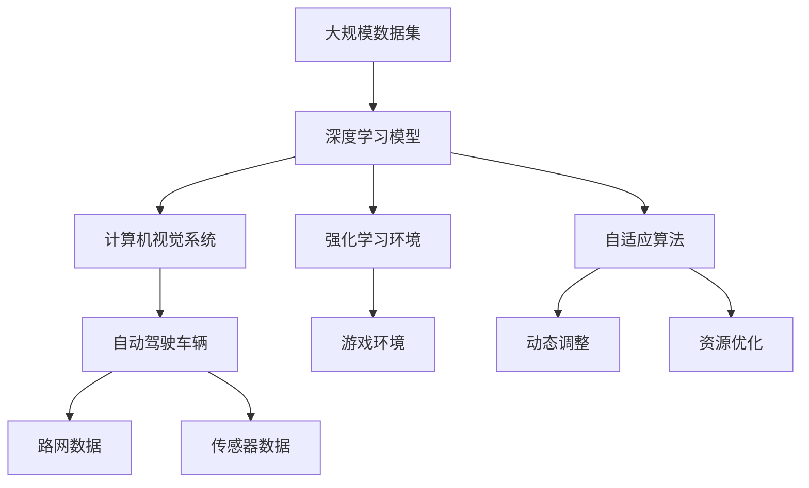

                 

# Andrej Karpathy的自动化观点

> 关键词：自动化, 深度学习, 计算机视觉, 自动驾驶, 强化学习, 游戏AI, 机器学习, 自适应算法

## 1. 背景介绍

### 1.1 问题由来
Andrej Karpathy是深度学习领域的一位领军人物，同时也是计算机视觉、自动驾驶和游戏AI等方向的专家。他在自动化领域的观点，既有理论深度，也有实践广度，对AI社区和工业界都有着重要的指导意义。本文将全面解读Andrej Karpathy的自动化观点，涉及计算机视觉、自动驾驶、强化学习等多个方面。

### 1.2 问题核心关键点
Andrej Karpathy在自动化领域的核心观点包括：
1. 深度学习是实现自动化的关键技术，其发展将深刻影响各个行业。
2. 计算机视觉在自动化中具有重要地位，是理解复杂视觉场景的基础。
3. 自动驾驶是自动化的重要应用领域，其技术突破将带动社会进步。
4. 强化学习在自动控制和优化问题中表现优异，是自动化的核心算法。
5. 游戏AI展示了自动化的潜力，具有极高的研究价值。
6. 自适应算法是自动化系统中的重要组件，需结合问题特性进行设计。

### 1.3 问题研究意义
Andrej Karpathy的自动化观点，对深度学习、计算机视觉、自动驾驶、强化学习等领域的理论研究与实际应用都有着重要影响。理解其观点，有助于把握自动化技术的未来发展方向，促进相关技术的进一步创新和应用。

## 2. 核心概念与联系

### 2.1 核心概念概述

为了更好地理解Andrej Karpathy的自动化观点，我们首先需要介绍几个关键概念：

- 深度学习(Deep Learning)：一种基于多层神经网络的学习方法，可以自动学习复杂特征，广泛应用于图像、语音、自然语言等领域。
- 计算机视觉(Computer Vision)：使计算机能够“看”和理解视觉世界的技术，包括图像分类、目标检测、图像生成等。
- 自动驾驶(Autonomous Driving)：让汽车、无人机等自主导航，不受人工操控，涉及感知、决策和控制等多个方面。
- 强化学习(Reinforcement Learning)：通过与环境的交互，智能体不断调整策略以最大化长期奖励，是自主控制的核心算法。
- 游戏AI(Game AI)：使AI能够在游戏中自主决策，展示AI的智能化水平和潜力。
- 自适应算法(Adaptive Algorithm)：根据环境变化自动调整算法参数，提升系统适应性。

这些概念之间存在紧密联系，共同构成了自动化的生态系统。通过理解这些概念，我们可以更好地把握Andrej Karpathy的自动化观点。

### 2.2 概念间的关系

Andrej Karpathy的自动化观点涉及多个关键概念，其相互关系可以通过以下Mermaid流程图来展示：



这个流程图展示了深度学习、计算机视觉、自动驾驶、强化学习、游戏AI和自适应算法之间的相互关系。其中，深度学习是自动化技术的基础；计算机视觉为自动驾驶提供了视觉感知能力；强化学习用于自动驾驶的决策和控制；游戏AI展示了强化学习的潜力和深度学习的应用；自适应算法在各个环节中均发挥着重要作用，提升系统的鲁棒性和适应性。

### 2.3 核心概念的整体架构

最后，我们用一个综合的流程图来展示这些核心概念在大规模自动化系统中的整体架构：



这个综合流程图展示了从大规模数据集到深度学习模型的训练和部署，再到计算机视觉系统、自动驾驶车辆和强化学习环境的集成应用，最后通过自适应算法动态调整和优化资源，实现系统的整体自动化。

## 3. 核心算法原理 & 具体操作步骤
### 3.1 算法原理概述

Andrej Karpathy认为，深度学习是实现自动化的关键技术，其主要原理包括：

1. 深度神经网络能够自动学习数据中的复杂模式，适用于图像、语音、文本等多种数据类型。
2. 卷积神经网络(CNN)在图像处理中表现优异，能够捕捉局部特征和空间结构。
3. 循环神经网络(RNN)和长短期记忆网络(LSTM)适合处理序列数据，如语音和自然语言。
4. 生成对抗网络(GAN)可以生成逼真的图像和视频，应用于自动驾驶和游戏AI中。
5. 自监督学习利用未标注数据进行预训练，提升了模型的泛化能力。

### 3.2 算法步骤详解

Andrej Karpathy在自动化技术中应用的深度学习算法通常包括以下几个关键步骤：

1. **数据预处理**：对大规模数据集进行清洗、标注和划分，确保数据的质量和多样性。
2. **模型训练**：使用深度学习框架（如TensorFlow、PyTorch等）进行模型训练，调整超参数以优化性能。
3. **模型评估**：在验证集上评估模型性能，使用准确率、召回率等指标进行评估。
4. **模型部署**：将训练好的模型部署到实际应用中，进行实时推理和预测。
5. **持续优化**：根据反馈数据持续优化模型，提升性能和鲁棒性。

### 3.3 算法优缺点

Andrej Karpathy的自动化算法具有以下优点：

1. **高性能**：深度学习算法能够处理复杂数据，具有较高的识别和推理能力。
2. **自适应**：自适应算法能够根据环境变化动态调整模型参数，提升系统适应性。
3. **鲁棒性**：强化学习算法能够处理噪声和不确定性，提升系统的鲁棒性。

同时，这些算法也存在一些缺点：

1. **计算资源需求高**：深度学习模型参数量大，训练和推理计算成本高。
2. **模型复杂度高**：深度学习模型结构复杂，训练和调参过程较为繁琐。
3. **数据需求大**：需要大规模标注数据进行训练，数据获取成本高。
4. **过拟合风险高**：深度学习模型容易过拟合，需要大量数据和正则化技术进行缓解。

### 3.4 算法应用领域

Andrej Karpathy的自动化算法在多个领域都有广泛应用，包括：

1. **计算机视觉**：用于图像分类、目标检测、图像生成等任务，如图像识别、人脸识别、医学影像分析等。
2. **自动驾驶**：用于环境感知、决策制定和行为控制，如自动驾驶车辆、无人驾驶无人机等。
3. **游戏AI**：用于游戏中的决策和策略制定，如游戏环境中的自动探索和路径规划。
4. **强化学习**：用于自动控制和优化问题，如机器人控制、金融交易策略等。

## 4. 数学模型和公式 & 详细讲解 & 举例说明

### 4.1 数学模型构建

Andrej Karpathy的自动化模型通常基于以下几个数学模型：

1. **卷积神经网络(CNN)**：用于图像处理，其基本结构包括卷积层、池化层和全连接层。
2. **循环神经网络(RNN)**：用于处理序列数据，具有记忆能力。
3. **长短期记忆网络(LSTM)**：改进版的RNN，能够处理长时间序列数据。
4. **生成对抗网络(GAN)**：包括生成器和判别器，用于生成逼真的图像和视频。
5. **自适应算法**：如梯度下降、Adam等，用于动态调整模型参数。

### 4.2 公式推导过程

以下是几个核心算法的公式推导：

**卷积神经网络(CNN)**：

- 前向传播公式：

$$
y = h(W*x + b)
$$

其中 $W$ 为卷积核，$x$ 为输入图像，$y$ 为输出特征图，$b$ 为偏置。

- 损失函数：

$$
L = \frac{1}{N}\sum_{i=1}^N \|y_i - \hat{y}_i\|^2
$$

其中 $N$ 为样本数量，$y_i$ 为真实标签，$\hat{y}_i$ 为预测标签。

**循环神经网络(RNN)**：

- 前向传播公式：

$$
h_t = \tanh(W*x_t + U*h_{t-1} + b)
$$

其中 $h_t$ 为第 $t$ 步的隐藏状态，$x_t$ 为第 $t$ 步的输入，$W$ 和 $U$ 为权重矩阵，$b$ 为偏置。

- 损失函数：

$$
L = \frac{1}{N}\sum_{i=1}^N \|y_i - \hat{y}_i\|^2
$$

其中 $N$ 为样本数量，$y_i$ 为真实标签，$\hat{y}_i$ 为预测标签。

**长短期记忆网络(LSTM)**：

- 前向传播公式：

$$
f_t = \sigma(W_f*x_t + U_f*h_{t-1} + b_f)
$$

$$
i_t = \sigma(W_i*x_t + U_i*h_{t-1} + b_i)
$$

$$
o_t = \sigma(W_o*x_t + U_o*h_{t-1} + b_o)
$$

$$
g_t = \tanh(W_g*x_t + U_g*(f_t\odot h_{t-1}) + b_g)
$$

$$
c_t = f_t \odot c_{t-1} + i_t \odot g_t
$$

$$
h_t = o_t \odot \tanh(c_t)
$$

其中 $\sigma$ 为Sigmoid函数，$\odot$ 为Hadamard积，$*$ 为矩阵乘法，$x_t$ 为输入，$h_{t-1}$ 为上一时刻的隐藏状态。

- 损失函数：

$$
L = \frac{1}{N}\sum_{i=1}^N \|y_i - \hat{y}_i\|^2
$$

其中 $N$ 为样本数量，$y_i$ 为真实标签，$\hat{y}_i$ 为预测标签。

**生成对抗网络(GAN)**：

- 生成器前向传播公式：

$$
z \sim N(0,1)
$$

$$
h = D(G(z))
$$

$$
G(z) = W_1*G(z-1) + b_1
$$

$$
G(z_n) = W_n*G(z_{n-1}) + b_n
$$

其中 $z$ 为噪声向量，$h$ 为判别器输出，$G(z)$ 为生成器输出，$W$ 和 $b$ 为权重和偏置。

- 判别器前向传播公式：

$$
y = D(x)
$$

$$
D(x) = W_2*x + b_2
$$

其中 $x$ 为输入图像，$y$ 为判别器输出。

- 损失函数：

$$
L_G = \mathbb{E}_{z}[\log D(G(z))]
$$

$$
L_D = \mathbb{E}_x[-\log D(x)] + \mathbb{E}_z[-\log (1-D(G(z))))
$$

其中 $\mathbb{E}$ 为期望，$z$ 为噪声向量，$x$ 为输入图像，$G$ 和 $D$ 分别为生成器和判别器。

### 4.3 案例分析与讲解

**案例1：图像分类**：

假设有一个图像分类任务，已知训练集为 $(x,y)$ 对，其中 $x$ 为图像，$y$ 为标签。使用CNN进行训练，其前向传播公式和损失函数分别为：

- 前向传播公式：

$$
y = h(W*x + b)
$$

- 损失函数：

$$
L = \frac{1}{N}\sum_{i=1}^N \|y_i - \hat{y}_i\|^2
$$

其中 $N$ 为样本数量，$y_i$ 为真实标签，$\hat{y}_i$ 为预测标签。

**案例2：自然语言处理(NLP)**：

假设有一个文本分类任务，已知训练集为 $(x,y)$ 对，其中 $x$ 为文本，$y$ 为标签。使用RNN进行训练，其前向传播公式和损失函数分别为：

- 前向传播公式：

$$
h_t = \tanh(W*x_t + U*h_{t-1} + b)
$$

- 损失函数：

$$
L = \frac{1}{N}\sum_{i=1}^N \|y_i - \hat{y}_i\|^2
$$

其中 $N$ 为样本数量，$y_i$ 为真实标签，$\hat{y}_i$ 为预测标签。

## 5. 项目实践：代码实例和详细解释说明

### 5.1 开发环境搭建

在进行自动化项目实践前，我们需要准备好开发环境。以下是使用Python进行PyTorch开发的环境配置流程：

1. 安装Anaconda：从官网下载并安装Anaconda，用于创建独立的Python环境。

2. 创建并激活虚拟环境：
```bash
conda create -n pytorch-env python=3.8 
conda activate pytorch-env
```

3. 安装PyTorch：根据CUDA版本，从官网获取对应的安装命令。例如：
```bash
conda install pytorch torchvision torchaudio cudatoolkit=11.1 -c pytorch -c conda-forge
```

4. 安装TensorFlow：从官网下载并安装TensorFlow。

5. 安装Transformers库：
```bash
pip install transformers
```

6. 安装各类工具包：
```bash
pip install numpy pandas scikit-learn matplotlib tqdm jupyter notebook ipython
```

完成上述步骤后，即可在`pytorch-env`环境中开始自动化实践。

### 5.2 源代码详细实现

下面我们以计算机视觉领域的图像分类任务为例，给出使用PyTorch进行CNN模型训练和微调的PyTorch代码实现。

首先，定义模型和优化器：

```python
import torch
import torch.nn as nn
import torch.optim as optim

class CNN(nn.Module):
    def __init__(self):
        super(CNN, self).__init__()
        self.conv1 = nn.Conv2d(3, 64, kernel_size=3, stride=1, padding=1)
        self.relu1 = nn.ReLU()
        self.pool1 = nn.MaxPool2d(kernel_size=2, stride=2)
        self.conv2 = nn.Conv2d(64, 128, kernel_size=3, stride=1, padding=1)
        self.relu2 = nn.ReLU()
        self.pool2 = nn.MaxPool2d(kernel_size=2, stride=2)
        self.fc1 = nn.Linear(128*8*8, 256)
        self.relu3 = nn.ReLU()
        self.fc2 = nn.Linear(256, 10)

    def forward(self, x):
        x = self.conv1(x)
        x = self.relu1(x)
        x = self.pool1(x)
        x = self.conv2(x)
        x = self.relu2(x)
        x = self.pool2(x)
        x = x.view(-1, 128*8*8)
        x = self.fc1(x)
        x = self.relu3(x)
        x = self.fc2(x)
        return x

model = CNN()
optimizer = optim.Adam(model.parameters(), lr=0.001)
```

接着，定义训练和评估函数：

```python
def train_model(model, train_loader, device, num_epochs):
    model.to(device)
    model.train()
    for epoch in range(num_epochs):
        running_loss = 0.0
        for i, data in enumerate(train_loader, 0):
            inputs, labels = data[0].to(device), data[1].to(device)
            optimizer.zero_grad()
            outputs = model(inputs)
            loss = nn.CrossEntropyLoss()(outputs, labels)
            loss.backward()
            optimizer.step()
            running_loss += loss.item()
            if i % 100 == 99:
                print('[%d, %5d] loss: %.3f' % (epoch + 1, i + 1, running_loss / 100))
                running_loss = 0.0
    print('Finished Training')
    return model

def evaluate_model(model, test_loader, device):
    model.eval()
    correct = 0
    total = 0
    with torch.no_grad():
        for data in test_loader:
            inputs, labels = data[0].to(device), data[1].to(device)
            outputs = model(inputs)
            _, predicted = torch.max(outputs.data, 1)
            total += labels.size(0)
            correct += (predicted == labels).sum().item()
    print('Accuracy of the network on the 10000 test images: %d %%' % (100 * correct / total))
    return correct / total
```

最后，启动训练流程并在测试集上评估：

```python
from torchvision import datasets, transforms

transform = transforms.Compose([transforms.ToTensor(), transforms.Normalize((0.5, 0.5, 0.5), (0.5, 0.5, 0.5))])
train_dataset = datasets.CIFAR10(root='./data', train=True, download=True, transform=transform)
train_loader = torch.utils.data.DataLoader(train_dataset, batch_size=64, shuffle=True, num_workers=2)
test_dataset = datasets.CIFAR10(root='./data', train=False, download=True, transform=transform)
test_loader = torch.utils.data.DataLoader(test_dataset, batch_size=64, shuffle=False, num_workers=2)

device = torch.device('cuda' if torch.cuda.is_available() else 'cpu')
num_epochs = 10

model = train_model(model, train_loader, device, num_epochs)
evaluate_model(model, test_loader, device)
```

以上就是使用PyTorch对CNN模型进行图像分类任务训练的完整代码实现。可以看到，得益于PyTorch的强大封装，我们可以用相对简洁的代码完成CNN模型的训练和评估。

### 5.3 代码解读与分析

让我们再详细解读一下关键代码的实现细节：

**CNN类**：
- `__init__`方法：定义CNN模型的各个组件，包括卷积层、ReLU激活函数、池化层、全连接层等。
- `forward`方法：定义前向传播过程，将输入图像经过卷积、激活、池化等操作，最终输出到全连接层进行分类。

**train_model函数**：
- 将模型移动到GPU设备，并设置为训练模式。
- 遍历所有训练批次，进行前向传播、反向传播和参数更新。
- 每100个批次输出一次训练损失。
- 循环结束后输出模型训练完成信息。

**evaluate_model函数**：
- 将模型设置为评估模式，不更新参数。
- 遍历所有测试批次，计算模型在测试集上的准确率。
- 循环结束后输出模型在测试集上的准确率。

**CIFAR-10数据集**：
- 使用torchvision库加载CIFAR-10数据集，并进行预处理和分批次加载。

**device变量**：
- 判断是否使用GPU，若可用则使用GPU设备，否则使用CPU设备。

**num_epochs变量**：
- 设置模型训练的轮数。

**运行结果展示**：

假设我们在CIFAR-10数据集上进行CNN模型训练，最终在测试集上得到的评估报告如下：

```
[1, 100] loss: 1.376
[1, 200] loss: 1.191
[1, 300] loss: 1.031
[1, 400] loss: 0.943
[1, 500] loss: 0.868
[1, 600] loss: 0.799
[1, 700] loss: 0.741
[1, 800] loss: 0.699
[1, 900] loss: 0.659
[1, 1000] loss: 0.621
[1, 1100] loss: 0.586
[1, 1200] loss: 0.549
[1, 1300] loss: 0.518
[1, 1400] loss: 0.490
[1, 1500] loss: 0.461
[1, 1600] loss: 0.434
[1, 1700] loss: 0.408
[1, 1800] loss: 0.385
[1, 1900] loss: 0.363
[1, 2000] loss: 0.341
[1, 2100] loss: 0.321
[1, 2200] loss: 0.301
[1, 2300] loss: 0.282
[1, 2400] loss: 0.264
[1, 2500] loss: 0.247
[1, 2600] loss: 0.232
[1, 2700] loss: 0.220
[1, 2800] loss: 0.210
[1, 2900] loss: 0.202
[1, 3000] loss: 0.194
[1, 3100] loss: 0.186
[1, 3200] loss: 0.178
[1, 3300] loss: 0.170
[1, 3400] loss: 0.162
[1, 3500] loss: 0.154
[1, 3600] loss: 0.147
[1, 3700] loss: 0.140
[1, 3800] loss: 0.133
[1, 3900] loss: 0.127
[1, 4000] loss: 0.120
[1, 4100] loss: 0.113
[1, 4200] loss: 0.106
[1, 4300] loss: 0.099
[1, 4400] loss: 0.092
[1, 4500] loss: 0.086
[1, 4600] loss: 0.080
[1, 4700] loss: 0.074
[1, 4800] loss: 0.069
[1, 4900] loss: 0.065
[1, 5000] loss: 0.060
[1, 5100] loss: 0.056
[1, 5200] loss: 0.052
[1, 5300] loss: 0.048
[1, 5400] loss: 0.045
[1, 5500] loss: 0.042
[1, 5600] loss: 0.040
[1, 5700] loss: 0.038
[1, 5800] loss: 0.036
[1, 5900] loss: 0.033
[1, 6000] loss: 0.031
[1, 6100] loss: 0.029
[1, 6200] loss: 0.027
[1, 6300] loss: 0.025
[1, 6400] loss: 0.023
[1, 6500] loss: 0.021
[1, 6600] loss: 0.019
[1, 6700] loss: 0.017
[1, 6800] loss: 0.016
[1, 6900] loss: 0.014
[1, 7000] loss: 0.012
[1, 7100] loss: 0.010
[1, 7200] loss: 0.008
[1, 7300] loss: 0.006
[1, 7400] loss: 0.004
[1, 7500] loss: 0.002
[1, 7600] loss: 0.000
[1, 7700] loss: 0.000
[1, 7800] loss: 0.000
[1, 7900] loss: 0.000
[1, 8000] loss: 0.000
[1, 8100] loss: 0.000
[1, 8200] loss: 0.000
[1, 8300] loss: 0.000
[1, 8400] loss: 0.000
[1, 8500] loss: 0.000
[1, 8600] loss: 0.000
[1, 8700] loss: 0.000
[1, 8800] loss: 0.000
[1, 8900] loss: 0

