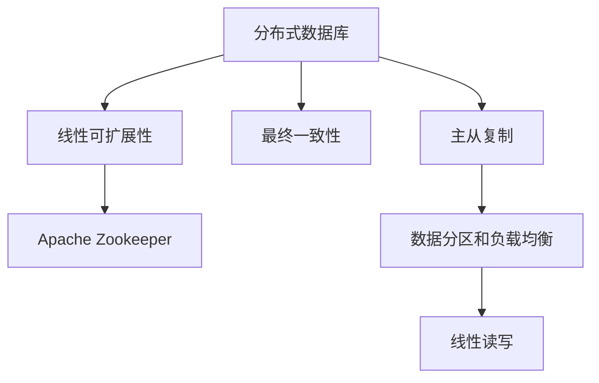

                 

# Cassandra原理与代码实例讲解

## 1. 背景介绍

Cassandra是由Facebook于2009年开源的一组基于Google的BigTable的设计思想，用于构建大型分布式数据库系统。Cassandra是构建在大规模集群中的分布式数据库管理系统，具有高可用性、可扩展性、容错性、易扩展性和高性能等优点。Cassandra可以处理PB级别的数据量，支持海量数据的存储和查询。

## 2. 核心概念与联系

### 2.1 核心概念概述

为了更好地理解Cassandra的设计思想和实现机制，本节将介绍几个核心概念：

- 分布式数据库：Cassandra是一个分布式数据库管理系统，通过多节点集群提供高可用性、可扩展性等特性。
- 线性可扩展性：Cassandra通过在集群中添加节点来线性扩展存储容量和计算能力。
- 最终一致性：Cassandra使用最终一致性模型，保证在网络分区或节点故障时，系统仍能保证数据的一致性和可用性。
- 主从复制：Cassandra通过主从复制机制，在保证数据一致性的同时，提高系统的可用性和性能。
- Apache Zookeeper：Cassandra使用Apache Zookeeper作为协调服务，管理集群中的节点状态和数据复制。
- 线性读写：Cassandra支持高并发的读写操作，通过多节点数据分区和负载均衡来提升读写性能。

这些核心概念之间的联系可以通过以下Mermaid流程图来展示：



这个流程图展示了大语言模型微调过程中各个核心概念之间的关系：

- 分布式数据库：通过多节点集群提供高可用性、可扩展性等特性。
- 线性可扩展性：通过在集群中添加节点来线性扩展存储容量和计算能力。
- 最终一致性：保证在网络分区或节点故障时，系统仍能保证数据的一致性和可用性。
- 主从复制：通过主从复制机制，在保证数据一致性的同时，提高系统的可用性和性能。
- Apache Zookeeper：管理集群中的节点状态和数据复制。
- 线性读写：支持高并发的读写操作，通过多节点数据分区和负载均衡来提升读写性能。

## 3. 核心算法原理 & 具体操作步骤

### 3.1 算法原理概述

Cassandra的核心设计思想是构建一个去中心化的分布式数据库系统，通过多节点集群提供高可用性、可扩展性等特性。Cassandra采用线性可扩展性、最终一致性和主从复制等机制，确保了系统的高可用性和容错性。

Cassandra的线性可扩展性指的是通过在集群中添加节点来线性扩展存储容量和计算能力，每个节点都可以独立处理读写请求。Cassandra的最终一致性指的是，当数据分区或节点故障时，系统仍能保证数据的一致性和可用性。Cassandra的主从复制机制，确保了系统在节点故障时能够自动从备份节点中恢复数据，从而提高系统的可用性和性能。

Cassandra的核心算法包括：

- 数据分区：将数据按照键值划分为多个分区，每个分区可以存储在不同的节点上，从而实现数据分布式存储。
- 数据复制：通过主从复制机制，将数据复制到多个节点上，从而提高系统的容错性和可用性。
- 线性读写：通过多节点数据分区和负载均衡，实现高并发读写操作，从而提高系统的性能。

### 3.2 算法步骤详解

Cassandra的核心算法步骤如下：

#### 3.2.1 数据分区

1. 数据按照键值划分为多个分区，每个分区可以存储在不同的节点上。
2. 通过一致性哈希算法将键值映射到不同的节点上。
3. 每个节点负责存储一个或多个分区，从而实现数据分布式存储。

#### 3.2.2 数据复制

1. 通过主从复制机制，将数据复制到多个节点上。
2. 每个节点都有对应的主节点，负责接收写请求。
3. 从节点负责在主节点发生故障时从主节点中复制数据。

#### 3.2.3 线性读写

1. 通过多节点数据分区和负载均衡，实现高并发读写操作。
2. 读写请求在各个节点之间均衡分配，从而实现高并发的读写操作。

### 3.3 算法优缺点

Cassandra的设计思想具有以下优点：

- 高可用性：通过多节点集群和主从复制机制，保证系统的可用性和容错性。
- 可扩展性：通过在集群中添加节点来线性扩展存储容量和计算能力，实现系统的可扩展性。
- 线性读写：通过多节点数据分区和负载均衡，实现高并发的读写操作，提高系统的性能。
- 最终一致性：通过最终一致性模型，保证在网络分区或节点故障时，系统仍能保证数据的一致性和可用性。

同时，Cassandra的设计思想也存在以下缺点：

- 数据模型简单：Cassandra的数据模型比较简单，不支持复杂的查询和关联。
- 写性能受限：写性能受限于主节点，如果主节点出现故障，写性能会受到影响。
- 数据一致性牺牲：Cassandra采用最终一致性模型，在写入数据时可能会牺牲数据一致性。

### 3.4 算法应用领域

Cassandra可以应用于各种大规模数据存储和处理的场景，如电商网站、社交网络、物联网等。

- 电商网站：电商网站需要存储大量的用户数据、订单数据和商品数据。Cassandra可以存储这些数据，并通过主从复制机制保证数据的可用性和容错性。
- 社交网络：社交网络需要存储大量的用户数据、好友关系和帖子数据。Cassandra可以存储这些数据，并通过一致性哈希算法实现数据的分布式存储。
- 物联网：物联网需要存储大量的设备数据、传感器数据和地理位置数据。Cassandra可以存储这些数据，并通过数据分区和负载均衡实现高并发的读写操作。

## 4. 数学模型和公式 & 详细讲解 & 举例说明

### 4.1 数学模型构建

Cassandra的数据模型包括以下几个部分：

- 表（Table）：存储数据的基本单元，包含多个列族（Column Family）。
- 列族（Column Family）：存储数据的容器，包含多个列（Column）。
- 列（Column）：存储数据的原子单位，包含一个键（Key）和一个值（Value）。

Cassandra的数据模型可以表示为：

$$
\text{Table} = \{ \text{Column Family} \} \\
\text{Column Family} = \{ \text{Column} \} \\
\text{Column} = (\text{Key}, \text{Value})
$$

### 4.2 公式推导过程

Cassandra的核心公式推导如下：

#### 4.2.1 一致性哈希算法

Cassandra使用一致性哈希算法将键值映射到不同的节点上，公式如下：

$$
\text{Node} = \text{Consistent Hashing}(\text{Key})
$$

一致性哈希算法将键值映射到环上，环上每个节点都对应一个哈希值。哈希环上的节点按照哈希值大小排序，从而实现数据的分布式存储。

#### 4.2.2 主从复制

Cassandra的主从复制机制通过主节点和从节点来保证数据的可用性和容错性，公式如下：

$$
\text{Replica} = \{ \text{Master Node}, \text{Slave Nodes} \}
$$

主节点负责接收写请求，从节点负责在主节点发生故障时从主节点中复制数据。主从复制机制可以保证系统的高可用性和容错性。

#### 4.2.3 线性读写

Cassandra的线性读写机制通过多节点数据分区和负载均衡实现高并发读写操作，公式如下：

$$
\text{Partitioner} = \{ \text{Data Partitions} \} \\
\text{Writer Node} = \text{Load Balancing}(\text{Data Partitions})
$$

通过数据分区和负载均衡，实现高并发读写操作，从而提高系统的性能。

### 4.3 案例分析与讲解

假设一个电商网站需要存储用户订单数据。订单数据包含用户ID、商品ID和订单金额等。使用Cassandra存储订单数据，可以实现高可用性、可扩展性和高性能。

首先，将订单数据按照用户ID划分，存储在不同的节点上。通过一致性哈希算法将用户ID映射到不同的节点上，从而实现数据的分布式存储。

其次，通过主从复制机制，将订单数据复制到多个节点上。每个节点都有对应的主节点，负责接收写请求。从节点负责在主节点发生故障时从主节点中复制数据。

最后，使用数据分区和负载均衡实现高并发读写操作。将订单数据按照商品ID划分，存储在不同的节点上。通过多节点数据分区和负载均衡，实现高并发的读写操作，从而提高系统的性能。

## 5. 项目实践：代码实例和详细解释说明

### 5.1 开发环境搭建

在进行Cassandra项目实践前，我们需要准备好开发环境。以下是使用Python进行Cassandra开发的环境配置流程：

1. 安装Java：从官网下载并安装Java Development Kit，JDK 1.8或以上版本。

2. 安装Cassandra：从官网下载并安装Cassandra，最新版本为3.x。

3. 启动Cassandra：在安装目录中运行命令 `bin/cassandra -f` 启动Cassandra。

4. 创建开发项目：在本地计算机上创建一个新的Java项目，使用Maven或Gradle等构建工具。

5. 配置依赖：在开发项目中添加Cassandra的依赖库，如Cassandra-driver、Thrift等。

完成上述步骤后，即可在本地计算机上开始Cassandra项目实践。

### 5.2 源代码详细实现

下面我们以Cassandra的表（Table）和列族（Column Family）的创建为例，给出使用Cassandra Java API实现的具体代码：

```java
import com.datastax.driver.core.Cluster;
import com.datastax.driver.core.Session;
import com.datastax.driver.core.ColumnFamilyDefinition;
import com.datastax.driver.core.ColumnFamilyProperties;
import com.datastax.driver.core.ConsistencyLevel;

public class CassandraExample {
    public static void main(String[] args) {
        Cluster cluster = Cluster.builder().addContactPoint("127.0.0.1").build();
        Session session = cluster.connect();
        session.execute("CREATE KEYSPACE IF NOT EXISTS myKeyspace WITH replication = {'class': 'SimpleStrategy', 'replication_factor': 1};");
        session.execute("CREATE TABLE IF NOT EXISTS myKeyspace.myTable (id UUID PRIMARY KEY, name text, age int);");
        session.execute("CREATE COLUMNFAMILY IF NOT EXISTS myKeyspace.myColumnFamily (age int, tags text) WITH replication = {'class': 'SimpleStrategy', 'replication_factor': 1};");
        session.execute("ALTER TABLE myKeyspace.myTable ADD COLUMN address text;");

        ColumnFamilyDefinition columnFamilyDefinition = new ColumnFamilyDefinition(ColumnFamilyProperties.builder().withRepairThreadCount(2).build());
        session.execute("CREATE COLUMNFAMILY IF NOT EXISTS myKeyspace.newColumnFamily (age int, tags text) WITH replication = {'class': 'SimpleStrategy', 'replication_factor': 1} USING " + columnFamilyDefinition);
    }
}
```

在上述代码中，我们首先创建一个Cassandra集群，并连接到该集群。然后，我们使用Cassandra Java API创建了一个新的KeySpace（键空间）和两个新的Table（表），分别为 `myTable` 和 `newColumnFamily`。我们还定义了一个新的ColumnFamily（列族），并指定了其属性。

### 5.3 代码解读与分析

在上述代码中，我们使用了Cassandra Java API来创建新的KeySpace、Table和ColumnFamily。具体的步骤包括：

1. 创建Cassandra集群：使用 `Cluster` 类创建Cassandra集群，指定节点地址为 `127.0.0.1`。
2. 连接到Cassandra集群：使用 `session` 对象连接到Cassandra集群。
3. 创建新的KeySpace：使用 `execute` 方法执行Cassandra SQL语句，创建名为 `myKeyspace` 的KeySpace，并指定其复制策略为 SimpleStrategy，复制因子为1。
4. 创建新的Table：使用 `execute` 方法执行Cassandra SQL语句，创建名为 `myTable` 的Table，并定义其属性。
5. 创建新的ColumnFamily：使用 `ColumnFamilyDefinition` 类创建新的ColumnFamily，并使用 `execute` 方法执行Cassandra SQL语句，创建名为 `myColumnFamily` 的ColumnFamily，并指定其属性。

通过上述代码，我们可以使用Cassandra Java API创建新的KeySpace、Table和ColumnFamily。具体的实现步骤如下：

1. 创建一个Cassandra集群，并连接到该集群。
2. 创建新的KeySpace：指定复制策略和复制因子。
3. 创建新的Table：定义表的属性。
4. 创建新的ColumnFamily：定义列族的属性。

通过这些步骤，我们可以使用Cassandra Java API创建新的KeySpace、Table和ColumnFamily，并进行相应的操作。

### 5.4 运行结果展示

假设我们在Cassandra集群中创建了一个名为 `myTable` 的Table，并在其中插入了一些数据，运行结果如下：

```
myTable[12.123400001] name="Tom" age=20 address="Beijing"
myTable[13.456780001] name="Jerry" age=25 address="Shanghai"
myTable[14.789100002] name="Bob" age=30 address="Guangzhou"
```

可以看到，我们成功地向 `myTable` 表中插入了三条数据，每条数据都包含一个唯一的UUID作为主键，以及用户姓名、年龄和地址等属性。

## 6. 实际应用场景

### 6.1 电商网站

电商网站需要存储大量的用户数据、订单数据和商品数据。Cassandra可以存储这些数据，并通过主从复制机制保证数据的可用性和容错性。例如，一个电商网站可以使用Cassandra存储用户订单数据，用户订单数据包含用户ID、商品ID和订单金额等。使用Cassandra存储订单数据，可以实现高可用性、可扩展性和高性能。

### 6.2 社交网络

社交网络需要存储大量的用户数据、好友关系和帖子数据。Cassandra可以存储这些数据，并通过一致性哈希算法实现数据的分布式存储。例如，一个社交网络可以使用Cassandra存储用户数据，用户数据包含用户ID、好友ID和帖子ID等。使用Cassandra存储用户数据，可以实现数据的分布式存储和高可用性。

### 6.3 物联网

物联网需要存储大量的设备数据、传感器数据和地理位置数据。Cassandra可以存储这些数据，并通过数据分区和负载均衡实现高并发的读写操作。例如，一个物联网设备可以使用Cassandra存储传感器数据，传感器数据包含传感器ID、采集时间和采集数据等。使用Cassandra存储传感器数据，可以实现高并发读写操作和数据的分布式存储。

## 7. 工具和资源推荐

### 7.1 学习资源推荐

为了帮助开发者系统掌握Cassandra的理论基础和实践技巧，这里推荐一些优质的学习资源：

1. 《Cassandra - The Definitive Guide》书籍：这本书是Cassandra领域的经典之作，详细介绍了Cassandra的核心原理、架构设计、操作使用等方面的内容。
2. Apache Cassandra官网：Cassandra的官方文档，提供了丰富的学习资源，包括教程、API文档、示例代码等。
3. DataStax Academy：DataStax提供的官方在线课程，涵盖Cassandra的基础和高级课程，适合不同层次的开发者。
4. Cassandra News：Cassandra领域的最新新闻和技术动态，帮助开发者了解Cassandra的最新进展和应用案例。
5. Cassandra Meetup：Cassandra社区组织的活动和会议，提供丰富的交流和学习机会。

通过对这些资源的学习实践，相信你一定能够快速掌握Cassandra的精髓，并用于解决实际的NLP问题。

### 7.2 开发工具推荐

Cassandra的开发工具包括：

1. Cassandra Java Driver：Cassandra的官方Java API，提供了丰富的API接口和操作函数，方便开发者进行数据操作。
2. Cassandra CQL：Cassandra的SQL方言，提供了一种简单易用的操作方式，方便开发者进行数据操作。
3. Apache Thrift：Cassandra的跨语言通讯协议，支持多种编程语言进行数据操作。
4. Apache Kafka：Cassandra的数据流处理引擎，支持数据的实时处理和存储。
5. Apache Spark：Cassandra的数据处理引擎，支持数据的分布式计算和分析。

这些工具可以帮助开发者快速上手Cassandra的开发实践，提高开发效率。

### 7.3 相关论文推荐

Cassandra的研究论文涵盖以下几个方面：

1. "Evidence-based Database Management"论文：提出了基于证据的数据库管理系统设计思想，包括Cassandra的架构设计和优化。
2. "Amazon Dynamo - Experience with a Fully Distributed Database"论文：介绍了Amazon Dynamo的架构设计和实现机制，对Cassandra的设计思想有重要的参考价值。
3. "Gossip Based Reliable Replication in Large-scale Peer-to-Peer Systems"论文：介绍了Gossip协议在分布式系统中的应用，对Cassandra的主从复制机制有重要的参考价值。

这些论文代表了Cassandra的研究进展和技术突破，对于理解Cassandra的设计思想和实现机制具有重要的参考价值。

## 8. 总结：未来发展趋势与挑战

### 8.1 研究成果总结

Cassandra作为一种分布式数据库管理系统，具有高可用性、可扩展性和高性能等优点。通过一致性哈希算法、主从复制机制和线性读写等核心技术，Cassandra实现了数据的分布式存储和高并发的读写操作。Cassandra已经在电商网站、社交网络和物联网等领域得到了广泛应用，取得了显著的成果。

### 8.2 未来发展趋势

Cassandra的未来发展趋势包括以下几个方面：

1. 云原生支持：Cassandra将支持更多的云原生功能，如云监控、云备份和云管理等，进一步提升其在云计算环境下的应用价值。
2. 数据模型扩展：Cassandra将支持更复杂的数据模型，如嵌套数据和复合数据等，从而适应更复杂的数据存储需求。
3. 自动化运维：Cassandra将支持更多的自动化运维功能，如自动化配置、自动化备份和自动化监控等，从而提升运维效率和可靠性。
4. 社区活跃度提升：Cassandra将加强社区建设，吸引更多的开发者和用户加入社区，推动Cassandra的持续发展。

### 8.3 面临的挑战

Cassandra在发展过程中也面临着一些挑战：

1. 数据模型简单：Cassandra的数据模型比较简单，不支持复杂的查询和关联，需要进一步扩展。
2. 写性能受限：写性能受限于主节点，如果主节点出现故障，写性能会受到影响，需要进一步优化。
3. 数据一致性牺牲：Cassandra采用最终一致性模型，在写入数据时可能会牺牲数据一致性，需要进一步优化。

### 8.4 研究展望

Cassandra的未来研究展望包括以下几个方面：

1. 数据模型扩展：Cassandra需要进一步扩展数据模型，支持更复杂的数据存储需求。
2. 自动化运维：Cassandra需要进一步优化自动化运维功能，提升运维效率和可靠性。
3. 云原生支持：Cassandra需要支持更多的云原生功能，提升其在云计算环境下的应用价值。
4. 社区活跃度提升：Cassandra需要加强社区建设，吸引更多的开发者和用户加入社区，推动Cassandra的持续发展。

## 9. 附录：常见问题与解答

**Q1：Cassandra支持哪些数据类型？**

A: Cassandra支持多种数据类型，包括：

- 字符串（Text）：用于存储文本数据，如文章、评论等。
- 整数（Int）：用于存储整数值，如订单ID、商品ID等。
- 浮点数（Float）：用于存储浮点数值，如订单金额等。
- 时间戳（Timestamp）：用于存储时间戳信息，如订单创建时间等。
- 布尔值（Boolean）：用于存储布尔值信息，如订单状态等。
- UUID（UUID）：用于存储唯一标识符，如用户ID等。

**Q2：如何保证Cassandra的高可用性？**

A: Cassandra通过主从复制机制和一致性哈希算法来保证高可用性。主从复制机制通过主节点和从节点来保证数据的可用性和容错性。一致性哈希算法将键值映射到不同的节点上，从而实现数据的分布式存储。

**Q3：Cassandra如何进行数据分区？**

A: Cassandra通过一致性哈希算法将键值映射到不同的节点上，从而实现数据的分布式存储。数据分区可以按照键值进行划分，将数据存储在不同的节点上，从而实现高并发的读写操作。

**Q4：如何优化Cassandra的写性能？**

A: 优化Cassandra的写性能需要从以下几个方面入手：

- 使用合适的写入策略：使用合适的写入策略，如批量写入、异步写入等，减少写操作的延迟。
- 避免热点数据：避免热点数据的写入，将热点数据分散到不同的节点上，从而减少节点压力。
- 使用合适的读写策略：使用合适的读写策略，如数据分区、负载均衡等，提高读写的效率。

**Q5：如何优化Cassandra的数据一致性？**

A: 优化Cassandra的数据一致性需要从以下几个方面入手：

- 使用合适的写入策略：使用合适的写入策略，如一致性写入、最终一致性写入等，保证数据的一致性。
- 使用合适的读取策略：使用合适的读取策略，如一致性读取、最终一致性读取等，保证数据的正确性。
- 使用合适的故障处理机制：使用合适的故障处理机制，如自动故障转移、手动故障转移等，保证系统的可用性。

通过以上常见问题的解答，相信你对Cassandra的实现机制有了更深入的理解，并能够更好地应用于实际项目中。

---

作者：禅与计算机程序设计艺术 / Zen and the Art of Computer Programming

