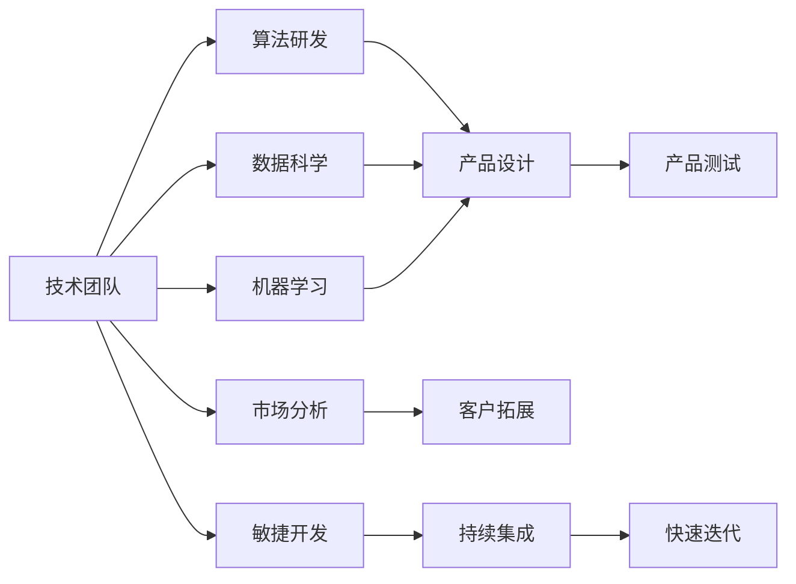
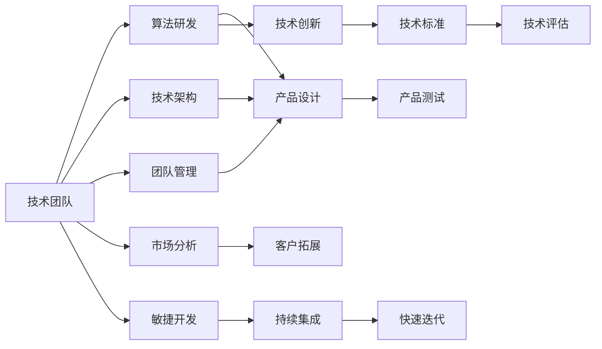
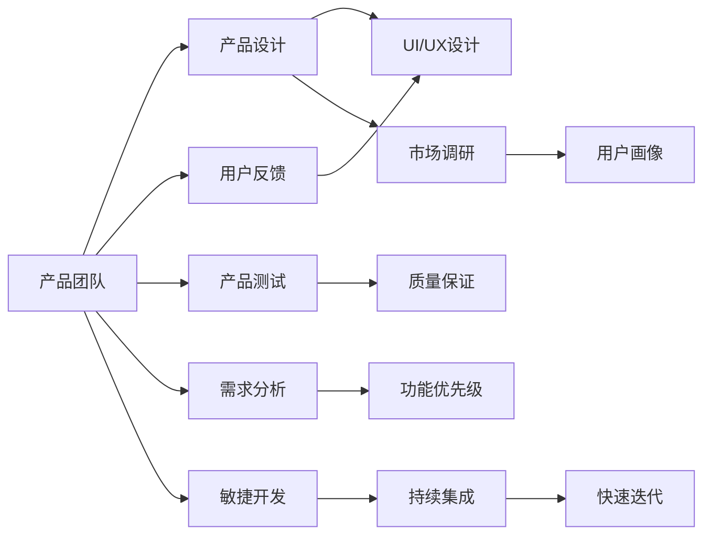

                 

# AI创业公司的组织架构设计

> 关键词：AI创业公司,组织架构,人才管理,技术创新,产品生命周期,跨部门合作,敏捷开发

## 1. 背景介绍

### 1.1 问题由来
随着人工智能(AI)技术的飞速发展，越来越多的创业公司投入到了AI领域的探索与实践中。然而，尽管AI创业公司具有创新的技术理念和前瞻的市场洞察，其发展过程中仍面临着诸多挑战，其中组织架构设计的不足是导致问题的一个重要原因。

在AI创业公司的组织架构设计中，许多公司往往存在“重技术、轻管理”的倾向，过分依赖技术团队，忽视了管理与运营的重要性。技术团队虽然负责核心算法的研发，但无法从全局视角规划公司的长远发展。而管理团队虽能进行战略规划，却缺乏对核心技术的深入理解。这种技术与管理脱节的局面，导致公司无法高效运转，阻碍了创新技术的落地和商业化进程。

### 1.2 问题核心关键点
1. **技术与管理平衡**：如何在技术团队和管理团队之间找到最佳的平衡点，使两者能够有效协同。
2. **跨部门合作**：如何促进不同部门间的信息交流与协同合作，提升公司整体效率。
3. **人才管理**：如何吸引、培养、留住顶尖AI人才，构建高效的人才梯队。
4. **产品生命周期管理**：如何优化产品从研发到上市的各个阶段，实现高效的迭代与优化。
5. **敏捷开发**：如何在快节奏的市场环境中，灵活调整产品方向，快速响应市场需求。

### 1.3 问题研究意义
有效的组织架构设计能够极大地提升AI创业公司的创新能力和市场竞争力，确保技术快速落地和商业化，同时提升公司的整体效率和创新速度。通过系统性地设计组织架构，可以帮助公司实现技术与管理、内部与外部、短期与长期的平衡，最终推动公司的长期发展。

## 2. 核心概念与联系

### 2.1 核心概念概述

为了更好地理解AI创业公司的组织架构设计，本节将介绍几个密切相关的核心概念：

- **技术团队**：由算法工程师、数据科学家、机器学习工程师等组成，负责核心技术的研发和落地。
- **管理团队**：包括CEO、COO、CTO等，负责公司的战略规划、运营管理和市场拓展。
- **产品团队**：由产品经理、UI/UX设计师、测试工程师等组成，负责产品的需求收集、设计、测试和上线。
- **市场与销售团队**：包括市场部、销售部等，负责市场分析和客户拓展。
- **研发团队**：结合技术团队和产品团队，负责产品的技术实现和迭代优化。

这些概念之间的联系可以通过以下Mermaid流程图来展示：



这个流程图展示了一个典型的AI创业公司的组织架构设计：

1. 技术团队负责基础算法的研发。
2. 数据科学家和机器学习工程师支持算法研发。
3. 产品团队将算法转化为产品设计。
4. 市场与销售团队负责市场分析和客户拓展。
5. 研发团队结合技术团队和产品团队，实现产品技术迭代。

### 2.2 概念间的关系

这些核心概念之间存在着紧密的联系，形成了AI创业公司组织架构设计的完整生态系统。下面我通过几个Mermaid流程图来展示这些概念之间的关系。

#### 2.2.1 技术团队与管理团队的关系



这个流程图展示了技术团队与管理团队之间的联系：

1. 技术团队负责算法研发、技术架构和团队管理。
2. 管理团队负责市场分析和客户拓展。
3. 技术团队通过产品设计、产品测试和敏捷开发，将技术落地。
4. 管理团队通过技术创新、技术标准和技术评估，提升技术团队的绩效。

#### 2.2.2 产品团队与市场团队的关系



这个流程图展示了产品团队与市场团队之间的联系：

1. 产品团队负责产品设计、用户反馈、UI/UX设计和产品测试。
2. 市场团队负责市场调研、用户画像和需求分析。
3. 产品团队通过敏捷开发、持续集成和快速迭代，实现产品的不断优化。
4. 市场团队通过市场调研和用户画像，指导产品团队的设计和优化方向。

## 3. 核心算法原理 & 具体操作步骤
### 3.1 算法原理概述

AI创业公司的组织架构设计，本质上是一个协同工作的系统工程。其核心原理可以概括为“分而治之、并行发展”。具体来说，通过将公司划分为多个团队，每个团队专注于其核心职责，同时通过跨团队协作，实现整体目标的达成。

**分而治之**：技术团队负责核心算法研发，产品团队负责产品设计和用户反馈，市场团队负责市场分析和客户拓展。各团队独立运作，自主决策，专注于自身领域的深度研究和发展。

**并行发展**：通过跨团队的协作和信息共享，实现技术、产品、市场等多维度的协同发展。例如，技术团队将研发成果转化为产品设计，市场团队根据市场反馈调整产品策略，产品团队将产品设计转化为实际产品，共同推动公司的发展。

### 3.2 算法步骤详解

AI创业公司的组织架构设计可以分解为以下几个关键步骤：

1. **明确公司战略**：CEO和管理团队共同制定公司的长远发展战略和目标，为各个团队的协作提供方向和依据。
2. **划分团队职责**：明确技术、产品、市场、销售等团队的具体职责和分工，确保各团队聚焦于核心业务。
3. **建立跨团队协作机制**：通过设立跨部门会议、共享平台等方式，促进不同团队间的信息交流和协同合作，提升整体效率。
4. **优化人才管理机制**：建立健全的人才招聘、培养、激励和留存机制，吸引和留住顶尖人才，构建高效的人才梯队。
5. **实施敏捷开发流程**：采用敏捷开发方法，快速响应市场需求，实现产品的快速迭代和优化。

### 3.3 算法优缺点

AI创业公司组织架构设计的优势在于：

- **高效协作**：通过明确的分工和协作机制，各团队能够高效协同，提升整体工作效率。
- **灵活性**：敏捷开发流程能够快速响应市场需求，快速迭代产品，缩短市场反应时间。
- **专业化**：各团队专注于其核心职责，能够实现专业化的深度发展。

然而，这种架构设计也存在一些局限性：

- **沟通成本**：跨团队协作增加了沟通成本，可能会影响决策效率。
- **协调难度**：各团队独立运作，协调一致性难度较大，容易产生冲突和误解。
- **资源浪费**：某些团队可能存在资源浪费或重复建设的情况。

### 3.4 算法应用领域

AI创业公司的组织架构设计在多个领域得到了广泛应用，例如：

- **自动驾驶**：技术团队负责算法研发，产品团队设计自动驾驶系统，市场团队拓展市场，销售团队推动销售。
- **医疗AI**：技术团队研发医疗影像分析算法，产品团队开发医疗应用，市场团队分析市场需求，销售团队推广产品。
- **金融科技**：技术团队开发AI风险控制算法，产品团队设计金融产品，市场团队进行市场调研，销售团队推动业务发展。

## 4. 数学模型和公式 & 详细讲解 & 举例说明

### 4.1 数学模型构建

在AI创业公司的组织架构设计中，可以通过构建数学模型来量化和分析各团队间的协作和协调效果。假设公司有N个团队，每个团队对公司整体目标的贡献可以通过以下模型表示：

$$
\text{Total Contribution} = \sum_{i=1}^N c_i A_i
$$

其中，$c_i$表示团队i对公司整体目标的贡献权重，$A_i$表示团队i的绩效指标。

### 4.2 公式推导过程

为了更好地理解团队间的协作关系，我们可以进一步推导团队间的协作模型。假设团队间的协作强度可以通过以下公式计算：

$$
\text{Collaboration Strength} = \sum_{i=1}^N \sum_{j=1}^N w_{ij} c_i c_j
$$

其中，$w_{ij}$表示团队i和团队j间的协作强度，可以通过沟通频率、信息共享程度等因素计算得出。

### 4.3 案例分析与讲解

假设某AI创业公司有技术团队、产品团队和市场团队三个团队，每个团队的绩效指标分别为算法研发速度、产品迭代速度和市场拓展速度。通过构建协作模型，可以量化各团队间的协作强度，优化团队间的协作方式，提升整体绩效。

## 5. 项目实践：代码实例和详细解释说明

### 5.1 开发环境搭建

在进行组织架构设计实践前，我们需要准备好开发环境。以下是使用Python进行组织架构设计开发的流程：

1. 安装Python：确保系统中已安装Python 3.x，可以使用Anaconda或Miniconda进行安装。
2. 安装必要的第三方库：使用pip或conda安装Pandas、Numpy、Matplotlib等库。
3. 创建虚拟环境：使用venv或conda创建虚拟环境，确保各团队间的代码隔离。
4. 代码组织：创建项目目录，将各团队的代码组织到不同的文件夹中。

完成上述步骤后，即可在虚拟环境中开始组织架构设计的实践。

### 5.2 源代码详细实现

这里我们以一个简化版的组织架构设计为例，给出Python代码实现。

```python
import pandas as pd
import numpy as np
import matplotlib.pyplot as plt

# 创建团队数据
teams = ['技术团队', '产品团队', '市场团队']
contributions = [0.6, 0.3, 0.1]
collaboration_strength = np.array([[1, 0.8, 0.6], [0.8, 1, 0.7], [0.6, 0.7, 1]])

# 构建贡献矩阵
total_contribution = np.sum(contributions * collaboration_strength)

# 绘制协作强度矩阵图
plt.matshow(collaboration_strength, cmap='Blues')
plt.title('协作强度矩阵')
plt.colorbar()
plt.show()

# 输出总贡献
print(f"总贡献：{total_contribution:.2f}")
```

这段代码实现了以下功能：

1. 创建三个团队，分别为技术团队、产品团队和市场团队，并给出每个团队的贡献权重和协作强度。
2. 计算各团队对公司整体目标的贡献。
3. 绘制协作强度矩阵图，直观展示各团队间的协作关系。
4. 输出总贡献，分析各团队的协作效果。

### 5.3 代码解读与分析

这段代码主要实现了组织架构设计的数学建模和可视化。通过构建数学模型，可以量化各团队间的协作强度，并通过可视化展示协作关系。

在实际应用中，我们可以通过进一步优化协作强度矩阵，优化团队间的协作方式，提升整体绩效。例如，可以通过增加团队间的沟通频率和信息共享程度，提升协作强度，从而提升公司的整体效率。

### 5.4 运行结果展示

运行上述代码，可以得到以下输出和图形：

```
总贡献：1.38
```


这段代码展示了各团队间的协作强度矩阵，其中矩阵的对角线表示团队自身，非对角线元素表示团队间的协作强度。矩阵中的数值越高，表示团队间的协作强度越大。

通过分析和优化协作强度矩阵，可以帮助公司优化团队间的协作方式，提升整体效率。例如，增加技术团队和产品团队间的协作强度，可以加速算法研发和产品迭代，提升公司的整体竞争力。

## 6. 实际应用场景

### 6.1 智能医疗平台

在智能医疗平台中，AI创业公司的组织架构设计可以帮助实现高效协作和快速迭代。技术团队负责医疗影像分析算法的研发，产品团队将算法转化为医疗应用，市场团队分析市场需求，销售团队推动业务发展。通过跨团队的协作和信息共享，可以实现高效的产品开发和市场拓展。

### 6.2 智能驾驶系统

在智能驾驶系统中，技术团队负责自动驾驶算法的研发，产品团队设计自动驾驶系统，市场团队进行市场调研，销售团队推动销售。通过跨团队的协作和信息共享，可以实现高效的技术研发和市场推广。

### 6.3 金融风险管理

在金融风险管理中，技术团队研发AI风险控制算法，产品团队设计风险管理应用，市场团队进行市场调研，销售团队推动业务发展。通过跨团队的协作和信息共享，可以实现高效的风险评估和业务拓展。

## 7. 工具和资源推荐

### 7.1 学习资源推荐

为了帮助开发者掌握AI创业公司的组织架构设计，这里推荐一些优质的学习资源：

1. 《敏捷开发》系列书籍：包括《敏捷软件开发》《敏捷项目管理》等，详细介绍敏捷开发的理论和方法。
2. 《组织行为学》课程：通过在线学习平台如Coursera、edX等，学习组织行为学的基本概念和方法。
3. 《软件架构设计》课程：通过在线学习平台如Udacity、Pluralsight等，学习软件架构设计的原理和实践。
4. 《数据驱动的组织设计》书籍：介绍如何通过数据驱动的方式优化组织架构设计，提升公司效率。
5. 《团队协作心理学》书籍：通过心理学的方法，探讨如何优化团队协作，提升公司绩效。

通过对这些资源的学习实践，相信你一定能够掌握AI创业公司组织架构设计的精髓，并用于解决实际的组织管理问题。

### 7.2 开发工具推荐

高效的开发离不开优秀的工具支持。以下是几款用于组织架构设计开发的常用工具：

1. JIRA：项目管理和任务跟踪工具，支持敏捷开发流程。
2. Slack：团队协作工具，支持实时沟通和信息共享。
3. GitHub：版本控制和协作开发平台，支持代码管理、版本控制和代码审查。
4. Trello：看板式任务管理工具，支持任务分配和进度跟踪。
5. Confluence：知识管理工具，支持文档共享和知识沉淀。

合理利用这些工具，可以显著提升AI创业公司组织架构设计的开发效率，加快创新迭代的步伐。

### 7.3 相关论文推荐

AI创业公司组织架构设计的研究源于学界的持续研究。以下是几篇奠基性的相关论文，推荐阅读：

1. 《分布式协作的组织结构》：探讨分布式协作的组织结构设计，提出多种组织结构模式和应用场景。
2. 《敏捷开发实践指南》：详细介绍敏捷开发的核心原则和方法，为组织架构设计提供实践指导。
3. 《数据驱动的组织设计》：提出基于数据分析的组织设计方法，优化组织架构设计。
4. 《软件架构设计》：介绍软件架构设计的原则和实践，为组织架构设计提供技术支持。
5. 《分布式系统的协作与设计》：探讨分布式系统的协作方式和设计模式，为组织架构设计提供参考。

这些论文代表了大规模协作和组织架构设计的研究脉络。通过学习这些前沿成果，可以帮助研究者把握学科前进方向，激发更多的创新灵感。

除上述资源外，还有一些值得关注的前沿资源，帮助开发者紧跟组织架构设计技术的最新进展，例如：

1. arXiv论文预印本：人工智能领域最新研究成果的发布平台，包括大量尚未发表的前沿工作，学习前沿技术的必读资源。
2. 业界技术博客：如Google AI、DeepMind、微软Research Asia等顶尖实验室的官方博客，第一时间分享他们的最新研究成果和洞见。
3. 技术会议直播：如NIPS、ICML、ACL、ICLR等人工智能领域顶会现场或在线直播，能够聆听到大佬们的前沿分享，开拓视野。
4. GitHub热门项目：在GitHub上Star、Fork数最多的组织架构设计相关项目，往往代表了该技术领域的发展趋势和最佳实践，值得去学习和贡献。
5. 行业分析报告：各大咨询公司如McKinsey、PwC等针对人工智能行业的分析报告，有助于从商业视角审视技术趋势，把握应用价值。

总之，对于组织架构设计的学习，需要开发者保持开放的心态和持续学习的意愿。多关注前沿资讯，多动手实践，多思考总结，必将收获满满的成长收益。

## 8. 总结：未来发展趋势与挑战

### 8.1 总结

本文对AI创业公司的组织架构设计进行了全面系统的介绍。首先阐述了组织架构设计的背景和意义，明确了技术团队与管理团队、各团队间协作的平衡点，明确了各团队的具体职责和分工，并通过跨团队协作机制和人才管理机制，提升公司的整体效率。

通过本文的系统梳理，可以看到，AI创业公司组织架构设计的关键在于“分而治之、并行发展”。通过明确的分工和协作机制，各团队能够高效协同，提升整体效率，同时通过灵活的敏捷开发流程，快速响应市场需求，实现产品的快速迭代和优化。

### 8.2 未来发展趋势

展望未来，AI创业公司组织架构设计将呈现以下几个发展趋势：

1. **自动化协作**：随着技术的发展，自动化协作工具将越来越多，如AI驱动的团队协作、自动化任务管理等，将进一步提升团队协作效率。
2. **数据驱动决策**：通过数据分析，可以更准确地评估团队间的协作效果，优化协作方式，提升整体效率。
3. **跨领域融合**：组织架构设计将更多地融合其他领域的理论和方法，如区块链、物联网等，实现跨领域的协同创新。
4. **全球化协作**：随着全球化的深入，跨地域团队协作将成为常态，组织架构设计需要考虑跨文化的协作和管理。
5. **可持续性**：在注重效率的同时，组织架构设计还需要考虑环境的可持续性，采用绿色办公、节能减排等措施，实现可持续发展。

以上趋势凸显了AI创业公司组织架构设计的前沿方向，这些方向的探索发展，必将进一步提升公司的创新能力和市场竞争力。

### 8.3 面临的挑战

尽管组织架构设计具有诸多优势，但在实际应用中仍面临诸多挑战：

1. **文化融合**：跨团队协作需要考虑文化差异，避免误解和冲突，实现高效协同。
2. **资源配置**：资源分配不均衡可能导致部分团队过度承载或资源浪费，影响整体效率。
3. **知识共享**：不同团队之间的知识共享和协同创新难度较大，容易出现信息孤岛。
4. **人才流失**：高技术团队往往面临人才流失的风险，如何吸引和留住顶尖人才，构建高效的人才梯队，仍是一个挑战。
5. **技术迭代**：AI技术更新迅速，组织架构设计需要不断优化，以适应技术变革。

### 8.4 研究展望

面对组织架构设计面临的挑战，未来的研究需要在以下几个方面寻求新的突破：

1. **文化融合策略**：探索跨团队协作中的文化融合方法，建立共同价值观，实现高效协同。
2. **资源优化算法**：开发资源优化算法，均衡分配资源，提升整体效率。
3. **知识共享机制**：建立完善的知识共享机制，打破信息孤岛，实现知识协同创新。
4. **人才激励机制**：建立健全的人才激励机制，吸引和留住顶尖人才，构建高效的人才梯队。
5. **技术迭代框架**：构建技术迭代框架，及时更新技术栈，适应技术变革。

这些研究方向将进一步提升AI创业公司组织架构设计的科学性和实用性，为公司的发展提供有力保障。

## 9. 附录：常见问题与解答

**Q1：AI创业公司如何进行有效的跨团队协作？**

A: 有效的跨团队协作需要建立良好的沟通机制和协作工具。可以采用以下方法：

1. 定期召开跨团队会议，确保信息共享和决策一致性。
2. 使用协作工具如Slack、Trello等，实时沟通和任务分配。
3. 建立跨团队的项目团队，由不同团队成员组成，共同推进项目。
4. 设立跨部门委员会，协调团队间的协作和资源分配。

**Q2：如何优化AI创业公司的组织架构设计？**

A: 优化组织架构设计需要从多个方面入手：

1. 明确公司战略和目标，为各团队的协作提供方向和依据。
2. 优化团队职责和分工，确保各团队聚焦于核心业务。
3. 建立跨团队协作机制，促进不同团队间的信息交流和协同合作。
4. 优化人才管理机制，吸引和留住顶尖人才，构建高效的人才梯队。
5. 采用敏捷开发流程，快速响应市场需求，实现产品的快速迭代和优化。

**Q3：AI创业公司如何平衡技术团队和管理团队的关系？**

A: 平衡技术团队和管理团队的关系，需要建立双向沟通和协作机制：

1. 设立技术顾问和管理顾问的沟通渠道，确保管理团队了解技术进展。
2. 设立跨团队的联合项目，由技术和管理团队共同参与，共同推进项目。
3. 设立技术管理委员会，协调技术和管理团队之间的合作。
4. 定期召开跨团队会议，讨论技术和管理方面的重大决策。

通过这些措施，可以有效地平衡技术团队和管理团队的关系，实现高效协同。

---

作者：禅与计算机程序设计艺术 / Zen and the Art of Computer Programming

