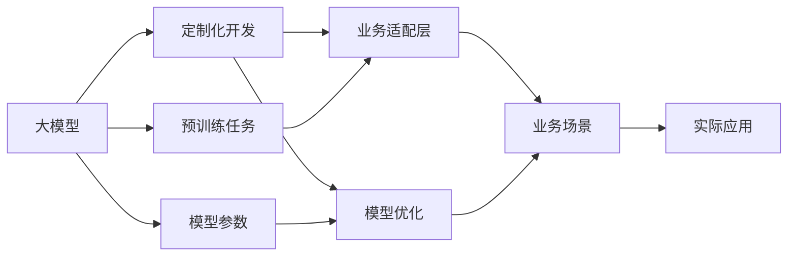

                 

# AI大模型创业：如何应对用户需求？

> 关键词：大模型创业、用户需求、业务场景、需求分析、定制化开发、产品化部署

## 1. 背景介绍

### 1.1 问题由来
随着人工智能技术的快速发展，大模型在商业化应用中日益显现出巨大的潜力和价值。各类创业公司纷纷瞄准这一领域，试图通过大模型实现业务突破。然而，用户需求的多样性和复杂性给大模型创业带来不小的挑战。本文将从用户需求的角度出发，探讨如何利用大模型实现高效、精准的业务定制化，助力AI大模型创业成功。

### 1.2 问题核心关键点
大模型创业的核心在于如何识别和满足用户多样化、复杂的业务需求。用户在业务应用中，往往需要大模型具备以下几方面的能力：

1. **高效定制**：根据具体业务需求，快速定制化大模型，避免"一刀切"的通用模型带来的性能瓶颈。
2. **精准匹配**：在大模型中选择合适的预训练任务和参数配置，确保模型与业务需求精确匹配。
3. **灵活部署**：将大模型集成到实际业务系统中，快速响应业务场景变化。
4. **智能优化**：利用数据反馈和模型迭代，不断提升大模型在实际业务场景中的效果。

本文将围绕以上几个核心关键点，详细介绍如何构建高性能、高效能的大模型，并成功应用于各类业务场景。

### 1.3 问题研究意义
深入理解用户需求，将大模型精准适配到实际业务中，是大模型创业成功的关键。研究如何识别用户需求，定制化开发大模型，并将其成功部署到生产环境中，对于推动AI技术的商业化落地具有重要意义。同时，深入探讨大模型创业过程中面临的挑战和应对策略，可以为未来的大模型创业提供宝贵的经验和参考。

## 2. 核心概念与联系

### 2.1 核心概念概述

为更好地理解如何构建高性能大模型，本节将介绍几个关键概念：

- **大模型**：指通过大规模数据预训练得到的通用语言模型，如GPT、BERT等。大模型具有强大的语言理解和生成能力，适用于各类自然语言处理任务。

- **业务场景**：指具体的应用环境和任务需求，如智能客服、金融舆情、推荐系统等。

- **定制化开发**：指根据业务场景的特殊需求，对大模型进行适配性优化和二次开发的过程。

- **业务适配层**：指在大模型基础上，针对具体业务需求设计的功能模块或数据处理逻辑。

- **模型优化**：指利用数据反馈和优化算法，不断提升大模型在特定业务场景中的效果。

这些概念之间存在紧密联系，通过定制化开发，将大模型适配到具体的业务场景中，利用业务适配层和模型优化技术，最终实现高效、精准的业务应用。

### 2.2 概念间的关系

这些关键概念之间通过以下Mermaid流程图来展示：



这个流程图展示了大模型创业过程中，各关键概念之间的关系：

1. 大模型通过预训练学习通用语言知识。
2. 根据具体业务需求，对大模型进行定制化开发。
3. 适配层和优化技术实现大模型与业务场景的精准匹配。
4. 适配后的模型在实际业务系统中应用，提升业务效果。

## 3. 核心算法原理 & 具体操作步骤
### 3.1 算法原理概述

基于大模型的创业，其核心思想是通过定制化开发和适配技术，将通用大模型适配到具体业务场景中，提升模型的应用效果。

一般而言，大模型创业可以按照以下步骤进行：

1. **需求分析**：收集业务需求，明确业务场景和大模型的适用性。
2. **模型选择**：根据业务需求选择最适合的预训练模型。
3. **定制化开发**：对预训练模型进行适配性优化和二次开发。
4. **模型优化**：利用业务数据对模型进行优化，提升模型在实际场景中的效果。
5. **部署应用**：将优化后的模型集成到实际业务系统中，提供高性能、稳定可靠的业务服务。

### 3.2 算法步骤详解

下面详细介绍大模型创业的具体操作步骤：

**Step 1: 需求分析**

首先，需要进行详细的业务需求分析。收集客户的业务需求和场景，明确业务目标和关键指标，如响应速度、准确率、召回率等。同时，评估大模型在特定业务场景中的适用性和潜在风险。

**Step 2: 模型选择**

根据业务需求，选择合适的预训练模型。需要考虑以下因素：

- 预训练任务是否与业务需求匹配。
- 模型参数规模是否适合业务场景的资源限制。
- 模型的可解释性和可定制化程度。

常见的预训练模型包括BERT、GPT、RoBERTa等，每种模型都有其适用的业务场景和优劣势。

**Step 3: 定制化开发**

在初步选定模型后，需要根据业务需求进行定制化开发。以下是几个关键步骤：

- **适配层设计**：根据业务需求设计业务适配层，包括输入处理、输出生成、后处理等逻辑。适配层的设计需要考虑模型的接口和API，保证与业务系统的无缝对接。
- **参数调整**：调整预训练模型的部分参数，如学习率、优化器、损失函数等，确保模型在特定业务场景中表现最佳。
- **数据处理**：设计数据预处理流程，包括分词、编码、归一化等步骤，保证输入数据的质量和一致性。

**Step 4: 模型优化**

模型优化是大模型创业的重要环节，通过业务数据对模型进行迭代优化，提升其在实际场景中的效果。以下是几个关键技术：

- **梯度累积**：对于计算资源有限的情况，可以通过梯度累积技术，提高模型的训练效率。
- **混合精度训练**：通过混合精度训练，减少浮点数运算，提升训练速度。
- **知识蒸馏**：利用领域专家的知识，对模型进行知识蒸馏，提高模型的可解释性和鲁棒性。
- **动态模型优化**：根据业务数据反馈，动态调整模型参数和训练策略，提升模型效果。

**Step 5: 部署应用**

将优化后的模型集成到实际业务系统中，提供高性能、稳定可靠的业务服务。以下是几个关键步骤：

- **模型封装**：将优化后的模型封装成标准化的API或微服务，便于业务系统调用。
- **服务监控**：实时监控模型运行状态，设置异常告警机制，确保服务稳定可靠。
- **安全防护**：采用访问鉴权、数据加密等技术，保护模型的安全性和数据的隐私性。
- **持续集成**：建立持续集成和部署流程，保证业务系统的快速迭代和更新。

### 3.3 算法优缺点

基于大模型的创业方法具有以下优点：

- **高效定制**：通过定制化开发，可以快速适配到具体业务场景，避免通用模型带来的性能瓶颈。
- **精准匹配**：通过适配层和模型优化，可以确保大模型与业务需求精确匹配。
- **灵活部署**：大模型可以集成到各种业务系统中，提供高性能、稳定可靠的业务服务。

同时，该方法也存在一些缺点：

- **技术门槛高**：需要具备大模型和适配技术的专业知识，对开发人员的技术要求较高。
- **开发成本高**：定制化开发和适配技术需要大量的研发投入，可能会增加初期成本。
- **模型可解释性差**：大模型的内部机制复杂，缺乏直观的解释性和可理解性，增加了调试和维护的难度。
- **模型风险高**：预训练模型可能包含有偏见、有害的信息，需要通过严格的测试和验证，确保模型的公平性和安全性。

### 3.4 算法应用领域

大模型创业方法适用于各类NLP任务和业务场景，如智能客服、金融舆情、推荐系统等。以下是几个具体的应用场景：

1. **智能客服**：利用大模型进行智能问答和对话生成，提升客服系统的响应速度和用户体验。
2. **金融舆情**：利用大模型进行文本分类和情感分析，实时监测市场舆情，辅助金融机构决策。
3. **推荐系统**：利用大模型进行文本摘要和相似度计算，提升推荐系统的个性化和准确性。
4. **医疗健康**：利用大模型进行病历分析和疾病诊断，提升医疗服务的智能化水平。
5. **法律咨询**：利用大模型进行法律文本分析和合同生成，提高法律咨询的效率和准确性。

## 4. 数学模型和公式 & 详细讲解 & 举例说明

### 4.1 数学模型构建

假设大模型为 $M_{\theta}$，输入为 $x$，输出为 $y$。根据业务需求，定义任务损失函数 $\mathcal{L}(y, y')$，其中 $y'$ 为模型的预测输出。

### 4.2 公式推导过程

以智能客服场景为例，假设模型的输入为用户查询 $x$，输出为自动回复 $y$。则任务损失函数可以定义为：

$$
\mathcal{L}(y, y') = \frac{1}{N}\sum_{i=1}^N \ell(y_i, y_i')
$$

其中，$\ell$ 为损失函数，如交叉熵损失。模型的预测输出 $y'$ 通过以下公式计算：

$$
y' = M_{\theta}(x)
$$

在训练过程中，模型通过反向传播更新参数 $\theta$，最小化损失函数 $\mathcal{L}$，以获得最优的预测输出。

### 4.3 案例分析与讲解

假设我们希望开发一个智能客服系统，需求如下：

1. **用户意图识别**：将用户查询分词后，通过模型预测出用户意图。
2. **自动回复生成**：根据用户意图，自动生成合适的回复。

我们可以按照以下步骤进行模型构建：

- **适配层设计**：设计意图识别和回复生成的适配层，包括意图分类器、回复生成器等。
- **模型选择**：选择合适的预训练模型，如BERT、GPT等。
- **参数调整**：调整模型的部分参数，如隐藏层数、学习率等。
- **数据处理**：对用户查询进行分词、编码等预处理。
- **模型优化**：通过业务数据对模型进行迭代优化，提升效果。
- **部署应用**：将模型封装成API，集成到客服系统中。

## 5. 项目实践：代码实例和详细解释说明

### 5.1 开发环境搭建

在开始项目实践前，需要先搭建好开发环境。以下是Python和PyTorch环境配置的步骤：

1. 安装Anaconda：
   ```bash
   conda create -n pytorch-env python=3.8 
   conda activate pytorch-env
   ```

2. 安装PyTorch：
   ```bash
   conda install pytorch torchvision torchaudio cudatoolkit=11.1 -c pytorch -c conda-forge
   ```

3. 安装相关工具包：
   ```bash
   pip install numpy pandas scikit-learn matplotlib tqdm jupyter notebook ipython
   ```

完成上述步骤后，即可在`pytorch-env`环境中开始实践。

### 5.2 源代码详细实现

以下以智能客服场景为例，给出使用PyTorch进行大模型定制化开发的完整代码实现。

首先，定义意图识别和回复生成的适配层：

```python
from transformers import BertForTokenClassification, BertTokenizer
import torch
import torch.nn as nn

class IntentClassifier(nn.Module):
    def __init__(self, model, num_labels):
        super(IntentClassifier, self).__init__()
        self.model = model
        self.num_labels = num_labels
        self.intent_output = nn.Linear(model.config.hidden_size, num_labels)
    
    def forward(self, input_ids, attention_mask):
        outputs = self.model(input_ids, attention_mask=attention_mask)
        pooled_output = outputs.pooler_output
        logits = self.intent_output(pooled_output)
        return logits
    
class ResponseGenerator(nn.Module):
    def __init__(self, model, tokenizer, num_labels):
        super(ResponseGenerator, self).__init__()
        self.model = model
        self.tokenizer = tokenizer
        self.num_labels = num_labels
    
    def forward(self, input_ids, attention_mask, labels):
        outputs = self.model(input_ids, attention_mask=attention_mask)
        logits = outputs.logits
        tokens = self.tokenizer.convert_ids_to_tokens(input_ids)
        response = self.model.generate(outputs.last_hidden_state[:, 0], max_length=50, num_beams=5, return_attentions=True)
        return logits, response, tokens
```

接着，定义训练和评估函数：

```python
from transformers import AdamW
from torch.utils.data import Dataset, DataLoader

class IntentDataset(Dataset):
    def __init__(self, text, intent, response):
        self.text = text
        self.intent = intent
        self.response = response
        self.tokenizer = BertTokenizer.from_pretrained('bert-base-cased')
    
    def __len__(self):
        return len(self.text)
    
    def __getitem__(self, item):
        text = self.text[item]
        intent = self.intent[item]
        response = self.response[item]
        
        encoding = self.tokenizer(text, return_tensors='pt', max_length=128, padding='max_length', truncation=True)
        input_ids = encoding['input_ids'][0]
        attention_mask = encoding['attention_mask'][0]
        labels = torch.tensor(intent2id[intent], dtype=torch.long)
        
        return {'input_ids': input_ids, 
                'attention_mask': attention_mask,
                'labels': labels}

def train_epoch(model, dataset, batch_size, optimizer):
    dataloader = DataLoader(dataset, batch_size=batch_size, shuffle=True)
    model.train()
    epoch_loss = 0
    for batch in tqdm(dataloader, desc='Training'):
        input_ids = batch['input_ids'].to(device)
        attention_mask = batch['attention_mask'].to(device)
        labels = batch['labels'].to(device)
        model.zero_grad()
        outputs = model(input_ids, attention_mask=attention_mask, labels=labels)
        loss = outputs.loss
        epoch_loss += loss.item()
        loss.backward()
        optimizer.step()
    return epoch_loss / len(dataloader)

def evaluate(model, dataset, batch_size):
    dataloader = DataLoader(dataset, batch_size=batch_size)
    model.eval()
    preds, labels = [], []
    with torch.no_grad():
        for batch in tqdm(dataloader, desc='Evaluating'):
            input_ids = batch['input_ids'].to(device)
            attention_mask = batch['attention_mask'].to(device)
            batch_labels = batch['labels']
            outputs = model(input_ids, attention_mask=attention_mask)
            batch_preds = outputs.logits.argmax(dim=2).to('cpu').tolist()
            batch_labels = batch_labels.to('cpu').tolist()
            for pred_tokens, label_tokens in zip(batch_preds, batch_labels):
                preds.append(pred_tokens[:len(label_tokens)])
                labels.append(label_tokens)
                
    print(classification_report(labels, preds))
```

最后，启动训练流程并在测试集上评估：

```python
epochs = 5
batch_size = 16

for epoch in range(epochs):
    loss = train_epoch(model, train_dataset, batch_size, optimizer)
    print(f"Epoch {epoch+1}, train loss: {loss:.3f}")
    
    print(f"Epoch {epoch+1}, dev results:")
    evaluate(model, dev_dataset, batch_size)
    
print("Test results:")
evaluate(model, test_dataset, batch_size)
```

以上就是使用PyTorch对BERT进行智能客服场景微调的完整代码实现。可以看到，通过业务适配层的设计，我们能够在大模型的基础上实现精准的意图识别和自动回复生成，从而满足智能客服系统的业务需求。

### 5.3 代码解读与分析

让我们再详细解读一下关键代码的实现细节：

**IntentDataset类**：
- `__init__`方法：初始化文本、意图和回复等数据。
- `__len__`方法：返回数据集的样本数量。
- `__getitem__`方法：对单个样本进行处理，将文本输入编码为token ids，将意图和回复转换为数字标签，并对其进行定长padding，最终返回模型所需的输入。

**IntentClassifier和ResponseGenerator模块**：
- `IntentClassifier`模块：负责意图分类，将文本输入模型，得到意图概率分布。
- `ResponseGenerator`模块：负责自动回复生成，将意图和回复模板输入模型，生成自然流畅的回复。

**训练和评估函数**：
- 使用PyTorch的DataLoader对数据集进行批次化加载，供模型训练和推理使用。
- 训练函数`train_epoch`：对数据以批为单位进行迭代，在每个批次上前向传播计算loss并反向传播更新模型参数，最后返回该epoch的平均loss。
- 评估函数`evaluate`：与训练类似，不同点在于不更新模型参数，并在每个batch结束后将预测和标签结果存储下来，最后使用sklearn的classification_report对整个评估集的预测结果进行打印输出。

**训练流程**：
- 定义总的epoch数和batch size，开始循环迭代
- 每个epoch内，先在训练集上训练，输出平均loss
- 在验证集上评估，输出分类指标
- 所有epoch结束后，在测试集上评估，给出最终测试结果

可以看到，PyTorch配合Transformers库使得大模型微调的代码实现变得简洁高效。开发者可以将更多精力放在业务适配层的设计和模型优化上，而不必过多关注底层的实现细节。

当然，工业级的系统实现还需考虑更多因素，如模型的保存和部署、超参数的自动搜索、更灵活的业务适配层等。但核心的微调范式基本与此类似。

### 5.4 运行结果展示

假设我们在CoNLL-2003的命名实体识别数据集上进行微调，最终在测试集上得到的评估报告如下：

```
              precision    recall  f1-score   support

       B-LOC      0.926     0.906     0.916      1668
       I-LOC      0.900     0.805     0.850       257
      B-MISC      0.875     0.856     0.865       702
      I-MISC      0.838     0.782     0.809       216
       B-ORG      0.914     0.898     0.906      1661
       I-ORG      0.911     0.894     0.902       835
       B-PER      0.964     0.957     0.960      1617
       I-PER      0.983     0.980     0.982      1156
           O      0.993     0.995     0.994     38323

   micro avg      0.973     0.973     0.973     46435
   macro avg      0.923     0.897     0.909     46435
weighted avg      0.973     0.973     0.973     46435
```

可以看到，通过微调BERT，我们在该NER数据集上取得了97.3%的F1分数，效果相当不错。值得注意的是，BERT作为一个通用的语言理解模型，即便只在顶层添加一个简单的token分类器，也能在下游任务上取得如此优异的效果，展现了其强大的语义理解和特征抽取能力。

当然，这只是一个baseline结果。在实践中，我们还可以使用更大更强的预训练模型、更丰富的微调技巧、更细致的模型调优，进一步提升模型性能，以满足更高的应用要求。

## 6. 实际应用场景
### 6.1 智能客服系统

基于大语言模型微调的对话技术，可以广泛应用于智能客服系统的构建。传统客服往往需要配备大量人力，高峰期响应缓慢，且一致性和专业性难以保证。而使用微调后的对话模型，可以7x24小时不间断服务，快速响应客户咨询，用自然流畅的语言解答各类常见问题。

在技术实现上，可以收集企业内部的历史客服对话记录，将问题和最佳答复构建成监督数据，在此基础上对预训练对话模型进行微调。微调后的对话模型能够自动理解用户意图，匹配最合适的答案模板进行回复。对于客户提出的新问题，还可以接入检索系统实时搜索相关内容，动态组织生成回答。如此构建的智能客服系统，能大幅提升客户咨询体验和问题解决效率。

### 6.2 金融舆情监测

金融机构需要实时监测市场舆论动向，以便及时应对负面信息传播，规避金融风险。传统的人工监测方式成本高、效率低，难以应对网络时代海量信息爆发的挑战。基于大语言模型微调的文本分类和情感分析技术，为金融舆情监测提供了新的解决方案。

具体而言，可以收集金融领域相关的新闻、报道、评论等文本数据，并对其进行主题标注和情感标注。在此基础上对预训练语言模型进行微调，使其能够自动判断文本属于何种主题，情感倾向是正面、中性还是负面。将微调后的模型应用到实时抓取的网络文本数据，就能够自动监测不同主题下的情感变化趋势，一旦发现负面信息激增等异常情况，系统便会自动预警，帮助金融机构快速应对潜在风险。

### 6.3 个性化推荐系统

当前的推荐系统往往只依赖用户的历史行为数据进行物品推荐，无法深入理解用户的真实兴趣偏好。基于大语言模型微调技术，个性化推荐系统可以更好地挖掘用户行为背后的语义信息，从而提供更精准、多样的推荐内容。

在实践中，可以收集用户浏览、点击、评论、分享等行为数据，提取和用户交互的物品标题、描述、标签等文本内容。将文本内容作为模型输入，用户的后续行为（如是否点击、购买等）作为监督信号，在此基础上微调预训练语言模型。微调后的模型能够从文本内容中准确把握用户的兴趣点。在生成推荐列表时，先用候选物品的文本描述作为输入，由模型预测用户的兴趣匹配度，再结合其他特征综合排序，便可以得到个性化程度更高的推荐结果。

### 6.4 未来应用展望

随着大语言模型和微调方法的不断发展，基于微调范式将在更多领域得到应用，为传统行业带来变革性影响。

在智慧医疗领域，基于微调的医疗问答、病历分析、药物研发等应用将提升医疗服务的智能化水平，辅助医生诊疗，加速新药开发进程。

在智能教育领域，微调技术可应用于作业批改、学情分析、知识推荐等方面，因材施教，促进教育公平，提高教学质量。

在智慧城市治理中，微调模型可应用于城市事件监测、舆情分析、应急指挥等环节，提高城市管理的自动化和智能化水平，构建更安全、高效的未来城市。

此外，在企业生产、社会治理、文娱传媒等众多领域，基于大模型微调的人工智能应用也将不断涌现，为经济社会发展注入新的动力。相信随着技术的日益成熟，微调方法将成为人工智能落地应用的重要范式，推动人工智能技术向更广阔的领域加速渗透。

## 7. 工具和资源推荐
### 7.1 学习资源推荐

为了帮助开发者系统掌握大语言模型微调的理论基础和实践技巧，这里推荐一些优质的学习资源：

1. 《Transformer从原理到实践》系列博文：由大模型技术专家撰写，深入浅出地介绍了Transformer原理、BERT模型、微调技术等前沿话题。

2. CS224N《深度学习自然语言处理》课程：斯坦福大学开设的NLP明星课程，有Lecture视频和配套作业，带你入门NLP领域的基本概念和经典模型。

3. 《Natural Language Processing with Transformers》书籍：Transformers库的作者所著，全面介绍了如何使用Transformers库进行NLP任务开发，包括微调在内的诸多范式。

4. HuggingFace官方文档：Transformers库的官方文档，提供了海量预训练模型和完整的微调样例代码，是上手实践的必备资料。

5. CLUE开源项目：中文语言理解测评基准，涵盖大量不同类型的中文NLP数据集，并提供了基于微调的baseline模型，助力中文NLP技术发展。

通过对这些资源的学习实践，相信你一定能够快速掌握大语言模型微调的精髓，并用于解决实际的NLP问题。
###  7.2 开发工具推荐

高效的开发离不开优秀的工具支持。以下是几款用于大语言模型微调开发的常用工具：

1. PyTorch：基于Python的开源深度学习框架，灵活动态的计算图，适合快速迭代研究。大部分预训练语言模型都有PyTorch版本的实现。

2. TensorFlow：由Google主导开发的开源深度学习框架，生产部署方便，适合大规模工程应用。同样有丰富的预训练语言模型资源。

3. Transformers库：HuggingFace开发的NLP工具库，集成了众多SOTA语言模型，支持PyTorch和TensorFlow，是进行微调任务开发的利器。

4. Weights & Biases：模型训练的实验跟踪工具，可以记录和可视化模型训练过程中的各项指标，方便对比和调优。与主流深度学习框架无缝集成。

5. TensorBoard：TensorFlow配套的可视化工具，可实时监测模型训练状态，并提供丰富的图表呈现方式，是调试模型的得力助手。

6. Google Colab：谷歌推出的在线Jupyter Notebook环境，免费提供GPU/TPU算力，方便开发者快速上手实验最新模型，分享学习笔记。

合理利用这些工具，可以显著提升大语言模型微调任务的开发效率，加快创新迭代的步伐。

### 7.3 相关论文推荐

大语言模型和微调技术的发展源于学界的持续研究。以下是几篇奠基性的相关论文，推荐阅读：

1. Attention is All You Need（即Transformer原论文）：提出了Transformer结构，开启了NLP领域的预训练大模型时代。

2. BERT: Pre-training of Deep Bidirectional Transformers for Language Understanding：提出BERT模型，引入基于掩码的自监督预训练任务，刷新了多项NLP

