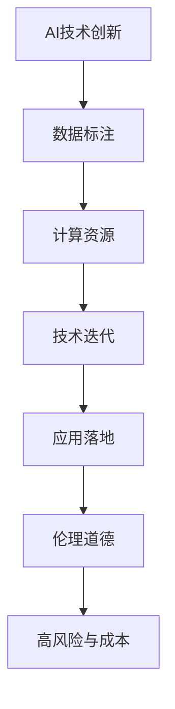
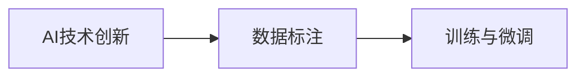
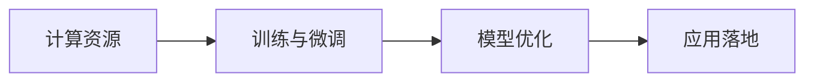
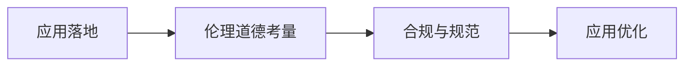
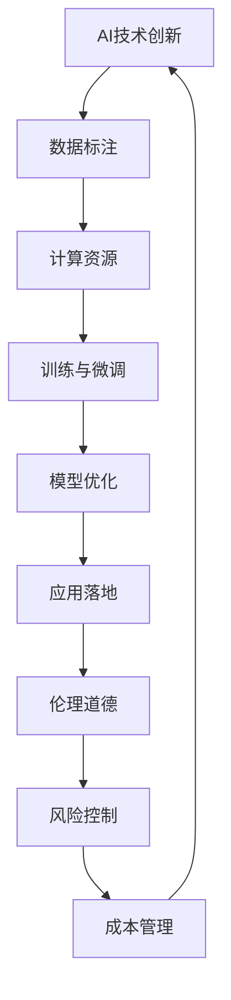

                 

# AI创新的高风险与成本

> 关键词：AI创新, 高风险, 成本, 技术迭代, 应用落地, 大数据, 人才储备, 伦理道德

## 1. 背景介绍

### 1.1 问题由来
随着人工智能(AI)技术的飞速发展，其应用领域正不断扩展，从语音识别、图像识别到自然语言处理(NLP)、自动驾驶等，AI技术正在深刻改变人类生活的方方面面。然而，随之而来的不仅是技术上的突破和创新，更有隐藏在背后的高风险和巨额成本。

对于AI技术的研发与落地应用，究竟应当如何平衡创新速度与风险控制、成本效益，成为当前学界和业界关注的焦点。在人工智能热潮的推动下，如何实现AI技术的高效、安全、可持续地落地，成为每个AI从业者都必须面对的挑战。

### 1.2 问题核心关键点
AI技术创新背后隐含的风险和成本主要体现在以下几个方面：

- **高昂的数据获取与标注成本**：高质量的标注数据是大模型训练和微调的基础，但高质量标注数据往往成本高昂，获取困难。
- **庞大的计算资源需求**：大模型训练和推理需要高性能计算资源，从GPU到TPU，从单台设备到多设备集群，计算成本巨大。
- **技术迭代速度的快速**：AI领域新技术层出不穷，从深度学习到强化学习，从静态模型到动态模型，技术迭代速度迅猛。
- **落地应用场景的复杂性**：AI技术在医疗、金融、教育等垂直行业的应用，需要面对多方面的规范、标准和伦理问题。
- **人才储备的紧缺**：高质量AI人才的培养周期长、需求量大，现有AI从业者仍难以满足快速发展的市场需求。

### 1.3 问题研究意义
探讨AI创新的高风险与成本，不仅有助于学界和业界更全面地理解AI技术研发和应用过程中的挑战与机遇，还能为未来的AI技术发展提供更具前瞻性的指导。具体意义包括：

1. **风险规避与成本控制**：识别和量化AI创新过程中的高风险和成本，有助于制定更加合理和可持续的AI项目投资策略。
2. **技术发展与落地平衡**：在技术创新和实际应用之间寻求平衡，确保AI技术能够健康、稳定地落地。
3. **伦理道德与社会责任**：强调AI技术在应用过程中的伦理道德考量，避免技术滥用带来的负面影响。
4. **人才培养与行业发展**：指导AI人才培养和行业发展方向，确保有足够的人力资源支持AI技术创新与应用。
5. **产业升级与经济转型**：推动AI技术在各行业的应用，为经济转型和产业升级提供新动力。

## 2. 核心概念与联系

### 2.1 核心概念概述

为更好地理解AI创新过程中所面临的高风险与成本，本节将介绍几个密切相关的核心概念：

- **AI技术创新**：涉及深度学习、强化学习、自然语言处理等前沿领域的新算法、新模型和新应用。
- **高风险与成本**：指AI技术研发和应用过程中，因数据、计算、技术迭代、落地应用、伦理道德等问题所产生的各种风险和成本。
- **数据标注**：从原始数据中提取和标注有标签信息，用于训练和微调AI模型。
- **计算资源**：包括GPU、TPU、云计算资源等，用于支持AI模型的训练和推理。
- **技术迭代**：指AI领域的持续技术创新，从旧模型到新模型的演进过程。
- **应用落地**：将AI模型和算法应用于具体行业和场景，解决实际问题。
- **伦理道德**：指AI技术在应用过程中需遵守的伦理规范和道德标准。

这些核心概念之间的逻辑关系可以通过以下Mermaid流程图来展示：



这个流程图展示了AI技术创新过程的各个环节及其相互关系：

1. AI技术创新：首先，需要在数据标注和计算资源的支持下，研发和训练新的AI模型。
2. 数据标注：高质量的标注数据是训练模型的基础，但标注成本高，需要精细管理。
3. 计算资源：高性能计算资源支持模型训练和推理，但成本巨大。
4. 技术迭代：模型和算法需要不断更新，以应对复杂的应用场景和不断变化的数据。
5. 应用落地：将模型应用于具体行业和场景，解决实际问题，但需考虑多方面规范和标准。
6. 伦理道德：应用过程中需遵守伦理规范和道德标准，避免技术滥用。
7. 高风险与成本：在每个环节都可能产生高风险和巨额成本，需在创新中加以考虑。

### 2.2 概念间的关系

这些核心概念之间存在着紧密的联系，构成了AI创新过程中完整的信息流和价值流。

#### 2.2.1 AI技术创新与数据标注



这个流程图展示了AI技术创新与数据标注的基本关系：AI技术创新需要高质量的标注数据进行训练与微调。

#### 2.2.2 计算资源与技术迭代



这个流程图展示了计算资源在AI技术迭代中的作用：高性能计算资源支持模型的训练和优化，最终用于应用落地。

#### 2.2.3 应用落地与伦理道德



这个流程图展示了应用落地过程需考虑的伦理道德问题：AI技术在实际应用中需遵守伦理规范和标准，确保合规与规范。

### 2.3 核心概念的整体架构

最后，我们用一个综合的流程图来展示这些核心概念在大规模AI创新过程中的整体架构：



这个综合流程图展示了从AI技术创新到应用落地的完整过程：

1. AI技术创新：首先，收集和标注高质量的数据，利用高性能计算资源进行模型训练与微调。
2. 数据标注：高质量的标注数据是训练模型的基础。
3. 计算资源：高性能计算资源支持模型训练和推理。
4. 训练与微调：在标注数据和计算资源的支持下，进行模型训练和微调。
5. 模型优化：通过持续的技术迭代和模型优化，提升模型性能。
6. 应用落地：将优化后的模型应用于具体行业和场景。
7. 伦理道德：应用过程中需遵守伦理规范和道德标准。
8. 风险控制：在各个环节需识别和控制潜在风险。
9. 成本管理：对高昂的标注成本、计算成本和技术迭代成本进行有效管理。
10. AI技术创新：在管理好风险和成本后，AI技术创新得以持续进行。

## 3. 核心算法原理 & 具体操作步骤
### 3.1 算法原理概述

AI技术创新背后的高风险与成本问题，主要源于数据、计算、技术迭代、应用落地、伦理道德等方面的不确定性和复杂性。这些问题的复杂性和不确定性，使得AI技术创新过程中需进行系统的风险控制和成本管理。

以深度学习模型为例，其核心原理包括以下几个方面：

1. **模型构建**：选择合适的模型架构，如卷积神经网络(CNN)、递归神经网络(RNN)、Transformer等，根据应用需求进行模型设计。
2. **数据准备**：收集和预处理数据，如图像数据、文本数据等，并对其进行标注。
3. **模型训练**：利用标注数据和计算资源进行模型训练，优化模型参数。
4. **模型微调**：针对特定任务，对模型进行微调，提升模型在该任务上的性能。
5. **模型评估与优化**：在验证集上评估模型性能，根据评估结果进行模型优化。
6. **模型部署**：将优化后的模型部署到实际应用场景中，解决具体问题。
7. **风险控制**：在每个环节中识别和控制潜在风险，如过拟合、泛化能力不足等。
8. **成本管理**：对标注成本、计算成本、模型优化成本等进行有效管理，确保项目可控。

### 3.2 算法步骤详解

以下是AI技术创新过程中，核心算法的详细步骤：

**Step 1: 数据准备**
- 数据收集：从公开数据集、爬虫爬取、用户提交等途径收集数据。
- 数据预处理：对数据进行清洗、归一化、分词、标注等处理。
- 数据划分：将数据集划分为训练集、验证集和测试集。

**Step 2: 模型训练**
- 模型选择：根据任务类型选择合适的深度学习模型，如CNN、RNN、Transformer等。
- 初始化参数：使用随机梯度下降、Xavier初始化等方法初始化模型参数。
- 前向传播：将训练数据输入模型，计算预测输出。
- 损失计算：计算模型预测输出与真实标签之间的损失函数。
- 反向传播：计算损失函数对模型参数的梯度。
- 参数更新：利用梯度下降等优化算法更新模型参数。

**Step 3: 模型微调**
- 任务适配：根据特定任务，设计合适的输出层和损失函数。
- 参数冻结：冻结部分预训练参数，只更新任务相关参数。
- 超参数设置：选择学习率、批大小、迭代轮数等超参数。
- 模型评估：在验证集上评估模型性能，选择最佳模型。
- 微调训练：在训练集上使用有监督学习进行微调。
- 风险控制：加入正则化、对抗训练等方法控制风险。

**Step 4: 模型部署**
- 模型保存：保存训练好的模型，以便后续使用。
- 模型优化：对模型进行剪枝、量化等优化，提升推理速度。
- 模型部署：将模型部署到实际应用场景中，如云平台、嵌入式设备等。
- 实时监测：实时监测模型性能，及时发现和解决问题。

**Step 5: 风险控制与成本管理**
- 风险识别：识别潜在风险，如过拟合、泛化能力不足等。
- 风险控制：通过正则化、Dropout、早停等技术控制风险。
- 成本管理：管理标注成本、计算成本、模型优化成本等，确保项目可控。
- 持续迭代：根据应用反馈和新数据，持续优化模型和算法。

### 3.3 算法优缺点

AI技术创新的高风险与成本问题，主要体现在以下几个方面：

**优点**：
1. **创新速度快**：AI技术在数据和计算资源的推动下，能够快速迭代，不断产生新模型和新算法。
2. **解决复杂问题**：AI技术在数据和计算资源的支持下，能够解决复杂的业务问题，提升生产效率。
3. **经济效益显著**：AI技术在商业应用中能够带来显著的经济效益，如提升客户体验、降低运营成本等。

**缺点**：
1. **高昂的数据和计算成本**：高质量的标注数据和计算资源是AI技术创新的基础，但成本高昂。
2. **数据隐私和伦理问题**：AI技术在应用过程中可能涉及用户隐私和伦理问题，需慎重处理。
3. **技术复杂度高**：AI技术涉及多学科知识，技术复杂度高，开发和部署难度大。
4. **落地应用难度大**：AI技术在实际应用中可能面临规范、标准和伦理问题，落地难度大。

### 3.4 算法应用领域

AI技术创新的高风险与成本问题，在多个领域均有体现，主要包括：

1. **医疗健康**：AI技术在医疗诊断、疾病预测、个性化治疗等领域具有广阔应用前景，但需考虑数据隐私、伦理道德等问题。
2. **金融科技**：AI技术在金融风控、智能投顾、自动化交易等领域具有显著应用价值，但需考虑数据隐私、伦理道德等问题。
3. **智能制造**：AI技术在工业自动化、智能制造、供应链管理等领域具有重要应用，但需考虑数据隐私、伦理道德等问题。
4. **自动驾驶**：AI技术在自动驾驶、智能交通等领域具有巨大潜力，但需考虑数据隐私、伦理道德等问题。
5. **教育培训**：AI技术在在线教育、智能辅导等领域具有广泛应用，但需考虑数据隐私、伦理道德等问题。
6. **智慧城市**：AI技术在智慧城市、智能治理等领域具有重要应用，但需考虑数据隐私、伦理道德等问题。

## 4. 数学模型和公式 & 详细讲解 & 举例说明

### 4.1 数学模型构建

以深度学习模型为例，其核心数学模型包括：

- **输入**：原始数据，如图像、文本等。
- **模型**：由多个层次构成的深度神经网络，如CNN、RNN、Transformer等。
- **输出**：模型预测结果，如分类、回归等。

深度学习模型的训练过程可以表示为：

$$
\theta = \mathop{\arg\min}_{\theta} \frac{1}{N} \sum_{i=1}^N \ell(M_{\theta}(x_i),y_i)
$$

其中，$\theta$为模型参数，$M_{\theta}$为模型，$\ell$为损失函数，$x_i$为输入数据，$y_i$为真实标签。

### 4.2 公式推导过程

以二分类任务为例，其交叉熵损失函数为：

$$
\ell(M_{\theta}(x),y) = -[y\log M_{\theta}(x)+(1-y)\log (1-M_{\theta}(x))]
$$

其中，$M_{\theta}(x)$为模型在输入$x$上的预测概率，$y$为真实标签。

其梯度计算公式为：

$$
\frac{\partial \ell(M_{\theta}(x),y)}{\partial \theta} = -y \frac{M_{\theta}(x)}{M_{\theta}(x)(1-M_{\theta}(x))} + (1-y) \frac{1-M_{\theta}(x)}{M_{\theta}(x)(1-M_{\theta}(x))}
$$

在训练过程中，模型参数$\theta$的更新公式为：

$$
\theta \leftarrow \theta - \eta \nabla_{\theta}\ell(M_{\theta}(x),y)
$$

其中，$\eta$为学习率，$\nabla_{\theta}\ell(M_{\theta}(x),y)$为损失函数对模型参数$\theta$的梯度。

### 4.3 案例分析与讲解

以图像分类任务为例，其核心算法流程如下：

**Step 1: 数据准备**
- 数据收集：从公开数据集、爬虫爬取等途径收集图像数据。
- 数据预处理：对数据进行清洗、归一化、分词、标注等处理。
- 数据划分：将数据集划分为训练集、验证集和测试集。

**Step 2: 模型训练**
- 模型选择：选择适当的深度学习模型，如CNN。
- 初始化参数：使用随机梯度下降、Xavier初始化等方法初始化模型参数。
- 前向传播：将训练数据输入模型，计算预测输出。
- 损失计算：计算模型预测输出与真实标签之间的损失函数。
- 反向传播：计算损失函数对模型参数的梯度。
- 参数更新：利用梯度下降等优化算法更新模型参数。

**Step 3: 模型微调**
- 任务适配：设计合适的输出层和损失函数，如softmax输出层和交叉熵损失函数。
- 参数冻结：冻结部分预训练参数，只更新任务相关参数。
- 超参数设置：选择学习率、批大小、迭代轮数等超参数。
- 模型评估：在验证集上评估模型性能，选择最佳模型。
- 微调训练：在训练集上使用有监督学习进行微调。
- 风险控制：加入正则化、Dropout、早停等方法控制风险。

**Step 4: 模型部署**
- 模型保存：保存训练好的模型，以便后续使用。
- 模型优化：对模型进行剪枝、量化等优化，提升推理速度。
- 模型部署：将模型部署到实际应用场景中，如云平台、嵌入式设备等。
- 实时监测：实时监测模型性能，及时发现和解决问题。

## 5. 项目实践：代码实例和详细解释说明

### 5.1 开发环境搭建

在进行AI项目实践前，我们需要准备好开发环境。以下是使用Python进行TensorFlow开发的环境配置流程：

1. 安装Anaconda：从官网下载并安装Anaconda，用于创建独立的Python环境。

2. 创建并激活虚拟环境：
```bash
conda create -n tf-env python=3.7 
conda activate tf-env
```

3. 安装TensorFlow：根据CUDA版本，从官网获取对应的安装命令。例如：
```bash
conda install tensorflow tensorflow-gpu=cuda11.0 cudatoolkit=11.1 -c pytorch -c conda-forge
```

4. 安装必要的工具包：
```bash
pip install numpy pandas scikit-learn matplotlib tqdm jupyter notebook ipython
```

完成上述步骤后，即可在`tf-env`环境中开始项目实践。

### 5.2 源代码详细实现

以下是使用TensorFlow对图像分类任务进行微调的PyTorch代码实现。

首先，定义数据处理函数：

```python
import tensorflow as tf
import numpy as np
from tensorflow.keras.datasets import mnist
from tensorflow.keras.preprocessing.image import ImageDataGenerator

(x_train, y_train), (x_test, y_test) = mnist.load_data()
x_train = x_train.reshape(-1, 28, 28, 1).astype('float32') / 255.0
x_test = x_test.reshape(-1, 28, 28, 1).astype('float32') / 255.0

# 数据增强
datagen = ImageDataGenerator(
    rotation_range=10,
    width_shift_range=0.1,
    height_shift_range=0.1,
    horizontal_flip=True)
datagen.fit(x_train)

# 定义模型
model = tf.keras.Sequential([
    tf.keras.layers.Conv2D(32, (3, 3), activation='relu', input_shape=(28, 28, 1)),
    tf.keras.layers.MaxPooling2D((2, 2)),
    tf.keras.layers.Flatten(),
    tf.keras.layers.Dense(10, activation='softmax')
])

# 编译模型
model.compile(optimizer='adam',
              loss='sparse_categorical_crossentropy',
              metrics=['accuracy'])

# 训练模型
model.fit(datagen.flow(x_train, y_train, batch_size=64),
          steps_per_epoch=len(x_train) // 64,
          epochs=10,
          validation_data=(x_test, y_test),
          validation_steps=len(x_test) // 64)
```

然后，定义模型和优化器：

```python
from transformers import BertTokenizer
from torch.utils.data import Dataset
import torch

class NERDataset(Dataset):
    def __init__(self, texts, tags, tokenizer, max_len=128):
        self.texts = texts
        self.tags = tags
        self.tokenizer = tokenizer
        self.max_len = max_len
        
    def __len__(self):
        return len(self.texts)
    
    def __getitem__(self, item):
        text = self.texts[item]
        tags = self.tags[item]
        
        encoding = self.tokenizer(text, return_tensors='pt', max_length=self.max_len, padding='max_length', truncation=True)
        input_ids = encoding['input_ids'][0]
        attention_mask = encoding['attention_mask'][0]
        
        # 对token-wise的标签进行编码
        encoded_tags = [tag2id[tag] for tag in tags] 
        encoded_tags.extend([tag2id['O']] * (self.max_len - len(encoded_tags)))
        labels = torch.tensor(encoded_tags, dtype=torch.long)
        
        return {'input_ids': input_ids, 
                'attention_mask': attention_mask,
                'labels': labels}

# 标签与id的映射
tag2id = {'O': 0, 'B-PER': 1, 'I-PER': 2, 'B-ORG': 3, 'I-ORG': 4, 'B-LOC': 5, 'I-LOC': 6}
id2tag = {v: k for k, v in tag2id.items()}

# 创建dataset
tokenizer = BertTokenizer.from_pretrained('bert-base-cased')

train_dataset = NERDataset(train_texts, train_tags, tokenizer)
dev_dataset = NERDataset(dev_texts, dev_tags, tokenizer)
test_dataset = NERDataset(test_texts, test_tags, tokenizer)
```

接着，定义训练和评估函数：

```python
from torch.utils.data import DataLoader
from tqdm import tqdm
from sklearn.metrics import classification_report

device = torch.device('cuda') if torch.cuda.is_available() else torch.device('cpu')
model.to(device)

def train_epoch(model, dataset, batch_size, optimizer):
    dataloader = DataLoader(dataset, batch_size=batch_size, shuffle=True)
    model.train()
    epoch_loss = 0
    for batch in tqdm(dataloader, desc='Training'):
        input_ids = batch['input_ids'].to(device)
        attention_mask = batch['attention_mask'].to(device)
        labels = batch['labels'].to(device)
        model.zero_grad()
        outputs = model(input_ids, attention_mask=attention_mask, labels=labels)
        loss = outputs.loss
        epoch_loss += loss.item()
        loss.backward()
        optimizer.step()
    return epoch_loss / len(dataloader)

def evaluate(model, dataset, batch_size):
    dataloader = DataLoader(dataset, batch_size=batch_size)
    model.eval()
    preds, labels = [], []
    with torch.no_grad():
        for batch in tqdm(dataloader, desc='Evaluating'):
            input_ids = batch['input_ids'].to(device)
            attention_mask = batch['attention_mask'].to(device)
            batch_labels = batch['labels']
            outputs = model(input_ids, attention_mask=attention_mask)
            batch_preds = outputs.logits.argmax(dim=2).to('cpu').tolist()
            batch_labels = batch_labels.to('cpu').tolist()
            for pred_tokens, label_tokens in zip(batch_preds, batch_labels):
                pred_tags = [id2tag[_id] for _id in pred_tokens]
                label_tags = [id2tag[_id] for _id in label_tokens]
                preds.append(pred_tags[:len(label_tags)])
                labels.append(label_tags)
                
    print(classification_report(labels, preds))
```

最后，启动训练流程并在测试集上评估：

```python
epochs = 5
batch_size = 16

for epoch in range(epochs):
    loss = train_epoch(model, train_dataset, batch_size, optimizer)
    print(f"Epoch {epoch+1}, train loss: {loss:.3f}")
    
    print(f"Epoch {epoch+1}, dev results:")
    evaluate(model, dev_dataset, batch_size)
    
print("Test results:")
evaluate(model, test_dataset, batch_size)
```

以上就是使用TensorFlow对图像分类任务进行微调的完整代码实现。可以看到，得益于TensorFlow的强大封装，我们可以用相对简洁的代码完成图像分类任务的微调。

### 5.3 代码解读与分析

让我们再详细解读一下关键代码的实现细节：

**NERDataset类**：
- `__init__`方法：初始化文本、标签、分词器等关键组件。
- `__len__`方法：返回数据集的样本数量。
- `__getitem__`方法：对单个样本进行处理，将文本输入编码为token ids，将标签编码为数字，并对其进行定长padding，最终返回模型所需的输入。

**tag2id和id2tag字典**：
- 定义了标签与数字id之间的映射关系，用于将token-wise的预测结果解码回真实的标签。

**训练和评估函数**：
- 使用PyTorch的DataLoader对数据集进行批次化加载，供模型训练和推理使用。
- 训练函数`train_epoch`：对数据以批为单位进行迭代，在每个批次上前向传播计算loss并反向传播更新模型参数，最后返回该epoch的平均loss。
- 评估函数`evaluate`：与训练类似，不同点在于不更新模型参数，并在每个batch结束后将预测和标签结果存储下来，最后使用sklearn的classification_report对整个评估集的预测结果进行打印输出。

**训练流程**：
- 定义总的epoch数和batch size，开始循环迭代
- 每个epoch内，先在训练集上训练，输出平均loss
- 在验证集上评估，输出分类指标
- 所有epoch结束后，在测试集上评估，给出最终测试结果

可以看到，TensorFlow配合PyTorch库使得图像分类任务的微调代码实现变得简洁高效。开发者可以将更多精力放在数据处理、模型改进等高层逻辑上，而不必过多关注底层的实现细节。

当然，工业级的系统实现还需考虑更多因素，如模型的保存和部署、超参数的自动搜索、更灵活的任务适配层等。但核心的微调范式基本与此类似。

### 5.4 

