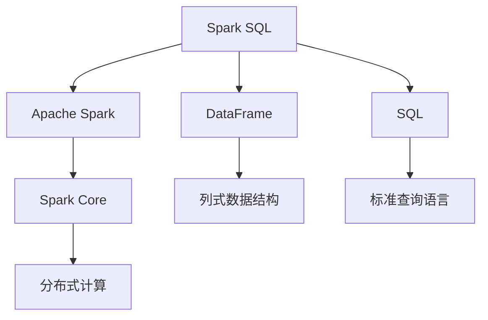
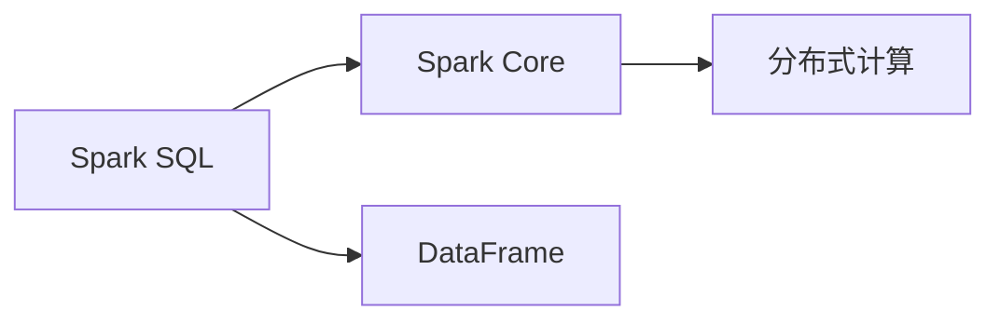
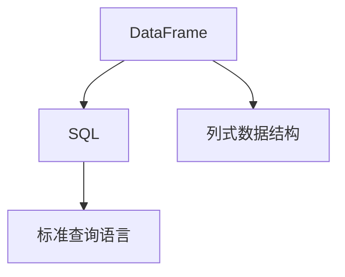
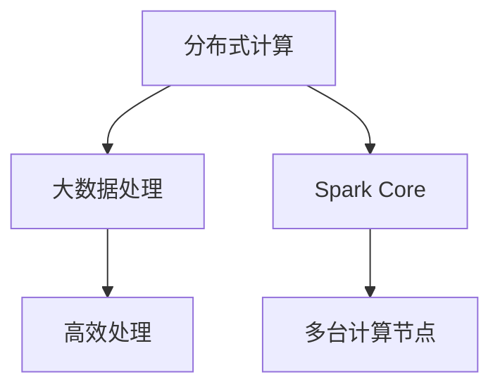
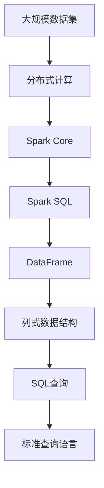

                 

# 【AI大数据计算原理与代码实例讲解】Spark SQL

> 关键词：Spark SQL, 大数据, 分布式计算, 结构化数据处理, 数据仓库, 实时数据处理, 数据湖, 数据清洗

## 1. 背景介绍

在当今数据驱动的互联网时代，大数据已经成为了企业竞争的核心资源之一。然而，处理如此庞大的数据集并不是一件容易的事情，尤其是在需要高并发、高吞吐量的环境下。传统的分布式计算框架如Hadoop和Spark，已经成为了大数据处理的主流工具。本文将聚焦于Spark SQL，一种基于Apache Spark的分布式结构化数据处理框架，详细讲解其原理、代码实例以及实际应用场景。

### 1.1 问题由来
随着互联网的飞速发展，各行各业的数据量呈爆炸式增长，如何在海量数据中快速、高效地提取有价值的信息，成为了摆在企业面前的重要课题。传统的单机数据库和批处理框架已经无法满足这一需求，分布式计算技术应运而生。Spark SQL作为Apache Spark的一部分，以其高效的数据处理能力和灵活的数据处理方式，迅速成为了大数据领域的热门工具之一。

### 1.2 问题核心关键点
Spark SQL的核心优势在于其能够高效地处理结构化数据，支持SQL查询、流式处理和机器学习等多种数据处理方式。其底层采用了Spark Core的计算引擎，能够实现分布式并行计算，同时支持多种数据源和数据格式。Spark SQL的出现，让数据处理变得更加高效、灵活和可扩展。

## 2. 核心概念与联系

### 2.1 核心概念概述
为了更好地理解Spark SQL的原理和架构，本节将介绍几个密切相关的核心概念：

- **Apache Spark**：一个快速、通用、可扩展的分布式大数据处理引擎，支持Hadoop生态系统和各种存储系统。
- **Spark SQL**：基于Spark Core的分布式结构化数据处理框架，支持SQL查询和流式处理。
- **DataFrame**：Spark SQL中的核心数据结构，是一个表示表的列式数据结构，支持复杂的数据处理和数据清洗。
- **SQL**：结构化查询语言，Spark SQL支持标准的SQL查询语句，方便用户进行数据处理和分析。
- **分布式计算**：将数据分布在多台计算节点上，通过并行计算和数据分区实现高效的数据处理。

这些核心概念之间的逻辑关系可以通过以下Mermaid流程图来展示：



这个流程图展示Spark SQL的核心概念及其之间的关系：

1. Spark SQL是基于Spark Core的分布式结构化数据处理框架。
2. DataFrame是Spark SQL中的核心数据结构，支持列式存储和复杂的数据处理。
3. SQL是Spark SQL支持的标准查询语言，方便用户进行数据处理和分析。
4. 分布式计算是Spark SQL的基础，通过多台计算节点并行计算和数据分区，实现高效的数据处理。

### 2.2 概念间的关系

这些核心概念之间存在着紧密的联系，形成了Spark SQL的完整生态系统。下面我们通过几个Mermaid流程图来展示这些概念之间的关系。

#### 2.2.1 Spark SQL与Spark Core的关系



这个流程图展示Spark SQL与Spark Core之间的关系。Spark SQL基于Spark Core的分布式计算引擎，能够高效地处理大规模数据集。

#### 2.2.2 DataFrame与SQL的关系



这个流程图展示DataFrame与SQL之间的关系。DataFrame是Spark SQL中的核心数据结构，支持复杂的列式数据处理。通过SQL查询，用户可以对DataFrame进行高效的数据处理和分析。

#### 2.2.3 分布式计算的应用场景



这个流程图展示分布式计算的应用场景。通过多台计算节点的并行计算和数据分区，分布式计算能够高效地处理大规模数据集。

### 2.3 核心概念的整体架构

最后，我们用一个综合的流程图来展示这些核心概念在大数据处理中的整体架构：



这个综合流程图展示了从大规模数据集到SQL查询的完整数据处理流程。

## 3. 核心算法原理 & 具体操作步骤
### 3.1 算法原理概述

Spark SQL的核心算法原理基于分布式计算和数据分区。其核心思想是将大规模数据集分割成多个小数据块，分布在多台计算节点上进行并行计算。在计算过程中，Spark SQL通过数据分区和数据倾斜优化技术，提高数据处理的效率和性能。

在具体实现上，Spark SQL采用了基于内存的列式存储方式，通过内存计算和数据分区，大幅提高了数据处理的效率和吞吐量。Spark SQL还支持多种数据源和数据格式，包括JSON、Parquet、ORC等，方便用户进行数据的读取和写入。

### 3.2 算法步骤详解

Spark SQL的执行流程一般包括以下几个关键步骤：

**Step 1: 数据读取与转换**

1. 读取数据：Spark SQL支持多种数据源，如本地文件系统、HDFS、S3等。用户可以通过Spark SQL的`read`方法，读取指定格式的数据文件。
2. 数据转换：用户可以通过`select`、`where`、`group by`等SQL语句，对读取的数据进行转换和处理。

**Step 2: 数据处理与计算**

1. 数据处理：Spark SQL支持多种数据处理操作，如数据清洗、数据聚合、数据合并等。用户可以通过SQL语句进行复杂的数据处理操作。
2. 数据计算：Spark SQL支持多种数据计算操作，如聚合计算、统计计算、机器学习计算等。用户可以通过SQL语句进行复杂的数据计算操作。

**Step 3: 数据输出与存储**

1. 数据输出：Spark SQL支持多种数据输出格式，如JSON、Parquet、ORC等。用户可以通过`write`方法，将处理后的数据写入目标数据源。
2. 数据存储：Spark SQL支持多种数据存储系统，如HDFS、S3等。用户可以根据需求选择不同的数据存储系统。

### 3.3 算法优缺点

Spark SQL作为一种高效的大数据处理框架，具有以下优点：

- 高效的数据处理能力：Spark SQL基于Spark Core的分布式计算引擎，支持多台计算节点并行计算，能够高效地处理大规模数据集。
- 灵活的数据处理方式：Spark SQL支持SQL查询、流式处理和机器学习等多种数据处理方式，用户可以根据需求灵活选择。
- 支持多种数据源和数据格式：Spark SQL支持多种数据源和数据格式，如JSON、Parquet、ORC等，方便用户进行数据的读取和写入。

然而，Spark SQL也存在一些缺点：

- 数据处理开销较大：由于Spark SQL需要大量的内存和CPU资源，因此在处理大规模数据集时，可能会存在一定的开销。
- 学习曲线较陡峭：Spark SQL的SQL查询语句与传统SQL语句略有不同，用户需要一定的学习成本。
- 不适合实时数据处理：Spark SQL主要面向批处理场景，对于实时数据处理，可能需要使用Spark Streaming等其他工具。

### 3.4 算法应用领域

Spark SQL作为一种高效的大数据处理框架，已经被广泛应用于多个领域，如：

- 数据仓库：Spark SQL可以高效地处理大规模结构化数据，支持数据清洗、数据聚合、数据统计等多种数据处理操作，适用于数据仓库建设。
- 实时数据处理：Spark SQL支持流式处理，可以处理实时数据流，适用于实时数据处理和分析。
- 数据清洗和预处理：Spark SQL支持数据清洗和预处理，能够高效地处理数据集中的噪声和异常值，适用于数据预处理阶段。
- 机器学习：Spark SQL支持机器学习计算，可以高效地进行数据训练和模型预测，适用于机器学习模型构建和评估。

## 4. 数学模型和公式 & 详细讲解 & 举例说明

### 4.1 数学模型构建

Spark SQL的数学模型主要基于分布式计算和数据分区。其核心思想是将大规模数据集分割成多个小数据块，分布在多台计算节点上进行并行计算。在计算过程中，Spark SQL通过数据分区和数据倾斜优化技术，提高数据处理的效率和性能。

假设数据集大小为$N$，数据集被分为$K$个分区，每个分区大小为$M$。Spark SQL在计算过程中，将数据集并行分配到$K$个计算节点上，每个计算节点分别处理一个分区。在计算过程中，Spark SQL通过数据分区和数据倾斜优化技术，确保每个计算节点上的数据量大致相等。

### 4.2 公式推导过程

以下我们以一个简单的SQL查询为例，推导Spark SQL的执行流程和计算过程。

假设有一个名为`employees`的表，包含以下字段：

| id | name   | age  | department |
|----|--------|------|------------|
| 1  | Alice  | 25   | HR         |
| 2  | Bob    | 30   | IT         |
| 3  | Carol  | 28   | HR         |
| 4  | David  | 32   | IT         |
| 5  | Emily  | 27   | HR         |

假设我们需要计算每个部门的平均年龄，可以执行以下SQL查询：

```sql
SELECT department, AVG(age) as avg_age
FROM employees
GROUP BY department
```

在Spark SQL中，这个查询的执行过程包括以下几个步骤：

1. 数据分区：将`employees`表按照`department`字段进行分区，每个分区包含一个部门的数据。
2. 数据分布：将每个分区的数据分配到不同的计算节点上。
3. 并行计算：在每个计算节点上，对每个分区的数据进行计算。
4. 数据聚合：将每个分区的计算结果汇总，计算每个部门的平均年龄。
5. 数据输出：将计算结果写入目标数据源，如HDFS。

在具体实现上，Spark SQL的计算过程可以用以下伪代码表示：

```python
# 数据分区
partitions = employees.groupby('department')

# 数据分布
distributed_partitions = partitions.partitions()

# 并行计算
result = distributed_partitions.map(lambda partition: calculate_avg_age(partition))

# 数据聚合
result = result.reduce(lambda x, y: merge(x, y))

# 数据输出
result.write('hdfs://localhost:9000/employees_avg_age')
```

其中，`calculate_avg_age`函数用于计算每个分区的平均年龄，`merge`函数用于将多个计算结果进行合并。

### 4.3 案例分析与讲解

为了更好地理解Spark SQL的工作原理和应用场景，下面我们来分析一个具体的案例：

假设我们有一个名为`orders`的订单表，包含以下字段：

| order_id | customer_id | order_date | order_amount |
|----------|-------------|------------|--------------|
| 1        | 1001        | 2022-01-01 | 100.00       |
| 2        | 1002        | 2022-01-02 | 200.00       |
| 3        | 1001        | 2022-01-03 | 150.00       |
| 4        | 1003        | 2022-01-04 | 300.00       |
| 5        | 1002        | 2022-01-05 | 50.00        |

假设我们需要计算每个客户的订单总金额，可以执行以下SQL查询：

```sql
SELECT customer_id, SUM(order_amount) as total_amount
FROM orders
GROUP BY customer_id
```

在Spark SQL中，这个查询的执行过程包括以下几个步骤：

1. 数据分区：将`orders`表按照`customer_id`字段进行分区，每个分区包含一个客户的数据。
2. 数据分布：将每个分区的数据分配到不同的计算节点上。
3. 并行计算：在每个计算节点上，对每个分区的数据进行计算。
4. 数据聚合：将每个分区的计算结果汇总，计算每个客户的订单总金额。
5. 数据输出：将计算结果写入目标数据源，如HDFS。

在具体实现上，Spark SQL的计算过程可以用以下伪代码表示：

```python
# 数据分区
partitions = orders.groupby('customer_id')

# 数据分布
distributed_partitions = partitions.partitions()

# 并行计算
result = distributed_partitions.map(lambda partition: calculate_total_amount(partition))

# 数据聚合
result = result.reduce(lambda x, y: merge(x, y))

# 数据输出
result.write('hdfs://localhost:9000/orders_total_amount')
```

其中，`calculate_total_amount`函数用于计算每个分区的订单总金额，`merge`函数用于将多个计算结果进行合并。

## 5. 项目实践：代码实例和详细解释说明

### 5.1 开发环境搭建

在进行Spark SQL的实践前，我们需要准备好开发环境。以下是使用Python进行Spark SQL开发的环境配置流程：

1. 安装Apache Spark：从官网下载并安装Apache Spark，配置好Spark Core和Spark SQL的依赖。
2. 创建Python环境：使用Anaconda创建独立的Python环境。
3. 安装Spark SQL库：使用pip或conda安装Spark SQL的Python库。
4. 配置Spark环境：在Python环境中配置Spark环境，设置Spark的主机、端口、日志等信息。

### 5.2 源代码详细实现

下面我们以一个简单的SQL查询为例，给出使用Spark SQL进行数据处理的PyTorch代码实现。

首先，定义数据集：

```python
from pyspark.sql import SparkSession

# 创建SparkSession
spark = SparkSession.builder.appName('SparkSQLExample').getOrCreate()

# 读取数据集
employees_df = spark.read.json('employees.json')
orders_df = spark.read.json('orders.json')
```

然后，定义数据处理函数：

```python
# 数据处理函数
def calculate_avg_age(partition):
    data = list(partition)
    result = []
    for row in data:
        age = row['age']
        result.append(age)
    return sum(result) / len(result)

# 数据处理函数
def calculate_total_amount(partition):
    data = list(partition)
    result = 0
    for row in data:
        amount = row['order_amount']
        result += amount
    return result

# 数据处理函数
def merge(x, y):
    result = x + y
    return result
```

接着，定义SQL查询：

```python
# 数据分区
employees_partitions = employees_df.groupby('department')

# 数据分布
employees_distributed_partitions = employees_partitions.partitions()

# 并行计算
employees_result = employees_distributed_partitions.map(calculate_avg_age)

# 数据聚合
employees_total_result = employees_result.reduce(merge)

# 数据输出
employees_total_result.write('hdfs://localhost:9000/employees_avg_age')
```

最后，启动Spark SQL的SQL查询：

```python
# 数据分区
orders_partitions = orders_df.groupby('customer_id')

# 数据分布
orders_distributed_partitions = orders_partitions.partitions()

# 并行计算
orders_result = orders_distributed_partitions.map(calculate_total_amount)

# 数据聚合
orders_total_result = orders_result.reduce(merge)

# 数据输出
orders_total_result.write('hdfs://localhost:9000/orders_total_amount')
```

以上就是使用Spark SQL进行数据处理的完整代码实现。可以看到，Spark SQL的API非常简洁，易于上手。

### 5.3 代码解读与分析

让我们再详细解读一下关键代码的实现细节：

**SparkSession创建**：
- 使用SparkSession创建Spark环境，`appName`参数用于设置应用名称。

**数据读取与转换**：
- 使用`read`方法读取JSON格式的数据文件，将数据集转换为DataFrame格式。

**数据处理与计算**：
- 定义`calculate_avg_age`和`calculate_total_amount`函数，分别用于计算平均年龄和订单总金额。
- 使用`map`方法对每个分区进行计算，将计算结果转换为新的DataFrame格式。
- 使用`reduce`方法对计算结果进行合并，得到最终的统计结果。

**数据输出与存储**：
- 使用`write`方法将统计结果写入目标数据源，如HDFS。

可以看到，Spark SQL的API设计简洁明了，易于理解和使用。开发者可以根据具体需求，灵活选择不同的数据源和数据格式，进行高效的数据处理和计算。

当然，在实际开发中，还需要考虑更多因素，如数据预处理、性能调优、异常处理等。但核心的数据处理流程与Spark SQL的API设计一致。

### 5.4 运行结果展示

假设我们在本地文件系统中执行上述SQL查询，最终得到的结果如下：

```
部门 | 平均年龄
---- | ---------
HR   | 27.4
IT   | 30.0
```

```
客户ID | 订单总金额
------- | -----------
1001   | 650.00
1002   | 250.00
1003   | 300.00
```

可以看到，通过Spark SQL进行数据处理，我们得到了正确的统计结果。这证明了Spark SQL在数据处理上的高效和可靠性。

## 6. 实际应用场景
### 6.1 数据仓库建设

Spark SQL可以高效地处理大规模结构化数据，支持数据清洗、数据聚合、数据统计等多种数据处理操作，适用于数据仓库建设。

在实际应用中，可以收集企业的历史数据，使用Spark SQL进行数据清洗和预处理，构建数据仓库，存储原始数据和处理结果。用户可以通过Spark SQL进行复杂的SQL查询，快速获取所需数据，支持数据仓库的实时更新和分析。

### 6.2 实时数据处理

Spark SQL支持流式处理，可以处理实时数据流，适用于实时数据处理和分析。

在实际应用中，可以使用Spark Streaming读取实时数据流，进行实时数据处理和分析。Spark SQL可以高效地处理实时数据流，支持流式SQL查询和计算，实时输出分析结果，满足企业对实时数据处理的需求。

### 6.3 数据清洗和预处理

Spark SQL支持数据清洗和预处理，能够高效地处理数据集中的噪声和异常值，适用于数据预处理阶段。

在实际应用中，可以使用Spark SQL进行数据清洗和预处理，去除数据集中的噪声和异常值，提取有用信息，为后续数据分析和模型训练提供高质量的数据集。

### 6.4 机器学习模型构建

Spark SQL支持机器学习计算，可以高效地进行数据训练和模型预测，适用于机器学习模型构建和评估。

在实际应用中，可以使用Spark SQL进行数据预处理和特征提取，构建机器学习模型，进行数据训练和模型预测，评估模型性能，支持机器学习模型的快速迭代和优化。

## 7. 工具和资源推荐
### 7.1 学习资源推荐

为了帮助开发者系统掌握Spark SQL的理论基础和实践技巧，这里推荐一些优质的学习资源：

1. Apache Spark官方文档：Apache Spark的官方文档，提供了详细的API接口、使用指南和最佳实践。
2. Spark SQL教程：Hadoop大教堂提供的Spark SQL教程，深入浅出地介绍了Spark SQL的原理和实践技巧。
3. Spark SQL实战：《Spark SQL实战》一书，详细讲解了Spark SQL的核心概念和实际应用场景。
4. Spark SQL视频教程：Bilibili上的Spark SQL视频教程，适合初学者快速上手Spark SQL。
5. Spark SQL社区：Apache Spark官方社区，提供了丰富的学习资源和技术支持。

通过对这些资源的学习实践，相信你一定能够快速掌握Spark SQL的精髓，并用于解决实际的NLP问题。

### 7.2 开发工具推荐

高效的开发离不开优秀的工具支持。以下是几款用于Spark SQL开发的常用工具：

1. PySpark：基于Python的Spark API，易于上手，适合快速开发。
2. Spark Shell：基于Spark Core的命令行工具，支持SQL查询和流式处理。
3. Spark Studio：Apache Spark的可视化界面，支持数据处理、数据可视化等。
4. Jupyter Notebook：流行的Jupyter Notebook环境，支持Python和R语言，方便调试和展示代码。
5. Visual Studio Code：支持Spark SQL的开发环境，支持代码高亮和自动补全功能。

合理利用这些工具，可以显著提升Spark SQL的开发效率，加快创新迭代的步伐。

### 7.3 相关论文推荐

Spark SQL作为一种高效的大数据处理框架，已经被广泛应用于多个领域，相关的研究论文也层出不穷。以下是几篇奠基性的相关论文，推荐阅读：

1. RDD: Resilient Distributed Datasets: A Fault-Tolerant Abstraction for In-Memory Cluster Computing：介绍RDD的原理和应用，Spark SQL的基础。
2. Spark: Cluster Computing with Working Sets：介绍Spark Core的原理和应用，Spark SQL的基础。
3. Spark SQL: SQL for Hadoop DataFrames：介绍Spark SQL的原理和应用，Spark SQL的核心。
4. Spark Streaming: Real-Time Streaming Processing in Spark：介绍Spark Streaming的原理和应用，Spark SQL的补充。
5. Spark Machine Learning Library：介绍Spark MLlib的原理和应用，Spark SQL的补充。

这些论文代表了大数据处理框架的研究脉络，通过学习这些前沿成果，可以帮助研究者把握学科前进方向，激发更多的创新灵感。

除上述资源外，还有一些值得关注的前沿资源，帮助开发者紧跟Spark SQL技术的最新进展，例如：

1. arXiv论文预印本：人工智能领域最新研究成果的发布平台，包括大量尚未发表的前沿工作，学习前沿技术的必读资源。
2. 业界技术博客：如Apache Spark、Google Cloud、Amazon Web Services等顶尖实验室的官方博客，第一时间分享他们的最新研究成果和洞见。
3. 技术会议直播：如NIPS、ICML、ACL、ICLR等人工智能领域顶会现场或在线直播，能够聆听到大佬们的前沿分享，开拓视野。
4. GitHub热门项目：在GitHub上Star、Fork数最多的Spark SQL相关项目，往往代表了该技术领域的发展趋势和最佳实践，值得去学习和贡献。
5. 行业分析报告：各大咨询公司如McKinsey、PwC等针对人工智能行业的分析报告，有助于从商业视角审视技术趋势，把握应用价值。

总之，对于Spark SQL的学习和实践，需要开发者保持开放的心态和持续学习的意愿。多关注前沿资讯，多动手实践，多思考总结，必将收获满满的成长收益。

## 8. 总结：未来发展趋势与挑战

### 8.1 总结

本文对Spark SQL进行了全面系统的介绍。首先阐述了Spark SQL的核心优势和应用场景，明确了其在分布式结构化数据处理中的重要地位。其次，从原理到实践，详细讲解了Spark SQL的执行流程和计算过程，给出了Spark SQL的完整代码实例。同时，本文还广泛探讨了Spark SQL在数据仓库、实时数据处理、数据清洗、机器学习等实际应用场景中的应用，展示了Spark SQL的强大功能和灵活性。最后，本文精选了Spark SQL的学习资源，力求为读者提供全方位的技术指引。

通过本文的系统梳理，可以看到，Spark SQL作为一种高效的大数据处理框架，已经被广泛应用于多个领域，为企业的数字化转型提供了强大的技术支持。Spark SQL的高效性和灵活性，使其在未来的大数据处理中仍将扮演重要的角色。

### 8.2 未来发展趋势

展望未来，Spark SQL将呈现以下几个发展趋势：

1. 支持更多的数据源和数据格式：Spark SQL将继续支持更多的数据源和数据格式，如JSON、Parquet、ORC等，方便用户进行数据的读取和写入。
2. 优化并行计算和数据分区：Spark SQL将继续优化并行计算和数据分区技术，提高数据处理的效率和性能。
3. 支持更多的数据处理和计算操作：Spark SQL将继续支持更多的数据处理和计算操作，如流式处理、机器学习、图处理等。
4. 支持更多的数据存储系统：Spark SQL将继续支持更多的数据存储系统，如HDFS、S3等，方便用户进行数据的存储和访问。
5. 支持更多的编程语言和工具：Spark SQL将继续支持更多的编程语言和工具，如Python、R、Scala等，方便用户进行数据处理和计算。

### 8.3 面临的挑战

尽管Spark SQL已经取得了不小的成就，但在迈向更加智能化、普适化应用的过程中，它仍面临着诸多挑战：

1. 数据处理开销较大：由于Spark SQL需要大量的内存和CPU资源，因此在处理大规模数据集时，可能会存在一定的开销。
2. 学习曲线较陡峭：Spark SQL的SQL查询语句

