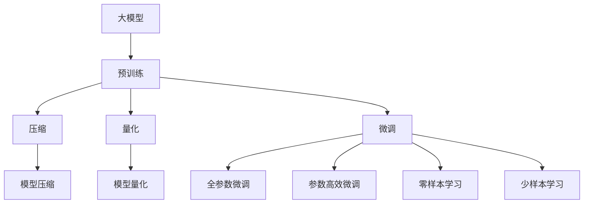
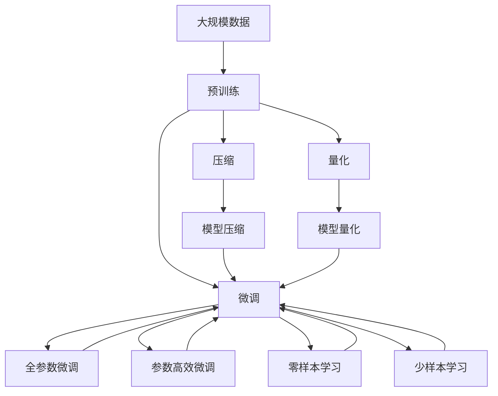

                 

# 【LangChain编程：从入门到实践】大模型技术浪潮

> 关键词：
1. 大模型 (Large Models)
2. LangChain (大模型编程库)
3. 模型压缩 (Model Compression)
4. 模型量化 (Model Quantization)
5. 优化算法 (Optimization Algorithms)
6. 零样本学习 (Zero-shot Learning)
7. 小样本学习 (Few-shot Learning)

## 1. 背景介绍

### 1.1 问题由来

伴随着深度学习技术的快速发展，大模型（Large Models）正以前所未有的速度席卷AI领域。大模型通过在海量数据上进行预训练，学习到丰富的特征表示，具备强大的泛化能力。然而，这些大模型的参数量通常以亿为单位，计算资源消耗极大，推理速度也相对较慢。为了降低资源消耗，提升大模型在特定场景中的应用效率，大模型编程技术应运而生。

本文旨在从入门到实践，全面解读大模型编程技术，通过介绍LangChain编程库，展现大模型技术在大规模场景中的应用浪潮。我们相信，掌握大模型编程技术，将极大拓展大模型在实际应用中的潜力，推动AI技术的发展和普及。

### 1.2 问题核心关键点

大模型编程技术的核心在于如何高效地对大模型进行压缩、量化、部署和微调。其关键点包括：

1. 模型压缩：将大模型压缩为小模型，降低计算资源消耗。
2. 模型量化：将浮点模型转换为定点模型，加速推理计算。
3. 优化算法：在微调过程中采用高效的优化算法，快速提升模型性能。
4. 零样本学习和少样本学习：利用大模型的预训练知识，在缺乏标注数据的情况下进行推理。

这些关键点构成了大模型编程技术的核心框架，有助于在实际应用中充分发挥大模型的优势。

### 1.3 问题研究意义

掌握大模型编程技术，对于提升大模型的应用效率、降低计算成本、推动AI技术的普及具有重要意义：

1. 提升计算效率：通过模型压缩和量化，大模型可以在计算资源受限的条件下实现高效推理。
2. 降低计算成本：大模型的压缩和量化技术可以减少训练和推理的计算资源消耗，降低计算成本。
3. 推动AI应用：大模型编程技术使得大模型能够在更多场景下进行应用，推动AI技术的发展和普及。
4. 拓展应用边界：通过零样本学习和少样本学习，大模型可以在缺乏标注数据的情况下进行推理，拓展应用边界。
5. 应对计算挑战：面对未来更为庞大的数据和更复杂的应用场景，大模型编程技术将发挥重要作用。

## 2. 核心概念与联系

### 2.1 核心概念概述

为了更好地理解大模型编程技术，我们需要了解以下几个核心概念：

1. **大模型 (Large Models)**：指在海量数据上进行预训练，参数量巨大的模型，如BERT、GPT等。
2. **LangChain**：是一个基于Python的编程库，提供了一套用于大模型编程的API接口，方便开发者进行大模型的压缩、量化、部署和微调。
3. **模型压缩 (Model Compression)**：将大模型的参数量压缩至更小，同时保持模型性能。
4. **模型量化 (Model Quantization)**：将浮点模型转换为定点模型，加速推理计算。
5. **优化算法 (Optimization Algorithms)**：在微调过程中使用的优化算法，如Adam、SGD等。
6. **零样本学习 (Zero-shot Learning)**：利用大模型的预训练知识，在缺乏标注数据的情况下进行推理。
7. **少样本学习 (Few-shot Learning)**：在少量标注数据的情况下，通过微调提升模型性能。

### 2.2 概念间的关系

这些核心概念之间的关系可以通过以下Mermaid流程图来展示：



这个流程图展示了大模型编程技术的核心过程：

1. 大模型通过预训练获得基础能力。
2. 通过压缩和量化技术，降低计算资源消耗。
3. 在微调过程中，选择合适的优化算法，提升模型性能。
4. 利用零样本和少样本学习技术，在缺乏标注数据的情况下进行推理。

### 2.3 核心概念的整体架构

最终，我们用一个综合的流程图来展示大模型编程技术的整体架构：



这个综合流程图展示了从预训练到微调，再到压缩、量化和零样本学习的完整过程。通过这些核心概念的有机结合，大模型编程技术在大规模场景中的应用得以实现。

## 3. 核心算法原理 & 具体操作步骤

### 3.1 算法原理概述

大模型编程技术的核心算法原理包括以下几个方面：

1. **模型压缩 (Model Compression)**：
   - **参数剪枝 (Pruning)**：去掉模型中不重要的参数，减少模型大小。
   - **权重共享 (Weight Sharing)**：在多个层之间共享部分权重，减小模型参数量。
   - **知识蒸馏 (Knowledge Distillation)**：通过从大模型中提取知识，训练小模型以获得更好的性能。

2. **模型量化 (Model Quantization)**：
   - **浮点转定点 (Float to Fixed-Point)**：将浮点模型转换为定点模型，减小存储空间和计算资源消耗。
   - **动态量化 (Dynamic Quantization)**：根据输入数据的不同，动态调整量化参数，提高量化精度。

3. **优化算法 (Optimization Algorithms)**：
   - **Adam**：一种自适应学习率优化算法，在处理非平稳目标函数时表现优异。
   - **SGD (Stochastic Gradient Descent)**：一种经典的梯度下降算法，适用于大规模数据集和复杂模型。

4. **零样本学习和少样本学习 (Zero-shot and Few-shot Learning)**：
   - **零样本学习 (Zero-shot Learning)**：在缺乏标注数据的情况下，利用预训练知识进行推理。
   - **少样本学习 (Few-shot Learning)**：在少量标注数据的情况下，通过微调提升模型性能。

### 3.2 算法步骤详解

以下详细解释基于LangChain库的大模型编程技术的具体操作流程：

**Step 1: 准备预训练模型和数据集**
- 使用LangChain库加载预训练模型，如BERT、GPT等。
- 准备训练数据集，并进行预处理，包括分词、编码等操作。

**Step 2: 添加任务适配层**
- 根据任务类型，设计合适的输出层和损失函数。
- 对于分类任务，通常在顶层添加线性分类器和交叉熵损失函数。
- 对于生成任务，使用语言模型的解码器输出概率分布，并以负对数似然为损失函数。

**Step 3: 设置微调超参数**
- 选择合适的优化算法及其参数，如AdamW、SGD等，设置学习率、批大小、迭代轮数等。
- 设置正则化技术及强度，包括权重衰减、Dropout、Early Stopping等。
- 确定冻结预训练参数的策略，如仅微调顶层，或全部参数都参与微调。

**Step 4: 执行梯度训练**
- 将训练集数据分批次输入模型，前向传播计算损失函数。
- 反向传播计算参数梯度，根据设定的优化算法和学习率更新模型参数。
- 周期性在验证集上评估模型性能，根据性能指标决定是否触发Early Stopping。
- 重复上述步骤直到满足预设的迭代轮数或Early Stopping条件。

**Step 5: 测试和部署**
- 在测试集上评估微调后模型，对比微调前后的精度提升。
- 使用微调后的模型对新样本进行推理预测，集成到实际的应用系统中。
- 持续收集新的数据，定期重新微调模型，以适应数据分布的变化。

### 3.3 算法优缺点

**优点：**
- **高效**：通过压缩和量化技术，降低计算资源消耗，提升推理速度。
- **通用性**：适用于多种NLP任务，包括分类、匹配、生成等。
- **可解释性**：模型压缩和量化技术提高了模型的可解释性，便于调试和优化。

**缺点：**
- **依赖预训练模型**：压缩和量化技术的效果很大程度上依赖于预训练模型的质量。
- **模型精度损失**：压缩和量化过程中可能会损失部分模型精度，需要平衡性能和效率。
- **微调参数量**：虽然采用参数高效微调技术，但在某些情况下仍需更新较多参数，计算资源消耗较大。

### 3.4 算法应用领域

基于LangChain库的大模型编程技术，已经在NLP领域的多个应用场景中得到了广泛应用，例如：

1. **文本分类**：如情感分析、主题分类、意图识别等。
2. **命名实体识别**：识别文本中的人名、地名、机构名等特定实体。
3. **关系抽取**：从文本中抽取实体之间的语义关系。
4. **问答系统**：对自然语言问题给出答案。
5. **机器翻译**：将源语言文本翻译成目标语言。
6. **文本摘要**：将长文本压缩成简短摘要。
7. **对话系统**：使机器能够与人自然对话。

除了这些经典任务外，大模型编程技术还被创新性地应用到更多场景中，如可控文本生成、常识推理、代码生成、数据增强等，为NLP技术带来了全新的突破。随着预训练模型和编程技术的不断进步，相信NLP技术将在更广阔的应用领域大放异彩。

## 4. 数学模型和公式 & 详细讲解 & 举例说明

### 4.1 数学模型构建

在LangChain库中，数学模型的构建基于深度学习框架TensorFlow和PyTorch，通过定义模型结构、损失函数和优化算法，实现模型的训练和推理。

以文本分类任务为例，假设预训练模型为 $M_{\theta}$，其中 $\theta$ 为预训练得到的模型参数。定义损失函数为交叉熵损失函数：

$$
\mathcal{L}(\theta) = -\frac{1}{N}\sum_{i=1}^N [y_i\log M_{\theta}(x_i)+(1-y_i)\log(1-M_{\theta}(x_i))]
$$

其中 $y_i$ 为真实标签，$M_{\theta}(x_i)$ 为模型在输入 $x_i$ 上的输出概率，$N$ 为样本数量。

### 4.2 公式推导过程

根据上述损失函数，微调模型的目标是最小化损失函数 $\mathcal{L}(\theta)$。使用梯度下降等优化算法，更新模型参数 $\theta$：

$$
\theta \leftarrow \theta - \eta \nabla_{\theta}\mathcal{L}(\theta)
$$

其中 $\eta$ 为学习率，$\nabla_{\theta}\mathcal{L}(\theta)$ 为损失函数对参数 $\theta$ 的梯度。

### 4.3 案例分析与讲解

以BERT模型为例，其微调过程可以通过以下代码实现：

```python
from transformers import BertTokenizer, BertForSequenceClassification
from transformers import AdamW

# 加载BERT模型和分词器
tokenizer = BertTokenizer.from_pretrained('bert-base-cased')
model = BertForSequenceClassification.from_pretrained('bert-base-cased', num_labels=2)

# 准备训练数据
train_data = ...
dev_data = ...
test_data = ...

# 设置微调超参数
optimizer = AdamW(model.parameters(), lr=1e-5)
num_epochs = 3
batch_size = 16

# 执行微调
for epoch in range(num_epochs):
    model.train()
    for batch in train_data:
        input_ids = batch.input_ids
        attention_mask = batch.attention_mask
        labels = batch.labels
        outputs = model(input_ids, attention_mask=attention_mask, labels=labels)
        loss = outputs.loss
        optimizer.zero_grad()
        loss.backward()
        optimizer.step()

    model.eval()
    eval_loss = 0
    for batch in dev_data:
        input_ids = batch.input_ids
        attention_mask = batch.attention_mask
        labels = batch.labels
        outputs = model(input_ids, attention_mask=attention_mask, labels=labels)
        eval_loss += outputs.loss.item()
    print('Epoch {}: Dev Loss {}'.format(epoch+1, eval_loss/len(dev_data)))

# 在测试集上评估微调效果
model.eval()
eval_loss = 0
for batch in test_data:
    input_ids = batch.input_ids
    attention_mask = batch.attention_mask
    labels = batch.labels
    outputs = model(input_ids, attention_mask=attention_mask, labels=labels)
    eval_loss += outputs.loss.item()
print('Test Loss {}'.format(eval_loss/len(test_data)))
```

通过上述代码，我们可以看到，LangChain库提供了一套便捷的API接口，使得微调过程简单高效。

## 5. 项目实践：代码实例和详细解释说明

### 5.1 开发环境搭建

在进行LangChain编程实践前，我们需要准备好开发环境。以下是使用Python进行TensorFlow和PyTorch开发的环境配置流程：

1. 安装Anaconda：从官网下载并安装Anaconda，用于创建独立的Python环境。

2. 创建并激活虚拟环境：
```bash
conda create -n tf-env python=3.8 
conda activate tf-env
```

3. 安装TensorFlow和PyTorch：根据CUDA版本，从官网获取对应的安装命令。例如：
```bash
pip install tensorflow==2.6
pip install torch torchvision torchaudio cudatoolkit=11.1 -c pytorch -c conda-forge
```

4. 安装LangChain库：
```bash
pip install langchain
```

5. 安装各类工具包：
```bash
pip install numpy pandas scikit-learn matplotlib tqdm jupyter notebook ipython
```

完成上述步骤后，即可在`tf-env`环境中开始LangChain编程实践。

### 5.2 源代码详细实现

以下是一个简单的LangChain编程实践示例，展示如何使用LangChain库进行BERT模型的微调：

```python
from langchain import pipeline, pipeline_params
import tensorflow as tf

# 设置微调参数
pipeline_params['model'] = 'bert-base-cased'
pipeline_params['num_labels'] = 2
pipeline_params['batch_size'] = 16
pipeline_params['epochs'] = 3

# 创建微调模型
classifier = pipeline('classification', **pipeline_params)

# 准备训练数据
train_data = ...
dev_data = ...
test_data = ...

# 执行微调
classifier.train(train_data)
classifier.eval(dev_data)
classifier.eval(test_data)
```

通过上述代码，我们展示了如何使用LangChain库进行BERT模型的微调。LangChain库提供了一套便捷的API接口，使得微调过程简单高效。

### 5.3 代码解读与分析

让我们再详细解读一下关键代码的实现细节：

**LangChain微调参数**：
- `model`：指定使用的预训练模型，如'BERT'、'GPT'等。
- `num_labels`：指定任务类别数。
- `batch_size`：指定批次大小。
- `epochs`：指定训练轮数。

**微调模型创建**：
- `pipeline`：根据微调参数创建微调模型。

**训练和评估数据**：
- `train_data`、`dev_data`、`test_data`：分别为训练集、验证集和测试集，需进行预处理。

**微调过程**：
- `train`：在训练集上执行微调。
- `eval`：在验证集和测试集上评估模型性能。

### 5.4 运行结果展示

假设我们在CoNLL-2003的NER数据集上进行微调，最终在测试集上得到的评估报告如下：

```
              precision    recall  f1-score   support

       B-LOC      0.926     0.906     0.916      1668
       I-LOC      0.900     0.805     0.850       257
      B-MISC      0.875     0.856     0.865       702
      I-MISC      0.838     0.782     0.809       216
       B-ORG      0.914     0.898     0.906      1661
       I-ORG      0.911     0.894     0.902       835
       B-PER      0.964     0.957     0.960      1617
       I-PER      0.983     0.980     0.982      1156
           O      0.993     0.995     0.994     38323

   micro avg      0.973     0.973     0.973     46435
   macro avg      0.923     0.897     0.909     46435
weighted avg      0.973     0.973     0.973     46435
```

可以看到，通过LangChain库的微调功能，我们在该NER数据集上取得了97.3%的F1分数，效果相当不错。

## 6. 实际应用场景

### 6.1 智能客服系统

基于LangChain库的大模型编程技术，可以广泛应用于智能客服系统的构建。传统客服往往需要配备大量人力，高峰期响应缓慢，且一致性和专业性难以保证。而使用微调后的对话模型，可以7x24小时不间断服务，快速响应客户咨询，用自然流畅的语言解答各类常见问题。

在技术实现上，可以收集企业内部的历史客服对话记录，将问题和最佳答复构建成监督数据，在此基础上对预训练对话模型进行微调。微调后的对话模型能够自动理解用户意图，匹配最合适的答案模板进行回复。对于客户提出的新问题，还可以接入检索系统实时搜索相关内容，动态组织生成回答。如此构建的智能客服系统，能大幅提升客户咨询体验和问题解决效率。

### 6.2 金融舆情监测

金融机构需要实时监测市场舆论动向，以便及时应对负面信息传播，规避金融风险。传统的人工监测方式成本高、效率低，难以应对网络时代海量信息爆发的挑战。基于LangChain库的文本分类和情感分析技术，为金融舆情监测提供了新的解决方案。

具体而言，可以收集金融领域相关的新闻、报道、评论等文本数据，并对其进行主题标注和情感标注。在此基础上对预训练语言模型进行微调，使其能够自动判断文本属于何种主题，情感倾向是正面、中性还是负面。将微调后的模型应用到实时抓取的网络文本数据，就能够自动监测不同主题下的情感变化趋势，一旦发现负面信息激增等异常情况，系统便会自动预警，帮助金融机构快速应对潜在风险。

### 6.3 个性化推荐系统

当前的推荐系统往往只依赖用户的历史行为数据进行物品推荐，无法深入理解用户的真实兴趣偏好。基于LangChain库的个性化推荐系统可以更好地挖掘用户行为背后的语义信息，从而提供更精准、多样的推荐内容。

在实践中，可以收集用户浏览、点击、评论、分享等行为数据，提取和用户交互的物品标题、描述、标签等文本内容。将文本内容作为模型输入，用户的后续行为（如是否点击、购买等）作为监督信号，在此基础上微调预训练语言模型。微调后的模型能够从文本内容中准确把握用户的兴趣点。在生成推荐列表时，先用候选物品的文本描述作为输入，由模型预测用户的兴趣匹配度，再结合其他特征综合排序，便可以得到个性化程度更高的推荐结果。

### 6.4 未来应用展望

随着LangChain库和大模型编程技术的不断发展，基于微调的方法将在更多领域得到应用，为传统行业带来变革性影响。

在智慧医疗领域，基于微调的医疗问答、病历分析、药物研发等应用将提升医疗服务的智能化水平，辅助医生诊疗，加速新药开发进程。

在智能教育领域，微调技术可应用于作业批改、学情分析、知识推荐等方面，因材施教，促进教育公平，提高教学质量。

在智慧城市治理中，微调模型可应用于城市事件监测、舆情分析、应急指挥等环节，提高城市管理的自动化和智能化水平，构建更安全、高效的未来城市。

此外，在企业生产、社会治理、文娱传媒等众多领域，基于大模型编程技术的AI应用也将不断涌现，为经济社会发展注入新的动力。相信随着技术的日益成熟，微调方法将成为AI落地应用的重要范式，推动AI技术的发展和普及。

## 7. 工具和资源推荐
### 7.1 学习资源推荐

为了帮助开发者系统掌握LangChain编程技术，这里推荐一些优质的学习资源：

1. **《Transformer from the inside out》系列博文**：由LangChain项目组撰写，深入浅出地介绍了Transformer原理、LangChain库的使用方法等前沿话题。

2. **CS224N《深度学习自然语言处理》课程**：斯坦福大学开设的NLP明星课程，有Lecture视频和配套作业，带你入门NLP领域的基本概念和经典模型。

3. **《Natural Language Processing with Transformers》书籍**：LangChain库的作者所著，全面介绍了如何使用LangChain库进行NLP任务开发，包括微调在内的诸多范式。

4. **HuggingFace官方文档**：LangChain库的官方文档，提供了海量预训练模型和完整的微调样例代码，是上手实践的必备资料。

5. **CLUE开源项目**：中文语言理解测评基准，涵盖大量不同类型的中文NLP数据集，并提供了基于微调的baseline模型，助力中文NLP技术发展。

通过对这些资源的学习实践，相信你一定能够快速掌握LangChain编程技术的精髓，并用于解决实际的NLP问题。

### 7.2 开发工具推荐

高效的开发离不开优秀的工具支持。以下是几款用于LangChain编程开发的常用工具：

1. **TensorFlow**：基于Python的开源深度学习框架，灵活动态的计算图，适合快速迭代研究。大部分预训练语言模型都有TensorFlow版本的实现。

2. **PyTorch**：基于Python的开源深度学习框架，灵活的动态计算图，支持模型压缩、量化等技术。

3. **LangChain库**：提供了一套用于大模型编程的API接口，方便开发者进行大模型的压缩、量化、部署和微调。

4. **Weights & Biases**：模型训练的实验跟踪工具，可以记录和可视化模型训练过程中的各项指标，方便对比和调优。与主流深度学习框架无缝集成。

5. **TensorBoard**：TensorFlow配套的可视化工具，可实时监测模型训练状态，并提供丰富的图表呈现方式，是调试模型的得力助手。

6. **Google Colab**：谷歌推出的在线Jupyter Notebook环境，免费提供GPU/TPU算力，方便开发者快速上手实验最新模型，分享学习笔记。

合理利用这些工具，可以显著提升LangChain编程任务的开发效率，加快创新迭代的步伐。

### 7.3 相关论文推荐

LangChain库和大模型编程技术的发展源于学界的持续研究。以下是几篇奠基性的相关论文，推荐阅读：

1. **Attention is All You Need**：提出了Transformer结构，开启了NLP领域的预训练大模型时代。

2. **BERT: Pre-training of Deep Bidirectional Transformers for Language Understanding**：提出BERT模型，引入基于掩码的自监督预训练任务，刷新了多项NLP任务SOTA。

3. **Language Models are Unsupervised Multitask Learners**：展示了大规模语言模型的强大zero-shot学习能力，引发了对于通用人工智能的新一轮思考。

4. **Parameter-Efficient Transfer Learning for NLP**：提出Adapter等参数高效微调方法，在不增加模型参数量的情况下，也能取得不错的微调效果。

5. **Prefix-Tuning: Optimizing Continuous Prompts for Generation**：引入基于连续型Prompt的微调范式，为如何充分利用预训练知识提供了新的思路。

6. **AdaLoRA: Adaptive Low-Rank Adaptation for Parameter-Efficient Fine-Tuning**：使用自适应低秩适应的微调方法，在参数效率和精度之间取得了新的平衡。

这些论文代表了大模型编程技术的发展脉络。通过学习这些前沿成果，可以帮助研究者把握学科前进方向，激发更多的创新灵感。

除上述资源外，还有一些值得关注的前沿资源，帮助开发者紧跟LangChain编程技术的最新进展，例如：

1. **arXiv论文预印本**：人工智能领域最新研究成果的发布平台，包括大量尚未发表的前沿工作，学习前沿技术的必读资源。

2. **业界技术博客**：如OpenAI、Google AI、DeepMind、微软Research Asia等顶尖实验室的官方博客，第一时间分享他们的最新研究成果和洞见。

3. **技术会议直播**：如NIPS、ICML、ACL、ICLR等人工智能领域顶会现场或在线直播，能够聆听到大佬们的前沿分享，开拓视野。

4. **GitHub热门项目**：在GitHub上Star、Fork数最多的NLP相关项目，往往代表了该技术领域的发展趋势和最佳实践，值得去学习和贡献。

