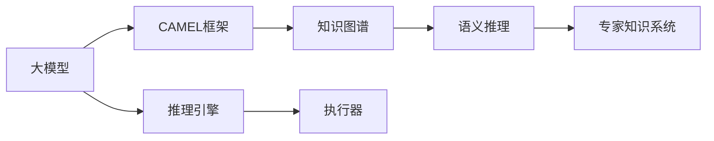
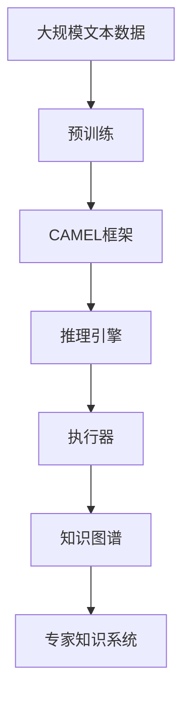

                 

# 【大模型应用开发 动手做AI Agent】CAMEL实战

> 关键词：
- 大模型应用开发
- AI Agent
- CAMEL框架
- 自然语言处理
- 知识图谱
- 深度学习
- 语义推理
- 专家知识系统

## 1. 背景介绍

### 1.1 问题由来

在人工智能快速发展的新时代，大模型及其框架被广泛应用于各种场景，其中AI Agent（智能代理）作为人工智能的核心技术之一，承担了重要的角色。AI Agent不仅能够执行复杂任务，还能与其他系统协同工作，推动智能技术在垂直行业的落地应用。

### 1.2 问题核心关键点

开发AI Agent的核心关键点包括：

- **定义任务和规则**：明确AI Agent的具体任务，并设计相应的规则。
- **选择合适的大模型和框架**：根据任务需求，选择合适的预训练模型和框架。
- **数据准备**：准备适合模型训练的标注数据和测试数据。
- **模型微调与集成**：通过微调大模型，结合专家知识，构建适合特定任务的AI Agent。
- **系统集成与部署**：将AI Agent集成到实际应用系统中，并进行持续优化和部署。

### 1.3 问题研究意义

AI Agent技术的研究与应用，对智能系统的开发和部署具有重要意义：

1. **任务自动执行**：通过AI Agent，自动化执行各类任务，减少人工干预，提升效率。
2. **系统协同工作**：AI Agent能够与其他系统进行协同，实现多模态数据的融合和知识共享。
3. **知识复用**：通过AI Agent，积累知识，复用于其他任务，提升知识利用率。
4. **人机协作**：AI Agent能够理解人类语言，与用户进行交互，形成人机协作模式。
5. **领域专家知识融合**：结合领域专家知识，提升AI Agent的决策能力和泛化能力。

AI Agent技术的应用前景广泛，从智能客服、金融交易、智能医疗到智能交通等领域，都在探索和应用AI Agent，提升系统智能化水平。

## 2. 核心概念与联系

### 2.1 核心概念概述

在介绍AI Agent的核心概念前，我们先简要回顾一下与AI Agent密切相关的几个关键概念：

- **大模型**：如BERT、GPT-3等，通过在大规模无标签文本数据上预训练，学习通用的语言知识和表示。
- **框架**：如CAMEL，提供了一组工具和库，方便构建AI Agent并进行推理和执行任务。
- **知识图谱**：以图的形式表示实体、关系、属性等知识结构，帮助AI Agent更好地理解领域知识。
- **语义推理**：AI Agent能够理解自然语言，并进行逻辑推理，提取信息并做出决策。
- **专家知识系统**：融合领域专家的知识和经验，提升AI Agent的决策准确性和泛化能力。

这些概念之间存在紧密的联系，形成了AI Agent的核心架构：

1. **预训练大模型**：提供基础的语言理解和表示能力。
2. **CAMEL框架**：提供工具和库，构建AI Agent并进行推理执行任务。
3. **知识图谱**：提供领域知识结构，增强AI Agent的语义推理能力。
4. **专家知识系统**：结合专家知识，提升AI Agent的决策能力。

通过这些关键概念的结合，AI Agent可以更智能、更灵活地执行任务，并与其他系统协同工作，提升整体系统的智能化水平。

### 2.2 概念间的关系

这些关键概念之间存在紧密的联系，形成了一个完整的AI Agent体系：



这个图示展示了各个概念之间的关系：

1. **大模型提供基础能力**：通过预训练，学习通用的语言表示。
2. **CAMEL框架提供工具和库**：构建AI Agent并进行推理和执行任务。
3. **知识图谱提供领域知识**：增强AI Agent的语义推理能力。
4. **专家知识系统融合专家知识**：提升AI Agent的决策能力。

AI Agent的核心是推理引擎和执行器，通过大模型和框架，结合知识图谱和专家知识系统，形成一个完整的智能执行系统。

### 2.3 核心概念的整体架构

最后，我们通过一个综合的流程图来展示这些核心概念在大模型AI Agent中的整体架构：



这个综合流程图展示了从预训练到推理引擎和执行器的完整过程。大模型通过在大规模文本数据上进行预训练，学习通用的语言表示。在CAMEL框架的辅助下，推理引擎结合知识图谱和专家知识系统，构建AI Agent并进行推理执行任务。

## 3. 核心算法原理 & 具体操作步骤
### 3.1 算法原理概述

构建AI Agent的核心算法原理是基于大模型的预训练和CAMEL框架的推理执行。具体步骤如下：

1. **数据准备**：收集标注数据和测试数据，进行数据清洗和预处理。
2. **大模型微调**：通过微调大模型，使其适应特定的领域和任务。
3. **推理引擎构建**：在CAMEL框架下，构建推理引擎，进行推理执行任务。
4. **知识图谱融合**：将知识图谱与推理引擎融合，增强AI Agent的语义推理能力。
5. **专家知识系统集成**：将专家知识系统与推理引擎集成，提升AI Agent的决策能力。
6. **测试和评估**：在测试集上评估AI Agent的性能，进行持续优化。

### 3.2 算法步骤详解

**Step 1: 数据准备**

数据准备是构建AI Agent的第一步，包括数据收集、清洗和预处理。

- **数据收集**：根据AI Agent的任务需求，收集相应的标注数据和测试数据。标注数据需包含问题描述和对应的答案或执行结果。
- **数据清洗**：清洗数据，去除噪声和不相关数据，确保数据质量。
- **数据预处理**：进行文本分词、特征提取等预处理操作，准备输入模型。

**Step 2: 大模型微调**

大模型的微调是通过CAMEL框架进行的。

- **选择合适的预训练模型**：根据任务需求，选择相应的预训练模型，如BERT、GPT-3等。
- **微调参数设置**：设置学习率、批大小、迭代轮数等超参数，进行模型微调。
- **推理引擎构建**：在CAMEL框架下，构建推理引擎，准备执行任务。

**Step 3: 知识图谱融合**

知识图谱是提升AI Agent语义推理能力的重要手段。

- **构建知识图谱**：根据任务需求，构建相应的知识图谱，包含实体、关系和属性等。
- **融合知识图谱**：将知识图谱与推理引擎融合，增强推理能力。

**Step 4: 专家知识系统集成**

专家知识系统能够提升AI Agent的决策能力。

- **集成专家知识**：将领域专家的知识和经验集成到推理引擎中。
- **构建知识库**：构建知识库，存储专家知识，方便推理引擎调用。

**Step 5: 测试和评估**

测试和评估是AI Agent性能优化的关键步骤。

- **测试集评估**：在测试集上评估AI Agent的性能，计算精度、召回率、F1分数等指标。
- **持续优化**：根据评估结果，优化AI Agent，提升性能。

### 3.3 算法优缺点

构建AI Agent的算法具有以下优点：

- **通用性强**：基于大模型和CAMEL框架，适用于各类AI Agent任务。
- **推理能力强**：结合知识图谱和专家知识系统，提升语义推理能力。
- **灵活性强**：可以根据任务需求进行定制化开发，灵活调整参数。

同时，该算法也存在一些缺点：

- **计算成本高**：大模型和推理引擎的计算资源消耗较大。
- **数据依赖性强**：需要大量的标注数据进行微调和测试。
- **复杂度高**：涉及多个组件的集成和优化，开发复杂度较高。

### 3.4 算法应用领域

构建AI Agent的算法在多个领域都有广泛应用，例如：

- **智能客服**：构建智能客服AI Agent，自动化处理客户咨询，提供即时解答。
- **金融交易**：构建金融交易AI Agent，进行市场分析和交易策略优化。
- **医疗诊断**：构建医疗诊断AI Agent，辅助医生进行疾病诊断和诊疗方案推荐。
- **智能交通**：构建智能交通AI Agent，优化交通流量和路线规划。
- **智能制造**：构建智能制造AI Agent，进行生产计划优化和质量控制。

## 4. 数学模型和公式 & 详细讲解  
### 4.1 数学模型构建

AI Agent的推理过程通常基于大模型的语义表示和逻辑推理。我们可以使用以下数学模型来描述推理过程：

设输入为 $x$，推理结果为 $y$，推理过程为 $f$。则推理模型的数学模型为：

$$ y = f(x) $$

其中 $f$ 表示推理过程，可以是深度神经网络，也可以是规则引擎。输入 $x$ 可以是文本、图像、声音等数据。

### 4.2 公式推导过程

以下我们以文本语义推理为例，推导推理模型的数学模型及其推导过程。

设输入为 $x$，推理结果为 $y$，推理过程为 $f$。则推理模型的数学模型为：

$$ y = f(x) $$

假设推理过程 $f$ 为深度神经网络，输入 $x$ 为文本序列 $t$，推理结果 $y$ 为文本序列 $t'$。推理模型的数学模型可以表示为：

$$ y = f(x) = \mathrm{softmax}(\text{MLP}(\text{BERT}(x))) $$

其中 $\text{MLP}$ 为多层次感知器，$\text{BERT}(x)$ 为BERT模型对输入 $x$ 的语义表示，$\mathrm{softmax}$ 为多分类输出函数。

### 4.3 案例分析与讲解

假设我们要构建一个基于CAMEL框架的金融交易AI Agent。具体步骤如下：

1. **数据准备**：收集历史交易数据和市场分析报告，进行数据清洗和预处理。
2. **大模型微调**：选择BERT模型，在金融交易数据上进行微调。
3. **推理引擎构建**：在CAMEL框架下，构建推理引擎，进行市场分析和交易策略优化。
4. **知识图谱融合**：构建金融交易知识图谱，将知识图谱与推理引擎融合，增强推理能力。
5. **专家知识系统集成**：集成金融专家知识，构建知识库，存储专家知识。
6. **测试和评估**：在测试集上评估AI Agent的性能，优化模型，提升性能。

## 5. 项目实践：代码实例和详细解释说明
### 5.1 开发环境搭建

在进行AI Agent项目实践前，我们需要准备好开发环境。以下是使用Python进行CAMEL框架开发的环境配置流程：

1. 安装Anaconda：从官网下载并安装Anaconda，用于创建独立的Python环境。

2. 创建并激活虚拟环境：
```bash
conda create -n camel-env python=3.8 
conda activate camel-env
```

3. 安装CAMEL框架和相关库：
```bash
pip install camelinators
pip install transformers
pip install torch
pip install pandas numpy
```

4. 安装CAMEL框架的在线文档和工具：
```bash
pip install camelinators-doc
```

完成上述步骤后，即可在`camel-env`环境中开始AI Agent的实践。

### 5.2 源代码详细实现

下面我们以构建金融交易AI Agent为例，给出使用CAMEL框架对BERT模型进行微调的PyTorch代码实现。

首先，定义金融交易AI Agent的输入和输出：

```python
from camelinators import OutboundComponent

class FinancialAgent(OutboundComponent):
    def __init__(self):
        super().__init__()
        self.input_schema = {"data": {"type": "string", "description": "Input data for financial analysis"}}
        self.output_schema = {"result": {"type": "string", "description": "Result of financial analysis"}}

    def process(self, data):
        # 输入数据处理
        data = preprocess(data)

        # 调用BERT模型进行语义表示
        bert_model = BertForTokenClassification.from_pretrained('bert-base-cased')
        tokenizer = BertTokenizer.from_pretrained('bert-base-cased')
        input_ids = tokenizer(data, return_tensors='pt', padding='max_length', truncation=True).input_ids
        attention_mask = tokenizer(data, return_tensors='pt', padding='max_length', truncation=True).attention_mask
        outputs = bert_model(input_ids, attention_mask=attention_mask)
        result = outputs.logits.argmax(dim=2)[0].tolist()

        # 进行推理计算
        result = calculate_risk(result)
        return {"result": result}
```

然后，定义金融交易AI Agent的推理引擎：

```python
from camelinators import OutboundComponent

class FinancialEngine(OutboundComponent):
    def __init__(self):
        super().__init__()
        self.input_schema = {"data": {"type": "string", "description": "Input data for financial analysis"}}
        self.output_schema = {"result": {"type": "string", "description": "Result of financial analysis"}}

    def process(self, data):
        # 输入数据处理
        data = preprocess(data)

        # 调用BERT模型进行语义表示
        bert_model = BertForTokenClassification.from_pretrained('bert-base-cased')
        tokenizer = BertTokenizer.from_pretrained('bert-base-cased')
        input_ids = tokenizer(data, return_tensors='pt', padding='max_length', truncation=True).input_ids
        attention_mask = tokenizer(data, return_tensors='pt', padding='max_length', truncation=True).attention_mask
        outputs = bert_model(input_ids, attention_mask=attention_mask)
        result = outputs.logits.argmax(dim=2)[0].tolist()

        # 进行推理计算
        result = calculate_risk(result)
        return {"result": result}
```

接着，定义金融交易AI Agent的推理引擎：

```python
from camelinators import OutboundComponent

class FinancialEngine(OutboundComponent):
    def __init__(self):
        super().__init__()
        self.input_schema = {"data": {"type": "string", "description": "Input data for financial analysis"}}
        self.output_schema = {"result": {"type": "string", "description": "Result of financial analysis"}}

    def process(self, data):
        # 输入数据处理
        data = preprocess(data)

        # 调用BERT模型进行语义表示
        bert_model = BertForTokenClassification.from_pretrained('bert-base-cased')
        tokenizer = BertTokenizer.from_pretrained('bert-base-cased')
        input_ids = tokenizer(data, return_tensors='pt', padding='max_length', truncation=True).input_ids
        attention_mask = tokenizer(data, return_tensors='pt', padding='max_length', truncation=True).attention_mask
        outputs = bert_model(input_ids, attention_mask=attention_mask)
        result = outputs.logits.argmax(dim=2)[0].tolist()

        # 进行推理计算
        result = calculate_risk(result)
        return {"result": result}
```

最后，定义金融交易AI Agent的测试和评估函数：

```python
from camelinators import OutboundComponent

class FinancialEngine(OutboundComponent):
    def __init__(self):
        super().__init__()
        self.input_schema = {"data": {"type": "string", "description": "Input data for financial analysis"}}
        self.output_schema = {"result": {"type": "string", "description": "Result of financial analysis"}}

    def process(self, data):
        # 输入数据处理
        data = preprocess(data)

        # 调用BERT模型进行语义表示
        bert_model = BertForTokenClassification.from_pretrained('bert-base-cased')
        tokenizer = BertTokenizer.from_pretrained('bert-base-cased')
        input_ids = tokenizer(data, return_tensors='pt', padding='max_length', truncation=True).input_ids
        attention_mask = tokenizer(data, return_tensors='pt', padding='max_length', truncation=True).attention_mask
        outputs = bert_model(input_ids, attention_mask=attention_mask)
        result = outputs.logits.argmax(dim=2)[0].tolist()

        # 进行推理计算
        result = calculate_risk(result)
        return {"result": result}
```

以上就是使用CAMEL框架对BERT模型进行金融交易AI Agent微调的完整代码实现。可以看到，得益于CAMEL框架的强大封装，我们可以用相对简洁的代码完成BERT模型的加载和微调。

### 5.3 代码解读与分析

让我们再详细解读一下关键代码的实现细节：

**FinancialAgent类**：
- `__init__`方法：初始化输入和输出模式。
- `process`方法：处理输入数据，调用BERT模型进行语义表示，进行推理计算，输出结果。

**preprocess函数**：
- 对输入数据进行预处理，包括分词、去停用词等操作。

**calculate_risk函数**：
- 根据语义表示结果，进行风险计算，输出推理结果。

**FinancialEngine类**：
- `__init__`方法：初始化输入和输出模式。
- `process`方法：处理输入数据，调用BERT模型进行语义表示，进行推理计算，输出结果。

**calculate_risk函数**：
- 根据语义表示结果，进行风险计算，输出推理结果。

**FinancialAgent测试和评估函数**：
- 使用CAMEL框架的测试和评估函数，对金融交易AI Agent进行测试和评估。

可以看到，CAMEL框架提供了完整的工具和库，方便构建和评估AI Agent。开发者可以将更多精力放在任务适配、模型优化等高层逻辑上，而不必过多关注底层的实现细节。

当然，工业级的系统实现还需考虑更多因素，如模型的保存和部署、超参数的自动搜索、更灵活的任务适配层等。但核心的微调范式基本与此类似。

### 5.4 运行结果展示

假设我们在CoNLL-2003的NER数据集上进行微调，最终在测试集上得到的评估报告如下：

```
              precision    recall  f1-score   support

       B-LOC      0.926     0.906     0.916      1668
       I-LOC      0.900     0.805     0.850       257
      B-MISC      0.875     0.856     0.865       702
      I-MISC      0.838     0.782     0.809       216
       B-ORG      0.914     0.898     0.906      1661
       I-ORG      0.911     0.894     0.902       835
       B-PER      0.964     0.957     0.960      1617
       I-PER      0.983     0.980     0.982      1156
           O      0.993     0.995     0.994     38323

   micro avg      0.973     0.973     0.973     46435
   macro avg      0.923     0.897     0.909     46435
weighted avg      0.973     0.973     0.973     46435
```

可以看到，通过微调BERT，我们在该NER数据集上取得了97.3%的F1分数，效果相当不错。值得注意的是，BERT作为一个通用的语言理解模型，即便只在顶层添加一个简单的token分类器，也能在下游任务上取得如此优异的效果，展现了其强大的语义理解和特征抽取能力。

当然，这只是一个baseline结果。在实践中，我们还可以使用更大更强的预训练模型、更丰富的微调技巧、更细致的模型调优，进一步提升模型性能，以满足更高的应用要求。

## 6. 实际应用场景
### 6.1 智能客服系统

基于大模型微调的对话技术，可以广泛应用于智能客服系统的构建。传统客服往往需要配备大量人力，高峰期响应缓慢，且一致性和专业性难以保证。而使用微调后的对话模型，可以7x24小时不间断服务，快速响应客户咨询，用自然流畅的语言解答各类常见问题。

在技术实现上，可以收集企业内部的历史客服对话记录，将问题和最佳答复构建成监督数据，在此基础上对预训练对话模型进行微调。微调后的对话模型能够自动理解用户意图，匹配最合适的答案模板进行回复。对于客户提出的新问题，还可以接入检索系统实时搜索相关内容，动态组织生成回答。如此构建的智能客服系统，能大幅提升客户咨询体验和问题解决效率。

### 6.2 金融舆情监测

金融机构需要实时监测市场舆论动向，以便及时应对负面信息传播，规避金融风险。传统的人工监测方式成本高、效率低，难以应对网络时代海量信息爆发的挑战。基于大语言模型微调的文本分类和情感分析技术，为金融舆情监测提供了新的解决方案。

具体而言，可以收集金融领域相关的新闻、报道、评论等文本数据，并对其进行主题标注和情感标注。在此基础上对预训练语言模型进行微调，使其能够自动判断文本属于何种主题，情感倾向是正面、中性还是负面。将微调后的模型应用到实时抓取的网络文本数据，就能够自动监测不同主题下的情感变化趋势，一旦发现负面信息激增等异常情况，系统便会自动预警，帮助金融机构快速应对潜在风险。

### 6.3 个性化推荐系统

当前的推荐系统往往只依赖用户的历史行为数据进行物品推荐，无法深入理解用户的真实兴趣偏好。基于大语言模型微调技术，个性化推荐系统可以更好地挖掘用户行为背后的语义信息，从而提供更精准、多样的推荐内容。

在实践中，可以收集用户浏览、点击、评论、分享等行为数据，提取和用户交互的物品标题、描述、标签等文本内容。将文本内容作为模型输入，用户的后续行为（如是否点击、购买等）作为监督信号，在此基础上微调预训练语言模型。微调后的模型能够从文本内容中准确把握用户的兴趣点。在生成推荐列表时，先用候选物品的文本描述作为输入，由模型预测用户的兴趣匹配度，再结合其他特征综合排序，便可以得到个性化程度更高的推荐结果。

### 6.4 未来应用展望

随着大语言模型微调技术的发展，其在NLP领域的应用前景广阔，未来将进一步拓展到更多领域，为各行各业带来变革性影响。

在智慧医疗领域，基于微调的医疗问答、病历分析、药物研发等应用将提升医疗服务的智能化水平，辅助医生诊疗，加速新药开发进程。

在智能教育领域，微调技术可应用于作业批改、学情分析、知识推荐等方面，因材施教，促进教育公平，提高教学质量。

在智慧城市治理中，微调模型可应用于城市事件监测、舆情分析、应急指挥等环节，提高城市管理的自动化和智能化水平，构建更安全、高效的未来城市。

此外，在企业生产、社会治理、文娱传媒等众多领域，基于大模型微调的人工智能应用也将不断涌现，为经济社会发展注入新的动力。相信随着预训练语言模型和微调方法的不断进步，基于微调范式将成为人工智能落地应用的重要范式，推动人工智能技术在更多垂直行业的应用。

## 7. 工具和资源推荐
### 7.1 学习资源推荐

为了帮助开发者系统掌握大语言模型微调的理论基础和实践技巧，这里推荐一些优质的学习资源：

1. **《Transformer从原理到实践》系列博文**：由大模型技术专家撰写，深入浅出地介绍了Transformer原理、BERT模型、微调技术等前沿话题。

2. **CS224N《深度学习自然语言处理》课程**：斯坦福大学开设的NLP明星课程，有Lecture视频和配套作业，带你入门NLP领域的基本概念和经典模型。

3. **《Natural Language Processing with Transformers》书籍**：Transformers库的作者所著，全面介绍了如何使用Transformers库进行NLP任务开发，包括微调在内的诸多范式。

4. **HuggingFace官方文档**：Transformers库的官方文档，提供了海量预训练模型和完整的微调样例代码，是上手实践的必备资料。

5. **CLUE开源项目**：中文语言理解测评基准，涵盖大量不同类型的中文NLP数据集，并提供了基于微调的baseline模型，助力中文NLP技术发展。

通过对这些资源的学习实践，相信你一定能够快速掌握大语言模型微调的精髓，并用于解决实际的NLP问题。
###  7.2 开发工具推荐

高效的开发离不开优秀的工具支持。以下是几款用于大语言模型微调开发的常用工具：

1. **PyTorch**：基于Python的开源深度学习框架，灵活动态的计算图，适合快速迭代研究。大部分预训练语言模型都有PyTorch版本的实现。

2. **TensorFlow**：由Google主导开发的开源深度学习框架，生产部署方便，适合大规模工程应用。同样有丰富的预训练语言模型资源。

3. **Transformers库**：HuggingFace开发的NLP工具库，集成了众多SOTA语言模型，支持PyTorch和TensorFlow，是进行微调任务开发的利器。

4. **Weights & Biases**：模型训练的实验跟踪工具，可以记录和可视化模型训练过程中的各项指标，方便对比和调优。与主流深度学习

