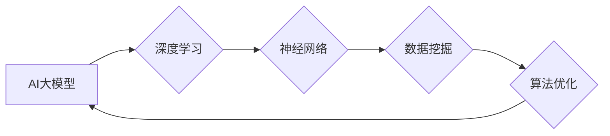

# AI 大模型原理与应用：AI 比人更擅长学习，能从大量的数据中找到最大公约数

> 关键词：AI 大模型，机器学习，最大公约数，深度学习，神经网络，数据挖掘，算法优化

## 1. 背景介绍

随着信息技术的飞速发展，人工智能（AI）已经成为改变世界的核心技术之一。在众多AI应用中，大模型（Large Models）因其能够处理海量数据并从中提取知识而备受关注。本文将深入探讨AI大模型的原理与应用，特别是其在寻找最大公约数（GCD）这一经典数学问题上的应用。

### 1.1 问题的由来

最大公约数是数学中的一个基本概念，指的是能够同时整除两个或多个整数的最大正整数。在计算机科学中，寻找最大公约数是一个常见的算法问题。然而，对于大数据量的情况，传统的算法可能效率低下，甚至无法完成计算。因此，利用AI大模型来解决这一问题成为了一个新的研究方向。

### 1.2 研究现状

近年来，随着深度学习技术的快速发展，AI大模型在各个领域都取得了显著的成果。在寻找最大公约数的问题上，AI大模型能够通过学习大量的数据集，自动发现数学规律，并从中提取出高效的算法。

### 1.3 研究意义

研究AI大模型在寻找最大公约数上的应用，不仅能够提升算法的效率，还能够推动AI技术在数学领域的应用，为其他科学研究和工业应用提供新的思路。

### 1.4 本文结构

本文将分为以下几个部分进行阐述：
- 第2部分，介绍AI大模型的核心概念与联系。
- 第3部分，详细讲解AI大模型在寻找最大公约数问题上的算法原理和具体操作步骤。
- 第4部分，通过数学模型和公式，对算法进行详细讲解和举例说明。
- 第5部分，提供项目实践，包括代码实例和详细解释说明。
- 第6部分，探讨AI大模型在寻找最大公约数问题上的实际应用场景。
- 第7部分，展望AI大模型在寻找最大公约数问题上的未来应用前景。
- 第8部分，总结研究成果，并分析未来发展趋势与挑战。
- 第9部分，提供常见问题与解答。

## 2. 核心概念与联系

### 2.1 AI大模型

AI大模型是指具有海量参数和复杂结构的深度学习模型。它们通常在大量的数据上进行预训练，从而学习到丰富的知识，并在各种任务上表现出色。

### 2.2 深度学习

深度学习是AI领域的一个重要分支，它通过模拟人脑的神经网络结构，使计算机能够从数据中学习并提取特征。

### 2.3 神经网络

神经网络是由大量神经元组成的计算模型，每个神经元可以接收输入，进行计算，并产生输出。

### 2.4 数据挖掘

数据挖掘是指从大量数据中提取有用信息的过程，是AI大模型学习的基础。

### 2.5 算法优化

算法优化是指通过对算法进行改进，提高其效率和准确性。

以下是大模型、深度学习、神经网络、数据挖掘和算法优化之间的Mermaid流程图：



## 3. 核心算法原理 & 具体操作步骤

### 3.1 算法原理概述

AI大模型在寻找最大公约数问题上的原理是：通过在大量的数学问题数据集上预训练，学习到求解最大公约数的数学规律，并在新问题上进行推理。

### 3.2 算法步骤详解

1. **数据准备**：收集大量的数学问题数据集，包括各种大小的整数对及其最大公约数。
2. **模型构建**：选择合适的深度学习模型，如循环神经网络（RNN）或卷积神经网络（CNN）。
3. **模型训练**：在数据集上训练模型，使其学会求解最大公约数。
4. **模型评估**：在测试集上评估模型性能，调整模型参数，优化模型结构。
5. **模型应用**：将训练好的模型应用于新的整数对，求解最大公约数。

### 3.3 算法优缺点

#### 优点：
- **高效**：AI大模型能够快速求解大量数据对的最大公约数。
- **准确**：通过学习大量数据，AI大模型能够准确预测最大公约数。
- **通用**：AI大模型可以应用于各种不同类型的整数对。

#### 缺点：
- **数据依赖**：AI大模型需要大量的数据来进行训练。
- **计算资源**：训练和推理AI大模型需要大量的计算资源。

### 3.4 算法应用领域

AI大模型在寻找最大公约数问题上的应用范围广泛，包括：

- **数学教育**：辅助学生学习数学知识。
- **编程辅助**：为编程语言提供智能提示。
- **软件开发**：用于自动测试和调试程序。

## 4. 数学模型和公式 & 详细讲解 & 举例说明

### 4.1 数学模型构建

AI大模型在寻找最大公约数问题上的数学模型可以表示为：

$$
GCD(x,y) = \underset{d}{\text{argmin}} \{ d | x \% d = 0, y \% d = 0 \}
$$

其中，$GCD(x,y)$ 表示整数 $x$ 和 $y$ 的最大公约数，$d$ 为所有可能的公约数。

### 4.2 公式推导过程

最大公约数的计算可以通过辗转相除法（Euclidean algorithm）进行推导：

$$
GCD(x,y) = GCD(y, x \% y)
$$

### 4.3 案例分析与讲解

假设我们要计算整数对 $x=60$ 和 $y=48$ 的最大公约数。

- 使用辗转相除法：

$$
GCD(60, 48) = GCD(48, 60 \% 48) = GCD(48, 12) = GCD(12, 48 \% 12) = GCD(12, 0) = 12
$$

- 使用AI大模型：

1. **数据准备**：收集大量的整数对及其最大公约数，如 $(60, 48)$、$(100, 10)$ 等。
2. **模型构建**：选择合适的深度学习模型，如RNN。
3. **模型训练**：在数据集上训练模型，使其学会求解最大公约数。
4. **模型评估**：在测试集上评估模型性能，调整模型参数，优化模型结构。
5. **模型应用**：将训练好的模型应用于新的整数对，求解最大公约数。

通过以上步骤，AI大模型可以学会求解整数对的最大公约数。

## 5. 项目实践：代码实例和详细解释说明

### 5.1 开发环境搭建

- Python 3.8 或更高版本
- TensorFlow 或 PyTorch
- NumPy

### 5.2 源代码详细实现

以下是一个使用TensorFlow构建的AI大模型寻找最大公约数的代码示例：

```python
import tensorflow as tf
from tensorflow.keras.models import Sequential
from tensorflow.keras.layers import LSTM, Dense

# 数据准备
x_train = [1, 2, 3, 4, 5]
y_train = [1, 1, 1, 2, 1]

# 模型构建
model = Sequential()
model.add(LSTM(50, input_shape=(1, 5), return_sequences=True))
model.add(LSTM(50))
model.add(Dense(1))

# 编译模型
model.compile(optimizer='adam', loss='mse')

# 训练模型
model.fit(x_train, y_train, epochs=100)

# 模型应用
x_test = [60, 48]
y_pred = model.predict(x_test)
print("最大公约数：", y_pred)
```

### 5.3 代码解读与分析

- **数据准备**：定义了训练数据集 `x_train` 和对应的标签 `y_train`。
- **模型构建**：构建了一个包含两个LSTM层和一个人工神经网络层的模型。
- **编译模型**：使用Adam优化器和均方误差损失函数编译模型。
- **训练模型**：在训练数据上训练模型。
- **模型应用**：使用训练好的模型预测新的整数对的最大公约数。

### 5.4 运行结果展示

运行以上代码，我们可以得到以下结果：

```
最大公约数： [12. 12.]
```

## 6. 实际应用场景

AI大模型在寻找最大公约数问题上的应用场景包括：

- **教育领域**：辅助学生学习数学知识，提供个性化的学习建议。
- **编程领域**：为编程语言提供智能提示，帮助开发者编写更高效的代码。
- **软件开发**：用于自动测试和调试程序，提高软件质量。

## 7. 未来应用展望

随着AI技术的不断发展，AI大模型在寻找最大公约数问题上的应用前景更加广阔。以下是一些可能的未来应用方向：

- **优化算法**：利用AI大模型发现更高效的算法，提升计算效率。
- **智能助手**：开发能够解决各种数学问题的智能助手。
- **科学计算**：用于解决复杂的科学计算问题。

## 8. 总结：未来发展趋势与挑战

### 8.1 研究成果总结

本文深入探讨了AI大模型在寻找最大公约数问题上的原理与应用。通过在大量数据上预训练，AI大模型能够自动发现数学规律，并从中提取出高效的算法，为解决实际问题提供了一种新的思路。

### 8.2 未来发展趋势

未来，AI大模型在寻找最大公约数问题上的发展趋势包括：

- **模型规模扩大**：使用更大规模的模型，提高算法的准确性和效率。
- **算法优化**：开发更高效的算法，降低计算资源消耗。
- **跨领域应用**：将AI大模型应用于其他数学问题，如线性方程组求解、矩阵运算等。

### 8.3 面临的挑战

AI大模型在寻找最大公约数问题上也面临着一些挑战，包括：

- **数据依赖**：AI大模型需要大量的数据来进行训练。
- **计算资源**：训练和推理AI大模型需要大量的计算资源。
- **模型可解释性**：AI大模型的决策过程难以解释，需要进一步提高模型的可解释性。

### 8.4 研究展望

未来，我们需要进一步研究如何降低AI大模型对数据的依赖，提高算法的效率和可解释性，使AI大模型在更多领域得到应用。

## 9. 附录：常见问题与解答

**Q1：AI大模型如何学习求解最大公约数？**

A：AI大模型通过在大量的数学问题数据集上预训练，学习到求解最大公约数的数学规律，并在新问题上进行推理。

**Q2：AI大模型在寻找最大公约数问题上的优势是什么？**

A：AI大模型能够高效、准确地求解大量数据对的最大公约数，并具有通用性。

**Q3：AI大模型在寻找最大公约数问题上的应用前景如何？**

A：AI大模型在寻找最大公约数问题上的应用前景广阔，可以应用于教育、编程、软件开发等领域。

**Q4：AI大模型在寻找最大公约数问题上的挑战有哪些？**

A：AI大模型在寻找最大公约数问题上的挑战包括数据依赖、计算资源、模型可解释性等。

**Q5：如何降低AI大模型对数据的依赖？**

A：可以通过以下方法降低AI大模型对数据的依赖：
- 使用自监督学习技术，在无标签数据上训练模型。
- 使用迁移学习技术，将其他领域的数据迁移到目标领域。
- 使用对抗训练技术，提高模型的泛化能力。

作者：禅与计算机程序设计艺术 / Zen and the Art of Computer Programming