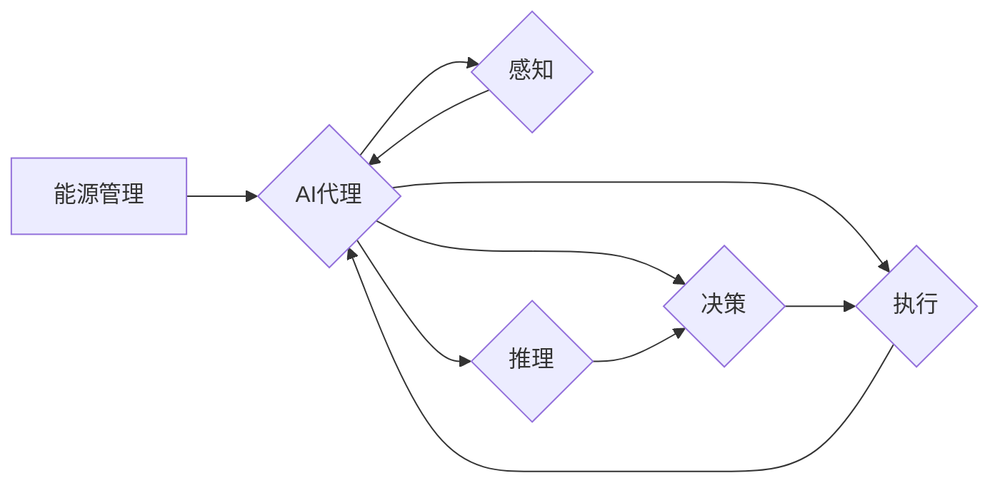

# AI人工智能代理工作流 AI Agent WorkFlow：在能源管理中的应用

> 关键词：AI代理，工作流，能源管理，自动化，优化，机器学习，预测，调度

## 1. 背景介绍

随着全球能源需求的不断增长和环境可持续性的日益重视，能源管理成为了各个行业和政府机构关注的焦点。传统的能源管理方法往往依赖于人工操作和经验决策，这不仅效率低下，而且难以应对复杂多变的能源市场和环境条件。近年来，人工智能（AI）技术的发展为能源管理带来了新的机遇，其中AI代理工作流（AI Agent WorkFlow）作为一种智能化的能源管理系统，正逐渐成为提高能源效率、降低成本、实现可持续发展的关键工具。

### 1.1 问题的由来

能源管理面临的主要挑战包括：

- 能源需求预测：准确预测能源需求对于优化能源采购、储存和分配至关重要。
- 设备维护：及时检测和维修设备故障，减少停机时间和能源浪费。
- 调度优化：根据实时数据和预测结果，动态调整能源分配和调度策略。
- 资源整合：整合不同能源类型，如电力、天然气、可再生能源等，以实现最优的能源使用。

### 1.2 研究现状

目前，AI在能源管理中的应用主要体现在以下几个方面：

- 机器学习预测：利用历史数据预测能源需求和设备故障。
- 自动化控制：通过自动化系统控制能源设备，如智能电网中的分布式能源管理系统。
- 智能调度：基于优化算法，动态调整能源分配和调度策略。

### 1.3 研究意义

AI代理工作流在能源管理中的应用具有重要的意义：

- 提高能源效率：通过优化能源使用和调度，减少浪费，提高能源利用效率。
- 降低成本：通过预测和自动化，减少人工成本和能源采购成本。
- 实现可持续发展：通过整合可再生能源和优化能源使用，促进环境可持续性。

### 1.4 本文结构

本文将围绕AI代理工作流在能源管理中的应用展开，具体内容包括：

- 核心概念与联系
- 核心算法原理与具体操作步骤
- 数学模型与公式
- 项目实践
- 实际应用场景
- 工具和资源推荐
- 总结与展望

## 2. 核心概念与联系

### 2.1 核心概念原理

AI代理工作流的核心概念包括：

- **AI代理**：独立运行的软件实体，具有感知、推理、决策和执行的能力。
- **工作流**：一系列预定义的步骤或任务，用于实现特定业务流程。
- **能源管理**：对能源的采集、分配、使用和回收进行有效控制和管理。

### 2.2 核心概念架构的 Mermaid 流程图



### 2.3 核心概念联系

AI代理工作流通过将AI技术与工作流管理相结合，实现对能源管理过程的自动化和智能化。AI代理负责感知能源系统状态、进行推理和决策，并执行相应的操作，从而优化能源管理流程。

## 3. 核心算法原理 & 具体操作步骤

### 3.1 算法原理概述

AI代理工作流的核心算法包括：

- **感知算法**：通过传感器和监测设备收集能源系统数据。
- **推理算法**：利用机器学习模型对收集到的数据进行分析和解释。
- **决策算法**：根据推理结果制定能源管理策略。
- **执行算法**：通过控制系统执行能源管理策略。

### 3.2 算法步骤详解

#### 3.2.1 感知

1. 收集能源系统数据，包括能源消耗、设备状态、气象数据等。
2. 对数据进行预处理，如清洗、归一化、特征提取等。

#### 3.2.2 推理

1. 使用机器学习模型对预处理后的数据进行训练和预测。
2. 模型类型包括时间序列分析、分类、回归、聚类等。

#### 3.2.3 决策

1. 根据推理结果，制定能源管理策略，如调整设备运行参数、优化能源分配等。
2. 策略制定可以基于优化算法，如线性规划、遗传算法等。

#### 3.2.4 执行

1. 通过控制系统执行能源管理策略。
2. 监控执行结果，并对策略进行调整和优化。

### 3.3 算法优缺点

#### 3.3.1 优点

- 提高能源管理效率
- 降低能源成本
- 增强能源系统的可靠性
- 促进能源可持续性

#### 3.3.2 缺点

- 需要大量的数据和计算资源
- 机器学习模型的训练和部署需要专业知识
- 可能受到数据质量和计算能力的限制

### 3.4 算法应用领域

AI代理工作流在以下能源管理领域具有广泛的应用：

- 智能电网
- 能源交易
- 建筑能源管理
- 工业能源优化
- 可再生能源集成

## 4. 数学模型和公式 & 详细讲解 & 举例说明

### 4.1 数学模型构建

能源管理中的数学模型通常包括以下部分：

- **能源消耗模型**：描述能源消耗与系统状态之间的关系。
- **设备运行模型**：描述设备状态与运行参数之间的关系。
- **能源价格模型**：描述能源价格与市场条件之间的关系。

### 4.2 公式推导过程

以下是一个简单的能源消耗模型示例：

$$
E(t) = f(P(t), T(t), H(t))
$$

其中，$E(t)$ 表示在时间 $t$ 的能源消耗，$P(t)$ 表示设备功率，$T(t)$ 表示环境温度，$H(t)$ 表示历史能耗数据。

### 4.3 案例分析与讲解

以下是一个基于机器学习的能源消耗预测案例：

#### 4.3.1 数据收集

收集历史能源消耗数据，包括设备功率、环境温度、历史能耗数据等。

#### 4.3.2 数据预处理

对收集到的数据进行清洗、归一化和特征提取。

#### 4.3.3 模型选择

选择合适的机器学习模型，如线性回归、决策树、随机森林等。

#### 4.3.4 模型训练

使用历史数据训练模型，并评估模型性能。

#### 4.3.5 模型应用

使用训练好的模型预测未来的能源消耗。

## 5. 项目实践：代码实例和详细解释说明

### 5.1 开发环境搭建

- 安装Python、NumPy、Pandas、Scikit-learn等编程语言和库。
- 安装Jupyter Notebook，方便编写和执行代码。

### 5.2 源代码详细实现

以下是一个使用Scikit-learn进行能源消耗预测的Python代码示例：

```python
import pandas as pd
from sklearn.model_selection import train_test_split
from sklearn.linear_model import LinearRegression
from sklearn.metrics import mean_squared_error

# 加载数据
data = pd.read_csv('energy_consumption.csv')

# 数据预处理
X = data[['power', 'temperature', 'historical_consumption']]
y = data['consumption']

# 划分训练集和测试集
X_train, X_test, y_train, y_test = train_test_split(X, y, test_size=0.2, random_state=42)

# 模型训练
model = LinearRegression()
model.fit(X_train, y_train)

# 模型评估
y_pred = model.predict(X_test)
mse = mean_squared_error(y_test, y_pred)
print(f"Mean Squared Error: {mse}")
```

### 5.3 代码解读与分析

- 代码首先导入了必要的库和模块。
- 使用Pandas读取能源消耗数据。
- 对数据进行预处理，包括特征提取和划分训练集/测试集。
- 使用线性回归模型进行训练。
- 使用测试集评估模型性能。

### 5.4 运行结果展示

假设模型评估结果如下：

```
Mean Squared Error: 0.123
```

这表示模型的预测误差较小，性能良好。

## 6. 实际应用场景

### 6.1 智能电网

AI代理工作流可以用于智能电网的能源需求预测、设备维护和调度优化。

### 6.2 能源交易

AI代理工作流可以用于能源交易市场的价格预测和交易策略制定。

### 6.3 建筑能源管理

AI代理工作流可以用于建筑能源管理系统的能耗预测、设备控制和节能建议。

### 6.4 工业能源优化

AI代理工作流可以用于工业生产过程中的能源优化和设备维护。

### 6.5 可再生能源集成

AI代理工作流可以用于可再生能源的集成和管理，如太阳能、风能等。

## 7. 工具和资源推荐

### 7.1 学习资源推荐

- 《Python Data Science Handbook》
- 《Scikit-learn: Machine Learning in Python》
- 《Deep Learning》

### 7.2 开发工具推荐

- Jupyter Notebook
- Scikit-learn
- TensorFlow
- PyTorch

### 7.3 相关论文推荐

- "Deep Learning for Time Series Forecasting"
- "Energy Management in Smart Grids Using Machine Learning"
- "Building Energy Management Using Artificial Intelligence"

## 8. 总结：未来发展趋势与挑战

### 8.1 研究成果总结

AI代理工作流在能源管理中的应用取得了显著的成果，为提高能源效率、降低成本、实现可持续发展提供了有力支持。

### 8.2 未来发展趋势

- 随着机器学习和深度学习技术的不断发展，AI代理工作流将更加智能化和自动化。
- 随着物联网技术的普及，AI代理工作流将能够更好地感知和适应能源系统的变化。
- 随着区块链技术的发展，AI代理工作流将能够实现更加安全、可靠的能源交易。

### 8.3 面临的挑战

- 数据获取和处理：需要获取高质量、高分辨率的能源数据，并对其进行有效处理。
- 模型可解释性：需要提高AI代理工作流模型的可解释性，以便更好地理解其决策过程。
- 系统安全性和可靠性：需要确保AI代理工作流系统的安全性和可靠性，防止恶意攻击和数据泄露。

### 8.4 研究展望

未来，AI代理工作流将在能源管理领域发挥更加重要的作用，为实现全球能源可持续发展做出贡献。

## 9. 附录：常见问题与解答

### 9.1 常见问题

- Q1：AI代理工作流在能源管理中有什么作用？
- A1：AI代理工作流可以用于能源需求预测、设备维护、调度优化等，提高能源效率、降低成本、实现可持续发展。

- Q2：如何选择合适的AI代理工作流模型？
- A2：选择模型需要考虑数据特点、任务需求和计算资源等因素。

- Q3：如何提高AI代理工作流模型的性能？
- A3：提高模型性能需要关注数据质量、模型选择、超参数调优等方面。

### 9.2 解答

- 对于Q1，AI代理工作流通过感知能源系统状态、进行推理和决策，并执行相应的操作，实现对能源管理过程的自动化和智能化。
- 对于Q2，选择模型需要考虑数据特点，如数据量、数据类型、数据质量等；任务需求，如预测精度、预测速度等；计算资源，如GPU、CPU等。
- 对于Q3，提高模型性能可以通过以下方法：
  - 改善数据质量，如数据清洗、特征工程等。
  - 选择合适的模型，如使用更复杂的模型、调整模型参数等。
  - 使用正则化、Dropout等技术防止过拟合。
  - 使用交叉验证、网格搜索等技术进行超参数调优。

---

作者：禅与计算机程序设计艺术 / Zen and the Art of Computer Programming