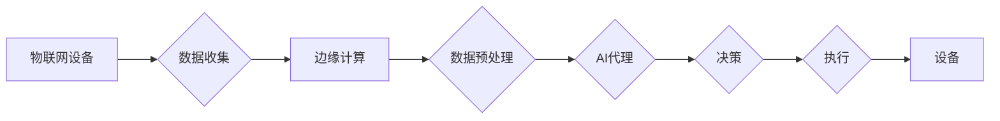

# AI人工智能代理工作流AI Agent WorkFlow：AI代理在物联网场景的应用

> 关键词：AI代理，物联网，工作流，智能设备，自动化，边缘计算，机器学习，人工智能

## 1. 背景介绍

随着物联网（Internet of Things, IoT）技术的飞速发展，智能设备的应用越来越广泛，从智能家居到工业自动化，从智慧城市到农业监测，物联网正在改变我们的生活方式和工作方式。然而，随着设备数量的激增，如何高效地管理这些设备，使其协同工作，成为一个亟待解决的问题。AI人工智能代理（AI Agent）工作流（AI Agent WorkFlow）应运而生，它通过将AI代理与工作流技术相结合，实现了对物联网设备的智能化管理和自动化控制。

### 1.1 物联网的挑战

物联网设备的多样性、数量庞大以及分布式特性，给管理和维护带来了巨大的挑战：

- **设备管理**：如何高效地管理成千上万的设备，包括设备的状态监控、故障诊断和升级等。
- **数据收集**：如何高效地收集来自各个设备的数据，并进行处理和分析。
- **决策制定**：如何根据收集到的数据，快速做出决策，以优化设备运行效率。
- **安全性**：如何保障设备通信的安全性和数据隐私。

### 1.2 AI代理与工作流的结合

AI代理是一种能够自主感知环境、理解环境、做出决策并采取行动的智能实体。工作流是一种描述任务执行流程的规范，它定义了任务执行的顺序、条件和规则。将AI代理与工作流技术相结合，可以有效地解决物联网面临的挑战：

- **自动化决策**：AI代理可以根据工作流规则和设备数据，自动做出决策，无需人工干预。
- **设备协同**：多个AI代理可以协同工作，共同完成任务。
- **动态调整**：工作流可以根据实际情况动态调整，以适应不断变化的环境。

## 2. 核心概念与联系

### 2.1 核心概念

- **AI代理**：具备感知、认知、决策和执行能力的智能实体。
- **工作流**：描述任务执行流程的规范，包括任务的顺序、条件和规则。
- **物联网设备**：通过网络连接的物理设备，能够收集和发送数据。
- **边缘计算**：在数据产生的地方进行处理和分析，以减少延迟和网络负载。

### 2.2 Mermaid流程图



### 2.3 关系与联系

AI代理通过工作流技术，从物联网设备收集数据，经过边缘计算预处理后，进行决策和执行，最终控制物联网设备。

## 3. 核心算法原理 & 具体操作步骤

### 3.1 算法原理概述

AI代理工作流的核心算法包括：

- **感知**：AI代理通过传感器收集物联网设备的数据。
- **认知**：AI代理分析数据，理解环境状态。
- **决策**：AI代理根据工作流规则和数据，做出决策。
- **执行**：AI代理控制物联网设备执行相应的动作。

### 3.2 算法步骤详解

1. **感知**：AI代理通过传感器收集物联网设备的数据，如温度、湿度、光照强度等。
2. **数据预处理**：对收集到的数据进行清洗、转换和标准化，以便后续分析。
3. **认知**：AI代理使用机器学习算法分析预处理后的数据，理解环境状态。
4. **决策**：根据工作流规则和认知结果，AI代理做出决策，如调整设备参数、启动或停止设备等。
5. **执行**：AI代理通过控制接口控制物联网设备执行相应的动作。

### 3.3 算法优缺点

**优点**：

- **自动化**：AI代理工作流可以自动化地管理物联网设备，减少人工干预。
- **高效**：边缘计算可以降低延迟，提高数据处理速度。
- **灵活**：工作流可以灵活地调整，以适应不同的应用场景。

**缺点**：

- **复杂**：AI代理工作流的设计和实施较为复杂。
- **依赖**：AI代理工作流的性能依赖于机器学习算法和物联网设备的稳定性。

### 3.4 算法应用领域

AI代理工作流可以应用于以下领域：

- **智能家居**：控制家电设备的自动化运行，如智能照明、智能安防等。
- **工业自动化**：优化生产流程，提高生产效率。
- **智慧城市**：优化城市资源管理，如交通流量控制、环境监测等。

## 4. 数学模型和公式 & 详细讲解 & 举例说明

### 4.1 数学模型构建

AI代理工作流的数学模型可以基于以下公式：

$$
X = f(W, X_{input})
$$

其中，$X$ 是输出，$W$ 是模型参数，$X_{input}$ 是输入。

### 4.2 公式推导过程

该公式表示输出 $X$ 是由模型参数 $W$ 和输入 $X_{input}$ 决定的。具体推导过程取决于具体的机器学习算法。

### 4.3 案例分析与讲解

以智能家居场景为例，假设AI代理需要根据室内的温度和湿度数据，控制空调的制冷和加热功能。此时，输入 $X_{input}$ 为温度和湿度，输出 $X$ 为空调的制冷功率。AI代理可以使用线性回归模型来构建数学模型：

$$
X = W_0 + W_1 \cdot T + W_2 \cdot H
$$

其中，$T$ 为温度，$H$ 为湿度，$W_0, W_1, W_2$ 为模型参数。

## 5. 项目实践：代码实例和详细解释说明

### 5.1 开发环境搭建

为了演示AI代理工作流，我们将使用Python编写一个简单的智能家居控制程序。

### 5.2 源代码详细实现

```python
import random

# 模拟传感器数据
def get_sensor_data():
    temperature = random.uniform(20, 30)
    humidity = random.uniform(40, 60)
    return temperature, humidity

# 空调控制逻辑
def control_air_conditioner(temperature, humidity):
    if temperature > 25:
        power = 0.8  # 制冷
    elif humidity > 60:
        power = 0.5  # 加热
    else:
        power = 0  # 关闭
    return power

# 模拟AI代理工作流
def ai_agent_workflow():
    temperature, humidity = get_sensor_data()
    power = control_air_conditioner(temperature, humidity)
    print(f"Temperature: {temperature}, Humidity: {humidity}, Air conditioner power: {power}")

# 运行工作流
ai_agent_workflow()
```

### 5.3 代码解读与分析

- `get_sensor_data` 函数模拟从传感器获取温度和湿度数据。
- `control_air_conditioner` 函数根据温度和湿度数据控制空调的制冷、加热或关闭。
- `ai_agent_workflow` 函数模拟AI代理工作流，获取数据、控制空调并打印结果。

### 5.4 运行结果展示

运行上述代码，将输出类似以下结果：

```
Temperature: 22.5, Humidity: 55.2, Air conditioner power: 0.5
```

这表明AI代理根据室内的温度和湿度数据，成功控制了空调的加热功能。

## 6. 实际应用场景

### 6.1 智能家居

AI代理工作流在智能家居中的应用非常广泛，如：

- **智能照明**：根据室内光线强度和用户习惯，自动调节灯光亮度。
- **智能安防**：根据监控视频和传感器数据，自动报警和追踪异常行为。
- **智能温湿度控制**：根据温度和湿度数据，自动调节空调和加湿器。

### 6.2 工业自动化

AI代理工作流在工业自动化中的应用，如：

- **设备监控**：实时监控设备状态，及时发现故障并进行处理。
- **生产线优化**：根据生产数据，优化生产流程，提高生产效率。
- **能源管理**：根据设备运行数据，优化能源使用，降低能源消耗。

### 6.3 智慧城市

AI代理工作流在智慧城市中的应用，如：

- **交通流量控制**：根据交通流量数据，优化红绿灯控制，缓解交通拥堵。
- **环境监测**：实时监测环境数据，及时发现污染源并进行处理。
- **能源管理**：优化城市能源使用，降低能源消耗。

## 7. 工具和资源推荐

### 7.1 学习资源推荐

- 《物联网：从设备到智能》
- 《Python编程：从入门到实践》
- 《机器学习实战》

### 7.2 开发工具推荐

- **编程语言**：Python、Java、C++
- **开发框架**：Spring Boot、Django、Flask
- **机器学习库**：TensorFlow、PyTorch、Keras

### 7.3 相关论文推荐

- **《An Overview of Internet of Things and Its Applications in Various Fields**》
- **《An Introduction to Edge Computing**》
- **《Machine Learning for IoT: A Survey**》

## 8. 总结：未来发展趋势与挑战

### 8.1 研究成果总结

AI代理工作流是一种结合AI代理和工作流技术的智能化管理方法，它能够有效地解决物联网设备管理和自动化控制的问题。

### 8.2 未来发展趋势

- **更智能的AI代理**：AI代理将具备更强的感知、认知和决策能力。
- **更高效的工作流**：工作流将更加灵活和高效，能够适应不同的应用场景。
- **更广泛的物联网设备**：AI代理工作流将应用于更多的物联网设备。

### 8.3 面临的挑战

- **数据安全和隐私**：如何保障物联网设备的数据安全和用户隐私是一个重要挑战。
- **设备兼容性**：如何确保AI代理工作流能够兼容不同的物联网设备。
- **算法复杂性**：AI代理工作流的算法设计相对复杂，需要更多的研究和开发。

### 8.4 研究展望

未来，AI代理工作流将在物联网领域发挥越来越重要的作用，为我们的生活和生产带来更多便利和效益。

## 9. 附录：常见问题与解答

**Q1：AI代理工作流与传统的物联网解决方案有什么区别？**

A：传统的物联网解决方案通常依赖于中心化的控制，而AI代理工作流采用分布式控制，能够更好地适应复杂的环境和动态变化。

**Q2：AI代理工作流需要哪些技术和工具？**

A：AI代理工作流需要机器学习、工作流管理、物联网等技术。

**Q3：AI代理工作流有哪些应用场景？**

A：AI代理工作流可以应用于智能家居、工业自动化、智慧城市等多个领域。

**Q4：如何评估AI代理工作流的效果？**

A：可以通过评估AI代理工作流的准确率、响应时间、资源消耗等指标来评估其效果。

**Q5：AI代理工作流的安全性问题如何解决？**

A：可以通过数据加密、访问控制、入侵检测等技术来保障AI代理工作流的安全。

作者：禅与计算机程序设计艺术 / Zen and the Art of Computer Programming