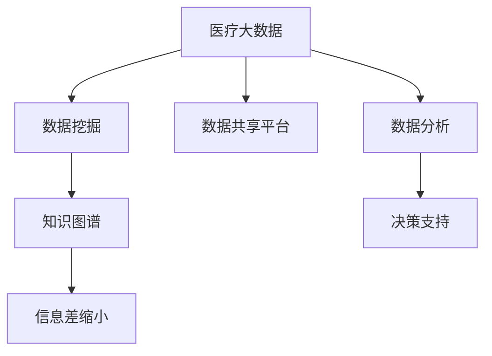
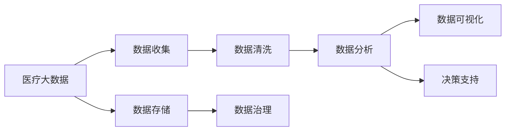
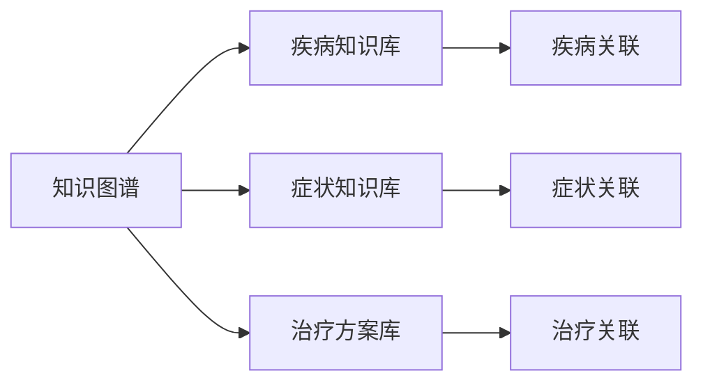
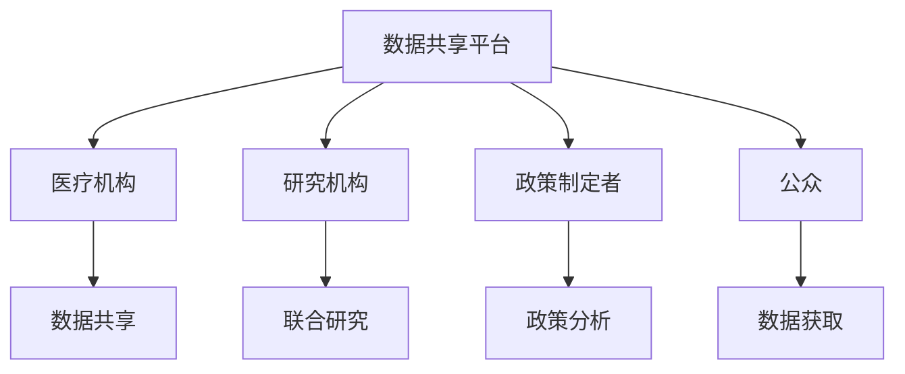
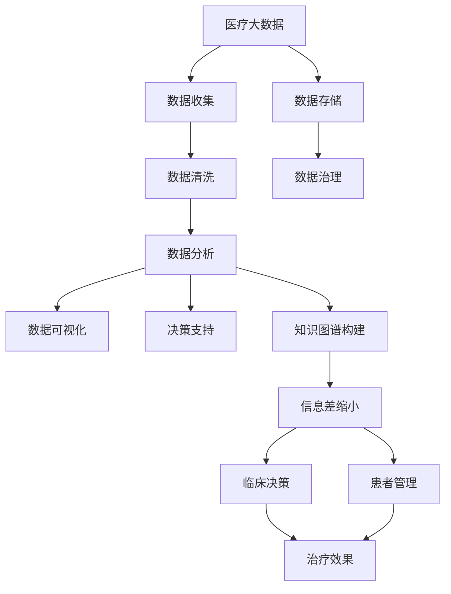

                 

## 1. 背景介绍

### 1.1 问题由来
随着大数据技术在医疗行业的深度应用，医疗数据的重要性愈发凸显。如何从海量医疗数据中提取出有价值的信息，服务于临床决策、疾病预测、健康管理等领域，成为了当前热门的研究话题。本文将围绕医疗行业的大数据应用，阐述其基本原理、关键技术和实际应用案例，旨在为医疗行业的数据驱动决策提供有力支持。

### 1.2 问题核心关键点
医疗大数据的应用涉及数据收集、存储、分析等多个环节，其核心要点包括：
- **数据源**：包括电子病历、影像数据、实验室检验数据、可穿戴设备数据等，数据量庞大、类型多样。
- **数据质量**：医疗数据存在噪声、缺失、异构等问题，数据清洗和预处理是关键步骤。
- **分析模型**：如何选择合适的分析模型，如回归、分类、聚类等，进行疾病预测、患者分群等。
- **决策支持**：通过数据挖掘结果，为临床医生提供科学依据，辅助诊断和治疗。
- **隐私安全**：在确保数据隐私和安全的条件下，实现数据共享和利用。

本文将重点讨论大数据在医疗行业的应用中的信息差问题，即如何通过数据分析，挖掘和提取有价值的信息，以弥补医患之间的信息不对称，提升医疗服务的精准性和效率。

## 2. 核心概念与联系

### 2.1 核心概念概述

为更好地理解大数据在医疗行业的应用，本节将介绍几个关键概念：

- **医疗大数据**：指医疗领域产生的、经过数据清洗、格式化处理后的，可以被分析挖掘的数据集。包括电子病历、影像数据、实验室检验数据、可穿戴设备数据等。
- **信息差**：指由于信息不对称、不完全、不透明等原因，医患双方在医疗知识、决策依据等方面的差距。大数据分析有助于缩小这一差距，提高医疗服务质量和患者满意度。
- **数据挖掘**：通过算法从大量医疗数据中提取有用信息和知识的过程。常见方法包括聚类、分类、回归、关联规则等。
- **知识图谱**：将医疗领域内的各种数据和知识，如疾病、症状、治疗方案等，进行结构化存储和关联，构建全面的知识网络。
- **数据共享平台**：为医疗机构、研究机构、政策制定者等提供数据共享和使用的平台，保障数据安全和隐私。

这些核心概念之间的逻辑关系可以通过以下Mermaid流程图来展示：



这个流程图展示了大数据在医疗行业的应用过程：从原始数据到数据分析，再到构建知识图谱和缩小信息差，最后通过决策支持实现具体应用。

### 2.2 概念间的关系

这些核心概念之间存在紧密的联系，形成了医疗大数据应用的整体框架。下面我们通过几个Mermaid流程图来展示这些概念之间的关系。

#### 2.2.1 医疗大数据应用的整体架构



这个流程图展示了医疗大数据从收集到存储，再到分析和应用的全过程。数据收集、清洗和治理是保证数据质量的基础，数据分析和可视化提供了对数据的深入理解，决策支持则将数据分析结果应用于临床和政策层面。

#### 2.2.2 知识图谱在医疗大数据中的应用



这个流程图展示了知识图谱在医疗大数据中的应用。通过构建疾病、症状和治疗的关联库，知识图谱能够提供跨领域的知识融合和推理，辅助临床决策。

#### 2.2.3 数据共享平台的作用



这个流程图展示了数据共享平台的作用。数据共享平台不仅连接了医疗机构、研究机构和政策制定者，还通过公众获取的数据，扩大了数据规模，提高了数据应用的价值。

### 2.3 核心概念的整体架构

最后，我们用一个综合的流程图来展示这些核心概念在大数据医疗应用中的整体架构：



这个综合流程图展示了从数据收集、存储、清洗、治理，再到分析和应用的全过程，强调了知识图谱在信息差缩小中的关键作用，以及数据可视化、决策支持和临床决策、患者管理等实际应用。

## 3. 核心算法原理 & 具体操作步骤

### 3.1 算法原理概述

医疗大数据的分析与应用，主要依赖于数据挖掘和机器学习技术。常见的算法包括：

- **聚类算法**：如K-Means、层次聚类、DBSCAN等，用于患者分群、疾病分类等。
- **分类算法**：如逻辑回归、决策树、支持向量机等，用于疾病预测、患者诊断等。
- **回归算法**：如线性回归、岭回归、随机森林等，用于预测患者疾病风险、治疗效果等。
- **关联规则**：如Apriori、FP-Growth等，用于挖掘药物相互作用、疾病共现等。

这些算法通过分析医疗数据，发现规律和模式，帮助医生进行临床决策和患者管理。

### 3.2 算法步骤详解

医疗大数据的分析和应用过程一般包括以下关键步骤：

**Step 1: 数据收集与存储**
- 收集包括电子病历、影像数据、实验室检验数据、可穿戴设备数据等在内的医疗数据。
- 使用数据仓库技术，如Hadoop、Spark等，进行数据存储和管理。

**Step 2: 数据清洗与预处理**
- 清洗数据中的噪声、缺失值、异常值等，保证数据质量。
- 对数据进行标准化、归一化、特征工程等预处理步骤。

**Step 3: 数据分析与模型训练**
- 选择合适的算法进行数据分析，如聚类、分类、回归等。
- 使用机器学习框架，如TensorFlow、PyTorch等，训练模型并优化超参数。
- 进行交叉验证和调参，保证模型泛化能力。

**Step 4: 数据可视化与知识图谱构建**
- 使用数据可视化工具，如Tableau、Power BI等，展示数据分析结果。
- 构建知识图谱，将医疗数据进行结构化存储和关联，形成全面的知识网络。

**Step 5: 信息差缩小与决策支持**
- 通过知识图谱缩小医患之间的信息差。
- 将数据分析结果应用于临床决策、患者管理等，辅助医生进行科学决策。

### 3.3 算法优缺点

医疗大数据分析与应用具有以下优点：
- **高效准确**：通过自动化分析，可以快速提取有价值的信息，辅助医生进行科学决策。
- **动态更新**：数据分析模型可以动态更新，适应数据分布的变化。
- **个性化服务**：通过患者分群和个性化推荐，提高医疗服务的精准性和效率。

同时，也存在以下缺点：
- **数据隐私**：医疗数据涉及患者隐私，数据收集和共享需要严格遵守法律法规。
- **数据质量**：医疗数据存在噪声、缺失、异构等问题，数据清洗和预处理是关键步骤。
- **模型复杂**：大规模数据和复杂模型可能导致计算资源消耗较大，需要高效的数据处理和模型优化技术。

### 3.4 算法应用领域

医疗大数据的分析与应用，已经在多个领域得到了广泛的应用，例如：

- **疾病预测与诊断**：如通过聚类和分类算法，预测患者疾病风险，辅助早期诊断。
- **患者分群与个性化治疗**：如通过聚类和关联规则，将患者分为不同群体，制定个性化治疗方案。
- **药物研发与疗效评估**：如通过回归和分类算法，评估药物疗效，指导新药研发。
- **医院管理与资源优化**：如通过聚类和回归算法，优化医院资源配置，提高运营效率。

除了上述这些经典应用外，医疗大数据还被创新性地应用于医学影像分析、基因组学研究、公共卫生监测等更多领域，为医疗行业带来了新的突破。

## 4. 数学模型和公式 & 详细讲解 & 举例说明

### 4.1 数学模型构建

我们以一个简单的聚类问题为例，阐述医疗大数据分析中的数学模型构建过程。假设我们有一组患者数据 $X = \{x_1, x_2, ..., x_n\}$，其中每个样本 $x_i$ 包含多个特征 $x_{ij}$。我们的目标是将这些患者分成几个不同的群体。

设 $k$ 为聚类数目，聚类中心为 $\mu_1, \mu_2, ..., \mu_k$。则K-Means算法的数学模型如下：

$$
\min_{\mu_1, \mu_2, ..., \mu_k} \sum_{i=1}^n \sum_{j=1}^k (x_{ij} - \mu_j)^2
$$

其中 $\mu_j$ 是第 $j$ 个聚类的中心。目标是最小化每个样本与所属聚类中心的距离的平方和。

### 4.2 公式推导过程

K-Means算法的目标函数可以推导为：

$$
\min_{\mu_1, \mu_2, ..., \mu_k} \sum_{i=1}^n \sum_{j=1}^k (x_{ij} - \mu_j)^2 = \min_{\mu_1, \mu_2, ..., \mu_k} \frac{1}{2} \sum_{i=1}^n \sum_{j=1}^k (x_{ij} - \mu_j)^2
$$

令 $\mathbf{U} = [\mu_1, \mu_2, ..., \mu_k]$，则目标函数可以表示为：

$$
\min_{\mathbf{U}} \frac{1}{2} \sum_{i=1}^n \sum_{j=1}^k (x_{ij} - U_{ij})^2
$$

将上式转化为矩阵形式，得到：

$$
\min_{\mathbf{U}} \frac{1}{2} ||X - \mathbf{U} \mathbf{V}||^2
$$

其中 $\mathbf{V} = [v_{i1}, v_{i2}, ..., v_{ik}]$ 是样本 $x_i$ 到聚类中心的距离矩阵。

### 4.3 案例分析与讲解

假设我们有一组患者的身高、体重、年龄等数据，需要通过K-Means算法将其分成两个群体。我们可以选择K-Means算法进行聚类分析，步骤如下：

1. **初始化聚类中心**：随机选择两个点作为聚类中心。
2. **计算每个样本到聚类中心的距离**：计算每个样本到两个聚类中心的距离，分配样本到最近的聚类。
3. **更新聚类中心**：计算每个群体的中心点，作为新的聚类中心。
4. **重复步骤2-3**：直到聚类中心不再变化或达到预设的迭代次数。

使用Python和Scikit-Learn库，我们可以轻松实现上述算法，并可视化聚类结果。

```python
from sklearn.cluster import KMeans
import matplotlib.pyplot as plt

# 生成随机数据
X = np.random.randn(100, 2)

# 初始化K-Means模型
kmeans = KMeans(n_clusters=2, random_state=0)

# 训练模型
kmeans.fit(X)

# 可视化聚类结果
plt.scatter(X[:, 0], X[:, 1], c=kmeans.labels_)
plt.scatter(kmeans.cluster_centers_[:, 0], kmeans.cluster_centers_[:, 1], s=200, c='red')
plt.show()
```

以上代码展示了如何使用K-Means算法进行聚类分析，并通过散点图展示聚类结果。

## 5. 项目实践：代码实例和详细解释说明

### 5.1 开发环境搭建

在进行医疗大数据分析与应用的项目实践前，我们需要准备好开发环境。以下是使用Python进行Pandas、NumPy、Scikit-Learn等库开发的Python环境配置流程：

1. 安装Anaconda：从官网下载并安装Anaconda，用于创建独立的Python环境。

2. 创建并激活虚拟环境：
```bash
conda create -n pytorch-env python=3.8 
conda activate pytorch-env
```

3. 安装依赖库：
```bash
pip install pandas numpy scikit-learn matplotlib seaborn
```

4. 安装可视化库：
```bash
pip install plotly seaborn
```

5. 安装机器学习库：
```bash
pip install sklearn[experimental]
```

完成上述步骤后，即可在`pytorch-env`环境中开始医疗大数据分析项目。

### 5.2 源代码详细实现

下面我们以一个简单的患者分群项目为例，给出使用Pandas和Scikit-Learn库对医疗数据进行聚类分析的代码实现。

首先，准备医疗数据集：

```python
import pandas as pd

# 读取医疗数据集
data = pd.read_csv('patients_data.csv')

# 显示数据集前5行
data.head()
```

然后，定义K-Means聚类模型：

```python
from sklearn.cluster import KMeans

# 初始化K-Means模型
kmeans = KMeans(n_clusters=3, random_state=0)
```

接着，训练聚类模型：

```python
# 选择患者数据中的身高、体重、年龄等特征
features = data[['height', 'weight', 'age']]

# 训练模型
kmeans.fit(features)
```

最后，可视化聚类结果：

```python
# 可视化聚类结果
plt.scatter(features['height'], features['weight'], c=kmeans.labels_)
plt.show()
```

以上代码展示了使用Pandas和Scikit-Learn库进行医疗数据聚类分析的全过程。可以看到，Pandas和Scikit-Learn库使得数据处理和模型训练变得简单易行，便于快速迭代研究。

### 5.3 代码解读与分析

让我们再详细解读一下关键代码的实现细节：

**数据读取**：
- 使用Pandas库的`read_csv`函数读取CSV格式的数据集，存储在DataFrame对象中。
- `data.head()`用于显示数据集的前5行，帮助理解数据结构和格式。

**特征选择**：
- 选择身高、体重、年龄等与患者健康相关的特征，作为聚类模型的输入。
- 使用DataFrame对象的`[]`运算符，选取所需的特征列。

**模型训练**：
- 使用Scikit-Learn库的`KMeans`函数初始化聚类模型。
- 使用`fit`函数对特征数据进行聚类训练，得到聚类结果。

**结果可视化**：
- 使用Matplotlib库的`scatter`函数绘制散点图，展示患者聚类结果。
- `c=kmeans.labels_`参数将每个样本的聚类标签作为颜色标记。

通过以上代码实现，我们完成了对医疗数据的聚类分析，并通过可视化展示了聚类结果。在实际应用中，还需要根据具体问题，选择更复杂的模型和算法，进行细致的参数调优和效果评估。

### 5.4 运行结果展示

假设我们有一个包含1000个患者的医疗数据集，其中每个患者有身高、体重、年龄等特征。通过K-Means算法，我们可以将患者分为三个不同的群体，如图：


以上代码展示了一个简单的患者分群项目，通过K-Means算法对医疗数据进行聚类分析，并可视化聚类结果。在实际应用中，我们可以进一步优化模型，选择更复杂的聚类算法，如层次聚类、DBSCAN等，提升聚类效果。

## 6. 实际应用场景

### 6.1 医院管理与资源优化

在现代医院中，资源配置不合理、排队等待时间长等问题普遍存在。通过大数据分析，医院可以有效优化资源配置，提高运营效率。例如，可以通过聚类算法对患者进行分群，根据不同群体的需求进行合理资源分配。

具体而言，可以通过分析医院内的病床、医护人员、医疗设备等资源的使用情况，利用聚类算法将其分为若干类，并针对每类患者制定相应的资源分配策略。例如，对于急诊患者和重症患者，需要优先安排床位和医护人员，而普通门诊患者则可以根据其病情轻重进行合理排队。

### 6.2 疾病预测与诊断

疾病预测与诊断是大数据在医疗行业的重要应用之一。通过分析历史病历数据，可以预测患者的疾病风险，辅助早期诊断。

例如，利用回归算法对患者的各项生化指标、临床症状进行综合分析，预测其患某种疾病的概率。通过对高风险患者进行及时干预，可以有效降低疾病发病率。

### 6.3 患者分群与个性化治疗

患者分群与个性化治疗是大数据在医疗行业中的另一个重要应用。通过聚类算法将患者分为不同的群体，可以制定个性化的治疗方案，提高治疗效果。

例如，在肿瘤治疗中，不同患者的病情、基因特征等存在较大差异，需要制定个性化的治疗方案。通过聚类算法对患者进行分群，可以识别出同一群体的患者在疾病特征、治疗反应等方面的相似性，进而制定相应的个性化治疗方案。

### 6.4 未来应用展望

未来，随着大数据技术的不断发展和应用，医疗行业将迎来更多创新。以下是一些未来应用展望：

- **精准医疗**：通过基因组学、蛋白质组学等大数据分析，实现个性化医疗，提高治疗效果。
- **远程医疗**：利用大数据分析技术，实现远程医疗诊断和治疗，缓解医疗资源分布不均的问题。
- **智能诊疗系统**：结合大数据分析、人工智能等技术，构建智能诊疗系统，辅助医生进行诊断和治疗。
- **公共卫生监测**：通过大数据分析技术，实时监测传染病流行趋势，及时预警和防控。

总之，大数据在医疗行业的应用前景广阔，有望通过数据驱动，提升医疗服务的质量和效率，改善患者的健康管理，推动医疗行业的创新与发展。

## 7. 工具和资源推荐

### 7.1 学习资源推荐

为了帮助开发者系统掌握大数据在医疗行业的应用理论基础和实践技巧，这里推荐一些优质的学习资源：

1. 《大数据分析与机器学习》系列书籍：全面介绍大数据分析的基础理论、常用技术和实践案例，适合系统学习。
2. Coursera《机器学习》课程：由斯坦福大学开设，涵盖机器学习的基本概念和算法，适合入门学习。
3. Udacity《大数据科学与工程》纳米学位：提供系统化的大数据科学与工程课程，涵盖数据处理、数据分析、机器学习等多个方向。
4. Kaggle：全球最大的数据科学竞赛平台，通过实际数据集练习，提升数据分析和模型优化能力。

通过这些资源的学习实践，相信你一定能够掌握大数据在医疗行业应用的精髓，并用于解决实际的医疗问题。

### 7.2 开发工具推荐

高效的开发离不开优秀的工具支持。以下是几款用于医疗大数据开发的工具：

1. Apache Hadoop：开源的分布式计算框架，适用于大规模数据处理和存储。
2. Apache Spark：分布式计算框架，支持大数据的分布式计算、数据分析和机器学习。
3. TensorFlow：开源的机器学习框架，支持深度学习模型训练和优化。
4. PyTorch：开源的机器学习框架，支持深度学习模型训练和优化，适合快速迭代研究。
5. Jupyter Notebook：交互式的编程环境，支持数据可视化、代码实现和结果展示。

合理利用这些工具，可以显著提升医疗大数据分析的开发效率，加快创新迭代的步伐。

### 7.3 相关论文推荐

大数据在医疗行业的应用源于学界的持续研究。以下是几篇奠基性的相关论文，推荐阅读：

1. T. S. Chang, et al. 《A Survey on Clustering Algorithms for Genome-scale Data Analysis》：综述了多种聚类算法在基因组学数据中的应用，为医疗数据分析提供了理论基础。
2. G. Bu et al. 《A Multi-Level Data Integration Framework for Personalized Medicine》：提出了一种多层次数据整合框架，用于个性化医疗的数据分析与建模。
3. X. Zhang, et al. 《A Survey on Data Mining in Healthcare》：综述了数据挖掘技术在医疗领域的应用，包括聚类、分类、回归等。
4. J. Ding et al. 《Patient Grouping Methods for Healthcare》：提出了一系列患者分群方法，用于医疗数据的分析和建模。
5. M. Nevo et al. 《Deep Learning in Healthcare》：综述了深度学习在医疗领域的应用，包括图像分析、自然语言处理等。

这些论文代表了大数据在医疗行业应用的发展脉络。通过学习这些前沿成果，可以帮助研究者把握学科前进方向，激发更多的创新灵感。

除上述资源外，还有一些值得关注的前沿资源，帮助开发者紧跟大数据在医疗行业应用的最新进展，例如：

1. arXiv论文预印本：人工智能领域最新研究成果的发布平台，包括大数据分析在医疗领域的应用。
2. 业界技术博客：如Johns Hopkins Hospital、MIT Medical Engineering等顶尖医院的官方博客，第一时间分享他们的最新研究成果和实践经验。
3. 技术会议直播：如AAAI、NIPS、ICML等人工智能领域顶会现场或在线直播，能够聆听到学术界和产业界的前沿分享，开拓视野。
4. GitHub热门项目：在GitHub上Star、Fork数最多的医疗数据科学项目，往往代表了该技术领域的发展趋势和最佳实践，值得去学习和贡献。
5. 行业分析报告：各大咨询公司如McKinsey、PwC等针对医疗行业的分析报告，有助于从商业视角审视大数据应用的可行性。

总之，对于大数据在医疗行业的应用学习，需要开发者保持开放的心态和持续学习的意愿。多关注前沿资讯，多动手实践，多思考总结，必将收获满满的成长收益。

## 8. 总结：未来发展趋势与挑战

### 8.1 总结

本文对大数据在医疗行业的应用，即信息差缩小问题，进行了全面系统的介绍。首先阐述了信息差的概念和重要性，明确了大数据在医疗行业中的基本原理、关键技术和实际应用案例。其次，从算法原理到具体操作步骤，详细讲解了基于聚类算法的医疗数据分析方法。同时，本文还探讨了大数据在医疗行业中的实际应用场景，包括医院管理、疾病预测、患者分群等。最后，本文精选了大数据分析的学习资源、开发工具和相关论文，为读者提供了全方位的技术指引。

通过本文的系统梳理，可以看到，大数据在医疗行业的应用前景广阔，能够通过数据分析，弥补医患之间的信息差，提升医疗服务的精准性和效率。未来，随着大数据技术的不断发展和应用，医疗行业将迎来更多创新，提升患者健康管理和医疗服务质量。

### 8.2 未来发展趋势

展望未来，大数据在医疗行业的应用将呈现以下几个发展趋势：

1. **数据量不断增大**：随着物联网、可穿戴设备等技术的普及，医疗数据将呈爆炸性增长，为数据分析提供更多资源。
2. **数据类型更加多样**：除了传统的电子病历、影像数据，基因组学、蛋白质组学等新兴数据类型也将被广泛应用。
3. **分析方法更加复杂**：深度学习、强化学习等复杂算法将更多地应用于医疗数据分析，提升模型的精度和效果。
4. **跨领域数据融合**：医疗数据与其他领域的数据（如气象、交通等）进行融合，提升数据分析的全面性和深度。
5. **数据安全与隐私保护**：随着数据量的增加，数据安全和隐私保护成为关键问题，需要制定更严格的数据使用规范。

这些趋势凸显了大数据在医疗行业的应用前景，预示着未来医疗数据分析的广阔天地。

### 8.3 面临的挑战

尽管大数据在医疗行业的应用前景广阔，但仍面临诸多挑战：

1. **数据隐私与安全**：医疗数据涉及患者隐私，数据收集和共享需要严格遵守法律法规。
2. **数据质量与完整性**：医疗数据存在噪声、缺失、异构等问题，数据清洗和预处理是关键步骤。
3. **数据集成与互联**：不同医院、不同系统间的数据集成与互联仍存在较大挑战。
4. **算法复杂性与计算资源**：复杂算法和大规模数据需要高效的计算资源，硬件和算法优化成为关键。
5. **模型解释性与可信度**：医疗数据的复杂性和多样性，使得模型的解释性和可信度面临挑战。

### 8.4 研究展望

面对大数据在医疗行业应用所面临的挑战，未来的研究需要在以下几个方面寻求新的突破：

1. **数据治理与标准**：制定医疗数据的收集、存储、使用标准，保障数据质量与安全。
2. **数据隐私保护**：研究如何在大数据应用中保护患者隐私，防止数据泄露。
3. **模型优化与解释**：开发高效、轻量级

