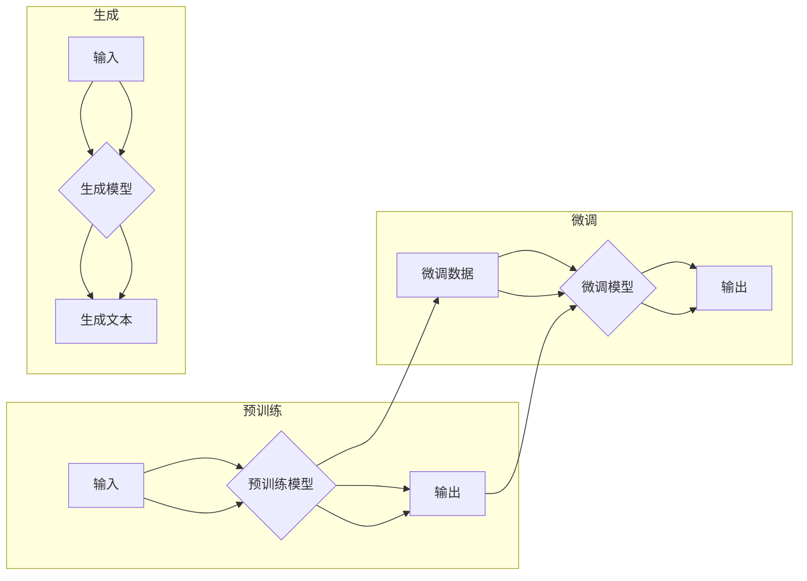

> 关键词：大规模语言模型，自然语言处理，预训练，Transformer，BERT，GPT，NLP，机器学习，深度学习

# 大规模语言模型从理论到实践 基础概念

大规模语言模型（Large Language Models，简称LLMs）是近年来自然语言处理（Natural Language Processing，简称NLP）领域的一项重要突破。LLMs通过在大量文本语料上进行训练，学习到了丰富的语言知识和模式，能够进行文本生成、情感分析、机器翻译等复杂任务。本文将深入探讨大规模语言模型的理论基础和实践方法，帮助读者从理论到实践全面了解这一前沿技术。

## 1. 背景介绍

### 1.1 语言模型的起源

语言模型是NLP领域最早的研究对象之一。早期的语言模型通常基于统计方法，如N-gram模型，通过计算词序列的概率来生成文本。然而，这些模型在处理复杂语言现象和长文本方面存在局限性。

### 1.2 深度学习时代的语言模型

随着深度学习技术的发展，基于神经网络的深度语言模型逐渐成为主流。这些模型能够学习更复杂的语言特征，并在多个NLP任务上取得显著成果。

### 1.3 大规模语言模型的兴起

近年来，随着计算资源和数据量的快速增长，大规模语言模型开始兴起。这些模型通常使用数十亿甚至千亿级别的参数，并在大规模语料上进行预训练，从而获得了强大的语言理解能力和生成能力。

## 2. 核心概念与联系

### 2.1 核心概念

#### 2.1.1 预训练

预训练是指在大量无标注数据上对模型进行训练的过程。预训练模型通常学习到丰富的语言知识，为下游任务提供强大的特征表示。

#### 2.1.2 上下文

上下文是指模型在处理某个词或句子时，所依赖的周围词或句子信息。上下文信息对于理解词语的含义和上下文关系至关重要。

#### 2.1.3 生成

生成是指模型根据输入生成新的文本内容。生成能力是大规模语言模型的重要特征。

#### 2.1.4 微调

微调是指将预训练模型应用于特定任务，并在少量标注数据上进行进一步训练的过程。

### 2.2 核心概念原理和架构的 Mermaid 流程图



## 3. 核心算法原理 & 具体操作步骤

### 3.1 算法原理概述

大规模语言模型的核心算法通常基于自回归（如GPT系列）或自编码（如BERT）模型。

#### 3.1.1 自回归模型

自回归模型通过预测下一个词来生成文本。模型将当前词作为输入，预测下一个词的概率分布，并根据概率分布生成下一个词，依此类推。

#### 3.1.2 自编码模型

自编码模型通过学习输入文本和其重构文本之间的映射关系来生成文本。模型将输入文本编码为一个固定长度的向量，然后将该向量解码为原始文本。

### 3.2 算法步骤详解

#### 3.2.1 预训练

1. 数据准备：收集大量无标注文本语料。
2. 模型构建：选择合适的预训练模型架构。
3. 训练：在无标注数据上训练模型，优化模型参数。
4. 验证：在验证集上评估模型性能。

#### 3.2.2 微调

1. 数据准备：收集少量标注数据。
2. 模型构建：将预训练模型应用于特定任务。
3. 训练：在标注数据上微调模型参数。
4. 验证：在验证集上评估模型性能。

#### 3.2.3 生成

1. 输入：输入一个词或句子。
2. 预测：模型预测下一个词的概率分布。
3. 输出：根据概率分布生成下一个词。
4. 循环：重复步骤2-3，生成整个文本。

### 3.3 算法优缺点

#### 3.3.1 优点

- 强大的语言理解能力
- 丰富的语言知识
- 适用于多种NLP任务
- 高效的生成能力

#### 3.3.2 缺点

- 计算资源消耗大
- 需要大量标注数据
- 难以解释模型的决策过程

### 3.4 算法应用领域

大规模语言模型在多个NLP任务上取得了显著成果，包括：

- 文本生成
- 文本分类
- 机器翻译
- 情感分析
- 实体识别
- 问答系统

## 4. 数学模型和公式 & 详细讲解 & 举例说明

### 4.1 数学模型构建

大规模语言模型的数学模型通常基于神经网络。

#### 4.1.1 神经网络

神经网络由多个神经元组成，每个神经元通过权重连接其他神经元。神经元的输入和输出通过非线性激活函数进行映射。

#### 4.1.2 激活函数

激活函数用于将神经元的线性组合映射到另一个非线性空间。常见的激活函数包括ReLU、Sigmoid、Tanh等。

### 4.2 公式推导过程

以下以GPT-2模型为例，介绍大规模语言模型的数学模型。

#### 4.2.1 GPT-2模型

GPT-2模型是一种基于Transformer的自回归语言模型。

#### 4.2.2 数学模型

GPT-2模型的数学模型如下：

$$
\hat{y}_{t+1} = \sigma(W_{\text{output}} \sigma(W_{\text{hidden}} \text{ReLU}(W_{\text{input}} x_t + b_{\text{hidden}}) + b_{\text{output}}))
$$

其中，$x_t$ 是输入序列，$\hat{y}_{t+1}$ 是预测的下一个词的概率分布，$W_{\text{input}}$、$W_{\text{hidden}}$ 和 $W_{\text{output}}$ 是模型的权重，$b_{\text{hidden}}$ 和 $b_{\text{output}}$ 是偏置项，$\sigma$ 是激活函数。

### 4.3 案例分析与讲解

以文本生成任务为例，介绍GPT-2模型的微调过程。

1. 数据准备：收集大量无标注文本语料，如新闻、小说、博客等。
2. 模型构建：加载预训练的GPT-2模型。
3. 微调：在少量标注数据上微调模型参数。
4. 生成：输入一个词或句子，模型生成下一个词的概率分布，并根据概率分布生成下一个词，依此类推。

## 5. 项目实践：代码实例和详细解释说明

### 5.1 开发环境搭建

1. 安装Python环境。
2. 安装TensorFlow或PyTorch等深度学习框架。
3. 安装Hugging Face的Transformers库。

### 5.2 源代码详细实现

以下是一个简单的GPT-2文本生成示例：

```python
from transformers import GPT2LMHeadModel, GPT2Tokenizer

# 加载预训练模型和分词器
model = GPT2LMHeadModel.from_pretrained('gpt2')
tokenizer = GPT2Tokenizer.from_pretrained('gpt2')

# 输入文本
text = "The quick brown fox jumps over the lazy dog."

# 分词
input_ids = tokenizer.encode(text, return_tensors='pt')

# 生成文本
output_ids = model.generate(input_ids, max_length=50, num_return_sequences=1)

# 解码文本
decoded_text = tokenizer.decode(output_ids[0], skip_special_tokens=True)

print(decoded_text)
```

### 5.3 代码解读与分析

以上代码展示了如何使用Transformers库加载预训练的GPT-2模型，并生成新的文本内容。

- `GPT2LMHeadModel.from_pretrained('gpt2')` 加载预训练的GPT-2模型。
- `GPT2Tokenizer.from_pretrained('gpt2')` 加载预训练的分词器。
- `tokenizer.encode(text, return_tensors='pt')` 将输入文本分词并转换为模型需要的格式。
- `model.generate(input_ids, max_length=50, num_return_sequences=1)` 生成文本。
- `tokenizer.decode(output_ids[0], skip_special_tokens=True)` 将生成的文本解码为人类可读的形式。

### 5.4 运行结果展示

假设输入文本为"The quick brown fox jumps over the lazy dog."，模型可能会生成以下文本：

"The quick brown fox jumps over the lazy dog. And then he turns around and looks at the chicken."

## 6. 实际应用场景

### 6.1 文本生成

大规模语言模型在文本生成任务中具有广泛的应用，如：

- 自动写作
- 机器翻译
- 问答系统
- 聊天机器人

### 6.2 文本分类

大规模语言模型可以用于文本分类任务，如：

- 情感分析
- 主题分类
- 意图识别

### 6.3 机器翻译

大规模语言模型在机器翻译任务中具有显著优势，如：

- 自动翻译
- 口译辅助
- 跨语言检索

## 7. 工具和资源推荐

### 7.1 学习资源推荐

- 《深度学习与NLP》
- 《自然语言处理：理论与实践》
- 《深度学习：原理与编程》

### 7.2 开发工具推荐

- TensorFlow
- PyTorch
- Hugging Face Transformers

### 7.3 相关论文推荐

- "Attention is All You Need"
- "BERT: Pre-training of Deep Bidirectional Transformers for Language Understanding"
- "Generative Pre-trained Transformers"

## 8. 总结：未来发展趋势与挑战

### 8.1 研究成果总结

大规模语言模型在NLP领域取得了显著的成果，为多个任务提供了强大的工具。

### 8.2 未来发展趋势

- 模型规模将进一步扩大
- 模型将更加高效
- 模型将更加可解释
- 模型将更加安全

### 8.3 面临的挑战

- 数据标注成本高
- 模型可解释性差
- 模型安全性和偏见问题

### 8.4 研究展望

- 开发更高效的模型
- 提高模型的可解释性和安全性
- 探索新的应用场景

## 9. 附录：常见问题与解答

**Q1：大规模语言模型是如何工作的？**

A：大规模语言模型通过在大量文本语料上进行训练，学习到丰富的语言知识，并能够进行文本生成、文本分类等任务。

**Q2：大规模语言模型有哪些应用场景？**

A：大规模语言模型在文本生成、文本分类、机器翻译等多个NLP任务中都有广泛的应用。

**Q3：如何训练大规模语言模型？**

A：训练大规模语言模型需要大量的文本语料和计算资源。通常使用深度学习框架和预训练模型进行训练。

**Q4：大规模语言模型有哪些挑战？**

A：大规模语言模型面临数据标注成本高、模型可解释性差、模型安全性和偏见问题等挑战。

作者：禅与计算机程序设计艺术 / Zen and the Art of Computer Programming