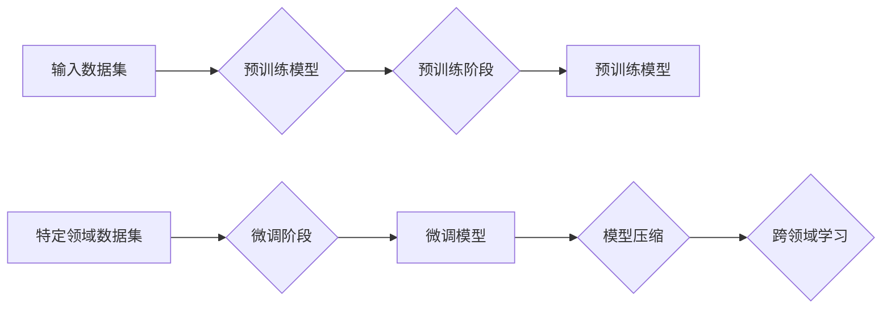

# 大语言模型原理与工程实践：大语言模型微调的探索与展望

> 关键词：大语言模型，微调，预训练，自然语言处理，NLP，Transformer，BERT，模型压缩，跨领域学习

## 1. 背景介绍

随着人工智能技术的飞速发展，自然语言处理（NLP）领域取得了显著进步。近年来，基于深度学习的大语言模型（Large Language Model，LLM）如BERT、GPT-3等，在自然语言理解、文本生成等任务上展现出惊人的能力。然而，这些模型往往需要在海量数据上预训练，且在特定领域的任务上性能有限。微调（Fine-tuning）作为一种有效的模型优化方法，成为了提升LLM在特定任务上表现的关键技术。本文将深入探讨大语言模型微调的原理、实践和未来展望。

## 2. 核心概念与联系

### 2.1 核心概念

**大语言模型（LLM）**：基于深度学习的NLP模型，通过在海量文本数据上进行预训练，学习到丰富的语言知识和表示能力。

**预训练（Pre-training）**：在大规模无标签文本数据上，通过特定的自监督学习任务，使模型学习到通用的语言表示。

**微调（Fine-tuning）**：在预训练模型的基础上，使用特定任务的少量标注数据，通过有监督学习优化模型在特定任务上的性能。

**模型压缩（Model Compression）**：通过模型剪枝、量化、知识蒸馏等方法，减小模型规模，提高模型效率。

**跨领域学习（Cross-Domain Learning）**：利用跨领域数据或知识，提升模型在不同领域上的性能。

### 2.2 Mermaid 流程图



## 3. 核心算法原理 & 具体操作步骤

### 3.1 算法原理概述

大语言模型微调的核心思想是：利用预训练模型在通用语言表示上的优势，通过在特定任务的标注数据上进行微调，使模型学习到更精细化的任务特征，从而提升模型在特定任务上的性能。

### 3.2 算法步骤详解

1. **数据准备**：收集特定任务的标注数据，并将其分为训练集、验证集和测试集。

2. **模型选择**：选择合适的预训练模型，如BERT、GPT等。

3. **模型微调**：
    - 将预训练模型的输出层替换为特定任务的输出层。
    - 使用训练集数据对模型进行微调，优化模型参数。
    - 使用验证集数据监控模型性能，防止过拟合。

4. **模型评估**：在测试集上评估微调模型的性能，并根据需要调整模型结构和参数。

5. **模型压缩**：对微调后的模型进行压缩，以减小模型规模，提高模型效率。

6. **跨领域学习**：利用跨领域数据或知识，进一步优化模型性能。

### 3.3 算法优缺点

**优点**：
- 提升模型在特定任务上的性能。
- 利用预训练模型的通用语言表示能力。
- 减少标注数据的数量。

**缺点**：
- 需要大量的计算资源和时间进行预训练。
- 模型压缩和跨领域学习等技术需要进一步研究。

### 3.4 算法应用领域

- 文本分类
- 情感分析
- 机器翻译
- 文本摘要
- 对话系统

## 4. 数学模型和公式 & 详细讲解 & 举例说明

### 4.1 数学模型构建

假设预训练模型为 $M_{\theta}$，其中 $\theta$ 为模型参数。微调的目标是最小化损失函数 $\mathcal{L}(M_{\theta},D)$，其中 $D$ 为标注数据集。

$$
\mathcal{L}(M_{\theta},D) = \frac{1}{N}\sum_{i=1}^N \ell(M_{\theta}(x_i),y_i)
$$

其中 $\ell$ 为损失函数，$x_i$ 为输入样本，$y_i$ 为真实标签。

### 4.2 公式推导过程

以BERT为例，假设输入序列长度为 $L$，模型输出为 $\hat{y}$，真实标签为 $y$，则损失函数为交叉熵损失：

$$
\ell(M_{\theta}(x),y) = -\sum_{i=1}^L [y_i \log \hat{y}_i + (1-y_i) \log (1-\hat{y}_i)]
$$

### 4.3 案例分析与讲解

假设我们使用BERT模型进行情感分析任务。将训练集划分为训练集和验证集，使用训练集数据微调BERT模型，使用验证集数据监控模型性能。

```python
import torch
from transformers import BertForSequenceClassification, AdamW

# 模型加载和初始化
model = BertForSequenceClassification.from_pretrained('bert-base-uncased')
optimizer = AdamW(model.parameters(), lr=2e-5)

# 训练过程
for epoch in range(epochs):
    # 训练集数据加载和前向传播
    # ...
    # 反向传播和参数更新
    # ...
    # 验证集数据加载和评估
    # ...
```

## 5. 项目实践：代码实例和详细解释说明

### 5.1 开发环境搭建

1. 安装Python和PyTorch环境。
2. 安装transformers库：`pip install transformers`
3. 准备数据集：文本和标签。

### 5.2 源代码详细实现

```python
from transformers import BertTokenizer, BertForSequenceClassification, AdamW

# 模型加载和初始化
model = BertForSequenceClassification.from_pretrained('bert-base-uncased')
optimizer = AdamW(model.parameters(), lr=2e-5)

# 训练过程
for epoch in range(epochs):
    # 训练集数据加载和前向传播
    # ...
    # 反向传播和参数更新
    # ...
    # 验证集数据加载和评估
    # ...
```

### 5.3 代码解读与分析

代码首先加载预训练的BERT模型和分词器，然后定义优化器。在训练循环中，对训练集数据进行加载和前向传播，计算损失函数，然后进行反向传播和参数更新。同时，在验证集上进行评估，以监控模型性能。

### 5.4 运行结果展示

在测试集上评估微调后的模型，可以得到模型在情感分析任务上的性能指标，如准确率、召回率和F1值。

## 6. 实际应用场景

大语言模型微调在多个实际应用场景中取得了显著成果，例如：

- 情感分析：对社交媒体、新闻评论等文本进行情感分类，判断文本的情感倾向。
- 文本分类：对文本进行主题分类，如新闻分类、产品评论分类等。
- 机器翻译：将一种语言的文本翻译成另一种语言。
- 文本摘要：将长文本压缩成简短的摘要。

## 7. 工具和资源推荐

### 7.1 学习资源推荐

- 《深度学习与自然语言处理》
- 《Natural Language Processing with Transformers》
- Hugging Face官网：https://huggingface.co/

### 7.2 开发工具推荐

- PyTorch：https://pytorch.org/
- Transformers库：https://github.com/huggingface/transformers

### 7.3 相关论文推荐

- BERT: Pre-training of Deep Bidirectional Transformers for Language Understanding
- Language Models are Unsupervised Multitask Learners
- Parameter-Efficient Transfer Learning for NLP

## 8. 总结：未来发展趋势与挑战

### 8.1 研究成果总结

大语言模型微调技术在近年来取得了显著成果，在多个NLP任务上取得了SOTA性能。微调技术已成为大语言模型应用的关键技术。

### 8.2 未来发展趋势

- 模型压缩和效率提升
- 跨领域学习
- 知识增强
- 可解释性

### 8.3 面临的挑战

- 标注数据成本高
- 模型可解释性差
- 模型泛化能力有限

### 8.4 研究展望

大语言模型微调技术将在未来继续发展，为NLP领域带来更多创新和突破。

## 9. 附录：常见问题与解答

**Q1：什么是预训练？**

A：预训练是在大规模无标签文本数据上，通过特定的自监督学习任务，使模型学习到通用的语言表示。

**Q2：微调和预训练有什么区别？**

A：预训练是在大规模无标签数据上进行的，而微调是在特定任务的标注数据上进行的。

**Q3：如何进行模型压缩？**

A：模型压缩可以通过模型剪枝、量化、知识蒸馏等方法实现。

**Q4：微调在哪些应用场景中取得了成功？**

A：微调在文本分类、情感分析、机器翻译、文本摘要等多个NLP任务中取得了成功。

作者：禅与计算机程序设计艺术 / Zen and the Art of Computer Programming