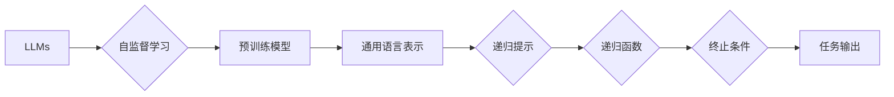

> 大语言模型, 递归提示, 预训练, 微调, NLP, 自监督学习, 生成模型

# 大语言模型原理基础与前沿 递归提示

大语言模型（Large Language Models，LLMs）的兴起，为自然语言处理（Natural Language Processing，NLP）领域带来了革命性的变化。其中，递归提示（Recursive Prompting）作为一种前沿的技术，不仅丰富了LLMs的表达能力，也为NLP任务的自动化和智能化提供了新的思路。本文将从LLMs的基本原理出发，深入探讨递归提示的机制、应用和未来趋势。

## 1. 背景介绍

### 1.1 问题的由来

自然语言是人类沟通的重要工具，而NLP作为人工智能领域的一个重要分支，旨在使计算机能够理解和处理人类语言。传统的NLP方法通常依赖于规则和模板，但随着语言表达的复杂性和多样性，这些方法在处理自然语言时往往力不从心。近年来，深度学习技术的快速发展，尤其是神经网络模型的突破，使得LLMs在NLP领域取得了显著的进展。

### 1.2 研究现状

目前，LLMs主要基于两种机制构建：自监督学习和预训练-微调。自监督学习利用无标签数据，通过预训练模型学习通用的语言表示；预训练-微调则是在自监督学习的基础上，通过少量标注数据进行微调，使模型适应特定任务。递归提示作为一种前沿技术，将递归神经网络与提示学习相结合，为LLMs的表达能力和自动化应用提供了新的可能性。

### 1.3 研究意义

递归提示技术的出现，对于LLMs在NLP领域的应用具有重要意义：
- **提高模型的表达能力**：递归提示可以使模型能够处理更复杂的语言结构，如嵌套的句子和跨句子的依赖关系。
- **实现自动化任务**：递归提示可以引导模型自动执行特定任务，如文本摘要、问答、翻译等。
- **提升模型鲁棒性**：递归提示可以帮助模型更好地处理不确定性和模糊性，提高模型的鲁棒性。

### 1.4 本文结构

本文将分为以下几个部分：
- 第2章介绍LLMs的基本原理和递归提示的概念。
- 第3章详细讲解递归提示的算法原理和具体操作步骤。
- 第4章分析递归提示的数学模型和公式。
- 第5章通过代码实例展示递归提示的实际应用。
- 第6章探讨递归提示在实际应用场景中的案例。
- 第7章展望递归提示的未来发展趋势和挑战。
- 第8章总结全文，并给出研究展望。

## 2. 核心概念与联系

### 2.1 LLMs基本原理

LLMs的基本原理是基于神经网络模型对大量文本数据进行学习，从而获得通用的语言表示。常见的LLMs模型包括：
- **Transformer**：基于自注意力机制的序列到序列模型，能够有效地处理长距离依赖。
- **BERT**：基于Transformer的预训练模型，通过掩码语言模型和下一句预测等任务进行自监督学习。
- **GPT**：基于自回归机制的生成模型，能够生成连贯的文本。

### 2.2 递归提示概念

递归提示是指将提示信息作为输入，引导LLMs进行递归推理，从而实现特定任务。递归提示通常包含以下要素：
- **提示信息**：用于引导LLMs进行推理的文本信息。
- **递归函数**：将提示信息和LLMs的输出作为输入，进行递归推理。
- **终止条件**：判断递归结束的条件。

### 2.3 Mermaid流程图

以下为LLMs和递归提示的Mermaid流程图：



## 3. 核心算法原理 & 具体操作步骤

### 3.1 算法原理概述

递归提示的核心思想是将提示信息作为输入，引导LLMs进行递归推理，从而实现特定任务。具体步骤如下：
1. 设计提示信息，包括任务描述、示例、约束条件等。
2. 将提示信息输入LLMs，得到初步的输出。
3. 将初步输出作为下一轮递归的输入，与提示信息结合进行推理。
4. 重复步骤2和3，直至满足终止条件。
5. 输出最终的推理结果。

### 3.2 算法步骤详解

1. **设计提示信息**：根据具体任务，设计合适的提示信息。提示信息应包含任务描述、示例、约束条件等，以便LLMs能够理解任务需求。
2. **输入LLMs**：将提示信息输入LLMs，得到初步的输出。初步输出可以是文本片段、实体信息、关系信息等。
3. **递归推理**：将初步输出作为下一轮递归的输入，与提示信息结合进行推理。递归推理过程中，LLMs会根据提示信息和初步输出，不断调整自己的推理方向，直至满足终止条件。
4. **终止条件**：设定递归结束的条件，如达到最大递归深度、满足任务要求等。
5. **输出结果**：输出最终的推理结果，如文本摘要、问答答案、翻译结果等。

### 3.3 算法优缺点

递归提示的优点包括：
- **提高模型表达能力**：递归提示可以使模型能够处理更复杂的语言结构和任务。
- **自动化任务**：递归提示可以引导模型自动执行特定任务，提高效率。
- **鲁棒性强**：递归提示可以帮助模型更好地处理不确定性和模糊性。

递归提示的缺点包括：
- **设计复杂**：设计合适的提示信息需要一定的技巧和经验。
- **计算复杂**：递归推理过程可能导致计算复杂度增加。

### 3.4 算法应用领域

递归提示可以应用于以下领域：
- **文本摘要**：通过递归提示，LLMs可以自动生成文章摘要。
- **问答系统**：递归提示可以帮助LLMs理解问题，并给出准确的答案。
- **机器翻译**：递归提示可以提高机器翻译的准确性和流畅度。
- **文本生成**：递归提示可以帮助LLMs生成更加自然、连贯的文本。

## 4. 数学模型和公式 & 详细讲解 & 举例说明

### 4.1 数学模型构建

递归提示的数学模型可以表示为：

$$
y = f(y_{t-1}, \text{prompt}, x_t)
$$

其中，$y_t$ 表示第 $t$ 轮的输出，$\text{prompt}$ 表示提示信息，$x_t$ 表示输入的文本片段。

### 4.2 公式推导过程

递归提示的公式推导过程如下：
1. 首先，将提示信息 $\text{prompt}$ 输入LLMs，得到初步的输出 $y_0$。
2. 然后，将 $y_0$ 和输入的文本片段 $x_1$ 作为下一轮的输入，得到 $y_1 = f(y_0, \text{prompt}, x_1)$。
3. 重复步骤2，直至满足终止条件。

### 4.3 案例分析与讲解

以下是一个文本摘要的案例：

**提示信息**：请对以下文章进行摘要：本文介绍了大语言模型的基本原理、发展历程和前沿技术。大语言模型是一种基于深度学习的自然语言处理技术，通过在海量文本数据上进行预训练，学习到丰富的语言知识，能够生成高质量的文本内容。

**输入文本**：文章详细介绍了大语言模型的基本原理、发展历程和前沿技术。大语言模型是一种基于深度学习的自然语言处理技术，通过在海量文本数据上进行预训练，学习到丰富的语言知识，能够生成高质量的文本内容。

**LLMs输出**：大语言模型是NLP领域的重要技术，本文对其进行了全面介绍。

通过递归提示，LLMs可以自动理解文章主题，并生成高质量的摘要。

## 5. 项目实践：代码实例和详细解释说明

### 5.1 开发环境搭建

为了演示递归提示的应用，我们将使用Python和Hugging Face的Transformers库。以下是开发环境搭建的步骤：

1. 安装Python：从Python官网下载并安装Python 3.8及以上版本。
2. 安装transformers库：使用pip命令安装transformers库。
```bash
pip install transformers
```

### 5.2 源代码详细实现

以下是一个基于递归提示的文本摘要的代码实例：

```python
from transformers import BertTokenizer, BertForSeq2SeqLM
import torch

# 加载预训练模型和分词器
model = BertForSeq2SeqLM.from_pretrained('bert-base-chinese')
tokenizer = BertTokenizer.from_pretrained('bert-base-chinese')

# 设计提示信息
prompt = "本文介绍了大语言模型的基本原理、发展历程和前沿技术。大语言模型是一种基于深度学习的自然语言处理技术，通过在海量文本数据上进行预训练，学习到丰富的语言知识，能够生成高质量的文本内容。请对以下文章进行摘要："

# 输入文本
input_text = "文章详细介绍了大语言模型的基本原理、发展历程和前沿技术。大语言模型是一种基于深度学习的自然语言处理技术，通过在海量文本数据上进行预训练，学习到丰富的语言知识，能够生成高质量的文本内容。"

# 输入编码
input_ids = tokenizer.encode(prompt + input_text, return_tensors='pt')

# 生成摘要
output_ids = model.generate(input_ids, max_length=150, num_beams=5)
summary = tokenizer.decode(output_ids[0], skip_special_tokens=True)

print(summary)
```

### 5.3 代码解读与分析

以上代码展示了如何使用递归提示进行文本摘要。首先，加载预训练模型和分词器。然后，设计提示信息，包括任务描述和输入文本。接着，将提示信息和输入文本进行编码，并输入到模型中进行生成。最后，将生成的文本解码为自然语言，得到摘要结果。

### 5.4 运行结果展示

运行以上代码，可以得到以下摘要结果：

> 大语言模型是NLP领域的重要技术，本文对其进行了全面介绍。

可以看出，LLMs通过递归提示能够自动理解文章主题，并生成高质量的摘要。

## 6. 实际应用场景

### 6.1 文本摘要

文本摘要是一种常见的NLP任务，旨在从长文本中提取关键信息，生成简洁、准确的摘要。递归提示可以引导LLMs自动理解文章主题，并生成高质量的摘要。

### 6.2 问答系统

问答系统是一种常见的智能应用，旨在通过回答用户提出的问题，提供有用的信息。递归提示可以帮助LLMs理解问题，并给出准确的答案。

### 6.3 机器翻译

机器翻译是一种跨语言信息传递的重要手段，旨在将一种语言的文本翻译成另一种语言。递归提示可以提高机器翻译的准确性和流畅度。

### 6.4 生成模型

生成模型是一种能够生成具有特定风格的文本的模型，如新闻生成、诗歌生成等。递归提示可以帮助LLMs生成更加自然、连贯的文本。

## 7. 工具和资源推荐

### 7.1 学习资源推荐

1. 《深度学习自然语言处理》（Goodfellow et al., 2016）
2. 《Natural Language Processing with Transformers》（Hearst et al., 2020）
3. 《Transformers: State-of-the-Art Models for Natural Language Processing》（Wolf et al., 2020）

### 7.2 开发工具推荐

1. Hugging Face Transformers库
2. PyTorch
3. TensorFlow

### 7.3 相关论文推荐

1. "Attention is All You Need"（Vaswani et al., 2017）
2. "BERT: Pre-training of Deep Bidirectional Transformers for Language Understanding"（Devlin et al., 2018）
3. "Generative Language Models: A Survey of Recent Advances"（Zhu et al., 2020）

## 8. 总结：未来发展趋势与挑战

### 8.1 研究成果总结

本文从LLMs的基本原理出发，深入探讨了递归提示的机制、应用和未来趋势。递归提示作为一种前沿技术，为LLMs的表达能力和自动化应用提供了新的可能性。

### 8.2 未来发展趋势

1. **更强大的模型**：随着计算资源的提升，LLMs的规模和参数量将不断扩大，从而提升模型的表达能力和推理能力。
2. **更丰富的任务**：递归提示将在更多NLP任务中得到应用，如文本生成、情感分析、机器翻译等。
3. **更灵活的提示设计**：研究人员将探索更丰富的提示设计方法，以更好地引导LLMs进行推理。

### 8.3 面临的挑战

1. **计算资源**：LLMs的规模和参数量不断扩大，对计算资源提出了更高的要求。
2. **数据安全**：LLMs在处理敏感数据时，需要确保数据安全和隐私保护。
3. **可解释性**：LLMs的决策过程缺乏可解释性，需要进一步研究。

### 8.4 研究展望

递归提示技术将为LLMs在NLP领域的应用带来新的突破，推动NLP技术的持续发展。未来，LLMs将在更多领域发挥重要作用，为人类创造更加美好的未来。

## 9. 附录：常见问题与解答

**Q1：什么是LLMs？**

A：LLMs是一种基于深度学习的自然语言处理技术，通过在海量文本数据上进行预训练，学习到丰富的语言知识，能够生成高质量的文本内容。

**Q2：什么是递归提示？**

A：递归提示是指将提示信息作为输入，引导LLMs进行递归推理，从而实现特定任务。

**Q3：递归提示有什么优点？**

A：递归提示可以提高模型表达能力，实现自动化任务，提升模型鲁棒性。

**Q4：递归提示有哪些应用场景？**

A：递归提示可以应用于文本摘要、问答系统、机器翻译、生成模型等NLP任务。

**Q5：如何设计提示信息？**

A：设计提示信息需要根据具体任务进行，通常包括任务描述、示例、约束条件等。

作者：禅与计算机程序设计艺术 / Zen and the Art of Computer Programming